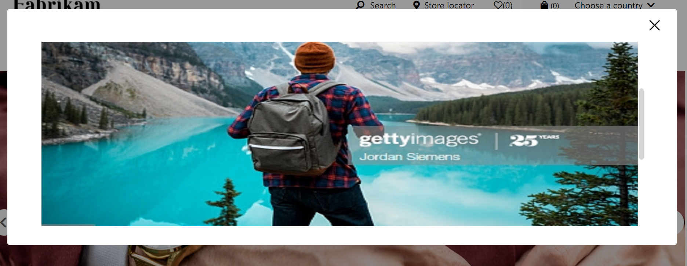
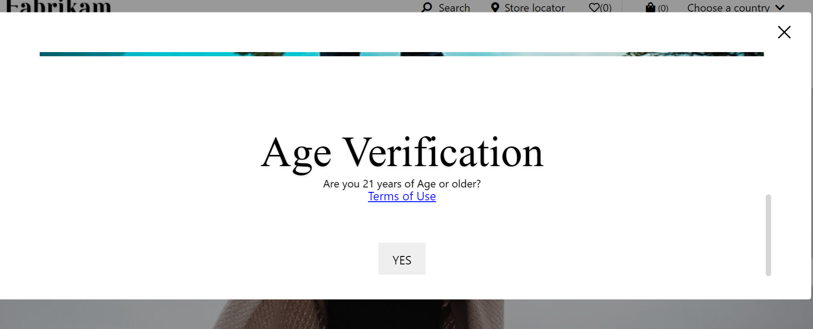

# Dynamics 365 Commerce - online extensibility samples

## License
License is listed in the [LICENSE](./LICENSE) file.

# Sample - Age Gate

## Overview
In this sample, you will learn how to implement age gate pop up in page load.
It contains some information as a content-block and a consent button. Consent button will trigger an event to write cookie that suggests that the appropriate action has taken place.




## Starter kit license
License for starter kit is listed in the [LICENSE](./module-library/LICENSE) .

## Prerequisites
Follow the instructions mentioned in [document](https://docs.microsoft.com/en-us/dynamics365/commerce/e-commerce-extensibility/setup-dev-environment) to set up the development environment.

### Procedure to create custom theme
Follow the instructions mentioned in [document](https://docs.microsoft.com/en-us/dynamics365/commerce/e-commerce-extensibility/create-theme) to create the custom theme

Create a theme folder with name fabrikam-extended.

## Detailed Steps

### 1.Add Age-gate module
Add age-gate module using this command **yarn msdyn365 add-module age-gate**.

Go to age-gate.definition.json under **src/Modules/age-gate** and replace existing code with below code.

```json
{
    "$type": "containerModule",
    "friendlyName": "Age Gate",
    "name": "age-gate",
    "description": "The age-gate module pops up at page load. It will contain some information and a button. Button will trigger an event to write cookie that suggests that the appropriate action has taken place",
    "categories": ["age-gate"],
    "slots": {
        "content": {
            "friendlyName": "Content Slot",
            "description": "Content slot",
            "allowedTypes": [ "content-block" ],
            "min": 1,
            "max": 10
        }
    },
    "config": {
        "heading": {
            "friendlyName": "Heading",
            "description": "Provide a heading",
            "type": "string",
            "default": ""
        },
        "consentButtonText":{
            "friendlyName": "Consent button text",
            "description": "Text for consent button",
            "type": "string",
            "default": "Yes",
            "required": false
        },
        "className": {
            "friendlyName": "age-gate",
            "description": "Provide a custom css class name defined in the theme pack to target the CSS for this module",
            "type": "string",
            "default": ""
        }
    },
    "resources": {
        "ageGateAriaLabel": {
            "value": "Age Gate",
            "comment": "Aria label for Age Gate"
        }
    }
}
```

Go to age-gate.tsx under **src/Modules/age-gate** and replace existing code with below code.
```typescript
/*---------------------------------------------------------------------------------------------
 * Copyright (c) Microsoft Corporation. All rights reserved.
 * Licensed under the MIT License. See License.txt in the project root for license information.
 *--------------------------------------------------------------------------------------------*/

import * as Msdyn365 from '@msdyn365-commerce/core';
import { Button, IModuleProps, INodeProps, Modal, ModalBody, ModalHeader } from '@msdyn365-commerce-modules/utilities';
import classnames from 'classnames';
import * as React from 'react';
import { IAgeGateProps, IAgeGateConfig } from './age-gate.props.autogenerated';

/**
 * Consent button options.
 */
enum consentButton {
    DEFAULT_TEXT = 'YES'
}

/**
 * Cookie value options.
 */
enum cookieValueAgeVerified {
    TRUE = 'true',
    FALSE = 'false'
}

/**
 * Age Gate state.
 */
export interface IAgeGateState {
    isVisible: boolean;
}

/**
 * Age Gate view props.
 */
export interface IAgeGateViewProps extends IAgeGateProps<IAgeGateConfig> {
    moduleProps: IModuleProps;
    headerContainerProps: INodeProps;
    headerProps?: React.ReactNode;
    bodyContainerProps: INodeProps;
    bodyContent: React.ReactNode;
    consentButton: React.ReactNode;
    className: string;
    onDismiss(): void;
}

/**
 *
 * Age Gate component.
 * @extends {React.PureComponent<IAgeGateProps<IAgeGateConfig>, IAgeGateState>}
 */
class AgeGate extends React.PureComponent<IAgeGateProps<IAgeGateConfig>, IAgeGateState> {
    constructor(props: IAgeGateProps<IAgeGateConfig>) {
        super(props);
        this.state = { isVisible: false };
    }

    public componentDidMount(): void {
        const { ageGateCookieName } = this.props.context.app.config;
        const cookieName = (ageGateCookieName as string) || '_msdyn365__ageGate_';

        if (!this._isActionTaken(cookieName)) {
            this.setState({
                isVisible: true
            });
        }
    }

    public render(): JSX.Element | null {
        const {
            config: { className, heading, consentButtonText },
            slots: { content },
            resources
        } = this.props;

        const viewProps = {
            ...this.props,
            onDismiss: this._onDismiss,
            moduleProps: {
                tag: Modal,
                moduleProps: this.props,
                className: classnames('ms-age-gate', className),
                autoFocus: true,
                backdrop: 'static',
                fade: true,
                isOpen: this.state.isVisible,
                'aria-label': heading ?? resources.ageGateAriaLabel,
                onClosed: this._onDismiss,
                horizontalPosition: 'center',
                verticalPosition: 'center',
                toggle: this._onDismiss
            },
            headerContainerProps: {
                tag: ModalHeader,
                className: 'ms-age-gate__modal-header',
                toggle: this._onDismiss
            },
            headerProps: heading && (
                <Msdyn365.Text
                    className='ms-age-gate__modal-title'
                    {...heading}
                    tag='h2'
                    text={heading}
                    editProps={{ onEdit: this.handleHeadingChange, requestContext: this.props.context.request }}
                />
            ),
            bodyContainerProps: {
                tag: ModalBody,
                className: 'ms-age-gate__modal-body'
            },
            bodyContent: content.map((item: React.ReactNode, index: number) => this._getContentItem(item, index)),
            consentButton: (
                <Button
                    className={'ms-age-gate__accept-button'}
                    title={consentButtonText || consentButton.DEFAULT_TEXT}
                    onClick={this._handleConsent}
                >
                    {consentButtonText || consentButton.DEFAULT_TEXT}
                </Button>
            )
        };

        return this.props.renderView(viewProps) as React.ReactElement;
    }

    /**
     * Handle the heading change event.
     * @param event - Content Editable Event.
     */
    public handleHeadingChange = (event: Msdyn365.ContentEditableEvent): void => {
        this.props.config.heading = event.target.value;
    };

    /**
     * _isActionTaken method - To check cookie value.
     * @param cookieName - Cookie name.
     * @returns - Boolean value for existence of cookie or it's value itself.
     */
    private readonly _isActionTaken = (cookieName: string): boolean => {
        const cookies = this.props.context.request.cookies;
        const ageGateCookie = cookies.get(cookieName) as Msdyn365.ICookieValue<{}> | undefined;
        if (!ageGateCookie || ageGateCookie.value === cookieValueAgeVerified.FALSE) {
            return false;
        }
        return !!ageGateCookie.value;
    };

    /**
     * _onDismiss method - To dismiss age-gate pop up.
     */
    private readonly _onDismiss = (): void => {
        this.setState({
            isVisible: false
        });
    };

    /**
     * _handleConsent method - To handle consent.
     */
    private readonly _handleConsent = (): void => {
        const { ageGateCookieName } = this.props.context.app.config;
        const { cookies } = this.props.context.request;
        const cookieAge: number = 172800;
        const cookieName = (ageGateCookieName as string) || '_msdyn365__ageGate_';
        cookies?.set(cookieName, cookieValueAgeVerified.TRUE, { maxAge: cookieAge });
        this._onDismiss();
    };

    /**
     * _getContentItem method - To get age gate pop up content.
     * @param item - Age gate pop up item.
     * @param index - Index.
     * @returns - Age gate pop up content as react element.
     */
    private readonly _getContentItem = (item: React.ReactNode, index: number): React.ReactNode => {
        return <React.Fragment key={index}>{React.cloneElement(item as React.ReactElement)}</React.Fragment>;
    };
}

export default AgeGate;
```

Go to age-gate.view.tsx under **src/Modules/age-gate** and replace existing code with below code.
```typescript
/*---------------------------------------------------------------------------------------------
 * Copyright (c) Microsoft Corporation. All rights reserved.
 * Licensed under the MIT License. See License.txt in the project root for license information.
 *--------------------------------------------------------------------------------------------*/

import { Module, Node } from '@msdyn365-commerce-modules/utilities';
import * as React from 'react';

import { IAgeGateViewProps } from './age-gate';

/**
 * View component.
 * @param props - The view properties.
 * @returns - Age gate view.
 */
export const ageGateView: React.FC<IAgeGateViewProps> = props => {
    const { moduleProps, headerContainerProps, headerProps, bodyContainerProps, bodyContent, consentButton } = props;

    return (
        <Module {...moduleProps}>
            <Node {...headerContainerProps}>{headerProps}</Node>
            <Node {...bodyContainerProps}>
                {bodyContent}
                {consentButton}
            </Node>
        </Module>
    );
};

export default ageGateView;
```
### 2. Add Style file

Create a file with name age-gate.scss under **src/themes/fabrikam-extended/styles/04-modules** and replace code with below code.and add reference of the file in index.scss file
```scss

$age-gate-title-font-size: 64px;
:root {
    //Text theme
    --msv-age-gate-textheme-dark: var(--msv-font-primary-color);
    --msv-age-gate-textheme-light: var(--msv-font-secondary-color);

    // Heading
    --msv-age-gate-heading-size: #{$age-gate-title-font-size};

    //Body
    --msv-age-gate-body-size: #{$msv-font-size-m};

    //Cta
    --msv-age-gate-cta-color: var(--msv-accent-brand-color);
}

.msc-modal__dialog.ms-age-gate.fabrikam-pop-up {
    background: $msv-white;
    padding: 60px 60px 35px;
    text-align: center;
    width: 95%;
    max-width: 1280px;
    margin: auto;
    position: relative;
    border-radius: 4px;
    .msc-modal__content {
        padding: 0;
        position: static;

        .ms-age-gate__modal-header.msc-modal__header {
            margin-bottom: 0;

            .msc-modal__close-button {
                top: 10px;
                right: 20px;
                padding: 10px;
                &::before {
                    content: "";
                    background: url(https://files-us-prod.cms.commerce.dynamics.com/cms/api/qdhmsxlvbl/binary/MA2QTV);
                    height: 20px;
                    width: 20px;
                }
            }
        }
        .ms-age-gate__modal-body.msc-modal__body {
            margin-bottom: 0;

            .age-gate.ms-content-block {
                .ms-content-block__details {
                    align-items: flex-start;
                    bottom: 0;
                    display: flex;
                    flex-direction: column;
                    justify-content: flex-start;
                    left: 0;
                    padding: 48px 60px 60px 60px;
                    right: 0;
                    top: 0;
                    align-items: center !important;
            
                    .ms-content-block__title {
                        @include fabrikam-font(var(--msv-font-weight-normal),
                        var(--msv-age-gate-heading-size) ,$homepage-age-gate-title-line-height, none, $msv-font-cinzel);
                        color: var(--msv-age-gate-textheme-dark);
                    }
            
                    .ms-content-block__text {
                        color: var(--msv-age-gate-textheme-dark);
                        font-size: var(--msv-age-gate-body-size);
                    }
            
                    .msc-cta__primary {
                        font-size: var(--msv-body-font-size-l);
                        line-height: var(--msv-body-line-height-l);
                        text-decoration: underline;
                        color: $msv-blue;
                    }
                }
            
                &.texttheme__light .ms-content-block__title, &.texttheme__light .ms-content-block__text {
                    text-shadow: $hero-content-shadow;
                }
            
                &.texttheme__dark .ms-content-block__title, &.texttheme__dark .ms-content-block__text {
                    color: var(--msv-age-gate-textheme-dark);
                }
            }
            

            .ms-age-gate__accept-button.msc-btn {
                display: none;
            }
        }
    }
}
```

## Build and test module

### Testing the age-gate module using page mock

#### 1.Create a default-page.json file under **src/pageMocks** 
Generate mock file and replace content into the default-page.json mock file
Go to default-page.json file and add the below mock file inside header module

```json
 {
        "id": "AgeGateModule",
        "typeName": "age-gate",
        "config": {
            "consentButtonText": "YES",
            "className":"fabrikam-pop-up"
        },
        "modules": {
            "content": [
                {
                    "typeName": "content-block",
                    "id": "content-block__000011",
                    "friendlyName": "Content block 1",
                    "config": {
                        "msdyn365__moduleLayout": "full-width",
                        "heading": { "text": "Age Verification", "tag": "h2" },
                        "paragraph": "<p>Are you 21 years of Age or older?</p>\n",
                        "image": {
                            "$type": "image",
                            "_id": "SBnpT",
                            "src": "https://images-us-prod.cms.commerce.dynamics.com/cms/api/qdhmsxlvbl/imageFileData/SBnpU?ver=a608",
                            "altText": "Age gate image",
                            "copyright": "",
                            "binaryHash": "JFcb5fKOoKlmpR2IjyvP3g==",
                            "title": "Age gate image",
                            "imageSettings": {
                                "quality": 80,
                                "disableLazyLoad": false,
                                "lazyload": true,
                                "viewports": {
                                    "xs": { "w": 800, "h": 600, "q": "w=800&h=600&q=80&m=6&f=jpg" },
                                    "sm": { "w": 1200, "h": 900, "q": "w=1200&h=900&q=80&m=6&f=jpg" },
                                    "md": { "w": 1440, "h": 850, "q": "w=1440&h=850&q=80&m=6&f=jpg" },
                                    "lg": { "w": 1440, "h": 850, "q": "w=1440&h=850&q=80&m=6&f=jpg" },
                                    "xl": { "w": 1440, "h": 850, "q": "w=1440&h=850&q=80&m=6&f=jpg" }
                                }
                            }
                        },
                        "links": [
                            {
                                "linkText": "Sample link",
                                "linkUrl": { "type": "categoryLink", "categoryId": 68719478036 },
                                "ariaLabel": "get the look"
                            }
                        ],
                        "className": "age-gate textplacement__left texttheme__light"
                    },
                    "data": {}
                }
            ]
        }
    },
```

#### 2. Run and Test the module
The sample can now be tested in a web browser using the ```yarn start``` command.

Test the module using page mock, Go to browser and copy paste the below url
https://localhost:4000/page?mock=default-page&theme=fabrikam-extended 
(ensure that you have the  [MSDyn365_HOST environment](https://docs.microsoft.com/en-us/dynamics365/commerce/e-commerce-extensibility/configure-env-file#msdyn365_host) variable properly set). 

## Third party Image and Video Usage restrictions

The software may include third party images and videos that are for personal use only and may not be copied except as provided by Microsoft within the demo websites.  You may install and use an unlimited number of copies of the demo websites., You may not publish, rent, lease, lend, or redistribute any images or videos without authorization from the rights holder, except and only to the extent that the applicable copyright law expressly permits doing so.
