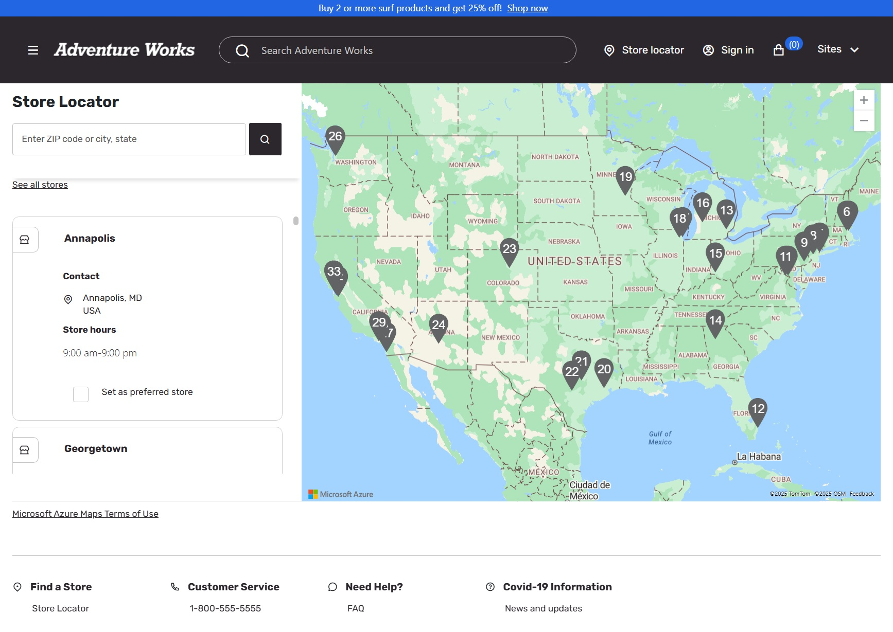

# Dynamics 365 Commerce - online extensibility samples

## License
License is listed in the [LICENSE](./LICENSE) file.

# Sample - AzureMaps customization

## Overview
The objective of the sample is to leverage the Azure Maps control to display a map with a pin for the store location. The sample demonstrates how to use the Azure Maps control in a Dynamics 365 Commerce module and how to customize the address, store-selector modules to use AzureMaps.



## Starter kit license
License for starter kit is listed in the [LICENSE](./module-library/LICENSE) .

## Prerequisites
Follow the instructions mentioned in [document](https://docs.microsoft.com/en-us/dynamics365/commerce/e-commerce-extensibility/setup-dev-environment) to set up the development environment.

### Procedure to extend theme from base theme
Follow the instructions mentioned in [document](https://learn.microsoft.com/en-us/dynamics365/commerce/e-commerce-extensibility/extend-theme) to extend the theme

Create a theme with name ``adventureworks-extended`` for extending adventureworks theme.

### Procedure to clone the module
Follow the instructions mentioned in [document](https://learn.microsoft.com/en-us/dynamics365/commerce/e-commerce-extensibility/clone-starter-module) to clone the module.

Extend the modules with prefix **custom-** for the following modules:
- **checkout-shipping-address**: This module is used to display the address form in the checkout process.
- **checkout-billing-address**: This module is used to display the billing address form in the checkout process.
- **business-account-address**: This module is used to display the address form in the business account process.
- **account-management-address**: This module is used to display the address form in the account management process.
- **store-selector**: This module is used to display the store selector in multiple places in the site.

## Detailed Steps

### 1. Add store-selector CSS styles

In this step we will add SCSS for the store-selector.
After extending the theme, you will see a folder **src/themes/adventureworks-extended** created under **src**. This is where we will add our customizations.
Create a folder **modules** under **src/themes/adventureworks-extended/styles**

- Create a file **store-selector.scss** under **src/themes/adventureworks-extended/styles/modules** and add the below code. You will need to reference this file in index.scss file in the same folder.
    ```scss
    .ms-store-select {
        &__search {
            &-form {
                .MicrosoftMap {

                    .as_container_search {
                        position: absolute;
                        z-index: 2000;
                        visibility: visible;
                    }

                    .as_container {
                        .suggestLink {
                            display: block;
                            margin: 0;
                            padding: 8px 12px 8px 12px;

                            &:hover {
                                background-color: #DCECF8;
                            }

                            &.selected {
                                background-color: #DCECF8;
                                outline: auto;
                            }
                        }

                        .as_img {
                            width: 30px;
                            height: 30px;
                            margin-right: 0;
                            background-position: left center;
                            display: inline-block;
                            padding-right: 12px;
                            background-repeat: no-repeat;
                            flex: 1 1 auto;
                            background-image: url("data:image/png;base64,iVBORw0KGgoAAAANSUhEUgAAAB4AAAAeBAMAAADJHrORAAAAMFBMVEVHcExtbnFtbnFtbnFtbnFtbnFtbnFtbnFtbnFtbnFtbnH////S0tO2t7ikpaaSkpU+nsJBAAAACnRSTlMA3BA4kMBlIICgSzf0sQAAAI1JREFUGJVjYKAJMOtIRuaqrFq1ygnBZZIC8hcWwPmsq9bf/bUqAM7PWnV6955Vy+B8r/W7d+/+tQTOj1oL5N9aCudLgfkLEfLrgPxXCHl087RWrTvzatUiOJ9zFQhMgPPZwXyE+xi6gNwVSP5RBPKFkPjMQL4Bsoe9Vi1B5jIwrhJA4bMjmw4Cxgy0AQDoZT5XEngrBgAAAABJRU5ErkJggg==");
                        }

                        .as_suggestion_root_inside {
                            display: inline-flex;
                            width: 100%;
                        }

                        .nearBySearchText {
                            padding: 10px 0 0 12px;
                            white-space: nowrap;
                            overflow: hidden;
                            text-overflow: ellipsis;
                        }

                        ul {
                            list-style: none;
                            padding: 8px 0;
                            margin: 0;

                            li {
                                width: 100%;
                                margin: 0;
                                color: $msv-black;
                                text-decoration: none;
                                box-sizing: border-box;

                                &:hover {
                                    cursor: pointer;
                                }

                                .line1 {
                                    font-size: $msv-font-size-s;
                                    font-weight: $msv-font-weight-500;
                                    white-space: normal;
                                    text-overflow: ellipsis;
                                    margin: 0;
                                    width: 100%;
                                    line-height: 1.2em;
                                }

                                .line2 {
                                    font-size: $msv-font-size-xs;
                                    white-space: normal;
                                    text-overflow: ellipsis;
                                    margin: 0;
                                    width: 100%;
                                }
                            }
                        }

                        .as_lines_root {
                            display: inline-block;
                            flex: 1 1 99%;
                            vertical-align: middle;
                        }
                    }
                }
            }
        }
    }
    ```
- Create a file **address.scss** under **src/themes/adventureworks-extended/styles/modules** and add the below code. You will need to reference this file in index.scss file in the same folder.
    ```scss
    .msc-address-form {
        .MicrosoftMap {
            .as_container_search {
                position: absolute;
                z-index: 2000;
                visibility: visible;
            }

            .asOuterContainer {
                background-color: $msv-white;
            }

            .as_container {
                .suggestLink {
                    display: block;
                    margin: 0;
                    padding: 8px 12px 8px 12px;
                    color: var(--msv-link-font-color);
                    font-size: $msv-font-size-ml;

                    &:hover {
                        background-color: #DCECF8;
                    }

                    &.selected {
                        background-color: #DCECF8;
                        outline: auto;
                    }
                }

                .as_img {
                    width: 30px;
                    height: 30px;
                    margin-right: 0;
                    background-position: left center;
                    display: inline-block;
                    padding-right: 12px;
                    background-repeat: no-repeat;
                    flex: 1 1 auto;
                    background-image: url("data:image/png;base64,iVBORw0KGgoAAAANSUhEUgAAAB4AAAAeBAMAAADJHrORAAAAMFBMVEVHcExtbnFtbnFtbnFtbnFtbnFtbnFtbnFtbnFtbnFtbnH////S0tO2t7ikpaaSkpU+nsJBAAAACnRSTlMA3BA4kMBlIICgSzf0sQAAAI1JREFUGJVjYKAJMOtIRuaqrFq1ygnBZZIC8hcWwPmsq9bf/bUqAM7PWnV6955Vy+B8r/W7d+/+tQTOj1oL5N9aCudLgfkLEfLrgPxXCHl087RWrTvzatUiOJ9zFQhMgPPZwXyE+xi6gNwVSP5RBPKFkPjMQL4Bsoe9Vi1B5jIwrhJA4bMjmw4Cxgy0AQDoZT5XEngrBgAAAABJRU5ErkJggg==");
                }

                .as_suggestion_root_inside {
                    display: inline-flex;
                    width: 100%;
                }

                .nearBySearchText {
                    padding: 10px 0 0 12px;
                    white-space: nowrap;
                    overflow: hidden;
                    text-overflow: ellipsis;
                }

                ul {
                    list-style: none;
                    padding: 8px 0;
                    margin: 0;

                    li {
                        width: 100%;
                        margin: 0;
                        color: $msv-black;
                        text-decoration: none;
                        box-sizing: border-box;

                        &:hover {
                            cursor: pointer;
                        }

                        .line1 {
                            font-size: $msv-font-size-s;
                            font-weight: $msv-font-weight-500;
                            white-space: normal;
                            text-overflow: ellipsis;
                            margin: 0;
                            width: 100%;
                            line-height: 1.2em;
                        }

                        .line2 {
                            font-size: $msv-font-size-xs;
                            white-space: normal;
                            text-overflow: ellipsis;
                            margin: 0;
                            width: 100%;
                        }
                    }
                }

                .as_lines_root {
                    display: inline-block;
                    flex: 1 1 99%;
                    vertical-align: middle;
                }
            }
        }
    }
    ```

### 2. Clone the related modules

As mentioned in the prerequisites, clone the modules **checkout-shipping-address**, **checkout-billing-address**, **business-account-address**, **account-management-address** and **store-selector** with prefix **custom-**. The cloned modules will be used to customize the address form and store selector to use Azure Maps.
The cloned modules are to be copied under **src/modules** folder.

### 3. Copy the Azure Maps module

The Azure Maps module is already available in the **src/modules** folder in this repo. The module is named **azure-maps**. Use this sample module as reference or directly copy the module to your **src/modules** folder.

### 4. Customize the cloned modules

> **Note:** In this sample, the existing configuration keys `BingMapsEnabled` and `BingMapsAPIKey` are being used as placeholders for the upcoming `AzureMapsEnabled` and `AzureMapsAPIKey` fields, which are expected to be introduced in version 9.55.x. Once these new fields are available in future releases, they will replace the current keys to enable Azure Maps functionality.

##### 4.1 Customize the address form modules
The address form modules are **custom-checkout-shipping-address**, **custom-checkout-billing-address**, **custom-business-account-address** and **custom-account-management-address**.
Copy the following components from SSK to a **common** folder under **src/** while renaming them to include **custom-** prefix:
- components/custom-address-add.tsx
    Following changes are to be made in the **custom-address-add.tsx**:
    - Add following interfaces to the file:
        ```ts
        interface ISearchResultAddress {
            streetNumber?: string;
            streetName?: string;
            municipality?: string;
            countrySecondarySubdivision?: string;
            countrySubdivision?: string;
            postalCode?: string;
            extendedPostalCode?: string;
            countryCode?: string;
            country?: string;
            countryCodeISO3?: string;
            freeformAddress?: string;
            countrySubdivisionName?: string;
            localName?: string;
            countrySubdivisionCode?: string;
        }

        interface ISuggestion {
            formattedSuggestion: string;
            title: string;
            subtitle: string;
            address: ISearchResultAddress;
        }
        ```
    - Add the following field to IAddressAddInputProps interface:
        ```ts
        onAzureMapsSuggestionSelected?(result: ISuggestion): Promise<void>;
        channel?: ChannelConfiguration;
        locale?: string;
        countryRegionId?: string;
        ```
    - Import the custom-address-input.tsx component and use it in the render method of the component.
    - Ensure that `onAzureMapsSuggestionSelected`, `locale`, `channel`, `countryRegionId` are passed as an input to the `<AddressInputComponent>` imported from `custom-address-input.tsx`.

- components/custom-address-checkbox.tsx

- components/custom-address-input.tsx
    ```tsx
    /*!
    * Copyright (c) Microsoft Corporation.
    * All rights reserved. See LICENSE in the project root for license information.
    */

    import { getPayloadObject, getTelemetryAttributes, ITelemetryContent } from '@msdyn365-commerce-modules/utilities';
    import * as React from 'react';
    import { ChannelConfiguration } from '@msdyn365-commerce/retail-proxy';
    import { SearchURL, MapsURL, SubscriptionKeyCredential, Aborter } from 'azure-maps-rest'; // Azure Maps search dependencies

    export interface IAdressInput {
        id?: string;
        name?: string;
        className: string;
        type: string;
        value: string;
        maxLength?: number;
        autoFocus?: boolean;
        additionalAddributes?: object;
        telemetryContent?: ITelemetryContent;
        onChange(event: React.ChangeEvent<HTMLInputElement>): void;

        // Azure Maps search related
        useAzureMaps?: boolean;
        autoSuggestionEnabled?: boolean;
        autoSuggestOptions?: Microsoft.Maps.IAutosuggestOptions;
        channel?: ChannelConfiguration;
        locale?: string;
        countryRegionId?: string;
        isMapAPILoaded?: boolean;
        onAzureMapsSuggestionSelected?(suggestion: ISuggestion): void;
    }

    interface IStoreSelectorSearchFormState {
        suggestions: ISuggestion[];
        activeSuggestionId: string;
        activeSuggestionIndex: number;
        value: string;
        isSearchResultOpened: boolean;
    }

    interface ISearchResultAddress {
        streetNumber?: string;
        streetName?: string;
        municipality?: string;
        countrySecondarySubdivision?: string;
        countrySubdivision?: string;
        postalCode?: string;
        extendedPostalCode?: string;
        countryCode?: string;
        country?: string;
        countryCodeISO3?: string;
        freeformAddress?: string;
        countrySubdivisionName?: string;
        localName?: string;
        countrySubdivisionCode?: string;
    }

    export interface ISuggestion {
        formattedSuggestion: string;
        title: string;
        subtitle: string;

        address: ISearchResultAddress;
    }
    /**
    * Address input.
    * @param props - Configuration of the functional component.
    * @returns React functional component.
    */
    export const AddressInputFunctionComponent: React.FC<IAdressInput> = (props: IAdressInput) => {
        const {
            id: itemId,
            name,
            className,
            type,
            value,
            maxLength,
            additionalAddributes,
            autoFocus: shouldUseAutoFocus,
            telemetryContent,
            onChange,
            onAzureMapsSuggestionSelected,
            countryRegionId,
            locale,
            channel
        } = props;
        const [state, setState] = React.useState<IStoreSelectorSearchFormState>({
            suggestions: [],
            activeSuggestionId: '',
            activeSuggestionIndex: -1,
            value: props.value || '',
            isSearchResultOpened: false
        });

        const payLoad = getPayloadObject('click', telemetryContent!, name!);
        const attributes = getTelemetryAttributes(telemetryContent!, payLoad);

        const pipeline = MapsURL.newPipeline(new SubscriptionKeyCredential(channel?.BingMapsApiKey || ''));
        const azureMapsSearchClient: SearchURL = new SearchURL(pipeline);

        const onTextInputChange = (event: React.ChangeEvent<HTMLInputElement>) => {
            const inputValue: string = event.target.value;
            setState(prevState => ({
                ...prevState,
                value: inputValue
            }));
            if (inputValue && inputValue !== '' && name === 'Street') {
                getSuggestions(inputValue).then(suggestions => {
                    setState(prevState => ({
                        ...prevState,
                        suggestions: suggestions,
                        isSearchResultOpened: true
                    }));
                });
            } else if (inputValue === '') {
                setState(prevState => ({
                    ...prevState,
                    suggestions: [],
                    isSearchResultOpened: false
                }));
            }
            onChange(event);
        };

        const _onSuggestionSelected = (suggestion: ISuggestion): void => {
            setState(prevState => ({
                ...prevState,
                isSearchResultOpened: false,
                value: suggestion.formattedSuggestion,
                suggestions: []
            }));
            if (onAzureMapsSuggestionSelected) {
                onAzureMapsSuggestionSelected(suggestion);
            }
        };

        const getSuggestions = async (query: string): Promise<ISuggestion[]> => {
            return new Promise((resolve, reject) => {
                azureMapsSearchClient
                    .searchFuzzy(Aborter.timeout(10000), query, {
                        limit: 5,
                        maxFuzzyLevel: 1,
                        language: locale,
                        typeahead: true,
                        countrySet: [countryRegionId ?? 'US'],
                        entityType: ['Municipality']
                    })
                    .then(response => {
                        resolve(
                            response.results?.map(result => ({
                                formattedSuggestion: result.address?.freeformAddress || '',
                                title: result.address?.freeformAddress || '',
                                subtitle: result.address?.municipality || '',
                                address: result.address ?? {}
                            })) || []
                        );
                    })
                    .catch(error => {
                        console.error('Error fetching suggestions from Azure Maps:', error);
                        reject([]);
                    });
            });
        };
        const suggestionListView = state.suggestions.map((suggestion: ISuggestion, index: number) => (
            <li
                key={index}
                id={`result-as-${index}`}
                role='listitem'
                aria-selected={state.activeSuggestionId === `result-as-${index}`}
                aria-label={`${suggestion.formattedSuggestion}, item ${index + 1}`}
                onClick={() => _onSuggestionSelected(suggestion)}
                tabIndex={0}
            >
                <div className={`suggestLink ${state.activeSuggestionId === `result-as-${index}` ? 'selected' : ''}`} data-tag='as_suggestion'>
                    <div className='as_suggestion_root_inside' data-tag='as_suggestion_root_inside'>
                        <div className='as_img maps_address' data-tag='as_img'></div>
                        <div className='as_lines_root' data-tag='as_lines_root'>
                            <p className='line1' data-tag='as_suggestion_line'>
                                {suggestion.title}
                            </p>
                            <p className='line2' data-tag='as_suggestion_line'>
                                {suggestion.subtitle}
                            </p>
                        </div>
                    </div>
                </div>
            </li>
        ));
        return (
            <>
                <input
                    name={name}
                    id={itemId}
                    className={`${className}__input ${className}__input-${type}`}
                    type={type}
                    autoFocus={shouldUseAutoFocus}
                    value={value}
                    maxLength={maxLength}
                    {...(additionalAddributes || {})}
                    {...attributes}
                    onChange={onTextInputChange}
                />
                {name === 'Street' && (
                    <div className='MicrosoftMap'>
                        <div
                            className='as_container_search as_container'
                            id={`as_containerSearch_${itemId}`}
                            data-tag='as_container'
                            style={{ display: state.isSearchResultOpened ? 'block' : 'none' }}
                        >
                            <div className='b_cards asOuterContainer'>
                                <ul role='list'>{suggestionListView}</ul>
                            </div>
                            <div className='clear'></div>
                        </div>
                    </div>
                )}
            </>
        );
    };

    export default AddressInputFunctionComponent;
    ```
- components/index.ts
    - Import the custom-address-add, custom-address-input and custom-address-checkbox components in the `src/common/components/index.ts` file and export them.
- custom-address-format.ts
    - Add the following transforming function to the copied file:
    ```ts
        public getTranformedAzureMapsAddress = (result: ISuggestion, stateProvinceInfo?: StateProvinceInfo[]): Address => {
            const address: Address = {};
            if (!result.address) {
                return address;
            }
            address.ZipCode = result.address.postalCode || '';
            address.Street =
                result.address.streetNumber && result.address.streetName
                    ? `${result.address.streetNumber} ${result.address.streetName}`
                    : result.address.streetName || '';
            address.City = result.address.municipality || '';
            address.DistrictName = result.address.countrySecondarySubdivision || '';
            address.CountyName = result.address.countrySecondarySubdivision || '';

            address.State = result.address.countrySubdivisionCode || '';
            address.StateName = result.address.countrySubdivisionName || '';

            address.FullAddress = result.address.freeformAddress || '';

            return address;
        };
    ```

Following changes are to be made in the **custom-<module-name>**:
- Replace the original import statements in the **custom-<module-name>.tsx** file with the following:
    ```ts
    import { AddressAddUpdate, IAddressAddUpdateProps } from '../../common/components/custom-address-add';
    import { AddressInputFunctionComponent } from '../../common/components/custom-address-input';
    import { AddressFormat } from '../../common/custom-address-format';
    ```
- Import the new interface `ISuggestion` in the **custom-<module-name>.tsx** file.
- Delete _attachMapAutoSuggest and changes under autoSuggestionEnabled flag in **custom-<module-name>.ts** file.
- convert _onSuggestionSelected to onAzureMapsSuggestionSelected in **custom-<module-name>.ts** file while updating the addressFormat to use the new function `getTranformedAzureMapsAddress`.
- pass the channel prop to the AddressAddUpdate function call in **custom-<module-name>.tsx** file.
- Any other places where the input props require the original input components, the new component can be cast to the original component. For example:
    ```ts
    addressFormat: (this.addressFormat as unknown) as import('@msdyn365-commerce-modules/address').AddressFormat,
    ```

##### 4.2 Customize the store-selector module
- Update the store-selector-search-form.tsx file to use the azure-maps-rest package for autocomplete requirements.
    ```tsx
    /*!
    * Copyright (c) Microsoft Corporation.
    * All rights reserved. See LICENSE in the project root for license information.
    */

    /* eslint-disable no-duplicate-imports */
    import * as Msdyn365 from '@msdyn365-commerce/core';
    import { DeliveryOption, ChannelConfiguration } from '@msdyn365-commerce/retail-proxy';
    import {
        getPayloadObject,
        getTelemetryAttributes,
        IPayLoad,
        ITelemetryContent,
        KeyCodes,
        TelemetryConstant
    } from '@msdyn365-commerce-modules/utilities';
    import * as React from 'react';
    import { SearchURL, MapsURL, SubscriptionKeyCredential, Aborter } from 'azure-maps-rest';

    import { StorePickUpOptionList } from './store-pickup-option-list';
    import { IMapClient, ISuggestion } from '../interfaces';

    /**
     * Store Selector Search Form Props interface.
     */
    export interface IStoreSelectorSearchFormProps {
        resources: {
            searchInputAriaLabel: string;
            searchButtonAriaLabel: string;
            searchPlaceholderText: string;
            seeAllStoresText: string;
            viewListText: string;
            viewMapText: string;
            pickupFilterByHeading?: string;
            pickupFilterMenuHeading?: string;
        };

        id: string;
        value: string;
        showAllStores?: boolean;
        displayList?: boolean;
        locatorView?: boolean;
        productPickUpDeliveryOptions?: DeliveryOption[];
        hasEnabledPickupFilterToShowStore?: boolean;
        filteredPickupMode?: string;
        autoSuggestionEnabled?: boolean;
        autoSuggestOptions?: Microsoft.Maps.IAutosuggestOptions;
        telemetry?: Msdyn365.ITelemetry;
        channel?: ChannelConfiguration;
        locale?: string;
        isMapAPILoaded?: boolean;

        /**
         * The telemetry content.
         */
        telemetryContent?: ITelemetryContent;
        onShowAllStores(): void;
        onToggleListMapViewState(): void;
        performSearch(searchTerm: string, latitude?: number, longitude?: number): Promise<void>;
        searchTermChanged(searchTerm: string): Promise<void>;
        filterPickupModeSelected(pickupMode: string): void;
        onSuggestionsSelected(suggestion: ISuggestion): void; // Update type to support both Bing and Azure Maps
    }

    interface IStoreSelectorSearchFormState {
        suggestions: ISuggestion[];
        activeSuggestionId: string;
        activeSuggestionIndex: number;
        value: string;
        isSearchResultOpened: boolean;
    }

    class AzureMapsClient implements IMapClient {
        private azureMapsSearchClient: SearchURL;
        private locale: string | undefined;
        private channel: ChannelConfiguration | undefined;
        private maxResults: number;
        private telemetry: Msdyn365.ITelemetry;

        constructor(
            channel: ChannelConfiguration | undefined,
            telemetry: Msdyn365.ITelemetry,
            locale?: string,
            autoSuggestOptions?: Microsoft.Maps.IAutosuggestOptions
        ) {
            const pipeline = MapsURL.newPipeline(new SubscriptionKeyCredential(channel?.BingMapsApiKey || ''));
            this.azureMapsSearchClient = new SearchURL(pipeline);
            this.locale = locale;
            this.channel = channel;
            this.telemetry = telemetry;
            this.maxResults = autoSuggestOptions?.maxResults || 5;
        }

        public initialize(isMapAPILoaded: boolean): void {
            // No initialization needed for Azure Maps
        }

        public async getSuggestions(query: string): Promise<ISuggestion[]> {
            return new Promise((resolve, reject) => {
                this.azureMapsSearchClient
                    .searchFuzzy(Aborter.timeout(10000), query, {
                        limit: this.maxResults,
                        maxFuzzyLevel: 1,
                        language: this.locale || '',
                        typeahead: true,
                        entityType: ['Municipality'],
                        ...(this.channel?.ChannelCountryRegionISOCode ? { countrySet: [this.channel.ChannelCountryRegionISOCode] } : {})
                    })
                    .then(response => {
                        return resolve(
                            response.results?.map(result => ({
                                formattedSuggestion: result.address?.freeformAddress || '',
                                title: result.address?.freeformAddress || '',
                                subtitle: [result.address?.municipality, result.address?.countrySubdivisionName, result.address?.country]
                                    .filter((part): part is string => !!part)
                                    .join(', '),
                                latitude: result.position?.lat,
                                longitude: result.position?.lon
                            })) || []
                        );
                    })
                    .catch((error: Error) => {
                        this.telemetry.error('Error fetching suggestions from Azure Maps:', error);
                        console.log('Error fetching suggestions from Azure Maps:', error);
                        reject([]);
                    });
            });
        }
    }

    /**
     * Simple search form consisting of search text and a search button.
     */
    export class StoreSelectorSearchForm extends React.PureComponent<IStoreSelectorSearchFormProps, IStoreSelectorSearchFormState> {
        public mapClient: IMapClient;

        private readonly searchBoxRef: React.RefObject<HTMLInputElement> = React.createRef<HTMLInputElement>();

        private readonly storeSearchAttributes: Msdyn365.IDictionary<string> | undefined;

        private readonly showAllStoreAttributes: Msdyn365.IDictionary<string> | undefined;

        private readonly toggleMapViewAttributes: Msdyn365.IDictionary<string> | undefined;

        private previousValue: string = '';

        public constructor(props: IStoreSelectorSearchFormProps) {
            super(props);
            this.state = {
                suggestions: [],
                activeSuggestionId: '',
                activeSuggestionIndex: -1,
                value: props.value || '',
                isSearchResultOpened: false
            };
            this._handleKeyPressPrev = this._handleKeyPressPrev.bind(this);
            const payLoad: IPayLoad = getPayloadObject('click', props.telemetryContent!, TelemetryConstant.SearchStore);
            this.storeSearchAttributes = getTelemetryAttributes(props.telemetryContent!, payLoad);
            payLoad.contentAction.etext = TelemetryConstant.ShowAllStore;
            this.showAllStoreAttributes = getTelemetryAttributes(props.telemetryContent!, payLoad);
            payLoad.contentAction.etext = TelemetryConstant.ToggleMapView;
            this.toggleMapViewAttributes = getTelemetryAttributes(props.telemetryContent!, payLoad);
            const telemetry = props.telemetry || ({} as Msdyn365.ITelemetry);
            this.mapClient = new AzureMapsClient(props.channel, telemetry, props.locale);
        }

        public componentDidMount(): void {
            this.mapClient.initialize(this.props.isMapAPILoaded || false);
        }

        public componentDidUpdate(prevProps: IStoreSelectorSearchFormProps): void {
            if (this.props.isMapAPILoaded && !prevProps.isMapAPILoaded) {
                this.mapClient.initialize(true);
            }
        }

        public render(): JSX.Element {
            const {
                resources: {
                    searchButtonAriaLabel,
                    searchPlaceholderText,
                    seeAllStoresText,
                    viewListText,
                    viewMapText,
                    pickupFilterByHeading,
                    pickupFilterMenuHeading
                },
                id,
                value,
                channel,
                showAllStores,
                displayList,
                locatorView,
                onShowAllStores,
                productPickUpDeliveryOptions,
                hasEnabledPickupFilterToShowStore
            } = this.props;

            const isMapDisabled =
                !(channel?.BingMapsApiKey && channel.BingMapsEnabled) || !(channel?.BingMapsApiKey && channel.BingMapsEnabled);
            const { activeSuggestionId, suggestions } = this.state;
            const toggleButtonText = displayList ? viewMapText : viewListText;
            const suggestionListView = suggestions.map((suggestion: ISuggestion, index: number) => (
                <li
                    key={index}
                    id={`result-as-${index}`}
                    role='listitem'
                    aria-selected={this.state.activeSuggestionId === `result-as-${index}`}
                    aria-label={`${suggestion.formattedSuggestion}, item ${index + 1}`}
                    onClick={() => this.onSuggestionSelected(suggestion)}
                    tabIndex={0}
                >
                    <div
                        className={`suggestLink ${this.state.activeSuggestionId === `result-as-${index}` ? 'selected' : ''}`}
                        data-tag='as_suggestion'
                    >
                        <div className='as_suggestion_root_inside' data-tag='as_suggestion_root_inside'>
                            <div className='as_img maps_address' data-tag='as_img' style={{ height: '37px' }}></div>
                            <div className='as_lines_root' data-tag='as_lines_root'>
                                <p className='line1' data-tag='as_suggestion_line'>
                                    {suggestion.title}
                                </p>
                                <p className='line2' data-tag='as_suggestion_line'>
                                    {suggestion.subtitle}
                                </p>
                            </div>
                        </div>
                    </div>
                </li>
            ));

            return (
                <div className='ms-store-select__search'>
                    <form
                        className='ms-store-select__search-form'
                        aria-label={searchButtonAriaLabel}
                        name='storeSelectorSearchForm'
                        autoComplete='off'
                        onSubmit={this.onSubmit}
                        id={`ms-store-select__search-box-container_${id}`}
                    >
                        <input
                            type='search'
                            aria-label={this.props.resources.searchInputAriaLabel}
                            className='msc-form-control ms-store-select__search-input'
                            placeholder={searchPlaceholderText}
                            value={value}
                            onChange={this.searchTextChanged}
                            id={`ms-store-select__search-box_${id}`}
                            ref={this.searchBoxRef}
                            role='combobox'
                            aria-expanded={this.state.isSearchResultOpened}
                            aria-controls={`as_containerSearch_${id}`}
                            onKeyUp={this._handleInputKeyPress}
                            aria-activedescendant={activeSuggestionId}
                            autoCorrect='off'
                            autoComplete='street-address'
                            autoCapitalize='off'
                            aria-owns={`as_containerSearch_${id}`}
                            aria-autocomplete='list'
                            style={{ boxSizing: 'content-box' }}
                        />
                        <div className='MicrosoftMap' style={{ position: 'static' }}>
                            <div
                                className='as_container_search as_container'
                                id={`as_containerSearch_${id}`}
                                data-tag='as_container'
                                style={{ visibility: this.state.isSearchResultOpened ? 'visible' : 'hidden' }}
                            >
                                <div className='b_cards asOuterContainer'>
                                    <ul role='list'>{suggestionListView}</ul>
                                </div>
                                <div className='clear'></div>
                            </div>
                        </div>
                        <button
                            className={`ms-store-select__search-button${isMapDisabled ? ' search-btn-disabled' : ''}`}
                            aria-label={searchButtonAriaLabel}
                            color='primary'
                            {...this.storeSearchAttributes}
                        />
                    </form>
                    {showAllStores && (
                        <div
                            className='ms-store-select__search-see-all-stores'
                            tabIndex={0}
                            role='button'
                            onKeyUp={this._handleKeyPressPrev}
                            onClick={onShowAllStores}
                            {...this.showAllStoreAttributes}
                        >
                            {seeAllStoresText}
                        </div>
                    )}
                    {this.renderPickupModesList(
                        this.props,
                        toggleButtonText,
                        productPickUpDeliveryOptions,
                        pickupFilterMenuHeading,
                        locatorView,
                        pickupFilterByHeading,
                        hasEnabledPickupFilterToShowStore,
                        displayList
                    )}
                </div>
            );
        }

        /**
         * Method called on search text changed.
         * @param event - Input value.
         */
        public readonly searchTextChanged = async (event: React.ChangeEvent<HTMLInputElement>): Promise<void> => {
            const inputValue: string = event.target.value;

            this.setState({ value: inputValue });
            if (inputValue && inputValue !== '') {
                this.mapClient.getSuggestions(inputValue).then(suggestions => {
                    this.setState({ suggestions, isSearchResultOpened: true });
                });
            } else if (inputValue === '') {
                this.setState({ isSearchResultOpened: false, suggestions: [] });
            }
            await this.props.searchTermChanged(inputValue);
        };

        /**
         * Method called on search suggestion selected.
         * @param suggestion - Selected suggestion.
         */
        public readonly onSuggestionSelected = (suggestion: ISuggestion): void => {
            this.searchBoxRef.current?.blur();
            this.props.onSuggestionsSelected({
                formattedSuggestion: suggestion.formattedSuggestion,
                title: suggestion.title,
                subtitle: suggestion.subtitle,
                latitude: suggestion.latitude,
                longitude: suggestion.longitude
            });
            this.setState({ isSearchResultOpened: false, value: suggestion.formattedSuggestion });
        };

        /**
         * Method called on search submit.
         * @param event - Input value.
         */
        public readonly onSubmit = async (event: React.SyntheticEvent): Promise<void> => {
            event.preventDefault(); // Prevents form submission
            this.searchBoxRef.current?.blur();
            const suggestions = await this.mapClient.getSuggestions(this.state.value);
            const suggestion = suggestions[0];
            await this.props.performSearch(suggestion?.formattedSuggestion || this.state.value, suggestion?.latitude, suggestion?.longitude);
            this.setState({ isSearchResultOpened: false });
        };

        /**
         * Method called on product pickup option change.
         * @returns - Void.
         */
        public readonly onChangeHandler = () => async (deliveryCode: string): Promise<void> => {
            this.props.filterPickupModeSelected(deliveryCode);
            return Promise.resolve();
        };

        /**
         * Handles the key press on the input box.
         * @param event - Event object.
         */
        private readonly _handleInputKeyPress = (event: React.KeyboardEvent): void => {
            const { suggestions, activeSuggestionIndex } = this.state;
            if (event.keyCode === KeyCodes.ArrowDown) {
                event.preventDefault();
                const newIndex = (activeSuggestionIndex + 1) % suggestions.length;
                this.setState({
                    activeSuggestionIndex: newIndex,
                    activeSuggestionId: `result-as-${newIndex}`
                });
            } else if (event.keyCode === KeyCodes.ArrowUp) {
                event.preventDefault();
                const newIndex = (activeSuggestionIndex - 1 + suggestions.length) % suggestions.length;
                this.setState({
                    activeSuggestionIndex: newIndex,
                    activeSuggestionId: `result-as-${newIndex}`
                });
            } else if (event.keyCode === KeyCodes.Enter && activeSuggestionIndex >= 0) {
                event.preventDefault();
                const suggestion = suggestions.at(activeSuggestionIndex);
                if (suggestion) {
                    this.onSuggestionSelected(suggestion);
                }
            }

            // When the user navigates through the up and down arrow on the result returned by the auto suggest and press enter.
            // At that time, two requests were made to fetch the store details due to which incorrect result is shown and causes flickering.
            // In order to avoid that. Checking if the search result is open or not.
            if (event.keyCode === KeyCodes.ArrowUp || event.keyCode === KeyCodes.ArrowDown) {
                const activeDescedantValue = (event.target as HTMLInputElement).getAttribute('aria-activedescendant');
                if (activeDescedantValue) {
                    if (this.previousValue === '') {
                        this.previousValue = activeDescedantValue;
                        this.setState({ isSearchResultOpened: true });
                        return;
                    }

                    if (activeDescedantValue !== this.previousValue) {
                        this.previousValue = activeDescedantValue;
                        this.setState({ isSearchResultOpened: true });
                    } else {
                        this.setState({ isSearchResultOpened: false });
                    }
                }
            }
        };

        /**
         * Calls method display result.
         * @param event - The first number.
         */
        private readonly _handleKeyPressPrev = (event: React.KeyboardEvent): void => {
            if (event.keyCode === KeyCodes.Enter || event.keyCode === KeyCodes.Space) {
                this.props.onShowAllStores();
            }
        };

        /**
         * Method to render pickup mode list.
         * @param props - Store selector search form props.
         * @param toggleButtonText - Locator view button text.
         * @param productPickUpDeliveryOptions - Product DeliveryOption List.
         * @param pickupFilterMenuHeading - Pickup store button text.
         * @param locatorView - Locator View is on\off.
         * @param pickupFilterByHeading - Pickup list label text.
         * @param hasEnabledPickupFilterToShowStore - Flag to check header filter is enabled.
         * @param shouldDisplayList - Display List.
         * @returns Jsx component.
         */
        private readonly renderPickupModesList = (
            props: IStoreSelectorSearchFormProps,
            toggleButtonText: string,
            productPickUpDeliveryOptions: DeliveryOption[] | undefined,
            pickupFilterMenuHeading: string | undefined,
            locatorView: boolean | undefined,
            pickupFilterByHeading: string | undefined,
            hasEnabledPickupFilterToShowStore: boolean | undefined,
            shouldDisplayList?: boolean
        ): JSX.Element | null => {
            const toggleButtonClass = shouldDisplayList ? 'view-map' : 'list-view';
            if (hasEnabledPickupFilterToShowStore) {
                return (
                    <div className='ms-store-select__search-header'>
                        {locatorView && (
                            <button
                                className={`ms-store-select__toggle-view ${toggleButtonClass}`}
                                onClick={props.onToggleListMapViewState}
                                {...this.toggleMapViewAttributes}
                            >
                                {toggleButtonText}
                            </button>
                        )}
                        <StorePickUpOptionList
                            productPickupListOptionMenuText={pickupFilterMenuHeading}
                            defaultOptionText={props.filteredPickupMode ? undefined : pickupFilterMenuHeading}
                            productPickupModeList={productPickUpDeliveryOptions}
                            onChange={this.onChangeHandler()}
                        />
                        <div className='ms-store-select__search-header-heading'>{pickupFilterByHeading}</div>
                    </div>
                );
            }
            if (locatorView) {
                return (
                    <button
                        className={`ms-store-select__toggle-view ${toggleButtonClass}`}
                        onClick={props.onToggleListMapViewState}
                        {...this.toggleMapViewAttributes}
                    >
                        {toggleButtonText}
                    </button>
                );
            }
            return null;
        };
    }
    ```
- AutosuggestionEnabled logic is moved to custom-store-selector-search-form.tsx file. The logic to check if the azure maps key is enabled or not is moved to the custom-store-selector-search-form.tsx file. Also, latitude and longitude are passed to the performSearch method in the custom-store-selector-search-form.tsx file. Though these changes are not compulsory, it is recommended to do so for better code organization. refer: [custom-store-selector.tsx](src/modules/custom-store-selector/custom-store-selector.tsx) file.

### 5. Configure the Content Security Policy (CSP) in site builder

The Azure Maps module requires specific Content Security Policy (CSP) directives to allow the browser to load map resources, styles, scripts, and communicate with Azure Maps services.

Follow these steps to configure the CSP in Commerce site builder:

1. Go to **Site settings > Extensions**.
2. Under the **Content Security Policy** section, add or ensure the following sources are included in their respective directives. Add the entire directive if it doesn't exist:
    * `child-src`: `blob:`
    * `connect-src`: `https://atlas.microsoft.com/`, `https://js.monitor.azure.com/`
    * `font-src`: `https://atlas.microsoft.com/`
    * `img-src`: `data:`, `blob:` *(Note: Image sources like tiles might come from specific Azure Maps subdomains or CDNs not covered by just atlas.microsoft.com. Test thoroughly and add specific domains if needed. `data:` and `blob:` are often used for generated map elements.)*
    * `script-src`: `https://atlas.microsoft.com/`
    * `style-src`: `https://atlas.microsoft.com/`
3. Select **Save and publish**.

**Important:** Ensure that all necessary Azure Maps resources (like map tiles, API endpoints) are indeed served *only* from the explicitly listed domains. If Azure Maps uses other subdomains (e.g., `t0.atlas.microsoft.com`, `t1.atlas.microsoft.com` for tiles), you will need to add those specific subdomains to the relevant directives (especially `img-src` and potentially `connect-src`). Thorough testing is recommended after applying these CSP rules.

For more information about how to configure CSP, see [Manage Content Security Policy](https://learn.microsoft.com/en-us/dynamics365/commerce/dev-itpro/manage-csp).


### 6. Build and test module
The sample can now be tested in a web browser using the ```yarn start``` command.

### 7. Senario to test with mock
Test the module using page mock, Go to browser and copy paste the below url
https://localhost:4000/page?mock=AW-b2c-store-selector-mock&debug=true&theme=adventureworks-extended
(ensure that you have the  [MSDyn365_HOST environment](https://docs.microsoft.com/en-us/dynamics365/commerce/e-commerce-extensibility/configure-env-file#msdyn365_host) variable properly set).

In order to test address modules mocks, namely [adressbook_aw.json](src/pageMocks/addressbook_aw.json) and [checkout-address-page.json](src/pageMocks/checkout-address-page.json), ensure that you have followed the doc: [Simulate signed in state](https://learn.microsoft.com/en-us/dynamics365/commerce/e-commerce-extensibility/test-page-mock#simulate-the-signed-in-state).
