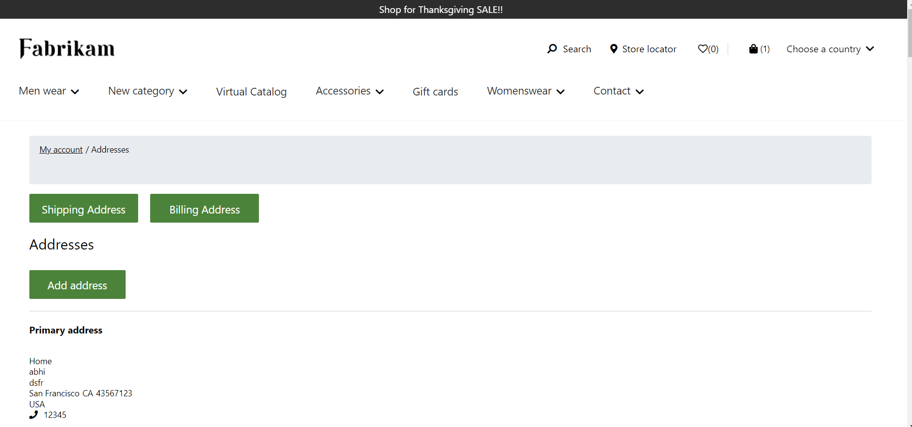
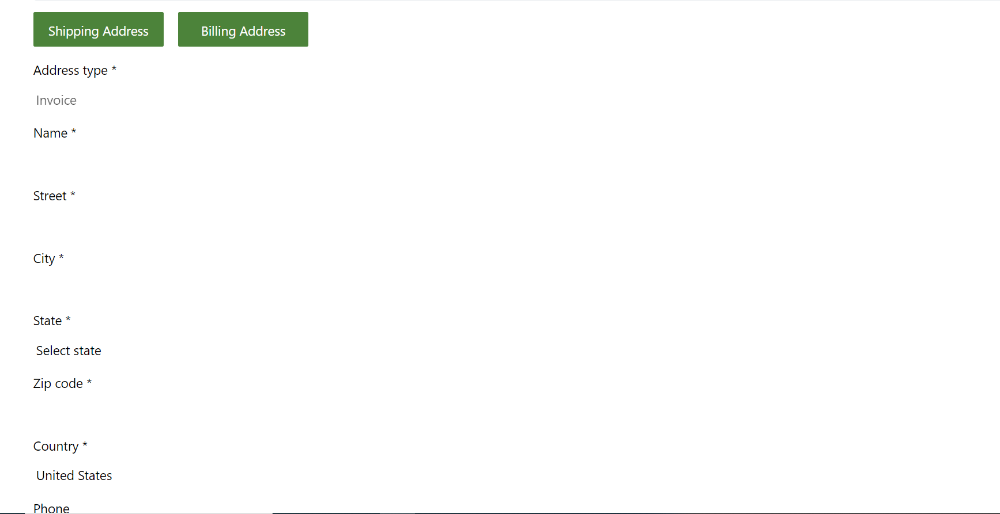
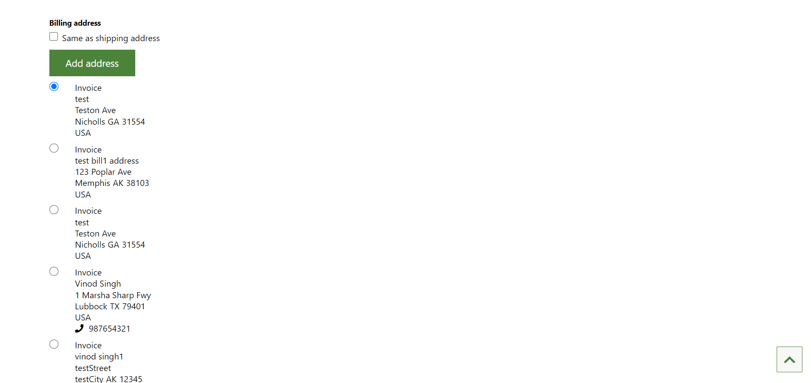
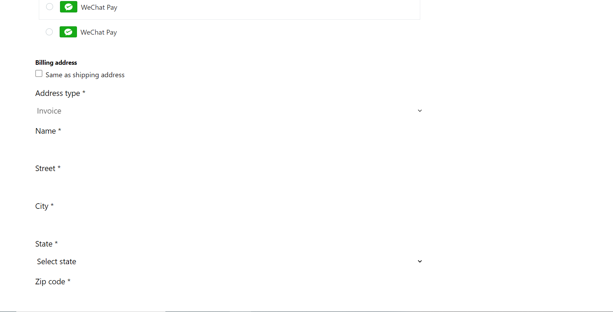
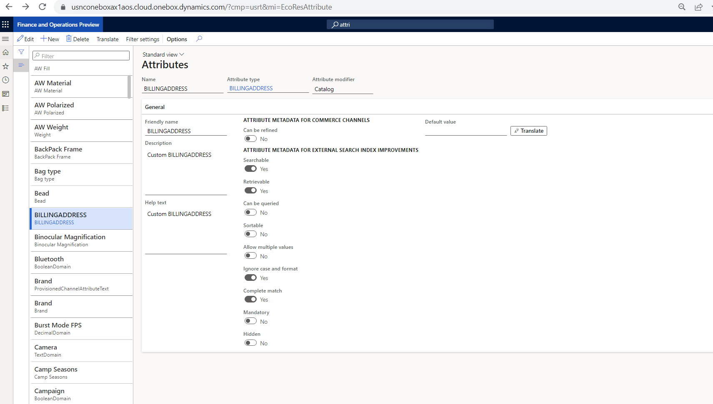
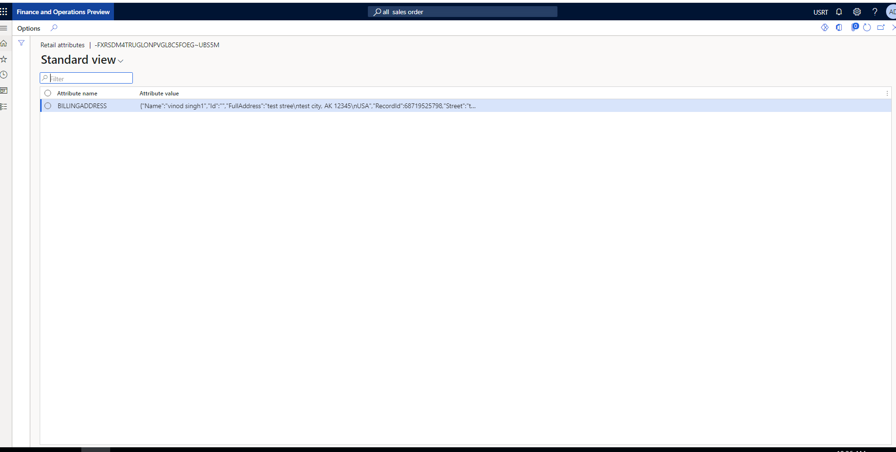
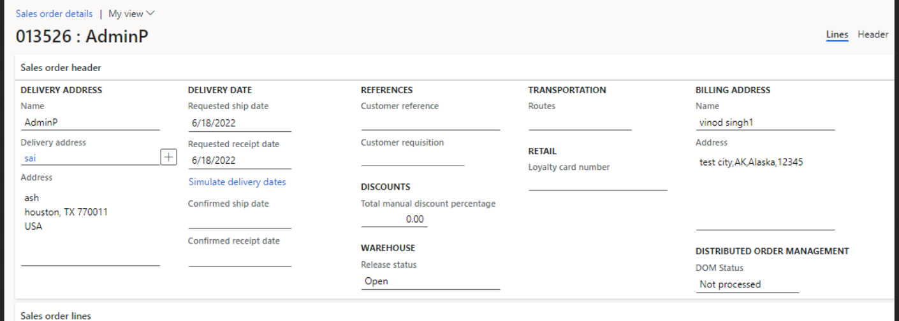
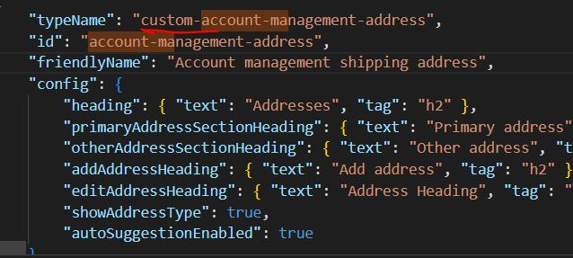
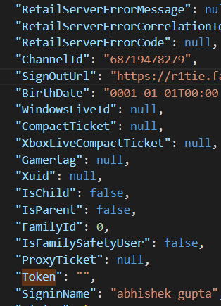

# Dynamics 365 Commerce - online extensibility samples

## License
License is listed in the [LICENSE](./LICENSE) file.

# Sample - Billing address customization
 
## Overview

This sample will demonstrate how to provide an E2E customization for saving the billing address for the customer with a Sales Order. Right now only shipping address is saved.

**Addres book page screens**





**Checkout page screen**





## Starter kit license
License for starter kit is listed in the [LICENSE](./module-library/LICENSE) .

## Prerequisites
Follow the instructions mentioned in [document](https://docs.microsoft.com/en-us/dynamics365/commerce/e-commerce-extensibility/setup-dev-environment) to set up the development environment.

### Procedure to create custom theme
Follow the instructions mentioned in [document](https://docs.microsoft.com/en-us/dynamics365/commerce/e-commerce-extensibility/create-theme) to create the custom theme

Create a theme folder with name fabrikam-extended.

## Detailed Steps

### 1. Module ejection for checkout-billing-address

We clone the "checkout-billing-address" module into "custom-checkout-billing-address" which contains the changes for the checkout flow. Please refer [document](https://docs.microsoft.com/en-us/dynamics365/commerce/e-commerce-extensibility/cli-command-reference#clone) to clone module.


### 2. Add data action in checkout billing address.
Add below data action key under **src/modules/custom-checkout-shipping-address/custom-checkout-shipping-address.definition.json**.

```json

      "address": {
            "path": "@msdyn365-commerce-modules/retail-actions/dist/lib/get-address",
            "runOn": "server"
        }

```

### 3. Add logic for billing address attribute in the custom-checkout-billing-address.tsx
Implement the logic as shown below in the sample code to add billing address in the checkout page in **src/modules/custom-checkout-billing-address/custom-checkout-billing-address.tsx**.


```typescript

/*--------------------------------------------------------------
 * Copyright (c) Microsoft Corporation. All rights reserved.
 * See License.txt in the project root for license information.
 *--------------------------------------------------------------*/

/* eslint-disable no-duplicate-imports */
import { IGiftCardExtend } from '@msdyn365-commerce/global-state';
import { Address, AddressPurpose, CountryRegionInfo, StateProvinceInfo } from '@msdyn365-commerce/retail-proxy';
import { IModuleStateProps, withModuleState } from '@msdyn365-commerce-modules/checkout-utilities';
import { getTelemetryObject, IModuleProps, ITelemetryContent } from '@msdyn365-commerce-modules/utilities';
import classnames from 'classnames';
import { action, computed, observable, reaction, set } from 'mobx';
import { observer } from 'mobx-react';
import * as React from 'react';

import { AutoSuggest } from '../../common/address-autosuggest';
import { IAutoSuggestOptions } from '../../common/address-autosuggest.data';
import { AddressCommon } from '../../common/address-common';
import { AddressSelect, IAddressSelectProps } from '../../common/components/address-select';
import { AddressFormat } from '../../common/address-format';
import { AddressItemType } from '../../common/address-format.data';
import { AddressMetaData } from '../../common/address-meta-data';
import { AddressOperation, AddressType, IAddressResource, IAddressResponse } from '../../common/address-module.data';
import { AddressAddUpdate, IAddressAddUpdateProps } from '../../common/components/address-add';
import { AddressBillingCheckbox } from '../../common/components/address-billing-checkbox';
import { AddressBillingHeading } from '../../common/components/address-billing-heading';
import { AddressShow, IAddressShowProps } from '../../common/components/address-show';
import { ICustomCheckoutBillingAddressData } from './custom-checkout-billing-address.data';
import { ICustomCheckoutBillingAddressProps } from './custom-checkout-billing-address.props.autogenerated';

/**
 * Props interface.
 */
export interface IProps extends ICustomCheckoutBillingAddressProps<ICustomCheckoutBillingAddressData>, IModuleStateProps {}

/**
 * Checkout billing address view state interface.
 */
export interface ICheckoutBillingAddressViewState {
    isShowAddress: boolean;
    isShowAddOrUpdateAddress: boolean;
    isShowAddresList: boolean;
    isShowSameAsShippingCheckbox: boolean;
}

/**
 * Checkout billing address view props interface.
 */
export interface ICheckoutBillingAddressViewProps extends IProps {
    className: string;
    currentOperation: AddressOperation;
    selectedAddress?: Address;
    addUpdateAddress: Address;
    addressListSelectedAddress: Address;
    countryRegionId: string;
    customerAddresses: Address[];
    showAddressSelect: IAddressSelectProps;
    stateProvinceInfo?: StateProvinceInfo[];
    validationError: object;
    addressActionResponse?: IAddressResponse;
    viewState: ICheckoutBillingAddressViewState;
    CheckoutBillingAddress: IModuleProps;
    sameAsShippingCheckbox: React.ReactNode;
    heading: React.ReactNode;
    showAddress: IAddressShowProps;
    showAddOrUpdateAddress: IAddressAddUpdateProps;
    isUpdating: boolean;
    hasError: boolean;
}

/**
 *
 * CheckoutBillingAddress component.
 * @extends {React.PureComponent<ICustomCheckoutBillingAddressProps<ICustomCheckoutBillingAddressData>>}
 */
// @ts-expect-error
@withModuleState
@observer
class CheckoutBillingAddress extends React.Component<IProps> {
    @observable private currentOperation: AddressOperation;

    @observable private isBillingAddressSameAsShipping: boolean;

    @observable private selectedAddress?: Address;

    @observable private addUpdateAddress: Address;

    @observable private countryRegionId: string = 'USA';

    @observable private stateProvinceInfo?: StateProvinceInfo[];

    @observable private validationError: object;

    @observable private customerAddresses: Address[];

    @observable private addressListSelectedAddress: Address = {};

    @observable private addressActionResponse?: IAddressResponse;

    @observable private isUpdating?: boolean;

    @observable private hasError?: boolean;

    private readonly addressCommon: AddressCommon;

    private addressFormat: AddressFormat;

    private isCheckoutBillingAddress: boolean;

    private countryRegions: CountryRegionInfo[] = [];

    private addressPurposes: AddressPurpose[] = [];

    private readonly resources: IAddressResource;

    private defaultAddressType: number = 6; // Default to Home

    // private addRenderRef: React.RefObject<AddressAdd>;
    private readonly telemetryContent?: ITelemetryContent;

    private autoSuggest?: AutoSuggest;

    public constructor(props: IProps) {
        super(props);
        const { context, data, resources, telemetry } = this.props;

        this.addUpdateAddress = {};
        this.validationError = {};
        this.isBillingAddressSameAsShipping = false;
        this.resources = resources;
        this.currentOperation = AddressOperation.List;
        this.customerAddresses = data.address.result?.filter(address => address.AddressTypeValue === 1) || [];
        this.addressPurposes = data.addressPurposes.result || [];
        this.countryRegions = data.countryRegions.result || [];
        this.stateProvinceInfo = data.countryStates.result || [];
        this.addressCommon = new AddressCommon(context, resources, telemetry);
        this.addressFormat = new AddressFormat(
            this.countryRegions,
            new AddressMetaData({ ...resources }, this._getAddressFormatExcludeList()),
            this.addressPurposes
        );
        this.telemetryContent = getTelemetryObject(
            this.props.context.request.telemetryPageName!,
            this.props.friendlyName,
            this.props.telemetry
        );
        this.isCheckoutBillingAddress = false;

        // This.addRenderRef = React.createRef();
    }

    /**
     * On suggestion selected.
     * @param result - The suggestion result.
     */
    @action
    private readonly _onSuggestionSelected = async (result: Microsoft.Maps.ISuggestionResult): Promise<void> => {
        this._clearAddressFields();
        const address = this.addressFormat.getTranformedAddress(result, this.stateProvinceInfo);
        set(this.addUpdateAddress, { Street: '' });
        set(this.addUpdateAddress, { ZipCode: address.ZipCode });
        set(this.addUpdateAddress, { CountyName: address.CountyName });
        set(this.addUpdateAddress, { City: address.City });
        set(this.addUpdateAddress, { State: address.State });
        set(this.addUpdateAddress, { DistrictName: address.DistrictName });
        set(this.addUpdateAddress, { FullAddress: address.FullAddress });

        // Bing autosuggest put the complete address in the Street input box. Updating the street input box to show only street address.
        setTimeout(() => {
            set(this.addUpdateAddress, { Street: address.Street });
        }, 0);
    };

    /**
     * Clear address fields.
     */
    @action
    private readonly _clearAddressFields = (): void => {
        const addressFormatItem = this.addressFormat.getAddressFormat(
            this.addUpdateAddress.ThreeLetterISORegionName || this.countryRegionId
        );
        addressFormatItem.forEach(format => {
            if (this.addUpdateAddress[format.name] !== undefined && !this.autoSuggest?.excludedAddressFields.includes(format.name)) {
                this.addressFormat[format.name] = '';
            }
        });
        this._clearValidation();
    };

    /**
     * Clear validation.
     */
    @action
    private readonly _clearValidation = (): void => {
        this.validationError = {};
    };

    public async componentDidMount(): Promise<void> {
        const {
            context: {
                telemetry,
                actionContext: {
                    requestContext: { channel }
                }
            },
            config: { autoSuggestionEnabled, autoSuggestOptions }
        } = this.props;

        // Initializing data props
        this._dataInitialize(this.props);

        this.props.data.checkout.then(() => {
            this._setDefaultCountryRegionId();
            this._initModuleState();
        });

        reaction(
            () => this.countryRegionId,
            () => {
                this._getStateProvinces();
            }
        );

        reaction(
            () => this.currentOperation,
            () => {
                this._getStateProvinces();
            }
        );

        reaction(
            () => this.props.data.checkout.result && this.props.data.checkout.result.shippingAddress,
            shippingAddress => {
                if (this.props.moduleState.isUpdating) {
                    if (shippingAddress && this.isBillingAddressSameAsShipping) {
                        this.isBillingAddressSameAsShipping = true;
                        this._updateCurrentOperation(AddressOperation.Show, shippingAddress);
                    } else if (shippingAddress && this.isBillingAddressSameAsShipping) {
                        this._updateCurrentOperation(AddressOperation.Show, shippingAddress);
                    }
                }
            }
        );

        reaction(
            () => this.isBillingAddressRequried,
            isBillingAddressRequried => {
                if (isBillingAddressRequried) {
                    if (this.props.moduleState.isDisabled) {
                        this.onEdit();
                    }
                } else {
                    this.props.data.checkout.result?.removeBillingAddress({});
                    this.props.moduleState.onDisable();
                }
            }
        );

        if (autoSuggestionEnabled) {
            if (channel && !channel.BingMapsApiKey) {
                telemetry.error('BingMapsApiKey is missing.');
                return;
            }

            if (channel && !channel.BingMapsEnabled) {
                telemetry.error('Map is disabled from HQ.');
                return;
            }

            const options: IAutoSuggestOptions = { ...autoSuggestOptions };
            this.autoSuggest = new AutoSuggest(
                telemetry,
                options,
                channel?.BingMapsApiKey,
                channel?.ChannelCountryRegionISOCode,
                channel?.DefaultLanguageId
            );

            // Customer doesn't have any address. Then add view will be loaded directly. Code for the same to handle that
            if (
                this.props.data.storeSelectorStateManager.result &&
                (this.currentOperation === AddressOperation.Add || this.currentOperation === AddressOperation.Update)
            ) {
                await this.autoSuggest._loadMapAPI(await this.props.data.storeSelectorStateManager);
            }

            reaction(
                () =>
                    this.props.data.storeSelectorStateManager.result?.loadMapApi &&
                    (this.currentOperation === AddressOperation.Add || this.currentOperation === AddressOperation.Update),
                async () => {
                    await this.autoSuggest?._loadMapAPI(await this.props.data.storeSelectorStateManager);
                }
            );

            reaction(
                () => this.props.data.storeSelectorStateManager.result?.isMapApiLoaded,
                async () => {
                    await this._attachMapAutoSuggest();
                }
            );
        }
    }

    public async componentDidUpdate(): Promise<void> {
        if (this.currentOperation === AddressOperation.Add || this.currentOperation === AddressOperation.Update) {
            if (this.props.data.storeSelectorStateManager.result?.isMapApiLoaded) {
                await this._attachMapAutoSuggest();
            }
        } else {
            this.autoSuggest?.disposeAutoSuggest();
        }
    }

    public shouldComponentUpdate(
        nextProps: ICustomCheckoutBillingAddressProps<ICustomCheckoutBillingAddressData>,
        nextState: ICheckoutBillingAddressViewState
    ): boolean {
        if (this.state === nextState && this.props.data === nextProps.data) {
            return false;
        }
        return true;
    }

    public render(): JSX.Element | null {
        if (!this.isBillingAddressRequried) {
            return null;
        }

        const { resources } = this.props;

        const { renderView, config } = this.props;

        const viewProps = {
            ...this.props,
            currentOperation: this.currentOperation,
            selectedAddress: this.selectedAddress,
            addUpdateAddress: this.addUpdateAddress,
            addressListSelectedAddress: this.addressListSelectedAddress,
            customerAddresses: this.customerAddresses,
            countryRegionId: this.countryRegionId,
            stateProvinceInfo: this.stateProvinceInfo,
            validationError: this.validationError,
            addressActionResponse: this.addressActionResponse,
            className: config.className,
            isUpdating: this.isUpdating,
            hasError: this.hasError,
            viewState: {
                isShowAddress: this.selectedAddress && this.currentOperation === AddressOperation.Show,
                isShowAddresList: this.currentOperation === AddressOperation.List && this.customerAddresses.length > 0,
                isShowAddOrUpdateAddress:
                    this.currentOperation === AddressOperation.Add || this.currentOperation === AddressOperation.Update,
                isShowSameAsShippingCheckbox: this.isCartContainsItemsForShipping && this.props.moduleState.isUpdating
            },
            CheckoutBillingAddress: {
                moduleProps: this.props,
                className: classnames('ms-checkout-billing-address', config.className)
            },
            heading: <AddressBillingHeading {...{ text: resources.addressBillingAddressHeading }} />,

            sameAsShippingCheckbox: (
                <AddressBillingCheckbox
                    {...{
                        isChecked: this.isBillingAddressSameAsShipping,
                        type: 'checkbox',
                        value: 'true',
                        ariaLabel: resources.addressSameAsShippingAddressAriaLabel,
                        text: resources.addressSameAsShippingAddressText,
                        telemetryContent: this.telemetryContent,
                        onChange: this._onBillingAddressSameAsShippingChange
                    }}
                />
            ),
            showAddress: this._renderShowAddress(),
            showAddressSelect: this._renderSelectAddress(),
            showAddOrUpdateAddress: this._renderAddOrUpdateAddress()
        };

        return renderView(viewProps) as React.ReactElement;
    }

    /**
     * On address update.
     * @param name - Name.
     * @param value - Value.
     */
    private readonly onAddressAddUpdate = (name: string, value: string) => {
        set(this.addUpdateAddress, { [name]: value });
        this.addressFormat.validateAddressFormat(this.addUpdateAddress, this.validationError, this.countryRegionId, name);
    };

    /**
     * Method data initialization.
     * @param props -The checkout address properties.
     */
    private readonly _dataInitialize = (props: IProps): void => {
        const { data } = props;

        reaction(
            () => data.countryRegions.result,
            () => {
                this.countryRegions = data.countryRegions.result ?? [];
            }
        );

        reaction(
            () => data.addressPurposes.result,
            () => {
                this.addressPurposes = data.addressPurposes.result ?? [];
            }
        );

        reaction(
            () => data.countryStates.result,
            () => {
                this.stateProvinceInfo = data.countryStates.result ?? [];
            }
        );
    };

    /**
     * Render add or update address function.
     * @returns - Address add update props.
     */
    private readonly _renderAddOrUpdateAddress = (): IAddressAddUpdateProps => {
        return AddressAddUpdate({
            isUpdating: this.isUpdating,
            resources: this.resources,
            addressType: AddressType.Billing,
            addressFormat: this.addressFormat.getAddressFormat(this.addUpdateAddress.ThreeLetterISORegionName ?? this.countryRegionId),
            currentOperation: this.currentOperation,
            isCheckoutBillingAddress: this.isCheckoutBillingAddress,
            defaultCountryRegionId: this.countryRegionId,
            defaultAddressType: this.defaultAddressType,
            selectedAddress: this.addUpdateAddress,
            validationError: this.validationError,
            addressActionResponse: this.addressActionResponse,
            dropdownDisplayData: this.addressFormat.getPrefilledAddressDropdownData(
                this.resources.addressStateDefaultSelectionText,
                this.stateProvinceInfo
            ),
            telemetryContent: this.telemetryContent,
            onInputChange: this._onAddressAddUpdateInputChange,
            onDropdownChange: this._onAddressAddUpdateDropdownChange,
            hasExternalSubmitGroup: this.props.moduleState.hasExternalSubmitGroup,
            onSave: this._onSubmitAddress,
            onCancel: !this.selectedAddress && !this.addressCommon.isAuthenticatedFlow() ? () => {} : this._resetView
        });
    };

    private _renderShowAddress(): IAddressShowProps | null {
        if (this.selectedAddress) {
            return AddressShow({
                address: this.selectedAddress,
                addressFormat: this.addressFormat.getAddressFormat(this.selectedAddress.ThreeLetterISORegionName ?? ''),
                addressPurposes: this.addressPurposes
            });
        }

        return null;
    }

    /**
     * On country region change function.
     * @param countryRegionId - Country region Id.
     */
    private readonly _onCountryChange = (countryRegionId: string) => {
        this.countryRegionId = countryRegionId;
        const twoLetterIsoRegionName = this.addressFormat.getTwoLetterISORegionName(countryRegionId);
        set(this.addUpdateAddress, { ThreeLetterISORegionName: countryRegionId });
        set(this.addUpdateAddress, { TwoLetterISORegionName: twoLetterIsoRegionName });
        this.autoSuggest?.changeAutoSuggestionCountryCode(twoLetterIsoRegionName);
        this._clearAddressFields();
    };

    /**
     * Method to render select address.
     * @returns Select address props.
     */
    private readonly _renderSelectAddress = (): IAddressSelectProps => {
        return AddressSelect({
            addressFormat: this.addressFormat,
            addresses: this.customerAddresses,
            resources: this.resources,
            addressPurposes: this.addressPurposes,
            selectedAddress: this.addressListSelectedAddress,
            onAddressOptionChange: this._onAddressOptionChange,
            hasExternalSubmitGroup: this.props.moduleState.hasExternalSubmitGroup,
            telemetryContent: this.telemetryContent,
            onAddAddress: this._goToAddAddress,
            onSave: this._onSelectAddress,

            onCancel: !this.selectedAddress ? () => {} : this._resetView
        });
    };

    /**
     * Method gets called on address option change.
     * @param event - To get current option.
     */
    private readonly _onAddressOptionChange = (event: React.ChangeEvent<HTMLInputElement>) => {
        const addressRecordId = event.currentTarget.value;
        const selectedAddress = this.customerAddresses.find(address => (address.RecordId || '').toString() === addressRecordId);
        if (selectedAddress) {
            this.addressListSelectedAddress = selectedAddress;
        }
    };

    /**
     * Method get called on select address.
     */
    private readonly _onSelectAddress = () => {
        this._updateCurrentOperation(AddressOperation.Show, this.addressListSelectedAddress);
        this._setBillingAddress(this.addressListSelectedAddress);
        this._updateModuleState();

        const stringBillingAddress: string = JSON.stringify(this.addressListSelectedAddress);
        this._updateAttributeValues('BILLINGADDRESS', stringBillingAddress).catch(error => {
            this.props.telemetry.error(`error in _updateExtensionProps ${error}`);
        });
    };

    /**
     * Method get called on goto add address.
     */
    private readonly _goToAddAddress = () => {
        this.isCheckoutBillingAddress = true;
        this.defaultAddressType = 1;
        this._setDefaultCountryRegionId();
        this._updateCurrentOperation(AddressOperation.Add);
    };

    /**
     * Gets address format for exclude list.
     * @returns - Address item type.
     */
    private readonly _getAddressFormatExcludeList = (): AddressItemType[] => {
        const { config } = this.props;
        const addressFormatExcludeList: AddressItemType[] = [];

        if (!config.showAddressType) {
            addressFormatExcludeList.push(AddressItemType.AddressTypeValue);
        }

        addressFormatExcludeList.push(AddressItemType.IsPrimary);

        return addressFormatExcludeList;
    };

    /**
     * Attach map auto suggest.
     */
    private readonly _attachMapAutoSuggest = async (): Promise<void> => {
        const {
            data: {
                storeSelectorStateManager: { result: storeSelectorStateManager }
            }
        } = this.props;

        if (storeSelectorStateManager?.isMapApiLoaded) {
            this.autoSuggest?.attachAutoSuggest('#billing_addressstreet', '#billing_addressstreet_container', this._onSuggestionSelected);
        }
    };

    /**
     * On address add update input change.
     * @param event - The event.
     */
    private readonly _onAddressAddUpdateInputChange = (event: React.ChangeEvent<HTMLInputElement>): void => {
        const value = (event.target.value || '').replace(new RegExp('[<>]', 'gi'), '');
        this.onAddressAddUpdate(event.target.name, value);
    };

    /**
     * On address add update dropdown change.
     * @param event - The event.
     */
    private readonly _onAddressAddUpdateDropdownChange = (event: React.ChangeEvent<HTMLSelectElement>): void => {
        this.onAddressAddUpdate(event.target.name, event.target.value);

        if (event.target.name === AddressItemType[AddressItemType.ThreeLetterISORegionName]) {
            this._onCountryChange(event.target.value);
        }
    };

    /**
     * Gets state provinces.
     */
    private readonly _getStateProvinces = (): void => {
        if (
            !this.countryRegionId ||
            !(this.currentOperation === AddressOperation.Add || this.currentOperation === AddressOperation.Update)
        ) {
            return;
        }

        this.addressCommon.getStateProvinces(this.countryRegionId).then((result: StateProvinceInfo[]) => {
            const stateInfo = result.some(state => state.StateId === this.addUpdateAddress.State);

            // Reset state if selected state not found in the list.
            if (!stateInfo) {
                set(this.addUpdateAddress, { State: '' });
            }
            this.stateProvinceInfo = result;
        });
    };

    /**
     * Initialize module state.
     */
    private readonly _initModuleState = (): void => {
        this.props.moduleState.init({
            status: this.isBillingAddressRequried ? 'updating' : 'disabled',
            onEdit: this.onEdit,
            onCancel: this.onCancel,
            onSubmit: this.onSubmit
        });

        const { billingAddress, isBillingAddressSameAsShippingAddress } = this.props.data.checkout.result ?? {};
        const isAuthenticated = this.addressCommon.isAuthenticatedFlow();

        const billing =
            this.props.data.checkout.result &&
            this.props.data.checkout.result.checkoutCart &&
            this.props.data.checkout.result.checkoutCart.cart &&
            this.props.data.checkout.result.checkoutCart.cart?.AttributeValues?.find(address => address.Name === 'BILLINGADDRESS');

        if (billing) {
            // @ts-expect-error -- Need to provide data type.
            billingAddress = JSON.parse(billing?.TextValue);
        }

        if (this.isBillingAddressRequried) {
            if (billingAddress) {
                this.isBillingAddressSameAsShipping = isBillingAddressSameAsShippingAddress ?? false;
                if (isAuthenticated) {
                    this._updateCurrentOperation(AddressOperation.List, billingAddress);
                } else {
                    this._updateCurrentOperation(AddressOperation.Show, billingAddress);
                }
                this._updateModuleState();
            } else if (this.isCartContainsItemsForShipping) {
                if (isAuthenticated) {
                    if (this.customerAddresses.length > 0) {
                        this._updateCurrentOperation(AddressOperation.List, this.customerAddresses[0]);
                    } else {
                        this.isBillingAddressSameAsShipping = true;
                        this._updateCurrentOperation(AddressOperation.Show, this.shippingAddress);
                    }
                } else {
                    this.isBillingAddressSameAsShipping = true;
                    this._updateCurrentOperation(AddressOperation.Show, this.shippingAddress);
                }
            } else {
                this.isBillingAddressSameAsShipping = false;
                this._updateCurrentOperation(AddressOperation.Add);
            }
        }
    };

    /**
     * Sets default country region Id.
     */
    private _setDefaultCountryRegionId(): void {
        const { request } = this.props.context;
        const market = request.channel?.ChannelCountryRegionISOCode;

        this.countryRegionId = this.addressCommon.getDefaultCountryRegionId(this.countryRegionId, this.countryRegions, market);
    }

    /**
     * On change - Billing address same as shipping.
     * @param event - The event.
     */
    private readonly _onBillingAddressSameAsShippingChange = (event: React.ChangeEvent<HTMLInputElement>) => {
        this.isBillingAddressSameAsShipping = event.currentTarget.checked;
        const isAuthenticated = this.addressCommon.isAuthenticatedFlow();

        if (this.isBillingAddressSameAsShipping && this.shippingAddress) {
            this._updateCurrentOperation(AddressOperation.Show, this.shippingAddress);
        } else {
            if (isAuthenticated) {
                if (Object.keys(this.addressListSelectedAddress).length > 0) {
                    this._updateCurrentOperation(AddressOperation.List, this.addressListSelectedAddress);
                } else if (this.customerAddresses.length > 0) {
                    this._updateCurrentOperation(AddressOperation.List, this.customerAddresses[0]);
                } else {
                    this.isCheckoutBillingAddress = true;
                    this.defaultAddressType = 1;
                    this._updateCurrentOperation(AddressOperation.Add, this.billingAddress);
                }
            } else {
                this.isCheckoutBillingAddress = true;
                this.defaultAddressType = 1;
                this._updateCurrentOperation(AddressOperation.Add, this.billingAddress);
            }
        }
    };

    @computed private get isCartContainsItemsForShipping(): boolean {
        const { request } = this.props.context;
        const multiplePickupStoreSwitchName = 'Dynamics.AX.Application.RetailMultiplePickupDeliveryModeFeature';
        const { channelDeliveryOptionConfig, featureState } = this.props.data;
        const retailMultiplePickUpOptionEnabled = featureState.result?.find(feature => feature.Name === multiplePickupStoreSwitchName)
            ?.IsEnabled;

        const pickupDeliveryModeCode = request.channel?.PickupDeliveryModeCode;
        const emailDeliveryModeCode = request.channel?.EmailDeliveryModeCode;

        // If hasInvoiceLine is true, there are only invoices no items in cart and return false here
        return this.props.data.checkout.result?.checkoutCart.hasInvoiceLine
            ? false
            : retailMultiplePickUpOptionEnabled
            ? ((this.props.data.checkout.result && this.props.data.checkout.result.checkoutCart.cart.CartLines) || []).some(cartLine =>
                  cartLine.DeliveryMode && cartLine.DeliveryMode !== ''
                      ? cartLine.DeliveryMode !==
                            channelDeliveryOptionConfig.result?.PickupDeliveryModeCodes?.find(
                                deliveryMode => deliveryMode === cartLine.DeliveryMode
                            ) && cartLine.DeliveryMode !== emailDeliveryModeCode
                      : cartLine
              )
            : ((this.props.data.checkout.result && this.props.data.checkout.result.checkoutCart.cart.CartLines) || []).some(cartLine =>
                  cartLine.DeliveryMode && cartLine.DeliveryMode !== ''
                      ? cartLine.DeliveryMode !== pickupDeliveryModeCode && cartLine.DeliveryMode !== emailDeliveryModeCode
                      : cartLine
              );
    }

    @computed private get billingAddress(): Address | undefined {
        return this.props.data.checkout.result?.billingAddress;
    }

    @computed private get shippingAddress(): Address | undefined {
        return this.props.data.checkout.result?.shippingAddress;
    }

    @computed private get getLoyaltyAmount(): number {
        const checkoutState = this.props.data.checkout.result;
        return checkoutState?.loyaltyAmount ? checkoutState.loyaltyAmount : 0;
    }

    @computed private get getGiftCardTotalAmount(): number {
        const checkoutState = this.props.data.checkout.result;
        if (!checkoutState || !checkoutState.giftCardExtends) {
            return 0;
        }
        return checkoutState.giftCardExtends.reduce((count: number, giftCard: IGiftCardExtend) => {
            return count + (giftCard.Balance || 0);
        }, 0);
    }

    @computed private get getCustomerAccountAmount(): number {
        const checkoutState = this.props.data.checkout.result;
        const defaultAmount = 0;

        return checkoutState?.customerAccountAmount ?? defaultAmount;
    }

    @computed private get shouldPaidByCard(): boolean {
        const {
            data: { checkout },
            config
        } = this.props;
        if (!checkout.result) {
            return false;
        }

        const checkoutResult = checkout.result;
        const cart = checkoutResult.checkoutCart.cart;
        if (!cart || !cart.CartLines || cart.CartLines.length === 0) {
            return false;
        }

        const { paymentTenderType, tokenizedPaymentCard } = checkoutResult;
        const isPaidByOtherPaymentSource = config.paymenTenderType !== paymentTenderType && tokenizedPaymentCard;

        // Use payment card when it is not free or gift card balance + Loyalty amount can not cover the total amount
        const amountDue = (cart.TotalAmount || 0) - this.getGiftCardTotalAmount - this.getLoyaltyAmount - this.getCustomerAccountAmount;

        return amountDue > 0 && !isPaidByOtherPaymentSource;
    }

    @computed private get isBillingAddressRequried(): boolean {
        return this.shouldPaidByCard;
    }

    /**
     * Method get called on add/update success.
     * @param response - Retail api response.
     */
    private readonly _onAddOrUpdateSuccess = (response: IAddressResponse) => {
        if (response.customerAddresses) {
            this.customerAddresses = response.customerAddresses.filter(address => address.AddressTypeValue === 1);
        }

        if (response.address) {
            this._updateCurrentOperation(AddressOperation.Show, response.address);
            this._setBillingAddress(response.address);
            this._updateModuleState();
        }
    };

    /**
     * On submit address.
     */
    private readonly _onSubmitAddress = (): void => {
        if (!this.addressFormat.validateAddressFormat(this.addUpdateAddress, this.validationError, this.countryRegionId)) {
            this.props.moduleState.setHasError(true);
            return;
        }

        let billingAddress: Address = {};
        set(this.addUpdateAddress, { AddressTypeValue: 1 });

        let response: Promise<IAddressResponse>;
        if (this.addressCommon.isAuthenticatedFlow()) {
            response =
                this.currentOperation === AddressOperation.Update
                    ? this.addressCommon.updateCustomerAddress(this.addUpdateAddress)
                    : this.addressCommon.addCustomerAddress(this.addUpdateAddress);
        } else {
            response = Promise.resolve({ address: this.addUpdateAddress });
        }

        this.isUpdating = true;
        this._updateModuleState();

        response
            .then(
                (result: IAddressResponse) => {
                    this.isUpdating = false;

                    let newAddress = result.address;
                    newAddress = { ...newAddress, ...this.addUpdateAddress };

                    if (result.address) {
                        billingAddress = result.address;
                        this.hasError = false;
                        if (result.customerAddresses) {
                            this._onAddOrUpdateSuccess({ customerAddresses: result.customerAddresses, address: newAddress });
                        } else {
                            this._onAddOrUpdateSuccess({ address: newAddress });
                        }
                    } else {
                        this.hasError = true;
                        this.addressActionResponse = result;
                        this._updateModuleState();
                    }
                },
                () => {
                    this.hasError = true;
                    this.isUpdating = false;
                    this._updateModuleState();
                }
            )
            .then(() => {
                const stringBillingAddress: string = JSON.stringify(billingAddress);
                this._updateAttributeValues('c', stringBillingAddress).catch(error => {
                    this.props.telemetry.error(`error in _updateExtensionProps ${error}`);
                });
            });
    };

    private readonly _addShippingAddress = (shippingAddress: Address): void => {
        set(shippingAddress, { AddressTypeValue: 1 });
        let response: Promise<IAddressResponse>;
        let billingAddress: Address = {};
        if (this.addressCommon.isAuthenticatedFlow()) {
            this.customerAddresses.map((address: Address) => {
                if (address.RecordId === shippingAddress.RecordId) {
                    billingAddress = shippingAddress;
                } else if (
                    address.Name === shippingAddress.Name &&
                    address.Phone === shippingAddress.Phone &&
                    address.Street === shippingAddress.Street &&
                    address.City === shippingAddress.City &&
                    address.State === shippingAddress.State &&
                    address.ZipCode === shippingAddress.ZipCode &&
                    address.ThreeLetterISORegionName === shippingAddress.ThreeLetterISORegionName
                ) {
                    billingAddress = shippingAddress;
                }
            });
            if (!billingAddress.Name) {
                const newAddress: Address = {
                    AddressTypeValue: 1,
                    City: shippingAddress.City,
                    Phone: shippingAddress.Phone,
                    Name: shippingAddress.Name,
                    Street: shippingAddress.Street,
                    State: shippingAddress.State,
                    ThreeLetterISORegionName: shippingAddress.ThreeLetterISORegionName,
                    ZipCode: shippingAddress.ZipCode
                };

                response =
                    this.currentOperation === AddressOperation.Update
                        ? this.addressCommon.updateCustomerAddress(newAddress)
                        : this.addressCommon.addCustomerAddress(newAddress);
            } else {
                response = Promise.resolve({ address: billingAddress });
            }
        } else {
            response = Promise.resolve({ address: shippingAddress });
        }

        this.isUpdating = true;

        response
            .then(
                (result: IAddressResponse) => {
                    this.isUpdating = false;

                    let newAddress = result.address;
                    if (result.address) {
                        billingAddress = result.address;
                        this.hasError = false;
                        if (result.customerAddresses) {
                            this._onAddOrUpdateSuccess({ customerAddresses: result.customerAddresses, address: newAddress });
                        } else {
                            this._onAddOrUpdateSuccess({ address: newAddress });
                        }

                        this._updateModuleState();
                    } else {
                        this.hasError = true;
                        this.addressActionResponse = result;
                        this._updateModuleState();
                    }
                },
                () => {
                    this.hasError = true;
                    this.isUpdating = false;
                    this._updateModuleState();
                }
            )
            .then(() => {
                const stringBillingAddress: string = JSON.stringify(
                    this.addressCommon.isAuthenticatedFlow() ? billingAddress : shippingAddress
                );
                this._updateAttributeValues('BILLINGADDRESS', stringBillingAddress).catch(error => {
                    this.props.telemetry.error(`error in _updateExtensionProps ${error}`);
                });
            });
    };

    private readonly _updateAttributeValues = async (attributekey: string, value: string) => {
        await this.props.data.checkout.result?.checkoutCart.updateAttributeValues({
            newAttributeValues: [
                {
                    // @ts-expect-error -- Need to provide data type.
                    '@odata.type': '#Microsoft.Dynamics.Commerce.Runtime.DataModel.AttributeTextValue',
                    Name: attributekey,
                    TextValue: value,
                    ExtensionProperties: [],
                    TextValueTranslations: []
                }
            ]
        });
    };

    /**
     * On submit.
     */
    private readonly onSubmit = (): void => {
        switch (this.currentOperation) {
            case AddressOperation.Add:
            case AddressOperation.Update:
                this._onSubmitAddress();
                break;
            case AddressOperation.Show:
                if (this.selectedAddress) {
                    if (this.isBillingAddressSameAsShipping) {
                        this._addShippingAddress(this.selectedAddress);
                    }
                    this._setBillingAddress(this.selectedAddress);
                    this._updateCurrentOperation(AddressOperation.Show, this.selectedAddress);
                    this._updateModuleState();
                }
                break;
            case AddressOperation.List:
                this._onSelectAddress();
                break;
            default:
                this.props.telemetry.error('Invalid operation');
        }
    };

    /**
     * On cancel.
     */
    private readonly onCancel = (): void => {
        switch (this.currentOperation) {
            case AddressOperation.Add:
            case AddressOperation.Update:
                // this._resetView();
                this._clearAddressFields();
                if (!(!this.selectedAddress && !this.addressCommon.isAuthenticatedFlow())) {
                    this._resetView();
                }
                break;
            case AddressOperation.Show:
                if (this.selectedAddress) {
                    this._resetView();
                }
                break;
            default:
                this.props.telemetry.error('Invalid operation');
        }
    };

    /**
     * On edit.
     */
    private readonly onEdit = (): void => {
        if (this.isBillingAddressSameAsShipping && this.shippingAddress && this.isCartContainsItemsForShipping) {
            this._updateCurrentOperation(AddressOperation.Show, this.shippingAddress);
        } else {
            // this._updateCurrentOperation(AddressOperation.Add, this.billingAddress);
            if (this.addressCommon.isAuthenticatedFlow() && this.billingAddress) {
                this._updateCurrentOperation(AddressOperation.List, this.billingAddress);
            } else if (this.billingAddress) {
                this._updateCurrentOperation(AddressOperation.Update, this.billingAddress);
            }
        }
        this.props.moduleState.onUpdating();
    };

    /**
     * Sets billing address.
     * @param address - The address.
     */
    private readonly _setBillingAddress = (address: Address): void => {
        if (this.props.data.checkout.result) {
            const newBillingAddress = { ...address };

            if (address.ThreeLetterISORegionName && !newBillingAddress.TwoLetterISORegionName) {
                newBillingAddress.TwoLetterISORegionName = this.addressFormat.getTwoLetterISORegionName(address.ThreeLetterISORegionName);
            }

            this.props.data.checkout.result.updateBillingAddress({
                newBillingAddress,
                additionalProperties: {
                    isBillingAddressSameAsShippingAddress: this.isBillingAddressSameAsShipping
                }
            });
        }
    };

    /**
     * Reset view.
     */
    private readonly _resetView = () => {
        switch (this.currentOperation) {
            case AddressOperation.Add:
            case AddressOperation.Update:
                this._updateCurrentOperation(
                    this.addressCommon.isAuthenticatedFlow() ? AddressOperation.List : AddressOperation.Show,
                    this.billingAddress
                );
                break;
            default:
                this._updateCurrentOperation(AddressOperation.Show, this.shippingAddress);
        }
        this._updateModuleState();
    };

    /**
     * Update current operation.
     * @param operation - Address operation
     * @param selectedAddress - The selected address.
     */
    private readonly _updateCurrentOperation = (operation: AddressOperation, selectedAddress?: Address) => {
        this.currentOperation = operation;
        this.selectedAddress = selectedAddress;

        if (this.currentOperation === AddressOperation.Add || this.currentOperation === AddressOperation.Update) {
            this.addUpdateAddress = { ...this.selectedAddress } || {};
            set(this.addUpdateAddress, {
                ThreeLetterISORegionName: this.addUpdateAddress.ThreeLetterISORegionName || this.countryRegionId
            });
            set(this.addUpdateAddress, { AddressTypeValue: this.addUpdateAddress.AddressTypeValue || this.defaultAddressType });
        } else if (this.currentOperation === AddressOperation.List) {
            this.addressListSelectedAddress = { ...this.selectedAddress } || {};
        }
    };

    /**
     * Updates the module state.
     */
    private readonly _updateModuleState = () => {
        if (this.currentOperation === AddressOperation.Show) {
            this.props.moduleState.onReady();
        } else if (this.isUpdating) {
            this.props.moduleState.onPending();
        } else {
            this.props.moduleState.onUpdating();
        }
    };
}

export default CheckoutBillingAddress;


```

### 4. Add logic to show list of added billing address and Address from in the custom-checkout-billing-address.view.tsx
Implement the logic as shown below in the sample code to show billing address list and Add new billing address form in the checkout page in **src/modules/custom-checkout-billing-address/custom-checkout-billing-address.view.tsx**.

```typescript

/*--------------------------------------------------------------
 * Copyright (c) Microsoft Corporation. All rights reserved.
 * See License.txt in the project root for license information.
 *--------------------------------------------------------------*/

/* eslint-disable no-duplicate-imports */
import { Module, Node } from '@msdyn365-commerce-modules/utilities';
import * as React from 'react';
import { IAddressSelectItem, IAddressSelectProps } from '../../common/components/address-select';
import { IAddressAddItem, IAddressAddUpdateProps } from '../../common/components/address-add';
import { IAddressShowItem, IAddressShowProps } from '../../common/components/address-show';
import { ICheckoutBillingAddressViewProps } from './custom-checkout-billing-address';

/**
 * Address show component.
 * @param param0 - Root param.
 * @param param0.AddressDetail - Address detail.
 * @param param0.items - IAddressShowItem[].
 * @returns - Address Node.
 */
const AddressShow: React.FC<IAddressShowProps> = ({ AddressDetail, items }) => {
    return (
        <Node {...AddressDetail}>
            {items &&
                items.map((item: IAddressShowItem) => {
                    return <>{item.description}</>;
                })}
        </Node>
    );
};

/**
 * Address show component.
 * @param param0 - Root param.
 * @param param0.SelectAddress - Select Address.
 * @param param0.addButton - addButton.
 * @param param0.items - items.
 * @param param0.isShowSaveButton - isShowSaveButton.
 * @param param0.saveButton - saveButton.
 * @param param0.isShowCancelButton - isShowCancelButton.
 * @param param0.cancelButton - cancelButton.
 * @returns - AddressSelect Node.
 */
const AddressSelect: React.FC<IAddressSelectProps> = ({
    SelectAddress,
    addButton,
    items,
    isShowSaveButton,
    saveButton,
    isShowCancelButton,
    cancelButton
}) => {
    return (
        <Node {...SelectAddress}>
            {addButton}
            {items &&
                items.map((item: IAddressSelectItem) => {
                    const SelectItem = item.SelectItem;
                    return (
                        <Node {...SelectItem} key={item.key}>
                            {item.input}
                            <AddressShow {...item.showItems} />
                        </Node>
                    );
                })}
            {isShowSaveButton && saveButton}
            {isShowCancelButton && cancelButton}
        </Node>
    );
};

/**
 * Address Add Update Component.
 * @param param0 - Root param.
 * @param param0.AddressForm - Address form.
 * @param param0.heading - Address Heading.
 * @param param0.items - IAddressAddItem[].
 * @param param0.hasError - Boolean.
 * @param param0.error - IAddressError.
 * @param param0.isShowSaveButton - Boolean.
 * @param param0.saveButton - Save button.
 * @param param0.isShowCancelButton - Boolean.
 * @param param0.cancelButton - Cancel button.
 * @returns - AddressForm Node.
 */
const AddressAddUpdate: React.FC<IAddressAddUpdateProps> = ({
    AddressForm,
    heading,
    items,
    hasError,
    error,
    isShowSaveButton,
    saveButton,
    isShowCancelButton,
    cancelButton
}) => {
    return (
        <Node {...AddressForm}>
            {heading}
            {items &&
                items.map((item: IAddressAddItem) => {
                    const { AddressItem, key, label, alert, input } = item;
                    return (
                        <Node {...AddressItem} key={key}>
                            {label}
                            {alert}
                            {input}
                        </Node>
                    );
                })}
            {hasError && (
                <Node {...error.AddressError}>
                    {error.title}
                    {error.message}
                </Node>
            )}
            {isShowSaveButton && saveButton}
            {isShowCancelButton && cancelButton}
        </Node>
    );
};

/**
 * Checkout Billing Address View Component.
 * @param props - Props.
 * @returns - CheckoutBillingAddress Module.
 */
const CheckoutBillingAddressView: React.FC<ICheckoutBillingAddressViewProps> = props => {
    const {
        CheckoutBillingAddress,
        showAddressSelect,
        viewState,
        heading,
        sameAsShippingCheckbox,
        showAddress,
        showAddOrUpdateAddress
    } = props;

    return (
        <Module {...CheckoutBillingAddress}>
            {heading}
            {viewState.isShowSameAsShippingCheckbox && sameAsShippingCheckbox}
            {viewState.isShowAddress && <AddressShow {...showAddress} />}
            {viewState.isShowAddresList && <AddressSelect {...showAddressSelect} />}
            {viewState.isShowAddOrUpdateAddress && <AddressAddUpdate {...showAddOrUpdateAddress} />}
        </Module>
    );
};

export default CheckoutBillingAddressView;


```

### 5. Module ejection of account-management-address

We clone the "account-management-address" module into "custom-account-management-address" which contains the changes for the adding billing address. Please refer [document](https://docs.microsoft.com/en-us/dynamics365/commerce/e-commerce-extensibility/cli-command-reference#clone) to clone module.

### 6. Add billingAddressSectionHeading key in custom-account-management-address.
Add below config key under **src/modules/custom-account-management-address/custom-account-management-address.definition.json**.

```json

      "billingAddressSectionHeading": {
			"friendlyName": "Billing address section heading",
			"description": "Billing address section heading",
			"$ref": "@msdyn365-commerce-modules/definitions/dist/src/Heading.json#/definitions/heading"
		},

```

### 7. Add logic for billing address in the custom-account-management-address.tsx 
Implement the logic as shown below in the sample code to add billing address in the checkout page in **src/modules/custom-account-management-address.tsx/custom-account-management-address.tsx**.

```typescript

/*--------------------------------------------------------------
 * Copyright (c) Microsoft Corporation. All rights reserved.
 * See License.txt in the project root for license information.
 *--------------------------------------------------------------*/

/* eslint-disable no-duplicate-imports */
// import * as Msdyn365 from '@msdyn365-commerce/core';
import { Address, AddressPurpose, CountryRegionInfo, StateProvinceInfo } from '@msdyn365-commerce/retail-proxy';
import { format as formatNotification, getTelemetryObject, IModuleProps, ITelemetryContent } from '@msdyn365-commerce-modules/utilities';
import classnames from 'classnames';
import { action, observable, reaction, set } from 'mobx';
import { observer } from 'mobx-react';
import * as React from 'react';

import { AutoSuggest } from '../../common/address-autosuggest';
import { IAutoSuggestOptions } from '../../common/address-autosuggest.data';
import { AddressCommon } from '../../common/address-common';
import { AddressFormat } from '../../common/address-format';
import { AddressItemType } from '../../common/address-format.data';
import { AddressMetaData } from '../../common/address-meta-data';
import { AddressOperation, AddressType, IAddressResource, IAddressResponse } from '../../common/address-module.data';
import { AddressAddUpdate, IAddressAddUpdateProps } from '../../common/components/address-add';
import { AddressList, IAddressListProps } from '../../common/components/address-list';

import { ICustomAccountManagementAddressData } from './custom-account-management-address.data';
import { ICustomAccountManagementAddressProps } from './custom-account-management-address.props.autogenerated';
import { BillingAddressButton, ShippingAddressButton } from '../../common/components/address-button';

/**
 * Account management address view state interface.
 */
export interface IAccountManagementAddressViewState {
    isShowAddresList: boolean;
    isShowBillingAddressList: boolean;
    isShowAddOrUpdateAddress: boolean;
}

/**
 * Account management address view state interface.
 */
export interface IAccountManagementAddressViewProps
    extends React.Component<ICustomAccountManagementAddressProps<ICustomAccountManagementAddressData>> {
    className: string;
    currentOperation: AddressOperation;
    selectedAddress?: Address;
    addUpdateAddress: Address;
    countryRegionId: string;
    stateProvinceInfo?: StateProvinceInfo[];
    customerAddresses: Address[];
    validationError: object;
    addressActionResponse?: IAddressResponse;
    viewState: IAccountManagementAddressViewState;
    AccountAddressManagement: IModuleProps;
    isUpdating: boolean;
    showAddressList: IAddressListProps;
    shippingButton: React.ReactNode;
    billingButton: React.ReactNode;
    showAddOrUpdateAddress: IAddressAddUpdateProps;
    screenReaderNotification: React.ReactNode;
}

/**
 *
 * Address component.
 * @extends {React.Component<ICustomAccountManagementAddressProps<ICustomAccountManagementAddressData>>}
 */
@observer
class AccountManagementAddress extends React.Component<ICustomAccountManagementAddressProps<ICustomAccountManagementAddressData>> {
    @observable private currentOperation: AddressOperation;

    @observable private currentListOperation: AddressOperation;

    @observable private selectedAddress?: Address;

    @observable private countryRegionId: string = 'USA';

    @observable private stateProvinceInfo?: StateProvinceInfo[];

    @observable private customerAddresses: Address[];

    @observable private addUpdateAddress: Address;

    @observable private validationError: object;

    @observable private addressActionResponse?: IAddressResponse;

    @observable private isUpdating?: boolean;

    @observable private hasError?: boolean;

    @observable private removeAddressData?: Address;

    private readonly addressCommon: AddressCommon;

    private addressFormat: AddressFormat;

    private countryRegions: CountryRegionInfo[] = [];

    private addressPurposes: AddressPurpose[] = [];

    private readonly resources: IAddressResource;

    private defaultAddressType: number = 6; // Default to Home

    private readonly telemetryContent: ITelemetryContent;

    private autoSuggest?: AutoSuggest;

    public constructor(props: ICustomAccountManagementAddressProps<ICustomAccountManagementAddressData>) {
        super(props);
        const { context, data, resources, telemetry } = this.props;

        this.resources = resources;
        this.currentOperation = AddressOperation.List;
        this.currentListOperation = AddressOperation.List;
        this.countryRegions = data.countryRegions.result || [];
        this.addressPurposes = data.addressPurposes.result || [];
        this.customerAddresses = data.address.result || [];
        this.addUpdateAddress = {};
        this.validationError = {};
        this.addressCommon = new AddressCommon(context, resources, telemetry);
        this.addressFormat = new AddressFormat(
            this.countryRegions,
            new AddressMetaData({ ...resources }, this._getAddressFormatExcludeList()),
            this.addressPurposes
        );
        this.telemetryContent = getTelemetryObject(
            this.props.context.request.telemetryPageName!,
            this.props.friendlyName,
            this.props.telemetry
        );
    }

    /**
     * On Suggestion Selected Function.
     * @param result - Microsoft.Maps.ISuggestionResult.
     */
    @action
    private readonly _onSuggestionSelected = async (result: Microsoft.Maps.ISuggestionResult): Promise<void> => {
        this._clearAddressFields();
        const address = this.addressFormat.getTranformedAddress(result, this.stateProvinceInfo);
        set(this.addUpdateAddress, { Street: '' });
        set(this.addUpdateAddress, { ZipCode: address.ZipCode });
        set(this.addUpdateAddress, { CountyName: address.CountyName });
        set(this.addUpdateAddress, { City: address.City });
        set(this.addUpdateAddress, { State: address.State });
        set(this.addUpdateAddress, { DistrictName: address.DistrictName });
        set(this.addUpdateAddress, { FullAddress: address.FullAddress });

        // Bing autosuggest put the complete address in the Street input box. Updating the street input box to show only street address.
        setTimeout(() => {
            set(this.addUpdateAddress, { Street: address.Street });
        }, 0);
    };

    /**
     * Clear Address Fields.
     */
    @action
    private readonly _clearAddressFields = (): void => {
        const addressFormatItem = this.addressFormat.getAddressFormat(
            this.addUpdateAddress.ThreeLetterISORegionName || this.countryRegionId
        );
        addressFormatItem.forEach(format => {
            if (this.addUpdateAddress[format.name] !== undefined && !this.autoSuggest?.excludedAddressFields.includes(format.name)) {
                this.addressFormat[format.name] = '';
            }
        });
        this._clearValidation();
    };

    /**
     * Clear Validation Function.
     */
    @action
    private readonly _clearValidation = (): void => {
        this.validationError = {};
    };

    public async componentDidMount(): Promise<void> {
        const {
            context: {
                telemetry,
                actionContext: {
                    requestContext: { channel }
                }
            },
            config: { autoSuggestionEnabled, autoSuggestOptions }
        } = this.props;

        // Initializing data props
        this._dataInitialize(this.props);

        this.props.data.countryRegions.then(() => {
            this._setDefaultCountryRegionId();
        });

        reaction(
            () => this.countryRegionId,
            () => {
                this._getStateProvinces();
            }
        );

        reaction(
            () => this.currentOperation,
            () => {
                this._getStateProvinces();
            }
        );

        if (autoSuggestionEnabled) {
            if (channel && !channel.BingMapsApiKey) {
                telemetry.error('BingMapsApiKey is missing.');
                return;
            }

            if (channel && !channel.BingMapsEnabled) {
                telemetry.error('Map is disabled from HQ.');
                return;
            }

            const options: IAutoSuggestOptions = { ...autoSuggestOptions };
            this.autoSuggest = new AutoSuggest(
                telemetry,
                options,
                channel?.BingMapsApiKey,
                channel?.ChannelCountryRegionISOCode,
                channel?.DefaultLanguageId
            );

            reaction(
                () =>
                    this.props.data.storeSelectorStateManager.result?.loadMapApi !== undefined &&
                    (this.currentOperation === AddressOperation.Add || this.currentOperation === AddressOperation.Update),
                async () => {
                    await this.autoSuggest?._loadMapAPI(await this.props.data.storeSelectorStateManager);
                }
            );

            reaction(
                () => {
                    this.props.data.storeSelectorStateManager.result?.isMapApiLoaded;
                },
                async () => {
                    if (this.currentOperation === AddressOperation.Add || this.currentOperation === AddressOperation.Update) {
                        await this._attachMapAutoSuggest();
                    }
                }
            );
        }
    }

    /**
     * Component did mount function.
     */
    public async componentDidUpdate(): Promise<void> {
        if (this.currentOperation === AddressOperation.Add || this.currentOperation === AddressOperation.Update) {
            if (this.props.data.storeSelectorStateManager.result?.isMapApiLoaded) {
                await this._attachMapAutoSuggest();
            }
        } else {
            this.autoSuggest?.disposeAutoSuggest();
        }
    }

    /**
     * Should component update function.
     * @param nextProps - Account management address props.
     * @param nextState - Next state.
     * @returns - True if component should update, false otherwise.
     */
    public shouldComponentUpdate(
        nextProps: ICustomAccountManagementAddressProps<ICustomAccountManagementAddressData>,
        nextState: IAccountManagementAddressViewState
    ): boolean {
        if (this.state === nextState && this.props.data === nextProps.data) {
            return false;
        }
        return true;
    }

    public render(): JSX.Element {
        const { renderView, config } = this.props;

        const viewProps = {
            ...this.props,
            currentOperation: this.currentOperation,
            selectedAddress: this.selectedAddress,
            addUpdateAddress: this.addUpdateAddress,
            countryRegionId: this.countryRegionId,
            stateProvinceInfo: this.stateProvinceInfo,
            customerAddresses: this.customerAddresses,
            validationError: this.validationError,
            addressActionResponse: this.addressActionResponse,
            isUpdating: this.isUpdating,
            hasError: this.hasError,
            className: config.className,
            viewState: {
                isShowAddresList: this.currentOperation === AddressOperation.List,
                isShowBillingAddressList: this.currentOperation === AddressOperation.BillingList,
                isShowAddOrUpdateAddress:
                    this.currentOperation !== AddressOperation.List && this.currentOperation !== AddressOperation.BillingList
            },
            AccountAddressManagement: {
                moduleProps: this.props,
                className: classnames('ms-account-management-address', config.className)
            },
            showAddressList: this._renderListAddress(),
            showAddOrUpdateAddress: this._renderAddOrUpdateAddress(),
            screenReaderNotification: this.removeAddressData ? this._renderScreenReaderRemoveText(this.removeAddressData) : null,
            shippingButton: (
                <ShippingAddressButton
                    {...{
                        className: 'msc-address-list__button-add msc-btn',
                        text: 'Shipping Address',
                        ariaLabel: this.props.resources.addressAddButtonAriaLabel,
                        telemetryContent: this.telemetryContent,
                        onClick: this._goToShippingAddAddress
                    }}
                />
            ),
            billingButton: (
                <BillingAddressButton
                    {...{
                        className: 'msc-address-list__billing-button-add msc-btn',
                        text: 'Billing Address',
                        ariaLabel: this.props.resources.addressAddButtonAriaLabel,
                        telemetryContent: this.telemetryContent,
                        onClick: this._goToBillingAddAddress
                    }}
                />
            )
        };

        return renderView(viewProps) as React.ReactElement;
    }

    /**
     * Method data initialization.
     * @param props -The account management props.
     */
    private readonly _dataInitialize = (props: ICustomAccountManagementAddressProps<ICustomAccountManagementAddressData>): void => {
        const { data } = props;

        reaction(
            () => data.countryRegions.result,
            () => {
                this.countryRegions = data.countryRegions.result ?? [];
            }
        );

        reaction(
            () => data.addressPurposes.result,
            () => {
                this.addressPurposes = data.addressPurposes.result ?? [];
            }
        );

        reaction(
            () => data.address.result,
            () => {
                this.customerAddresses = data.address.result ?? [];
            }
        );
    };

    /**
     * Render Add Or Update Address Function.
     * @returns - AddressAddUpdate.
     */
    private readonly _renderAddOrUpdateAddress = (): IAddressAddUpdateProps => {
        return AddressAddUpdate({
            isUpdating: this.isUpdating,
            resources: this.resources,
            addressType: AddressType.Shipping,
            currentOperation: this.currentListOperation,
            addressFormat: this.addressFormat.getAddressFormat(this.addUpdateAddress.ThreeLetterISORegionName || this.countryRegionId),
            defaultCountryRegionId: this.countryRegionId,
            defaultAddressType: this.defaultAddressType,
            selectedAddress: this.addUpdateAddress,
            validationError: this.validationError,
            addressActionResponse: this.addressActionResponse,
            dropdownDisplayData: this.addressFormat.getPrefilledAddressDropdownData(
                this.resources.addressStateDefaultSelectionText,
                this.stateProvinceInfo
            ),
            telemetryContent: this.telemetryContent,
            onInputChange: this._onAddressAddUpdateInputChange,
            onDropdownChange: this._onAddressAddUpdateDropdownChange,
            onSave: this._onAddressAddUpdateSubmit,
            onCancel: this._resetView
        });
    };

    /**
     * Render List Address Function.
     * @returns - AddressList.
     */
    private readonly _renderListAddress = (): IAddressListProps => {
        const { config } = this.props;

        /**
         * Render Address ttitle.
         * @param event - Msdyn365.ContentEditableEvent.
         */
        // const handleLineItemHeadingChange = (event: Msdyn365.ContentEditableEvent) => {
        //     config.heading!.text = event.target.value;
        // };
        const heading = config.heading && {
            text: config.heading.text,
            headingTag: config.heading.tag
        };

        return AddressList({
            isUpdating: this.isUpdating,
            selectedAddress: this.selectedAddress,
            addressFormat: this.addressFormat,
            addresses: this.customerAddresses,
            addressPurposes: this.addressPurposes,
            resources: this.resources,
            heading,
            currentOperation: this.currentOperation,
            primaryAddressSectionHeading: config.primaryAddressSectionHeading,
            otherAddressSectionHeading: config.otherAddressSectionHeading,
            billingAddressSectionHeading: config.billingAddressSectionHeading,
            contextRequest: this.props.context.request,
            telemetryContent: this.telemetryContent,
            onEditAddress: this._goToEditAddress,
            onRemoveAddress: this._onRemoveAddress,
            onAddAddress: this._goToAddAddress,
            onUpdatePrimaryAddress: this._onSubmitUpdatePrimaryAddress
        });
    };

    /**
     * Attach Map Auto Suggest Function.
     */
    private readonly _attachMapAutoSuggest = async (): Promise<void> => {
        const {
            data: {
                storeSelectorStateManager: { result: storeSelectorStateManager }
            }
        } = this.props;

        if (storeSelectorStateManager?.isMapApiLoaded) {
            this.autoSuggest?.attachAutoSuggest('#shipping_addressstreet', '#shipping_addressstreet_container', this._onSuggestionSelected);
        }
    };

    /**
     * On Address Add Update Function.
     * @param name - String.
     * @param value - String | Boolean | Number.
     */
    private readonly onAddressAddUpdate = (name: string, value: string | boolean | number) => {
        set(this.addUpdateAddress, { [name]: value });
        this.addressFormat.validateAddressFormat(this.addUpdateAddress, this.validationError, this.countryRegionId, name);
    };

    /**
     * On Address Add Update Input Change.
     * @param event - Input Change Event.
     */
    private readonly _onAddressAddUpdateInputChange = (event: React.ChangeEvent<HTMLInputElement>): void => {
        if (event.target.type === 'checkbox') {
            this.onAddressAddUpdate(event.target.name, event.target.checked);
        } else {
            const value = (event.target.value || '').replace(new RegExp('[<>]', 'gi'), '');
            this.onAddressAddUpdate(event.target.name, value);
        }
    };

    /**
     * On Address Add Update Dropdown Change.
     * @param event - Dropdown Change Event.
     */
    private readonly _onAddressAddUpdateDropdownChange = (event: React.ChangeEvent<HTMLSelectElement>): void => {
        if (event.target.name === AddressItemType[AddressItemType.AddressTypeValue]) {
            this.onAddressAddUpdate(event.target.name, +event.target.value);
        } else {
            this.onAddressAddUpdate(event.target.name, event.target.value);
        }
        if (event.target.name === AddressItemType[AddressItemType.ThreeLetterISORegionName]) {
            this._onCountryChange(event.target.value);
        }
    };

    /**
     * On Address Update Function.
     * @param response - Promise<IAddressResponse>.
     * @param onSuccess - IAddressResponse.
     */
    private readonly _onAddressUpdate = (response: Promise<IAddressResponse>, onSuccess: (response: IAddressResponse) => void): void => {
        this.isUpdating = true;
        response.then(
            (result: IAddressResponse) => {
                if (result.address) {
                    this.hasError = false;
                    onSuccess(result);
                } else {
                    this.hasError = true;
                    this.addressActionResponse = result;
                }
                this.isUpdating = false;
            },
            () => {
                this.hasError = true;
                this.isUpdating = false;
            }
        );
    };

    /**
     * On Address Add Update Submit Function.
     */
    private readonly _onAddressAddUpdateSubmit = (): void => {
        if (!this.addressFormat.validateAddressFormat(this.addUpdateAddress, this.validationError, this.countryRegionId)) {
            return;
        }
        let response: Promise<IAddressResponse>;
        if (this.addressCommon.isAuthenticatedFlow()) {
            response =
                this.currentOperation === AddressOperation.Update
                    ? this.addressCommon.updateCustomerAddress(this.addUpdateAddress)
                    : this.addressCommon.addCustomerAddress(this.addUpdateAddress);
        } else {
            response = Promise.resolve({ address: this.addUpdateAddress });
        }

        this._onAddressUpdate(response, this._onAddOrUpdateSuccess);
    };

    /**
     * On Country Change Function.
     * @param countryRegionId - String.
     */
    private readonly _onCountryChange = (countryRegionId: string) => {
        this.countryRegionId = countryRegionId;
        const twoLetterISORegionName = this.addressFormat.getTwoLetterISORegionName(countryRegionId);
        set(this.addUpdateAddress, { ThreeLetterISORegionName: countryRegionId });
        set(this.addUpdateAddress, { TwoLetterISORegionName: twoLetterISORegionName });
        this.autoSuggest?.changeAutoSuggestionCountryCode(twoLetterISORegionName);
        this._clearAddressFields();
    };

    /**
     * Get Address Format Exclude List Function.
     * @returns - Address Format Exclude List.
     */
    private readonly _getAddressFormatExcludeList = (): AddressItemType[] => {
        const { config } = this.props;
        const addressFormatExcludeList: AddressItemType[] = [];

        if (!config.showAddressType) {
            addressFormatExcludeList.push(AddressItemType.AddressTypeValue);
        }

        addressFormatExcludeList.push(AddressItemType.IsPrimary);

        return addressFormatExcludeList;
    };

    /**
     * Get State Provinces Function.
     */
    private readonly _getStateProvinces = (): void => {
        if (
            !this.countryRegionId ||
            !(this.currentOperation === AddressOperation.Add || this.currentOperation === AddressOperation.Update)
        ) {
            return;
        }

        this.addressCommon.getStateProvinces(this.countryRegionId).then((result: StateProvinceInfo[]) => {
            const stateInfo = result.some(state => state.StateId === this.addUpdateAddress.State);

            // Reset state if selected state not found in the list.
            if (!stateInfo) {
                set(this.addUpdateAddress, { State: '' });
            }
            this.stateProvinceInfo = result;
        });
    };

    private _setDefaultCountryRegionId(): void {
        const { request } = this.props.context;
        const market = request && request.channel && request.channel.ChannelCountryRegionISOCode;

        this.countryRegionId = this.addressCommon.getDefaultCountryRegionId(this.countryRegionId, this.countryRegions, market);
    }

    /**
     * Update CurrentOperation Function.
     * @param operation - AddressOperation.
     */
    private readonly _updateCurrentOperation = (operation: AddressOperation) => {
        this.currentOperation = operation;
        this._clearAddressFields();
    };

    /**
     * On Submit Update Primary Address Function.
     * @param address - Address.
     */
    private readonly _onSubmitUpdatePrimaryAddress = (address: Address): void => {
        this.selectedAddress = address;
        const response = this.addressCommon.updateCustomerPrimaryAddress(address);
        this._onAddressUpdate(response, this._onUpdatePrimaryAddressSuccess);
    };

    /**
     * Go To Edit Address Function.
     * @param address - Address.
     */
    private readonly _goToEditAddress = (address: Address): void => {
        this.addUpdateAddress = { ...address };
        this.countryRegionId = this.addUpdateAddress.ThreeLetterISORegionName || 'USA';
        this._updateCurrentOperation(AddressOperation.Update);
    };

    /**
     * On Remove Address Function.
     * @param address - Address.
     */
    private readonly _onRemoveAddress = (address: Address): void => {
        address.Deactivate = true;
        this.removeAddressData = address;
        const response = this.addressCommon.updateCustomerAddress(address);
        this._onAddressUpdate(response, this._onAddOrUpdateSuccess);
    };

    /**
     * Renders Notification screen reader text for removed address.
     * @param address - Address input.
     * @returns Notification for removed address.
     */
    private readonly _renderScreenReaderRemoveText = (address: Address): React.ReactNode => {
        const notification = formatNotification(this.resources.removeAddressNotification!, `${address.Name!}`);
        return (
            <div className='remove-address-screen-reader' aria-live='polite'>
                {notification}
            </div>
        );
    };

    /**
     * Go To Add Address Function.
     */
    private readonly _goToAddAddress = (): void => {
        this.addUpdateAddress = {};
        this._setDefaultCountryRegionId();
        set(this.addUpdateAddress, { ThreeLetterISORegionName: this.countryRegionId });
        set(this.addUpdateAddress, { AddressTypeValue: this.defaultAddressType });
        this._setDefaultCountryRegionId();
        this._updateCurrentOperation(AddressOperation.Add);
    };

    private readonly _goToShippingAddAddress = (): void => {
        this.currentOperation = AddressOperation.List;
        this.currentListOperation = AddressOperation.List;
        this.defaultAddressType = 6;
    };

    private readonly _goToBillingAddAddress = (): void => {
        this.currentOperation = AddressOperation.BillingList;
        this.currentListOperation = AddressOperation.BillingList;
        this.defaultAddressType = 1;
    };

    /**
     * On Add Or Update Success Function.
     * @param response - IAddressResponse.
     */
    private readonly _onAddOrUpdateSuccess = (response: IAddressResponse): void => {
        if (response.customerAddresses) {
            this.customerAddresses = response.customerAddresses;
        }
        this._resetView();
    };

    /**
     * On Update Primary Address Success Function.
     * @param response - IAddressResponse.
     */
    private readonly _onUpdatePrimaryAddressSuccess = (response: IAddressResponse): void => {
        if (response.customerAddresses) {
            this.customerAddresses = response.customerAddresses;
        }
    };

    /**
     * Reset view function.
     */
    private readonly _resetView = (): void => {
        this.selectedAddress = undefined;
        this._updateCurrentOperation(
            this.currentListOperation === AddressOperation.BillingList ? AddressOperation.BillingList : AddressOperation.List
        );
    };
}

export default AccountManagementAddress;


```

### 8. Add logic to show list of added billing address and address form in the custom-checkout-billing-address.view.tsx
Implement the logic as shown below in the sample code to show billing address list in the checkout page in **src/modules/custom-checkout-billing-address/custom-checkout-billing-address.view.tsx**.

```typescript
/*--------------------------------------------------------------
 * Copyright (c) Microsoft Corporation. All rights reserved.
 * See License.txt in the project root for license information.
 *--------------------------------------------------------------*/

/* eslint-disable no-duplicate-imports */
import { Module, Node } from '@msdyn365-commerce-modules/utilities';
import * as React from 'react';

import { IAddressAddItem, IAddressAddUpdateProps } from '../../common/components/address-add';
import { IAddressList, IAddressListItem, IAddressListProps } from '../../common/components/address-list';
import { IAddressShowItem, IAddressShowProps } from '../../common/components/address-show';
import { IAccountManagementAddressViewProps } from './custom-account-management-address';

/**
 * Address show component.
 * @param param0 - Root param.
 * @param param0.AddressDetail - Address detail.
 * @param param0.items - IAddressShowItem[].
 * @returns - Address Node.
 */
const AddressShow: React.FC<IAddressShowProps> = ({ AddressDetail, items }) => {
    return (
        <Node {...AddressDetail}>
            {items &&
                items.map((item: IAddressShowItem) => {
                    return <>{item.description}</>;
                })}
        </Node>
    );
};

/**
 * Address List Component.
 * @param param0 - Root param.
 * @param param0.List - Address list.
 * @param param0.isShowList - Boolean.
 * @param param0.heading - Address heading.
 * @param param0.items - IAddressListItem[].
 * @returns - AddressListComponent Node.
 */
const AddressList: React.FC<IAddressList> = ({ List, isShowList, heading, items }) => {
    if (!isShowList) {
        return null;
    }

    return (
        <Node {...List}>
            {heading}
            {items &&
                items.map((item: IAddressListItem) => {
                    const { Item, key, error, showItems, isShowPrimaryButton, primaryButton, editButton, removeButton } = item;
                    const { Error, isShowError, title, message } = error;
                    return (
                        <Node {...Item} key={key}>
                            <AddressShow {...showItems} />
                            {isShowError && (
                                <Node {...Error}>
                                    {title}
                                    {message}
                                </Node>
                            )}
                            {isShowPrimaryButton && primaryButton}
                            {editButton}
                            {removeButton}
                        </Node>
                    );
                })}
        </Node>
    );
};

/**
 * Address Lists Component.
 * @param param0 - Root param.
 * @param param0.ListAddress - List address.
 * @param param0.heading - List heading.
 * @param param0.isShowEmptyListMessage - Boolean.
 * @param param0.emptyListMessage - Empty list message.
 * @param param0.addButton - Add button.
 * @param param0.primaryAddressList - Primary address.
 * @param param0.otherAddressList - Other address.
 * @returns Address Lists Component Node.
 */
const AddressLists: React.FC<IAddressListProps> = ({
    ListAddress,
    heading,
    isShowEmptyListMessage,
    emptyListMessage,
    addButton,
    primaryAddressList,
    otherAddressList,
    billingAddressList
}) => {
    return (
        <Node {...ListAddress}>
            {heading}
            {isShowEmptyListMessage && emptyListMessage}
            {addButton}
            {primaryAddressList && <AddressList {...primaryAddressList} />}
            {otherAddressList && <AddressList {...otherAddressList} />}
            {billingAddressList && <AddressList {...billingAddressList} />}
        </Node>
    );
};

/**
 * AddressAddUpdateComponent.
 * @param param0 - Root param.
 * @param param0.AddressForm - Address form.
 * @param param0.heading - Address heading.
 * @param param0.items - IAddressAddItem[].
 * @param param0.hasError - Boolean.
 * @param param0.error - Error message.
 * @param param0.isShowSaveButton - Boolean.
 * @param param0.saveButton - Save button.
 * @param param0.isShowCancelButton - Boolean.
 * @param param0.cancelButton - Cancel button.
 * @returns Address add update component node.
 */
const AddressAddUpdate: React.FC<IAddressAddUpdateProps> = ({
    AddressForm,
    heading,
    items,
    hasError,
    error,
    isShowSaveButton,
    saveButton,
    isShowCancelButton,
    cancelButton
}) => {
    return (
        <Node {...AddressForm}>
            {heading}
            {items &&
                items.map((item: IAddressAddItem) => {
                    const { AddressItem, key, label, alert, input } = item;
                    return (
                        <Node {...AddressItem} key={key}>
                            {label}
                            {alert}
                            {input}
                        </Node>
                    );
                })}
            {hasError && (
                <Node {...error.AddressError}>
                    {error.title}
                    {error.message}
                </Node>
            )}
            {isShowSaveButton && saveButton}
            {isShowCancelButton && cancelButton}
        </Node>
    );
};

/**
 * Account Management Address View Component.
 * @param props - Props.
 * @returns - AccountAddressManagement Module.
 */
const AccountManagementAddressView: React.FC<IAccountManagementAddressViewProps> = props => {
    const {
        AccountAddressManagement,
        viewState,
        showAddressList,
        showAddOrUpdateAddress,
        screenReaderNotification,
        shippingButton,
        billingButton
    } = props;

    return (
        <Module {...AccountAddressManagement}>
            {shippingButton}
            {billingButton}
            {viewState.isShowAddresList && <AddressLists {...showAddressList} />}
            {viewState.isShowBillingAddressList && <AddressLists {...showAddressList} />}
            {viewState.isShowAddOrUpdateAddress && <AddressAddUpdate {...showAddOrUpdateAddress} />}
            {screenReaderNotification}
        </Module>
    );
};

export default AccountManagementAddressView;

```


### 6. HQ setting for creating attribute.

Follow the instructions mentioned in [document](https://docs.microsoft.com/en-us/dynamics365/commerce/dev-itpro/order-attributes) to set up the attribute **BILLINGADDRESS** in HQ side and mapping with Channel.



### 7. HQ Extensions.

The “BILLINGADDRESS” will be included as part of the cart line which on the sales order form in header details by using the chain of Commands (COC) and requires a headquarters extension. The extension is provided within this sample and will need to be deployed [Document](HQ/CustomerBillingAddress200622.axpp).



Please see instructions on how to import the x++ project. 
[document](https://docs.microsoft.com/en-us/dynamics365/fin-ops-core/dev-itpro/dev-tools/projects#import-an-axpp-file)

### 8. Package and Deployment for RTS extension.
Please refer below documentation on creating package and deploy the extension:
https://docs.microsoft.com/en-us/dynamics365/fin-ops-core/dev-itpro/deployment/create-apply-deployable-package


### 9.	Validate the HQ UI Changes
When order created from eCom, need to store the Billing address on Sales order Header level.
BillingAddress should be saved on the SalesOrder Form >>  SalesLine Details
Account Receivable >> All Sales Orders >> double click on the selected order.



## Build and test module

The sample can now be tested in a web browser using the ```yarn start``` command.

### 1.Test by using mock file

Please refer mock file under the **src/pageMocks/addressbook.json** and **src/pageMocks/checkout.json**.

Test the module using page mock, Go to browser and copy paste the below url to verify delivery notes in checkout page.https://localhost:4000/page?mock=addressbook&theme=fabrikam-extended and  https://localhost:4000/page?mock=addressbook&theme=fabrikam-extended

Note: For above mock please update user token and module name in both page mock. In **addressbook.json** update module account-management-address to custom-account-management-address and in the **checkout.json** from checkout-billing-address to custom-checkout-billing-address.please refer below screen.





### 2 Test Integration test cases

* Integration test case for sample can be tested in browser by setting path to BillingAddressCustomization sample level in command prompt and run ```yarn testcafe chrome .\test\billing-address-tests.ts -s .\``` command.

* Ensure that testcafe is added globally to run test case.

## Third party Image and Video Usage restrictions

The software may include third party images and videos that are for personal use only and may not be copied except as provided by Microsoft within the demo websites.  You may install and use an unlimited number of copies of the demo websites., You may not publish, rent, lease, lend, or redistribute any images or videos without authorization from the rights holder, except and only to the extent that the applicable copyright law expressly permits doing so.