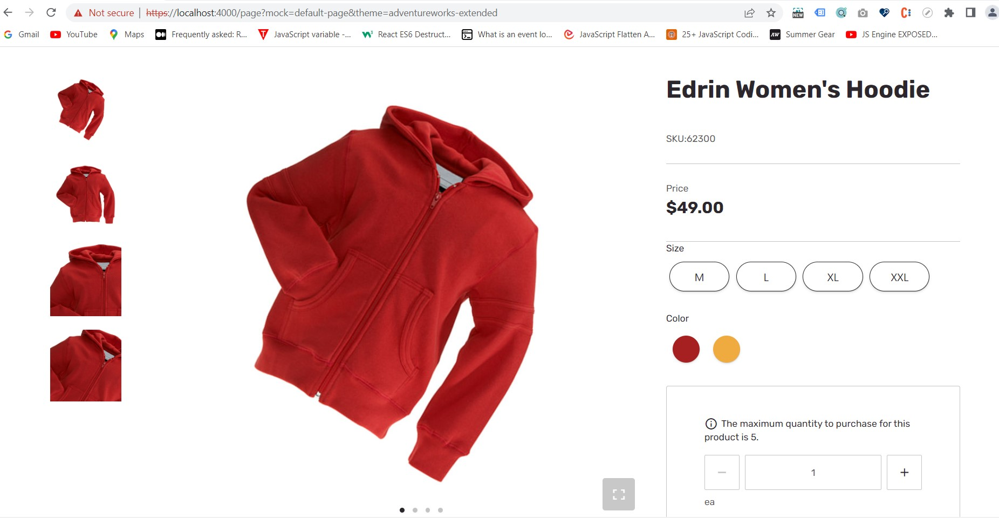

# Dynamics 365 Commerce - online extensibility samples

## License
License is listed in the [LICENSE](./LICENSE) file.

# Sample - Buybox Media Gallery Customization

## Overview
The objective of the sample is to leverage the existing buybox media gallery design similar to fabrikam buybox media gallery design.



## Starter kit license
License for starter kit is listed in the [LICENSE](./module-library/LICENSE) .

## Prerequisites
Follow the instructions mentioned in [document](https://docs.microsoft.com/en-us/dynamics365/commerce/e-commerce-extensibility/setup-dev-environment) to set up the development environment.

### Procedure to extend theme from base theme
Follow the instructions mentioned in [document](https://learn.microsoft.com/en-us/dynamics365/commerce/e-commerce-extensibility/extend-theme) to extend the theme

Extend a theme with name adventureworks-extended for adventureworks theme.

## Detailed Steps

### 1. Extend media gallery view extension file.
Create a new file **media-gallery.view.tsx** under **\src\themes\adventureworks-extended\views** folder and copy the code given below. Removed unnecessary code which was getting used to open modal popup to show zoomed image view on thumbnail click.

```typescript
/*!
 * Copyright (c) Microsoft Corporation.
 * All rights reserved. See LICENSE in the project root for license information.
 */
import {
    IMediaGalleryThumbnailItemViewProps,
    IMediaGalleryThumbnailsViewProps,
    IMediaGalleryViewProps
} from '@msdyn365-commerce-modules/media-gallery';
import { Module, Node } from '@msdyn365-commerce-modules/utilities';
import React from 'react';

/**
 * Render the thumbnail item images.
 * @param thumbnail - The carousel thumbnail line props.
 * @returns Return HTML having thumnailcontainer props with image.
 */
const renderThumbnailItem = (thumbnail: IMediaGalleryThumbnailItemViewProps): JSX.Element => {
    // eslint-disable-next-line @typescript-eslint/naming-convention --  Dependency from media-gallery.tsx file
    const { ThumbnailItemContainerProps, Picture } = thumbnail;

    return <Node {...ThumbnailItemContainerProps}>{Picture}</Node>;
};

/**
 * Render the Media gallery thumbnails to represent images in grid view.
 * @param thumbnails - The thumbnail view props.
 * @param props - The media gallery view props.
 * @returns - The single slide carousel component to render as media gallery image.
 */
const renderThumbnails = (thumbnails: IMediaGalleryThumbnailsViewProps, props: IMediaGalleryViewProps): JSX.Element => {
    // eslint-disable-next-line @typescript-eslint/naming-convention --  Dependency from media-gallery.tsx file
    const { ThumbnailsContainerProps, SingleSlideCarouselComponentProps, items } = thumbnails;
    return (
        <Node {...ThumbnailsContainerProps}>
            <Node {...SingleSlideCarouselComponentProps}>{items?.map(renderThumbnailItem)}</Node>
        </Node>
    );
};

/**
 * Render the Media gallery items using viewprops.
 * @param props - The media gallery view props.
 * @returns The media gallery module wrapping up images node.
 */
const mediaGalleryView: React.FC<IMediaGalleryViewProps> = props => {
    // eslint-disable-next-line @typescript-eslint/naming-convention --  Dependency from media-gallery.tsx file
    const { CarouselProps, Thumbnails, MediaGallery, Modal } = props;
    return (
        <Module {...MediaGallery}>
            <Node {...CarouselProps} />
            {Modal}
            {renderThumbnails(Thumbnails, props)}
        </Module>
    );
};

export default mediaGalleryView;
```

### 2. Add buybox media gallery CSS styles

In this step we will add SCSS for the buybox media gallery design.
Create a folder **modules** under **src/themes/adventureworks-extended/styles**
Create a file **buybox.scss** under **src/themes/adventureworks-extended/styles/modules** and add the below code.

```scss
.ms-buybox {
    &__media-gallery {
        .ms-media-gallery__carousel {
            display: flex;
            width: 100%;

            .msc-carousel__control__prev, .msc-carousel__control__next {
                display: none;
            }
        }

        .ms-media-gallery__thumbnail-item {
            .ms-fullscreen-section {
                .ms-fullscreen-section__overlay {
                    display: none;
                }
            }
        }

        .msc-ss-carousel-vert {
            .msc-ss-carousel-vert-strip {
                .msc-ss-carousel-vert-slide {
                    flex-direction: column;
                }
            }
        }
    }
    @media (min-width: ($msv-breakpoint-l) + 1) {
        &__media-gallery {
            .ms-media-gallery {
                &.vertical {
                    .msc-ss-carousel-vert-slide {
                        .ms-media-gallery__thumbnail-item {
                            &:nth-of-type(2n) {
                                margin-left: 0;
                            }
                        }
                    }
                }
            }
        }
    }
}

.ms-media-gallery {
    .ms-media-gallery__thumbnails-container {
        width: auto;
    }
}

.msc-modal .msc-fullview-modal.ms-media-gallery__modal {
    margin: 0;
}
```
### 3. Build and test module
The sample can now be tested in a web browser using the ```yarn start``` command.

### 4. Senario to test with mock
Test the module using page mock, Go to browser and copy paste the below url
https://localhost:4000/page?mock=default-page&theme=adventureworks-extended
(ensure that you have the  [MSDyn365_HOST environment](https://docs.microsoft.com/en-us/dynamics365/commerce/e-commerce-extensibility/configure-env-file#msdyn365_host) variable properly set).

## Third party Image and Video Usage restrictions

The software may include third party images and videos that are for personal use only and may not be copied except as provided by Microsoft within the demo websites.  You may install and use an unlimited number of copies of the demo websites., You may not publish, rent, lease, lend, or redistribute any images or videos without authorization from the rights holder, except and only to the extent that the applicable copyright law expressly permits doing so.
