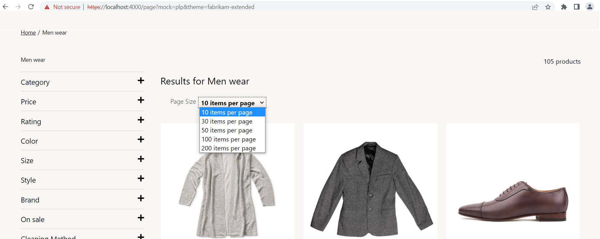
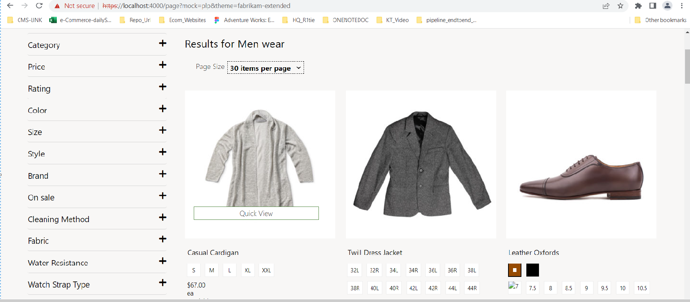
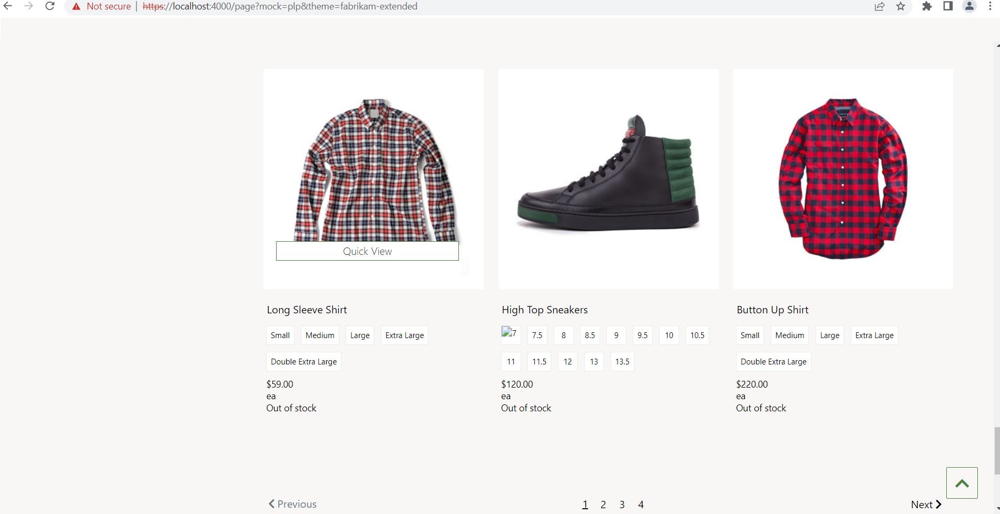

# Dynamics 365 Commerce - online extensibility samples

## License
License is listed in the [LICENSE](./LICENSE) file.

# Sample - PLP Custom drop down paging

## Overview
This sample will demonstrate custom pagination using custom page size selection through dropdown, when we select page size from drop down it will display number of products in a page with no of paging in the category/search result page.







## Starter kit license

License for starter kit is listed in the [LICENSE](./module-library/LICENSE) .

## Prerequisites

Follow the instructions mentioned in [document](https://docs.microsoft.com/en-us/dynamics365/commerce/e-commerce-extensibility/setup-dev-environment) to set up the development environment.

## Detailed Steps

### 1. Add custom-search-result-container Module.

In this step we will clone the search result container module and then modify to custom dropdown paging.Below is the CLI for cloning the core module
**yarn msdyn365 clone search-result-container custom-search-result-container**


### 2. Modify custom-search-result-container.tsx.

Go to custom-search-result-container.tsx under **src/Modules/custom-search-result-container** and replace existing code with below code.Added **_getPageSizeDropDown,_getUpdatedPageSizeSelectionOption** and **_updatePageSizeByDropdown** also update **_getPagination** functions to achieve drop down custom paging. 

```typescript
/*--------------------------------------------------------------
 * Copyright (c) Microsoft Corporation. All rights reserved.
 * See License.txt in the project root for license information.
 *--------------------------------------------------------------*/

/* eslint-disable no-duplicate-imports */
import {
    CategoryHierarchy as CategoryHierarchyData,
    IProductRefinerHierarchy,
    IProductsDimensionsAvailabilities
} from '@msdyn365-commerce/commerce-entities';
import MsDyn365, { getCatalogId, ICoreContext } from '@msdyn365-commerce/core';
import { format, ProductPrice, ProductRefinerValue, SortColumn, TextValueTranslation } from '@msdyn365-commerce/retail-proxy';
import {
    ArrayExtensions,
    DimensionAvailabilitiesForProductSearchResultInput,
    DimensionTypes,
    getDimensionAvailabilitiesForProductSearchResultAction,
    getPriceForProductSearchResult,
    IDimensionsApp,
    PriceForProductSearchResultInput
} from '@msdyn365-commerce-modules/retail-actions';
import {
    getTelemetryObject,
    ILabeledDropdownOnChangeNotification,
    ILabeledDropdownOption,
    IModuleProps,
    INodeProps,
    isMobile,
    ITelemetryContent,
    LabeledDropdown,
    UncontrolledPagination,
    VariantType
} from '@msdyn365-commerce-modules/utilities';
import classnames from 'classnames';
import { computed, observable, reaction, transaction } from 'mobx';
import { observer } from 'mobx-react';
import * as React from 'react';

import {
    buildListPageUrl,
    getCollectionProducts,
    getCollectionRefinersAction,
    getCurrentUrl,
    GetFullProductsByCollectionInput,
    parseQueryParam,
    ProductListInventoryFilteringOptions,
    RefinersByCollectionInput,
    sortOptions
} from './actions';
import { hydrateRefinersFromUrl } from './actions/url-utils';
import {
    ErrorMessage,
    FeatureSearchResultItem,
    getUpdatedRefinementCriteria,
    IChoiceSummaryClickNotification,
    IRefineItemCommonProps,
    IRefineItemToggleNotification,
    ISearchResultModalViewProps,
    isMatchingRefinementCriterion,
    Link,
    ModalToggle,
    ProductSearchResultItems,
    SearchResultModal,
    Separator,
    Title
} from './components';
import ChoiceSummary from './components/choice-summary';
import RefineSubmenu from './components/refine-submenu';
import { ICustomSearchResultContainerData } from './custom-search-result-container.data';
import { expandRefinersCount, ICustomSearchResultContainerProps } from './custom-search-result-container.props.autogenerated';

export interface ISearchResultContainerViewProps extends ICustomSearchResultContainerProps<ICustomSearchResultContainerData> {
    products?: React.ReactNode;
    className?: string;
    SearchResultContainer: IModuleProps;
    TitleViewProps: ITitleViewProps;
    categoryHierarchy: ICategoryHierarchyViewProps;
    pagination?: React.ReactNode;
    ProductsContainer: INodeProps;
    PageSizeContainer: INodeProps;
    ProductSectionContainer: INodeProps;
    refineMenu: IRefineMenuViewProps;
    sortByOptions: ISortByViewProps;
    filterByOptions: IFilterByPageSizeProps;
    choiceSummary?: React.ReactNode;
    modalToggle: React.ReactNode;
    searchResultModal: ISearchResultModalViewProps;
    isMobile: boolean;
    CategoryNavContainer: INodeProps;
    RefineAndProductSectionContainer: INodeProps;
    errorMessage: React.ReactNode;
    FeatureSearchContainer: INodeProps;
    similarLookProduct?: React.ReactNode;
    productPrices?: ProductPrice[];
}

export interface ITitleViewProps {
    TitleContainer: INodeProps;
    title: ISearchResultTitle;
}

export interface IRefineMenuViewProps {
    RefineMenuContainer: INodeProps;
    RefinerSectionContainer: INodeProps;
    refiners?: React.ReactNode[];
}

export interface ICategoryHierarchyViewProps {
    categoryHierarchyList?: React.ReactNode[];
    categoryHierarchySeparator?: React.ReactNode;
    CategoryHierarchyContainer: INodeProps;
}

export interface ISortByViewProps {
    SortingContainer: INodeProps;
    sortByDropDown?: React.ReactNode;
}

export interface IFilterByPageSizeProps {
    FilterContainer: INodeProps;
    filterByDropDown?: React.ReactNode;
}

export type GridSize = 'xs' | 'sm' | 'md' | 'lg' | 'xl';

/**
 * Title component for search result container.
 */
export interface ISearchResultTitle {
    titlePrefix?: React.ReactNode;
    titleText?: React.ReactNode;
    titleCount?: React.ReactNode;
}

export interface ISearchResultContainerState {
    sortingState: ISortByCollectionState;
    modalIsOpen: boolean;
    refiners: IProductRefinerHierarchy[];
    productsDimensionAvailabilities?: IProductsDimensionsAvailabilities[][];
    customPage: number;
}

interface ISortByCollectionState {
    selectedSortByOption: ILabeledDropdownOption;
    pending: boolean;
}

/**
 *
 * SearchResultContainer component.
 * @extends {React.PureComponent<ICustomSearchResultContainerProps<ICustomSearchResultContainerData>>}
 */
@observer
export default class SearchResultContainer extends React.PureComponent<
    ICustomSearchResultContainerProps<ICustomSearchResultContainerData>,
    ISearchResultContainerState
> {
    @computed get isMobile(): boolean {
        return this._viewport === 'xs' || this._viewport === 'sm';
    }

    private readonly sortByDropdownOptions: ILabeledDropdownOption[] = [
        { key: sortOptions.sortByOptionRelevanceDesc, value: this.props.resources.sortByOptionRelevanceDesc },
        { key: sortOptions.sortByOptionNameAsc, value: this.props.resources.sortByOptionNameAsc },
        { key: sortOptions.sortByOptionNameDesc, value: this.props.resources.sortByOptionNameDesc },
        { key: sortOptions.sortByOptionPriceAsc, value: this.props.resources.sortByOptionPriceAsc },
        { key: sortOptions.sortByOptionPriceDesc, value: this.props.resources.sortByOptionPriceDesc },
        { key: sortOptions.sortByOptionRatingDesc, value: this.props.resources.sortByOptionRatingDesc },
        { key: sortOptions.sortByOptionBestSelling, value: this.props.resources.sortByOptionBestSelling },
        { key: sortOptions.sortByOptionNewScore, value: this.props.resources.sortByOptionNewScore },
        { key: sortOptions.sortByOptionTrendingScore, value: this.props.resources.sortByOptionTrendingScore }
    ];

    private readonly sortByPageSizeDropdownOptions: ILabeledDropdownOption[] = [
        { key: '10', value: '10 items per page' },
        { key: '30', value: '30 items per page' },
        { key: '50', value: '50 items per page' },
        { key: '100', value: '100 items per page' },
        { key: '200', value: '200 items per page' }
    ];

    private readonly _refineItemCommonProps: IRefineItemCommonProps;

    private readonly _pageType: string | undefined = this.props.context.request.urlTokens.pageType;

    @observable
    private _viewport: GridSize = 'lg';

    private readonly _modalToggleRef: React.RefObject<HTMLButtonElement>;

    private readonly _sortAndFilterContainerRef: React.RefObject<LabeledDropdown>;

    private readonly _pageSizeContainerRef: React.RefObject<LabeledDropdown>;

    private expandrefinerCount: number | undefined = 0;

    private readonly telemetryContent: ITelemetryContent;

    private readonly productPrices: ProductPrice[];

    private readonly defaultPageNumber = 0;

    private readonly catalogId = getCatalogId(this.props.context.request);

    public constructor(props: ICustomSearchResultContainerProps<ICustomSearchResultContainerData>, state: ISearchResultContainerState) {
        super(props);
        this._viewport =
            props.context.request && props.context.request.device && props.context.request.device.Type === 'Mobile' ? 'xs' : 'lg';
        this._modalToggleRef = React.createRef<HTMLButtonElement>();
        this._sortAndFilterContainerRef = React.createRef<LabeledDropdown>();
        this._pageSizeContainerRef = React.createRef<LabeledDropdown>();
        this._toggleModal = this._toggleModal.bind(this);
        this._updateViewport = this._updateViewport.bind(this);
        this.productPrices = [];
        this.state = {
            sortingState: {
                pending: false,
                selectedSortByOption: this.sortByDropdownOptions[0]
            },
            modalIsOpen: false,
            refiners: [],
            customPage: 10
        };
        const { placeholderTextMax, minLabel, maxLabel, rangeNameFormat } = this.props.resources;

        const locale = this.props.context.request.locale;
        const telemetry = this.props.telemetry;
        const validationErrorNaN = this.props.resources.validationErrorNotNumber;
        const validationErrorRange = this.props.resources.validationErrorNotRange;
        this._refineItemCommonProps = {
            telemetry,
            locale,
            placeholderTextMax,
            minLabel,
            maxLabel,
            rangeNameFormat,
            validationErrorNaN,
            validationErrorRange
        };
        this.telemetryContent = getTelemetryObject(
            this.props.context.request.telemetryPageName!,
            this.props.friendlyName,
            this.props.telemetry
        );

        // Initalization of list page
        // eslint-disable-next-line max-len -- existing code eslint-disable @typescript-eslint/no-floating-promises, promise/catch-or-return, promise/always-return, promise/prefer-await-to-then -- existing code
        this.props.data.products.then(products => {
            this.props.data.listPageState.then(listPageState => {
                if (this._pageType === 'Category') {
                    listPageState.pageType = 'Category';
                } else {
                    listPageState.pageType = 'Search';
                }

                let querySorting: SortColumn[] = [];

                if (this.props.context.request.query && this.props.context.request.query.sorting) {
                    querySorting = JSON.parse(decodeURIComponent(this.props.context.request.query.sorting)) as SortColumn[];
                }
                if (this.props.context.request.query && this.props.context.request.query.top) {
                    const queryPageSize = this.props.context.request.query.top ? +this.props.context.request.query.top : 0;
                    this.props.config.itemsPerPage = queryPageSize > 0 ? queryPageSize : this.props.config.itemsPerPage;
                }
                // eslint-disable-next-line @typescript-eslint/prefer-nullish-coalescing, max-len -- existing code
                listPageState.currentPageNumber =
                    (this.props.context.request.query && +this.props.context.request.query.skip / (this.props.config.itemsPerPage || 10)) ||
                    0;
                listPageState.sortingCritera = { Columns: querySorting };
                listPageState.pageSize = this.props.config.itemsPerPage || 10;
                listPageState.activeProducts = products.products;
                listPageState.totalProductCount = products.count;
                listPageState.activeFilters = hydrateRefinersFromUrl(this.props.context.request);

                // Initialize reaction based on listPageState properties
                reaction(
                    () => {
                        // eslint-disable-next-line max-len -- existing code
                        return [
                            listPageState.activeFilters && listPageState.activeFilters.length,
                            listPageState.currentPageNumber,
                            listPageState.sortingCritera &&
                                listPageState.sortingCritera.Columns &&
                                listPageState.sortingCritera.Columns.length
                        ];
                    },
                    () => {
                        const input = new GetFullProductsByCollectionInput(
                            listPageState.pageType,
                            this.props.context.request.apiSettings,
                            // eslint-disable-next-line max-len -- existing code
                            {
                                Paging: {
                                    Top: this.props.config.itemsPerPage,
                                    Skip: Math.max(listPageState.pageSize * (listPageState.currentPageNumber || 0), 0)
                                },
                                count: true,
                                Sorting: listPageState.sortingCritera || {}
                            },
                            listPageState.activeFilters || [],
                            +(this.props.context.request.urlTokens.itemId || 0),

                            // eslint-disable-next-line max-len -- existing code
                            this.props.context.request.query && this.props.context.request.query.q
                                ? this.props.context.request.query.q
                                : JSON.stringify({
                                      ProductId: this.props.context.request.query?.productId,
                                      Recommendation: this.props.context.request.query?.recommendation
                                  }),
                            !!(
                                this.props &&
                                this.props.config &&
                                this.props.config.includeAttributes !== undefined &&
                                this.props.config.includeAttributes
                            ),
                            this.props.config.updateRefinerPanel,
                            this.props.context.request.locale,
                            this.catalogId
                        );
                        getCollectionProducts(input, this.props.context.actionContext).then(productResults => {
                            listPageState.activeProducts = productResults.products;
                            listPageState.totalProductCount = productResults.count;

                            if (
                                this.props.config.enableAffiliationBasedPricing &&
                                this.props.context.actionContext.requestContext?.user?.isAuthenticated
                            ) {
                                this._getActivePrice();
                            }
                        });

                        if (this.props.config.updateRefinerPanel) {
                            const refinerInput = new RefinersByCollectionInput(
                                listPageState.pageType,
                                this.props.context.request.apiSettings,
                                {
                                    Paging: {
                                        Top: this.props.config.itemsPerPage,
                                        Skip: Math.max(
                                            listPageState.pageSize * (listPageState.currentPageNumber ?? this.defaultPageNumber),
                                            this.defaultPageNumber
                                        )
                                    },
                                    count: true,
                                    Sorting: listPageState.sortingCritera ?? {}
                                },
                                listPageState.activeFilters ?? [],
                                +(this.props.context.request.urlTokens.itemId ?? 0),
                                this.props.context.request.query?.q
                                    ? this.props.context.request.query.q
                                    : this.props.context.request.query?.productId,
                                false,
                                this.props.config.updateRefinerPanel,
                                undefined,
                                this.catalogId
                            );

                            getCollectionRefinersAction(refinerInput, this.props.context.actionContext)
                                .then(refiners => {
                                    this.setState({ refiners });
                                })
                                .catch(error => {
                                    this.props.telemetry.error(error);
                                });
                        }
                    }
                );
                reaction(
                    () => listPageState.pageSize,
                    pageSize => {
                        this.props.config.itemsPerPage = pageSize;
                        const input = new GetFullProductsByCollectionInput(
                            listPageState.pageType,
                            this.props.context.request.apiSettings,
                            {
                                Paging: {
                                    Top: this.props.config.itemsPerPage,
                                    Skip: Math.max(listPageState.pageSize * (listPageState.currentPageNumber || 0), 0)
                                },
                                count: true,
                                Sorting: listPageState.sortingCritera || {}
                            },
                            listPageState.activeFilters || [],
                            +(this.props.context.request.urlTokens.itemId || 0),
                            this.props.context.request.query && this.props.context.request.query.q
                                ? this.props.context.request.query.q
                                : JSON.stringify({
                                      ProductId: this.props.context.request.query?.productId,
                                      Recommendation: this.props.context.request.query?.recommendation
                                  }),
                            !!(
                                this.props &&
                                this.props.config &&
                                this.props.config.includeAttributes !== undefined &&
                                this.props.config.includeAttributes
                            ),
                            this.props.config.updateRefinerPanel,
                            this.props.context.request.locale,
                            this.catalogId
                        );
                        getCollectionProducts(input, this.props.context.actionContext).then(productResults => {
                            listPageState.activeProducts = productResults.products;
                            listPageState.totalProductCount = productResults.count;
                            if (
                                this.props.config.enableAffiliationBasedPricing &&
                                this.props.context.actionContext.requestContext?.user?.isAuthenticated
                            ) {
                                // tslint:disable-next-line:no-floating-promises
                                this._getActivePrice();
                            }
                        });
                        this._getPagination();
                    }
                );
            });
        });
        // eslint-disable-next-line max-len -- existing code eslint-enable @typescript-eslint/no-floating-promises, promise/catch-or-return, promise/always-return, promise/prefer-await-to-then -- Existing code. */
        if (this.props.context.request.query?.productId) {
            this.props.data.featureProduct.then(products => {
                this.props.data.listPageState.then(listPageStateFeature => {
                    listPageStateFeature.featureProduct = products;
                });
            });
        }
        this._updateViewport();
    }

    public static getFriendlyName(locale: string, nameTranslations?: TextValueTranslation[]): string | undefined {
        let nameTranslation: TextValueTranslation | undefined;
        if (locale && nameTranslations && ArrayExtensions.hasElements(nameTranslations)) {
            nameTranslation = nameTranslations.find(item => item.Language!.toLowerCase() === locale.toLowerCase());
        }

        return nameTranslation?.Text;
    }

    public async componentDidMount(): Promise<void> {
        if (MsDyn365.isBrowser && window.addEventListener) {
            window.addEventListener('resize', this._updateViewport);
            this._updateViewport();
        }
        if (this.props.config.enableAffiliationBasedPricing && this.props.context.actionContext.requestContext?.user?.isAuthenticated) {
            this._getActivePrice();
        }
        const context = this.props.context as ICoreContext<IDimensionsApp>;
        const dimensionsToDisplayOnProductCard = context.app.config.dimensionsInProductCard;
        const dimensionsToDisplayAsSwatch = context.app.config.dimensionsAsSwatchType;
        if (
            ArrayExtensions.hasElements(dimensionsToDisplayOnProductCard) &&
            !dimensionsToDisplayOnProductCard.includes(DimensionTypes.none) &&
            ArrayExtensions.hasElements(dimensionsToDisplayAsSwatch) &&
            !dimensionsToDisplayAsSwatch.includes(DimensionTypes.none) &&
            this.props.config.includeAttributes
        ) {
            await this._getProductsDimensionsAvailabilities();
        }
    }

    public componentWillUnmount(): void {
        if (MsDyn365.isBrowser && window.removeEventListener) {
            window.removeEventListener('resize', this._updateViewport);
        }
    }

    public render(): JSX.Element {
        const { imageSettings, className } = this.props.config;
        const { resources } = this.props;
        const products = (this.props.data.listPageState.result && this.props.data.listPageState.result.activeProducts) || [];
        const searchProduct = (this.props.data.listPageState.result && this.props.data.listPageState.result.featureProduct) || null;
        let errorText = '';
        if (!products || products.length === 0) {
            errorText = this._pageType === 'Category' ? resources.resultCategoryNotFoundText : resources.resultSearchNotFoundText;
        }
        const productsComponent = this._getProducts();
        const featureComponent = (
            <FeatureSearchResultItem
                product={searchProduct}
                context={this.props.context}
                imageSettings={imageSettings}
                resources={resources}
                moduleType={this.props.typeName}
                moduleId={this.props.id}
                telemetryContent={this.telemetryContent}
                recommendation={this.props.context.request.query && this.props.context.request.query?.recommendation}
            />
        );

        const searchResultContainerViewProps = {
            ...this.props,
            products: productsComponent,
            TitleViewProps: this._getCollectionTitle(),
            categoryHierarchy: !this.props.config.disableHierarchy && this._getCategoryHierarchy(),
            refineMenu: this._getRefineMenu(),
            className: classnames('ms-search-result-container', className),
            SearchResultContainer: {
                moduleProps: this.props,
                className: classnames('ms-search-result-container', className)
            },
            PageSizeContainer: { className: 'ms-search-result-wrapper-sort-by-category' },
            // eslint-disable-next-line max-len -- existing code
            sortByOptions:
                this.props.data.listPageState.result && this.props.data.listPageState.result.totalProductCount !== 0
                    ? this._getSortingDropDown()
                    : null,
            filterByOptions:
                this.props.data.listPageState.result && this.props.data.listPageState.result.totalProductCount !== 0
                    ? this._getPageSizeDropDown()
                    : null,
            pagination: this._getPagination(),
            ProductsContainer: { className: 'ms-search-result-container__Products' },
            ProductSectionContainer: { className: 'ms-search-result-container__product-section' },
            CategoryNavContainer: { className: 'ms-search-result-container__category-nav-section' },
            RefineAndProductSectionContainer: { className: 'ms-search-result-container__refine-product-section' },
            choiceSummary: this._getChoiceSummary(),
            modalToggle:
                this.props.data.listPageState.result && this.props.data.listPageState.result.totalProductCount !== 0 ? (
                    <ModalToggle
                        text={resources.modalTitle}
                        ariaLabel={resources.modalTitle}
                        innerRef={this._modalToggleRef}
                        onClick={this._toggleModal}
                        id='search-result-modal'
                    />
                ) : null,
            searchResultModal: this._getSearchResultModal(),
            isMobile: this.isMobile,
            errorMessage: errorText && <ErrorMessage text={errorText} />,
            FeatureSearchContainer: { className: 'ms-feature-search-result' },
            // eslint-disable-next-line max-len -- existing code
            similarLookProduct:
                this.props.data.listPageState.result &&
                this.props.data.listPageState.result.featureProduct !== null &&
                this.props.data.listPageState.result.featureProduct !== undefined
                    ? featureComponent
                    : null,
            productPrices: this.productPrices
        };
        return this.props.renderView(searchResultContainerViewProps) as React.ReactElement;
    }

    /**
     * Get products dimension availabilities.
     * @returns Void.
     */
    private readonly _getProductsDimensionsAvailabilities = async (): Promise<void> => {
        const productsList = this.props.data.listPageState.result?.activeProducts ?? [];

        const productsDimensionAvailabilities = await getDimensionAvailabilitiesForProductSearchResultAction(
            new DimensionAvailabilitiesForProductSearchResultInput(productsList, this.props.context as ICoreContext<IDimensionsApp>),
            this.props.context.actionContext
        );

        if (ArrayExtensions.hasElements(productsDimensionAvailabilities)) {
            this.setState({ productsDimensionAvailabilities });
        }
    };

    /**
     * Get the active price for the products.
     */
    private readonly _getActivePrice = async (): Promise<void> => {
        const productsList = this.props.data.listPageState.result?.activeProducts ?? [];
        const products = await getPriceForProductSearchResult(
            new PriceForProductSearchResultInput(productsList),
            this.props.context.actionContext
        );

        const listPageState = await this.props.data.listPageState;
        listPageState.activeProducts = products;
    };

    private readonly _getSearchResultModal = (): ISearchResultModalViewProps => {
        const { resources } = this.props;
        return SearchResultModal({
            resources: {
                modalCloseButtonText: resources.modalCloseButtonText,
                modalTitle: resources.modalTitle
            },
            isOpen: this.state.modalIsOpen,
            returnRef: this._modalToggleRef,
            onModalToggle: this._toggleModal
        });
    };

    private readonly _getCollectionTitle = (): ITitleViewProps => {
        const { data, context, resources } = this.props;

        let collectionTitle: string | undefined = '';
        if (context && context.request && context.request.query && context.request.query.q) {
            collectionTitle = `"${context.request.query.q}"`;
        } else {
            collectionTitle =
                (data.category.result &&
                    SearchResultContainer.getFriendlyName(context.request.locale, data.category.result.NameTranslations)) ||
                (data.category.result && data.category.result.Name);
        }
        let productCountText = '';
        let productCountNumber: number | undefined;
        if (data.listPageState && data.listPageState.result && data.listPageState.result.totalProductCount !== undefined) {
            productCountNumber = data.listPageState.result.totalProductCount;
        } else if (data.products && data.products.result) {
            productCountNumber = data.products.result.count;
        }

        if (productCountNumber && productCountNumber !== 0) {
            productCountText =
                productCountNumber !== 1
                    ? format(this.props.resources.numberOfProducts, productCountNumber)
                    : this.props.resources.oneProduct;
        } else {
            productCountText = format(this.props.resources.numberOfProducts, 0);
        }
        const pageName = context.request.telemetryPageName ? `result-count-${context.request.telemetryPageName.toLowerCase()}` : '';
        const titlePrefix = <Title className='ms-search-result__collection-title-prefix' text={resources.searchTextPrefix} />;
        const titleText = collectionTitle && <Title className='ms-search-result__collection-title-text' text={collectionTitle} />;
        const titleCount = <Title className='ms-search-result__collection-title-count' text={productCountText} />;

        return {
            TitleContainer: { className: `ms-search-result-container__title ${pageName}` },
            title: {
                titlePrefix,
                titleText,
                titleCount
            }
        };
    };

    private readonly _getCategoryHierarchy = (): ICategoryHierarchyViewProps => {
        const { data } = this.props;
        const categoryHierarchy = data.categoryHierarchy.result;
        const categoryLinks =
            categoryHierarchy &&
            categoryHierarchy.map((value: CategoryHierarchyData, index: number) => {
                return (
                    <Link
                        key={index}
                        text={value.Name}
                        ariaLabel={`${this.props.resources.categoryLinkAriaLabel} ${value.Name}`}
                        href={value.Url}
                    />
                );
            });
        const categoryLinkSeparator = <Separator separator='/' />;

        return {
            CategoryHierarchyContainer: { tag: 'nav', className: 'ms-search-result-container__category-hierarchy' },
            categoryHierarchyList: categoryLinks,
            categoryHierarchySeparator: categoryLinkSeparator
        };
    };

    private readonly _getPageSizeDropDown = (): IFilterByPageSizeProps => {
        const labelText = 'Page Size';
        const options = this.sortByPageSizeDropdownOptions;
        const activeOption = this._getUpdatedPageSizeSelectionOption();
        const dropdown = (
            <LabeledDropdown
                labelClassname='reviews-list-sort-by'
                labelText={labelText}
                dropdownId='categoryPageSizeFilterByDropdown'
                dropdownClassname='reviews-list-dropdown'
                toggleColor='link'
                dropdownOptions={options}
                selectedOption={activeOption}
                onSelectOption={this._updatePageSizeByDropdown}
                ref={this._pageSizeContainerRef}
            />
        );
        return {
            FilterContainer: { className: 'ms-search-result-container__Sort-by-category' },
            filterByDropDown: dropdown
        };
    };

    private readonly _getSortingDropDown = (): ISortByViewProps => {
        const { resources } = this.props;
        const activeDropdown = this._getCurrentlySelectedOption() || this.state.sortingState.selectedSortByOption;
        let dropdownOptions = this._getAllSortByOptions();
        // eslint-disable-next-line @typescript-eslint/no-unsafe-member-access -- App config settings are of "any" value.
        if (this.props.context.app.config.hideRating) {
            dropdownOptions = dropdownOptions.filter(dropdownOption => dropdownOption.key !== sortOptions.sortByOptionRatingDesc);
        }

        const dropdown = (
            <LabeledDropdown
                labelClassname='reviews-list-sort-by'
                labelText={resources.sortByDropdownLabel}
                dropdownId='categorySortByDropdown'
                dropdownClassname='reviews-list-dropdown'
                toggleColor='link'
                dropdownOptions={dropdownOptions}
                selectedOption={activeDropdown}
                onSelectOption={this._updateSortByDropdown}
                ref={this._sortAndFilterContainerRef}
            />
        );
        return {
            SortingContainer: { className: 'ms-search-result-container__Sort-by-category' },
            sortByDropDown: dropdown
        };
    };

    private readonly _getPagination = (): React.ReactNode => {
        const { config, context, data, resources } = this.props;
        const listPageState = data && data.listPageState && data.listPageState.result;
        const fullUrl = getCurrentUrl(context.request);
        const itemsPerPage = config.itemsPerPage || 10;
        // eslint-disable-next-line max-len -- existing code
        const skipCount =
            listPageState && listPageState.currentPageNumber !== null
                ? listPageState.currentPageNumber * (this.props.config.itemsPerPage || 10)
                : (this.props.context.request.query && +this.props.context.request.query.skip) || 0;
        const totalItems = (listPageState && listPageState.totalProductCount) || 0;
        const previousText = resources.flipperPrevious;
        const nextText = resources.flipperNext;
        const urlWithTop = fullUrl.href.indexOf('?') > 0 ? `${fullUrl.href}&top=${itemsPerPage}` : `${fullUrl.href}?top= ${itemsPerPage}`;
        if (totalItems <= itemsPerPage) {
            return null;
        }
        return (
            <UncontrolledPagination
                className='ms-search-result-container__pagination'
                role='navigation'
                aria-label={resources.paginationAriaLabel}
                url={urlWithTop}
                qsp='skip'
                items={totalItems}
                itemsPerPage={itemsPerPage}
                startingItem={skipCount}
                previousText={this._renderPrev(previousText)}
                nextText={this._renderNext(nextText)}
                previousAriaLabel={previousText}
                nextAriaLabel={nextText}
                telemetryContent={this.telemetryContent}
            />
        );
    };

    private readonly _getRefineMenu = (): IRefineMenuViewProps => {
        const { data, context, config } = this.props;
        const tempRangeTypeTODO = context.request.query && context.request.query.inputRange ? 'input' : 'slider';
        const validRefiners =
            this.props.config.updateRefinerPanel && ArrayExtensions.hasElements(this.state.refiners)
                ? this.state.refiners.filter(refiner => {
                      return ArrayExtensions.hasElements(refiner.Values) && !this._shouldHideFromRefiners(refiner);
                  })
                : data.refiners.result &&
                  data.refiners.result.filter(refiner => {
                      return ArrayExtensions.hasElements(refiner.Values) && !this._shouldHideFromRefiners(refiner);
                  });

        const activeRefiners = (data.listPageState.result && data.listPageState.result.activeFilters) || [];

        this._getexpandRefinerCount(validRefiners && validRefiners.length, config.expandRefinersCount);
        const expandedRefiners = this.expandrefinerCount;
        const subMenus =
            validRefiners &&
            validRefiners.map((productRefinerHierarchy: IProductRefinerHierarchy, index: number) => {
                return (
                    <RefineSubmenu
                        productRefinerHierarchy={productRefinerHierarchy}
                        selectedRefinerValues={activeRefiners}
                        refineItemCommonProps={this._refineItemCommonProps}
                        minValueSliderThumbAriaLabel={this.props.resources.minValueSliderThumbAriaLabel}
                        maxValueSliderThumbAriaLabel={this.props.resources.maxValueSliderThumbAriaLabel}
                        key={index}
                        onUpdateRefiners={this._onUpdateRefiners}
                        urlBuilder={this._buildRefinerUrl}
                        isDisabled={false}
                        isExpandedOnInitialLoad={!!(expandedRefiners && expandedRefiners > index)}
                        tempRangeTypeTODO={tempRangeTypeTODO}
                        context={context}
                        moduleId={this.props.id}
                        moduleTypeName={this.props.typeName}
                        telemetryContent={this.telemetryContent}
                        productCountAriaLabel={this.props.resources.productCountAriaLabel}
                        refineItemAriaLabel={this.props.resources.refineItemAriaLabel}
                        refineItemsAriaLabel={this.props.resources.refineItemsAriaLabel}
                        singleProductCountAriaLabel={this.props.resources.singleProductCountAriaLabel}
                        isMobile={this.isMobile}
                    />
                );
            });

        return {
            RefineMenuContainer: { className: 'ms-search-result-container__refine-menu' },
            RefinerSectionContainer: { className: 'ms-search-result-container__refiner-section' },
            refiners: subMenus
        };
    };

    /**
     * Should hide from refiners.
     * @param refiner - The refiner.
     * @returns ShouldHideFromRefiners.
     */
    private readonly _shouldHideFromRefiners = (refiner: IProductRefinerHierarchy): boolean => {
        // eslint-disable-next-line @typescript-eslint/no-unsafe-member-access -- app configs are of generic type
        return (
            this.props.context.app.config.productListInventoryDisplay === ProductListInventoryFilteringOptions.HideOOS &&
            refiner.RecordId === this.props.data.products.result?.channelInventoryConfigurationId
        );
    };

    private readonly _getChoiceSummary = (): React.ReactNode => {
        const { resources, data, telemetry } = this.props;
        const selectedRefiners = (data.listPageState.result && data.listPageState.result.activeFilters) || [];
        return (
            <ChoiceSummary
                classNames='ms-choice-summary-by-category'
                clearAllText={resources.clearAllText}
                label={resources.choiceSummaryLabel}
                closeAriaLabel={resources.closeAriaLabel}
                selectedChoices={selectedRefiners}
                // @ts-expect-error: NOTE Type-unsafe line below, null refinersByCategoryHierarchy case not handled
                refinerHierarchy={data.refiners.result}
                choiceFormat={resources.choiceFormat}
                choiceRangeValueFormat={resources.choiceRangeValueFormat}
                telemetry={telemetry}
                onChoiceClicked={this._onChoiceClicked}
                urlBuilder={this._buildRefinerUrlForChoiceSummary}
                choiceAriaLabel={resources.choiceAriaLabel}
                telemetryContent={this.telemetryContent}
                context={this.props.context}
                channelInventoryConfigurationId={this.props.data.products.result?.channelInventoryConfigurationId}
            />
        );
    };

    private readonly _getProducts = (): JSX.Element => {
        const { imageSettings, allowBackNavigation } = this.props.config;
        const { resources } = this.props;
        const breaCrumbType = this.props.context.app.config.breadcrumbType;
        const allowBack = allowBackNavigation && (breaCrumbType === 'back' || breaCrumbType === 'categoryAndBack');
        const products = (this.props.data.listPageState.result && this.props.data.listPageState.result.activeProducts) || [];
        const quickviewslot = this.props.slots && this.props.slots.quickview && this.props.slots.quickview[0];
        const isPriceMinMaxFeatureState = this.props.data.featureState.result?.find(
            featureState => featureState.Name === 'Dynamics.AX.Application.RetailSearchPriceRangeFeature'
        );
        return (
            <ProductSearchResultItems
                products={products}
                context={this.props.context}
                imageSettings={imageSettings}
                resources={resources}
                moduleType={this.props.typeName}
                moduleId={this.props.id}
                allowBackNavigation={allowBack}
                telemetryContent={this.telemetryContent}
                quickviewSlot={quickviewslot}
                channelInventoryConfigurationId={this.props.data.products.result?.channelInventoryConfigurationId}
                isPriceMinMaxEnabled={isPriceMinMaxFeatureState?.IsEnabled}
                productsDimensionAvailabilities={this.state.productsDimensionAvailabilities}
            />
        );
    };

    private readonly _updatePageSizeByDropdown = (notification: ILabeledDropdownOnChangeNotification): void => {
        this.setState({ customPage: Number(notification.selectedOption.key) });
        transaction(() => {
            this.props.data.listPageState.result!.currentPageNumber = 0;
            this.props.data.listPageState.result!.pageSize = Number(notification.selectedOption.key);
        });
    };

    private readonly _getUpdatedPageSizeSelectionOption = (): ILabeledDropdownOption | undefined => {
        const { config } = this.props;
        if (config.itemsPerPage) {
            return this.sortByPageSizeDropdownOptions.find(dropdownOption => Number(dropdownOption.key) === config.itemsPerPage);
        }
        return;
    };

    private readonly _updateSortByDropdown = (notification: ILabeledDropdownOnChangeNotification): void => {
        const { context } = this.props;
        const requestContext = context && context.request;
        const actionContext = context && context.actionContext;

        if (!requestContext || !actionContext || !this.props.data.listPageState.result) {
            // eslint-disable-next-line max-len -- existing code
            const error = `[sort-by-category] cannot sort without context: ${!requestContext ? 'requestContext ' : ''} ${
                !actionContext ? 'actionContext ' : ''
            } could not be found`;
            this.props.telemetry.warning(error);
        }

        window.history.pushState(
            {},
            '',
            buildListPageUrl(
                getCurrentUrl(this.props.context.request),
                undefined,
                [this._getSortColumnFromSelectedOption(notification.selectedOption)],
                undefined
            )
        );
        transaction(() => {
            this.props.data.listPageState.result!.currentPageNumber = 0;
            this.props.data.listPageState.result!.sortingCritera = {
                Columns: [this._getSortColumnFromSelectedOption(notification.selectedOption)]
            };
        });
    };

    private readonly _getSortColumnFromSelectedOption = (option: ILabeledDropdownOption): SortColumn => {
        const { data } = this.props;

        if (!data.searchConfiguration.result) {
            return {};
        }

        const mappedConfiguration = data.searchConfiguration.result.find(searchConfiguration => {
            return searchConfiguration.key === option.key;
        });

        if (mappedConfiguration) {
            return mappedConfiguration.sortColumn;
        }

        return {};
    };

    /**
     * Retrieves current sort criteria.
     * @returns Sort criteria column which is currently active or undefined if it's not specified.
     */
    private readonly _getSortCriteriaColumn = (): SortColumn | undefined => {
        const sortCriteria = this.props.data.listPageState.result?.sortingCritera;
        if (ArrayExtensions.hasElements(sortCriteria?.Columns)) {
            return sortCriteria!.Columns[0];
        }

        const queryColumns = parseQueryParam<SortColumn[]>('sorting', this.props.context.request);
        if (ArrayExtensions.hasElements(queryColumns)) {
            return queryColumns[0];
        }

        return undefined;
    };

    /**
     * Retrieves dropdown options.
     * @returns All dropdown options.
     */
    private readonly _getAllSortByOptions = (): ILabeledDropdownOption[] => {
        const searchConfiguration = this.props.data.searchConfiguration.result;

        if (!searchConfiguration) {
            return [];
        }

        const mappedSearchConfiguration = this.sortByDropdownOptions.filter(mappedSearchConfig =>
            searchConfiguration.find(item => mappedSearchConfig.key === item.key)
        );

        return ArrayExtensions.validValues(mappedSearchConfiguration);
    };

    /**
     * Retrieves current selected dropdown option based on the sort criteria.
     * @returns Current dropdown option.
     */
    private readonly _getCurrentlySelectedOption = (): ILabeledDropdownOption | undefined => {
        const activeSortColumn = this._getSortCriteriaColumn();

        const searchConfiguration = this.props.data.searchConfiguration.result;

        if (!activeSortColumn || !searchConfiguration) {
            return undefined;
        }

        const activeMappedConfig = searchConfiguration.find(
            mappedSearchConfig =>
                mappedSearchConfig.sortColumn.ColumnName === activeSortColumn.ColumnName &&
                mappedSearchConfig.sortColumn.IsDescending === activeSortColumn.IsDescending
        );
        if (!activeMappedConfig) {
            return undefined;
        }

        return this.sortByDropdownOptions.find(dropdownOption => dropdownOption.key === activeMappedConfig.key);
    };

    private readonly _onUpdateRefiners = (itemToggleNotification: IRefineItemToggleNotification): void => {
        const { context } = this.props;
        const requestContext = context && context.request;
        const actionContext = context && context.actionContext;

        if (!requestContext || !actionContext || !this.props.data.listPageState.result) {
            const error = `Refine menu cannot refine search criteria: ${!requestContext ? 'requestContext ' : ''} ${
                !actionContext ? 'actionContext ' : ''
            } could not be found`;
            this.props.telemetry.warning(error);
        }

        const updatedRefinementCriteria = getUpdatedRefinementCriteria(
            itemToggleNotification,
            (this.props.data.listPageState.result && this.props.data.listPageState.result.activeFilters) || []
        );

        window.history.pushState({}, '', buildListPageUrl(getCurrentUrl(this.props.context.request), updatedRefinementCriteria));
        transaction(() => {
            this.props.data.listPageState.result!.currentPageNumber = 0;
            this.props.data.listPageState.result!.activeFilters = updatedRefinementCriteria;
        });
    };

    private readonly _buildRefinerUrl = (itemToggleNotification: IRefineItemToggleNotification): string => {
        if (this.props.data.listPageState.result) {
            const newRefinementCriteria = getUpdatedRefinementCriteria(
                itemToggleNotification,
                this.props.data.listPageState.result.activeFilters || []
            );

            return buildListPageUrl(getCurrentUrl(this.props.context.request), newRefinementCriteria);
        }
        this.props.telemetry.warning('[buildRefinerQueryString]List Page State Not available, unable to build refiner URL');
        return '';
    };

    private readonly _onChoiceClicked = (notification: IChoiceSummaryClickNotification): void => {
        const { data, telemetry } = this.props;

        if (!data.listPageState.result) {
            telemetry.warning('[choice-summary-by-category._onChoiceClicked]ListPageState unavailable, unable to update refiners.');
            return;
        }

        let currentRefinementCriteria = (data.listPageState.result && data.listPageState.result.activeFilters) || [];

        if (!notification.clearAll) {
            const selectedChoice = notification.choiceClicked;
            if (!selectedChoice) {
                telemetry.warning('[choice-summary-by-category._onChoiceClicked] Choice could not be determined');
                return;
            }
            currentRefinementCriteria = currentRefinementCriteria.filter(
                (selectedCriterion: ProductRefinerValue) => !isMatchingRefinementCriterion(selectedChoice, selectedCriterion)
            );
        } else {
            currentRefinementCriteria = [];

            // Set focus to sort and filter
            const dropdownElementId = this._sortAndFilterContainerRef.current && this._sortAndFilterContainerRef.current.props.dropdownId;
            const dropdownElement = dropdownElementId && document.getElementById(dropdownElementId);
            setTimeout(() => {
                dropdownElement && dropdownElement.focus();
            }, 50);
        }

        const fullUrl = getCurrentUrl(this.props.context.request);
        window.history.pushState({}, '', buildListPageUrl(fullUrl, currentRefinementCriteria));
        data.listPageState.result.currentPageNumber = 0;
        data.listPageState.result.activeFilters = currentRefinementCriteria;
    };

    private readonly _buildRefinerUrlForChoiceSummary = (selectedRefiner: ProductRefinerValue, isClearAll: boolean): string => {
        const { data, telemetry } = this.props;
        const fullUrl = getCurrentUrl(this.props.context.request);

        if (!data.listPageState.result) {
            telemetry.warning('[choice-summary-by-category._buildRefinerUrl]ListPageState unavailable, unable to create refiner URL.');
            return fullUrl.href;
        }

        let currentRefinementCriteria = (data.listPageState.result && data.listPageState.result.activeFilters) || [];

        if (!isClearAll) {
            if (!selectedRefiner) {
                telemetry.warning('[choice-summary-by-category._buildRefinerUrl] URL for Choice could not be determined');
                return fullUrl.href;
            }
            currentRefinementCriteria = currentRefinementCriteria.filter(
                (selectedCriterion: ProductRefinerValue) => !isMatchingRefinementCriterion(selectedRefiner, selectedCriterion)
            );
        } else {
            currentRefinementCriteria = [];
        }

        return buildListPageUrl(fullUrl, currentRefinementCriteria);
    };

    private _getViewport(): GridSize {
        if (MsDyn365.isBrowser) {
            return isMobile({ variant: VariantType.Browser, context: this.props.context.request });
        }
        return isMobile({ variant: VariantType.Viewport, context: this.props.context.request });
    }

    private _toggleModal(): void {
        this.setState({
            modalIsOpen: !this.state.modalIsOpen
        });
    }

    private _updateViewport(): void {
        this._viewport = this._getViewport();

        if (this.state.modalIsOpen && !this.isMobile) {
            this._toggleModal();
        }
    }

    private readonly _getexpandRefinerCount = (validRefiners?: number, refinerCount?: expandRefinersCount): void => {
        switch (refinerCount) {
            case expandRefinersCount.all:
                this.expandrefinerCount = validRefiners;
                break;
            case expandRefinersCount.one:
                this.expandrefinerCount = 1;
                break;
            case expandRefinersCount.two:
                this.expandrefinerCount = 2;
                break;
            case expandRefinersCount.three:
                this.expandrefinerCount = 3;
                break;
            case expandRefinersCount.four:
                this.expandrefinerCount = 4;
                break;
            default:
                this.expandrefinerCount = 0;
        }
    };

    /**
     * Renders a Pagination previous text.
     * @param  paginationPreviousText - Pagination previous text from resources.
     * @returns Previous text and flipper icon.
     */
    private readonly _renderPrev = (paginationPreviousText: string) => {
        return (
            <div className='msc-pagination__prev'>
                <span className='ms-search-result__pagination-left' aria-hidden='true' />
                <span className='prev-text'>{paginationPreviousText}</span>
            </div>
        );
    };

    /**
     * Renders a Pagination next text.
     * @param  paginationNextText - Pagination next text from resources.
     * @returns Next text and flipper icon.
     */
    private readonly _renderNext = (paginationNextText: string) => {
        return (
            <div className='msc-pagination__next'>
                <span className='next-text'>{paginationNextText}</span>
                <span className='ms-search-result__pagination-right' aria-hidden='true' />
            </div>
        );
    };
}


```

### 3. Update the dependencies.

Go to index.ts under **src/Modules/custom-search-result-container/actions** and replace existing code with below code.In below code added two interfaces are "IFullProductsSearchResultsWithCount" and "MappedSearchConfiguration", which are used in custom-search-result-container.tsx file.

```typescript
/*--------------------------------------------------------------
 * Copyright (c) Microsoft Corporation. All rights reserved.
 * See License.txt in the project root for license information.
 *--------------------------------------------------------------*/

/* eslint-disable no-duplicate-imports */
import { ProductSearchResult, SortColumn } from '@msdyn365-commerce/retail-proxy';
import getCollectionProducts, {
    GetFullProductsByCollectionInput,
    ProductListInventoryFilteringOptions
} from './get-full-products-by-collection';
import getMappedSearchConfiguration, { MappedSearchInput, sortOptions } from './get-mapped-search-configuration';
import getCollectionRefinersAction, { RefinersByCollectionInput } from './get-refiners-for-collection';

export * from './base-collection-action';
export * from './url-utils';

interface IFullProductsSearchResultsWithCount {
    products: ProductSearchResult[];
    count: number;
    channelInventoryConfigurationId?: number;
}
interface MappedSearchConfiguration {
    key: string;
    sortColumn: SortColumn;
}

export {
    getCollectionProducts,
    getCollectionRefinersAction,
    GetFullProductsByCollectionInput,
    getMappedSearchConfiguration,
    IFullProductsSearchResultsWithCount,
    MappedSearchConfiguration,
    MappedSearchInput,
    ProductListInventoryFilteringOptions,
    RefinersByCollectionInput,
    sortOptions
};


```


### 4. Modify action get-full-products-by-collection.ts.

Go to get-full-products-by-collection.ts file under **src/Modules/custom-search-result-container/actions** replace existing code with below code.

```typescript

/*--------------------------------------------------------------
 * Copyright (c) Microsoft Corporation. All rights reserved.
 * See License.txt in the project root for license information.
 *--------------------------------------------------------------*/

/* eslint-disable no-duplicate-imports */
import MsDyn365, {
    CacheType,
    createObservableDataAction,
    IAction,
    IActionContext,
    IActionInput,
    ICreateActionContext
} from '@msdyn365-commerce/core';
import {
    AsyncResult,
    ChannelInventoryConfiguration,
    ProductRefinerValue,
    ProductSearchCriteria,
    ProductSearchResult
} from '@msdyn365-commerce/retail-proxy';
import { searchByCriteriaAsync } from '@msdyn365-commerce/retail-proxy/dist/DataActions/ProductsDataActions.g';
import { getInventoryConfigurationAsync } from '@msdyn365-commerce/retail-proxy/dist/DataActions/StoreOperationsDataActions.g';
import { ArrayExtensions, generateProductImageUrl, InventoryLevels, ObjectExtensions } from '@msdyn365-commerce-modules/retail-actions';

import { ListPageStateInput } from '../list-page-state';
import { BaseCollectionInput, createBaseCollectionInput } from './base-collection-action';
import getInventoryRefinersAction, { InventoryInStockRefinerValueInput } from './get-inventory-refiners';

/**
 * GetFullProductsByCollection Action Input.
 */
export class GetFullProductsByCollectionInput extends BaseCollectionInput implements IActionInput {
    /**
     * The cache object type.
     * @returns The cache object type.
     */
    public getCacheObjectType = (): string => 'FullProductSearchResult';

    /**
     * The data cache type.
     * @returns The data cache type.
     */
    public dataCacheType = (): CacheType => {
        if (
            this.pageType !== 'Category' ||
            (this.refiners && this.refiners.length > 0) ||
            (this.queryResultSettings &&
                this.queryResultSettings.Sorting &&
                this.queryResultSettings.Sorting.Columns &&
                this.queryResultSettings.Sorting.Columns.length > 0)
        ) {
            return 'request';
        }
        return 'application';
    };
}

/**
 * This setting defines inventory filtering options.
 */
export enum ProductListInventoryFilteringOptions {
    /**
     * Filter out all products out of stock.
     */
    HideOOS = 'hideOOS',

    /**
     * Sort products by availability, OOS goes last.
     */
    SortOOS = 'sortOOS',

    /**
     * No filtering selected.
     */
    Default = 'default'
}

/**
 * The full product search result with count interface.
 */
export interface IFullProductsSearchResultsWithCount {
    products: ProductSearchResult[];
    count: number;
    channelInventoryConfigurationId?: number;
}

/**
 * CreateInput function which creates and actionInput used to fetch products for a list page.
 * @param args - The API arguments.
 * @returns IActionInput - The action input.
 */
const createInput = (args: ICreateActionContext<{ itemsPerPage: number; includedAttributes: boolean | undefined }>): IActionInput => {
    const input = createBaseCollectionInput(args, GetFullProductsByCollectionInput);

    // Set Top
    if (input.queryResultSettings.Paging && args.config) {
        const top = args.requestContext.query && args.requestContext.query.top ? +args.requestContext.query.top : 0;
        input.queryResultSettings.Paging.Top = top || args.config.itemsPerPage || 1;
    }

    // Set Skip
    if (input.queryResultSettings.Paging && args.requestContext.query && args.requestContext.query.skip) {
        input.queryResultSettings.Paging.Skip = +args.requestContext.query.skip;
    }

    input.queryResultSettings.count = true;

    return input;
};

/**
 * Finds whether a product is out of stock based on the attribute.
 * @param  product - The product.
 * @param  channelInventoryConfiguration - The channel configuration.
 * @returns True if is OOS, false otherwise.
 */
function isOutOfStock(product: ProductSearchResult, channelInventoryConfiguration: ChannelInventoryConfiguration): boolean {
    if (!ArrayExtensions.hasElements(product.AttributeValues)) {
        // If no attributes then assume is in stock
        return false;
    }
    for (const attribute of product.AttributeValues) {
        if (
            attribute.RecordId === channelInventoryConfiguration.InventoryProductAttributeRecordId &&
            attribute.TextValue === channelInventoryConfiguration.InventoryOutOfStockAttributeValueText
        ) {
            // The matching recordId indicates that is the inventory attribute
            // if the text value are the same then is out of stock.
            return true;
        }
    }

    return false;
}

/**
 * Returns sorted products based on availability.
 * @param  products - The product.
 * @param  channelInventoryConfiguration - The channel configuration.
 * @returns Sorted product search result.
 */
function sortsProductsBasedOnAvailability(
    products: ProductSearchResult[],
    channelInventoryConfiguration: ChannelInventoryConfiguration
): ProductSearchResult[] {
    if (!ArrayExtensions.hasElements(products)) {
        return [];
    }
    const inStockProducts: ProductSearchResult[] = [];
    const outOfStockProducts: ProductSearchResult[] = [];

    for (const product of products) {
        if (isOutOfStock(product, channelInventoryConfiguration)) {
            outOfStockProducts.push(product);
        } else {
            inStockProducts.push(product);
        }
    }
    return inStockProducts.concat(outOfStockProducts);
}

/**
 * Get inventory in stock refiner value.
 * @param  input - The GetFullProductsByCollectionInput input.
 * @param  context - The context.
 * @param  channelInventoryConfiguration - The channelInventoryConfiguration.
 * @returns Refiners.
 */
async function getInventoryInStockRefinerValueAsync(
    input: GetFullProductsByCollectionInput,
    context: IActionContext,
    channelInventoryConfiguration: ChannelInventoryConfiguration
): Promise<ProductRefinerValue | null> {
    const refinerInput = new InventoryInStockRefinerValueInput(input, channelInventoryConfiguration.InventoryProductAttributeRecordId);

    const inventoryRefiner = await getInventoryRefinersAction(refinerInput, context);

    // eslint-disable-next-line @typescript-eslint/no-unnecessary-condition -- inventoryRefiner may be null
    return (
        inventoryRefiner?.Values.find(
            value =>
                value.LeftValueBoundString !== channelInventoryConfiguration.InventoryOutOfStockAttributeValueText &&
                value.RightValueBoundString !== channelInventoryConfiguration.InventoryOutOfStockAttributeValueText
        ) ?? null
    );
}

/**
 * Returns list of products based on inventory information.
 * @param  products - The products.
 * @param  channelInventoryConfiguration - The channel configuration.
 * @param  context - The context.
 * @returns List of product based on the inventory information.
 */
export function returnProductsBasedOnInventoryInformation(
    products: ProductSearchResult[],
    channelInventoryConfiguration: ChannelInventoryConfiguration,
    context: IActionContext
): ProductSearchResult[] {
    if (!ArrayExtensions.hasElements(products) || ObjectExtensions.isNullOrUndefined(channelInventoryConfiguration)) {
        return [];
    }

    // eslint-disable-next-line @typescript-eslint/no-unsafe-member-access -- app configs are of generic type
    if (context.requestContext.app.config?.productListInventoryDisplay === ProductListInventoryFilteringOptions.SortOOS) {
        return sortsProductsBasedOnAvailability(products, channelInventoryConfiguration);
    }
    return products;
}

/**
 * Returns list of products based on inventory information.
 * @param  productSearchResults - The products.
 * @param  context - The context.
 * @param  metadataCount - The metadata count.
 * @param channelInventoryConfiguration - The channel inventory configuration.
 * @returns List of product based on the inventory information.
 */
export async function returnProducts(
    productSearchResults: ProductSearchResult[],
    context: IActionContext,
    metadataCount: number | undefined,
    channelInventoryConfiguration?: ChannelInventoryConfiguration
): Promise<IFullProductsSearchResultsWithCount> {
    const defaultProductCount: number = 0;

    const productSearchResultsWithImages = productSearchResults.map(productSearchResult => {
        const newImageUrl = generateProductImageUrl(productSearchResult, context.requestContext.apiSettings);

        if (newImageUrl) {
            productSearchResult.PrimaryImageUrl = newImageUrl;
        }

        return productSearchResult;
    });

    // If inventory level is threshold or inventory check is disabled then return the list of products without the inventory configuration
    // eslint-disable-next-line @typescript-eslint/no-unsafe-member-access -- read config file.
    if (
        context.requestContext.app.config.inventoryLevel === InventoryLevels.threshold ||
        context.requestContext.app.config.enableStockCheck === false
    ) {
        return {
            products: productSearchResultsWithImages,
            count: metadataCount ?? defaultProductCount
        };
    }

    const inventoryConfiguration = channelInventoryConfiguration ?? (await getInventoryConfigurationAsync({ callerContext: context }));

    const mappedProducts = productSearchResultsWithImages.map(productSearchResult => {
        if (ArrayExtensions.hasElements(productSearchResult.AttributeValues)) {
            for (const element of productSearchResult.AttributeValues) {
                if (
                    channelInventoryConfiguration &&
                    element.RecordId !== undefined &&
                    element.RecordId === channelInventoryConfiguration.InventoryProductAttributeRecordId &&
                    // eslint-disable-next-line @typescript-eslint/no-unsafe-member-access -- read config file.
                    context.requestContext.app.config.inventoryRanges !== 'all' &&
                    element.TextValue !== channelInventoryConfiguration.InventoryOutOfStockAttributeValueText
                ) {
                    // If same RecordId then it means that is the Inventory attribute
                    // Based on the inventory range (and filtering options), the inventory label will be displayed
                    // If Inventory range is 'All' then in stock and out of stock labels are shown, else only OOS
                    // if the text value is different that the channelInventoryConfiguration.InventoryOutOfStockAttributeValueText then is in stock
                    element.TextValue = '';
                }
            }
        }

        return productSearchResult;
    });
    const productsBasedOnInventory = returnProductsBasedOnInventoryInformation(mappedProducts, inventoryConfiguration, context);
    return {
        products: productsBasedOnInventory,
        count: metadataCount ?? defaultProductCount,
        // eslint-disable-next-line @typescript-eslint/no-unnecessary-condition -- check config.
        channelInventoryConfigurationId: inventoryConfiguration ? inventoryConfiguration.InventoryProductAttributeRecordId : undefined
    };
}

/**
 * Action function to fetch products for a list page.
 * @param input - The input.
 * @param context - The context.
 * @returns IFullProductsSearchResultsWithCount - The full product search result with count.
 */
async function action(input: GetFullProductsByCollectionInput, context: IActionContext): Promise<IFullProductsSearchResultsWithCount> {
    let promise: AsyncResult<ProductSearchResult[]>;
    let searchProductId;
    const searchCriteriaInput: ProductSearchCriteria = {};
    searchCriteriaInput.Context = { ChannelId: context.requestContext.apiSettings.channelId, CatalogId: input.catalogId };
    searchCriteriaInput.Refinement = input.refiners;
    searchCriteriaInput.IncludeAttributes = input.includeAttributes;
    searchCriteriaInput.SkipVariantExpansion = true;
    const defaultNumber: number = 0;

    const channelInventoryConfiguration = await getInventoryConfigurationAsync({ callerContext: context });
    // eslint-disable-next-line @typescript-eslint/no-unsafe-member-access -- app configs are of generic type
    if (context.requestContext.app.config?.productListInventoryDisplay === ProductListInventoryFilteringOptions.HideOOS) {
        const refinerValue = await getInventoryInStockRefinerValueAsync(input, context, channelInventoryConfiguration);
        const isInventoryAvailableRefinerValueExist = searchCriteriaInput.Refinement.some(
            value => value.RefinerRecordId === refinerValue?.RefinerRecordId
        );
        if (!isInventoryAvailableRefinerValueExist && refinerValue) {
            searchCriteriaInput.Refinement.push(refinerValue);
        }
    }

    if (input.pageType === 'Category' || (context.requestContext.query && context.requestContext.query.categoryId)) {
        if (input.category) {
            searchCriteriaInput.CategoryIds = [input.category || defaultNumber];
            promise = searchByCriteriaAsync(
                {
                    callerContext: context,
                    queryResultSettings: input.queryResultSettings
                },
                searchCriteriaInput
            );
        } else {
            throw new Error('[GetFullProductsForCollection]Category Page Detected, but no global categoryId found');
        }
    } else if (input.searchText && context.requestContext.query && context.requestContext.query.q) {
        searchCriteriaInput.SearchCondition = input.searchText;
        promise = searchByCriteriaAsync(
            {
                callerContext: context,
                queryResultSettings: input.queryResultSettings
            },
            searchCriteriaInput
        );
    } else if (input.searchText && context.requestContext.query?.productId && context.requestContext.query.recommendation) {
        const searchObject = JSON.parse(input.searchText);
        searchProductId = Number(searchObject.ProductId);
        if (Number.isNaN(searchProductId)) {
            throw new Error('Failed to cast search product id into a number.');
        } else if (!searchObject.Recommendation) {
            throw new Error('Failed to retrieve the Recommendation.');
        } else {
            searchCriteriaInput.RecommendationListId = searchObject.Recommendation;
            searchCriteriaInput.Ids = [searchProductId || defaultNumber];
            promise = searchByCriteriaAsync(
                {
                    callerContext: context,
                    queryResultSettings: input.queryResultSettings
                },
                searchCriteriaInput
            );
        }
    } else {
        throw new Error('[GetFullProductsForCollection]Search Page Detected, but no q= or productId= query parameter found');
    }

    const productSearchResults = await promise;

    // Update ListPageState For SSR
    if (!MsDyn365.isBrowser) {
        context.update(new ListPageStateInput(), {
            totalProductCount: promise.metadata.count ?? defaultNumber,
            activeFilters: input.refiners
        });
    }

    return returnProducts(productSearchResults, context, promise.metadata.count, channelInventoryConfiguration);
}

export const actionDataAction = createObservableDataAction({
    id: '@msdyn365-commerce-modules/search-result-container/get-full-products-by-collection',
    action: <IAction<IFullProductsSearchResultsWithCount>>action,
    input: createInput
});

export default actionDataAction;


```


### 5. Modify custom-search-result-container.view.tsx.

Go to custom-search-result-container.view.tsx under **src/Modules/custom-search-result-container** and replace existing code with below code.Added "renderPageSize" functions to achive drop down custom paging.

```typescript

/*--------------------------------------------------------------
 * Copyright (c) Microsoft Corporation. All rights reserved.
 * See License.txt in the project root for license information.
 *--------------------------------------------------------------*/

/* eslint-disable no-duplicate-imports */
import { Module, Node } from '@msdyn365-commerce-modules/utilities';
import * as React from 'react';

import { ISearchResultModalViewProps } from './components';
import {
    ICategoryHierarchyViewProps,
    IFilterByPageSizeProps,
    IRefineMenuViewProps,
    ISearchResultContainerViewProps,
    ISortByViewProps,
    ITitleViewProps
} from './custom-search-result-container';

const SearchResultContainerView: React.FC<ISearchResultContainerViewProps> = props => {
    const {
        SearchResultContainer,
        products,
        pagination,
        ProductsContainer,
        PageSizeContainer,
        ProductSectionContainer,
        choiceSummary,
        isMobile,
        modalToggle,
        searchResultModal,
        TitleViewProps,
        refineMenu,
        categoryHierarchy,
        sortByOptions,
        filterByOptions,
        CategoryNavContainer,
        RefineAndProductSectionContainer,
        errorMessage,
        FeatureSearchContainer,
        similarLookProduct
    } = props;
    const isRecoSearchPage = props.context.actionContext.requestContext.query?.recommendation;
    if (isMobile) {
        return (
            <Module {...SearchResultContainer}>
                {renderCategoryHierarchy(categoryHierarchy)}
                {renderTitle(TitleViewProps)}
                {choiceSummary}
                {modalToggle}
                {createSearchResultModal(searchResultModal, refineMenu, filterByOptions, sortByOptions, isRecoSearchPage)}
                <Node {...FeatureSearchContainer}>{similarLookProduct}</Node>
                <Node {...ProductsContainer}>
                    {errorMessage}
                    {products}
                </Node>
                {pagination}
            </Module>
        );
    }
    return (
        <Module {...SearchResultContainer}>
            <Node {...CategoryNavContainer}>
                {categoryHierarchy && renderCategoryHierarchy(categoryHierarchy)}
                {TitleViewProps && renderTitleCount(TitleViewProps)}
            </Node>
            <Node {...RefineAndProductSectionContainer}>
                {refineMenu && renderRefiner(refineMenu)}
                <Node {...ProductSectionContainer}>
                    {TitleViewProps && renderTitle(TitleViewProps)}
                    {choiceSummary}
                    <Node {...PageSizeContainer}>{filterByOptions && renderPageSize(filterByOptions)}</Node>
                    {sortByOptions && !isRecoSearchPage && renderSort(sortByOptions)}
                    <Node {...FeatureSearchContainer}>{similarLookProduct}</Node>
                    <Node {...ProductsContainer}>
                        {errorMessage}
                        {products}
                    </Node>
                    {pagination}
                </Node>
            </Node>
        </Module>
    );
};

const createSearchResultModal = (
    modalProps: ISearchResultModalViewProps,
    refineMenu: IRefineMenuViewProps,
    filterByOptions: IFilterByPageSizeProps,
    sortByDropDown: ISortByViewProps,
    isRecoSearchPage?: string
): JSX.Element => {
    return React.cloneElement(
        modalProps.modal,
        {},
        modalProps.modalHeader,
        createModalBody(modalProps, refineMenu, filterByOptions, sortByDropDown, isRecoSearchPage),
        modalProps.modalFooter
    );
};

const createModalBody = (
    props: ISearchResultModalViewProps,
    refineMenu: IRefineMenuViewProps,
    filterByOptions: IFilterByPageSizeProps,
    sortByDropDown: ISortByViewProps,
    isRecoSearchPage?: string
): JSX.Element | null => {
    if (sortByDropDown) {
        return React.cloneElement(
            props.modalBody,
            {},
            renderPageSize(filterByOptions),
            renderSort(sortByDropDown, isRecoSearchPage),
            renderRefiner(refineMenu)
        );
    }
    return null;
};

const renderPageSize = (props: IFilterByPageSizeProps): JSX.Element | null => {
    const { FilterContainer, filterByDropDown } = props;
    if (filterByDropDown) {
        return <Node {...FilterContainer}>{filterByDropDown}</Node>;
    }
    return null;
};

const renderRefiner = (props: IRefineMenuViewProps): JSX.Element | null => {
    const { refiners, RefineMenuContainer, RefinerSectionContainer } = props;
    if (refiners) {
        return (
            <Node {...RefinerSectionContainer}>
                <Node {...RefineMenuContainer}>
                    {refiners.map((submenu, index) => (
                        <React.Fragment key={index}>{submenu}</React.Fragment>
                    ))}
                </Node>
            </Node>
        );
    }
    return null;
};

const renderSort = (props: ISortByViewProps, isRecoSearchPage?: string): JSX.Element | null => {
    const { SortingContainer, sortByDropDown } = props;
    if (sortByDropDown && !isRecoSearchPage) {
        return <Node {...SortingContainer}>{sortByDropDown}</Node>;
    }
    return null;
};

const renderCategoryHierarchy = (props: ICategoryHierarchyViewProps): JSX.Element | null => {
    const { CategoryHierarchyContainer, categoryHierarchyList, categoryHierarchySeparator } = props;
    if (categoryHierarchyList) {
        return (
            <Node {...CategoryHierarchyContainer}>
                {categoryHierarchyList.map((category, index) => (
                    <React.Fragment key={index}>
                        {category}
                        {categoryHierarchyList && categoryHierarchyList[index + 1] && categoryHierarchySeparator}
                    </React.Fragment>
                ))}
            </Node>
        );
    }

    return null;
};

const renderTitle = (props: ITitleViewProps): JSX.Element | null => {
    const { title, TitleContainer } = props;
    if (title) {
        return (
            <Node {...TitleContainer}>
                <h2>
                    {title.titlePrefix}
                    {title.titleText}
                </h2>
            </Node>
        );
    }
    return null;
};

const renderTitleCount = (props: ITitleViewProps): JSX.Element | null => {
    const { title, TitleContainer } = props;
    if (title) {
        return (
            <Node {...TitleContainer}>
                <h5>{title.titleCount}</h5>
            </Node>
        );
    }
    return null;
};

export default SearchResultContainerView;


```
### Build and test module

The sample can now be tested in a web browser using the ```yarn start``` command.

### 1.Test by using mock file

Test the module using page mock, Go to browser and copy paste the below url to verify custom drop down paging in category search result page.https://localhost:4000/page?mock=plp&theme=fabrikam-extended

Note : To verify PLP dropdown paging using mock of search result container, find search-result-container module in the mock and rename search-result-container to custom-search-result-container and the key "itemsPerPage" keep its value any one of as given in the dropddown value.
(refer below screen).(https://localhost:4000/?mock=PLP.json)


### 2. Test Integration test case

Integration test case for sample can be tested in browser using below steps
* Set path to CustomDropDownPaging sample level in command propmt and run ```yarn testcafe chrome .\test\plp-custom-paging-test.ts -s .\``` command.

* Ensure that testcafe is added globally to run test case.

## Third party Image and Video Usage restrictions

The software may include third party images and videos that are for personal use only and may not be copied except as provided by Microsoft within the demo websites.  You may install and use an unlimited number of copies of the demo websites., You may not publish, rent, lease, lend, or redistribute any images or videos without authorization from the rights holder, except and only to the extent that the applicable copyright law expressly permits doing so.