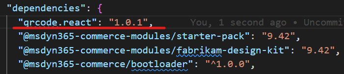
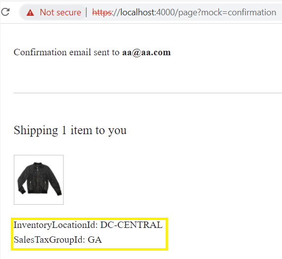

# Dynamics 365 Commerce - online SDK samples

## License

License is listed in the [LICENSE](./LICENSE) file.

# Sample - Expose SalesOrder lines attribute on Order Confirmation page

## Overview

In this sample, you will learn how to display new sales order attributes on Order history, Order confirmation and Order detail pages.

## Doc links

-   [Extend a theme to add module extensions](https://docs.microsoft.com/en-us/dynamics365/commerce/e-commerce-extensibility/theme-module-extensions)

## Prerequisites

To use this feature update onlineSDK **package.json** file at **src/OnlineSDK/package.json** and include **@types/qrcode.react** in dependencies and devDependencies as shown below.




## Detailed Steps

### 1. Copy starter code from the "Custom module" sample

This sample contains a custom theme called "summer". This custom theme was created in the **\src\themes** directory using the following CLI command.

```Console
yarn msdyn365 add-theme summer
```

```json
{
    "$type": "themeModule",
    "friendlyName": "summer",
    "name": "summer",
    "description": "This is summer theme."
}
```

### 2. Order Management Modules view extensions

Themes let you include customized module view extensions, which are generally used to change the default layout of a module for a selected theme. These customized module view extensions are supported for both module library modules and custom modules.

View extensions are stored under the **src\themes\THEME_NAME\views** directory and follow a naming pattern that resembles the naming pattern for module views (MODULE_NAME.view.tsx).

Run the below command to create a new view extension for the **summer** theme.

#### Order Detail view extension

```Console
yarn msdyn365 add-view-extension summer order-details
```

Once the command has run, you will find a new **order-details.view.tsx** file under the **src/themes/summer/views** directory.

In the same file, we can expose the sales order lines attributes **InventoryLocationId** and **SalesTaxGroupId** with the following code changes:

```typescript
/*!
 * Copyright (c) Microsoft Corporation.
 * All rights reserved. See LICENSE in the project root for license information.
 */

import { Module, Node } from '@msdyn365-commerce-modules/utilities';
import * as React from 'react';

import { IHelp, IOrderSummary, IPaymentMethods, IGroup, IGroupDelivery, IGroups } from '@msdyn365-commerce-modules/order-management';
import { IOrderInformation } from '@msdyn365-commerce-modules/order-management/src/modules/order-details/../../common/get-order-information';
import { ISalesLine } from '@msdyn365-commerce-modules/order-management/src/modules/order-details/../../common/get-sales-line';
import { IOrderDetailsViewProps } from '@msdyn365-commerce-modules/order-management/src/modules/order-details/./order-details';

export const OrderDetailsOrderInfomation: React.FC<IOrderInformation> = ({
    orderInformationProps,
    salesId,
    receiptId,
    createdDate,
    count,
    amount,
    channelReferenceId,
    channelName,
    channelAddress
}) => (
    <Node {...orderInformationProps}>
        {channelName}
        {channelAddress}
        {channelReferenceId}
        {salesId}
        {receiptId}
        {createdDate}
        {count}
        {amount}
    </Node>
);

export const OrderDetailsSalesLine: React.FC<ISalesLine> = ({ salesLineProps, salesLine, buyAgainButton, errors }) => (
    <Node {...salesLineProps}>
        {salesLine}
        {buyAgainButton}
        {errors}
    </Node>
);

export const OrderDetailsGroupDelivery: React.FC<IGroupDelivery> = ({ deliveryProps, heading, count }) => (
    <Node {...deliveryProps}>
        {heading}
        {count}
    </Node>
);

export const OrderDetailsGroup: React.FC<IGroup> = ({
    groupProps,
    delivery,
    address,
    salesLinesProps,
    salesLines,
    isCashAndCarryTransaction
}) => (
    <Node {...groupProps}>
        {delivery && <OrderDetailsGroupDelivery {...delivery} />}
        {salesLines && (
            <Node {...salesLinesProps}>
                {salesLines.map(salesLine => (
                    <React.Fragment key={salesLine.data.salesLine.LineId}>
                        {salesLine.data.deliveryType === 'ship' && salesLine.data.shipment ? salesLine.trackingInfo : null}
                        <OrderDetailsSalesLine {...salesLine} />
                        <div className='salesline_inventory'>InventoryLocationId: {salesLine.data.salesLine.InventoryLocationId}</div>
                        <div className='salesline_groupId'>SalesTaxGroupId: {salesLine.data.salesLine.SalesTaxGroupId}</div>
                        {!isCashAndCarryTransaction && salesLine.salesStatus}
                    </React.Fragment>
                ))}
            </Node>
        )}
        {!delivery.showTimeslot && address}
        {delivery.showTimeslot && (
            <Node {...delivery.pickupProps}>
                {address}
                {delivery.pickupDateTimeslot}
            </Node>
        )}
    </Node>
);

export const OrderDetailsGroups: React.FC<IGroups> = ({ groupsProps, groups }) => (
    <Node {...groupsProps}>
        {groups.map((group: IGroup, index: number) => (
            <OrderDetailsGroup key={index} {...group} />
        ))}
    </Node>
);

export const OrderDetailsOrderSummary: React.FC<IOrderSummary> = ({
    orderSummaryProps,
    heading,
    subtotal,
    shipping,
    tax,
    totalAmount,
    earnedPoints
}) => (
    <Node {...orderSummaryProps}>
        {heading}
        {subtotal}
        {shipping}
        {tax}
        {totalAmount}
        {earnedPoints}
    </Node>
);

export const OrderDetailsPayment: React.FC<IPaymentMethods> = ({ paymentMethodsProps, title, methods }) => (
    <Node {...paymentMethodsProps}>
        {title}
        {methods}
    </Node>
);

export const OrderDetailsHelp: React.FC<IHelp> = ({ helpProps, needHelpLabel, helpLineNumberLabel, contactNumber }) => (
    <Node {...helpProps}>
        {needHelpLabel}
        {helpLineNumberLabel}
        {contactNumber}
    </Node>
);

const OrderDetailsView: React.FC<IOrderDetailsViewProps> = ({
    moduleProps,
    tableViewActions,
    viewModes,
    table,
    heading,
    alert,
    loading,
    orderInfomation,
    orderSummary,
    payment,
    help,
    groups
}) => {
    return (
        <Module {...moduleProps}>
            {heading}
            {alert}
            {loading}
            {orderInfomation && <OrderDetailsOrderInfomation {...orderInfomation} />}
            {tableViewActions}
            {viewModes}
            {table}
            {groups && <OrderDetailsGroups {...groups} />}
            {orderSummary && <OrderDetailsOrderSummary {...orderSummary} />}
            {payment && <OrderDetailsPayment {...payment} />}
            {help && <OrderDetailsHelp {...help} />}
        </Module>
    );
};

export default OrderDetailsView;
```

#### Order Confirmation view extension

We can create an order confirmation view extension for the **summer** theme with the following CLI command.

```Console
yarn msdyn365 add-view-extension summer order-confirmation
```

A new file **order-confirmation.view.tsx** will be created under the **src/themes/summer/views** directory.

Replace this file with the following code changes in order to expose the sales order lines attributes **InventoryLocationId** and **SalesTaxGroupId**.

```typescript
/*!
 * Copyright (c) Microsoft Corporation.
 * All rights reserved. See LICENSE in the project root for license information.
 */

import { Module, Node } from '@msdyn365-commerce-modules/utilities';
import * as React from 'react';

import { IHelp, IOrderSummary, IPaymentMethods, IGroup, IGroupDelivery, IGroups } from '@msdyn365-commerce-modules/order-management';
import { IOrderInformation } from '@msdyn365-commerce-modules/order-management/src/modules/order-confirmation/../../common/get-order-information';
import { ISalesLine } from '@msdyn365-commerce-modules/order-management/src/modules/order-confirmation/../../common/get-sales-line';
import { IOrderConfirmationViewProps } from '@msdyn365-commerce-modules/order-management/src/modules/order-confirmation/./order-confirmation';

export const OrderConfirmationOrderInfomation: React.FC<IOrderInformation> = ({
    orderInformationProps,
    receiptEmail,
    createdDate,
    channelReferenceId
}) => (
    <Node {...orderInformationProps}>
        {createdDate}
        {channelReferenceId}
        {receiptEmail}
    </Node>
);

export const OrderConfirmationSalesLine: React.FC<ISalesLine> = ({ salesLineProps, salesLine, buyAgainButton }) => (
    <Node {...salesLineProps}>{salesLine}</Node>
);

export const OrderConfirmationGroupDelivery: React.FC<IGroupDelivery> = ({
    deliveryProps,
    heading,
    count,
    processing,
    address,
    trackingInfo,
    pickupDateTimeslot
}) => (
    <Node {...deliveryProps}>
        {heading}
        {address}
        {pickupDateTimeslot}
    </Node>
);

export const OrderConfirmationGroup: React.FC<IGroup> = ({ groupProps, delivery, salesLinesProps, salesLines }) => (
    <Node {...groupProps}>
        {delivery && <OrderConfirmationGroupDelivery {...delivery} />}
        {delivery && delivery.shippingItemsToYou}
        {salesLines && (
            <Node {...salesLinesProps}>
                {salesLines.map((salesLine: ISalesLine) => (
                    <div key={salesLine.data.salesLine.LineId}>
                        <OrderConfirmationSalesLine key={salesLine.data.salesLine.LineId} {...salesLine} />
                        <div className='salesline_inventory'>InventoryLocationId: {salesLine.data.salesLine.InventoryLocationId}</div>
                        <div className='salesline_groupId'>SalesTaxGroupId: {salesLine.data.salesLine.SalesTaxGroupId}</div>
                    </div>
                ))}
            </Node>
        )}
    </Node>
);

export const OrderConfirmationGroups: React.FC<IGroups> = ({ groupsProps, groups }) => (
    <Node {...groupsProps}>
        {groups.map((group: IGroup, index: number) => (
            <OrderConfirmationGroup key={index} {...group} />
        ))}
    </Node>
);

export const OrderConfirmationOrderSummary: React.FC<IOrderSummary> = ({
    orderSummaryProps,
    heading,
    subtotal,
    shipping,
    tax,
    totalAmount,
    earnedPoints
}) => (
    <Node {...orderSummaryProps}>
        {heading}
        {subtotal}
        {shipping}
        {tax}
        {totalAmount}
        {earnedPoints}
    </Node>
);

export const OrderConfirmationPayment: React.FC<IPaymentMethods> = ({ paymentMethodsProps, title, methods }) => (
    <Node {...paymentMethodsProps}>
        {title}
        {methods}
    </Node>
);

export const OrderConfirmationHelp: React.FC<IHelp> = ({ helpProps, needHelpLabel, helpLineNumberLabel, contactNumber }) => (
    <Node {...helpProps}>
        {needHelpLabel}
        {helpLineNumberLabel}
        {contactNumber}
    </Node>
);

const OrderConfirmationView: React.FC<IOrderConfirmationViewProps> = ({
    moduleProps,
    heading,
    backToShoppingLink,
    alert,
    loading,
    orderInfomation,
    orderSummary,
    payment,
    help,
    groups
}) => {
    return (
        <Module {...moduleProps}>
            {heading}
            {alert}
            {loading}
            {orderInfomation && <OrderConfirmationOrderInfomation {...orderInfomation} />}
            {backToShoppingLink}
            {groups && <OrderConfirmationGroups {...groups} />}
            {payment && <OrderConfirmationPayment {...payment} />}
            {orderSummary && <OrderConfirmationOrderSummary {...orderSummary} />}
            {help && <OrderConfirmationHelp {...help} />}
        </Module>
    );
};

export default OrderConfirmationView;
```

#### Order History view extension

Lastly, we can also add an order history view extension to the **summer** theme with the following CLI command.

```Console
    yarn msdyn365 add-view-extension summer order-history
```

The **order-history.view.tsx** file will be created under the **src/themes/summer/views** directory.

Similarly, we can expose the sales order lines attributes **InventoryLocationId** and **SalesTaxGroupId** with the following code changes:

```typescript
/*!
 * Copyright (c) Microsoft Corporation.
 * All rights reserved. See LICENSE in the project root for license information.
 */

import { Module, Node } from '@msdyn365-commerce-modules/utilities';
import * as React from 'react';

import {
    IGroup,
    IGroupDelivery,
    IGroups
} from '@msdyn365-commerce-modules/order-management/src/modules/order-history/../../common/get-groups';
import { IOrderInformation } from '@msdyn365-commerce-modules/order-management/src/modules/order-history/../../common/get-order-information';
import { ISalesLine } from '@msdyn365-commerce-modules/order-management/src/modules/order-history/../../common/get-sales-line';
import { ISalesOrder } from '@msdyn365-commerce-modules/order-management/src/modules/order-history/./components/get-sales-order';
import {
    IHeader,
    IList,
    IOrderHistoryViewProps
} from '@msdyn365-commerce-modules/order-management/src/modules/order-history/./order-history';

export const OrderHistoryOrderInfomation: React.FC<IOrderInformation> = ({
    orderInformationProps,
    salesId,
    receiptId,
    channelName,
    createdDate,
    count,
    amount,
    channelReferenceId
}) => (
    <Node {...orderInformationProps}>
        {channelName}
        {salesId}
        {receiptId}
        {createdDate}
        {count}
        {amount}
        {channelReferenceId}
    </Node>
);

export const OrderHistoryGroupDelivery: React.FC<IGroupDelivery> = ({
    deliveryProps,
    heading,
    count,
    processing,
    address,
    trackingInfo
}) => (
    <Node {...deliveryProps}>
        {heading}
        {count}
        {processing}
        {address}
        {trackingInfo}
    </Node>
);

export const OrderHistoryGroup: React.FC<IGroup> = ({ groupProps, delivery, salesLinesProps, salesLines }) => (
    <Node {...groupProps}>
        {delivery && <OrderHistoryGroupDelivery {...delivery} />}
        {salesLines && (
            <Node {...salesLinesProps}>
                {salesLines.map((salesLine: ISalesLine) => (
                    <div key={salesLine.data.salesLine.LineId}>
                        <React.Fragment key={salesLine.data.salesLine.LineId}>{salesLine.salesLine}</React.Fragment>
                        <div className='salesline_inventory'>InventoryLocationId: {salesLine.data.salesLine.InventoryLocationId}</div>
                        <div className='salesline_groupId'>SalesTaxGroupId: {salesLine.data.salesLine.SalesTaxGroupId}</div>
                    </div>
                ))}
            </Node>
        )}
    </Node>
);

export const OrderHistoryGroups: React.FC<IGroups> = ({ groupsProps, groups }) => (
    <Node {...groupsProps}>
        {groups.map((group: IGroup, index: number) => (
            <OrderHistoryGroup key={index} {...group} />
        ))}
    </Node>
);

export const OrderHistoryHeader: React.FC<IHeader> = ({ headerProps, heading, orderCountLabel, extraActions }) => (
    <Node {...headerProps}>
        {heading}
        {orderCountLabel}
        {extraActions}
    </Node>
);

export const OrderHistorySalesOder: React.FC<ISalesOrder> = ({
    salesOrderProps,
    orderInfomation,
    groups,
    orderDetailsLink,
    expandProductsButton
}) => (
    <Node {...salesOrderProps}>
        {orderInfomation && <OrderHistoryOrderInfomation {...orderInfomation} />}
        {groups && <OrderHistoryGroups {...groups} />}
        {expandProductsButton}
        {orderDetailsLink}
    </Node>
);

export const OrderHistoryList: React.FC<IList> = ({ listProps, salesOrders }) => (
    <Node {...listProps}>
        {salesOrders && salesOrders.map((salesOrder: ISalesOrder, index: number) => <OrderHistorySalesOder key={index} {...salesOrder} />)}
    </Node>
);

const OrderHistoryView: React.FC<IOrderHistoryViewProps> = ({
    orderHistoryProps,
    header,
    alert,
    loading,
    emptyMessage,
    backToShoppingLink,
    list,
    table,
    moreButton
}) => (
    <Module {...orderHistoryProps}>
        {header && <OrderHistoryHeader {...header} />}
        {loading}
        {alert && (
            <>
                {alert}
                {backToShoppingLink}
            </>
        )}
        {emptyMessage && (
            <>
                {emptyMessage}
                {backToShoppingLink}
            </>
        )}
        {list && <OrderHistoryList {...list} />}
        {table}
        {moreButton && moreButton}
    </Module>
);

export default OrderHistoryView;
```

#### 3. Build a page mock

To test the **order history** module changes, create a new mock file **order-history.json** under the **src/pageMocks** directory.

The page mock contains page theme information pointing to **summer** custom theme.

Similarly, page mocks can be created for order-history and order-details page.

#### 4. Build and view theme

The theme can now be built and tested in a web browser using the ```yarn start``` command.

Once the build has completed, you should see an output stating that the server has started. From within a local browser, you can test the implementation with the following URL **https://localhost:4000/page?mock=order-history**. The sales order lines attributes **InventoryLocationId** and **SalesTaxGroupId** should be rendered onto the order-confirmation page.



#### 5. Testing integration test cases

Once the build is completed and server has started running, the integration test cases for this sample can be tested in a browser by navigating to
**\\Expose salesorder salesline attributes\\** in a CLI and executing the following sample command.

`yarn testcafe chrome .\test\order-history-tests.ts -s .\`

## Third party image and video usage restrictions

The software may include third party images and videos that are for personal use only and may not be copied except as provided by Microsoft within the demo websites. You may install and use an unlimited number of copies of the demo websites., You may not publish, rent, lease, lend, or redistribute any images or videos without authorization from the rights holder, except and only to the extent that the applicable copyright law expressly permits doing so.