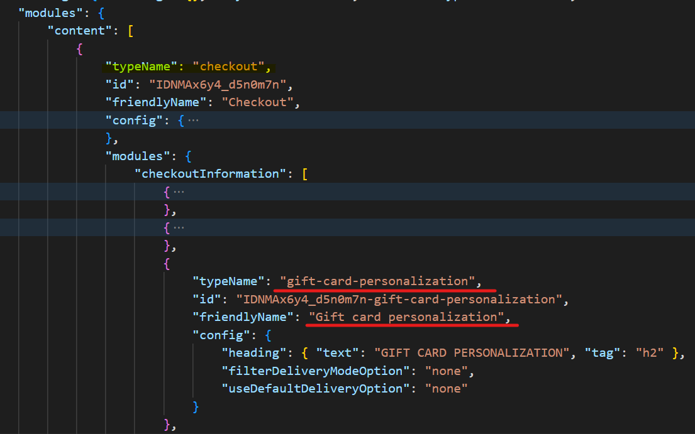
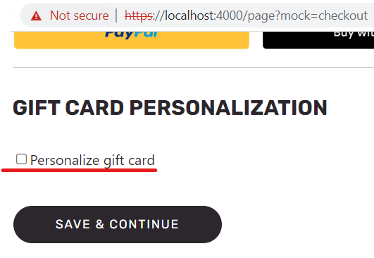
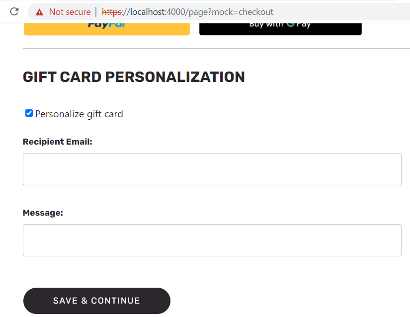
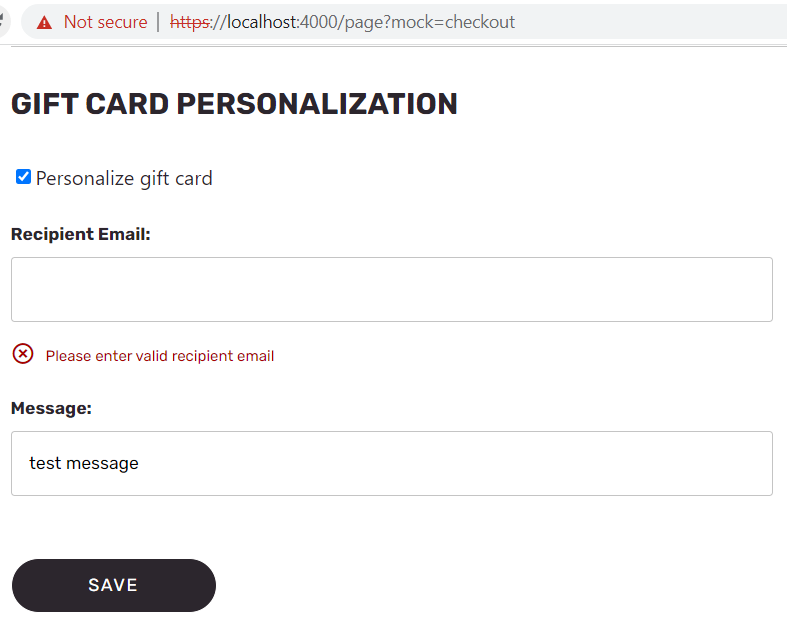
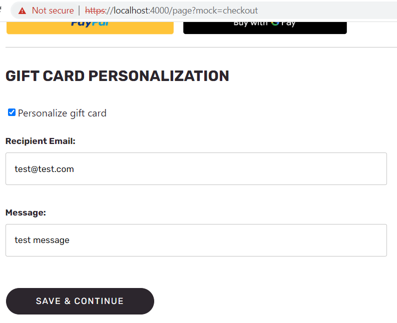
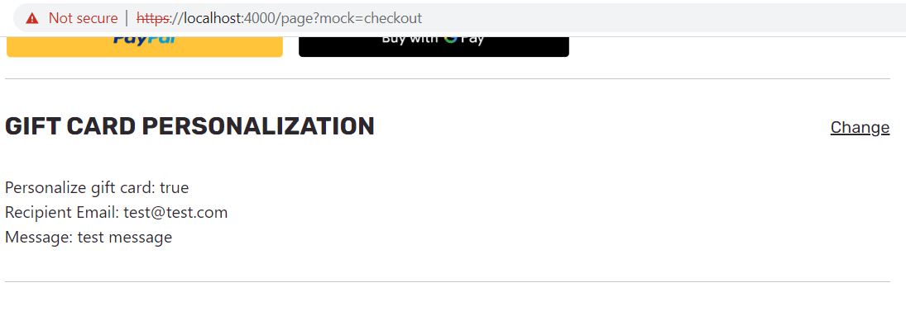
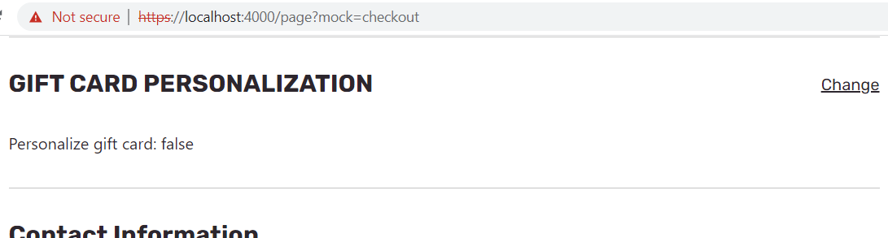

# Dynamics 365 Commerce - online SDK samples
## License
License is listed in the [LICENSE](./LICENSE) file.

# Sample - Gift Card Personalization

## Overview

In this sample, you will learn how to personalize a gift card during the checkout process. As part of this sample we will cover how to update **ElectronicDeliveryEmail** and **ElectronicDeliveryEmailContent** cart line attributes with gift card recipient email and gift card message.

## Starter kit license
License for starter kit is listed in the [LICENSE](./module-library/LICENSE) .

## Prerequisites
Follow the instructions mentioned in [document](https://docs.microsoft.com/en-us/dynamics365/commerce/e-commerce-extensibility/setup-dev-environment) to set up the development environment.

### Procedure to create custom theme
Follow the instructions mentioned in [document](https://docs.microsoft.com/en-us/dynamics365/commerce/e-commerce-extensibility/create-theme) to create the custom theme

Create a theme folder with name **summer** using below command.

```yarn msdyn365 add-theme summer```

## Detailed Steps

### 1.  Use CLI command to create a new module

Use the CLI command: ```yarn msdyn365 add-module gift-card-personalization``` to create a module called **gift-card-personalization**. The new module will be created under the **\src\modules** directory.

### 2. Add the data action entry to the module’s definition file:
We will need to declare the data action that we will be using in the "dataActions" section as shown below. Copy the following into to the module’s definition **src\modules\product-feature\gift-card-personalization.json** file.

```json
{
    "$type": "contentModule",
    "friendlyName": "Gift card personalization",
    "name": "gift-card-personalization",
    "description": "Gift card personalization shows personalization options during checkout",
    "categories": ["gift-card-personalization", "checkout_checkoutInformation", "checkoutSectionContainer_primary"],
    "tags": ["Additional tags go here"],
    "dataActions": {
        "checkout": {
            "path": "@msdyn365-commerce/global-state/dist/lib/data-actions/checkout-state-data-action",
            "runOn": "client"
        }
    },
    "config": {
    },
    "resources": {
    }
}
```

### 4. Add a data action return variable
Each data action that returns data needs a variable to store the data defined in the **MODULE_NAME.data.ts** file. Open **productFeature.data.ts** and add the below code.

Modify the file to add below code.

```typescript
/*!
 * Copyright (c) Microsoft Corporation.
 * All rights reserved. See LICENSE in the project root for license information.
 */

import { ICheckoutState } from '@msdyn365-commerce/global-state';
import { AsyncResult } from '@msdyn365-commerce/retail-proxy';


export interface IGiftCardPersonalizationData {
    checkout: AsyncResult<ICheckoutState>;
}

```

### 6.  Return data from our react component and view:

The last thing we will need is to access the returned data from our react business and view files.

- Copy the below code into the **gift-card-personalization.tsx** file to get the returned data from the data action and add it to the props to send to the module view.

```typescript
/*!
 * Copyright (c) Microsoft Corporation.
 * All rights reserved. See LICENSE in the project root for license information.
 */

import * as React from 'react';
import { observer } from 'mobx-react';
import { action } from 'mobx';
import { IModuleStateProps, withModuleState } from '@msdyn365-commerce-modules/checkout-utilities';
import { EmailRegex } from '@msdyn365-commerce-modules/retail-actions';
import { ICheckoutState } from '@msdyn365-commerce/global-state';
import { updateCartLinesAsync } from '@msdyn365-commerce/retail-proxy/dist/DataActions/CartsDataActions.g';
import { IGiftCardPersonalizationProps } from './gift-card-personalization.props.autogenerated';
import { IGiftCardPersonalizationData } from './gift-card-personalization.data';

interface IGiftCardPersonalizationState {
    personalize: boolean;
    recipientEmail: string;
    message: string;
    giftCartLineIndex: number;
}

export interface IGiftCardPersonalizationViewProps extends IGiftCardPersonalizationProps<IGiftCardPersonalizationData> {
    personalizeOptions: React.ReactNode;
}

export interface IGiftCardPersonalizationModuleProps
    extends IGiftCardPersonalizationProps<IGiftCardPersonalizationData>,
        IModuleStateProps {}

/**
 *
 * GiftCardPersonalization component
 * @extends {React.PureComponent<IGiftCardPersonalizationModuleProps, IGiftCardPersonalizationState>}
 */
@observer
class GiftCardPersonalization extends React.PureComponent<IGiftCardPersonalizationModuleProps, IGiftCardPersonalizationState> {
    public constructor(props: IGiftCardPersonalizationModuleProps) {
        super(props);
        this.state = { personalize: false, recipientEmail: '', message: '', giftCartLineIndex: -1 };
    }

    public async componentDidMount(): Promise<void> {
        void this.props.data.checkout.then(() => {
            this._initModuleState();
        });
    }

    public render(): JSX.Element | null {
        const viewProps = { ...this.props, personalizeOptions: this._renderPersonalizeOptions() };
        return this.props.renderView(viewProps);
    }

    private readonly _initModuleState = (): void => {
        const {
            data: { checkout }
        } = this.props;
        let giftCartLineIndex = checkout.result?.checkoutCart.cart.CartLines?.findIndex(cl => cl.IsGiftCardLine === true);
        if (giftCartLineIndex === undefined) {
            giftCartLineIndex = -1;
        }
        this.setState({ giftCartLineIndex: giftCartLineIndex });
        this.props.moduleState.init({
            status: giftCartLineIndex >= 0 ? 'updating' : 'disabled',
            onEdit: this.onEdit,
            onSubmit: this.onSubmit
        });
    };

    private readonly onEdit = (): void => {
        this.props.moduleState.onUpdating();
    };

    private readonly onReady = (): void => {
        this.props.moduleState.onReady();
    };

    private readonly onPending = (): void => {
        this.props.moduleState.onPending();
    };

    @action
    private readonly onSubmit = async (): Promise<void> => {
        if (this.state.personalize) {
            this.clearError();
            this.onPending();
            const isValid = this.isEmailValid(this.state.recipientEmail);
            if (!isValid) {
                this.props.moduleState.setHasError(true);
                this.props.moduleState.onUpdating();
            } else {
                try {
                    const checkoutState = this.props.data.checkout.result as ICheckoutState;
                    const cart = checkoutState.checkoutCart.cart;
                    if (
                        this.state.giftCartLineIndex !== -1 &&
                        cart.CartLines &&
                        cart.CartLines[this.state.giftCartLineIndex] !== undefined
                    ) {
                        cart.CartLines[this.state.giftCartLineIndex].ElectronicDeliveryEmail = this.state.recipientEmail;
                        cart.CartLines[this.state.giftCartLineIndex].ElectronicDeliveryEmailContent = this.state.message;

                        await updateCartLinesAsync({ callerContext: this.props.context.actionContext }, cart.Id, cart.CartLines, null)
                            .then(result => {
                                this.onReady();
                                this.props.moduleState.setIsCancellable(true);
                            })
                            .catch(error => {
                                this.props.context.actionContext.telemetry.warning(error);
                            });
                    }
                } catch {
                    this.setError('Failed to update cart');
                }
            }
        } else {
            this.clearError();
            this.onReady();
        }
    };

    private readonly isEmailValid = (email: string): boolean => {
        return EmailRegex.defaultRegex.test(email);
    };

    private readonly clearError = (): void => {
        this.props.moduleState.setHasError(false);
    };

    private readonly setError = (errorMessage: string): void => {
        this.props.telemetry.error(errorMessage);
        this.props.moduleState.setHasError(true);
        this.props.moduleState.onUpdating();
    };

    private readonly _renderPersonalizeOptions = (): JSX.Element | null => {
        return (
            <div>
                <div className={`personalize_options ${this.props.moduleState.isReady ? 'hide-personalization' : ''}`}>
                    <div className='personalize_wrapper'>
                        <label>
                            <input
                                type='checkbox'
                                disabled={this.props.moduleState.isReady}
                                className='email_input'
                                onChange={this._onPersonalize}
                                checked={this.state.personalize}
                            />
                            Personalize gift card
                        </label>
                    </div>
                    <div className={`inputs_wrapper ${this.state.personalize ? '' : 'hide-personalization'}`}>
                        <br />
                        <div className='ms-giftCardPersonalization__email_wrapper'>
                            <label className='ms-giftCardPersonalization__label'>Recipient Email:</label>
                            <input
                                type='text'
                                className='ms-giftCardPersonalization__input ms-giftCardPersonalization__input-text'
                                onChange={this._onEmailChange}
                                value={this.state.recipientEmail || ''}
                            />
                        </div>
                        <div className={`inputs_wrapper ${this.props.moduleState.hasError ? '' : 'hide-personalization'}`}>
                            <span className='input-error'>Please enter valid recipient email</span>
                        </div>
                        <br />
                        <div className='ms-giftCardPersonalization__email_wrapper'>
                            <label className='ms-giftCardPersonalization__label'>Message:</label>
                            <input
                                type='text'
                                className='ms-giftCardPersonalization__input ms-giftCardPersonalization__input-text'
                                onChange={this._onMessageChange}
                                value={this.state.message || ''}
                            />
                        </div>
                    </div>
                </div>
                <div className={`personalize_options_selected ${this.props.moduleState.isReady ? '' : 'hide-personalization'}`}>
                    <div>Personalize gift card: {this.state.personalize.toString()}</div>
                    <div className={`${this.state.personalize ? '' : 'hide-personalization'}`}>
                        <div>Recipient Email: {this.state.recipientEmail}</div>
                        <div>Message: {this.state.message}</div>
                    </div>
                </div>
            </div>
        );
    };

    private readonly _onPersonalize = (event: React.ChangeEvent<HTMLInputElement>): void => {
        this.setState({ personalize: !this.state.personalize });
        if (this.state.personalize) {
            this.setState({ recipientEmail: '', message: '' });
        }
    };

    private readonly _onEmailChange = (event: React.ChangeEvent<HTMLInputElement>): void => {
        const value = event.target.value;
        this.setState({ recipientEmail: value });
    };

    private readonly _onMessageChange = (event: React.ChangeEvent<HTMLInputElement>): void => {
        const value = event.target.value;
        this.setState({ message: value });
    };
}

export default withModuleState(GiftCardPersonalization);
```

- Next, we will just add a simple div to display the output returned from the **gift-card-personalization.tsx** in the module view file.  Make the below changes to the **gift-card-personalization.view.tsx** file.

```typescript
/*!
 * Copyright (c) Microsoft Corporation.
 * All rights reserved. See LICENSE in the project root for license information.
 */

import * as React from 'react';
import { IGiftCardPersonalizationViewProps } from './gift-card-personalization';

export default (props: IGiftCardPersonalizationViewProps) => {
    return <div className='row ms-giftCardPersonalization'>{props.personalizeOptions}</div>;
};

```

### 7. Add Style changes
In this step, we will add styling to the gift card personalization module. Add **giftCarsPersonalization.js** and **giftCarsPersonalization.scss** files under **src/themes/summer/styles/modules** and add the below code in it.


Gift card personalization scss file changes.
```scss

.ms-giftCardPersonalization {
    flex-direction: column;

    @include font-content-m();
    &__email_wrapper {
        display: flex;
        flex-direction: column;
        margin-bottom: 10px;
    }
    &__label {
        @include form-input-label();
    }

    &__input-text {
        padding: 6px 8px;
        -moz-appearance: textfield;
        background: #fff;
        border: 0.5px solid #c4c4c4;
        border-radius: 3px;
        box-sizing: border-box;
        display: block;
        flex-grow: 1;
        font-family: Rubik-Regular;
        font-size: 14px;
        font-style: normal;
        font-weight: 400;
        height: 52px;
        line-height: 20px;
        max-width: 610px;
        outline: none;
        padding: 14px;
        width: 100%;
    }

    .input-error {
        display: flex;
        align-items: flex-end;
        width: 100%;
        order: 3;

        @include alert;
    }

    .hide-personalization {
        display: none;
    }
}

```

Gift card personalization js file changes.

```js
import './giftCardPersonalization.scss';
```

### 5. Build and test module

The sample can now be tested in a web browser using the `yarn start` command at sample root level.

### 6. Test by using mock file

Navigate to **https://localhost:4000/** and add a gift card product to the cart.

Take a checkout page mock and add a gift card personalization module to it as shown below.  Please refer mock file under the **src/pageMocks/checkout.json**, [pageMock](src/pageMocks/checkout.json).



Navigate to the below url to verify gift card personalization in checkout page.
**https://localhost:4000/page?mock=checkout**


Once the checkout page is rendered you can see gift card personalization module rendered like below, with a checkbox allowing you to personalize the gift card **ElectronicDeliveryEmail** and **ElectronicDeliveryEmailContent** properties of gift card cartline.

You can add or update the recipient's email and message as required depending on the **Personalize Gift Card** checkbox value. Please refer to the below screenshots of the gift card personalization.

### Enable gift card personalization

### Add recipient email and message

### Recipient Email Validation

### Fill with personalization data

### Save personalized details

### Disable gift card personalization


### 7. Test Integration test case

After the sample is run successfully, integration test case for sample can be tested in browser using below steps

- Set path to "Gift Card Personalization" sample level in command prompt and run `yarn testcafe chrome .\test\gift-card-tests.ts -s .\` command.

- Ensure that testcafe is added globally to run test case.

## Third party Image and Video Usage restrictions

The software may include third party images and videos that are for personal use only and may not be copied except as provided by Microsoft within the demo websites. You may install and use an unlimited number of copies of the demo websites., You may not publish, rent, lease, lend, or redistribute any images or videos without authorization from the rights holder, except and only to the extent that the applicable copyright law expressly permits doing so.