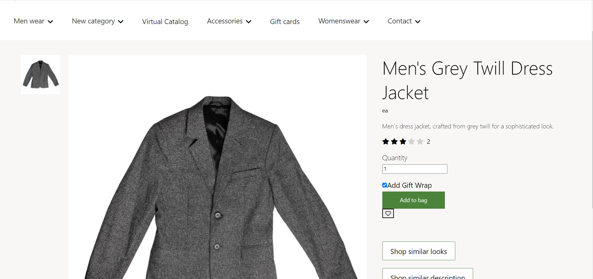
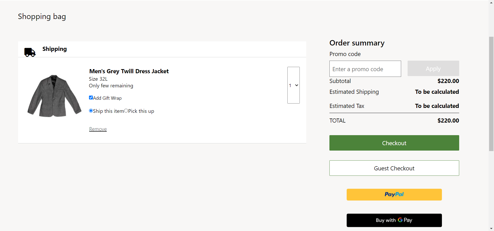
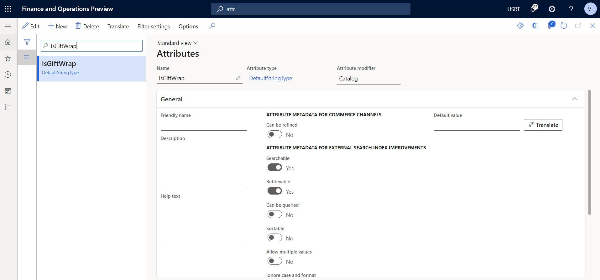
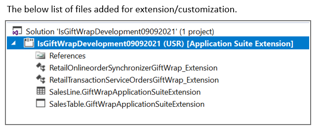

# Dynamics 365 Commerce - online extensibility samples

## License
License is listed in the [LICENSE](./LICENSE) file.

# Sample - Add Gift Wrap

## Overview

This sample will demonstrate how to leverage a product attribute to enable a gift-wrapping option for a product on the product details and cart pages. When a customer selects the option, a gift wrap flag will be added to the corresponding cart line item.





## Starter kit license
License for starter kit is listed in the [LICENSE](./module-library/LICENSE) .

## Prerequisites
Follow the instructions mentioned in [document](https://docs.microsoft.com/en-us/dynamics365/commerce/e-commerce-extensibility/setup-dev-environment) to set up the development environment.

### Procedure to create custom theme
Follow the instructions mentioned in [document](https://docs.microsoft.com/en-us/dynamics365/commerce/e-commerce-extensibility/create-theme) to create the custom theme,in this sample, we'll assume a custom theme has been cloned from the fabrikam theme named "fabrikam-extended".

## Detailed Steps

### 1. Add gift wrap support to the AddToCart component.
Override the addtocart.component.tsx component in your theme using this command **yarn msdyn365 add-component-override fabrikam-extended AddToCart**, replace "fabrikam-extended" with your custom theme. Open the new addtocart.component.tsx under **src/themes/fabrikam-extended/views/components** and replace existing code with below code.In this file added logic for gift wrap.

```typescript

/*--------------------------------------------------------------
 * Copyright (c) Microsoft Corporation. All rights reserved.
 * See License.txt in the project root for license information.
 *--------------------------------------------------------------*/

import MsDyn365, { IActionContext, getCatalogId, IComponent, IComponentProps, IGridSettings, IImageSettings, msdyn365Commerce, TelemetryEvent } from '@msdyn365-commerce/core';
import { getCartState, ICartActionResult, ICartState } from '@msdyn365-commerce/global-state';
import {
    Cart,
    CommerceProperty,
    CartLineValidationResults, CartsDataActions, format,
    ProductAvailableQuantity, ProductDimension, ProductPrice,
    ProductsDataActions, ProductSearchCriteria, ProductType, SimpleProduct
} from '@msdyn365-commerce/retail-proxy';
import { ErrorNotification, NotificationsManager } from '@msdyn365-commerce-modules/notifications-core';
import { ArrayExtensions, generateProductImageUrl, ObjectExtensions } from '@msdyn365-commerce-modules/retail-actions';
import { getPayloadObject, getTelemetryAttributes, IPopupProps, ITelemetryContent, Popup } from '@msdyn365-commerce-modules/utilities';
import classnames from 'classnames';
import React, { useState } from 'react';

import { updateAsync, updateCartLinesAsync } from '@msdyn365-commerce/retail-proxy/dist/DataActions/CartsDataActions.g';

import { IItemsAddedToCartResources,ItemsAddedToCartDialogComponent, ItemSuccessfullyAddedToCartNotification, MultiItemsSuccessfullyAddedToCartNotification, OrderDetailsProduct, PriceComponent } from '@msdyn365-commerce/components';

/**
 * Interface for add to cart resources.
 */
export interface IAddToCartResources {
    goToCartText: string;
    continueShoppingText: string;
    closeNotificationLabel: string;
    headerItemOneText: string;
    headerItemFormatText: string;
    headerLinesFormatText?: string;
    headerMessageText: string;
    freePriceText: string;
    originalPriceText: string;
    currentPriceText: string;
    addedQuantityText: string;
    buyAgainNotificationTitle?: string;
    buyAgainNotificationCloseAriaLabel?: string;
    validationErrorMessage?: string;
    oneErrorText?: string;
    multiErrorsText?: string;
}

/**
 * Interface for add to cart components props.
 */
export interface IAddToCartComponentProps extends IComponentProps<{ product: SimpleProduct; price?: ProductPrice } | undefined> {
    className?: string;
    addToCartText: string;
    outOfStockText?: string;
    disabled?: boolean;
    quantity?: number;
    navigationUrl?: string;
    productAvailability?: ProductAvailableQuantity;
    getSelectedProduct?: Promise<SimpleProduct | null>;
    isNavigationToCartPageDisabled?: boolean;
    shouldSkipSiteSettings?: boolean;
    addToCartArialLabel?: string;
    products?: {
        productId: number;
        quantity: number;
        catalogId?: number;
    }[];
    orderDetailsProducts?: OrderDetailsProduct[];
    hasAvailableProducts?: boolean;
    imageSettings?: IImageSettings;
    gridSettings?: IGridSettings;

    isLoading?: boolean;
    isUpdatingDimension?: boolean;
    isLoadingDeliveryOptions?: boolean;
    isUpdatingDeliveryOptions?: boolean;
    isAddServiceItemToCart?: boolean;
    isAddEmailDeliveryItemToCart?: boolean;
    isPriceKeyedIn?: boolean;
    customPriceAmount?: number;
    isOrderQuantityLimitsFeatureEnabled?: boolean;

    dialogStrings?: IAddToCartResources;

    telemetryContent?: ITelemetryContent;

    catalogId?: number;

    isCustomPriceSelected?: boolean;
    maximumKeyInPrice?: number;
    minimumKeyInPrice?: number;
    defaultMaximumKeyInPrice?: number;
    defaultMinimumKeyInPrice?: number;
    isProductQuantityLoading?: boolean;

    onAdd?(result: ICartActionResult): void;
    onError?(result: IAddToCartFailureResult): void;
    changeUpdatingDimension?(isUpdatingDimension: boolean): void;
    changeUpdatingDeliveryOptions?(isUpdatingDeliveryOptions: boolean): void;
}

/**
 * Cart action Failure reason type.
 */
export declare type ICartActionFailureReason = 'EMPTYINPUT' | 'MISSINGDIMENSION' | 'OUTOFSTOCK' | 'CARTACTIONFAILED' | 'INVALIDCUSTOMAMOUNT';

/**
 * Interface for add to cart failure result.
 */
export interface IAddToCartFailureResult {
    failureReason: ICartActionFailureReason;

    stockLeft?: number;
    cartActionResult?: ICartActionResult;
    missingDimensions?: ProductDimension[];
}

/**
 * This setting defines the experience when a product is added to cart. Corresponds to the configuration in Fabrikam.
 */
export enum AddToCartBehavior {

    /**
     * Navigate to cart page.
     */
    goToCart = 'goToCart',

    /**
     * Show item added to cart popup.
     */
    showModal = 'showModal',

    /**
     * Show mini cart popup.
     */
    showMiniCart = 'showMiniCart',

    /**
     * Show item added to cart notification.
     */
    showNotification = 'showNotification',

    /**
     * Do nothing and stay on the page.
     */
    nothing = 'nothing'
}

const zero = 0;
const defaultQuantity = 1;

/**
 * The propagate result.
 * @param props -- The add to cart component props.
 * @param result -- The cart action result.
 */
const propagateResult = (props: IAddToCartComponentProps, result: ICartActionResult): void => {
    if (props.onAdd) {
        props.onAdd(result);
    }
};

/**
 * The propagate error.
 * @param props -- The add to cart component props.
 * @param result -- The add to cart failure result.
 */
const propagateError = (props: IAddToCartComponentProps, result: IAddToCartFailureResult): void => {
    if (props.onError) {
        props.onError(result);
    }
};

/**
 * Retrieves add to cart input from the component props.
 * @param props - Add to cart component props.
 * @returns Add to cart input.
 */
const getAddToCartInputFromProps = async (props: IAddToCartComponentProps) => {
    const products = props.orderDetailsProducts?.filter(product => !ObjectExtensions.isNullOrUndefined(product.simpleProduct));
    const input = products?.map(product => {
        return {
            product: product.simpleProduct!,
            count: ObjectExtensions.isNullOrUndefined(product.salesLine.Quantity) ? defaultQuantity : product.salesLine.Quantity,
            catalogId: product.salesLine.CatalogId
        };
    });

    if (ArrayExtensions.hasElements(input)) {
        return input;
    }

    if (ArrayExtensions.hasElements(props.products)) {
        const actionContext = props.context.actionContext;
        const apiSettings = actionContext.requestContext.apiSettings;

        const searchCriteriaInput: ProductSearchCriteria = {
            Context: {
                ChannelId: apiSettings.channelId,
                CatalogId: props.catalogId ?? getCatalogId(props.context.actionContext.requestContext)
            },
            IncludeAttributes: false,
            Ids: props.products.map(product => product.productId)
        };

        const searchResult = await ProductsDataActions.searchByCriteriaAsync(
            { callerContext: actionContext }, searchCriteriaInput);
        const productSearchResultsWithImages = searchResult.map(productSearchResult => {
            const newProductSearchResult = { ...productSearchResult };
            const newImageUrl = generateProductImageUrl(newProductSearchResult, apiSettings);

            if (newImageUrl) {
                newProductSearchResult.PrimaryImageUrl = newImageUrl;
            }

            return newProductSearchResult;
        });

        return props.products.map(item => {
            const productData = productSearchResultsWithImages.find(product => product.RecordId === item.productId);
            let simpleProduct: SimpleProduct;
            if (productData) {
                simpleProduct = {
                    ...productData,
                    ProductTypeValue: ProductType.Variant,
                    AdjustedPrice: productData.Price,
                    BasePrice: productData.BasePrice ?? productData.Price
                };
            } else {
                // eslint-disable-next-line @typescript-eslint/consistent-type-assertions -- Cast to simple product since only record id is available.
                simpleProduct = {
                    RecordId: item.productId
                } as SimpleProduct;
            }

            return {
                product: simpleProduct,
                count: item.quantity,
                catalogId: item.catalogId
            };
        });
    }

    if (props.data?.product) {
        return [
            {
                product: props.data.product,
                count: props.quantity ?? defaultQuantity,
                catalogId: props.catalogId
            }
        ];
    }

    return [];
};

/**
 * Add one item to cart when it is not buy again.
 * @param props -- The props.
 * @param setDisabled -- The set disable call back.
 * @param openModal -- The open modal call back.
 */
const addOneItemToCart = async (props: IAddToCartComponentProps,
    setDisabled: (disabled: boolean) => void,
    openModal: (opened: boolean) => void): Promise<void> => {

    // eslint-disable-next-line @typescript-eslint/no-unsafe-assignment, @typescript-eslint/no-unsafe-member-access -- read config file.
    const addToCartBehavior = props.context.app.config.addToCartBehavior;
    const data = props.data;

    const addToCartInput = await getAddToCartInputFromProps(props);
    const product = addToCartInput[0].product;
    const quantity = addToCartInput[0].count;

    const cartState = await getCartState(props.context.actionContext);
    const addToCartResult = await cartState.addProductToCart({
        product,
        count: quantity,
        availableQuantity: props.productAvailability?.AvailableQuantity,
        additionalProperties: { orderQuantityLimitsFeatureIsEnabled: props.isOrderQuantityLimitsFeatureEnabled },
        // eslint-disable-next-line @typescript-eslint/no-unsafe-assignment, @typescript-eslint/no-unsafe-member-access -- read config file.
        enableStockCheck: props.context.app.config.enableStockCheck,
        isPriceKeyedIn: props.isPriceKeyedIn,
        customPrice: props.customPriceAmount,
        isAddEmailDeliveryItemToCart: props.isAddEmailDeliveryItemToCart,
        shouldSkipSiteSettings: props.shouldSkipSiteSettings,
        catalogId: addToCartInput[0].catalogId
    });

    if (addToCartResult.status === 'SUCCESS') {
        const value = getProductExtensionProperty(props.data?.product!, 'isGiftWrap');
        updateCartLineAttributeValues(props.context.actionContext, cartState.cart, props.data?.product!, 'isGiftWrap', value.toString());
        if (props.dialogStrings && addToCartBehavior === AddToCartBehavior.showModal) {
            setDisabled(false);
            openModal(true);
        } else if (props.dialogStrings && addToCartBehavior === AddToCartBehavior.showNotification) {
            setDisabled(false);
            const notification = new ItemSuccessfullyAddedToCartNotification(
                props.context,
                props.dialogStrings,
                props.imageSettings,
                props.gridSettings,
                product,
                data?.price,
                quantity,
                props.navigationUrl,
                props.telemetryContent!,
                props.id,
                props.typeName
            );
            NotificationsManager.instance().addNotification(notification);
        } else if (MsDyn365.isBrowser && props.navigationUrl && !props.isNavigationToCartPageDisabled &&
                    (addToCartBehavior === undefined || addToCartBehavior === AddToCartBehavior.goToCart)) {
            window.location.assign(props.navigationUrl);
        } else {
            setDisabled(false);
        }
        propagateResult(props, addToCartResult);
    } else {
        NotificationsManager.instance().addNotification(new ErrorNotification(
            addToCartResult.errorDetails?.LocalizedMessage ?? 'Add to cart failed',
            props.dialogStrings?.closeNotificationLabel ?? ''));

        propagateError(props, { failureReason: 'CARTACTIONFAILED', cartActionResult: addToCartResult });
        setDisabled(false);
    }
};

/**
 * Callback to handle success of adding to cart.
 * @param props - Add to cart component props.
 * @param setDisabled - Callback to update disabled state of the component.
 * @param setItemsAddedToCartDialogOpen - Callback to update disabled state of the component.
 * @param setErrorMessage - Callback to update error message state of the component.
 * @param cartState - Current cart state.
 * @param addToCartInput - Input used for adding to cart.
 * @param addToCartResult - Result of adding to cart.
 */
const handleAddItemsToCartSuccess = async (props: IAddToCartComponentProps,
    setDisabled: (disabled: boolean) => void,
    setItemsAddedToCartDialogOpen: (opened: boolean) => void,
    setErrorMessage: (message: string) => void,
    cartState: ICartState,
    addToCartInput: {
        product: SimpleProduct;
        count: number;
    }[],
    addToCartResult: ICartActionResult) => {

    // Validate cart for line errors.
    const validationResult: CartLineValidationResults = await CartsDataActions.validateForCheckoutAsync(
        { callerContext: props.context.actionContext, bypassCache: 'none' },
        cartState.cart.Id, cartState.cart.Version
    );
    const errorCount = (validationResult.ValidationFailuresByCartLines ?? []).length;
    const singleErrorCount = 1;
    const errorText = errorCount === singleErrorCount ? props.dialogStrings?.oneErrorText : props.dialogStrings?.multiErrorsText;
    const errorMessage = errorCount > zero ? format(props.dialogStrings?.validationErrorMessage ?? '', errorCount.toString(), errorText) : '';

    setErrorMessage(errorMessage);

    // eslint-disable-next-line @typescript-eslint/no-unsafe-assignment, @typescript-eslint/no-unsafe-member-access -- read config file.
    const addToCartBehavior = props.context.app.config.addToCartBehavior;

    if (props.dialogStrings && addToCartBehavior === AddToCartBehavior.showModal) {
        setDisabled(false);
        setItemsAddedToCartDialogOpen(true);
    } else if (props.dialogStrings && addToCartBehavior === AddToCartBehavior.showNotification) {
        setDisabled(false);
        const itemsAddedResource: IItemsAddedToCartResources = {
            viewCartButtonText: props.dialogStrings.goToCartText,
            closeButtonLabel: props.dialogStrings.closeNotificationLabel,
            itemsAddedToCartHeaderText: props.dialogStrings.headerMessageText,
            itemsAddedToCartFormatText: props.dialogStrings.headerItemFormatText,
            linesAddedToCartFormatText: props.dialogStrings.headerLinesFormatText ?? '{0}',
            itemsAddedValidationErrorMessage: errorMessage
        };

        const notification = new MultiItemsSuccessfullyAddedToCartNotification(
            props.context,
            itemsAddedResource,
            props.imageSettings,
            props.gridSettings,
            addToCartInput,
            props.navigationUrl,
            props.telemetryContent!,
            props.id,
            props.typeName);
        NotificationsManager.instance().addNotification(notification);
    } else if (MsDyn365.isBrowser && props.navigationUrl && !props.isNavigationToCartPageDisabled &&
                (addToCartBehavior === undefined || addToCartBehavior === AddToCartBehavior.goToCart)) {
        window.location.assign(props.navigationUrl);
    } else {
        setDisabled(false);
    }
    propagateResult(props, addToCartResult);
};

/**
 * Add one or multi item to cart from buy again.
 * @param props -- The props.
 * @param setDisabled -- The set disable call back.
 * @param setItemsAddedToCartDialogOpen -- The open modal call back.
 * @param setErrorMessage -- The set error message call back.
 */
const addItemsToCart = async (props: IAddToCartComponentProps,
    setDisabled: (disabled: boolean) => void,
    setItemsAddedToCartDialogOpen: (opened: boolean) => void,
    setErrorMessage: (message: string) => void): Promise<void> => {

    const addToCartInput = await getAddToCartInputFromProps(props);

    if (!ArrayExtensions.hasElements(addToCartInput)) {
        return;
    }

    const cartState = await getCartState(props.context.actionContext);
    const addToCartResult = await cartState.addProductsToCart(addToCartInput);

    if (addToCartResult.status === 'SUCCESS') {
        await handleAddItemsToCartSuccess(
            props, setDisabled, setItemsAddedToCartDialogOpen, setErrorMessage,
            cartState, addToCartInput, addToCartResult);
    } else {
        if (props.dialogStrings?.buyAgainNotificationTitle) {
            // For buy again show simple error notification.
            NotificationsManager.instance().addNotification(new ErrorNotification(
                props.dialogStrings.buyAgainNotificationTitle,
                props.dialogStrings.buyAgainNotificationCloseAriaLabel ?? ''));
        } else {
            NotificationsManager.instance().addNotification(new ErrorNotification(
                addToCartResult.errorDetails?.LocalizedMessage ?? 'Add to cart failed',
                props.dialogStrings?.closeNotificationLabel ?? ''));
        }

        propagateError(props, { failureReason: 'CARTACTIONFAILED', cartActionResult: addToCartResult });
        setDisabled(false);
    }
};

/**
 * Interface for add to cart component.
 */
export interface IAddtoCartComponent extends IComponent<IAddToCartComponentProps> {
    onClick(): (event: React.MouseEvent<HTMLElement>, props: IAddToCartComponentProps) => void;
}

const getProductExtensionProperty = (product: SimpleProduct, extensionPropertyKey: string): boolean => {
    const property = product.ExtensionProperties && product.ExtensionProperties.find((extension: CommerceProperty) => extension.Key === extensionPropertyKey);
    if (property) {
        return property.Value?.BooleanValue || false;
    } else {
        return false;
    }
}

const updateCartLineAttributeValues = async (actionContext: IActionContext, cart: Cart, product: SimpleProduct, attributekey: string, value: string) => {
	const cartLinesObj = cart.CartLines!.filter(cartLine => cartLine.ProductId === product.RecordId);

	// TODO: add line level attributes
	cartLinesObj![0].AttributeValues = cartLinesObj![0].AttributeValues!.filter(p=> p.Name !== attributekey);

	cartLinesObj![0].AttributeValues?.push({
		// @ts-expect-error -- Need to provide data type.
		'@odata.type': '#Microsoft.Dynamics.Commerce.Runtime.DataModel.AttributeTextValue',
		ExtensionProperties: [],
		Name: attributekey,
		TextValue: value,
		TextValueTranslations: []
	});

	const newCart = {
		Id: cart.Id!,
		CartLines: cartLinesObj
	};

	await updateCartLinesAsync({ callerContext: actionContext }, newCart.Id.toString(), newCart.CartLines);
	await updateAsync({ callerContext: actionContext }, newCart!);
};

/**
 * On click function.
 * @param _event - The mouse event.
 * @param props - The props.
 * @param setDisabled - Flag to define whether the element is disabled.
 * @param openModal - Flag to specify if it should open in a modal window.
 * @param setItemsAddedToCartDialogOpen - Sets items added to cart while dialog is open.
 * @param setErrorMessage - Error message.
 */
const onClick = async (_event: React.MouseEvent<HTMLElement>,
    props: IAddToCartComponentProps,
    setDisabled: (disabled: boolean) => void,
    openModal: (opened: boolean) => void,
    setItemsAddedToCartDialogOpen: (opened: boolean) => void,
    setErrorMessage: (message: string) => void): Promise<void> => {

    if (!ArrayExtensions.hasElements(props.products)) {
        const cartError = addToCartError(props);

        if (cartError) {
            propagateError(props, cartError);
            return;
        }

        setDisabled(true);
    }

    const hasOrderDetailsProducts = ArrayExtensions.hasElements(props.orderDetailsProducts) && props.orderDetailsProducts.length > defaultQuantity;
    const hasProducts = ArrayExtensions.hasElements(props.products) && props.products.length > defaultQuantity;

    const hasMultipleProducts = hasOrderDetailsProducts || hasProducts;

    if (props.shouldSkipSiteSettings && hasMultipleProducts) {
        await addItemsToCart(props, setDisabled, setItemsAddedToCartDialogOpen, setErrorMessage);
    } else {
        await addOneItemToCart(props, setDisabled, openModal);
    }
};

/**
 * Add to cart component action constant.
 */
const AddToCartComponentActions = {
    onClick
};

/**
 * Add to cart component.
 * @param props - The props.
 * @returns - The add to cart component.
 */
export const AddToCartFunctionalComponent: React.FC<IAddToCartComponentProps> = (props: IAddToCartComponentProps) => {
    const [disabled, setDisabled] = useState(false);
    const [modalOpen, setModalOpen] = useState(false);
    const [isItemsAddedToCartDialogOpen, setItemsAddedToCartDialogOpen] = useState(false);
    const [errorMessage, setErrorMessage] = useState('');
    const [addToCartInput, setAddToCartInput] = useState<{
        product: SimpleProduct;
        count: number;
    }[]>([]);

    const onClickHandler = async (event: React.MouseEvent<HTMLElement>) => {
        await AddToCartComponentActions.onClick(event, props, setDisabled, setModalOpen, setItemsAddedToCartDialogOpen, setErrorMessage);
    };

    /**
     * Close dialog.
     */
    const closeItemsAddedToCartDialog = React.useCallback(() => {
        setItemsAddedToCartDialogOpen(false);
    }, []);

    const priceComponent = props.data?.price ? (
        <PriceComponent
            data={{ price: props.data.price }}
            context={props.context}
            id={props.id}
            typeName={props.typeName}
            freePriceText={props.dialogStrings?.freePriceText}
            originalPriceText={props.dialogStrings?.originalPriceText}
            currentPriceText={props.dialogStrings?.currentPriceText}
        />) : '';

    const popupProps: IPopupProps = {
        context: props.context,
        className: 'msc-add-to-cart',
        id: props.id,
        typeName: props.typeName,
        data: { product: props.data?.product, price: props.data?.price },
        dialogStrings: props.dialogStrings,
        imageSettings: props.imageSettings,
        gridSettings: props.context.request.gridSettings,
        productQuantity: props.quantity !== undefined ? props.quantity : defaultQuantity,
        priceComponent,
        navigationUrl: props.navigationUrl,
        modalOpen,
        setModalOpen,
        telemetryContent: props.telemetryContent
    };

    const itemsAddedResource: IItemsAddedToCartResources = {
        viewCartButtonText: props.dialogStrings?.goToCartText ?? '',
        closeButtonLabel: props.dialogStrings?.closeNotificationLabel ?? 'Close',
        itemsAddedToCartHeaderText: props.dialogStrings?.headerMessageText ?? '',
        itemsAddedToCartFormatText: props.dialogStrings?.headerItemFormatText ?? '',
        linesAddedToCartFormatText: props.dialogStrings?.headerLinesFormatText ?? '{0}',
        itemsAddedValidationErrorMessage: errorMessage
    };

    const renderModalPopup = <Popup {...popupProps} />;
    const label = getLinkText(props);
    const payload = getPayloadObject(TelemetryEvent.AddToCart, props.telemetryContent!, label, '');
    const attributes = getTelemetryAttributes(props.telemetryContent!, payload);
    const buttonClassName = props.shouldSkipSiteSettings ? '' : 'msc-add-to-cart ';

    React.useEffect(() => {
        /**
         * Retrieves add to cart input and updates the state.
         */
        const retrieveAddToCartInput = async () => {
            const retrievedInput = await getAddToCartInputFromProps(props);
            setAddToCartInput(retrievedInput);
        };

        // eslint-disable-next-line @typescript-eslint/no-floating-promises -- Call async method as per the documentation of react useEffect.
        retrieveAddToCartInput();
    }, [props, setAddToCartInput]);

    return (
        <>
            {renderModalPopup}
            <button
                className={classnames(buttonClassName, props.className)}
                aria-label={props.addToCartArialLabel ?? label}
                title={props.addToCartArialLabel ?? label}
                {...attributes}
                onClick={onClickHandler}
                disabled={props.disabled || disabled || isIntermediateState(props) || shouldShowOutOfStock(props, false)}
            >
                {label}
            </button>
            <ItemsAddedToCartDialogComponent
                className='msc-lines-added-to-cart-dialog'
                id={props.id}
                typeName={props.typeName}
                context={props.context}
                dialogStrings={itemsAddedResource}
                data={{
                    products: addToCartInput
                }}
                isModalOpen={isItemsAddedToCartDialogOpen}
                onClose={closeItemsAddedToCartDialog}
            />
        </>
    );
};

// Set default props
AddToCartFunctionalComponent.defaultProps = {
    quantity: defaultQuantity
};

/**
 * Resolves whether product is in stock.
 * @param props - The add to cart component props.
 * @returns Gets the link text.
 */
const getLinkText = (props: IAddToCartComponentProps): string => {
    return shouldShowOutOfStock(props, false) && props.outOfStockText ? props.outOfStockText : props.addToCartText;
};

/**
 * Resolves whether product is in stock.
 * @param props - The add to cart component props.
 * @returns The add to cart failure result.
 */
const addToCartError = (props: IAddToCartComponentProps): IAddToCartFailureResult | undefined => {
    const { data, productAvailability, isCustomPriceSelected, customPriceAmount, maximumKeyInPrice, minimumKeyInPrice, defaultMaximumKeyInPrice = 100, defaultMinimumKeyInPrice = 10 } = props;

    if (!data || !data.product.RecordId) {
        // No product exists, won't be able to add to cart
        return { failureReason: 'EMPTYINPUT' };
    }

    if (data.product.Dimensions) {
        const missingDimensions = data.product.Dimensions.filter(dimension => !(dimension.DimensionValue && dimension.DimensionValue.Value));

        if (ArrayExtensions.hasElements(missingDimensions)) {
            // At least one dimension with no value exists on the product, won't be able to add to cart
            return { failureReason: 'MISSINGDIMENSION', missingDimensions };
        }
    }

    if (shouldShowOutOfStock(props, true)) {
        const defaultAvailableQuantity = 0; // Showing as out of stock if no available products found.
        const availableQuantity = productAvailability?.AvailableQuantity ?? defaultAvailableQuantity;
        const stockLeft = Math.max(availableQuantity, defaultAvailableQuantity);

        return { failureReason: 'OUTOFSTOCK', stockLeft };
    }

    // When Custom price is selected, if there is no keyed-in price or keyed-in price is out of limit, should return error.
    if (isCustomPriceSelected &&
        (!customPriceAmount || customPriceAmount > (maximumKeyInPrice || defaultMaximumKeyInPrice) ||
        customPriceAmount < (minimumKeyInPrice || defaultMinimumKeyInPrice))) {
        return { failureReason: 'INVALIDCUSTOMAMOUNT' };
    }

    // Only allow adding to cart if not showing out of stock
    return undefined;
};

/**
 * Resolves whether product is in stock.
 * @param props - The add to cart component props.
 * @param includeCurrentQuantity - Flag to specify whether current quantity should be included.
 * @returns The dialog element.
 */
const shouldShowOutOfStock = (props: IAddToCartComponentProps, includeCurrentQuantity: boolean): boolean => {
    if (props.context.app.config.enableStockCheck === undefined || props.context.app.config.enableStockCheck === false) {
        return false;
    }

    // When skip site settings do not need show out of stock on adding to cart
    if (props.shouldSkipSiteSettings) {
        return false;
    }

    if (props.isLoading || props.isProductQuantityLoading || props.isUpdatingDimension ||
        props.isLoadingDeliveryOptions || props.isUpdatingDeliveryOptions || props.isAddServiceItemToCart) {
        // Out of stock turn off, don't bother showing out of stock
        return false;
    }

    if (!props.data || !props.data.product.RecordId) {
        // No product exists, don't bother showing out of stock
        return false;
    }

    const hasAvailableProducts = props.hasAvailableProducts ?? true;
    if (!hasAvailableProducts) {
        return true;
    }

    if (props.data.product.Dimensions) {
        if (props.data.product.Dimensions.find(dimension => !(dimension.DimensionValue && dimension.DimensionValue.Value))) {
            // At least one dimension with no value exists on the product, so also don't show out of stock
            return false;
        }
    }

    const includedQuantityNumber = includeCurrentQuantity && props.quantity ? props.quantity : defaultQuantity;

    return !((props.productAvailability &&
        props.productAvailability.AvailableQuantity !== undefined &&
        props.productAvailability.AvailableQuantity >= includedQuantityNumber));
};

const isIntermediateState = (props: IAddToCartComponentProps): boolean => {
    if (props.data?.product.Dimensions) {
        if (props.data.product.Dimensions.find(dimension => !(dimension.DimensionValue && dimension.DimensionValue.Value))) {
            // At least one dimension with no value exists on the product, so also not in intermediate state
            return false;
        }
    }

    if (!props.isLoading && !props.isUpdatingDimension && !props.isLoadingDeliveryOptions && !props.isUpdatingDeliveryOptions) {
        return false;
    }

    return true;
};

// @ts-expect-error
export const AddToCartComponent: React.FunctionComponent<IAddToCartComponentProps> = msdyn365Commerce.createComponentOverride<IAddtoCartComponent>(
    'AddToCart',
    { component: AddToCartFunctionalComponent, ...AddToCartComponentActions }
);


export default AddToCartComponent;


```

### 2. Add gift wrap support to the CartLineItem component.
Override the CartLineItem component using this command **yarn msdyn365 add-component-override fabrikam-extended CartLineItem**, replace "fabrikam-extended" with your custom theme name. Open the new cartlineitem.component.tsx file under the **src/themes/fabrikam-extended/views/components** directory and replace existing code with the code below, which will add the logic for gift wrapping.

```typescript

/*--------------------------------------------------------------
 * Copyright (c) Microsoft Corporation. All rights reserved.
 * See License.txt in the project root for license information.
 *--------------------------------------------------------------*/

import MsDyn365, { IComponentProps, IGridSettings, IImageSettings, Image, msdyn365Commerce } from '@msdyn365-commerce/core';
import { getCartState, ICartState } from '@msdyn365-commerce/global-state';
import { ChannelDeliveryOptionConfiguration, SimpleProduct } from '@msdyn365-commerce/retail-proxy';
import { AttributeValueBase, CartLine, ProductCatalog, SalesLine } from '@msdyn365-commerce/retail-proxy/dist/Entities/CommerceTypes.g';
import { ArrayExtensions, getFallbackImageUrl, ObjectExtensions } from '@msdyn365-commerce-modules/retail-actions';
import { getPayloadObject, getTelemetryAttributes, ITelemetryContent } from '@msdyn365-commerce-modules/utilities';
import classNames from 'classnames';
import * as React from 'react';

import { CartLinePriceEditor, ICartLinePriceEditorResources, PriceComponent } from '@msdyn365-commerce/components';
import { updateAsync, updateCartLinesAsync } from '@msdyn365-commerce/retail-proxy/dist/DataActions/CartsDataActions.g';

/**
 * ICartlineResourceString: Interface for specifying the
 * resource strings that the component needs.
 */
export interface ICartlineResourceString {
    /**
     * Display string for discount label.
     */
    discountStringText: string;

    /**
     * String for size key.
     */
    sizeString: string;

    /**
     * String for color key.
     */
    colorString: string;

    /**
     * String associated with the configuration product dimension.
     */
    configString: string;

    /**
     * String for style key.
     */
    styleString: string;

    /**
     * String for amount key.
     */
    amountString?: string;

    /**
     * Display string for quantity label.
     */
    quantityDisplayString: string;

    /**
     * Display string for quantity label.
     */
    inputQuantityAriaLabel: string;

    /**
     * Aria label for the decrement button in quantity component.
     */
    decrementButtonAriaLabel?: string;

    /**
     * Aria label for the increment button in quantity component.
     */
    incrementButtonAriaLabel?: string;

    /**
     * Original text screen reader.
     */
    originalPriceText: string;

    /**
     * Current text screen reader.
     */
    currentPriceText: string;

    /**
     * Shipping Charges Text.
     */
    shippingChargesText: string;

    priceEditorResources?: ICartLinePriceEditorResources;
}

/**
 * The data about the cart line and products.
 */
export interface ICartLineData {
    cartLine: CartLine | SalesLine;
    cartState?: ICartState;
    product?: SimpleProduct;
    catalogs?: ProductCatalog[];
}

export type CartLineDisplayMode = 'DEFAULT' | 'COMPACT';

/**
 * ICartLineProps: The props required to render cartLineitem.
 */
export interface ICartLineProps extends IComponentProps<ICartLineData> {
    /**
     * The flag to change the quantity component from interactivity to static.
     */
    disableQuantityInteractivity?: boolean;

    /**
     * The primary image url.
     */
    primaryImageUrl?: string;

    /**
     * The product url.
     */
    productUrl?: string;

    /**
     * GridSettings for the product image in cartLine.
     */
    gridSettings: IGridSettings;

    /**
     * ImageSettings for the product image in cartLine.
     */
    imageSettings: IImageSettings;

    /**
     * Boolean flag to indicate if the item is out of stock.
     */
    isOutOfStock?: boolean;

    /**
     * Flag to make quantity section editable.
     */
    isQuantityEditable?: boolean;

    /**
     * Max quantity for line item.
     */
    maxQuantity?: number;

    /**
     * Current quantity for line item.
     */
    currentQuantity?: number;

    /**
     * Resource string for the component.
     */
    resources: ICartlineResourceString;

    /**
     * SalesLine flag.
     */
    isSalesLine?: boolean;

    /**
     * Error message to show in place of quantity.
     */
    errorMessage?: string;

    /**
     * Display mode to use.
     */
    displayMode?: CartLineDisplayMode;

    /**
     * Inventory information label.
     */
    inventoryInformationLabel?: string;

    /**
     * Inventory information class name.
     */
    inventoryLabelClassName?: string;

    /**
     * Flag to show/hide shipping charges for line items.
     */
    showShippingChargesForLineItems?: boolean;

    /**
     * Boolean flag to indicate if cart state status is ready.
     */
    isCartStateReady?: boolean;

    /**
     * Chanel Delivery Option configuration is from api.
     */
    channelDeliveryOptionConfig?: ChannelDeliveryOptionConfiguration;

    /**
     * The telemetry content.
     */
    telemetryContent?: ITelemetryContent;

    /**
     * The cart line index.
     */
    lineIndex?: number;

    /**
     * Quantity onChange callback.
     */
    quantityOnChange?(cartLine: CartLine, newQuantity: number, lineIndex?: number): void;
}

interface IDimensionStrings {
    /**
     * String for size key.
     */
    sizeString: string;

    /**
     * String for color key.
     */
    colorString: string;

    /**
     * String associated with the configuration product dimension.
     */
    configString: string;

    /**
     * String for style key.
     */
    styleString: string;

    /**
     * String for amount key.
     */
    amountString?: string;
}

const CartLineItemFunctions = {
    renderProductDimensions: (Product: SimpleProduct, DimensionStrings: IDimensionStrings) => {
        if (!Product || !Product.Dimensions) {
            return [];
        }

        return Product.Dimensions.map(productDimension => {
            if (productDimension.DimensionTypeValue === 1) {
                return (
                    <div key={`${Product.RecordId}ProductDimensions1`} className='msc-cart-line__product-variant-item'>
                        <span className='msc-cart-line__product-variant-color'>
                            {DimensionStrings.colorString}
                            <span className='name'>{productDimension.DimensionValue && productDimension.DimensionValue.Value}</span>
                        </span>
                    </div>
                );
            }

            if (productDimension.DimensionTypeValue === 2) {
                return (
                    <div key={`${Product.RecordId}ProductDimensions2`} className='msc-cart-line__product-variant-item'>
                        <span className='msc-cart-line__product-configuration'>
                            {DimensionStrings.configString}
                            <span className='name'>{productDimension.DimensionValue?.Value}</span>
                        </span>
                    </div>
                );
            }

            if (productDimension.DimensionTypeValue === 3) {
                return (
                    <div key={`${Product.RecordId}ProductDimensions3`} className='msc-cart-line__product-variant-item'>
                        <span className='msc-cart-line__product-variant-size'>
                            {DimensionStrings.sizeString}
                            <span className='name'>{productDimension.DimensionValue?.Value}</span>
                        </span>
                    </div>
                );
            }

            if (productDimension.DimensionTypeValue === 4) {
                return (
                    <div key={`${Product.RecordId}ProductDimensions4`} className='msc-cart-line__product-variant-item'>
                        <span className='msc-cart-line__product-variant-style'>
                            {Product.IsGiftCard ? DimensionStrings.amountString : DimensionStrings.styleString}
                            <span className='name'>{productDimension.DimensionValue?.Value}</span>
                        </span>
                    </div>
                );
            }
            return null;
        });
    },
    renderDiscountLines: (props: ICartLineProps) => {
        if (!props.data.cartLine.DiscountLines || props.data.cartLine.DiscountLines.length === 0) {
            return null;
        }

        return props.data.cartLine.DiscountLines.map((discountLine, index) => {
            return (
                <div key={discountLine.OfferId || index} className='msc-cart-line-item-product-discount'>
                    <span className='msc-cart-line__product-savings-label'>
                        {discountLine.OfferName ? discountLine.OfferName : ''}:{` ${props.resources.discountStringText || 'Discount'} `}
                    </span>
                    <span className='msc-cart-line__promo-codes'>
                        {discountLine.DiscountCost && (
                            <>
                                <PriceComponent
                                    data={
                                        props.isSalesLine
                                            ? {
                                                  price: {
                                                      // @ts-expect-error
                                                      CustomerContextualPrice: props.data.cartLine.PeriodicDiscount
                                                  }
                                              }
                                            : {
                                                  price: {
                                                      CustomerContextualPrice: props.data.cartLine.DiscountAmountWithoutTax,
                                                      BasePrice: props.data.cartLine.DiscountAmount
                                                  }
                                              }
                                    }
                                    context={props.context}
                                    id={props.id}
                                    typeName={props.typeName}
                                    className='msc-cart-line__discount-value'
                                />
                            </>
                        )}
                    </span>
                    <span>{` (${discountLine.EffectivePercentage !== undefined ? discountLine.EffectivePercentage : ''}%)`}</span>
                </div>
            );
        });
    },
    renderInventoryLabel: (props: ICartLineProps) => {
        if (!props.inventoryInformationLabel) {
            return null;
        }
        const inventoryCssName = props.inventoryLabelClassName
            ? `msc-cart-line__product-inventory-label ${props.inventoryLabelClassName}`
            : 'msc-cart-line__product-inventory-label';
        return <span className={inventoryCssName}>{props.inventoryInformationLabel}</span>;
    },

    /**
     * Gets the react node for product unit of measure display.
     * @param  props - ICartLineProps props.
     * @returns The node representing markup for unit of measure component.
     */
    renderUnitOfMeasure: (props: ICartLineProps) => {
        // eslint-disable-next-line @typescript-eslint/no-unsafe-member-access -- Do not need type check for appsettings
        if (
            props.context.app.config &&
            (!props.context.app.config.unitOfMeasureDisplayType || props.context.app.config.unitOfMeasureDisplayType === 'none')
        ) {
            return undefined;
        }

        const product = props.data.product;
        if (!product || !product.DefaultUnitOfMeasure) {
            return undefined;
        }

        return (
            <div className='msc-cartline__product-unit-of-measure'>
                <span>{product.DefaultUnitOfMeasure}</span>
            </div>
        );
    },
    renderShippingLabel: (props: ICartLineProps) => {
        const pickupDeliveryModeCode = props.context.request.channel?.PickupDeliveryModeCode;
        const channelDeliveryOptionConfig = props.channelDeliveryOptionConfig;
        const cartline = props.data.cartLine;
        let hasShippingMethod = false;
        if (channelDeliveryOptionConfig !== undefined) {
            hasShippingMethod = !!(
                cartline.DeliveryMode &&
                channelDeliveryOptionConfig.PickupDeliveryModeCodes?.some(deliveryMode => deliveryMode !== cartline.DeliveryMode)
            );
        } else {
            hasShippingMethod = !!(cartline.DeliveryMode && cartline.DeliveryMode !== pickupDeliveryModeCode);
        }
        if (!hasShippingMethod) {
            return undefined;
        }

        const shippingChargeLines = (cartline.ChargeLines || []).filter(chargeLine => chargeLine.IsShipping);

        if (shippingChargeLines.length === 0) {
            return undefined;
        }

        const freightFee = shippingChargeLines.reduce((chargeTotal, chargeLine) => {
            return chargeTotal + (chargeLine.CalculatedAmount || 0);
        }, 0);

        const priceComponent = (
            <PriceComponent
                data={{
                    price: {
                        CustomerContextualPrice: freightFee
                    }
                }}
                freePriceText='Free'
                context={props.context}
                id={props.id}
                typeName={props.typeName}
                className='msc-cart-line__freight-actual'
            />
        );
        return (
            <>
                <label className='msc-cart-line__freight-label'>{`${props.resources.shippingChargesText}:`}</label>
                <span className='shipping-value'>{priceComponent}</span>
            </>
        );
    },
    renderOtherCharges: (props: ICartLineProps) => {
        const cartline = props.data.cartLine;
        const otherCharges = cartline.ChargeLines?.filter(chargeline => !chargeline.IsShipping);

        return (
            (otherCharges &&
                otherCharges.map((otherCharge, key) => {
                    return otherCharge && otherCharge.CalculatedAmount ? (
                        <div className='msc-cart-line__other-charges' key={key}>
                            <label className='msc-cart-line__other-charges-label'>{`${otherCharge.Description}:`}</label>
                            <span className='other-charge-value'>
                                <PriceComponent
                                    data={{
                                        price: {
                                            CustomerContextualPrice: otherCharge.CalculatedAmount
                                        }
                                    }}
                                    context={props.context}
                                    id={props.id}
                                    typeName={props.typeName}
                                    className='msc-cart-line__other-charges-actual'
                                />
                            </span>
                        </div>
                    ) : (
                        ''
                    );
                })) ||
            undefined
        );
    }
};

/**
 * Renders catalog label for the cart line.
 * @param props - Cart line props.
 * @returns Catalog label.
 */
const CatalogLabelComponent: React.FC<ICartLineProps> = (props: ICartLineProps) => {
    const catalogId = props.data.cartLine.CatalogId;

    if (!props.context.request.user.isB2b || !catalogId || !ArrayExtensions.hasElements(props.data.catalogs)) {
        return null;
    }

    const catalog = props.data.catalogs.find(item => item.RecordId === catalogId);

    if (!catalog || !catalog.Name) {
        return null;
    }

    return <div className='msc-cart-line__catalog-label'>{catalog.Name}</div>;
};

const CartLine: React.FC<ICartLineProps> = (props: ICartLineProps) => {
    const { isSalesLine, productUrl, resources } = props;
    const { product, cartLine } = props.data;

    const destructDimensionStrings = {
        sizeString: resources.sizeString,
        colorString: resources.colorString,
        styleString: resources.styleString,
        configString: resources.configString,
        amountString: resources.amountString
    };
    const fallbackImageUrl = product && getFallbackImageUrl(product.ItemId, props.context.actionContext.requestContext.apiSettings);
    const imageSettings = props.imageSettings;
    imageSettings.cropFocalRegion = !ObjectExtensions.isNullOrUndefined(imageSettings);
    const { inputQuantityAriaLabel } = props.resources;
    const productDimensions = product && CartLineItemFunctions.renderProductDimensions(product, destructDimensionStrings);
    const renderDisountLines = CartLineItemFunctions.renderDiscountLines(props);
    const renderInventoryLabel = CartLineItemFunctions.renderInventoryLabel(props);
    const renderUnitOfMeasure = CartLineItemFunctions.renderUnitOfMeasure(props);
    const renderShippingLabel = CartLineItemFunctions.renderShippingLabel(props);
    const renderOtherCharges = CartLineItemFunctions.renderOtherCharges(props);
    const payLoad = getPayloadObject('click', props.telemetryContent!, '', product?.RecordId.toString());
    const prodAttribute = getTelemetryAttributes(props.telemetryContent!, payLoad);
    const productName = product?.Name || cartLine.Description;
    const imgeClassName = props.data.cartLine.IsInvoiceLine ? 'msc-cart-line__invoice-image' : 'msc-cart-line__product-image';

    const isGiftWrapKey: string = 'isGiftWrap';
    const addGiftWrapText: string = 'Add Gift Wrap';
    const giftWrapText: string = 'Gift Wrap';
    const [isGiftWrap, setIsGiftWrap] = React.useState<boolean>(false);

    const getAttributeValue = (cartLine: CartLine, attributeName: string): boolean => {
        const attribute: any =
            cartLine.AttributeValues &&
            cartLine.AttributeValues.find((attributeValueBase: AttributeValueBase) => attributeValueBase.Name === attributeName);
        if (attribute && attribute.TextValue) {
            return attribute.TextValue === 'true';
        }
        return false;
    };

    React.useEffect(() => {
        setIsGiftWrap(getAttributeValue(props.data.cartLine, isGiftWrapKey));
    }, [props.data.cartLine, isGiftWrapKey]);

    const renderIsGiftWrap = () => {
        const updateIsGiftWrap = () => (event: React.ChangeEvent<HTMLInputElement>) => {
            const value = event.currentTarget.checked;
            setIsGiftWrap(value);
            updateCartLineAttributeValues(isGiftWrapKey, value.toString());
        };

        const updateCartLineAttributeValues = async (attributekey: string, value: string) => {
            const cartState = await getCartState(props.context.actionContext).catch(error => {
                throw error;
            });

            const cart = cartState.cart;
            const cartLinesObj = cart.CartLines?.filter(cartLine => cartLine.LineId === props.data.cartLine.LineId);
            cartLinesObj![0].AttributeValues = cartLinesObj![0].AttributeValues!.filter(p => p.Name !== attributekey);

            cartLinesObj![0].AttributeValues?.push({
                // @ts-expect-error -- Need to provide data type.
                '@odata.type': '#Microsoft.Dynamics.Commerce.Runtime.DataModel.AttributeTextValue',
                ExtensionProperties: [],
                Name: attributekey,
                TextValue: value,
                TextValueTranslations: []
            });

            const newCart = {
                Id: cart.Id!,
                CartLines: cartLinesObj
            };

            await updateCartLinesAsync({ callerContext: props.context.actionContext }, newCart.Id.toString(), newCart.CartLines);
            await updateAsync({ callerContext: props.context.actionContext }, newCart!);
        };

        return (
            <div className='msc-cart-line__is-gift-wrap'>
                <div className='msc-cart-line__add-gift-wrap'>
                    <input
                        className='msc-cart-line__is-gift-wrap-checkbox'
                        type='checkbox'
                        aria-label={addGiftWrapText}
                        checked={isGiftWrap}
                        onChange={updateIsGiftWrap()}
                    />
                    <label className='msc-cart-line__is-gift-wrap-label'>{addGiftWrapText}</label>
                </div>
                {_renderGiftWrapValue()}
            </div>
        );
    };

    const _renderGiftWrapValue = (): JSX.Element | null => {
        const giftWrapValue = 'Yes';
        if (isGiftWrap) {
            return (
                <div className='msc-cart-line__gift-wrap-value'>
                    <label className='msc-cart-line__is-gift-wrap-label'>{giftWrapText}</label>:
                    <label className='msc-cart-line__is-gift-wrap-value'>{giftWrapValue}</label>
                </div>
            );
        }
        return null;
    };

    const _generateErrorMessage = (): JSX.Element | null => {
        if (props.errorMessage) {
            return (
                <div className='msc-cart-line__error-message msc-alert__header'>
                    <span className='msi-exclamation-triangle' />
                    <span>{props.errorMessage}</span>
                </div>
            );
        }

        return null;
    };

    const _updateQuantity = (event: React.ChangeEvent<HTMLSelectElement>) => {
        if (props.quantityOnChange) {
            props.quantityOnChange(props.data.cartLine, Number.parseInt(event.target.value, 10), props.lineIndex);
        }
    };

    const _generateMenu = (quantity: number) => {
        const nodes = [];

        for (let i = 1; i <= quantity; i++) {
            nodes.push(
                <option className='msc-cart-line__quantity__select-menu__item' value={i}>
                    {i}
                </option>
            );
        }

        return nodes;
    };

    const _generateSelectMenu = (quantity: number, currentQuantity: number | undefined): JSX.Element => {
        return (
            <select
                className='msc-cart-line__quantity__select-menu'
                aria-label={inputQuantityAriaLabel}
                value={currentQuantity}
                onChange={_updateQuantity}
            >
                {_generateMenu(quantity)}
            </select>
        );
    };

    const _generateQuantityAndPrice = (): JSX.Element[] | null => {
        const nodes = [];

        if (props.isOutOfStock) {
            return null;
        }

        // No quantity selector for invoice line
        if (!props.data.cartLine.IsInvoiceLine) {
            if (props.isQuantityEditable && !props.data.product?.IsGiftCard) {
                nodes.push(_generateSelectMenu(props.maxQuantity || 10, props.currentQuantity));
            } else {
                nodes.push(
                    <div className={classNames('msc-cart-line__quantity', { 'single-quantity': props.data.cartLine.Quantity === 1 })}>
                        <label className='quantity-label'>{resources.quantityDisplayString}</label>
                        <span className='quantity-value'>{props.data.cartLine.Quantity}</span>
                    </div>
                );
            }
        }

        nodes.push(
            <div className='msc-cart-line__product-price'>
                <PriceComponent
                    data={
                        isSalesLine
                            ? {
                                  price: {
                                      // @ts-expect-error
                                      CustomerContextualPrice: props.data.cartLine.NetAmount,
                                      BasePrice: props.data.cartLine.Price
                                  }
                              }
                            : {
                                  price: {
                                      CustomerContextualPrice: props.data.cartLine.NetAmountWithoutTax,
                                      BasePrice: props.data.cartLine.NetPrice
                                  }
                              }
                    }
                    context={props.context}
                    id={props.id}
                    typeName={props.typeName}
                    className='discount-value'
                    originalPriceText={resources.originalPriceText}
                    currentPriceText={resources.currentPriceText}
                />
            </div>
        );

        return nodes;
    };

    if (props.displayMode === 'COMPACT') {
        const reducedDimensions: string = product?.Dimensions
            ? product.Dimensions.reduce<string>((str, productDimension) => {
                  if (productDimension.DimensionValue?.Value) {
                      if (str) {
                          return `${str}, ${productDimension.DimensionValue.Value}`;
                      }

                      return `${productDimension.DimensionValue.Value}`;
                  }

                  return str;
              }, '')
            : '';

        return (
            <div className='msc-cart-line msc-cart-line__compact'>
                <div className={imgeClassName}>
                    <Image
                        requestContext={props.context.actionContext.requestContext}
                        src={props.primaryImageUrl ?? 'empty'}
                        fallBackSrc={fallbackImageUrl}
                        altText={productName}
                        gridSettings={props.gridSettings}
                        imageSettings={imageSettings}
                        loadFailureBehavior='empty'
                    />
                </div>
                <div className='msc-cart-line__content'>
                    {MsDyn365.isBrowser ? (
                        <a className='msc-cart-line__product-title' {...prodAttribute} href={productUrl} key={productUrl}>
                            {productName}
                        </a>
                    ) : null}
                    {reducedDimensions !== '' ? <div className='msc-cart-line__product-variants'>{reducedDimensions}</div> : ''}
                    {renderUnitOfMeasure}
                    {_generateQuantityAndPrice()}
                    {props.data.cartLine.IsInvoiceLine && props.data.cartState && props.resources.priceEditorResources && (
                        <CartLinePriceEditor
                            className='msc-cart-line__price-editor-container'
                            context={props.context}
                            resources={props.resources.priceEditorResources}
                            cartState={props.data.cartState}
                            cartLine={props.data.cartLine}
                        />
                    )}
                </div>
                {_generateErrorMessage()}
            </div>
        );
    }

    return (
        <>
            <div className='msc-cart-line'>
                <div className={imgeClassName}>
                    <Image
                        requestContext={props.context.actionContext.requestContext}
                        src={props.primaryImageUrl ?? ''}
                        fallBackSrc={fallbackImageUrl}
                        altText={productName}
                        gridSettings={props.gridSettings}
                        imageSettings={imageSettings}
                        loadFailureBehavior='empty'
                    />
                </div>
                <div className='msc-cart-line__content'>
                    <div className='msc-cart-line__product'>
                        <CatalogLabelComponent {...props} />
                        {MsDyn365.isBrowser ? (
                            <a className='msc-cart-line__product-title' {...prodAttribute} href={productUrl} key={productUrl}>
                                {productName}
                            </a>
                        ) : null}
                        {ArrayExtensions.hasElements(productDimensions) ? (
                            <div className='msc-cart-line__product-variants'>{productDimensions}</div>
                        ) : (
                            ''
                        )}
                        {renderUnitOfMeasure}
                        {renderDisountLines}
                        {renderInventoryLabel}
                        {props.showShippingChargesForLineItems && <div className='msc-cart-line__freight'>{renderShippingLabel}</div>}
                        {renderOtherCharges}
                        {renderIsGiftWrap()}
                    </div>
                    {_generateQuantityAndPrice()}
                    {props.data.cartLine.IsInvoiceLine && props.data.cartState && props.resources.priceEditorResources && (
                        <CartLinePriceEditor
                            className='msc-cart-line__price-editor-container'
                            context={props.context}
                            resources={props.resources.priceEditorResources}
                            cartState={props.data.cartState}
                            cartLine={props.data.cartLine}
                        />
                    )}
                </div>
            </div>
            {_generateErrorMessage()}
        </>
    );
};

// @ts-expect-error
export const CartLineItemComponent: React.FunctionComponent<ICartLineProps> = msdyn365Commerce.createComponentOverride<ICartline>(
    'CartLineItem',
    { component: CartLine, ...CartLineItemFunctions }
);

export default CartLineItemComponent;


```

### 3. Add gift wrapping option to the buy box.
If the buybox.view.tsx file does not exist in your theme "/views" directory, add it using the following CLI command **yarn msdyn365 add-view-extension fabrikam-extended buybox**, replace "fabrikam-extended" with the name of your custom theme. Open the buybox.view.tsx **under src/themes/fabrikam-extended/views** and replace existing code with the code below which will add the gift wrapping option.
 
  
  ```typescript

  /*--------------------------------------------------------------
 * Copyright (c) Microsoft Corporation. All rights reserved.
 * See License.txt in the project root for license information.
 *--------------------------------------------------------------*/

import { Module, Node } from '@msdyn365-commerce-modules/utilities';
import * as React from 'react';
import { CommerceProperty, SimpleProduct } from '@msdyn365-commerce/retail-proxy';

import {
    IBuyboxAddToCartViewProps,
    IBuyboxAddToOrderTemplateViewProps,
    IBuyboxAddToWishlistViewProps,
    IBuyboxData,
    IBuyboxKeyInPriceViewProps,
    IBuyboxProductConfigureDropdownViewProps,
    IBuyboxProductConfigureViewProps,
    IBuyboxProductQuantityViewProps,
    IBuyboxShopSimilarLookViewProps
} from '@msdyn365-commerce-modules/buybox';
import { IBuyboxViewProps } from '@msdyn365-commerce-modules/buybox/src/modules/buybox/./buybox';
import { IBuyboxFindInStoreViewProps } from '@msdyn365-commerce-modules/buybox/src/modules/buybox/./components/buybox-find-in-store';
import {
    IBuyboxProps as IBuyboxExtentionProps,
    IBuyboxResources as IBuyboxExtentionResources
} from '../definition-extensions/buybox.ext.props.autogenerated';

const BuyboxView: React.FC<IBuyboxViewProps & IBuyboxExtentionProps<IBuyboxData> & IBuyboxExtentionResources> = props => {
    const {
        ModuleProps,
        MediaGalleryContainerProps,
        ProductInfoContainerProps,
        addToCart,
        addToOrderTemplate,
        addToWishlist,
        configure,
        description,
        findInStore,
        quantity,
        price,
        title,
        rating,
        inventoryLabel,
        shopSimilarLook,
        keyInPrice,
        shopSimilarDescription,
        unitOfMeasure
    } = props;

    const isGiftWrapKey: string = 'isGiftWrap';
    const [isGiftWrap, setIsGiftWrap] = React.useState<boolean>(false);

    React.useEffect(() => {
        setIsGiftWrap(false);
    }, [props.data.product.result]);

    const _updateProductExtensionProperty = (extensionPropertyKey: string, product?: SimpleProduct) => (
        event: React.ChangeEvent<HTMLInputElement>
    ) => {
        if (product) {
            const value = event.currentTarget.checked;
            setIsGiftWrap(value);
            product.ExtensionProperties = product.ExtensionProperties || [];
            const property = product.ExtensionProperties.find((extension: CommerceProperty) => extension.Key === extensionPropertyKey);
            if (property) {
                property.Value = { BooleanValue: value };
            } else {
                product.ExtensionProperties.push({
                    Key: extensionPropertyKey,
                    Value: {
                        BooleanValue: value
                    }
                });
            }
        }
    };

    const _renderGiftWrap = (product: SimpleProduct | undefined): JSX.Element => {
        return (
            <div className='ms-buybox__is-gift-wrap'>
                <input
                    className='ms-buybox__is-gift-wrap-checkbox'
                    type='checkbox'
                    aria-label={'Add Gift Wrap'}
                    checked={isGiftWrap}
                    onChange={_updateProductExtensionProperty(isGiftWrapKey, product)}
                />
                <label className='ms-buybox__is-gift-wrap-label'>{props.resources.addGiftWrapText || 'Add Gift Wrap'}</label>
            </div>
        );
    };

    return (
        <Module {...ModuleProps}>
            <Node {...MediaGalleryContainerProps}>{props.mediaGallery}</Node>
            <Node {...ProductInfoContainerProps}>
                {title}
                {price}
                {unitOfMeasure}
                {props.bulkPurchaseLink}
                {description}
                {rating}
                {configure && _renderConfigure(configure)}
                {keyInPrice && _renderKeyInPrice(keyInPrice)}
                {quantity && _renderQuantity(quantity)}
                {inventoryLabel}
                {_renderGiftWrap(props.data.product.result)}
                {addToCart && _renderAddToCart(addToCart)}
                {findInStore && _renderFindInStore(findInStore)}
                {addToOrderTemplate && _renderAddToOrderTemplate(addToOrderTemplate)}
                {addToWishlist && _renderAddToWishlist(addToWishlist)}
                {_renderSocialShare(props.slots && props.slots.socialShare)}
                {shopSimilarLook && _renderShopSimilarItem(shopSimilarLook)}
                {shopSimilarDescription && _renderShopSimilarItem(shopSimilarDescription)}
            </Node>
        </Module>
    );
};

const _renderAddToCart = (addToCart: IBuyboxAddToCartViewProps): JSX.Element => {
    const { ContainerProps, errorBlock, button } = addToCart;

    return (
        <Node {...ContainerProps}>
            {errorBlock}
            {button}
        </Node>
    );
};

const _renderAddToOrderTemplate = (addToOrderTemplate: IBuyboxAddToOrderTemplateViewProps): JSX.Element => {
    const { ContainerProps, errorBlock, button } = addToOrderTemplate;

    return (
        <Node {...ContainerProps}>
            {errorBlock}
            {button}
        </Node>
    );
};

const _renderAddToWishlist = (addToWishlist: IBuyboxAddToWishlistViewProps): JSX.Element => {
    const { ContainerProps, errorBlock, button } = addToWishlist;

    return (
        <Node {...ContainerProps}>
            {errorBlock}
            {button}
        </Node>
    );
};

const _renderConfigure = (configure: IBuyboxProductConfigureViewProps): JSX.Element => {
    const { ContainerProps, dropdowns } = configure;

    return <Node {...ContainerProps}>{dropdowns.map(_renderConfigureDropdown)}</Node>;
};

const _renderSocialShare = (socialShare: React.ReactNode[]): JSX.Element | undefined => {
    if (!socialShare || socialShare.length === 0) {
        return undefined;
    }

    return <>{socialShare[0]}</>;
};

const _renderConfigureDropdown = (dropdown: IBuyboxProductConfigureDropdownViewProps): JSX.Element => {
    const { ContainerProps, LabelContainerProps, heading, errors, select } = dropdown;

    return (
        <Node {...ContainerProps}>
            <Node {...LabelContainerProps}>
                {heading}
                {errors}
            </Node>
            {select}
        </Node>
    );
};

const _renderFindInStore = (findInStore: IBuyboxFindInStoreViewProps): JSX.Element => {
    const { ContainerProps, storeSelector, heading, description, errors, button, modal, productPickupOptionList } = findInStore;

    return (
        <Node {...ContainerProps}>
            {storeSelector}
            {heading}
            {productPickupOptionList}
            {description}
            {errors}
            {button}
            {modal}
        </Node>
    );
};

const _renderQuantity = (quantity: IBuyboxProductQuantityViewProps): JSX.Element => {
    const { ContainerProps, LabelContainerProps, heading, input, errors } = quantity;

    return (
        <Node {...ContainerProps}>
            <Node {...LabelContainerProps}>
                {heading}
                {errors}
            </Node>
            {input}
        </Node>
    );
};

const _renderKeyInPrice = (keyInPrice: IBuyboxKeyInPriceViewProps): JSX.Element => {
    const { ContainerProps, LabelContainerProps, heading, input } = keyInPrice;

    return (
        <Node {...ContainerProps}>
            <Node {...LabelContainerProps}>{heading}</Node>
            {input}
        </Node>
    );
};

const _renderShopSimilarItem = (shopSimilarItem: IBuyboxShopSimilarLookViewProps): JSX.Element => {
    const { ContainerProps, errors, input } = shopSimilarItem;

    return (
        <Node {...ContainerProps}>
            {errors}
            {input}
        </Node>
    );
};
export default BuyboxView;


  ```

 ### 4. Add gift wrapping option resource key to the buy box.
 Add below resource key under **src/themes/fabrikam-extended/definition-extensions/buybox.definition.ext.json**.

 ```json

  "addGiftWrapText": {
            "value": "Add Gift Wrap",
            "comment": "Add gift wrap text"
        }

```

### 5. HQ setting for creating attribute.

Follow the instructions mentioned in [document](https://docs.microsoft.com/en-us/dynamics365/commerce/dev-itpro/order-attributes) to set up the attribute **isGiftWrap** in HQ side and mapping with Channel.




### 6. HQ Extensions.

The “Gift wrap” flag will be included as part of the cart line which on the sales order form in line details by using the chain of Commands (COC) and requires a headquarters extension. The extension is provided within this sample and will need to be deployed [Document](HQ/IsGiftWrapDevelopment09092021.axpp).


Please see instructions on how to import the x++ project. 
[document](https://docs.microsoft.com/en-us/dynamics365/fin-ops-core/dev-itpro/dev-tools/projects#import-an-axpp-file)

### 7. Package and Deployment for RTS extension.
Please refer below documentation on creating package and deploy the extension:
https://docs.microsoft.com/en-us/dynamics365/fin-ops-core/dev-itpro/deployment/create-apply-deployable-package

## 8. Build and test module.

The sample can now be tested in a web browser using the ```yarn start``` command.

### 9.Test by using mock file.

Please refer mock file under the **src/pageMocks/pdp.json**, [pageMock](src/pageMocks/pdp.json). 

Verify the changes by running the application with mock and theme (http://localhost:4000/page?mock=pdp&theme=fabrikam-extended)

### 10. Test Integration test case

* Integration test case for sample can be tested in browser by setting the path to GiftWrap sample level in command prompt and run this ```yarn testcafe chrome .\test\gift-wrap-tests.ts -s .\``` command.

* Ensure that testcafe is added globally to run test case.

## Third party Image and Video Usage restrictions.

The software may include third party images and videos that are for personal use only and may not be copied except as provided by Microsoft within the demo websites.  You may install and use an unlimited number of copies of the demo websites., You may not publish, rent, lease, lend, or redistribute any images or videos without authorization from the rights holder, except and only to the extent that the applicable copyright law expressly permits doing so.
