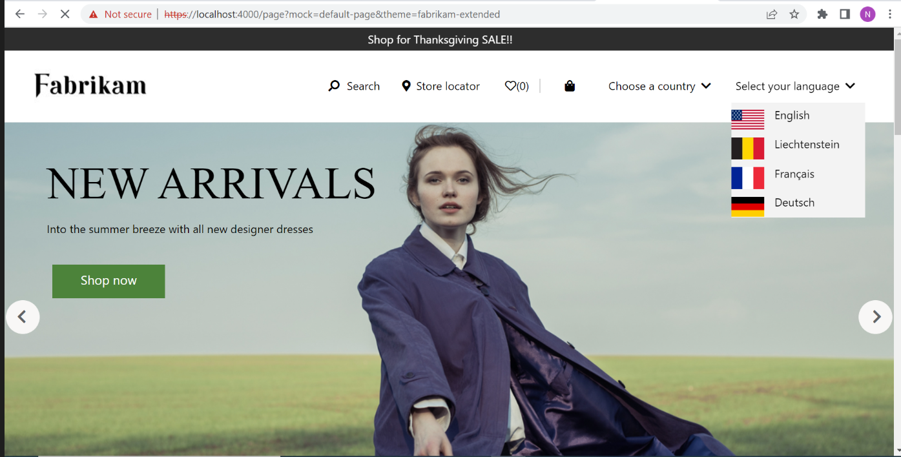

# Dynamics 365 Commerce - online extensibility samples

## License

License is listed in the [LICENSE](./LICENSE) file.

# Sample - Language Picker

## Overview

In this sample, you will learn how to create a language picker module that will allow you the user can to pick a language from the drop down which will redirect to the appropriate page for that locale. This language-picker module can be added anywhere in the header or footer modules.



## Starter kit license

License for starter kit is listed in the [LICENSE](./module-library/LICENSE) .

## Prerequisites

Follow the instructions mentioned in [document](https://docs.microsoft.com/en-us/dynamics365/commerce/e-commerce-extensibility/setup-dev-environment) to set up the development environment.

### Procedure to create custom theme

Follow the instructions mentioned in [document](https://docs.microsoft.com/en-us/dynamics365/commerce/e-commerce-extensibility/create-theme) to create the custom theme.

In this sample we have cloned the fabrikam theme to a new custom theme named fabrikam-extended.

## Detailed Steps

### 1.Create a new custom language picker module.

Create a new module named **language-picker** using the command yarn msdyn365 add-module language-picker.

Open the new module **language-picker.definition.json** file under **src/Modules/language-picker** and replace the existing code with the code below.

```json
{
    "$type": "contentModule",
    "friendlyName": "language-picker",
    "name": "language-picker",
    "description": "Language picker to support different languages",
    "categories": ["language-picker"],
    "tags": ["Additional tags go here"],
    "dataActions": {},
    "config": {
        "languages": {
            "type": "array",
            "friendlyName": "Language Values",
            "items": {
                "type": "object",
                "friendlyName": "Language Names List",
                "description": "Language Names List",
                "properties": {
                    "name": {
                        "type": "string",
                        "friendlyName": "Name of language",
                        "description": "Name of language",
                        "default": "default value"
                    },
                    "code": {
                        "type": "string",
                        "friendlyName": "Locale code for language",
                        "description": "Locale code for language",
                        "required": true
                    },
                    "imageUrl": {
                        "type": "string",
                        "friendlyName": "Link to flag image",
                        "description": "Link to to flag image"
                    },
                    "linkUrl": {
                        "type": "string",
                        "friendlyName": "Redirect link for locale",
                        "description": "Redirect link for locale"
                    }
                }
            },
            "description": "List of languages",
            "scope": "module",
            "group": "Layout Properties"
        },
        "linkRedirectFlag": {
            "friendlyName": "flag to check if we need to redirect to a specific link ",
            "description": "If set to true,we will redirect to link url for that language",
            "type": "boolean",
            "default": false,
            "scope": "module"
        },
        "linkBaseUrl": {
            "friendlyName": "A base url after which locale can be appended ",
            "description": "A base url after which locale can be appended",
            "type": "string"
        }
    },
    "resources": {
        "selectLocaleText": {
            "comment": "String displayed on the page for language",
            "value": "Language"
        }
    }
}
```

### 2.Add module code.

Open the **language-picker.tsx** under **src/Modules/language-picker** and replace with the code below.

```typescript
/*---------------------------------------------------------------------------------------------
 *  Copyright (c) Microsoft Corporation. All rights reserved.
 *  Licensed under the MIT License. See License.txt in the project root for license information.
 *--------------------------------------------------------------------------------------------*/

import * as React from 'react';

import { ILanguagePickerData } from './language-picker.data';
import { ILanguagePickerProps } from './language-picker.props.autogenerated';

export interface ILanguagePickerViewProps extends ILanguagePickerProps<ILanguagePickerData> {
    onChange(e: React.MouseEvent<HTMLLIElement, MouseEvent>): void;
}

/**
 *
 * LanguagePicker component
 * @extends {React.PureComponent<ILanguagePickerProps<ILanguagePickerData>>}
 */
class LanguagePicker extends React.PureComponent<ILanguagePickerProps<ILanguagePickerData>> {
    public constructor(props: ILanguagePickerViewProps) {
        super(props);
        this._handleChange = this._handleChange.bind(this);
    }

    public render(): JSX.Element | null {
        const viewProps: ILanguagePickerViewProps = {
            ...(this.props as ILanguagePickerProps<ILanguagePickerData>),
            onChange: this._handleChange
        };
        return this.props.renderView(viewProps);
    }
    private _handleChange(e: React.MouseEvent<HTMLLIElement, MouseEvent>): void {
        this.setState({ value: e.currentTarget.id });
        const locale = e.currentTarget.id;
        let redirectPath = '';
        {
            /* link redirect flag decides whether to redirect to a link url in config
        for that locale or append locale to a base url and redirect */
        }
        if (this.props.config.linkRedirectFlag) {
            {
                /* if flag is true we will redirect to link url */
            }
            if (this.props.config.languages) {
                for (let i = 0; i < this.props.config.languages.length; i++) {
                    if (this.props.config.languages[i].code === locale) {
                        redirectPath = this.props.config.languages[i].linkUrl || '';
                        break;
                    }
                }
            }
            window.location.assign(redirectPath);
        } else {
            {
                /* append locale to the base url in config and redirect */
            }
            let redirectUrl = '';
            const baseUrl = this.props.config.linkBaseUrl;
            let path = this.props.context.request.url.requestUrl.pathname;
            // if the path has locale already then remove that locale code and have the / alone
            this.props.config.languages!.forEach((item, i) => {
                if (path.indexOf(`/${item.code}/`) > -1) {
                    path = path.replace(`/${item.code}/`, '/');
                }
                // if its home page and it ends with /en then replace/en with space
                if (this.props.context.request.url.requestUrl.href.endsWith(`/${item.code}`) && path.indexOf(`/${item.code}`) > -1) {
                    path = path.replace(`/${item.code}`, '');
                }
            });
            /* if base url ends with slash there is no need to append / before locale to url */
            if (baseUrl !== undefined && baseUrl.endsWith('/')) {
                if (locale !== undefined && locale.length > 0) {
                    redirectUrl = `${baseUrl}${locale}${path}${this.props.context.request.url.requestUrl.search}`;
                } else {
                    {
                        /* if locale code is empty then no need to append locale and we just redirect */
                    }
                    // remove the / from path in this case
                    path = path.replace(/^\/+/g, '');
                    redirectUrl = `${baseUrl}${path}${this.props.context.request.url.requestUrl.search}`;
                }
            } else {
                {
                    /* if base url doesn't end with slash then we need to append / after locale to url */
                }
                if (locale !== undefined && locale.length > 0) {
                    redirectUrl = `${baseUrl}/${locale}${path}${this.props.context.request.url.requestUrl.search}`;
                } else {
                    {
                        /* if locale code is empty then no need to append locale and we just redirect */
                    }
                    redirectUrl = `${baseUrl}${path}${this.props.context.request.url.requestUrl.search}`;
                }
            }
            window.location.assign(redirectUrl);
        }
    }
}

export default LanguagePicker;
```

### 3. Add module view code.

Open the **language-picker.view.tsx** file under **src/Modules/language-picker** and replace existing code with code below.

```typescript
/*!
 * Copyright (c) Microsoft Corporation.
 * All rights reserved. See LICENSE in the project root for license information.
 */

import React, { useState } from 'react';
import { ILanguagePickerViewProps } from './language-picker';

export default (props: ILanguagePickerViewProps) => {
    const languages = props.config.languages;
    const [show, setShow] = useState(false);
    const setShowTrue = () => setShow(true);
    const setShowFalse = () => setShow(false);
    let baseUrl = props.config.linkBaseUrl;
    const currentUrl = props.context.request.url.requestUrl.pathname;
    let currentLocale = '';
    if (!baseUrl?.endsWith('/')) {
        baseUrl = `${baseUrl}/`;
    }
    const options = languages!.map((item, i) => {
        const index = currentUrl.indexOf(`/${item.code}/`);
        let startIndex = 0;
        let localeCodeLen = 0;
        if (index > -1) {
            startIndex = index + 1;
            localeCodeLen = item.code.length;
            currentLocale = currentUrl.substring(startIndex, startIndex + localeCodeLen);
        }

        return (
            // tslint:disable-next-line: max-line-length
            <li
                className={`ms-language-picker__list__item  ${item.code === currentLocale && item.code !== '' ? 'selected' : ''}`}
                key={item.name}
                role='menuitem'
                id={item.code}
                onClick={props.onChange}
                style={{ display: `${show ? 'block' : 'none'}` }}
            >
                 {item.name}
            </li>
        );
    });
    options.unshift(
        <button className='ms-language-picker__button'>
            Select your language
            <span className='ms-language-picker__span' />
        </button>
    );
    return (
        <div className='ms-language-picker'>
            <ul className='ms-language-picker__list' onMouseEnter={setShowTrue} onMouseLeave={setShowFalse}>
                {options}
            </ul>
        </div>
    );
};
```

### 4. Create language picker toggleview file.

Create a new file **language-picker-toggleview.tsx** under **src/Modules/language-picker** and copy the code below.

```typescript
/*!
 * Copyright (c) Microsoft Corporation.
 * All rights reserved. See LICENSE in the project root for license information.
 */

import React from 'react';
import { ILanguagePickerViewProps } from './language-picker';
import { ILanguagesData } from './language-picker.props.autogenerated';

export default (props: ILanguagePickerViewProps) => {
    const languages = props.config.languages;
    let baseUrl = props.config.linkBaseUrl;
    const currentUrl = props.context.request.url.requestUrl.href;
    let currentLocale = '';
    let otherLanguage: ILanguagesData | undefined;

    if (!baseUrl?.endsWith('/')) {
        baseUrl = `${baseUrl}/`;
    }

    let option = null;
    languages!.forEach((item, i) => {
        const index = currentUrl.indexOf(`/${item.code}/`);
        let startIndex = 0;
        let localeCodeLen = 0;
        // adding condition for home page since it can end with /en and no trailng slash
        if (index === -1 && currentUrl.endsWith(`/${item.code}`)) {
            startIndex = currentUrl.indexOf(`/${item.code}`) + 1;
            currentLocale = currentUrl.substring(startIndex, startIndex + item.code.length);
        }
        if (index > -1) {
            startIndex = index + 1;
            localeCodeLen = item.code.length;
            currentLocale = currentUrl.substring(startIndex, startIndex + localeCodeLen);
        }
        // looks for current locale in the url or default to arabic(or any language)
        if (currentLocale.indexOf('ar') > -1) {
            otherLanguage = languages!.find(language => language.code.indexOf('en') > -1);
        } else if (currentLocale.indexOf('en') > -1) {
            otherLanguage = languages!.find(language => language.code.indexOf('ar') > -1);
        } else if (currentLocale === '') {
            otherLanguage = languages!.find(language => language.code.indexOf('ar') > -1);
        }

        const code = otherLanguage?.code.substr(0, 2);

        option = (
            <span
                className={`ms-language-picker__list__item`}
                key={otherLanguage?.name}
                role='menuitem'
                id={otherLanguage?.code}
                onClick={props.onChange}
            >
                {code}
            </span>
        );
    });

    return (
        <div>
            <div className='ms-language-picker'>{option}</div>
        </div>
    );
};
```

### 5. Extend the header view to support language picker

Your custom theme may already override the **header.view.tsx** component in the themes **views** directory. If it does not exist you can override using the CLI command yarn msdyn365 add-view-extension fabrikam-extended header, where "fabrikam-extended" is the name of your custom theme.
Open the **header.view.tsx** under **src/themes/fabrikam-extended/views** and replace existing code with below code which contains the logic to support language picker.

```typescript
/*--------------------------------------------------------------
 * Copyright (c) Microsoft Corporation. All rights reserved.
 * See License.txt in the project root for license information.
 *--------------------------------------------------------------*/

import { IHeaderViewProps } from '@msdyn365-commerce-modules/header';
import { Module, Node } from '@msdyn365-commerce-modules/utilities';
import * as React from 'react';
import { IHeaderProps as IHeaderExtentionProps } from '../definition-extensions/header.ext.props.autogenerated';

const headerView: React.FC<IHeaderViewProps & IHeaderExtentionProps<{}>> = (props: IHeaderViewProps & IHeaderExtentionProps<{}>) => {
    const {
        HeaderTag,
        HeaderContainer,
        HeaderTopBarContainer,
        MobileMenuContainer,
        MobileMenuBodyContainer,
        MobileMenuLinksContainer,
        Divider
    } = props;
    const languages = (props.slots && props.slots.languages.length > 0 && props.slots.languages) || [];
    return (
        <Module {...HeaderTag}>
            <Node {...HeaderContainer}>
                <Node {...HeaderTopBarContainer}>
                    {props.navIcon}
                    {props.logo}
                    {_renderReactFragment(props.search)}
                    {props.preferredStore}
                    {_renderDesktopAccountBlock(props)}
                    {props.wishListIconDesktop}
                    <Node {...Divider} />
                    {props.cartIcon}
                    {_renderReactFragment(props.siteOptions)}
                    {_renderReactFragment(languages)}
                </Node>
                <Node {...MobileMenuContainer}>
                    <Node {...MobileMenuBodyContainer}>
                        {props.MobileMenuHeader}
                        {_renderReactFragment(props.menuBar)}
                        <Node {...MobileMenuLinksContainer}>
                            {props.accountLinks ? props.accountLinks.map(link => link) : false}
                            {props.siteOptions}
                            {props.wishListIconMobile}
                            {props.signInLink}
                            {props.signOutLink}
                        </Node>
                    </Node>
                </Node>
                {_renderReactFragment(props.menuBar)}
            </Node>
        </Module>
    );
};

function _renderDesktopAccountBlock(props: IHeaderViewProps): JSX.Element | null {
    const {
        AccountInfoDropdownParentContainer,
        AccountInfoDropdownPopoverConentContainer,
        accountInfoDropdownButton,
        signOutLink,
        signInLink,
        accountLinks
    } = props;

    if (AccountInfoDropdownParentContainer) {
        if (AccountInfoDropdownPopoverConentContainer) {
            return (
                <Node {...AccountInfoDropdownParentContainer}>
                    {accountInfoDropdownButton}
                    <Node {...AccountInfoDropdownPopoverConentContainer}>
                        {accountLinks ? accountLinks.map(link => link) : false}
                        {signOutLink}
                    </Node>
                </Node>
            );
        } else if (signInLink) {
            return <Node {...AccountInfoDropdownParentContainer}>{signInLink}</Node>;
        }
    }
    props.context.telemetry.error('Header content is empty, module wont render.');
    return null;
}

function _renderReactFragment(items: React.ReactNode[]): JSX.Element | null {
    return (
        <>
            {items && items.length > 0
                ? items.map((slot: React.ReactNode, index: number) => {
                      return <React.Fragment key={index}>{slot}</React.Fragment>;
                  })
                : null}
        </>
    );
}

export default headerView;
```

### 6. Extend header module definition Extension.

If you are using the fabrikam as a base theme it may already contain a **header.definition.ext.json** file in the **src/themes/fabrikam-extended** folder, however if your custom theme does not contain one, you can create a folder **definition-extensions** under **src/themes/fabrikam-extended** then create a new file **header.definition.ext.json** under **src/themes/fabrikam-extended/definition-extensions** folder. Replace the file contents with the code below.

```json
{
    "$type": "definitionExtension",
    "slots": {
        "languages": {
            "friendlyName": "Language Picker",
            "description": "Slot for locale",
            "max": 1,
            "min": 0,
            "allowedTypes": ["language-picker"]
        }
    }
}
```

### 7 Add language picker style file

Add language-picker.scss file under **src/themes/fabrikam-extended/styles/04-modules** and replace code with below code add reference of the file in index.scss file

```scss
//Variables
$site-picker-desktop-list-bg-color: #f3f3f3;
$site-picker-list-item-img-padding: 10px 10px 1px 0;
$site-picker-list-margin: 5px;
$site-picker-list-item-padding-top: 10px;
$site-picker-list-item-padding-bottom: 10px;
$site-picker-list-item-padding-left: 10px;
$site-picker-list-item-padding-right: 10px;
$site-picker-line-height: 40px;
$site-picker-height: 48px;
$site-picker-transparent: transparent;

//style presets
:root {
    --ms-language-picker-font-size: var(--msv-body-font-size-m);
    --ms-language-picker-color: var(--msv-font-primary-color);
    --ms-language-picker-gray-500: #{$msv-gray-500};
    --ms-language-picker-bg-color: #{$site-picker-transparent};
    --ms-language-picker-desktop-list-bg-color: #{$site-picker-desktop-list-bg-color};
    --ms-language-picker-mobile-list-bg-color: #{$msv-white};
    --ms-language-picker-font-color: #{$msv-black};
}

.ms-language-picker {
    z-index: 1015;
    margin-left: 15px;
    align-self: flex-start;
    align-items: self-end;
    font-size: var(--ms-language-picker-font-size);
    height: $site-picker-height;
    &__button {
        background-color: var(--ms-site-picker-bg-color);
        border: none;
        color: var(--ms-site-picker-font-color);
        cursor: pointer;
        height: 100%;
        width: 100%;

        &:focus {
            border: 1px dashed var(--ms-site-picker-gray-500);
            outline: none;
        }
    }
    &__span {
        &::after {
            @include msv-icon();
            content: $msv-ChevronDown;
            color: var(--ms-site-picker-color);
            margin: 0 8px;
            line-height: $site-picker-line-height;
        }
    }

    &__list {
        list-style-type: none;
        width: fit-content;
        padding-left: 0px;
        margin: 5px;
        background-color: var(--ms-language-picker-bg-color);
        width: 100%;
        height: 100% !important;

        &__item {
            cursor: pointer;
            color: var(--ms-language-picker-font-color);
            flex-direction: row-reverse;
            justify-content: flex-end;
            background-color: var(--ms-language-picker-desktop-list-bg-color) !important;
            align-items: flex-end;

            &:focus {
                border: 1px dashed var(--ms-language-picker-gray-500);
                outline: none;
            }
            &__link {
                color: var(--ms-language-picker-font-color);
                flex-direction: row-reverse;
                justify-content: flex-end;
                padding-bottom: $site-picker-list-item-padding-bottom;
                padding-left: $site-picker-list-item-padding-left;
                padding-top: $site-picker-list-item-padding-top;
                padding-right: $site-picker-list-item-padding-right;
                align-items: flex-end;
                width: 100%;

                &:focus {
                    border: 1px dashed var(--ms-language-picker-gray-500);
                    outline: none;
                }
            }

            &__img {
                padding: $site-picker-list-item-img-padding;
                align-items: flex-end;
                max-width: none !important;
                display: inline !important;
                width: 30% !important;
            }
        }
    }
}

@media (max-width: $msv-breakpoint-l) {
    .ms-language-picker {
        margin-left: 0;
        height: auto;
    }

    .ms-language-picker__drawer {
        .drawer__button {
            background-color: var(--ms-language-picker-bg-color);
            border: none;
            color: var(--ms-language-picker-font-color);
            cursor: pointer;
            width: 100%;
            font-size: $msv-font-size-m;
            padding-left: 20px;
            padding-right: $site-picker-list-item-padding-right;
            height: $site-picker-height;
            outline-offset: -1px;

            .drawer__buttontext {
                float: left;
            }

            .ms-language-picker__drawer-close {
                position: absolute;
                right: 10px;

                &::after {
                    @include msv-icon();
                    color: var(--ms-language-picker-color);
                    content: $msv-ChevronDown;
                }
            }

            .ms-language-picker__drawer-open {
                position: absolute;
                right: 10px;

                &::after {
                    @include msv-icon();
                    color: var(--ms-language-picker-color);
                    content: $msv-ChevronUp;
                }
            }
        }

        .ms-language-picker__list__item__link {
            flex-direction: row-reverse;
            justify-content: flex-end;
            background-color: var(--ms-language-picker-mobile-list-bg-color);
            color: var(--ms-language-picker-font-color);
            height: $site-picker-height;
            font-size: $msv-font-size-m;
            padding-bottom: $site-picker-list-item-padding-bottom;
            padding-left: 20px;
            padding-right: $site-picker-list-item-padding-right;
            align-items: flex-end;
            width: 100%;

            &:focus {
                border: 1px dashed var(--ms-language-picker-gray-500);
                outline: none;
            }

            .ms-language-picker__list__item__text {
                margin: auto 0;
            }
        }
    }
}
```

## Build and test module

The sample can now be tested in a web browser using the `yarn start` command.

Test the module using page mock, Go to browser and copy paste the below url
https://localhost:4000/page?mock=default-page&theme=fabrikam-extended

### 1. Test Integration test case

Integration test case for sample can be tested in browser using below steps
* Set path to Language Picker sample level in command prompt and run `yarn testcafe chrome .\test\language-picker-tests.ts -s .\` command.

ensure that testcafe is added globally to run test case.

## Third party Image and Video Usage restrictions

The software may include third party images and videos that are for personal use only and may not be copied except as provided by Microsoft within the demo websites. You may install and use an unlimited number of copies of the demo websites., You may not publish, rent, lease, lend, or redistribute any images or videos without authorization from the rights holder, except and only to the extent that the applicable copyright law expressly permits doing so.
