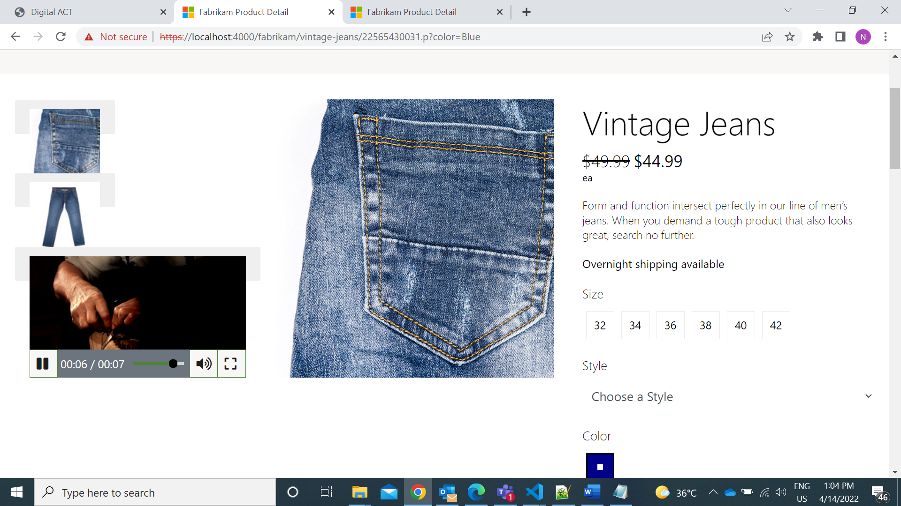

# Dynamics 365 Commerce - online extensibility samples

## License
License is listed in the [LICENSE](./LICENSE) file.

# Sample - Media Gallery Video Support Without API

## Overview
Media gallery module supports only product images to display on product description page (PDP) at present.
The objective is to leverage the existing media gallery module to support both images and videos through view extensions.
There are two different samples for Media gallery. In this sample, we have static videos which are retrieved from CMS. 



## Starter kit license
License for starter kit is listed in the [LICENSE](./module-library/LICENSE) .

## Prerequisites
Follow the instructions mentioned in [document](https://docs.microsoft.com/en-us/dynamics365/commerce/e-commerce-extensibility/setup-dev-environment) to set up the development environment.

### Procedure to create custom theme
Follow the instructions mentioned in [document](https://docs.microsoft.com/en-us/dynamics365/commerce/e-commerce-extensibility/create-theme) to create the custom theme

Create a theme folder with name fabrikam-extended.

## Detailed Steps

### 1. Extend media gallery definition file.

Create a new file **media-gallery.definition.ext.json** under **\src\themes\fabrikam-extended\definition-extensions** folder and copy the code given below.In this step we will extend the media gallery module definition file to add a new configuration field called "video" which will allow the user to add a new video link from within the site builder tool.

```json
{
    "$type": "definitionExtension",
    "config": {
        "video": {
            "friendlyName": "Video",
            "description": "video data",
            "type": "video",
            "required": false
        }
    }
}

```

### 2. Extend media gallery view extension file.
In the previous step a new configuration field "video" was added, we now need to ensure the video is displayed in the media gallery. We will do this with a module view extension, create a new file **media-gallery.view.tsx** under **\src\themes\fabrikam-extended\views** folder and copy the code given below.In below code add "getVideoThumbNailItem" function to return 

```typescript
{
  /*---------------------------------------------------------------------------------------------
 *  Copyright (c) Microsoft Corporation. All rights reserved.
 *  Licensed under the MIT License. See License.txt in the project root for license information.
 *--------------------------------------------------------------------------------------------*/

import { IMediaGalleryThumbnailItemViewProps, IMediaGalleryThumbnailsViewProps, IMediaGalleryViewProps  } from '@msdyn365-commerce-modules/media-gallery';
import { ArrayExtensions } from '@msdyn365-commerce-modules/retail-actions';
import { Button, KeyCodes, Module, Node, NodeTag } from '@msdyn365-commerce-modules/utilities';
import { IVideoMetadata, Player,IPlayerOptions,IPlayerData } from '@msdyn365-commerce/components';
import { IImageData, IImageSettings, Image, IVideoFileDataLinks, Video } from '@msdyn365-commerce/core';
import classnames from 'classnames';
import * as React from 'react';
import { IMediaGalleryConfig, IMediaGalleryProps } from '../definition-extensions/media-gallery.ext.props.autogenerated';

/*
*  Video Data Interface.
*/

interface IVideoData {
    _links?: IVideoFileDataLinks;
    playtime?: number;
    subtitle?: string;
    thumbnail?: IImageData;
    title?: string;
    description?: string;
    interactiveTriggersEnabled?: boolean;
    minimumAge?: number;
    _id?: string;
    locale?: string;
}

/**
 *
 * The MediaGalleryView class.
 * @extends {React.component<IMediaGalleryViewProps & IMediaGalleryProps<IMediaGalleryConfig>>}
 */
 class MediaGalleryView extends React.Component<IMediaGalleryViewProps & IMediaGalleryProps<IMediaGalleryConfig>> {
    private readonly defaultThumbnailImageSettings: IImageSettings = {
        viewports: {
            xs: { q: 'w=295&h=295&q=80&m=6&f=jpg', w: 295, h: 295 },
            xl: { q: 'w=295&h=295&q=80&m=6&f=jpg', w: 295, h: 295 }
        },
        lazyload: true,
        cropFocalRegion: true
    };

    public render(): JSX.Element {
        const { CarouselProps, Thumbnails, MediaGallery, Modal } = this.props;
        return (
            <Module {...MediaGallery}>
                <Node {...CarouselProps} />
                {Modal}
                {this.renderThumbnails(Thumbnails)}
            </Module>
        );
    }

    /**
     * Renders Media gallery thumbnails to represent images in grid view.
     * @param thumbnails - Thumbnail view props.
     * @param props - Media gallery view props.
     * @returns - Single slide carousel component to render as media gallery image.
     */
    private readonly renderThumbnails = (thumbnails: IMediaGalleryThumbnailsViewProps): JSX.Element => {
        // eslint-disable-next-line @typescript-eslint/naming-convention --  Dependency from media-gallery.tsx file
        const { ThumbnailsContainerProps, SingleSlideCarouselComponentProps } = thumbnails;
        const { state } = this.props;
        const video: IVideoData | undefined = this.props.config.video;

        const items: IMediaGalleryThumbnailItemViewProps[] | undefined=
        // eslint-disable-next-line multiline-ternary -- need multiline for easy code reading
        state.lastUpdate && !ArrayExtensions.hasElements(state.mediaGalleryItems)
        ? [this.GetEmptyThumbnailItemComponent(this.defaultThumbnailImageSettings)]
        // eslint-disable-next-line @typescript-eslint/naming-convention -- Dependency from media-gallery
        :state.mediaGalleryItems?.map((item: IImageData, id: number) => this.GetThumbnailItemComponent(item,
            this.defaultThumbnailImageSettings, id, state.activeIndex));
        if (video) {
            items?.push(this.getVideoThumbNailItem(video, items.length));
        };

        return (
            <Node {...ThumbnailsContainerProps}>
                <Node {...SingleSlideCarouselComponentProps}>
                    {items?.map(this.renderThumbnailItem)}
                </Node>
            </Node>
        );
    };

    /**
     * Renders thumbnail item images.
     * @param thumbnail - Carousel thumbnail line props.
     * @returns Returns thumbnail container props with image.
     */
    private readonly renderThumbnailItem = (thumbnail: IMediaGalleryThumbnailItemViewProps): JSX.Element => {
        // eslint-disable-next-line @typescript-eslint/naming-convention --  Dependency from media-gallery.tsx file
        const { ThumbnailItemContainerProps, Picture } = thumbnail;

        return (
            <Node {...ThumbnailItemContainerProps}>
                {Picture}
            </Node>
        );
    };

    /**
     * Gets empty thumbnail item to display media gallery images.
     * @param imageSettings - Image settings for image gallery items.
     * @param props - Media gallery view props from business layer.
     * @returns Returns thumbnail view props which will be used to render empty images.
     */
    private readonly GetEmptyThumbnailItemComponent = (imageSettings: IImageSettings): IMediaGalleryThumbnailItemViewProps => {
        return {
            ThumbnailItemContainerProps: {
                tag: 'li' as NodeTag,
                className: 'ms-media-gallery__thumbnail-item',
                role: 'tab',
                tabIndex: 0,
                key: 0,
                'aria-label': '',
                'aria-selected': true
            },
            Picture: (
                <Image
                    requestContext={this.props.context.actionContext.requestContext}
                    className='ms-media-gallery__thumbnail-item__image'
                    src='empty'
                    gridSettings={this.props.context.request.gridSettings!}
                    imageSettings={this.props.config.thumbnailImageSettings ?? imageSettings}
                    loadFailureBehavior='empty'
                />
            )
        };
    };

    /**
     * Gets thumbnail item to display media gallery images.
     * @param image - Media gallery image.
     * @param imageSettings - Image settings for the image gallery item.
     * @param imageId - Image id.
     * @param modifiedActiveIndex - Modified Index of the image when selection changes.
     * @param props - Media gallery view props from business layer.
     * @returns Returns thumbnail view props which will be used to render images.
     */
    private readonly GetThumbnailItemComponent = (
        image: IImageData,
        imageSettings: IImageSettings,
        imageId: number,
        modifiedActiveIndex: number
    ): IMediaGalleryThumbnailItemViewProps => {

        const onClick = () => {
            // this.props.callbackToggle?.();
            // this.props.callbackThumbnailClick?.(imageId);
        };

        const classes = classnames(
            'ms-media-gallery__thumbnail-item',
            modifiedActiveIndex === imageId ? 'ms-media-gallery__thumbnail-item-active' : ''
        );

        const handleKeyDown = (event: React.KeyboardEvent) => {
            if (event.keyCode === KeyCodes.Enter) {
                onClick();
            }
        };

        return {
            ThumbnailItemContainerProps: {
                tag: 'li' as NodeTag,
                className: classes,
                role: 'presentation',
                key: imageId
            },
            Picture: (
                <Node className='ms-fullscreen-section'>
                    <Button
                        role='tab'
                        aria-label={image.altText}
                        aria-selected={modifiedActiveIndex === imageId}
                        aria-controls={`${this.props.id}__carousel-item__${imageId}`}
                        className='msc-ss-carousel-vert-button-wrapper'
                        onClick={onClick}
                        onKeyDown={handleKeyDown}
                    >
                        <Image
                            requestContext={this.props.context.actionContext.requestContext}
                            className='ms-media-gallery__thumbnail'
                            {...image}
                            gridSettings={this.props.context.request.gridSettings!}
                            imageSettings={this.props.config.thumbnailImageSettings ?? imageSettings}
                            loadFailureBehavior='default'
                        />
                    </Button>
                    <Node className='ms-fullscreen-section__overlay'>
                        <Button
                            onKeyDown={handleKeyDown}
                            title={this.props.resources.fullScreenTitleText}
                            role='button'
                            className='ms-fullscreen-section__magnifying-glass-icon'
                            onClick={onClick}
                        />
                    </Node>
                </Node>
            )
        };
    };

    /**
     * Gets video thumbnail item to display media gallery.
     * @param video - Video data.
     * @param id - Unique id for keys.
     * @returns Return thumbnail view props which will be used to render video.
     */
    private readonly getVideoThumbNailItem = (video: IVideoData, id: number): IMediaGalleryThumbnailItemViewProps => {
        const options: IPlayerOptions = this.props.config as IPlayerOptions;
        const videoMetaData: IVideoMetadata = {};
        videoMetaData.videoId = video._id;
        videoMetaData.title = video.title;
        videoMetaData.duration = video.playtime;

        if (video.thumbnail) {
            videoMetaData.posterframeUrl = video.thumbnail.src;
        }

        if (video._links?.binaryReferences) {
            videoMetaData.videoBinaryReferences = video._links.binaryReferences;
        }

        const videoPlayerData: IPlayerData = { options, metaData: videoMetaData };

        return {
            ThumbnailItemContainerProps: {
                tag: 'li' as NodeTag,
                className: 'msc-ss-carousel-vert-item ms-media-gallery__thumbnail-item',
                role: 'presentation',
                key: id
            },
            Picture: (
                <Node className='ms-fullscreen-section'>
                    <Button
                        role='tab'
                        aria-label={videoMetaData.title}
                        aria-controls={`${this.props.id}__carousel-item__${Number(videoMetaData.videoId)}`}
                        className='msc-ss-carousel-vert-button-wrapper'
                    >
                        <Video className='ms-media-gallery__thumbnail' editProps={{ key: video, requestContext: this.props.context.request }}>
                            <Player playerData={videoPlayerData} />
                        </Video>
                    </Button>
                </Node>
            )
        };
    };
}

export default MediaGalleryView;

```

### 3 Build and test module
The sample can now be tested in a web browser using the ```yarn start``` command.

### 4 Senario to test with mock
Test the module using page mock, Go to browser and copy paste the below url
https://localhost:4000/page?mock=default-page&theme=fabrikam-extended 
(ensure that you have the  [MSDyn365_HOST environment](https://docs.microsoft.com/en-us/dynamics365/commerce/e-commerce-extensibility/configure-env-file#msdyn365_host) variable properly set). 

## Third party Image and Video Usage restrictions

The software may include third party images and videos that are for personal use only and may not be copied except as provided by Microsoft within the demo websites.  You may install and use an unlimited number of copies of the demo websites., You may not publish, rent, lease, lend, or redistribute any images or videos without authorization from the rights holder, except and only to the extent that the applicable copyright law expressly permits doing so.
