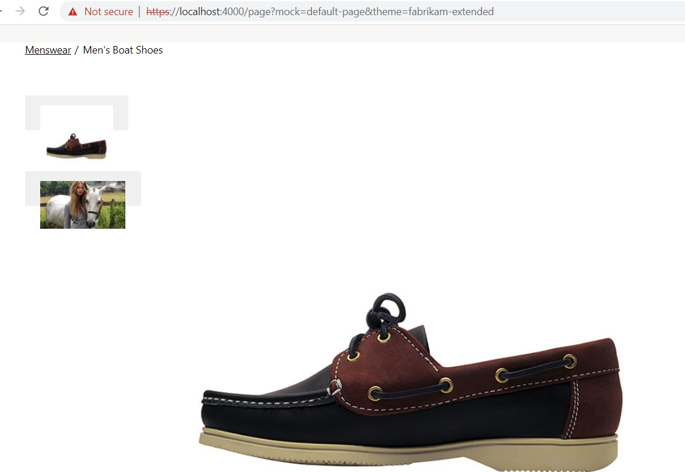

# Dynamics 365 Commerce - online extensibility samples

## License
License is listed in the [LICENSE](./LICENSE) file.

# Sample - Media Gallery Video Support

## Overview
The objective of the sample is to leverage the existing media gallery module to support both images and videos on product description page (PDP).



## Starter kit license
License for starter kit is listed in the [LICENSE](./module-library/LICENSE) .

## Prerequisites
Follow the instructions mentioned in [document](https://docs.microsoft.com/en-us/dynamics365/commerce/e-commerce-extensibility/setup-dev-environment) to set up the development environment.

### Procedure to create custom theme
Follow the instructions mentioned in [document](https://docs.microsoft.com/en-us/dynamics365/commerce/e-commerce-extensibility/create-theme) to create the custom theme

Create a theme folder with name fabrikam-extended.

## Detailed Steps

### 1. HQ setting for creating product attribute.

Follow the instructions mentioned in [document](https://docs.microsoft.com/en-us/dynamics365/commerce/attribute-attributegroups-lifecycle) to set up the attribute **VideoId** in HQ side.


### 2. Extend media gallery definition file.

Create a new file **media-gallery.definition.ext.json** under **\src\themes\fabrikam-extended\definition-extensions** folder and copy the code given below.In this step we will extend the media gallery module definition file to add a data action to get productAttributes.

```json
{
    "$type": "definitionExtension",
    "dataActions": {
        "productAttributes": {
            "path": "@msdyn365-commerce-modules/retail-actions/dist/lib/get-attributes-for-selected-variant",
            "runOn": "server"
        }
    }
}

```

### 3. Extend media gallery view extension file.
We need to ensure the video is displayed in the media gallery. We will do this with a module view extension, create a new file **media-gallery.view.tsx** under **\src\themes\fabrikam-extended\views** folder and copy the code given below.In below code add "getVideoThumbNailItem" function to return 

```typescript
/*---------------------------------------------------------------------------------------------
 *  Copyright (c) Microsoft Corporation. All rights reserved.
 *  Licensed under the MIT License. See License.txt in the project root for license information.
 *--------------------------------------------------------------------------------------------*/
import {
    imageSource,
    IMediaGalleryThumbnailItemViewProps,
    IMediaGalleryThumbnailsViewProps,
    IMediaGalleryViewProps
} from '@msdyn365-commerce-modules/media-gallery';
import { ArrayExtensions } from '@msdyn365-commerce-modules/retail-actions';
import { Button, KeyCodes, Module, Node, NodeTag } from '@msdyn365-commerce-modules/utilities';
import { IVideoMetadata, Player, IPlayerOptions, IPlayerData } from '@msdyn365-commerce/components';
import { commerceVideoMetadataRequest, IImageData, IImageSettings, Image, IVideoFileDataLinks, Video } from '@msdyn365-commerce/core';
import classnames from 'classnames';
import React from 'react';
import { AttributeValue, AsyncResult } from '@msdyn365-commerce/retail-proxy';
import { IMediaGalleryConfig, IMediaGalleryProps } from '../definition-extensions/media-gallery.ext.props.autogenerated';

interface IVideoData {
    _links?: IVideoFileDataLinks;
    playtime?: number;
    subtitle?: string;
    thumbnail?: IImageData;
    title?: string;
    description?: string;
    interactiveTriggersEnabled?: boolean;
    minimumAge?: number;
    _id?: string;
    locale?: string;
}

export interface IMediaGalleryExtProps {
    productAttributes: AsyncResult<AttributeValue[]>;
}

enum CustomAttributes {
    videoIdAttribute = 'videoId'
}

/**
 *
 * The MediaGalleryView class.
 * @extends {React.component<IMediaGalleryViewProps & IMediaGalleryProps<IMediaGalleryConfig & IMediaGalleryExtProps>>}
 */
class MediaGalleryView extends React.Component<IMediaGalleryViewProps & IMediaGalleryProps<IMediaGalleryConfig & IMediaGalleryExtProps>> {
    private videoData: IVideoData | undefined;
    constructor(props: IMediaGalleryViewProps & IMediaGalleryProps<IMediaGalleryConfig & IMediaGalleryExtProps>) {
        super(props);
        this.state = {
            videoData: {}
        };
    }

    public render(): JSX.Element {
        const { CarouselProps, Thumbnails, MediaGallery, Modal } = this.props;
        return (
            <Module {...MediaGallery}>
                <Node {...CarouselProps} />
                {Modal}
                {this.renderThumbnails(Thumbnails, this.props)}
            </Module>
        );
    }

    public componentDidMount = async (): Promise<void> => {
        await this.getVideoMetadataFromApi();
    };

    /**
     * Render the thumbnail item images.
     * @param thumbnail - The carousel thumbnail line props.
     * @returns Return HTML having thumnailcontainer props with image.
     */
    private readonly renderThumbnailItem = (thumbnail: IMediaGalleryThumbnailItemViewProps): JSX.Element => {
        // eslint-disable-next-line @typescript-eslint/naming-convention --  Dependency from media-gallery.tsx file
        const { ThumbnailItemContainerProps, Picture } = thumbnail;

        return <Node {...ThumbnailItemContainerProps}>{Picture}</Node>;
    };

    /**
     * Gets the empty thumbnail item to display media gallery images.
     * @param imageSettings - Image settings for the image gallery items.
     * @param props - The Media gallery view props from business layer.
     * @returns Return thumbnail view props which will be used to render empty images.
     */
    private readonly GetEmptyThumbnailItemComponent = (
        imageSettings: IImageSettings,
        props: IMediaGalleryViewProps
    ): IMediaGalleryThumbnailItemViewProps => {
        return {
            ThumbnailItemContainerProps: {
                tag: 'li' as NodeTag,
                className: 'ms-media-gallery__thumbnail-item',
                role: 'tab',
                tabIndex: 0,
                key: 0,
                'aria-label': '',
                'aria-selected': true
            },
            Picture: (
                <Image
                    requestContext={props.context.actionContext.requestContext}
                    className='ms-media-gallery__thumbnail-item__image'
                    src='empty'
                    gridSettings={props.context.request.gridSettings!}
                    imageSettings={props.config.thumbnailImageSettings ?? imageSettings}
                    loadFailureBehavior='empty'
                />
            )
        };
    };

    /**
     * Gets the thumbnail item to display media gallery images.
     * @param image - The media gallery images.
     * @param imageSettings - Image settings for the image gallery items.
     * @param imageId - Image id.
     * @param modifiedActiveIndex - Modified Index of the images when selection changes.
     * @param props - The Media gallery view props from business layer.
     * @returns Return thumbnail view props which will be used to render images.
     */
    private readonly GetThumbnailItemComponent = (
        image: IImageData,
        imageSettings: IImageSettings,
        imageId: number,
        modifiedActiveIndex: number,
        props: IMediaGalleryViewProps
    ): IMediaGalleryThumbnailItemViewProps => {
        const onClick = () => {
            props.callbackToggle?.();
            props.callbackThumbnailClick?.(imageId);
        };

        const classes = classnames(
            'ms-media-gallery__thumbnail-item',
            modifiedActiveIndex === imageId ? 'ms-media-gallery__thumbnail-item-active' : ''
        );

        const handleKeyDown = (event: React.KeyboardEvent) => {
            if (event.keyCode === KeyCodes.Enter) {
                onClick();
            }
        };

        return {
            ThumbnailItemContainerProps: {
                tag: 'li' as NodeTag,
                className: classes,
                role: 'presentation',
                key: imageSource?.productId
            },
            Picture: (
                <Node className='ms-fullscreen-section'>
                    <Button
                        role='tab'
                        aria-label={image.altText}
                        aria-selected={modifiedActiveIndex === imageId}
                        aria-controls={`${props.id}__carousel-item__${imageId}`}
                        className='msc-ss-carousel-vert-button-wrapper'
                        onClick={onClick}
                        onKeyDown={handleKeyDown}
                    >
                        <Image
                            requestContext={props.context.actionContext.requestContext}
                            className='ms-media-gallery__thumbnail'
                            {...image}
                            gridSettings={props.context.request.gridSettings!}
                            imageSettings={props.config.thumbnailImageSettings ?? imageSettings}
                            loadFailureBehavior='default'
                        />
                    </Button>
                    <Node className='ms-fullscreen-section__overlay'>
                        <Button
                            onKeyDown={handleKeyDown}
                            title={props.resources.fullScreenTitleText}
                            role='button'
                            className='ms-fullscreen-section__magnifying-glass-icon'
                            onClick={onClick}
                        />
                    </Node>
                </Node>
            )
        };
    };

    /**
     * Gets the video thumbnail item to display media gallery.
     * @param props - The Media gallery view props from business layer.
     * @returns Return thumbnail view props which will be used to render video.
     */
    private readonly getVideoThumbNailItem = (
        props: IMediaGalleryViewProps & IMediaGalleryProps<IMediaGalleryConfig>
    ): IMediaGalleryThumbnailItemViewProps | null => {
        const video = this.videoData;
        if (video) {
            const videoData: IVideoData = video;
            const options: IPlayerOptions = props.config as IPlayerOptions;
            const videoMetaData: IVideoMetadata = {};
            videoMetaData.videoId = video._id;
            videoMetaData.title = video.title;
            videoMetaData.duration = video.playtime;
            if (videoData.thumbnail) {
                videoMetaData.posterframeUrl = videoData.thumbnail.src;
            }
            if (videoData._links?.binaryReferences) {
                videoMetaData.videoBinaryReferences = videoData._links.binaryReferences;
            }
            const videoPlayerData: IPlayerData = { options, metaData: videoMetaData };
            return {
                ThumbnailItemContainerProps: {
                    tag: 'li' as NodeTag,
                    className: 'msc-ss-carousel-vert-item ms-media-gallery__thumbnail-item',
                    role: 'presentation',
                    key: imageSource?.productId
                },
                Picture: (
                    <Node className='ms-fullscreen-section'>
                        <Button
                            role='tab'
                            aria-label={videoMetaData.title}
                            aria-controls={`${props.id}__carousel-item__${Number(videoMetaData.videoId)}`}
                            className='msc-ss-carousel-vert-button-wrapper'
                        >
                            <Video
                                className='ms-media-gallery__thumbnail'
                                editProps={{ key: video, requestContext: props.context.request }}
                            >
                                <Player playerData={videoPlayerData} />
                            </Video>
                        </Button>
                    </Node>
                )
            };
        }
        return null;
    };

    private readonly defaultThumbnailImageSettings: IImageSettings = {
        viewports: {
            xs: { q: 'w=295&h=295&q=80&m=6&f=jpg', w: 295, h: 295 },
            xl: { q: 'w=295&h=295&q=80&m=6&f=jpg', w: 295, h: 295 }
        },
        lazyload: true,
        cropFocalRegion: true
    };

    /**
     * Render the Media gallery thumbnails to represent images in grid view.
     * @param thumbnails - The thumbnail view props.
     * @param props - The media gallery view props.
     * @returns - The single slide carousel component to render as media gallery image.
     */
    private readonly renderThumbnails = (
        thumbnails: IMediaGalleryThumbnailsViewProps,
        props: IMediaGalleryViewProps & IMediaGalleryProps<IMediaGalleryConfig>
    ): JSX.Element => {
        // eslint-disable-next-line @typescript-eslint/naming-convention --  Dependency from media-gallery.tsx file
        const { ThumbnailsContainerProps, SingleSlideCarouselComponentProps } = thumbnails;
        const { state } = props;

        const items: IMediaGalleryThumbnailItemViewProps[] | undefined =
            // eslint-disable-next-line multiline-ternary -- need multiline for easy code reading
            state.lastUpdate && !ArrayExtensions.hasElements(state.mediaGalleryItems)
                ? [this.GetEmptyThumbnailItemComponent(this.defaultThumbnailImageSettings, props)]
                : // eslint-disable-next-line @typescript-eslint/naming-convention -- Dependency from media-gallery
                  state.mediaGalleryItems?.map((item: IImageData, id: number) =>
                      this.GetThumbnailItemComponent(item, this.defaultThumbnailImageSettings, id, state.activeIndex, props)
                  );
        if (props) {
            const videoItem = this.getVideoThumbNailItem(props);
            videoItem && items?.push(videoItem);
        }
        return (
            <Node {...ThumbnailsContainerProps}>
                <Node {...SingleSlideCarouselComponentProps}>{items?.map(this.renderThumbnailItem)}</Node>
            </Node>
        );
    };

    /**
     * GetVideoMetadataFromAPI - Makes API call to get video metadata.
     * @returns - Promise<AxiosResponse | undefined>.
     */
    private readonly getVideoMetadataFromApi = async (): Promise<void> => {
        let videoData: any;
        const videoId = await this.getVideoIdfromProduct();
        if (videoId) {
            await commerceVideoMetadataRequest(this.props.context.request, [videoId]).then(result => {
                videoData = result;
                if (videoData && videoData.data) {
                    this.videoData = videoData.data[0] as IVideoData;
                }
            });
        }
    };

    private readonly getVideoIdfromProduct = async (): Promise<string | undefined> => {
        const attributes: AttributeValue[] | undefined = this.props.data.productAttributes.result;
        let customAttributeValue;
        if (!attributes) {
            return undefined;
        }
        ArrayExtensions.validValues(
            attributes.map(item => {
                  if (item.Name?.toLocaleLowerCase() === CustomAttributes.videoIdAttribute.toLocaleLowerCase()) {
                    customAttributeValue = item.TextValue || "";;
                }
            })
        );
        return customAttributeValue;
    };
}

export default MediaGalleryView;

```

### 4 Build and test module
The sample can now be tested in a web browser using the ```yarn start``` command.

### 5 Senario to test with mock
Test the module using page mock, Go to browser and copy paste the below url
https://localhost:4000/page?mock=default-page&theme=fabrikam-extended 
(ensure that you have the  [MSDyn365_HOST environment](https://docs.microsoft.com/en-us/dynamics365/commerce/e-commerce-extensibility/configure-env-file#msdyn365_host) variable properly set). 

### 6 Test Integration test case

* Integration test case for sample can be tested in browser by setting the path to Media Gallery Video Support sample level in command prompt and run ```yarn testcafe chrome .\test\media-gallery-video-support-tests.ts -s .\``` command.

* Ensure that testcafe is added globally to run test case.

## Third party Image and Video Usage restrictions

The software may include third party images and videos that are for personal use only and may not be copied except as provided by Microsoft within the demo websites.  You may install and use an unlimited number of copies of the demo websites., You may not publish, rent, lease, lend, or redistribute any images or videos without authorization from the rights holder, except and only to the extent that the applicable copyright law expressly permits doing so.
