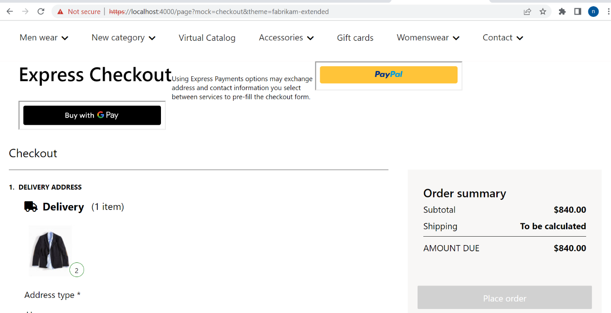
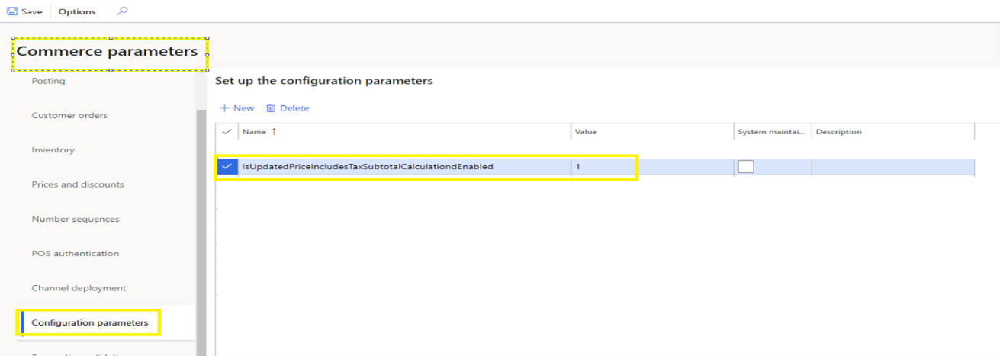
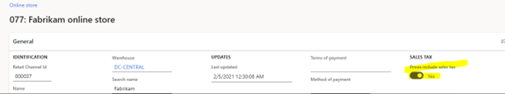

# Dynamics 365 Commerce - online extensibility samples

## License
License is listed in the [LICENSE](./LICENSE) file.

# Sample - Order Summary Tax

## Overview
This sample demonstrates how to show product price including the applicable tax instead of displaying the tax in a separa te line on UX and the applicable shipping amount.Below pages will be affected by this change:
	Checkout Page
	Order Confirmation Page
	Order Details Page



## Starter kit license
License for starter kit is listed in the [LICENSE](./module-library/LICENSE) .

## Prerequisites
Follow the instructions mentioned in [document](https://docs.microsoft.com/en-us/dynamics365/commerce/e-commerce-extensibility/setup-dev-environment) to set up the development environment.

### Procedure to create custom theme
Follow the instructions mentioned in [document](https://docs.microsoft.com/en-us/dynamics365/commerce/e-commerce-extensibility/create-theme) to create the custom theme.

 In this sample we have cloned the fabrikam theme to a new custom theme named fabrikam-extended. Below is the CLI command to create theme.

    yarn msdyn365 add-theme fabrikam-extended

## Detailed Steps

### 1. HQ setting for order summary tax.

  a. Enable the switch in HQ for subtotals - **IsUpdatedPriceIncludesTaxSubtotalCalculationdEnabled**. This will get the correct subtotals on Order summary and order details page.



  b.Enable the switch in HQ for product price - **PriceIncludesSalesTax**.This will get the product price including applicable taxes.



### 2. Extend order details module **order-details.definition.ext.json**" file
Add a resource key-value for 'Other Charges' label on UX. If you are using the fabrikam as a base theme it may already contain a **order-details.definition.ext.json** file in the **src/themes/fabrikam-extended** folder,however if your custom theme does not contain one, you can create a folder **definition-extensions** under **src/themes/fabrikam-extended** then create a new file **order-details.definition.ext.json** under **src/themes/fabrikam-extended/definition-extensions** folder. Replace the file contents with the code below.
 
```json
{
    "$type": "definitionExtension",
    "resources":{
        "otherCharges": {
            "comment": "String associated with other charge line display text",
            "value": "Other charges"
        }
    }
}
```

### 3.Extend order confirmation module **order-confirmation.definition.ext.json**" file

Add a resource key-value for 'Other Charges' label on UX. If you are using the fabrikam as a base theme it may already contain a **order-confirmation.definition.ext.json** file in the **src/themes/fabrikam-extended** folder, however if your custom theme does not contain one, you can create a folder **definition-extensions** under **src/themes/fabrikam-extended** then create a new file **order-confirmation.definition.ext.json** under **src/themes/fabrikam-extended/definition-extensions** folder. Replace the file contents with the code below.

```json
{
    "$type": "definitionExtension",
    "resources":{
        "otherCharges": {
            "comment": "String associated with other charge line display text",
            "value": "Other charges"
        }
    }
}
```

### 4.Extend checkout module view extension

If you are using the fabrikam as a base theme it may already contain a **checkout.view.tsx** file in the **src/themes/fabrikam-extended** folder, however if your custom theme does not contain one, you can create a folder **views** under **src/themes/fabrikam-extended** then create a new file **checkout.view.tsx** under **src/themes/fabrikam-extended/views** folder. 
Replace the file contents with the code below and which contains logic for displaying the product amount including tax amount along with applicable shipping charges in order summary section.

```typescript
/*---------------------------------------------------------------------------------------------
 *  Copyright (c) Microsoft Corporation. All rights reserved.
 *  Licensed under the MIT License. See License.txt in the project root for license information.
 *--------------------------------------------------------------------------------------------*/
import { Module, Node } from "@msdyn365-commerce-modules/utilities";
import { PriceComponent } from "@msdyn365-commerce/components";
import {
  CartLine,
  ChannelDeliveryOptionConfiguration,
  ChargeLine,
} from "@msdyn365-commerce/retail-proxy/dist/Entities/CommerceTypes.g";
import * as React from "react";
import {
  ICheckoutViewProps,
  ILineItem,
  ILineItemDeliveryGroup,
  ILineItems,
  IPickUpAtStore,
} from "@msdyn365-commerce-modules/checkout";
import { IEmailDelivery } from "@msdyn365-commerce-modules/checkout";
import { IInvoicePaymentSummary } from "@msdyn365-commerce-modules/checkout/src/modules/checkout/components/get-invoice-payment-summary";

export const PickUpAtStoreComponent: React.FC<IPickUpAtStore> = ({
  PickUpAtStore,
  label,
  location,
}) => (
  <Node {...PickUpAtStore}>
    {label}
    {location}
  </Node>
);

export const EmailDeliveryComponent: React.FC<IEmailDelivery> = ({
  EmailDelivery,
  label,
}) => <Node {...EmailDelivery}>{label}</Node>;

export const LineItemComponent: React.FC<ILineItem> = ({
  LineItem,
  item,
  pickUpAtStore,
  emailDelivery,
}) => (
  <Node {...LineItem}>
    {item}
    {pickUpAtStore && <PickUpAtStoreComponent {...pickUpAtStore} />}
    {emailDelivery && <EmailDeliveryComponent {...emailDelivery} />}
  </Node>
);

export const LineItemGroupComponent: React.FC<ILineItemDeliveryGroup> = ({
  LineItemDeliveryGroup,
  LineItemList,
  heading,
  lineItems,
}) => (
  <Node {...LineItemDeliveryGroup}>
    {heading}
    <Node {...LineItemList}>
      {lineItems.map((lineItem) => (
        <LineItemComponent key={lineItem.LineId} {...lineItem} />
      ))}
    </Node>
  </Node>
);

export const LineItemGroupComponentWithMultiplePickUp: React.FC<ILineItemDeliveryGroup> = ({
  LineItemDeliveryGroup,
  LineItemList,
  heading,
  lineItems,
  lineItemWraper,
  lineItemWraperIcon,
}) => (
  <Node {...LineItemDeliveryGroup}>
    {lineItemWraperIcon}
    {lineItemWraper}
    {heading}
    <Node {...LineItemList}>
      {lineItems.map((lineItem) => (
        <LineItemComponentWithMultiplePickUp
          key={lineItem.LineId}
          {...lineItem}
        />
      ))}
    </Node>
  </Node>
);

export const LineItemComponentWithMultiplePickUp: React.FC<ILineItem> = ({
  LineItem,
  item,
  pickUpAtStore,
  emailDelivery,
}) => (
  <Node {...LineItem}>
    {item}
    {emailDelivery && <EmailDeliveryComponent {...emailDelivery} />}
  </Node>
);

export const PickUpAtStoreComponentWithMultiplePickUp: React.FC<IPickUpAtStore> = ({
  PickUpAtStore,
  label,
  location,
}) => (
  <Node {...PickUpAtStore}>
    {label}
    {location}
  </Node>
);

export const LineItemsComponent: React.FC<ILineItems> = ({
  LineItems,
  Header,
  heading,
  editLink,
  itemsForPickup,
  itemsForShip,
  itemsForEmail,
  itemsGroupWithMulitplePickupMode,
}) => (
  <Node {...LineItems}>
    <Node {...Header}>
      {heading}
      {editLink}
    </Node>
    {itemsGroupWithMulitplePickupMode === undefined && itemsForPickup && (
      <LineItemGroupComponent {...itemsForPickup} />
    )}
    {itemsGroupWithMulitplePickupMode === undefined && itemsForEmail && (
      <LineItemGroupComponent {...itemsForEmail} />
    )}
    {itemsGroupWithMulitplePickupMode === undefined && itemsForShip && (
      <LineItemGroupComponent {...itemsForShip} />
    )}
    {itemsGroupWithMulitplePickupMode !== undefined
      ? itemsGroupWithMulitplePickupMode.map((item, index) => {
          return (
            <LineItemGroupComponentWithMultiplePickUp {...item} key={index} />
          );
        })
      : null}
  </Node>
);
function _renderSubTotal(props: ICheckoutViewProps): JSX.Element | null {
  const OrderSubTotal =
    props.data.checkout.result?.checkoutCart.cart.SubtotalSalesAmount;
  return (
    <p className={`msc-order-summary__line-sub-total`}>
      {OrderSubTotal && OrderSubTotal > 0 ? (
        <>
          <span className="msc-order-summary__label">
            {props.resources.subTotalLabel}
          </span>
          <PriceComponent
            data={{
              price: { CustomerContextualPrice: OrderSubTotal },
            }}
            freePriceText={undefined}
            context={props.context}
            id={props.id}
            typeName={props.typeName}
            className={"msc-order-summary__value"}
          />
        </>
      ) : null}
    </p>
  );
}
const getDeliveryMode = (
  deliveryMode?: string,
  featureSate: boolean = false,
  channelDeliveryOptionConfig?: ChannelDeliveryOptionConfiguration,
  pickupDeliveryMode?: string
) => {
  if (!featureSate) {
    return pickupDeliveryMode;
  }
  return channelDeliveryOptionConfig?.PickupDeliveryModeCodes?.find(
    (dm: string | undefined) => dm === deliveryMode
  );
};

function _renderShipping(props: ICheckoutViewProps): JSX.Element | null {
  const cartlines =
    props.data.checkout.result?.checkoutCart.cart.CartLines || [];
  const headerChargelines =
    props.data.checkout.result?.checkoutCart.cart.ChargeLines || [];
  let freightFee = 0;
  let isShippingCalculated = false;
  //Calculating shipping from chargelines at header level
  if (headerChargelines && headerChargelines.length > 0) {
    const shippingChargeLines = (headerChargelines || []).filter(
      (chargeLine) => chargeLine.IsShipping
    );
    shippingChargeLines &&
      shippingChargeLines.map((Chargeline: ChargeLine) => {
        const chargeLine = Chargeline.NetAmountWithAllInclusiveTax || 0;
        isShippingCalculated = true;
        freightFee = freightFee + chargeLine;
      });
  } else {
    //Calculating shipping from chargelines at cart line level
    cartlines &&
      cartlines.map((cartline: CartLine) => {
        const shippingChargeLines = (cartline.ChargeLines || []).filter(
          (chargeLine) => chargeLine.IsShipping
        );
        const chargeLines = cartline.ChargeLines || 0;
        if (chargeLines[0]) {
          isShippingCalculated = true;
          freightFee =
            freightFee +
            shippingChargeLines.reduce((chargeTotal, chargeLine) => {
              return (
                chargeTotal + (chargeLine.NetAmountWithAllInclusiveTax || 0)
              );
            }, 0);
        }
      });
  }
  return (
    <p className={`msc-order-summary__line-shipping`}>
      <span className="msc-order-summary__label">
        {props.resources.shippingLabel}
      </span>
      {isShippingCalculated && freightFee ? (
        <PriceComponent
          data={{
            price: { CustomerContextualPrice: freightFee },
          }}
          freePriceText={undefined}
          context={props.context}
          id={props.id}
          typeName={props.typeName}
          className={"msc-order-summary__value"}
        />
      ) : (
        <span className="msc-order-summary__value">
          {props.resources.toBeCalculatedText}
        </span>
      )}
    </p>
  );
}

const OrderSummaryComponent: React.FC<ICheckoutViewProps> = (
  props: ICheckoutViewProps
) => {
  const { heading, lines } = props.orderSummary!;
  const { request } = props.context;
  const { channelDeliveryOptionConfig } = props?.data;
  const cartLines =
    props.data.checkout.result?.checkoutCart.cart.CartLines || [];
  const pickupDeliveryModeCode =
    request && request.channel && request.channel.PickupDeliveryModeCode;
  const emailDeliveryModeCode =
    request && request.channel && request.channel.EmailDeliveryModeCode;
  const multiplePickupStoreSwitchName =
    "Dynamics.AX.Application.RetailMultiplePickupDeliveryModeFeature";
  const retailMultiplePickUpOptionEnabled = props.data.featureState?.result?.find(
    (item) => item.Name === multiplePickupStoreSwitchName
  )?.IsEnabled;
  const deliveryModes = cartLines.map(
    (cartLine: CartLine) => cartLine.DeliveryMode
  );
  const canShip = deliveryModes.some(
    (deliveryMode: string | undefined) =>
      !(
        deliveryMode !== "" &&
        (deliveryMode ===
          getDeliveryMode(
            deliveryMode,
            retailMultiplePickUpOptionEnabled,
            channelDeliveryOptionConfig.result,
            pickupDeliveryModeCode
          ) ||
          deliveryMode === emailDeliveryModeCode)
      )
  );
  return (
    <div className="msc-order-summary-wrapper">
      {heading}
      <div className="msc-order-summary__items">
        {lines && (
          <>
            {_renderSubTotal(props)}
            {canShip ? _renderShipping(props) : lines.shipping}
            {lines.otherCharge}
            {lines.tax}
            {lines.totalDiscounts}
            {lines.loyalty}
            {lines.giftCard}
            {lines.orderTotal}
          </>
        )}
      </div>
    </div>
  );
};

const PaymentSummaryComponent: React.FC<IInvoicePaymentSummary> = ({
  heading,
  lines,
}) => (
  <div className="msc-invoice-summary-wrapper">
    {heading}
    <div className="msc-invoice-summary__items">
      {lines && (
        <>
          {lines.invoices}
          {lines.giftCard}
          {lines.loyalty}
          {lines.orderTotal}
        </>
      )}
    </div>
  </div>
);

const CheckoutView: React.FC<ICheckoutViewProps> = (props) => {
  const {
    canShow,
    checkoutProps,
    headerProps,
    hasSalesOrder,
    hasInvoiceLine,
    bodyProps,
    mainProps,
    mainControlProps,
    sideProps,
    sideControlFirstProps,
    sideControlSecondProps,
    termsAndConditionsProps,
    orderConfirmation,
    loading,
    alert,
    title,
    guidedForm,
    orderSummary,
    invoicePaymentSummary,
    lineItems,
    placeOrderButton,
    termsAndConditions,
    keepShoppingButton,
  } = props;

  return (
    <Module {...checkoutProps}>
      {!hasSalesOrder && <Node {...headerProps}>{title}</Node>}
      {!hasSalesOrder && (
        <Node {...bodyProps}>
          {loading}
          {alert}
          {canShow && (
            <>
              <Node {...mainProps}>
                {guidedForm}
                <Node {...termsAndConditionsProps}>{termsAndConditions}</Node>
                <Node {...mainControlProps}>
                  {placeOrderButton}
                  {keepShoppingButton}
                </Node>
              </Node>
              <Node {...sideProps}>
                {!hasInvoiceLine
                  ? orderSummary && <OrderSummaryComponent {...props} />
                  : invoicePaymentSummary && (
                      <PaymentSummaryComponent {...invoicePaymentSummary} />
                    )}
                <Node {...sideControlFirstProps}>
                  <Node {...termsAndConditionsProps}>{termsAndConditions}</Node>
                  {placeOrderButton}
                  {keepShoppingButton}
                </Node>
                {lineItems && <LineItemsComponent {...lineItems} />}
                <Node {...sideControlSecondProps}>
                  <Node {...termsAndConditionsProps}>{termsAndConditions}</Node>
                  {placeOrderButton}
                  {keepShoppingButton}
                </Node>
              </Node>
            </>
          )}
        </Node>
      )}
      {hasSalesOrder && orderConfirmation}
    </Module>
  );
};

export default CheckoutView;

```

### 5.Extend order confirmation module view extension

If you are using the fabrikam as a base theme it may already contain a **order-confirmation.view.tsx** file in the **src/themes/fabrikam-extended** folder, however if your custom theme does not contain one, you can create a folder **views** under **src/themes/fabrikam-extended** then create a new file **order-confirmation.view.tsx** under **src/themes/fabrikam-extended/views** folder. 
Replace the file contents with the code below and which contains logic for displaying the product amount including tax amount along with applicable shipping charges in order summary section.

```typescript
/*---------------------------------------------------------------------------------------------
 *  Copyright (c) Microsoft Corporation. All rights reserved.
 *  Licensed under the MIT License. See License.txt in the project root for license information.
 *--------------------------------------------------------------------------------------------*/
import { Module, Node } from '@msdyn365-commerce-modules/utilities';
import * as React from 'react';
import {
    IHelp, IOrderConfirmationViewProps, IPaymentMethods, IPriceContext, IGroup, IGroupDelivery,IGroups,
     IOrderInformation, ISalesLine
} from '@msdyn365-commerce-modules/order-management';
import { IOrderConfirmationProps, IOrderConfirmationResources } from '../definition-extensions/order-confirmation.ext.props.autogenerated';
import { PriceComponent } from '@msdyn365-commerce/components';
import { ChannelDeliveryOptionConfiguration, SalesLine } from '@msdyn365-commerce/retail-proxy';

interface ISummaryLineProps {
    priceContext?: IPriceContext;
    name: string;
    label: string;
    value?: number;
}

export const OrderConfirmationOrderInfomation: React.FC<IOrderInformation> = ({
    orderInformationProps,
    receiptEmail,
    createdDate,
    channelReferenceId
}) => (
        <Node {...orderInformationProps}>
            {createdDate}
            {channelReferenceId}
            {receiptEmail}
        </Node>
    );

export const OrderConfirmationSalesLine: React.FC<ISalesLine> = ({ salesLineProps, salesLine, buyAgainButton }) => (
    <Node {...salesLineProps}>
        {salesLine}
    </Node>
);

export const OrderConfirmationGroupDelivery: React.FC<IGroupDelivery> = ({ deliveryProps, heading, count, processing, address, trackingInfo, pickupDateTimeslot }) => (
    <Node {...deliveryProps}>
        {heading}
        {address}
        {pickupDateTimeslot}
    </Node>
);

export const OrderConfirmationGroup: React.FC<IGroup> = ({ groupProps, delivery, salesLinesProps, salesLines }) => (
    <Node {...groupProps}>
        {delivery && <OrderConfirmationGroupDelivery {...delivery} />}
        {delivery && delivery.shippingItemsToYou}
        {salesLines && (
            <Node {...salesLinesProps}>
                {salesLines.map((salesLine:ISalesLine) => (
                    <OrderConfirmationSalesLine key={salesLine.data.salesLine.LineId} {...salesLine} />
                ))}
            </Node>
        )}
    </Node>
);

export const OrderConfirmationGroups: React.FC<IGroups> = ({ groupsProps, groups }) => (
    <Node {...groupsProps}>
        {groups.map((group:IGroup, index:number) => (
            <OrderConfirmationGroup key={index} {...group} />
        ))}
    </Node>
);

function priceContext(props: IOrderConfirmationViewProps): IPriceContext {
    const {
        id,
        typeName,
        context,
        telemetry,
        resources: { freePriceText }
    } = props;
    return {
        id,
        typeName,
        context,
        telemetry,
        freePriceText
    };
}

function shippingAmount(props: IOrderConfirmationViewProps): JSX.Element | null {
    const { request } = props.context;
    const ChargeAmount = props.data.orderHydration.result?.salesOrder.ChargeAmount;
    const ShippingChargeAmount = props.data.orderHydration.result?.salesOrder.ShippingChargeAmount;
    const multiplePickupStoreSwitchName = 'Dynamics.AX.Application.RetailMultiplePickupDeliveryModeFeature';
    const orderDetailsLines = props.data.orderHydration.result?.salesOrder.SalesLines;
    const { channelDeliveryOptionConfig, featureState } = props?.data;
    const retailMultiplePickUpOptionEnabled = featureState?.result?.find(item => item.Name === multiplePickupStoreSwitchName)?.IsEnabled;
    const pickupDeliveryModeCode = request && request.channel && request.channel.PickupDeliveryModeCode;
    const emailDeliveryModeCode = request && request.channel && request.channel.EmailDeliveryModeCode;
    const canShip = orderDetailsLines?.some(orderDetailsLine => ((orderDetailsLine.DeliveryMode && orderDetailsLine.DeliveryMode !== '') ? (orderDetailsLine.DeliveryMode !== getDeliveryMode(orderDetailsLine, retailMultiplePickUpOptionEnabled, channelDeliveryOptionConfig?.result, pickupDeliveryModeCode) && orderDetailsLine.DeliveryMode !== emailDeliveryModeCode) : orderDetailsLine));
    return (
        canShip ? (
            <OrderSummaryLine
                name='shipping' label={props.resources.orderSummaryShippingFeeLabel} value={ShippingChargeAmount === 0 ? ChargeAmount : ShippingChargeAmount}
                priceContext={priceContext(props)} />
        ) : null
    );
}

function renderOtherChargeAmount(props: IOrderConfirmationViewProps & IOrderConfirmationProps<IOrderConfirmationResources>): JSX.Element | null {
    const salesOrder = props.data.orderHydration.result?.salesOrder;
    let totalOtherChargeAmount = 0;
     salesOrder!.SalesLines?.map((salesLine) => {
        const otherCharges = salesLine.ChargeLines?.filter((chargeline) => chargeline.ChargeCode === "OTHER");
        otherCharges && otherCharges.map((otherCharge, key) => {
            totalOtherChargeAmount = totalOtherChargeAmount + otherCharge.CalculatedAmount!;
        });
    });
    return (
        totalOtherChargeAmount ? (
            <OrderSummaryLine
                name='other-charge' label={props.resources.otherCharges} value={totalOtherChargeAmount}
                priceContext={priceContext(props)} />
        ) : null
    );
};

const getDeliveryMode = (salesLine: SalesLine, featureSate: boolean = false, channelDeliveryOptionConfig?: ChannelDeliveryOptionConfiguration, pickupDeliveryMode?: string) => {
    if (!featureSate) {
        return pickupDeliveryMode;
    }
    return channelDeliveryOptionConfig?.PickupDeliveryModeCodes?.find(deliveryMode => deliveryMode === salesLine.DeliveryMode);
};
const OrderSummaryLine: React.SFC<ISummaryLineProps> = ({ name, label, value = 0, priceContext }) => (
    <p className={`ms-order-confirmation__order-summary-line-${name}`}>
        <span className='ms-order-confirmation__order-summary-label'>
            {label}
        </span>
        {priceContext ? (
            <PriceComponent
                {...priceContext}
                className='ms-order-confirmation__order-summary-price'
                data={{ price: { CustomerContextualPrice: value } }}
            />
        ) : (
            <span className='ms-order-confirmation__order-summary-price'>
                {value}
            </span>
        )}
    </p>
);

export const OrderConfirmationOrderSummary: React.FC<IOrderConfirmationViewProps & IOrderConfirmationProps<IOrderConfirmationResources>> = (props: IOrderConfirmationViewProps & IOrderConfirmationProps<IOrderConfirmationResources>) => {
    const { orderSummaryProps, heading, subtotal, tax, totalAmount, earnedPoints } = props.orderSummary!;
    return (
        <Node {...orderSummaryProps}>
            {heading}
            {subtotal}
            {shippingAmount(props)}
            {renderOtherChargeAmount(props)}
            {tax}
            {totalAmount}
            {earnedPoints}
        </Node>
    );
}

export const OrderConfirmationPayment: React.FC<IPaymentMethods> = ({ paymentMethodsProps, title, methods }) => (
    <Node {...paymentMethodsProps}>
        {title}
        {methods}
    </Node>
);

export const OrderConfirmationHelp: React.FC<IHelp> = ({ helpProps, needHelpLabel, helpLineNumberLabel, contactNumber }) => (
    <Node {...helpProps}>
        {needHelpLabel}
        {helpLineNumberLabel}
        {contactNumber}
    </Node>
);

const OrderConfirmationView: React.FC<IOrderConfirmationViewProps & IOrderConfirmationProps<IOrderConfirmationResources>> = props => {
    const {
        moduleProps,
        heading,
        backToShoppingLink,
        alert,
        loading,
        orderInfomation,
        orderSummary,
        payment,
        help,
        groups
    } = props;
    return (
        <Module {...moduleProps}>
            {heading}
            {alert}
            {loading}
            {orderInfomation && <OrderConfirmationOrderInfomation {...orderInfomation} />}
            {backToShoppingLink}
            {groups && <OrderConfirmationGroups {...groups} />}
            {payment && <OrderConfirmationPayment {...payment} />}
            {orderSummary && <OrderConfirmationOrderSummary {...props} />}
            {help && <OrderConfirmationHelp {...help} />}
        </Module>
    );
};

export default OrderConfirmationView;

```

### 6.Extend order details module view extension

If you are using the fabrikam as a base theme it may already contain a **order-details.view.tsx** file in the **src/themes/fabrikam-extended** folder, however if your custom theme does not contain one, you can create a folder **views** under **src/themes/fabrikam-extended** then create a new file **order-details.view.tsx** under **src/themes/fabrikam-extended/views** folder. 
Replace the file contents with the code below and which contains logic for displaying the product amount including tax amount along with applicable shipping charges in order summary section.

```typescript
/*---------------------------------------------------------------------------------------------
 *  Copyright (c) Microsoft Corporation. All rights reserved.
 *  Licensed under the MIT License. See License.txt in the project root for license information.
 *--------------------------------------------------------------------------------------------*/
import { Module, Node } from '@msdyn365-commerce-modules/utilities';
import * as React from 'react';
import {
    IHelp, IPaymentMethods, IPriceContext, IGroup, IGroupDelivery, IGroups, IOrderInformation, ISalesLine,
    IOrderDetailsViewProps
} from '@msdyn365-commerce-modules/order-management';
import { IOrderDetailsProps, IOrderDetailsResources } from '../definition-extensions/order-details.ext.props.autogenerated';
import { PriceComponent } from '@msdyn365-commerce/components';
import { ChannelDeliveryOptionConfiguration, SalesLine } from '@msdyn365-commerce/retail-proxy';

interface ISummaryLineProps {
    priceContext?: IPriceContext;
    name: string;
    label: string;
    value?: number;
}

export const OrderDetailsOrderInfomation: React.FC<IOrderInformation> = ({
    orderInformationProps,
    salesId,
    receiptId,
    createdDate,
    count,
    amount,
    channelReferenceId,
    channelName,
    channelAddress
}) => (
        <Node {...orderInformationProps}>
            {channelName}
            {channelAddress}
            {channelReferenceId}
            {salesId}
            {receiptId}
            {createdDate}
            {count}
            {amount}
        </Node>
    );

export const OrderDetailsSalesLine: React.FC<ISalesLine> = ({ salesLineProps, salesLine, buyAgainButton }) => (
    <Node {...salesLineProps}>
        {salesLine}
        {buyAgainButton}
    </Node>
);

export const OrderDetailsGroupDelivery: React.FC<IGroupDelivery> = ({ deliveryProps, heading, count, trackingInfo, shippedStatusCheck }) => (
    <Node {...deliveryProps}>
        {heading}
        {count}
        {shippedStatusCheck === 'processing' ? trackingInfo : null}
    </Node>
);

export const OrderDetailsGroup: React.FC<IGroup> = ({ groupProps, delivery, address, salesLinesProps, salesLines, isCashAndCarryTransaction }) => (
    <Node {...groupProps}>
        {delivery && <OrderDetailsGroupDelivery {...delivery} />}
        {salesLines && (
            <Node {...salesLinesProps}>
                {salesLines.map(salesLine => (
                    <React.Fragment key={salesLine.data.salesLine.LineId}>
                        {salesLine.data.deliveryType === 'ship' && salesLine.data.shipment ? salesLine.trackingInfo : null}
                        <OrderDetailsSalesLine {...salesLine} />
                        {!isCashAndCarryTransaction && salesLine.salesStatus}
                    </React.Fragment>
                ))}
            </Node>
        )}
        {!delivery.showTimeslot && address}
        {delivery.showTimeslot && (
            <Node {...delivery.pickupProps}>
                {address}
                {delivery.pickupDateTimeslot}
            </Node>
        )}
    </Node>
);

export const OrderDetailsGroups: React.FC<IGroups> = ({ groupsProps, groups }) => (
    <Node {...groupsProps}>
        {groups.map((group:IGroup, index:number) => (
            <OrderDetailsGroup key={index} {...group} />
        ))}
    </Node>
);

function priceContext(props: IOrderDetailsViewProps): IPriceContext {
    const {
        id,
        typeName,
        context,
        telemetry,
        resources: { freePriceText }
    } = props;
    return {
        id,
        typeName,
        context,
        telemetry,
        freePriceText
    };
}
function shippingAmount(props: IOrderDetailsViewProps): JSX.Element | null {
    const { request } = props.context;
//shippingChargeCode represents the code for shipping charge configured in HQ
    const shippingChargeCode="FREIGHT"
    const ChargeAmount =
      props.data.orderHydration.result?.salesOrder.ChargeAmount;
    const salesOrderSalesLines =
      props.data.orderHydration.result?.salesOrder?.SalesLines || [];
    const salesOrderChargeLines =
      props.data.orderHydration.result?.salesOrder?.ChargeLines || [];
    let ShippingChargeAmount = 0;
    if (salesOrderChargeLines.length > 0) {
      salesOrderChargeLines.map((ChargeLine) => {
        const chargeLines = ChargeLine.CalculatedAmount || 0;
        ShippingChargeAmount = ShippingChargeAmount + chargeLines;
      });
    } else if (salesOrderSalesLines && salesOrderSalesLines.length > 0) {
      salesOrderSalesLines.map((salesLine) => {
        const shippingChargeLines = (salesLine.ChargeLines || []).filter(
          (chargeLine) => chargeLine.ChargeCode === shippingChargeCode
        );
        const calculatedAmount = shippingChargeLines[0]?.CalculatedAmount || 0;
        const valueAmount = shippingChargeLines[0]?.Value || 0;
        if (calculatedAmount || valueAmount) {
          ShippingChargeAmount = calculatedAmount
            ? ShippingChargeAmount + calculatedAmount
            : ShippingChargeAmount + valueAmount;
        }
      });
    }
    const multiplePickupStoreSwitchName =
      "Dynamics.AX.Application.RetailMultiplePickupDeliveryModeFeature";
    const orderDetailsLines =
      props.data.orderHydration.result?.salesOrder.SalesLines;
    const { channelDeliveryOptionConfig, featureState } = props?.data;
    const retailMultiplePickUpOptionEnabled = featureState?.result?.find(
      (item) => item.Name === multiplePickupStoreSwitchName
    )?.IsEnabled;
    const pickupDeliveryModeCode =
      request && request.channel && request.channel.PickupDeliveryModeCode;
    const emailDeliveryModeCode =
      request && request.channel && request.channel.EmailDeliveryModeCode;
    const canShip = orderDetailsLines?.some((orderDetailsLine) =>
      orderDetailsLine.DeliveryMode && orderDetailsLine.DeliveryMode !== ""
        ? orderDetailsLine.DeliveryMode !==
            getDeliveryMode(
              orderDetailsLine,
              retailMultiplePickUpOptionEnabled,
              channelDeliveryOptionConfig?.result,
              pickupDeliveryModeCode
            ) && orderDetailsLine.DeliveryMode !== emailDeliveryModeCode
        : orderDetailsLine
    );
    return canShip ? (
      <OrderSummaryLine
        name="shipping"
        label={props.resources.orderSummaryShippingFeeLabel}
        value={ShippingChargeAmount === 0 ? ChargeAmount : ShippingChargeAmount}
        priceContext={priceContext(props)}
      />
    ) : null;
}

function renderOtherChargeAmount(props: IOrderDetailsViewProps & IOrderDetailsProps<IOrderDetailsResources>): JSX.Element | null {
    const salesOrder = props.data.orderHydration.result?.salesOrder;
    let totalOtherChargeAmount = 0;
     salesOrder!.SalesLines?.map((salesLine) => {
        const otherCharges = salesLine.ChargeLines?.filter((chargeline) => chargeline.ChargeCode === "OTHER");
        otherCharges && otherCharges.map((otherCharge, key) => {
            totalOtherChargeAmount = totalOtherChargeAmount + otherCharge.CalculatedAmount!;
        });
    });
    return (
        totalOtherChargeAmount ? (
            <OrderSummaryLine
                name='other-charge' label={props.resources.otherCharges} value={totalOtherChargeAmount}
                priceContext={priceContext(props)} />
        ) : null
    );
};

const getDeliveryMode = (salesLine: SalesLine, featureSate: boolean = false, channelDeliveryOptionConfig?: ChannelDeliveryOptionConfiguration, pickupDeliveryMode?: string) => {
    if (!featureSate) {
        return pickupDeliveryMode;
    }
    return channelDeliveryOptionConfig?.PickupDeliveryModeCodes?.find(deliveryMode => deliveryMode === salesLine.DeliveryMode);
};

const OrderSummaryLine: React.SFC<ISummaryLineProps> = ({ name, label, value = 0, priceContext }) => (
    <p className={`ms-order-details__order-summary-line-${name}`}>
        <span className='ms-order-details__order-summary-label'>
            {label}
        </span>
        {priceContext ? (
            <PriceComponent
                {...priceContext}
                className='ms-order-details__order-summary-price'
                data={{ price: { CustomerContextualPrice: value } }}
            />
        ) : (
            <span className='ms-order-details__order-summary-price'>
                {value}
            </span>
        )}
    </p>
);

export const OrderDetailsOrderSummary: React.FC<IOrderDetailsViewProps & IOrderDetailsProps<IOrderDetailsResources>> = (props: IOrderDetailsViewProps & IOrderDetailsProps<IOrderDetailsResources>) => {
    const { orderSummaryProps, heading, subtotal, tax, totalAmount, earnedPoints } = props.orderSummary!;
    return (
        <Node {...orderSummaryProps}>
            {heading}
            {subtotal}
            {shippingAmount(props)}
            {renderOtherChargeAmount(props)}
            {tax}
            {totalAmount}
            {earnedPoints}
        </Node>
    );
}

export const OrderDetailsPayment: React.FC<IPaymentMethods> = ({ paymentMethodsProps, title, methods }) => (
    <Node {...paymentMethodsProps}>
        {title}
        {methods}
    </Node>
);

export const OrderDetailsHelp: React.FC<IHelp> = ({ helpProps, needHelpLabel, helpLineNumberLabel, contactNumber }) => (
    <Node {...helpProps}>
        {needHelpLabel}
        {helpLineNumberLabel}
        {contactNumber}
    </Node>
);

const OrderDetailsView: React.FC<IOrderDetailsViewProps & IOrderDetailsProps<IOrderDetailsResources>> = props => 
{
   const {
    moduleProps,
    heading,
    alert,
    loading,
    orderInfomation,
    orderSummary,
    payment,
    help,
    groups
   } = props;
    return (
        <Module {...moduleProps}>
            {heading}
            {alert}
            {loading}
            {orderInfomation && <OrderDetailsOrderInfomation {...orderInfomation} />}
            {groups && <OrderDetailsGroups {...groups} />}
            {orderSummary && <OrderDetailsOrderSummary {...props} />}
            {payment && <OrderDetailsPayment {...payment} />}
            {help && <OrderDetailsHelp {...help} />}
        </Module>
    );
};

export default OrderDetailsView;

```

### 7. Modify order-confirmation style.

Open order-confirmation.scss file under **src/themes/fabrikam-extended/styles/04-modules** and replace code with below code.
```scss
$msv-details-heading-margin-bottom: 20px;
$msv-details-heading-margin-top: 20px;
$msv-details-text-margin-right: 5px;
$msv-details-container-max-width: 794px;
$msv-details-order-information-half-width: 50%;
$msv-details-order-information-padding-bottom: 20px;
$msv-details-order-information-qr-code-margin-top: 20px;
$msv-details-order-information-qr-code-margin-bottom: 20px;
$msv-details-order-information-qr-code-block-width: 280px;
$msv-details-order-information-qr-code-block-height: 120px;
$msv-details-order-information-qr-code-block-bg-color: $msv-white;
$msv-details-order-information-spacing: 8px;
$msv-details-order-information-sales-id-margin-bottom: 10px;
$msv-details-keep-shopping-btn-margin-bottom: 20px;
$msv-details-group-border: 1px solid $msv-black;
$msv-details-group-padding: 20px 0;
$msv-details-group-pickup-border: 1px solid $msv-gray-300;
$msv-details-group-delivery-items-text-color: $msv-gray-500;
$msv-details-group-delivery-padding-top: 20px;
$msv-details-group-delivery-width: 340px;
$msv-details-sale-lines-padding: 12px 0 0 0;
$msv-details-sale-line-width: 100px;
$msv-details-sale-line-price-left: 210px;
$msv-details-sale-line-spacing: 20px;
$msv-details-sale-line-margin: 0 12px 20px 0;
$msv-details-sale-line-item-width: 770px;
$msv-details-sale-line-buy-again-btn-margin-top: 20px;
$msv-details-sale-line-buy-again-btn-width: 140px;
$msv-order-empty-image-width: 81px;
$msv-details-order-summary-price-padding: 5px;
$msv-details-order-summary-spacing: 10px;
$msv-details-order-summary-heading-margin-bottom: 12px;
$msv-details-order-summary-line-spacing: 8px;
$msv-details-button-margin-top: 12px;
$msv-details-help-margin-top: 20px;
$msv-details-help-heading-margin-bottom: 4px;
$msv-details-payment-methods-margin: 20px 20px 20px 0;
$msv-details-payment-methods-margin-right: 20px;
$msv-details-payment-methods-heading-margin-bottom: 12px;
$msv-details-payment-methods-line-space: 8px;
$msv-details-payment-method-padding-m: 20px 0 10px 0;
$msv-details-default-padding: 20px 0;
$msv-details-loyalty-padding-right: 10px;
$msv-details-loyalty-margin-top: 20px;
$msv-details-loyalty-points-margin-left: 5px;
$msv-details-shipping-items-label-padding-top: 30px;
$msv-details-shipping-items-label-padding-top-mobile: 20px;
$msv-order-details-alert-margin-top: 20px;
$msv-order-details-alert-margin-bottom: 20px;
$msv-details-footer-block-width: 337px;
$msv-details-order-summary-spacing: 20px;
$msv-details-address-spacing: 20px;
$msv-main-container-margin:0 auto;
$msv-font-weight-600: 600;
$msv-font-weight-355: 355;

.ms-order-confirmation {
    width: 100%;
    margin: auto;
    max-width: $msv-details-container-max-width;
    position: relative;

    &__heading {
        @include font-content-xl(var(--msv-font-weight-heavy));
        color: var(--msv-font-primary-color);
        margin-bottom: $msv-details-heading-margin-bottom;
        margin-top: $msv-details-heading-margin-top;
    }

    &__order-information {
        padding-bottom: $msv-details-order-information-padding-bottom;

        &-qr-code {
            align-items: center;
            background-color: $msv-details-order-information-qr-code-block-bg-color;
            display: flex;
            height: $msv-details-order-information-qr-code-block-height;
            justify-content: center;
            margin-top: $msv-details-order-information-qr-code-margin-top;
            margin-bottom: $msv-details-order-information-qr-code-margin-bottom;
            width: $msv-details-order-information-qr-code-block-width;

            .qrcode-screenreader-text {
                clip: rect(1px, 1px, 1px, 1px);
                clip-path: inset(50%);
                height: 1px;
                margin: -1px;
                overflow: hidden;
                padding: 0;
                position: absolute;
                width: 1px;
            }

            @media only screen and (max-width: $msv-breakpoint-m) {
                width: 100%;
            }
        }

        &-channel-reference-id,
        &-sales-id,
        &-receipt-id,
        &-receipt-email {
            @include font-content-m();
            display: block;
            margin-bottom: $msv-details-order-information-sales-id-margin-bottom;

            span {
                font-weight: $msv-font-weight-600;
            }
        }

        &-created-date {
            @include font-content-m();
            position: absolute;
            top: 8px;
            right: 0;
        }

        @media screen and (max-width: $msv-breakpoint-m) {
            &-created-date {
                position: relative;
                top: 0;
                display: block;
                margin-bottom: $msv-details-order-information-sales-id-margin-bottom;
            }
        }

        &-count {
            border-right: 1px solid $msv-black;
            padding-left: $msv-details-order-information-spacing;
            padding-right: $msv-details-order-information-spacing;
        }

        &-amount {
            padding-left: $msv-details-order-information-spacing;
        }
    }

    &__btn-keep-shopping {
        margin-bottom: $msv-details-keep-shopping-btn-margin-bottom;

        @include primary-button();
    }

    &__sales-lines {
        display: flex;
        flex-wrap: wrap;
        padding: $msv-details-sale-lines-padding;

        &-shipping-items-label, &-picking-items-label, &-emailing-items-label {
            display: block;
            font-weight: $msv-font-weight-600;
        }

        &:first-child {
            border-top: none;
        }
    }

    &__groups {
        @include font-content-m();
        border-bottom: 1px solid $msv-gray-900;
        border-top: 1px solid $msv-gray-900;
        display: flex;
        flex-wrap: wrap;
    }

    &__group {
        &-deliveryType-pickUp, &-deliveryType-ship, &-deliveryType-email {
            flex: 0 0 $msv-details-order-information-half-width;
            display: flex;
            flex-direction: column;
        }

        &-delivery {
            padding-right: $msv-details-sale-line-spacing;
            padding-top: $msv-details-group-delivery-padding-top;

            &-heading {
                @include font-content-m(var(--msv-font-weight-heavy));
                margin-right: $msv-details-text-margin-right;
            }

            &-total-items {
                @include font-content-xl();
                color: $msv-details-group-delivery-items-text-color;
                margin-right: $msv-details-text-margin-right;
            }

            &-processing-label {
                display: block;
            }
        }
    }

    &__tracking-link {
        text-decoration: underline;
    }

    &__sales-line {
        margin: $msv-details-sale-line-margin;

        .msc-cart-line {
            display: block;
            width: $msv-details-sale-line-width;

            &__product {
                display: none;
            }

            &__product-image {
                margin: 0;
            }

            &__product-title {
                font-size: $msv-text-size;
                line-height: $msv-text-line-height;
            }

            &__quantity {
                .quantity-label {
                    font-size: $msv-font-size-s;
                    line-height: $msv-text-line-height;
                }

                .quantity-value {
                    color: $msv-gray-500;
                    display: inline;
                    font-size: $msv-font-size-s;
                    margin-left: $msv-details-text-margin-right;
                }
            }

            &__product-price, &__product-savings {
                display: none;
            }

            &__quantity.single-quantity {
                visibility: hidden;
            }

            &-item-product-discount {
                display: none;
                color: var(--msv-success-color);
            }

            .msc-cart-line__is-gift-wrap {
                padding-top: 5px;
            }

            .msc-cart-line__is-gift-wrap-value {
                padding-left: 5px;
            }

            .msc-cart-line__add-gift-wrap {
                display: none;
            }
    
            .msc-cart-line__gift-wrap-value {
                display: block;
            }
        }

        &-btn-buy-it-again {
            margin-top: $msv-details-sale-line-buy-again-btn-margin-top;
            width: $msv-details-sale-line-buy-again-btn-width;

            @include secondary-button();
        }
    }

    &__order-summary {
        @include font-content-m();
        float: right;
        padding: $msv-details-default-padding;
        width: 50%;

        &::after {
            clear: both;
        }

        &-heading {
            display: none;
        }

        &-line-subtotal,
        &-line-shipping,
        &-line-tax-amount {
            margin-bottom: $msv-details-order-summary-line-spacing;
            width: 100%;
            display: none;
        }

        &-line-total-amount {
            border-top: 1px dashed $msv-gray-900;
            margin-bottom: $msv-details-order-summary-line-spacing;
            padding-top: $msv-details-order-summary-line-spacing;
            width: 100%;

            .ms-order-details__order-summary-label {
                font-weight: var(--msv-font-weight-bold);
            }
        }

        &-line-earned-points {
            .ms-order-details__order-summary-label {
                font-weight: var(--msv-font-weight-bold);
            }
        }

        &-price {
            float: right;
        }
    }

    &__help {
        @include font-content-m();
        padding: $msv-details-default-padding;

        &-title {
            @include font-content-m(var(--msv-font-weight-heavy));
            margin-bottom: $msv-details-help-heading-margin-bottom;
        }

        &-content-number {
            @include vfi();
        }
    }

    &__payment-methods {
        @include font-content-m();
        padding: $msv-details-default-padding;
        width: 50%;
        float: left;

        &-title {
            @include font-content-m(var(--msv-font-weight-heavy));
            margin-bottom: $msv-details-payment-methods-heading-margin-bottom;
        }

        &-line {
            margin-bottom: $msv-details-payment-methods-line-space;
        }

        &-card-amount,
        &-loyalty-amount,
        &-gift-card-amount {
            margin-left: 4px;
        }
    }

    &__address {
        font-weight: $msv-font-weight-355;
        margin-bottom: 6px;
        margin-top: 6px;

        &-header {
            display: none;
        }

        &-city,
        &-threeletterisoregionname {
            &::before {
                content: "\A";
                white-space: pre;
            }
        }

        &-county {
            display: none;
        }

        &-name,
        &-phone {
            display: block;
        }
    }

    &__pickup-date-timeslot {
        padding-top: 30px;
        margin-bottom: 6px;

        &-title {
            font-weight: $msv-font-weight-600;
            padding-bottom: 8px;
        }

        &-content {
            font-weight: $msv-font-weight-355;
        }
    }

    &__alert {
        display: block;
        margin-bottom: $msv-order-details-alert-margin-bottom;
        margin-top: $msv-order-details-alert-margin-top;
    }

    @media screen and (min-width: $msv-container-min-width-m) {
        margin: $msv-main-container-margin;

        &__sales-lines {
            &-shipping-items-label, &-picking-items-label {
                padding-top: $msv-details-shipping-items-label-padding-top;
            }

            &-emailing-items-label {
                margin-top: auto;
            }
        }

        &__address {
            &-phone {
                position: absolute;
            }
        }

        &__groups {
            & > div:nth-child(2n) + div::before {
                content: "";
                display: block;
                width: 200%;
                border-top: 1px solid $msv-gray-900;
            }
        }

        &__payment-methods {
            padding: $msv-details-payment-method-padding-m;
        }
    }

    @media screen and (max-width: $msv-breakpoint-m) {
        &__groups {
            display: block;

            & > div {
                border-top: 1px solid $msv-gray-900;
            }

            & > div:first-of-type {
                border: none;
            }

            &_delivery {
                padding-right: 0;
            }
        }

        &__sales-lines {
            width: 100%;

            &-shipping-items-label, &-picking-items-label {
                padding-top: $msv-details-shipping-items-label-padding-top-mobile;
            }
        }

        &__order-summary, &__payment-methods, &__help {
            float: none;
            padding-right: 0;
            width: 100%;
            position: relative;
            margin-left: 0;
        }

        &__help, &__order-summary {
            border-top: 1px solid $msv-gray-900;
        }

        &__order-summary {
            &-heading,
            &-line-subtotal,
            &-line-shipping,
            &-line-tax-amount{
                display: none;
            }
            &-line-total-amount {
                max-width: 100%;
            }
        }

        &__btn-keep-shopping,
        &__sales-line-btn-buy-it-again {
            width: 100%;
        }

        .msc-cart-line__product-price {
            position: unset;
        }
    }

    @include image($msv-order-empty-image-width);

    .msc-empty_image {
        background-size: 100%;
    }
}

```

### 7. Modify order-confirmation style.

Open order-details.scss file under **src/themes/fabrikam-extended/styles/04-modules** and replace code with below code.

```scss
$msv-details-text-margin-right: 5px;
$msv-details-order-information-padding-bottom: 8px;
$msv-details-order-information-padding-top: 32px;
$msv-details-order-information-spacing: 8px;
$msv-details-order-information-qr-code-margin-top: 20px;
$msv-details-order-information-qr-code-margin-bottom: 20px;
$msv-details-order-information-qr-code-block-width: 280px;
$msv-details-order-information-qr-code-block-height: 120px;
$msv-details-order-information-channel-name-margin-bottom: 12px;
$msv-details-order-information-channel-address-margin-bottom: 12px;
$msv-details-keep-shopping-btn-margin-bottom: 20px;
$msv-details-group-padding-top: 20px;
$msv-details-group-delivery-width: 340px;
$msv-details-group-delivery-padding-bottom: 28px;
$msv-details-sales-status-top-desktop: -144px;
$msv-details-sales-status-top-mobile: -174px;
$msv-details-sales-lines-width: 770px;
$msv-details-sales-lines-margin-right: 120px;
$msv-details-sale-line-spacing: 20px;
$msv-details-sale-line-padding: 20px 0;
$msv-details-sale-line-image-size: 147px;
$msv-details-sale-line-image-size-mobile: 80px;
$msv-details-sale-line-item-width: 770px;
$msv-details-sale-line-buy-again-btn-margin-top: 20px;
$msv-details-sale-line-buy-again-btn-width: 200px;
$msv-details-sale-line-buy-again-btn-left: 165px;
$msv-details-sale-line-buy-again-btn-left-padding: 53px;
$msv-details-sale-line-buy-again-btn-bottom: 0;
$msv-details-sale-line-buy-again-btn-padding-left: 33px;
$msv-details-sale-line-buy-again-btn-padding-right: 33px;
$msv-details-order-summary-line-earned-points-padding-top: 20px;
$msv-details-order-summary-payment-menthods-help-margin-top-mobile: 20px;
$msv-order-empty-image-width: 147px;
$msv-order-empty-image-width-mobile: 80px;
$msv-details-sales-line-padding-bottom-mobile: 40px;
$msv-details-sales-line-btn-buy-it-again-margin-left-mobile: 100px;
$msv-details-order-summary-price-padding: 5px;
$msv-details-order-summary-font-weight: 600;
$msv-details-order-summary-line-spacing: 20px;
$msv-details-order-summary-line-total-amount-margin-top: 20px;
$msv-details-order-summary-line-total-amount-margin-bottom: 20px;
$msv-details-order-summary-line-earned-points-padding-top: 20px;
$msv-details-button-margin-top: 12px;
$msv-details-help-margin-bottom: 28px;
$msv-details-help-heading-margin-bottom: 8px;
$msv-details-help-heading-margin-top: 20px;
$msv-details-payment-methods-margin-right: 20px;
$msv-details-payment-methods-heading-margin-bottom: 8px;
$msv-details-payment-methods-line-margin-bottom: 20px;
$msv-details-loyalty-padding-right: 10px;
$msv-details-loyalty-margin-top: 20px;
$msv-details-loyalty-points-margin-left: 5px;
$msv-order-details-alert-margin-top: 20px;
$msv-order-details-alert-margin-bottom: 20px;
$msv-details-footer-block-width: 768px;
$msv-details-footer-block-margin-right: 120px;
$msv-details-footer-block-padding-bottom: 20px;
$msv-details-help-width: 100%;
$msv-details-address-spacing: 20px;
$msv-msc-cart-line-width: 100%;
$msv-smaller-port-m: 320px;
$msv-order-details-order-summary-container-padding: 20px;
$msv-details-address-padding-m: 20px 0;
$msv-details-address-padding: 43px 0 20px 0;
$msv-details-address-icon-padding-right: 5px;
$msv-details-tracking-info-padding-top: 15px;
$msv-text-max-width:80%;
$msv-order-details-group-heading-icon-padding-right:10px;
$msv-order-details-group-multiple-heading-padding-bottom:0;
$msv-details-heading-margin-top:20px;
$msv-order-details-sales-line-checkbox-padding-top:64px;
$msv-order-details-sales-line-checkbox-padding-top-mobile:30px;
//style presets
:root {
    --msv-order-details-border: #{$msv-gray-300};

    // heading
    --msv-order-details-heading-font-color: var(--msv-font-primary-color);
    --msv-order-details-heading-font-size: var(--msv-body-font-size-xl);

    // title
    --msv-order-details-title-font-color: var(--msv-font-primary-color);
    --msv-order-details-title-font-size: var(--msv-body-font-size-l);

    // text
    --msv-order-details-text-font-size: var(--msv-body-font-size-m);
    --msv-order-details-text-font-color: var(--msv-font-primary-color);

    // secondary button
    --msv-order-details-secondary-btn-bg: var(--msv-secondary-button-background-color);
    --msv-order-details-secondary-btn-font-color: var(--msv-font-primary-color);
    --msv-order-details-secondary-btn-border: var(--msv-accent-brand-color);

    // link
    --msv-order-buy-again-link-color: var(--msv-font-primary-color);

    // QR code background
    --msv-order-details-qr-code-bg-color: #{$msv-white};

    // view mode
    --msv-order-details-view-mode-selected-btn-background: var(--msv-selected-button-background);
    --msv-order-details-view-mode-selected-hovered-btn-background: var(--msv-selected-hovered-button-background);
}

.ms-order-details {
    &__heading {
        @include font-content(
            $font-weight: var(--msv-font-weight-normal),
            $font-size: var(--msv-order-details-heading-font-size),
            $line-height: $msv-line-height-xl
        );
        color: var(--msv-order-details-heading-font-color);
        margin-top: $msv-details-heading-margin-top;
    }

    &__order-information {
        padding-bottom: $msv-details-order-information-padding-bottom;
        padding-top: $msv-details-order-information-padding-top;

        @include font-content(var(--msv-font-weight-normal), var(--msv-order-details-text-font-size), $msv-line-height-m);
        color: var(--msv-order-details-text-font-color);

        &-channel-name {
            color: var(--msv-order-details-title-font-color);
            display: block;
            font-size: $msv-heading-text-size;
            font-weight: var(--msv-font-weight-heavy);
            line-height: $msv-heading-line-height;
            margin-bottom: $msv-details-order-information-channel-name-margin-bottom;
        }

        &-channel-address {
            display: block;
            font-size: $msv-heading-text-size;
            font-weight: var(--msv-font-weight-heavy);
            line-height: $msv-heading-line-height;
            margin-bottom: $msv-details-order-information-channel-address-margin-bottom;
            margin-top: -$msv-details-order-information-channel-name-margin-bottom;
        }

        &-qr-code {
            align-items: center;
            background-color: var(--msv-order-details-qr-code-bg-color);
            display: flex;
            height: $msv-details-order-information-qr-code-block-height;
            justify-content: center;
            margin-top: $msv-details-order-information-qr-code-margin-top;
            margin-bottom: $msv-details-order-information-qr-code-margin-bottom;
            width: $msv-details-order-information-qr-code-block-width;

            .qrcode-screenreader-text {
                clip: rect(1px, 1px, 1px, 1px);
                clip-path: inset(50%);
                height: 1px;
                margin: -1px;
                overflow: hidden;
                padding: 0;
                position: absolute;
                width: 1px;
            }

            @media only screen and (max-width: $msv-breakpoint-m) {
                width: 100%;
            }
        }

        &-channel-reference-id,
        &-sales-id,
        &-receipt-id,
        &-receipt-email {
            display: block;
        }

        &-created-date {
            padding-right: $msv-details-order-information-spacing;
            border-right: 1px solid $msv-gray-900;
        }

        &-count {
            display: inline-block;
            padding-left: $msv-details-order-information-spacing;
            padding-right: $msv-details-order-information-spacing;
            border-right: 1px solid $msv-gray-900;
        }

        &-amount {
            padding-left: $msv-details-order-information-spacing;
        }

        @media screen and (max-width: $msv-smaller-port-m) {
            &-amount {
                padding-left: 0;
            }
        }
    }

    &__btn-keep-shopping {
        margin-bottom: $msv-details-keep-shopping-btn-margin-bottom;

        @include secondary-button(var(--msv-order-details-secondary-btn-bg),
        var(--msv-order-details-secondary-btn-font-color), var(--msv-order-details-secondary-btn-border));
    }

    &__sales-lines {
        flex: 3;

        &:first-child {
            border-top: none;
        }

        .ms-order-details__tracking-info {
            &:not(:first-child) {
                padding-top: $msv-details-tracking-info-padding-top;
            }
        }
    }

    &__sales-status {
        color: var(--msv-success-color);
        float: right;
        position: relative;
        top: $msv-details-sales-status-top-desktop;
    }

    &__groups {
        @include font-content(var(--msv-font-weight-normal), var(--msv-order-details-text-font-size), $msv-line-height-m);
        border-bottom: 1px solid var(--msv-order-details-border);

        margin-top: 50px;
    }

    &__group {
        flex-wrap: wrap;
        padding-top: $msv-details-group-padding-top;

        &-delivery {
            padding-bottom: $msv-details-group-delivery-padding-bottom;
            padding-right: $msv-details-sale-line-spacing;

            &-heading {
                @include font-content(var(--msv-font-weight-bold), var(--msv-order-details-heading-font-size), $msv-line-height-xl);
                color: var(--msv-order-details-heading-font-color);
                margin-right: $msv-details-text-margin-right;

                .ms-order-details__sales-status {
                    color: var(--msv-order-details-heading-font-color);
                    float: left;
                    top: 0;
                }

                .pickUp-icon {
                    @include add-icon($msv-cube, before);
                    @include font-content(var(--msv-font-weight-bold), var(--msv-order-details-title-font-size), $msv-line-height-l);

                    &::before {
                        padding-right: $msv-order-details-group-heading-icon-padding-right;
                    }
                }

                .ship-icon {
                    @include add-icon($msv-DeliveryTruck, before);
                    @include font-content(var(--msv-font-weight-bold), var(--msv-order-details-title-font-size), $msv-line-height-l);

                    &::before {
                        padding-right: $msv-order-details-group-heading-icon-padding-right;
                    }
                }

                .email-icon {
                    @include add-icon($msv-DeliveryTruck, before);
                    @include font-content(var(--msv-font-weight-bold), var(--msv-order-details-title-font-size), $msv-line-height-l);

                    &::before {
                        padding-right: $msv-order-details-group-heading-icon-padding-right;
                    }
                }
            }

            &-total-items {
                @include font-content(var(--msv-font-weight-normal), var(--msv-order-details-text-font-size), $msv-line-height-m);
                color: var(--msv-order-details-heading-font-color);
                margin-right: $msv-details-text-margin-right;
            }
        }

        &:first-child {
            border-top: none;

            .ms-order-details__sales-lines {
                border-top: none;
            }
        }
    }

    .multiple-pickUp {
        padding-bottom: $msv-order-details-group-multiple-heading-padding-bottom;
    }

    &__tracking-link {
        text-decoration: underline;
    }

    /* stylelint-disable-next-line no-descending-specificity -- Auto-suppressed. Please fix if possible. */
    &__tracking-info {
        color: var(--msv-order-details-text-font-color);
        display: block;
    }

    &__sales-line {
        padding: $msv-details-sale-line-padding;

        &__unavailable-product {
            opacity: 0.5;
        }

        .msc-cart-line {
            width: $msv-msc-cart-line-width;

            &__product {
                flex: none;

                &-variant {
                    &-size, &-color, &-style, &-config {
                        .name {
                            color: var(--msv-order-details-text-font-color);
                        }
                    }
                }

               .msc-cart-line__add-gift-wrap {
                    display: none;
               }

               .msc-cart-line__gift-wrap-value {
                    display: block;
               }

               .msc-cart-line__is-gift-wrap {
                    padding-top: 5px;
               }

               .msc-cart-line__is-gift-wrap-value {
                    padding-left: 5px;
               }
            }

            &__other-charges-label,
            &__freight-label,
            .shipping-value,
            .other-charge-value {
                color: var(--msv-order-details-text-font-color);
            }

            &__product-image img {
                max-width: $msv-details-sale-line-image-size;
                width: $msv-details-sale-line-image-size;
                height: $msv-details-sale-line-image-size;
            }

            &__content {
                display: flex;
                flex: auto;
                flex-direction: column;
                position: relative;
            }

            &__product-title {
                @include font-content(var(--msv-font-weight-bold), var(--msv-order-details-title-font-size), $msv-line-height-l);
                color: var(--msv-order-details-title-font-color);
                max-width: $msv-text-max-width;
            }

            &__product-variants {
                color: var(--msv-order-details-text-font-color);
                font-size: var(--msv-order-details-text-font-size);
            }

            &__quantity {
                color: var(--msv-order-details-text-font-color);
                font-size: var(--msv-order-details-text-font-size);
                margin-left: 0;
                left: 0;
                bottom: 0;

                .quantity-label {
                    line-height: $msv-text-line-height;
                }

                .quantity-value {
                    margin-left: $msv-details-text-margin-right;
                    display: inline;
                }
            }
            // hide extra price component
            &__product-savings {
                display: none;
            }

            &__product-price {
                position: absolute;
                right: 0;
                top: 0;
                display: inline;

                .discount-value .msc-price__strikethrough {
                    display: none;
                }

                .msc-price__actual {
                    color: var(--msv-order-details-text-font-color);

                    @include font-content(var(--msv-font-weight-bold), var(--msv-order-details-title-font-size), $msv-line-height-l);
                }
            }

            &-item-product-discount {
                display: none;
            }
        }

        &-btn-buy-it-again {
            display: initial;
            left: $msv-details-sale-line-buy-again-btn-left;
            margin-top: $msv-details-sale-line-buy-again-btn-margin-top;
            position: relative;
            bottom: $msv-details-sale-line-buy-again-btn-bottom;
            width: $msv-details-sale-line-buy-again-btn-width;

            @include secondary-button($bg-color: var(--msv-order-details-secondary-btn-bg),
            $color: var(--msv-order-details-secondary-btn-font-color),
            $border-color: var(--msv-order-details-secondary-btn-border));

            &.msc-btn {
                padding-left: $msv-details-sale-line-buy-again-btn-padding-left;
                padding-right: $msv-details-sale-line-buy-again-btn-padding-right;
            }
        }

        &-btn-buy-it-again-link {
            @include button-link(var(--msv-order-buy-again-link-color));
            @include vfi();
            display: flex;
            left: $msv-details-sale-line-buy-again-btn-left;
            padding: 0;
            position: relative;
            width: $msv-details-sale-line-buy-again-btn-width;
            text-decoration: underline;

            &::after {
                content: "";
            }

            &:disabled {
                color: $msv-gray-300;
            }
        }

        &-btn-buy-it-again-link-padding {
            padding-left: $msv-details-sale-line-buy-again-btn-left-padding;
        }

        &-checkbox {
            padding-top: $msv-order-details-sales-line-checkbox-padding-top;
        }

        &-checkbox-control {
            display: flex;
            width: 100%;
        }
    }

    &__order-summary {
        @include font-content(var(--msv-font-weight-normal), var(--msv-order-details-title-font-size), $msv-line-height-l);
        flex: 4;

        &-heading {
            display: none;
        }

        &-line-subtotal,
        &-line-shipping,
        &-line-tax-amount {
            margin-bottom: $msv-details-order-summary-line-spacing;
            display: none;
        }

        &-line-total-amount {
            margin-bottom: $msv-details-order-summary-line-total-amount-margin-bottom;
            margin-top: $msv-details-order-summary-line-total-amount-margin-top;

            /* stylelint-disable-next-line no-descending-specificity -- Auto-suppressed. Please fix if possible. */
            .msc-price__actual {
                font-size: var(--msv-body-font-size-xl);
                line-height: $msv-line-height-xl;
            }
        }

        &-line-earned-points {
            border-top: 1px solid $msv-divider-color;
            padding-top: $msv-details-order-summary-line-earned-points-padding-top;

            .ms-order-details__order-summary-label {
                font-weight: var(--msv-font-weight-bold);
            }
        }

        &-price {
            float: right;
            font-weight: var(--msv-font-weight-bold);
        }
    }

    &__help {
        @include font-content(var(--msv-font-weight-normal), var(--msv-order-details-text-font-size), $msv-line-height-m);
        color: var(--msv-order-details-text-font-color);
        float: left;
        margin-bottom: $msv-details-help-margin-bottom;
        width: $msv-details-help-width;

        &-title {
            font-weight: var(--msv-font-weight-bold);
            margin-top: $msv-details-help-heading-margin-top;
            margin-bottom: $msv-details-help-heading-margin-bottom;
        }

        &-label::after {
            content: " ";
        }

        &-content-number {
            @include vfi();
            text-decoration: underline;
        }
    }

    &__order-summary-container {
        color: var(--msv-order-details-text-font-color);
        padding: $msv-order-details-order-summary-container-padding;
    }

    &__payment-methods {
        @include font-content(var(--msv-font-weight-normal), var(--msv-order-details-text-font-size), $msv-line-height-m);
        color: var(--msv-order-details-text-font-color);
        flex: 1;

        &-title {
            font-weight: var(--msv-font-weight-bold);
            margin-bottom: $msv-details-payment-methods-heading-margin-bottom;
        }

        &-line {
            margin-bottom: $msv-details-payment-methods-line-margin-bottom;
        }

        &-card-amount::before,
        &-loyalty-amount::before,
        &-cash-amount::before,
        &-gift-card-amount::before,
        &-customer-account-amount::before {
            content: " ";
        }
    }

    &__address {
        color: var(--msv-order-details-text-font-color);
        display: block;
        padding: $msv-details-address-padding-m;
        flex: 1;

        &-header {
            font-weight: bold;
            padding-bottom: 8px;
        }

        &-city, &-threeletterisoregionname {
            &::before {
                content: "\A";
                white-space: pre;
            }
        }

        &-name,
        &-phone {
            display: block;

            &-label {
                display: none;
            }

            &-icon {
                padding-right: $msv-details-address-icon-padding-right;

                @include add-icon($msv-Phone);
            }
        }
    }

    &__delivery-container {
        flex: 1;
    }

    &__pickup-date-timeslot {
        padding-bottom: 20px;
        padding-top: 20px;

        &-title {
            font-weight: var(--msv-font-weight-bold);
            padding-bottom: 8px;
        }
    }

    &__alert {
        display: block;
        margin-bottom: $msv-order-details-alert-margin-bottom;
        margin-top: $msv-order-details-alert-margin-top;
    }

    @include image($msv-order-empty-image-width);

    @media screen and (min-width: $msv-breakpoint-l) {
        &__order-summary-container {
            display: flex;
            justify-content: space-between;
        }

        &__order-summary, &__sales-lines {
            padding-right: 20%;
        }

        &__sales-lines_container {
            display: flex;
            justify-content: space-between;
        }

        &__group-deliveryType-ship {
            &.salesStatus-shipped {
                .ms-order-details__address {
                    padding: $msv-details-address-padding;
                }
            }
        }
    }

    @media screen and (max-width: $msv-breakpoint-l) {
        &__sales-lines {
            width: 100%;
        }

        &__sales-line .msc-cart-line {
            width: 100%;
        }
    }

    @media screen and (max-width: $msv-breakpoint-m) {
        &__group {
            display: block;

            &_delivery {
                padding-right: 0;
            }
        }

        &__sales-lines {
            width: 100%;
        }

        &__sales-status {
            top: $msv-details-sales-status-top-mobile;
        }

        &__order-summary, &__payment-methods, &__help {
            float: none;
            margin-top: $msv-details-order-summary-payment-menthods-help-margin-top-mobile;
            padding-right: 0;
            width: 100%;
        }

        &__btn-keep-shopping {
            width: 100%;
        }

        &__sales-line {
            padding-bottom: $msv-details-sales-line-padding-bottom-mobile;

            &-btn-buy-it-again {
                display: block;
                left: 0;
                margin-left: $msv-details-sales-line-btn-buy-it-again-margin-left-mobile;
                top: 0;
                width: auto;
            }

            &-btn-buy-it-again-link {
                display: block;
                left: 0;
                margin-left: $msv-details-sales-line-btn-buy-it-again-margin-left-mobile;
                top: 0;
                width: auto;
            }

            &-checkbox {
                padding-top: $msv-order-details-sales-line-checkbox-padding-top-mobile;
            }
        }

        .msc-cart-line {
            width: 100%;

            &__product-price {
                position: relative;
                text-align: left;
                margin-left: 0;
                width: 0;
            }

            &__product-image img {
                max-width: $msv-details-sale-line-image-size-mobile;
                width: $msv-details-sale-line-image-size-mobile;
                height: $msv-details-sale-line-image-size-mobile;
            }
        }

        @include image($msv-order-empty-image-width-mobile);
    }

    &__table-view-actions {
        margin-top: 50px;
        margin-bottom: 10px;

        @media screen and (max-width: $msv-breakpoint-m) {
            display: grid;
            margin-top: 60px;
            margin-bottom: 20px;
        }

        &__buy-selected {
            @include primary-button();
        }

        &__enable-selection {
            @include primary-button();
        }

        &__disable-selection {
            @include secondary-button();
            margin-left: 8px;

            @media screen and (max-width: $msv-breakpoint-m) {
                margin-left: unset;
                margin-top: 5px;
            }
        }
    }

    &__table-list {
        width: 100%;
        border-collapse: collapse;

        &__header {
            text-align: left;

            @include divider(bottom);

            &__row {
                height: 50px;

                th {
                    font-style: normal;
                    font-weight: normal;
                    font-size: 16px;
                    line-height: 21px;
                }

                &__column-with-number {
                    text-align: right;
                }
            }
        }

        &__row {
            height: 54px;
            font-style: normal;
            font-weight: normal;
            font-size: 16px;
            line-height: 21px;

            @include divider(bottom);

            &__unavailable-product {
                opacity: 0.5;
            }

            &__column-with-number {
                text-align: right;
            }

            &__product-info {
                display: grid;
            }

            &__product-name {
                font-weight: bold;
            }

            &__product-image-container {
                @include image(64px);
            }

            &__buy-again {
                @include add-icon($msv-shopping-bag, before);

                font-size: $msv-font-size-l;
                color: var(--msv-accent-brand-color);
                background-color: transparent;
                width: 48px;
                height: 48px;
                padding-left: 0;
                padding-right: 0;

                &:disabled {
                    color: $msv-gray-300;
                }
            }

            &__extra-actions-cell {
                &__toggle {
                    @include add-icon($msv-Ellipses-V);
                    background: none;
                    height: 82px;
                }

                &__actions-container {
                    align-items: flex-start;
                    background: $msv-white;
                    border-radius: 2px;
                    box-shadow: 0 3.2px 7.2px rgba(0, 0, 0, 0.132), 0 0.6px 1.8px rgba(0, 0, 0, 0.108);
                    flex-direction: column;
                    height: auto;
                    padding-left: 0;
                    position: absolute;
                    left: 0;
                    width: 100%;
                    z-index: 10;

                    &__view-details {
                        @include add-icon($msv-List);
                    }

                    &__buy-again {
                        @include add-icon($msv-shopping-bag, before);
                    }

                    button {
                        background: none;
                        height: 60px;
                        padding: 0 8px;
                        text-align: left;
                        width: 100%;

                        &::before {
                            margin-right: 12px;
                            width: 16px;
                            color: var(--msv-accent-brand-color);
                        }
                    }
                }
            }
        }

        th, td {
            padding: 20px;

            @media screen and (max-width: $msv-breakpoint-m) {
                padding: 5px;
            }

            &.ms-order-history__table-list__header__row__mobile-cell, &.ms-order-history__table-list__row__mobile-cell {
                padding: unset;
            }
        }
    }

    &__ms-order-details-view-modes {
        float: right;

        button {
            margin: 0 6px;
            padding: 0 14px;
            color: $msv-primary;
            background: none;

            &:hover, &.msc-view-modes__selected {
                background: var(--msv-order-details-view-mode-selected-btn-background);
            }

            &:hover.msc-view-modes__selected {
                background-color: var(--msv-order-details-view-mode-selected-hovered-btn-background);
            }
        }

        &__list-view {
            @include add-icon($msv-List);
        }

        &__detailed-view {
            @include add-icon($msv-TH-Large);
        }
    }

    .checkbox-container {
        align-items: center;
        vertical-align: middle;
        display: flex;
        position: relative;
        margin-left: 18px;
        padding-left: 35px;
        cursor: pointer;
        font-size: 22px;
        -webkit-user-select: none;
        -moz-user-select: none;
        -ms-user-select: none;
        user-select: none;
        height: 19px;

        .checkbox-input {
            position: absolute;
            opacity: 0;
            cursor: pointer;
            height: 0;
            left: 6px;
            width: 0;
        }

        .checkmark {
            position: absolute;
            top: 0;
            left: 0;
            height: 19px;
            width: 19px;
            background-color: transparent;
            border: 1px solid var(--msv-accent-brand-color);
            border-radius: 1rem;
        }

        .checkmark::after {
            content: "";
            position: absolute;
            display: none;
            left: 6px;
            top: 2.25px;
            width: 5px;
            height: 10px;
            border: solid $msv-yellow;
            background-color: $msv-green;
            border-width: 0 1.75px 1.75px 0;
            -webkit-transform: rotate(45deg);
            -ms-transform: rotate(45deg);
            transform: rotate(45deg);
        }

        input:checked ~ .checkmark {
            background-color: var(--msv-accent-brand-color);
        }

        input:checked ~ .checkmark::after {
            display: block;
        }
    }

    &__groups {
        margin-bottom: 30px;
    }
    &__return-button {
        @include primary-button();
        height: auto;
        margin-bottom: 30px;
        margin-top: 30px;
    }
    &__order-information-rma-id{
        margin-right: 6px;
    }
    &__order-information-sales-id,
    &__order-information-rma-id {
        border-right: 1px solid;
        padding-right: 4px;
        display: inline;
    }


    &__sales-line {
        &-cancel-return-modal {
            &-cancel-button {
                @include primary-button();
                height: auto;
                margin-bottom: 30px;
                margin-top: 30px;
            }
            &-close-button {
                @include secondary-button();
                margin: 30px 10px 30px 10px;
                height: auto;
            }
            .msc-modal {
                &__close-button {
                    display: none;
                }
            }
        }
        &-cancel-return-button {
            background-color:#4C833A;
            border: 1px solid #4C833A;
            color: rgb(225,239,220);
            padding: 12px 20px;
            min-width: 160px;
            height: auto;
            margin-bottom: 30px;
            margin-top: 30px;
            cursor: pointer;
            display: initial;
            position: relative;
            width: 140px;
            &:hover,
            &:focus {
                background-color:#39632C;
                border: 1px solid #39632C;
                text-decoration: underline;
                cursor: pointer;
            }
        }
        &-cancel-return-button.msc-btn.disabled {
            display: initial;
            position: relative;
            bottom: 0;
            width: 140px;
            background-color: #F8F7F6;
            border: 1px solid gray;
            color:gray;
            padding: 12px 20px;
            min-width: 160px;
            cursor: default;
            &:hover,
            &:focus{
                background-color: #F8F7F6;
                border: 1px solid gray;
                color:gray;
                text-decoration:none;
            }
        }
    }

    &__returns-modal {
        .modal-title {
            font-family: -apple-system,BlinkMacSystemFont,"Segoe UI",Roboto,Helvetica,Arial,sans-serif;
            font-weight: normal;
            font-size: 18px;
            line-height: 24px;
            text-transform: none;
            display: inline;
        }

        .modal-header {
            border-bottom: 1px solid var(--msv-order-details-border);
            padding-bottom: 20px;
        }

        .modal-footer {
            border-top: 1px solid var(--msv-order-details-border);

            button {
                float: right;
                margin-bottom: 0px;
            }
        }

        .close {
            background-color: transparent;
            border: 0;
            font-size: 30px;
            position: absolute;
            right: 20px;
            cursor: pointer;
            text-shadow: 0 1px 0 #fff;
            font-weight: bold;
        }
        .ms-order-details {
            &__salesline {
                display: grid;
            }
            &__return-checkbox {
                grid-column: 1/2;
                align-self: flex-start;
                margin-top: 85px;
                margin-right: 10px;
                min-width: 18px;
                min-height: 18px;
                &:checked + .ms-order-details__sales-line .ms-order-details__return-quantity {
                    display: flex;
                    flex-direction: row;
                    align-items: center;
                }
                &:checked + .ms-order-details__sales-line .ms-order-details__return-reason-codes {
                    display: flex;
                }
            }
            &__sales-line {
                grid-column: 2/3;
                margin-bottom: 20px;
                .msc-cart-line__other-charges {
                    display: none;
                }
                @media screen and (max-width: 768px) {
                    .msc-cart-line__product-price {
                        position: relative;
                    }
                }
            }
            &__sales-status {
                grid-column: 3/4;
                left: -80px;
                top: 100px;
            }
            @media screen and (min-width: 992px) {
                &__sales-line .msc-cart-line {
                    width: 736px;
                }
            }
            @media screen and (min-width: 768px) {
                &__sales-line .msc-cart-line {
                    width: 600px;
                }
            }
            &__groups {
                border-bottom: none;
            }
            &__group {
                padding-top: 0px;
            }
            &__close-button {
                @include secondary-button();
                margin: 30px 10px 30px 10px;
                height: auto;
            }
        }
        .msc-empty_image {
            border: 1px solid black;
        }
    }

    &__return-quantity {
        position: relative;
        left: 170px;
        display: none;

        label {
            margin-right: 5px;
        }
    }

    &__return-reason-codes {
        display: none;
        position: relative;
        left: 170px;
        margin-top: 20px;

        label {
            margin-right: 10px;
        }
    }

    &__return-eligibility {
        color: var(--msv-success-color);
        float: right;
        position: relative;
        top: -120px;

        &.over {
            color: var(--msv-error-color);
        }
    }

    &__sales-status {
        float: none;
        display: flex;
        justify-content: flex-end;
    }

    .msc-cart-line__other-charges {
        display: none;
    }

    &__order-summary {
        display: none;
    }
}

```

## Build and test module
The sample can now be tested in a web browser using the ```yarn start``` command.

Test the module using page mock, Go to browser and copy paste the below url
https://localhost:4000/page?mock=checkout&theme=fabrikam-extended 

### 1. Test Integration test case

* Integration test case for sample can be tested in browser by setting the path to Order Summary Tax sample level in command prompt and run ```yarn testcafe chrome .\test\order-summary-tax-tests.ts -s .\``` command.

* Ensure that testcafe is added globally to run test case.

## Third party Image and Video Usage restrictions

The software may include third party images and videos that are for personal use only and may not be copied except as provided by Microsoft within the demo websites.  You may install and use an unlimited number of copies of the demo websites., You may not publish, rent, lease, lend, or redistribute any images or videos without authorization from the rights holder, except and only to the extent that the applicable copyright law expressly permits doing so.