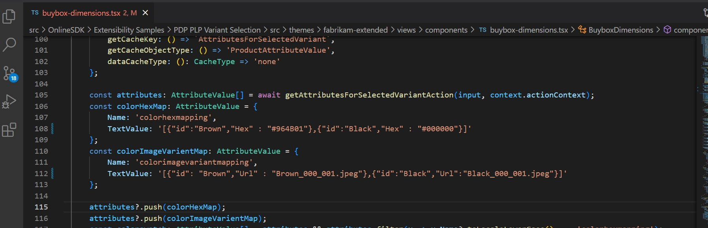
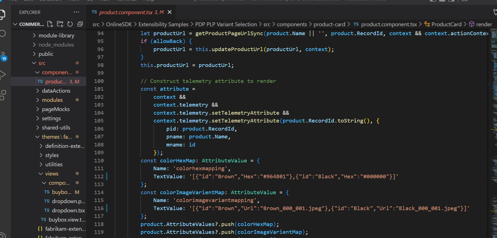

# Dynamics 365 Commerce - online extensibility samples

## License
License is listed in the [LICENSE](./LICENSE) file.

# Sample - PDP PLP Variant Selection

## Overview
This sample provides the code customizations to add selectable color swatches to each product card that has color variants on the product list page. Once selected, the product DIM ID is added as a query string passed to the product detail page. The product details page will then check the query string parameter if passed in and ensure the variant is selected as part of the initial page load.


## Starter kit license
License for starter kit is listed in the [LICENSE](./module-library/LICENSE) .

## Prerequisites
Follow the instructions mentioned in [document](https://docs.microsoft.com/en-us/dynamics365/commerce/e-commerce-extensibility/setup-dev-environment) to set up the development environment.

### Procedure to create custom theme
Follow the instructions mentioned in [document](https://docs.microsoft.com/en-us/dynamics365/commerce/e-commerce-extensibility/create-theme) to create the custom theme.

 In this sample we have cloned the fabrikam theme to a new custom theme named fabrikam-extended.

## Detailed Steps

### 1. Create custom search result container module
In this step, we will clone a **search-result-container** module to add custom code for product navigation with dimid in url.Here is the CLI command **yarn msdyn365 clone search-result-container custom-search-result-container** for cloning the module search-result-container and follow below steps to modify the code.

### 2.Modify custom-search-result-container module definition file to add configurations.

Open custom-search-result-container.definition.json under **src/Modules/custom-search-result-container** and add below two configurations in config section.

```json
   "imageUrlPrefix": {
        "friendlyName": "image url prefix",
        "description": "Provide image url prefix",
        "type": "string",
        "default": "https://images-us-prod.cms.commerce.dynamics.com/cms/api/gxnhbrfnvx/imageFileData/search?fileName=/Products/"
    },
   "includeProductNavWithDimId": {
        "friendlyName": "Include dimid in product url for navigation",
        "description": "Includes Dimid in product url for PDP navigation to render the selected color swatch from PLP",
        "type": "boolean",
        "default": false
    }

```

### 3.Modify custom-search-result-container.tsx.

Open custom-search-result-container.tsx under **src/Modules/custom-search-result-container** and replace existing code with below code.

```typescript
/*--------------------------------------------------------------
 * Copyright (c) Microsoft Corporation. All rights reserved.
 * See License.txt in the project root for license information.
 *--------------------------------------------------------------*/

/* eslint-disable no-duplicate-imports */
import {
    CategoryHierarchy as CategoryHierarchyData,
    IProductRefinerHierarchy,
    IProductsDimensionsAvailabilities
} from '@msdyn365-commerce/commerce-entities';
import MsDyn365, { getCatalogId, ICoreContext } from '@msdyn365-commerce/core';
import { format, ProductPrice, ProductRefinerValue, SortColumn, TextValueTranslation } from '@msdyn365-commerce/retail-proxy';
import {
    ArrayExtensions,
    DimensionAvailabilitiesForProductSearchResultInput,
    DimensionTypes,
    getDimensionAvailabilitiesForProductSearchResultAction,
    getPriceForProductSearchResult,
    IDimensionsApp,
    PriceForProductSearchResultInput
} from '@msdyn365-commerce-modules/retail-actions';
import {
    getTelemetryObject,
    ILabeledDropdownOnChangeNotification,
    ILabeledDropdownOption,
    IModuleProps,
    INodeProps,
    ITelemetryContent,
    LabeledDropdown,
    UncontrolledPagination
} from '@msdyn365-commerce-modules/utilities';
import classnames from 'classnames';
import { computed, observable, reaction, transaction } from 'mobx';
import { observer } from 'mobx-react';
import * as React from 'react';

import {
    buildListPageUrl,
    getCollectionProducts,
    getCollectionRefinersAction,
    getCurrentUrl,
    GetFullProductsByCollectionInput,
    parseQueryParam,
    RefinersByCollectionInput,
    sortOptions
} from './actions';
import { hydrateRefinersFromUrl } from './actions/url-utils';
import {
    ErrorMessage,
    FeatureSearchResultItem,
    getUpdatedRefinementCriteria,
    IChoiceSummaryClickNotification,
    IRefineItemCommonProps,
    IRefineItemToggleNotification,
    ISearchResultModalViewProps,
    isMatchingRefinementCriterion,
    Link,
    ModalToggle,
    ProductSearchResultItems,
    SearchResultModal,
    Separator,
    Title
} from './components';
import ChoiceSummary from './components/choice-summary';
import RefineSubmenu from './components/refine-submenu';
import { ICustomSearchResultContainerData } from './custom-search-result-container.data';
import { expandRefinersCount, ICustomSearchResultContainerProps } from './custom-search-result-container.props.autogenerated';

export interface ISearchResultContainerViewProps extends ICustomSearchResultContainerProps<ICustomSearchResultContainerData> {
    products?: React.ReactNode;
    className?: string;
    SearchResultContainer: IModuleProps;
    TitleViewProps: ITitleViewProps;
    categoryHierarchy: ICategoryHierarchyViewProps;
    pagination?: React.ReactNode;
    ProductsContainer: INodeProps;
    ProductSectionContainer: INodeProps;
    refineMenu: IRefineMenuViewProps;
    sortByOptions: ISortByViewProps;
    choiceSummary?: React.ReactNode;
    modalToggle: React.ReactNode;
    searchResultModal: ISearchResultModalViewProps;
    isMobile: boolean;
    CategoryNavContainer: INodeProps;
    RefineAndProductSectionContainer: INodeProps;
    errorMessage: React.ReactNode;
    FeatureSearchContainer: INodeProps;
    similarLookProduct?: React.ReactNode;
    productPrices?: ProductPrice[];
}

export interface ITitleViewProps {
    TitleContainer: INodeProps;
    title: ISearchResultTitle;
}

export interface IRefineMenuViewProps {
    RefineMenuContainer: INodeProps;
    RefinerSectionContainer: INodeProps;
    refiners?: React.ReactNode[];
}

export interface ICategoryHierarchyViewProps {
    categoryHierarchyList?: React.ReactNode[];
    categoryHierarchySeparator?: React.ReactNode;
    CategoryHierarchyContainer: INodeProps;
}

export interface ISortByViewProps {
    SortingContainer: INodeProps;
    sortByDropDown?: React.ReactNode;
}

export type GridSize = 'xs' | 'sm' | 'md' | 'lg' | 'xl';

/**
 * Title component for search result container.
 */
export interface ISearchResultTitle {
    titlePrefix?: React.ReactNode;
    titleText?: React.ReactNode;
    titleCount?: React.ReactNode;
}

export interface ISearchResultContainerState {
    sortingState: ISortByCollectionState;
    modalIsOpen: boolean;
    refiners: IProductRefinerHierarchy[];
    productsDimensionAvailabilities?: IProductsDimensionsAvailabilities[][];
}

interface ISortByCollectionState {
    selectedSortByOption: ILabeledDropdownOption;
    pending: boolean;
}

/**
 *
 * SearchResultContainer component.
 * @extends {React.PureComponent<ICustomSearchResultContainerProps<ICustomSearchResultContainerData>>}
 */
@observer
export default class SearchResultContainer extends React.PureComponent<
    ICustomSearchResultContainerProps<ICustomSearchResultContainerData>,
    ISearchResultContainerState
> {
    @computed get isMobile(): boolean {
        return this._viewport === 'xs' || this._viewport === 'sm';
    }

    private readonly sortByDropdownOptions: ILabeledDropdownOption[] = [
        { key: sortOptions.sortByOptionRelevanceDesc, value: this.props.resources.sortByOptionRelevanceDesc },
        { key: sortOptions.sortByOptionNameAsc, value: this.props.resources.sortByOptionNameAsc },
        { key: sortOptions.sortByOptionNameDesc, value: this.props.resources.sortByOptionNameDesc },
        { key: sortOptions.sortByOptionPriceAsc, value: this.props.resources.sortByOptionPriceAsc },
        { key: sortOptions.sortByOptionPriceDesc, value: this.props.resources.sortByOptionPriceDesc },
        { key: sortOptions.sortByOptionRatingDesc, value: this.props.resources.sortByOptionRatingDesc },
        { key: sortOptions.sortByOptionBestSelling, value: this.props.resources.sortByOptionBestSelling },
        { key: sortOptions.sortByOptionNewScore, value: this.props.resources.sortByOptionNewScore },
        { key: sortOptions.sortByOptionTrendingScore, value: this.props.resources.sortByOptionTrendingScore }
    ];

    private readonly _refineItemCommonProps: IRefineItemCommonProps;

    private readonly _pageType: string | undefined = this.props.context.request.urlTokens.pageType;

    @observable
    private _viewport: GridSize;

    private readonly _modalToggleRef: React.RefObject<HTMLButtonElement>;

    private readonly _sortAndFilterContainerRef: React.RefObject<LabeledDropdown>;

    private expandrefinerCount: number | undefined = 0;

    private readonly telemetryContent: ITelemetryContent;

    private readonly productPrices: ProductPrice[];

    private readonly defaultPageNumber = 0;

    private readonly catalogId = getCatalogId(this.props.context.request);

    public constructor(props: ICustomSearchResultContainerProps<ICustomSearchResultContainerData>, state: ISearchResultContainerState) {
        super(props);
        this._viewport =
            props.context.request && props.context.request.device && props.context.request.device.Type === 'Mobile' ? 'xs' : 'lg';
        this._modalToggleRef = React.createRef<HTMLButtonElement>();
        this._sortAndFilterContainerRef = React.createRef<LabeledDropdown>();
        this._toggleModal = this._toggleModal.bind(this);
        this._updateViewport = this._updateViewport.bind(this);
        this.productPrices = [];
        this.state = {
            sortingState: {
                pending: false,
                selectedSortByOption: this.sortByDropdownOptions[0]
            },
            modalIsOpen: false,
            refiners: []
        };
        const { placeholderTextMax, minLabel, maxLabel, rangeNameFormat } = this.props.resources;

        const locale = this.props.context.request.locale;
        const telemetry = this.props.telemetry;
        const validationErrorNaN = this.props.resources.validationErrorNotNumber;
        const validationErrorRange = this.props.resources.validationErrorNotRange;
        this._refineItemCommonProps = {
            telemetry,
            locale,
            placeholderTextMax,
            minLabel,
            maxLabel,
            rangeNameFormat,
            validationErrorNaN,
            validationErrorRange
        };
        this.telemetryContent = getTelemetryObject(
            this.props.context.request.telemetryPageName!,
            this.props.friendlyName,
            this.props.telemetry
        );

        // Initalization of list page
        this.props.data.products.then(products => {
            this.props.data.listPageState.then(listPageState => {
                if (this._pageType === 'Category') {
                    listPageState.pageType = 'Category';
                } else {
                    listPageState.pageType = 'Search';
                }

                let querySorting: SortColumn[] = [];

                if (this.props.context.request.query && this.props.context.request.query.sorting) {
                    querySorting = JSON.parse(decodeURIComponent(this.props.context.request.query.sorting)) as SortColumn[];
                }

                listPageState.currentPageNumber =
                    (this.props.context.request.query && +this.props.context.request.query.skip / (this.props.config.itemsPerPage || 10)) ||
                    0;
                listPageState.sortingCritera = { Columns: querySorting };
                listPageState.pageSize = this.props.config.itemsPerPage || 10;
                listPageState.activeProducts = products.products;
                listPageState.totalProductCount = products.count;
                listPageState.activeFilters = hydrateRefinersFromUrl(this.props.context.request);

                // Initialize reaction based on listPageState properties
                reaction(
                    () => {
                        return [
                            listPageState.activeFilters && listPageState.activeFilters.length,
                            listPageState.currentPageNumber,
                            listPageState.sortingCritera &&
                                listPageState.sortingCritera.Columns &&
                                listPageState.sortingCritera.Columns.length
                        ];
                    },
                    () => {
                        const input = new GetFullProductsByCollectionInput(
                            listPageState.pageType,
                            this.props.context.request.apiSettings,
                            {
                                Paging: {
                                    Top: this.props.config.itemsPerPage,
                                    Skip: Math.max(listPageState.pageSize * (listPageState.currentPageNumber || 0), 0)
                                },
                                count: true,
                                Sorting: listPageState.sortingCritera || {}
                            },
                            listPageState.activeFilters || [],
                            +(this.props.context.request.urlTokens.itemId || 0),

                            this.props.context.request.query && this.props.context.request.query.q
                                ? this.props.context.request.query.q
                                : JSON.stringify({
                                      ProductId: this.props.context.request.query?.productId,
                                      Recommendation: this.props.context.request.query?.recommendation
                                  }),
                            !!(
                                this.props &&
                                this.props.config &&
                                this.props.config.includeAttributes !== undefined &&
                                this.props.config.includeAttributes
                            ),
                            this.props.config.updateRefinerPanel,
                            this.props.context.request.locale,
                            this.catalogId
                        );
                        getCollectionProducts(input, this.props.context.actionContext).then(productResults => {
                            listPageState.activeProducts = productResults.products;
                            listPageState.totalProductCount = productResults.count;
                            if (
                                this.props.config.enableAffiliationBasedPricing &&
                                this.props.context.actionContext.requestContext?.user?.isAuthenticated
                            ) {
                                this._getActivePrice();
                            }
                        });

                        if (this.props.config.updateRefinerPanel) {
                            const refinerInput = new RefinersByCollectionInput(
                                listPageState.pageType,
                                this.props.context.request.apiSettings,
                                {
                                    Paging: {
                                        Top: this.props.config.itemsPerPage,
                                        Skip: Math.max(
                                            listPageState.pageSize * (listPageState.currentPageNumber ?? this.defaultPageNumber),
                                            this.defaultPageNumber
                                        )
                                    },
                                    count: true,
                                    Sorting: listPageState.sortingCritera ?? {}
                                },
                                listPageState.activeFilters ?? [],
                                +(this.props.context.request.urlTokens.itemId ?? 0),
                                this.props.context.request.query?.q
                                    ? this.props.context.request.query.q
                                    : this.props.context.request.query?.productId,
                                false,
                                this.props.config.updateRefinerPanel
                            );

                            getCollectionRefinersAction(refinerInput, this.props.context.actionContext)
                                .then(refiners => {
                                    this.setState({ refiners });
                                })
                                .catch(error => {
                                    this.props.telemetry.error(error);
                                });
                        }
                    }
                );
            });
        });

        if (this.props.context.request.query?.productId) {
            this.props.data.featureProduct.then(products => {
                this.props.data.listPageState.then(listPageStateFeature => {
                    listPageStateFeature.featureProduct = products;
                });
            });
        }
        this._updateViewport();
    }

    public static getFriendlyName(locale: string, nameTranslations?: TextValueTranslation[]): string | undefined {
        let nameTranslation: TextValueTranslation | undefined;
        if (locale && nameTranslations && ArrayExtensions.hasElements(nameTranslations)) {
            nameTranslation = nameTranslations.find(item => item.Language!.toLowerCase() === locale.toLowerCase());
        }

        return nameTranslation?.Text;
    }

    public async componentDidMount(): Promise<void> {
        if (MsDyn365.isBrowser && window.addEventListener) {
            window.addEventListener('resize', this._updateViewport);
            this._updateViewport();
        }
        if (this.props.config.enableAffiliationBasedPricing && this.props.context.actionContext.requestContext?.user?.isAuthenticated) {
            this._getActivePrice();
        }

        const context = this.props.context as ICoreContext<IDimensionsApp>;
        const dimensionsToDisplayOnProductCard = context.app.config.dimensionsInProductCard;
        const dimensionsToDisplayAsSwatch = context.app.config.dimensionsAsSwatchType;
        if (
            ArrayExtensions.hasElements(dimensionsToDisplayOnProductCard) &&
            !dimensionsToDisplayOnProductCard.includes(DimensionTypes.none) &&
            ArrayExtensions.hasElements(dimensionsToDisplayAsSwatch) &&
            !dimensionsToDisplayAsSwatch.includes(DimensionTypes.none) &&
            this.props.config.includeAttributes
        ) {
            await this._getProductsDimensionsAvailabilities();
        }
    }

    public componentWillUnmount(): void {
        if (MsDyn365.isBrowser && window.removeEventListener) {
            window.removeEventListener('resize', this._updateViewport);
        }
    }

    public render(): JSX.Element {
        const { imageSettings, className } = this.props.config;
        const { resources } = this.props;
        const products = (this.props.data.listPageState.result && this.props.data.listPageState.result.activeProducts) || [];
        const searchProduct = (this.props.data.listPageState.result && this.props.data.listPageState.result.featureProduct) || null;
        let errorText = '';
        if (!products || products.length === 0) {
            errorText = this._pageType === 'Category' ? resources.resultCategoryNotFoundText : resources.resultSearchNotFoundText;
        }
        const productsComponent = this._getProducts();
        const featureComponent = (
            <FeatureSearchResultItem
                product={searchProduct}
                context={this.props.context}
                imageSettings={imageSettings}
                resources={resources}
                moduleType={this.props.typeName}
                moduleId={this.props.id}
                telemetryContent={this.telemetryContent}
                recommendation={this.props.context.request.query && this.props.context.request.query?.recommendation}
            />
        );

        const searchResultContainerViewProps = {
            ...this.props,
            products: productsComponent,
            TitleViewProps: this._getCollectionTitle(),
            categoryHierarchy: !this.props.config.disableHierarchy && this._getCategoryHierarchy(),
            refineMenu: this._getRefineMenu(),
            className: classnames('ms-search-result-container', className),
            SearchResultContainer: {
                moduleProps: this.props,
                className: classnames('ms-search-result-container', className)
            },
            sortByOptions:
                this.props.data.listPageState.result && this.props.data.listPageState.result.totalProductCount !== 0
                    ? this._getSortingDropDown()
                    : null,
            pagination: this._getPagination(),
            ProductsContainer: { className: 'ms-search-result-container__Products' },
            ProductSectionContainer: { className: 'ms-search-result-container__product-section' },
            CategoryNavContainer: { className: 'ms-search-result-container__category-nav-section' },
            RefineAndProductSectionContainer: { className: 'ms-search-result-container__refine-product-section' },
            choiceSummary: this._getChoiceSummary(),
            modalToggle:
                this.props.data.listPageState.result && this.props.data.listPageState.result.totalProductCount !== 0 ? (
                    <ModalToggle
                        text={resources.modalTitle}
                        ariaLabel={resources.modalTitle}
                        innerRef={this._modalToggleRef}
                        onClick={this._toggleModal}
                        id='search-result-modal'
                    />
                ) : null,
            searchResultModal: this._getSearchResultModal(),
            isMobile: this.isMobile,
            errorMessage: errorText && <ErrorMessage text={errorText} />,
            FeatureSearchContainer: { className: 'ms-feature-search-result' },
            similarLookProduct:
                this.props.data.listPageState.result &&
                this.props.data.listPageState.result.featureProduct !== null &&
                this.props.data.listPageState.result.featureProduct !== undefined
                    ? featureComponent
                    : null,
            productPrices: this.productPrices
        };
        return this.props.renderView(searchResultContainerViewProps) as React.ReactElement;
    }

    /**
     * Get products dimension availabilities.
     * @returns Void.
     */
    private readonly _getProductsDimensionsAvailabilities = async (): Promise<void> => {
        const productsList = this.props.data.listPageState.result?.activeProducts ?? [];

        const productsDimensionAvailabilities = await getDimensionAvailabilitiesForProductSearchResultAction(
            new DimensionAvailabilitiesForProductSearchResultInput(productsList, this.props.context as ICoreContext<IDimensionsApp>),
            this.props.context.actionContext
        );

        if (ArrayExtensions.hasElements(productsDimensionAvailabilities)) {
            this.setState({ productsDimensionAvailabilities });
        }
    };

    /**
     * Get the active price for the products.
     */
    private readonly _getActivePrice = async (): Promise<void> => {
        const productsList = this.props.data.listPageState.result?.activeProducts ?? [];
        const products = await getPriceForProductSearchResult(
            new PriceForProductSearchResultInput(productsList),
            this.props.context.actionContext
        );

        const listPageState = await this.props.data.listPageState;
        listPageState.activeProducts = products;
    };

    private readonly _getSearchResultModal = (): ISearchResultModalViewProps => {
        const { resources } = this.props;
        return SearchResultModal({
            resources: {
                modalCloseButtonText: resources.modalCloseButtonText,
                modalTitle: resources.modalTitle
            },
            isOpen: this.state.modalIsOpen,
            returnRef: this._modalToggleRef,
            onModalToggle: this._toggleModal
        });
    };

    private readonly _getCollectionTitle = (): ITitleViewProps => {
        const { data, context, resources } = this.props;

        let collectionTitle: string | undefined = '';
        if (context && context.request && context.request.query && context.request.query.q) {
            collectionTitle = `"${context.request.query.q}"`;
        } else {
            collectionTitle =
                (data.category.result &&
                    SearchResultContainer.getFriendlyName(context.request.locale, data.category.result.NameTranslations)) ||
                (data.category.result && data.category.result.Name);
        }
        let productCountText = '';
        let productCountNumber: number | undefined;
        if (data.listPageState && data.listPageState.result && data.listPageState.result.totalProductCount !== undefined) {
            productCountNumber = data.listPageState.result.totalProductCount;
        } else if (data.products && data.products.result) {
            productCountNumber = data.products.result.count;
        }

        if (productCountNumber && productCountNumber !== 0) {
            productCountText =
                productCountNumber !== 1
                    ? format(this.props.resources.numberOfProducts, productCountNumber)
                    : this.props.resources.oneProduct;
        } else {
            productCountText = format(this.props.resources.numberOfProducts, 0);
        }
        const pageName = context.request.telemetryPageName ? `result-count-${context.request.telemetryPageName.toLowerCase()}` : '';
        const titlePrefix = <Title className='ms-search-result__collection-title-prefix' text={resources.searchTextPrefix} />;
        const titleText = collectionTitle && <Title className='ms-search-result__collection-title-text' text={collectionTitle} />;
        const titleCount = <Title className='ms-search-result__collection-title-count' text={productCountText} />;

        return {
            TitleContainer: { className: `ms-search-result-container__title ${pageName}` },
            title: {
                titlePrefix,
                titleText,
                titleCount
            }
        };
    };

    private readonly _getCategoryHierarchy = (): ICategoryHierarchyViewProps => {
        const { data } = this.props;
        const categoryHierarchy = data.categoryHierarchy.result;
        const categoryLinks =
            categoryHierarchy &&
            categoryHierarchy.map((value: CategoryHierarchyData, index: number) => {
                return (
                    <Link
                        key={index}
                        text={value.Name}
                        ariaLabel={`${this.props.resources.categoryLinkAriaLabel} ${value.Name}`}
                        href={value.Url}
                    />
                );
            });
        const categoryLinkSeparator = <Separator separator='/' />;

        return {
            CategoryHierarchyContainer: { tag: 'nav', className: 'ms-search-result-container__category-hierarchy' },
            categoryHierarchyList: categoryLinks,
            categoryHierarchySeparator: categoryLinkSeparator
        };
    };

    private readonly _getSortingDropDown = (): ISortByViewProps => {
        const { resources } = this.props;
        const activeDropdown = this._getCurrentlySelectedOption() || this.state.sortingState.selectedSortByOption;
        let dropdwonOptions = this.sortByDropdownOptions;
        // eslint-disable-next-line @typescript-eslint/no-unsafe-member-access -- App config settings are of "any" value.
        if (this.props.context.app.config.hideRating) {
            dropdwonOptions = this.sortByDropdownOptions.filter(dropdownOption => dropdownOption.key !== 'AverageRating-Desc');
        }
        const dropdown = (
            <LabeledDropdown
                labelClassname='reviews-list-sort-by'
                labelText={resources.sortByDropdownLabel}
                dropdownId='categorySortByDropdown'
                dropdownClassname='reviews-list-dropdown'
                toggleColor='link'
                dropdownOptions={dropdwonOptions}
                selectedOption={activeDropdown}
                onSelectOption={this._updateSortByDropdown}
                ref={this._sortAndFilterContainerRef}
            />
        );
        return {
            SortingContainer: { className: 'ms-search-result-container__Sort-by-category' },
            sortByDropDown: dropdown
        };
    };

    private readonly _getPagination = (): React.ReactNode => {
        const { config, context, data, resources } = this.props;
        const listPageState = data && data.listPageState && data.listPageState.result;
        const fullUrl = getCurrentUrl(context.request);
        const itemsPerPage = config.itemsPerPage || 10;
        const skipCount =
            listPageState && listPageState.currentPageNumber !== null
                ? listPageState.currentPageNumber * (this.props.config.itemsPerPage || 10)
                : (this.props.context.request.query && +this.props.context.request.query.skip) || 0;
        const totalItems = (listPageState && listPageState.totalProductCount) || 0;
        const previousText = resources.flipperPrevious;
        const nextText = resources.flipperNext;

        if (totalItems <= itemsPerPage) {
            return null;
        }
        return (
            <UncontrolledPagination
                className='ms-search-result-container__pagination'
                role='navigation'
                aria-label={resources.paginationAriaLabel}
                url={fullUrl.href}
                qsp='skip'
                items={totalItems}
                itemsPerPage={itemsPerPage}
                startingItem={skipCount}
                previousText={this._renderPrev(previousText)}
                nextText={this._renderNext(nextText)}
                previousAriaLabel={previousText}
                nextAriaLabel={nextText}
                telemetryContent={this.telemetryContent}
            />
        );
    };

    private readonly _getRefineMenu = (): IRefineMenuViewProps => {
        const { data, context, config } = this.props;
        const tempRangeTypeTODO = context.request.query && context.request.query.inputRange ? 'input' : 'slider';
        const validRefiners =
            this.props.config.updateRefinerPanel && ArrayExtensions.hasElements(this.state.refiners)
                ? this.state.refiners.filter(refiner => {
                      return ArrayExtensions.hasElements(refiner.Values);
                  })
                : data.refiners.result &&
                  data.refiners.result.filter(refiner => {
                      return ArrayExtensions.hasElements(refiner.Values);
                  });

        const activeRefiners = (data.listPageState.result && data.listPageState.result.activeFilters) || [];

        this._getexpandRefinerCount(validRefiners && validRefiners.length, config.expandRefinersCount);
        const expandedRefiners = this.expandrefinerCount;
        const subMenus =
            validRefiners &&
            validRefiners.map((productRefinerHierarchy: IProductRefinerHierarchy, index: number) => {
                return (
                    <RefineSubmenu
                        productRefinerHierarchy={productRefinerHierarchy}
                        selectedRefinerValues={activeRefiners}
                        refineItemCommonProps={this._refineItemCommonProps}
                        minValueSliderThumbAriaLabel={this.props.resources.minValueSliderThumbAriaLabel}
                        maxValueSliderThumbAriaLabel={this.props.resources.maxValueSliderThumbAriaLabel}
                        key={index}
                        onUpdateRefiners={this._onUpdateRefiners}
                        urlBuilder={this._buildRefinerUrl}
                        isDisabled={false}
                        isExpandedOnInitialLoad={!!(expandedRefiners && expandedRefiners > index)}
                        tempRangeTypeTODO={tempRangeTypeTODO}
                        context={context}
                        moduleId={this.props.id}
                        moduleTypeName={this.props.typeName}
                        telemetryContent={this.telemetryContent}
                        productCountAriaLabel={this.props.resources.productCountAriaLabel}
                        singleProductCountAriaLabel={this.props.resources.singleProductCountAriaLabel}
                        isMobile={this.isMobile}
                    />
                );
            });

        return {
            RefineMenuContainer: { className: 'ms-search-result-container__refine-menu' },
            RefinerSectionContainer: { className: 'ms-search-result-container__refiner-section' },
            refiners: subMenus
        };
    };

    private readonly _getChoiceSummary = (): React.ReactNode => {
        const { resources, data, telemetry } = this.props;
        const selectedRefiners = (data.listPageState.result && data.listPageState.result.activeFilters) || [];
        return (
            <ChoiceSummary
                classNames='ms-choice-summary-by-category'
                clearAllText={resources.clearAllText}
                label={resources.choiceSummaryLabel}
                closeAriaLabel={resources.closeAriaLabel}
                selectedChoices={selectedRefiners}
                // @ts-expect-error: NOTE Type-unsafe line below, null refinersByCategoryHierarchy case not handled
                refinerHierarchy={data.refiners.result}
                choiceFormat={resources.choiceFormat}
                choiceRangeValueFormat={resources.choiceRangeValueFormat}
                telemetry={telemetry}
                onChoiceClicked={this._onChoiceClicked}
                urlBuilder={this._buildRefinerUrlForChoiceSummary}
                choiceAriaLabel={resources.choiceAriaLabel}
                telemetryContent={this.telemetryContent}
                context={this.props.context}
            />
        );
    };

    private readonly _getProducts = (): JSX.Element => {
        const { imageSettings, allowBackNavigation } = this.props.config;
        const { resources } = this.props;
        const breaCrumbType = this.props.context.app.config.breadcrumbType;
        const allowBack = allowBackNavigation && (breaCrumbType === 'back' || breaCrumbType === 'categoryAndBack');
        const products = (this.props.data.listPageState.result && this.props.data.listPageState.result.activeProducts) || [];
        const quickviewslot = this.props.slots && this.props.slots.quickview && this.props.slots.quickview[0];
        const isPriceMinMaxFeatureState = this.props.data.featureState.result?.find(
            featureState => featureState.Name === 'Dynamics.AX.Application.RetailSearchPriceRangeFeature'
        );
        return (
            <ProductSearchResultItems
                products={products}
                context={this.props.context}
                imageSettings={imageSettings}
                resources={resources}
                moduleType={this.props.typeName}
                moduleId={this.props.id}
                allowBackNavigation={allowBack}
                telemetryContent={this.telemetryContent}
                quickviewSlot={quickviewslot}
                channelInventoryConfigurationId={this.props.data.products.result?.channelInventoryConfigurationId}
                isPriceMinMaxEnabled={isPriceMinMaxFeatureState?.IsEnabled}
                productsDimensionAvailabilities={this.state.productsDimensionAvailabilities}
                imgConfig={
                    this.props.config.imageUrlPrefix ||
                    'https://images-us-prod.cms.commerce.dynamics.com/cms/api/gxnhbrfnvx/imageFileData/search?fileName=/Products/'
                }
                includeProductNavWithDimIdConfig={this.props.config.includeProductNavWithDimId || false}
            />
        );
    };

    private readonly _updateSortByDropdown = (notification: ILabeledDropdownOnChangeNotification): void => {
        const { context } = this.props;
        const requestContext = context && context.request;
        const actionContext = context && context.actionContext;

        if (!requestContext || !actionContext || !this.props.data.listPageState.result) {
            const error = `[sort-by-category] cannot sort without context: ${!requestContext ? 'requestContext ' : ''} ${
                !actionContext ? 'actionContext ' : ''
            } could not be found`;
            this.props.telemetry.warning(error);
        }

        window.history.pushState(
            {},
            '',
            buildListPageUrl(
                getCurrentUrl(this.props.context.request),
                undefined,
                [this._getSortColumnFromSelectedOption(notification.selectedOption)],
                undefined
            )
        );
        transaction(() => {
            this.props.data.listPageState.result!.currentPageNumber = 0;
            this.props.data.listPageState.result!.sortingCritera = {
                Columns: [this._getSortColumnFromSelectedOption(notification.selectedOption)]
            };
        });
    };

    private readonly _getSortColumnFromSelectedOption = (option: ILabeledDropdownOption): SortColumn => {
        const { data } = this.props;

        if (!data.searchConfiguration.result) {
            return {};
        }

        const mappedConfiguration = data.searchConfiguration.result.find(searchConfiguration => {
            return searchConfiguration.key === option.key;
        });

        if (mappedConfiguration) {
            return mappedConfiguration.sortColumn;
        }

        return {};
    };

    /**
     * Retrieves current sort criteria.
     * @returns Sort criteria column which is currently active or undefined if it's not specified.
     */
    private readonly _getSortCriteriaColumn = (): SortColumn | undefined => {
        const sortCriteria = this.props.data.listPageState.result?.sortingCritera;
        if (ArrayExtensions.hasElements(sortCriteria?.Columns)) {
            return sortCriteria!.Columns[0];
        }

        const queryColumns = parseQueryParam<SortColumn[]>('sorting', this.props.context.request);
        if (ArrayExtensions.hasElements(queryColumns)) {
            return queryColumns[0];
        }

        return undefined;
    };

    /**
     * Retrieves current selected dropdown option based on the sort criteria.
     * @returns Current dropdown option.
     */
    private readonly _getCurrentlySelectedOption = (): ILabeledDropdownOption | undefined => {
        const activeSortColumn = this._getSortCriteriaColumn();

        const searchConfiguration = this.props.data.searchConfiguration.result;

        if (!activeSortColumn || !searchConfiguration) {
            return undefined;
        }

        const activeMappedConfig = searchConfiguration.find(
            mappedSearchConfig =>
                mappedSearchConfig.sortColumn.ColumnName === activeSortColumn.ColumnName &&
                mappedSearchConfig.sortColumn.IsDescending === activeSortColumn.IsDescending
        );
        if (!activeMappedConfig) {
            return undefined;
        }

        return this.sortByDropdownOptions.find(dropdownOption => dropdownOption.key === activeMappedConfig.key);
    };

    private readonly _onUpdateRefiners = (itemToggleNotification: IRefineItemToggleNotification): void => {
        const { context } = this.props;
        const requestContext = context && context.request;
        const actionContext = context && context.actionContext;

        if (!requestContext || !actionContext || !this.props.data.listPageState.result) {
            const error = `Refine menu cannot refine search criteria: ${!requestContext ? 'requestContext ' : ''} ${
                !actionContext ? 'actionContext ' : ''
            } could not be found`;
            this.props.telemetry.warning(error);
        }

        const updatedRefinementCriteria = getUpdatedRefinementCriteria(
            itemToggleNotification,
            (this.props.data.listPageState.result && this.props.data.listPageState.result.activeFilters) || []
        );

        window.history.pushState({}, '', buildListPageUrl(getCurrentUrl(this.props.context.request), updatedRefinementCriteria));
        transaction(() => {
            this.props.data.listPageState.result!.currentPageNumber = 0;
            this.props.data.listPageState.result!.activeFilters = updatedRefinementCriteria;
        });
    };

    private readonly _buildRefinerUrl = (itemToggleNotification: IRefineItemToggleNotification): string => {
        if (this.props.data.listPageState.result) {
            const newRefinementCriteria = getUpdatedRefinementCriteria(
                itemToggleNotification,
                this.props.data.listPageState.result.activeFilters || []
            );

            return buildListPageUrl(getCurrentUrl(this.props.context.request), newRefinementCriteria);
        }
        this.props.telemetry.warning('[buildRefinerQueryString]List Page State Not available, unable to build refiner URL');
        return '';
    };

    private readonly _onChoiceClicked = (notification: IChoiceSummaryClickNotification): void => {
        const { data, telemetry } = this.props;

        if (!data.listPageState.result) {
            telemetry.warning('[choice-summary-by-category._onChoiceClicked]ListPageState unavailable, unable to update refiners.');
            return;
        }

        let currentRefinementCriteria = (data.listPageState.result && data.listPageState.result.activeFilters) || [];

        if (!notification.clearAll) {
            const selectedChoice = notification.choiceClicked;
            if (!selectedChoice) {
                telemetry.warning('[choice-summary-by-category._onChoiceClicked] Choice could not be determined');
                return;
            }
            currentRefinementCriteria = currentRefinementCriteria.filter(
                (selectedCriterion: ProductRefinerValue) => !isMatchingRefinementCriterion(selectedChoice, selectedCriterion)
            );
        } else {
            currentRefinementCriteria = [];

            // Set focus to sort and filter
            const dropdownElementId = this._sortAndFilterContainerRef.current && this._sortAndFilterContainerRef.current.props.dropdownId;
            const dropdownElement = dropdownElementId && document.getElementById(dropdownElementId);
            setTimeout(() => {
                dropdownElement && dropdownElement.focus();
            }, 50);
        }

        const fullUrl = getCurrentUrl(this.props.context.request);
        window.history.pushState({}, '', buildListPageUrl(fullUrl, currentRefinementCriteria));
        data.listPageState.result.currentPageNumber = 0;
        data.listPageState.result.activeFilters = currentRefinementCriteria;
    };

    private readonly _buildRefinerUrlForChoiceSummary = (selectedRefiner: ProductRefinerValue, isClearAll: boolean): string => {
        const { data, telemetry } = this.props;
        const fullUrl = getCurrentUrl(this.props.context.request);

        if (!data.listPageState.result) {
            telemetry.warning('[choice-summary-by-category._buildRefinerUrl]ListPageState unavailable, unable to create refiner URL.');
            return fullUrl.href;
        }

        let currentRefinementCriteria = (data.listPageState.result && data.listPageState.result.activeFilters) || [];

        if (!isClearAll) {
            if (!selectedRefiner) {
                telemetry.warning('[choice-summary-by-category._buildRefinerUrl] URL for Choice could not be determined');
                return fullUrl.href;
            }
            currentRefinementCriteria = currentRefinementCriteria.filter(
                (selectedCriterion: ProductRefinerValue) => !isMatchingRefinementCriterion(selectedRefiner, selectedCriterion)
            );
        } else {
            currentRefinementCriteria = [];
        }

        return buildListPageUrl(fullUrl, currentRefinementCriteria);
    };

    private _getViewport(): GridSize {
        const { context } = this.props;

        // Always render in mobile viewport on a mobile device
        if (context.request && context.request.device && context.request.device.Type === 'Mobile') {
            return 'xs';
        }

        if (MsDyn365.isBrowser && window.innerWidth) {
            const gridSettings = context.request.gridSettings;
            if (gridSettings) {
                if (gridSettings.xs && window.innerWidth <= gridSettings.xs.w) {
                    return 'xs';
                } else if (gridSettings.sm && window.innerWidth <= gridSettings.sm.w) {
                    return 'sm';
                } else if (gridSettings.md && window.innerWidth <= gridSettings.md.w) {
                    return 'md';
                } else if (gridSettings.lg && window.innerWidth <= gridSettings.lg.w) {
                    return 'lg';
                }
                return 'xl';
            }
        }

        return 'lg';
    }

    private _toggleModal(): void {
        this.setState({
            modalIsOpen: !this.state.modalIsOpen
        });
    }

    private _updateViewport(): void {
        this._viewport = this._getViewport();

        if (this.state.modalIsOpen && !this.isMobile) {
            this._toggleModal();
        }
    }

    private readonly _getexpandRefinerCount = (validRefiners?: number, refinerCount?: expandRefinersCount): void => {
        switch (refinerCount) {
            case expandRefinersCount.all:
                this.expandrefinerCount = validRefiners;
                break;
            case expandRefinersCount.one:
                this.expandrefinerCount = 1;
                break;
            case expandRefinersCount.two:
                this.expandrefinerCount = 2;
                break;
            case expandRefinersCount.three:
                this.expandrefinerCount = 3;
                break;
            case expandRefinersCount.four:
                this.expandrefinerCount = 4;
                break;
            default:
                this.expandrefinerCount = 0;
        }
    };

    /**
     * Renders a Pagination previous text.
     * @param  paginationPreviousText - Pagination previous text from resources.
     * @returns Previous text and flipper icon.
     */
    private readonly _renderPrev = (paginationPreviousText: string) => {
        return (
            <div className='msc-pagination__prev'>
                <span className='ms-search-result__pagination-left' aria-hidden='true' />
                <span className='prev-text'>{paginationPreviousText}</span>
            </div>
        );
    };

    /**
     * Renders a Pagination next text.
     * @param  paginationNextText - Pagination next text from resources.
     * @returns Next text and flipper icon.
     */
    private readonly _renderNext = (paginationNextText: string) => {
        return (
            <div className='msc-pagination__next'>
                <span className='next-text'>{paginationNextText}</span>
                <span className='ms-search-result__pagination-right' aria-hidden='true' />
            </div>
        );
    };
}

```

### 4. Extend product-search-result-items.tsx.
In this step we will add two properties to the interface and propagated the same to the shared component.
Open product-search-result-items.tsx under **src/Modules/custom-search-result-container/components** and replace existing code with below code.

```typescript
/*--------------------------------------------------------------
 * Copyright (c) Microsoft Corporation. All rights reserved.
 * See License.txt in the project root for license information.
 *--------------------------------------------------------------*/

/* eslint-disable no-duplicate-imports */
import { IProductsDimensionsAvailabilities } from '@msdyn365-commerce/commerce-entities';
import { IPriceComponentResources } from '@msdyn365-commerce/components';
import { ICoreContext, IImageSettings } from '@msdyn365-commerce/core';
import { ProductSearchResult } from '@msdyn365-commerce/retail-proxy';
import { ArrayExtensions } from '@msdyn365-commerce-modules/retail-actions';
import { ITelemetryContent } from '@msdyn365-commerce-modules/utilities';
import ProductComponent from '../../../components/product-card/product.component';
import * as React from 'react';

import { ICustomSearchResultContainerResources } from '../custom-search-result-container.props.autogenerated';

interface IProductSearchResultItems {
    products: ProductSearchResult[];
    context: ICoreContext;
    resources: ICustomSearchResultContainerResources;
    imageSettings?: IImageSettings;
    moduleType: string;
    moduleId: string;
    allowBackNavigation?: boolean;
    telemetryContent: ITelemetryContent;
    quickviewSlot?: {} | null | undefined;
    channelInventoryConfigurationId?: number;
    isPriceMinMaxEnabled?: boolean;
    productsDimensionAvailabilities?: IProductsDimensionsAvailabilities[][];
    includeProductNavWithDimIdConfig: boolean;
    imgConfig: string;
    enableInStoreOnly?: boolean;
}

/**
 * Returns the product inventory label.
 * @param  channelInventoryConfigurationId - The channel configuration Id.
 * @param  product - The product.
 * @returns The inventory label.
 */
function getInventoryLabel(channelInventoryConfigurationId: number | undefined, product: ProductSearchResult): string | undefined {
    if (!channelInventoryConfigurationId || !ArrayExtensions.hasElements(product.AttributeValues)) {
        return undefined;
    }
    const inventoryAttribute = product.AttributeValues.find(attribute => attribute.RecordId === channelInventoryConfigurationId);
    if (inventoryAttribute) {
        return inventoryAttribute.TextValue;
    }
    return undefined;
}

export const ProductSearchResultItems: React.FC<IProductSearchResultItems> = ({
    products,
    context,
    imageSettings,
    resources,
    moduleType,
    moduleId,
    allowBackNavigation,
    telemetryContent,
    quickviewSlot,
    channelInventoryConfigurationId,
    isPriceMinMaxEnabled,
    productsDimensionAvailabilities,
    imgConfig,
    includeProductNavWithDimIdConfig
}) => {
    const priceResources: IPriceComponentResources = {
        priceRangeSeparator: resources.priceRangeSeparator
    };
    return (
        <ul className='list-unstyled'>
            {products.map((product: ProductSearchResult, index: number) => (
                <li className='ms-product-search-result__item' key={index}>
                    <ProductComponent
                        context={context}
                        telemetryContent={telemetryContent}
                        imageSettings={imageSettings}
                        freePriceText={resources.priceFree}
                        originalPriceText={resources.originalPriceText}
                        currentPriceText={resources.currentPriceText}
                        ratingAriaLabel={resources.ratingAriaLabel}
                        allowBack={allowBackNavigation}
                        id={moduleId}
                        key={product.RecordId}
                        typeName={moduleType}
                        data={{ product }}
                        quickViewButton={quickviewSlot}
                        inventoryLabel={getInventoryLabel(channelInventoryConfigurationId, product)}
                        isPriceMinMaxEnabled={isPriceMinMaxEnabled}
                        priceResources={priceResources}
                        imgConfig={imgConfig}
                        includeProductNavWithDimIdConfig={includeProductNavWithDimIdConfig}
                        dimensionAvailabilities={productsDimensionAvailabilities?.find(
                            dimensionAvailability =>
                                ArrayExtensions.hasElements(dimensionAvailability) &&
                                dimensionAvailability[0].masterProductId === product.MasterProductId
                        )}
                    />
                </li>
            ))}
        </ul>
    );
};

```

### 5. Create a custom media gallery module
In this step, we will clone a module **media-gallery** to add custom code.This module is ejected to trigger the valid product images API call based on the configuration of ‘getMediaLocationsDisableFlag’.
Below is the CLI for cloning the module **media-gallery** and follow below steps to modify the code.

**yarn msdyn365 clone media-gallery custom-media-gallery**

### 6. Modify custom-media-gallery module definition file to add getMediaLocationsDisableFlag configuration.

Go to custom-media-gallery.definition.json under **src/Modules/custom-media-gallery** and add below configuration in config section.

```json
		"getMediaLocationsDisableFlag": {
			"friendlyName": "Get Media Locations Disable Flag",
			"description": "Enable/Disable the get media locations api call",
			"type": "boolean",
			"default": false
		}

```

### 7. Modify custom-media-gallery.tsx file for dependencies.
Added getValidProductImages api based on the getMediaLocationsDisableFlag value in component.didmount().Open custom-media-gallery.tsx under **src/Modules/custom-media-gallery** and replace existing code with below code.

```typescript
/*--------------------------------------------------------------
 * Copyright (c) Microsoft Corporation. All rights reserved.
 * See License.txt in the project root for license information.
 *--------------------------------------------------------------*/

/* eslint-disable no-duplicate-imports */
import { Carousel, ICarouselProps } from '@msdyn365-commerce/components';
import { IImageData, IImageSettings, Image } from '@msdyn365-commerce/core';
import { SimpleProduct } from '@msdyn365-commerce/retail-proxy';
import { ArrayExtensions, ObjectExtensions } from '@msdyn365-commerce-modules/retail-actions';
import {
    defaultDataScale,
    IComponentNodeProps,
    ImagefullView,
    IModalViewProps,
    IModuleProps,
    inlineZoomImageOnHover,
    inlineZoomImageOnMouseMove,
    inlineZoomImageOnMouseOut,
    inlineZoomInitClick,
    INodeProps,
    ISingleSlideCarouselProps,
    isMobile,
    KeyCodes,
    NodeTag,
    onContainerZoomInit,
    onMouseMoveLensContainer,
    onMouseOutLensContainer,
    onMouseOverImageContainer,
    removeContainerZoomStyle,
    removeInlineZoomStyle,
    SingleSlideCarousel,
    VariantType
} from '@msdyn365-commerce-modules/utilities';
import classnames from 'classnames';
import { reaction } from 'mobx';
import * as React from 'react';

import { ICustomMediaGalleryData } from './custom-media-gallery.data';
import { imageSource, imageZoom, ICustomMediaGalleryProps, thumbnailsOrientation } from './custom-media-gallery.props.autogenerated';
import { getValidProductImages, validateProductImages } from './utils';

export interface IMediaGalleryState {
    animating: boolean;
    activeIndex: number;
    isImageZoomed: boolean;
    modalIsOpen: boolean;
    lastUpdate?: number;
    isMobileImageZoomed?: boolean;
    mediaGalleryItems?: IImageData[];
    selectedColor: string;
}

export interface IMediaGalleryThumbnailsViewProps {
    ThumbnailsContainerProps: INodeProps;
    SingleSlideCarouselComponentProps: INodeProps;
    items?: IMediaGalleryThumbnailItemViewProps[];
}

export interface IMediaGalleryThumbnailItemViewProps {
    ThumbnailItemContainerProps: INodeProps;
    Picture: React.ReactElement;
}

export interface IMediaGalleryViewProps extends ICustomMediaGalleryProps<ICustomMediaGalleryData> {
    state: IMediaGalleryState;
    MediaGallery: IModuleProps;
    CarouselProps: INodeProps;
    Thumbnails: IMediaGalleryThumbnailsViewProps;
    Modal?: React.ReactElement | null;
    callbackToggle?(): void;
    callbackThumbnailClick?(index: number): void;
    callbackThumbnailKeyDown?(index: number): void;
}

/**
 * Props for carousel.
 */
interface IMediaGalleryCarouselItems<ItemType> {
    items: ItemType[];
    keys: (string | undefined)[];
}

/**
 * Media gallery component.
 */
class MediaGallery extends React.Component<ICustomMediaGalleryProps<ICustomMediaGalleryData>, IMediaGalleryState> {
    private readonly _inlineZoomDivRef: Map<number, HTMLDivElement> = new Map();

    private readonly defaultGalleryImageSettings: IImageSettings = {
        viewports: {
            xs: { q: 'w=767&h=767&m=8', w: 0, h: 0 },
            sm: { q: 'w=600&h=600&m=8', w: 0, h: 0 },
            md: { q: 'w=600&h=772&m=8', w: 0, h: 0 },
            lg: { q: 'h=772&m=8', w: 0, h: 0 }
        },
        lazyload: true,
        cropFocalRegion: true
    };

    private readonly defaultThumbnailImageSettings: IImageSettings = {
        viewports: {
            xs: { q: 'w=100&m=8', w: 100, h: 0 },
            lg: { q: 'w=100&m=8', w: 100, h: 0 }
        },
        lazyload: true,
        cropFocalRegion: true
    };

    private readonly _zoomedImageSettings: IImageSettings;

    public constructor(props: ICustomMediaGalleryProps<ICustomMediaGalleryData>) {
        super(props);
        this._toggleModal = this._toggleModal.bind(this);
        this.state = { activeIndex: 0, selectedColor: '', animating: false, isImageZoomed: false, modalIsOpen: false };

        this._zoomedImageSettings =
            props.config.zoomedImageSettings ?? props.config.galleryImageSettings ?? this.defaultGalleryImageSettings;

        this._onImageMouseOut = this._onImageMouseOut.bind(this);
        this._inlineZoomImageOnHover = this._inlineZoomImageOnHover.bind(this);
        this._onInlineImageClick = this._onInlineImageClick.bind(this);
        this._onContainerZoomImageClick = this._onContainerZoomImageClick.bind(this);
        this._onMouseOutLensContainer = this._onMouseOutLensContainer.bind(this);
    }

    public isMobile(): boolean {
        const size = isMobile({ variant: VariantType.Viewport, context: this.props.context.request });
        return size === 'xs';
    }

    public async componentDidMount(): Promise<void> {
        const source = this.props.config.imageSource || imageSource.pageContext;
        const shouldUpdateOnPartialDimensionSelection = this.props.config.shouldUpdateOnPartialDimensionSelection;

        if (source === imageSource.pageContext) {
            if (this.state.mediaGalleryItems === undefined && this.props.data.mediaLocationsForSelectedVariant.result) {
                const images = await validateProductImages(
                    this.props.data.mediaLocationsForSelectedVariant.result,
                    this.props.context.actionContext,
                    this.props.config.thumbnailImageSettings ?? this.defaultThumbnailImageSettings
                );
                this._setImages(images);
            } else if (this.state.mediaGalleryItems === undefined && this.props.data.product.result) {
                const product = this.props.data.product.result;
                const images = await getValidProductImages(
                    product.RecordId,
                    +this.props.context.request.apiSettings.channelId,
                    this.props.context.actionContext,
                    this.props.config.thumbnailImageSettings || this.defaultThumbnailImageSettings,
                    product.productVariant
                );

                this._setImages(images);
            } else {
                this._setImages([]);
            }

            reaction(
                () => {
                    const product = this.props.data.product.result;
                    if (!product) {
                        return null;
                    }

                    if (!shouldUpdateOnPartialDimensionSelection || ObjectExtensions.isNullOrUndefined(product.productVariant?.RecordId)) {
                        return `${product.RecordId}`;
                    }

                    return `${product.RecordId}-${product.productVariant!.RecordId}`;
                },
                async () => {
                    const product = this.props.data.product.result;
                    if (product) {
                        if (!this.props.config.getMediaLocationsDisableFlag) {
                            const images = await getValidProductImages(
                                product.RecordId,
                                +this.props.context.request.apiSettings.channelId,
                                this.props.context.actionContext,
                                this.props.config.thumbnailImageSettings ?? this.defaultThumbnailImageSettings,
                                shouldUpdateOnPartialDimensionSelection ? product.productVariant : undefined
                            );

                            this._setImages(images);
                        }
                    } else {
                        this._setImages([]);
                    }
                }
            );
        }

        if (source === imageSource.productId && this.props.data.mediaLocations.result) {
            const images = await validateProductImages(
                this.props.data.mediaLocations.result,
                this.props.context.actionContext,
                this.props.config.thumbnailImageSettings || this.defaultThumbnailImageSettings
            );
            this._setImages(images);
        }
    }

    public shouldComponentUpdate(nextProps: ICustomMediaGalleryProps<ICustomMediaGalleryData>, nextState: IMediaGalleryState): boolean {
        if (this.state === nextState && this.props.data === nextProps.data) {
            return false;
        }
        return true;
    }

    public render(): JSX.Element {
        const { id, config, resources } = this.props;

        const { className, showPaginationTooltip } = config;

        const isVertical: boolean = config.thumbnailsOrientation === thumbnailsOrientation.vertical;
        const isFullscreenAllowed: boolean = this.isMobile() || config.allowFullScreen || false;
        const zoomViewMode: string =
            config.imageZoom === imageZoom.inline ? imageZoom.inline : config.imageZoom === imageZoom.container ? imageZoom.container : '';

        const mediaGalleryCarouselItems = this._getMediaGalleryItems(isFullscreenAllowed, zoomViewMode);
        const mediaGalleryThumbnailCarouselItems = this._getMediaGalleryThumbnailItems();
        const viewProps: IMediaGalleryViewProps = {
            ...(this.props as ICustomMediaGalleryProps<ICustomMediaGalleryData>),
            state: this.state,
            MediaGallery: {
                moduleProps: this.props,
                className: classnames(`ms-media-gallery ${isVertical ? 'vertical' : ''}`, className)
            },
            Modal: isFullscreenAllowed ? this.imageModalSlider(zoomViewMode) : null,
            callbackToggle: this.openModalDialog,
            callbackThumbnailClick: this._generateOnThumbnailClick,
            callbackThumbnailKeyDown: this._generateOnThumbnailKeyDown,
            CarouselProps: {
                tag: Carousel,
                className: 'ms-media-gallery__carousel',
                items: mediaGalleryCarouselItems.items,
                activeIndex: this.state.activeIndex,
                next: this.next,
                selectedColor: this.state.selectedColor,
                previous: this.previous,
                interval: false,
                directionTextPrev: resources.previousScreenshotFlipperText,
                directionTextNext: resources.nextScreenshotFlipperText,
                onIndicatorsClickHandler: this.goToIndex,
                showPaginationTooltip: showPaginationTooltip === true,
                indicatorAriaText: resources.ariaLabelForSlide,
                handleOnExited: this.onExited,
                handleOnExiting: this.onExiting,
                key: mediaGalleryCarouselItems.keys
            } as IComponentNodeProps<ICarouselProps>,
            Thumbnails: {
                ThumbnailsContainerProps: { className: 'ms-media-gallery__thumbnails-container' },
                SingleSlideCarouselComponentProps: {
                    tag: SingleSlideCarousel,
                    className: 'ms-media-gallery__thumbnails',
                    vertical: isVertical,
                    flipperPrevLabel: resources.previousScreenshotFlipperText,
                    flipperNextLabel: resources.nextScreenshotFlipperText,
                    parentId: id,
                    useTabList: true,
                    key: JSON.stringify(mediaGalleryThumbnailCarouselItems.keys)
                } as IComponentNodeProps<ISingleSlideCarouselProps>,
                items: mediaGalleryThumbnailCarouselItems.items
            }
        };

        return this.props.renderView(viewProps) as React.ReactElement;
    }

    /**
     * Zoomed out image on previous/next click.
     */
    public updateZoomedInImage(): void {
        this.setState({ isImageZoomed: false });
    }

    private readonly onExiting = () => {
        this.setState({ animating: true });
    };

    private readonly onExited = () => {
        this.setState({ animating: false });
    };

    /**
     * On click next in carousel.
     */
    private readonly next = (): void => {
        removeInlineZoomStyle();
        if (this.isLastItem() === undefined) {
            return;
        }

        const nextIndex = this.isLastItem() ? 0 : this.state.activeIndex + 1;
        this.goToIndex(nextIndex);

        this.updateZoomedInImage();
    };

    /**
     * On click previous in carousel.
     */
    private readonly previous = (): void => {
        removeInlineZoomStyle();
        const images = this.state.mediaGalleryItems;
        const nextIndex = this.isFirstItem() ? (images ? images.length - 1 : 0) : this.state.activeIndex - 1;
        this.goToIndex(nextIndex);
        this.updateZoomedInImage();
    };
    private _getProductExtension = (simpleProduct: SimpleProduct, extensionPropertyKey: string): string => {
        const property =
            simpleProduct.ExtensionProperties &&
            simpleProduct.ExtensionProperties.find(extension => extension.Key === extensionPropertyKey);
        if (property) {
            return property.Value?.StringValue || '';
        } else {
            return '';
        }
    };
    private readonly goToIndex = (index: number): void => {
        const selectedColorSwatchKey = 'SelectedColorSwatch';
        let selectedColorSwatch = '';
        if (this.props.data.product.result) {
            selectedColorSwatch = this._getProductExtension(
                this.props.data.product.result && this.props.data.product.result,
                selectedColorSwatchKey
            );
        }
        if (this.state.animating) {
            return;
        }
        this.setState({ activeIndex: index, selectedColor: selectedColorSwatch });
    };

    private _getMediaGalleryThumbnailItems(): IMediaGalleryCarouselItems<IMediaGalleryThumbnailItemViewProps> {
        const mediaGalleryItems = this.state.mediaGalleryItems;
        const thumbnailImageSettings = this.props.config.thumbnailImageSettings;
        if (thumbnailImageSettings) {
            thumbnailImageSettings.cropFocalRegion = true;
        }

        const hasMediaGalleryItems = ArrayExtensions.hasElements(mediaGalleryItems);

        if (!hasMediaGalleryItems) {
            if (this.state.lastUpdate) {
                const defaultKey = 0;
                return {
                    items: [this._getEmptyThumbnailItem(thumbnailImageSettings, defaultKey, this.state.activeIndex)],
                    keys: ['empty']
                };
            }
            return { items: [], keys: [] };
        }

        return {
            items: [
                ...mediaGalleryItems!.map((item: IImageData, index: number) =>
                    this._getThumbnailItem(
                        item,
                        thumbnailImageSettings ?? this.defaultThumbnailImageSettings,
                        index,
                        this.state.activeIndex
                    )
                )
            ],
            keys: [...mediaGalleryItems!.map(item => item.src)]
        };
    }

    private _getMediaGalleryItems(isFullscreenAllowed: boolean, zoomViewMode: string): IMediaGalleryCarouselItems<React.ReactNode> {
        const mediaGalleryItems = this.state.mediaGalleryItems;
        const galleryImageSettings = this.props.config.galleryImageSettings;
        if (galleryImageSettings) {
            galleryImageSettings.cropFocalRegion = true;
        }

        const zoomView = isFullscreenAllowed ? 'fullscreen' : zoomViewMode;

        const hasMediaGalleryItems = ArrayExtensions.hasElements(mediaGalleryItems);

        if (!hasMediaGalleryItems) {
            if (this.state.lastUpdate) {
                return { items: [this._renderEmptyImage(galleryImageSettings)], keys: ['empty'] };
            }
            return { items: [], keys: [] };
        }

        return {
            items: [
                ...mediaGalleryItems!.map((item: IImageData, index: number) =>
                    this._renderCarouselItemImageView(zoomView, item, galleryImageSettings ?? this.defaultGalleryImageSettings, index)
                )
            ],
            keys: [...mediaGalleryItems!.map(item => item.src)]
        };
    }

    private _setImages(images?: IImageData[]): void {
        const curatedImage = this.props.config.images || [];
        const shouldHidePrimaryImages = this.props.config.shouldHideMasterProductImagesForVariant ?? true;

        let imagesToSet = images ?? [];
        if (shouldHidePrimaryImages) {
            // Currently returned image response is having duplicate image
            // along with non-selected variant and previous selection is not getting cleared. With the help of index we
            // select item from 0 index till it is having non repeating image source name ending with index number.
            // Here we are keeping '.' to make sure that we are considering any digit just before '.' in image source path
            imagesToSet = imagesToSet.filter((item, index) => {
                let incrementedIndex = index;
                const imageIndex = `${++incrementedIndex}.`;
                return item.src?.includes(imageIndex);
            });
        }

        this.setState({
            mediaGalleryItems: [...imagesToSet, ...curatedImage],
            activeIndex: 0,
            lastUpdate: Date.now()
        });
    }

    private _renderCarouselItemImageView(
        zoomView: string,
        image: IImageData,
        imageSettings: IImageSettings,
        index: number,
        isInPopup: boolean = false
    ): React.ReactNode {
        if (this.isMobile()) {
            if (isInPopup) {
                return this._renderImageInContainerOnZoom(image, this._zoomedImageSettings, index);
            }
            return this._renderImageFullScreenOnZoom(image, imageSettings, index);
        }

        switch (zoomView) {
            case 'container': {
                return this._renderImageInContainerOnZoom(image, this._zoomedImageSettings, index);
            }
            case 'inline': {
                return this._renderImageInlineOnZoom(image, this._zoomedImageSettings, index);
            }
            case 'fullscreen': {
                return this._renderImageFullScreenOnZoom(image, imageSettings, index);
            }

            // No default
        }
        return <>{this._getCarouselItem(image, imageSettings, index, isInPopup)}</>;
    }

    private readonly _getCarouselItem = (
        image: IImageData,
        imageSettings: IImageSettings,
        index: number,
        isInPopup: boolean = false
    ): React.ReactNode => (
        <Image
            requestContext={this.props.context.actionContext.requestContext}
            className='ms-media-gallery__item'
            {...image}
            gridSettings={this.props.context.request.gridSettings!}
            imageSettings={imageSettings}
            loadFailureBehavior='default'
            id={`${this.props.id}__carousel-item__${index}`}
            shouldSkipToMainImage={isInPopup}
        />
    );

    private readonly _getThumbnailItem = (
        image: IImageData,
        imageSettings: IImageSettings,
        index: number,
        modifiedActiveIndex: number
    ): IMediaGalleryThumbnailItemViewProps => {
        const classes = classnames(
            'ms-media-gallery__thumbnail-item',
            modifiedActiveIndex === index ? 'ms-media-gallery__thumbnail-item-active' : ''
        );

        return {
            ThumbnailItemContainerProps: {
                tag: 'li' as NodeTag,
                className: classes,
                role: 'tab',
                tabIndex: 0,
                key: index,
                'aria-label': image.altText,
                'aria-selected': modifiedActiveIndex === index,
                onClick: this._generateOnThumbnailClick(index),
                onKeyDown: this._generateOnThumbnailKeyDown(index)
            },
            Picture: (
                <Image
                    requestContext={this.props.context.actionContext.requestContext}
                    className='ms-media-gallery__thumbnail'
                    {...image}
                    gridSettings={this.props.context.request.gridSettings!}
                    imageSettings={imageSettings}
                    loadFailureBehavior='default'
                />
            )
        };
    };

    /**
     * Ref Handler.
     * @param index -Remove item click function.
     * @returns Set inline zoom.
     */
    private readonly _refHandler = (index: number) => (divRef: HTMLDivElement) => {
        this._inlineZoomDivRef.set(index, divRef);
    };

    private readonly _generateOnThumbnailKeyDown = (index: number) => {
        return (event: React.KeyboardEvent) => {
            if (event.which === KeyCodes.Enter || event.which === KeyCodes.Space) {
                event.preventDefault();

                this.goToIndex(index);
            }
        };
    };

    private readonly _generateOnThumbnailClick = (index: number) => {
        return (event: React.MouseEvent<HTMLLIElement>) => {
            event.preventDefault();

            this.goToIndex(index);
        };
    };

    private _renderImageInlineOnZoom(image: IImageData, imageSettings: IImageSettings, index: number): React.ReactNode {
        return (
            <div
                className={`ms-inline-zoom ${this.state.isImageZoomed ? 'zoomed' : ''}`}
                ref={this._refHandler(index)}
                data-scale={this.props.config.dataScale ?? defaultDataScale}
            >
                <Image
                    requestContext={this.props.context.actionContext.requestContext}
                    className='ms-media-gallery__item'
                    {...image}
                    gridSettings={this.props.context.request.gridSettings!}
                    imageSettings={imageSettings}
                    loadFailureBehavior='default'
                    onClick={this._onInlineImageClick}
                    onMouseOver={(this.state.isImageZoomed && this._inlineZoomImageOnHover) || undefined}
                    id={`${this.props.id}__carousel-item__${index}`}
                    shouldSkipToMainImage
                />
                <Image
                    role='presentation'
                    requestContext={this.props.context.actionContext.requestContext}
                    className='ms-inline-zoom__zoomedImg'
                    {...image}
                    onClick={this._onImageMouseOut}
                    gridSettings={this.props.context.request.gridSettings!}
                    imageSettings={imageSettings}
                    loadFailureBehavior='default'
                    id={`${this.props.id}__zoom__${index}`}
                    onMouseMove={(this.state.isImageZoomed && inlineZoomImageOnMouseMove) || undefined}
                    shouldSkipToMainImage
                />
            </div>
        );
    }

    private _inlineZoomImageOnHover(event: React.MouseEvent<HTMLImageElement>): void {
        inlineZoomImageOnHover(event, this.props.config.dataScale ?? String(defaultDataScale));
    }

    private _handleMobileViewZoomedImageClick(event: React.MouseEvent<HTMLImageElement>) {
        const target = event.currentTarget;
        const mobileZoomedInImageClassName = 'msc-mobile-zoomed-in';
        if (!this.state.isMobileImageZoomed) {
            const bounds = target.getBoundingClientRect();
            const dataScale = Number(this.props.config.dataScale ?? defaultDataScale);

            const positionX = event.clientX - bounds.left;
            const positionY = event.clientY - bounds.top;
            const scaledPositionX = positionX * dataScale;
            const scaledPositionY = positionY * dataScale;

            target.style.transform = `scale(${dataScale})`;
            target.classList.add(mobileZoomedInImageClassName);
            target.parentElement!.style.overflow = 'auto';
            target.parentElement!.scrollTo(scaledPositionX - positionX, scaledPositionY - positionY);
            this.setState({
                isMobileImageZoomed: true
            });
        } else {
            target.style.transform = '';
            target.classList.remove(mobileZoomedInImageClassName);
            target.parentElement!.style.overflow = '';
            this.setState({
                isMobileImageZoomed: false
            });
        }
    }

    private _onInlineImageClick(event: React.MouseEvent<HTMLImageElement>): void {
        if (window.innerWidth <= 768) {
            // $msv-breakpoint-m
            this._handleMobileViewZoomedImageClick(event);
            return;
        }
        inlineZoomInitClick(event, this.props.config.dataScale ?? String(defaultDataScale));
        this.setState({
            isImageZoomed: true
        });
    }

    private _onImageMouseOut(event: React.MouseEvent<HTMLImageElement, MouseEvent>): void {
        inlineZoomImageOnMouseOut(event);
        this.setState({
            isImageZoomed: false
        });
    }

    private _onContainerZoomImageClick(event: React.MouseEvent<HTMLImageElement>): void {
        if (window.innerWidth <= 768) {
            // $msv-breakpoint-m
            this._handleMobileViewZoomedImageClick(event);
            return;
        }

        onContainerZoomInit(event);

        this.setState({
            isImageZoomed: true
        });
    }

    private _onMouseOutLensContainer(event: React.MouseEvent<HTMLImageElement>): void {
        onMouseOutLensContainer(event);

        this.setState({
            isImageZoomed: false
        });
    }

    private _renderImageInContainerOnZoom(image: IImageData, imageSettings: IImageSettings, index: number): React.ReactNode {
        return (
            <div className='ms-containerZoom__container'>
                <div
                    data-scale={this.props.config.dataScale ?? defaultDataScale}
                    className='ms-containerZoom__zoom-lens'
                    role='presentation'
                    onMouseOut={this._onMouseOutLensContainer}
                    onClick={this._onMouseOutLensContainer}
                    onMouseMove={(this.state.isImageZoomed && onMouseMoveLensContainer) || undefined}
                />
                <Image
                    requestContext={this.props.context.actionContext.requestContext}
                    className='ms-media-gallery__item'
                    {...image}
                    gridSettings={this.props.context.request.gridSettings!}
                    onClick={this._onContainerZoomImageClick}
                    imageSettings={imageSettings}
                    loadFailureBehavior='default'
                    onMouseOver={(this.state.isImageZoomed && onMouseOverImageContainer) || undefined}
                    id={`${this.props.id}__carousel-item__${index}`}
                    shouldSkipToMainImage
                />
            </div>
        );
    }

    private _renderImageFullScreenOnZoom(image: IImageData, imageSettings: IImageSettings, index: number): React.ReactNode {
        return (
            <div className='ms-fullscreen-section'>
                <Image
                    requestContext={this.props.context.actionContext.requestContext}
                    className='ms-media-gallery__item'
                    {...image}
                    gridSettings={this.props.context.request.gridSettings!}
                    imageSettings={imageSettings}
                    loadFailureBehavior='default'
                />
                <div className='ms-fullscreen-section__overlay'>
                    <a
                        href='javascript:void(0);'
                        title={this.props.resources.fullScreenTitleText}
                        role='button'
                        onClick={this.openModalDialog}
                        className='ms-fullscreen-section__magnifying-glass-icon'
                    />
                </div>
            </div>
        );
    }

    private _mapProductToImageData(product: SimpleProduct): IImageData {
        return {
            src: product.PrimaryImageUrl || ''
        };
    }

    private _renderEmptyImage(imageSettings: IImageSettings | undefined): React.ReactNode {
        return (
            <div className='ms-media-gallery__item'>
                <Image
                    requestContext={this.props.context.actionContext.requestContext}
                    className='ms-media-gallery__item__image'
                    src='empty'
                    gridSettings={this.props.context.request.gridSettings!}
                    imageSettings={imageSettings ?? this.defaultGalleryImageSettings}
                    loadFailureBehavior='empty'
                />
            </div>
        );
    }

    private _getEmptyThumbnailItem(
        imageSettings: IImageSettings | undefined,
        index: number,
        modifiedActiveIndex: number
    ): IMediaGalleryThumbnailItemViewProps {
        const classes = classnames(
            'ms-media-gallery__thumbnail-item',
            modifiedActiveIndex === index ? 'ms-media-gallery__thumbnail-item-active' : ''
        );
        return {
            ThumbnailItemContainerProps: {
                tag: 'li' as NodeTag,
                className: classes,
                role: 'tab',
                tabIndex: 0,
                key: 'empty',
                'aria-label': '',
                'aria-selected': modifiedActiveIndex === index,
                onClick: this._generateOnThumbnailClick(index),
                onKeyDown: this._generateOnThumbnailKeyDown(index)
            },
            Picture: (
                <Image
                    requestContext={this.props.context.actionContext.requestContext}
                    className='ms-media-gallery__thumbnail-item__image'
                    src='empty'
                    gridSettings={this.props.context.request.gridSettings!}
                    imageSettings={imageSettings ?? this.defaultThumbnailImageSettings}
                    loadFailureBehavior='empty'
                />
            )
        };
    }

    private readonly isFirstItem = () => this.state.activeIndex === 0;

    private readonly isLastItem = () => {
        const images = this.state.mediaGalleryItems;
        return images && this.state.activeIndex === images.length - 1;
    };

    private readonly openModalDialog = (): void => {
        this._toggleModal();
    };

    private _toggleModal(): void {
        if (this.state.modalIsOpen) {
            const parentDiv = this._inlineZoomDivRef.get(this.state.activeIndex);
            if (parentDiv && parentDiv.children && parentDiv.children.length >= 2) {
                const image = parentDiv.children[1].querySelector('img');
                if (image) {
                    image.removeAttribute('style');
                }
            }
            this.setState({
                isImageZoomed: false
            });
        }
        this.setState({
            isImageZoomed: false,
            modalIsOpen: !this.state.modalIsOpen
        });
        removeInlineZoomStyle();
        removeContainerZoomStyle();
    }

    private readonly imageModalSlider = (ZoomView: string): React.ReactElement => {
        const {
            data: {
                product: { result: product }
            },
            resources
        } = this.props;
        let mediaGalleryItems = this.state.mediaGalleryItems;

        if (!mediaGalleryItems && product) {
            mediaGalleryItems = [this._mapProductToImageData(product)];
        }
        if (this.state.modalIsOpen) {
            const carouselprops = {
                tag: Carousel,
                className: 'ms-media-gallery__carousel',
                items:
                    mediaGalleryItems &&
                    mediaGalleryItems.map((item: IImageData, index: number) =>
                        this._renderCarouselItemImageView(ZoomView, item, this._zoomedImageSettings, index, true)
                    ),
                activeIndex: this.state.activeIndex,
                next: this.next,
                previous: this.previous,
                interval: false,
                directionTextPrev: resources.previousScreenshotFlipperText,
                directionTextNext: resources.nextScreenshotFlipperText,
                onIndicatorsClickHandler: this.goToIndex,
                showPaginationTooltip: true,
                hideIndicator: false,
                keyboard: false,
                handleOnExited: this.onExited,
                handleOnExiting: this.onExiting,
                isDisabledFunctionality: this.state.isMobileImageZoomed
            } as IComponentNodeProps<ICarouselProps>;

            const carousel = <Carousel {...carouselprops} />;

            const imageModalSliderProps: IModalViewProps = {
                modalIsOpen: this.state.modalIsOpen,
                ontoggle: this._toggleModal,
                galleryCarousel: carousel,
                classNames: classnames('ms-media-gallery__modal', 'msc-modal-input-required')
            };
            return ImagefullView(imageModalSliderProps) as React.ReactElement;
        }
        return <div />;
    };
}

export default MediaGallery;

```

### 8. Modify custom-media-gallery.view.tsx.
Added _updateImages function that is called to update the images in media gallery before binding the data. Open custom-media-gallery.view.tsx under src/Modules/custom-media-gallery/custom-media-gallery.view.tsx and replace existing code with below code.

```typescript
import * as React from 'react';

import { IImageData } from '@msdyn365-commerce/core';
import { SimpleProduct } from '@msdyn365-commerce/retail-proxy';

import { Module, Node } from '@msdyn365-commerce-modules/utilities';
import { IMediaGalleryThumbnailItemViewProps, IMediaGalleryThumbnailsViewProps, IMediaGalleryViewProps } from './custom-media-gallery';

const MediaGalleryView: React.FC<IMediaGalleryViewProps> = props => {
    const { CarouselProps, Thumbnails, MediaGallery } = props;
    _updateImages(props);
    return (
        <Module {...MediaGallery}>
            <Node {...CarouselProps} />
            {_renderThumbnails(Thumbnails)}
        </Module>
    );
};

const _renderThumbnails = (thumbnails: IMediaGalleryThumbnailsViewProps): JSX.Element => {
    const { ThumbnailsContainerProps, SingleSlideCarouselComponentProps, items } = thumbnails;

    return (
        <Node {...ThumbnailsContainerProps}>
            {items && items.length > 1 && <Node {...SingleSlideCarouselComponentProps}>{items && items.map(_renderThumbnailItem)}</Node>}
        </Node>
    );
};

const _renderThumbnailItem = (thumbnail: IMediaGalleryThumbnailItemViewProps): JSX.Element => {
    const { ThumbnailItemContainerProps, Picture } = thumbnail;

    return <Node {...ThumbnailItemContainerProps}>{Picture}</Node>;
};

const _updateImages = (props: IMediaGalleryViewProps): void => {
    let image = '';
    // const masterProductIdKey = 'MasterProductId';
    const productImageKey = 'ColorSwatchProductImageUrl';
    const selectedColorSwatchKey = 'SelectedColorSwatch';
    if (props.data.product.result) {
        image = _getProductExtension(props.data.product.result, productImageKey);
        const selectedColorSwatch = _getProductExtension(props.data.product.result, selectedColorSwatchKey);
        const images = image.split(';');
        const mediaGalleryItems: IImageData[] = [];
        images.forEach(img => {
            if (img.length > 0) {
                mediaGalleryItems.push({ src: img });
            }
        });
        if (mediaGalleryItems && mediaGalleryItems.length > 0) {
            props.state.mediaGalleryItems = mediaGalleryItems;
            if (props.state.selectedColor !== selectedColorSwatch) {
                props.state.activeIndex = 0;
                props.state.selectedColor = selectedColorSwatch;
                props.state.lastUpdate = Date.now();
            }
        }
    }
};

const _getProductExtension = (simpleProduct: SimpleProduct, extensionPropertyKey: string): string => {
    const property =
        simpleProduct.ExtensionProperties && simpleProduct.ExtensionProperties.find(extension => extension.Key === extensionPropertyKey);
    if (property) {
        return property.Value?.StringValue || '';
    } else {
        return '';
    }
};

export default MediaGalleryView;

```

### 9. Extend the buybox view.

Your custom theme may already override the **buybox.view.tsx** component in the themes **views** directory. If it does not exist you can override using the CLI command
**yarn msdyn365 add-view-extension fabrikam-extended buybox**
where "fabrikam-extended" is the name of your custom theme.
Open the **buybox.view.tsx** under **src/themes/fabrikam-extended/views** and replace existing code with below code which contains the logic to render swatches.

```typescript
/*--------------------------------------------------------------
 * Copyright (c) Microsoft Corporation. All rights reserved.
 * See License.txt in the project root for license information.
 *--------------------------------------------------------------*/

import { Module, Node } from '@msdyn365-commerce-modules/utilities';
import * as React from 'react';

import {
    IBuyboxAddToCartViewProps,
    IBuyboxAddToOrderTemplateViewProps,
    IBuyboxAddToWishlistViewProps,
    IBuyboxKeyInPriceViewProps,
    IBuyboxProductConfigureDropdownViewProps,
    IBuyboxProductConfigureViewProps,
    IBuyboxProductQuantityViewProps,
    IBuyboxShopSimilarLookViewProps,
    IBuyboxData,
} from '@msdyn365-commerce-modules/buybox';
import { IBuyboxProps as IBuyboxExtentionProps } from '../definition-extensions/buybox.ext.props.autogenerated';
import { IBuyboxViewProps } from '@msdyn365-commerce-modules/buybox/src/modules/buybox/./buybox';
import { IBuyboxFindInStoreViewProps } from '@msdyn365-commerce-modules/buybox/src/modules/buybox/./components/buybox-find-in-store';
import BuyboxDimensions, { IBuyboxDimensionsState } from './components/buybox-dimensions';

const BuyboxView: React.FC<IBuyboxViewProps &
    IBuyboxExtentionProps<IBuyboxData> &
    IBuyboxDimensionsState> = props => {
    const {
        ModuleProps,
        MediaGalleryContainerProps,
        ProductInfoContainerProps,
        addToCart,
        addToOrderTemplate,
        addToWishlist,
        configure,
        description,
        findInStore,
        quantity,
        price,
        title,
        rating,
        inventoryLabel,
        shopSimilarLook,
        keyInPrice,
        shopSimilarDescription,
        unitOfMeasure,
        config
    } = props;

    return (
        <Module {...ModuleProps}>
            <Node {...MediaGalleryContainerProps}>{props.mediaGallery}</Node>
            <Node {...ProductInfoContainerProps}>
                {title}
                {price}
                {unitOfMeasure}
                {props.bulkPurchaseLink}
                {description}
                {rating}
                {(!config.renderSwatches || config.renderSwatches === undefined) && configure && _renderConfigure(configure)}
                {config.renderSwatches && <BuyboxDimensions {...props} />} 
                {keyInPrice && _renderKeyInPrice(keyInPrice)}
                {quantity && _renderQuantity(quantity)}
                {inventoryLabel}
                {addToCart && _renderAddToCart(addToCart)}
                {findInStore && _renderFindInStore(findInStore)}
                {addToOrderTemplate && _renderAddToOrderTemplate(addToOrderTemplate)}
                {addToWishlist && _renderAddToWishlist(addToWishlist)}
                {_renderSocialShare(props.slots && props.slots.socialShare)}
                {shopSimilarLook && _renderShopSimilarItem(shopSimilarLook)}
                {shopSimilarDescription && _renderShopSimilarItem(shopSimilarDescription)}
            </Node>
        </Module>
    );
};

const _renderAddToCart = (addToCart: IBuyboxAddToCartViewProps): JSX.Element => {
    const { ContainerProps, errorBlock, button } = addToCart;

    return (
        <Node {...ContainerProps}>
            {errorBlock}
            {button}
        </Node>
    );
};

const _renderAddToOrderTemplate = (addToOrderTemplate: IBuyboxAddToOrderTemplateViewProps): JSX.Element => {
    const { ContainerProps, errorBlock, button } = addToOrderTemplate;

    return (
        <Node {...ContainerProps}>
            {errorBlock}
            {button}
        </Node>
    );
};

const _renderAddToWishlist = (addToWishlist: IBuyboxAddToWishlistViewProps): JSX.Element => {
    const { ContainerProps, errorBlock, button } = addToWishlist;

    return (
        <Node {...ContainerProps}>
            {errorBlock}
            {button}
        </Node>
    );
};

const _renderConfigure = (configure: IBuyboxProductConfigureViewProps): JSX.Element => {
    const { ContainerProps, dropdowns } = configure;

    return <Node {...ContainerProps}>{dropdowns.map(_renderConfigureDropdown)}</Node>;
};

const _renderSocialShare = (socialShare: React.ReactNode[]): JSX.Element | undefined => {
    if (!socialShare || socialShare.length === 0) {
        return undefined;
    }

    return <>{socialShare[0]}</>;
};

const _renderConfigureDropdown = (dropdown: IBuyboxProductConfigureDropdownViewProps): JSX.Element => {
    const { ContainerProps, LabelContainerProps, heading, errors, select } = dropdown;

    return (
        <Node {...ContainerProps}>
            <Node {...LabelContainerProps}>
                {heading}
                {errors}
            </Node>
            {select}
        </Node>
    );
};

const _renderFindInStore = (findInStore: IBuyboxFindInStoreViewProps): JSX.Element => {
    const { ContainerProps, storeSelector, heading, description, errors, button, modal, productPickupOptionList } = findInStore;

    return (
        <Node {...ContainerProps}>
            {storeSelector}
            {heading}
            {productPickupOptionList}
            {description}
            {errors}
            {button}
            {modal}
        </Node>
    );
};

const _renderQuantity = (quantity: IBuyboxProductQuantityViewProps): JSX.Element => {
    const { ContainerProps, LabelContainerProps, heading, input, errors } = quantity;

    return (
        <Node {...ContainerProps}>
            <Node {...LabelContainerProps}>
                {heading}
                {errors}
            </Node>
            {input}
        </Node>
    );
};

const _renderKeyInPrice = (keyInPrice: IBuyboxKeyInPriceViewProps): JSX.Element => {
    const { ContainerProps, LabelContainerProps, heading, input } = keyInPrice;

    return (
        <Node {...ContainerProps}>
            <Node {...LabelContainerProps}>{heading}</Node>
            {input}
        </Node>
    );
};

const _renderShopSimilarItem = (shopSimilarItem: IBuyboxShopSimilarLookViewProps): JSX.Element => {
    const { ContainerProps, errors, input } = shopSimilarItem;

    return (
        <Node {...ContainerProps}>
            {errors}
            {input}
        </Node>
    );
};
export default BuyboxView;

```


### 10. Add buybox-dimensions component & logic to render color swatches

Add **buybox-dimensions.tsx** under **src/themes/fabrikam-extended/views/components** and replace existing code with below code which contains the logic to render swatches instead of the default dropdown list behavior of product variants. 

```typescript
import {
    IBuyboxData,
    IBuyboxViewProps
} from '@msdyn365-commerce-modules/buybox';
import { IBuyboxResources } from '@msdyn365-commerce-modules/buybox/dist/types/index';
import MsDyn365 , { CacheType, IImageData } from '@msdyn365-commerce/core';
import { getEstimatedAvailabilityAsync, getVariantsByDimensionValuesAsync } from '@msdyn365-commerce/retail-proxy/dist/DataActions/ProductsDataActions.g';
import { AttributeValue, ProductDimension, ProductDimensionValue, ProductWarehouseInventoryAvailability, SimpleProduct } from '@msdyn365-commerce/retail-proxy/dist/Entities/CommerceTypes.g';
import { observable, reaction } from 'mobx';
import { observer } from 'mobx-react';
import * as React from 'react';
import { AttributesForSelectedVariantInput, getAttributesForSelectedVariantAction } from '../../../../dataActions/get-attributes-for-selected-variant';
import { IBuyboxProps as IBuyboxExtentionProps } from '../../definition-extensions/buybox.ext.props.autogenerated';
import { getValidProductImages } from '../../utilities/get-valid-product-images';
import { Dropdown } from './dropdown';
import { IDropdownItemProps, IDropdownOnSelectionChangeNotification } from './dropdown.props';

export interface IBuyboxDimensionsState {
    reRender: boolean;
    colorDimensionSelected: ProductDimension;
    sizeDimensionSelected: ProductDimension;
    isColorSelected: boolean;
    isSizeSelected: boolean;
}

/**
 *
 * BuyboxDimensions component
 * @extends {React.PureComponent<IBuyboxViewProps, IBuyboxProps & IBuyboxExtentionProps<IBuyboxData> & IBuyboxDimensionsState>}
 */
@observer
export class BuyboxDimensions extends React.PureComponent<IBuyboxViewProps & IBuyboxExtentionProps<IBuyboxData>, IBuyboxDimensionsState> {
    private sampleProduct: SimpleProduct | undefined;
    private colorSwatchHex: string;
    private colorSwatchId: string;
    @observable private colorSwatchDimensionId: number;
    @observable private sizeSwatchDimensionId: number;
    // tslint:disable-next-line: no-any
    private varientsInventoriesJson: any;
    private imageSwatchId: string;
    private imageSwatchUrl: string;
    private colorDimensionTypeValue: number;
    private sizeDimensionTypeValue: number;
    private selectedProductId: number;
    private masterProductId: string;
    private isColorChange: boolean;
    private dimid: string = '';
    private dimensionValue: ProductDimensionValue;
    private recentColorSwatchDimensionId: number;
    private latestColorCallbackId: number;
    private latestSizeCallbackId: number;
    constructor(props: IBuyboxViewProps & IBuyboxExtentionProps<IBuyboxData> & IBuyboxDimensionsState) {
        super(props);
        this.sampleProduct = { RecordId: 0, ProductTypeValue: 0, BasePrice: 0, Price: 0, AdjustedPrice: 0 };
        this.colorSwatchHex = ';';
        this.colorSwatchId = '';
        this.colorSwatchDimensionId = 0;
        this.sizeSwatchDimensionId = 0;
        this.varientsInventoriesJson = [];
        this.setState({ reRender: false, colorDimensionSelected: { DimensionTypeValue: 0 }, sizeDimensionSelected: { DimensionTypeValue: 0 }, isColorSelected: false, isSizeSelected: false });
        this.imageSwatchId = '';
        this.imageSwatchUrl = '';
        this.colorDimensionTypeValue = 1;
        this.sizeDimensionTypeValue = 3;
        this.selectedProductId = 0;
        this.masterProductId = '';
        this.isColorChange = false;
        if (MsDyn365.isBrowser) {
            const urlParams = new URLSearchParams(window.location.search);
            if (urlParams.has('dimid')) {
                this.dimid = urlParams.get('dimid') || '';
            } else {
                this.dimid = '';
            }
        }
        this.dimensionValue = { RecordId: 0 };
        this.recentColorSwatchDimensionId = 0;
        this.latestColorCallbackId = 0;
        this.latestSizeCallbackId = 0;
    }

    // tslint:disable: typedef cyclomatic-complexity max-func-body-length
    public async componentDidMount() {
        const {
            config,
            context,
            data: {
                productDimensions: { result: productDimensions }
            },
            state
        } = this.props;

        this.sampleProduct = await state.selectedProduct || undefined;

        const input: AttributesForSelectedVariantInput = {
            productId: this.sampleProduct?.RecordId || 0,
            channelId: context.request.apiSettings.channelId,
            selectedProduct: this.sampleProduct,
            catalogId: 0,
            getCacheKey: () => `AttributesForSelectedVariant`,
            getCacheObjectType: () => 'ProductAttributeValue',
            dataCacheType: (): CacheType => 'none'
        };

        const attributes: AttributeValue[] = await getAttributesForSelectedVariantAction(input, context.actionContext);
        const colorswatch: AttributeValue[] = attributes && attributes.filter(x => x.Name?.toLocaleLowerCase() === 'colorhexmapping');
        const colorImageMapping: AttributeValue[] = attributes && attributes.filter(x => x.Name?.toLocaleLowerCase() === 'colorimagevariantmapping');
        const imagesData = colorImageMapping && colorImageMapping.length > 0 && colorImageMapping[0] && colorImageMapping[0].TextValue && this._getParsedJson(colorImageMapping[0].TextValue);
        const colorData = colorswatch && colorswatch.length > 0 && colorswatch[0] && colorswatch[0].TextValue && this._getParsedJson(colorswatch[0].TextValue);
        this.colorSwatchHex = '';
        const baseImageUrl = context.request.apiSettings.baseImageUrl;
        // tslint:disable-next-line: no-any
        let colorSwatchMappingObj: any[] = [];
        if (colorData && colorData.length > 0) {
            // tslint:disable-next-line:no-any
            colorSwatchMappingObj = colorData.map((item: any, index: number) => {
                return (
                    // tslint:disable-next-line:ban-comma-operator
                    Object.keys(item).reduce((c, k) => (c[k.toLowerCase()] = item[k], c), {})
                );
            });
        }

        // tslint:disable-next-line:no-any
        let colorImgMappingObj: any[] = [];
        if (imagesData && imagesData.length > 0) {
            // tslint:disable-next-line:no-any
            colorImgMappingObj = imagesData.map((item: any, index: number) => {
                return (
                    // tslint:disable-next-line:ban-comma-operator
                    Object.keys(item).reduce((c, k) => (c[k.toLowerCase()] = item[k], c), {})
                );
            });
        }

        // tslint:disable-next-line: no-any
        colorSwatchMappingObj && colorSwatchMappingObj.forEach((object: any) => {
            this.colorSwatchHex = `${this.colorSwatchHex}${String(object.hex)};`;
            this.colorSwatchId = `${this.colorSwatchId}${String(object.id)};`;
        });
        // tslint:disable-next-line: no-any
        colorImgMappingObj && colorImgMappingObj.forEach((object: any) => {
            this.imageSwatchId = `${this.imageSwatchId}${String(object.id)};`;
            this.imageSwatchUrl = `${this.imageSwatchUrl}${baseImageUrl}Products/${String(object.url).replace(/ /g, '')};`;
        });

        if (this.colorSwatchHex.length > 0) {
            this.colorSwatchHex = this.colorSwatchHex.slice(0, -1);
        }

        if (this.colorSwatchId.length > 0) {
            this.colorSwatchId = this.colorSwatchId.slice(0, -1);
        }

        if (config.enableVariantsOOSInventoryCheck) {
            await this._getVarientsInventory().then(result => {
                this.setState({ reRender: true });
            });
        }

        if (this.imageSwatchId.length > 0) {
            this.imageSwatchId = this.imageSwatchId.slice(0, -1);
        }

        if (this.imageSwatchUrl.length > 0) {
            this.imageSwatchUrl = this.imageSwatchUrl.slice(0, -1);
        }

        if (this.props.data.product.result && context.actionContext.requestContext.urlTokens.recordId) {
            this.masterProductId = context.actionContext.requestContext.urlTokens.recordId || '';
        }

        productDimensions &&
            productDimensions.map(async dimension => {
                if (dimension.DimensionValues && dimension.DimensionValues.length === 1 && dimension.DimensionTypeValue === 1) {
                    await this.props.callbacks.dimensionSelectedAsync(dimension.DimensionTypeValue, dimension.DimensionValues[0].RecordId.toString());
                }
            });

        reaction(
            () => (this.props.data.product.result ? this.props.data.product.result.RecordId : null),
            async () => {
                const { isColorSelected, isSizeSelected } = this.state;
                // tslint:disable-next-line: no-any
                const varient = this.varientsInventoriesJson.filter((product: any) => product.colorId === this.colorSwatchDimensionId && product.sizeId === this.sizeSwatchDimensionId);
                const varientProductId = varient && varient.length > 0 && varient[0].productId;
                const productId = this.props.data.product.result && this.props.data.product.result.RecordId;
                if ((this.isColorChange || (this.recentColorSwatchDimensionId !== this.colorSwatchDimensionId) || varientProductId !== productId) && isColorSelected && isSizeSelected && this.props.data.product.result) {
                    await this.addExtensions(this.props.data.product.result);
                    await this.props.callbacks.dimensionSelectedAsync(this.colorDimensionTypeValue, String(this.colorSwatchDimensionId));
                    await this.props.callbacks.dimensionSelectedAsync(this.sizeDimensionTypeValue, String(this.sizeSwatchDimensionId));
                }
                if (this.selectedProductId === 0) {
                    await this._updateProduct();
                }
            }
        );

        reaction(
            () => (this.colorSwatchDimensionId ? this.colorSwatchDimensionId : 0),
            async () => {
                if(this.colorSwatchDimensionId !== this.latestColorCallbackId) {
                    this.colorSwatchDimensionId && await this.props.callbacks.dimensionSelectedAsync(this.colorDimensionTypeValue, String(this.colorSwatchDimensionId));
                }
                if(this.sizeSwatchDimensionId !== this.latestSizeCallbackId) {
                    this.sizeSwatchDimensionId && await this.props.callbacks.dimensionSelectedAsync(this.sizeDimensionTypeValue, String(this.sizeSwatchDimensionId));
                }
            }
        );

        reaction(
            () => (this.sizeSwatchDimensionId ? this.sizeSwatchDimensionId : 0),
            async () => {
                if(this.sizeSwatchDimensionId !== this.latestSizeCallbackId) {
                    this.sizeSwatchDimensionId && await this.props.callbacks.dimensionSelectedAsync(this.sizeDimensionTypeValue, String(this.sizeSwatchDimensionId));
                }
                if(this.colorSwatchDimensionId !== this.latestColorCallbackId) {
                    this.colorSwatchDimensionId && await this.props.callbacks.dimensionSelectedAsync(this.colorDimensionTypeValue, String(this.colorSwatchDimensionId));
                }
            }
        );

        if (config.selectColorDimensionOnloadFlag) {
            if (!this.isColorChange && this.dimid.length > 0 && this.dimensionValue.RecordId !== 0) {
                this.selectColor(this.colorDimensionTypeValue, this.dimensionValue);
            } else {
                const colorDimensions = productDimensions && productDimensions.filter(dimension => dimension.DimensionTypeValue === this.colorDimensionTypeValue) || [];
                const colorDimensionValues = colorDimensions.length > 0 && colorDimensions[0].DimensionValues || [];
                const firstColorDimensionValue = colorDimensionValues.length > 0 && colorDimensionValues[0];
                if (firstColorDimensionValue) {
                    this.selectColor(this.colorDimensionTypeValue, firstColorDimensionValue);
                }
            }
        }
    }

    // tslint:disable-next-line: max-func-body-length
    public render(): JSX.Element {
        return (
            <div className='dimension-swatch'>
                {this.renderColorSwatch()}
                {this.renderSizeSwatches()}
                {this.renderDropdowns()}
            </div >
        );
    }

    // tslint:disable-next-line: max-func-body-length
    public renderColorSwatch(): JSX.Element {
        const {
            config,
            data: {
                productDimensions: { result: productDimensions }
            },
            resources,
            callbacks
        } = this.props;
        let bgColor: React.CSSProperties = {};
        const colorSwatchIdArray = this.colorSwatchId.split(';');
        const colorSwatchHexArray = this.colorSwatchHex.split(';');
        const dimensionName = callbacks.getDropdownName(this.colorDimensionTypeValue, resources);
        const colorSelected = this.state && this.state.colorDimensionSelected && this.state.colorDimensionSelected.DimensionValue && this.state.colorDimensionSelected.DimensionValue.Value || '';
        return (
            <div className='dimension-swatch'>
                <div className={`custom-color-wrap`} >
                    <div className='swatch-heading'>
                        {dimensionName}{' : '}
                        <span>{colorSelected}</span>
                    </div>
                    {productDimensions
                        ? productDimensions.filter(filter => filter.DimensionTypeValue === 1).map((dimension, i) => {
                            return (
                                <ul className={`custom-swatches color-swatch`} key={i}>
                                    {dimension.DimensionValues
                                        // tslint:disable-next-line: cyclomatic-complexity
                                        ? dimension.DimensionValues.map((dimensionValue, index) => {
                                            let colorMatchFound = false;
                                            if (this.colorSwatchHex.length) {
                                                colorSwatchIdArray && colorSwatchIdArray.map((id, swatchIndex) => {
                                                    if (dimensionValue.DimensionId?.toLocaleLowerCase() === id.toLocaleLowerCase()) {
                                                        bgColor = { backgroundColor: colorSwatchHexArray && colorSwatchHexArray[swatchIndex] || '' };
                                                        colorMatchFound = true;
                                                    }
                                                });
                                            }
                                            if (!colorMatchFound) {
                                                bgColor = { backgroundColor: this.colorSwatchHex.length > 1 && config.defaultColorHex || 'transparent' };
                                            }
                                            let inventoryClass = '';
                                            if (config.enableVariantsOOSInventoryCheck && this.varientsInventoriesJson.length) {
                                                // tslint:disable-next-line: no-any
                                                const colorInventory = this.varientsInventoriesJson.filter((inventory: any) => inventory.colorId === dimensionValue.RecordId && (inventory.totalAvailable || 0) > 0);
                                                inventoryClass = colorInventory && colorInventory.length > 0 ? '' : 'out_of_stock';
                                            }

                                            if (config.selectColorDimensionOnloadFlag) {
                                                if (dimensionValue.DimensionId === this.dimid) {
                                                    this.dimensionValue = dimensionValue;
                                                }
                                            }

                                            return (
                                                <li
                                                    key={index}
                                                    className={
                                                        (colorSelected === dimensionValue.Value)
                                                            ? `selected ${inventoryClass} color_${dimensionValue.Value || ''}`
                                                            : `color ${inventoryClass}`
                                                    }
                                                    onClick={this.generateOnClick(dimension.DimensionTypeValue, dimensionValue)}
                                                    role='button'
                                                >
                                                    <button style={bgColor || {}}>
                                                        <span className='tooltip' >{dimensionValue.Value}</span>
                                                    </button>
                                                </li>
                                            );
                                        })
                                        : false}
                                </ul>
                            );
                        })
                        : false}
                </div>
            </div>
        );
    }

    // tslint:disable-next-line: max-func-body-length
    public renderSizeSwatches(): JSX.Element {
        const {
            config,
            data: {
                productDimensions: { result: productDimensions }
            },
            resources,
            callbacks
        } = this.props;
        const dimensionName = callbacks.getDropdownName(this.sizeDimensionTypeValue, resources).toLowerCase();
        const sizeSelected = this.state && this.state.sizeDimensionSelected && this.state.sizeDimensionSelected.DimensionValue && this.state.sizeDimensionSelected.DimensionValue.Value || '';
        return (
            <div className='dimension-swatch'>
                <div className={`custom-size-wrap`}>
                    <div className='swatch-heading'>
                        {dimensionName}{' : '}
                        <span>{sizeSelected}</span>
                    </div>
                    {productDimensions
                        ? productDimensions.filter(filter => filter.DimensionTypeValue === 3).map((dimension, i) => {
                            return (
                                <ul className={`custom-swatches size-swatch`} key={i}>
                                    {dimension.DimensionValues
                                        ? dimension.DimensionValues.map((dimensionValue, index) => {
                                            let inventoryClass = '';
                                            if (config.enableVariantsOOSInventoryCheck && this.varientsInventoriesJson.length) {
                                                // tslint:disable-next-line: no-any
                                                const sizeInventory = this.varientsInventoriesJson.filter((inventory: any) => inventory.sizeId === dimensionValue.RecordId && (inventory.totalAvailable || 0) > 0);
                                                inventoryClass = sizeInventory && sizeInventory.length > 0 ? '' : 'out_of_stock';
                                            }
                                            if (config.enableVariantsOOSInventoryCheck && this.colorSwatchDimensionId && this.varientsInventoriesJson.length) {
                                                // tslint:disable-next-line: no-any
                                                const sizeInventory = this.varientsInventoriesJson.filter((inventory: any) => inventory.colorId === this.colorSwatchDimensionId && inventory.sizeId === dimensionValue.RecordId);
                                                inventoryClass = sizeInventory && sizeInventory.length > 0 && sizeInventory[0].totalAvailable > 0 ? '' : 'out_of_stock';
                                            }

                                            return (
                                                <li
                                                    key={index}
                                                    className={
                                                        (sizeSelected === dimensionValue.Value)
                                                            ? `selected ${inventoryClass} size_${dimensionValue.Value || ''}`
                                                            : `size ${inventoryClass}`
                                                    }
                                                    onClick={this.generateOnClick(dimension.DimensionTypeValue, dimensionValue)}
                                                    role='button'
                                                >
                                                    <button>
                                                        {dimensionValue.Value}
                                                    </button>
                                                </li>
                                            );
                                        })
                                        : false}
                                </ul>
                            );
                        })
                        : false}
                </div>
            </div>
        );
    }

    private renderDropdowns = (): JSX.Element => {
        const {
            data: {
                productDimensions: { result: productDimensions }
            },
            resources,
            callbacks
        } = this.props;

        const sortedProductDimensions = productDimensions?.sort((a, b) => (a.DimensionTypeValue > b.DimensionTypeValue) ? 1 : -1);

        return (
            <div>
                {sortedProductDimensions
                    // tslint:disable-next-line: max-func-body-length
                    ? sortedProductDimensions?.map((dimension, i) => {
                        const swatchName = this._getDropdownName(dimension.DimensionTypeValue, resources).toLowerCase();
                        const isColorSwatch = dimension.DimensionTypeValue === 1;
                        const isSizeSwatch = dimension.DimensionTypeValue === 3;

                        if (!isSizeSwatch && !isColorSwatch) {
                            const dropdownName = callbacks.getDropdownName(dimension.DimensionTypeValue, resources);
                            const dropdownId = dimension.DimensionTypeValue.toString();
                            let dropdownToggleName = resources.selectDimensionFormatString.replace('{0}', dropdownName.toLocaleLowerCase());
                            if (dropdownName.toLocaleLowerCase() === 'style') {
                                dropdownToggleName = 'Choose single, pack, or case';
                            }

                            const dropdownList: IDropdownItemProps[] = dimension.DimensionValues
                                ? dimension.DimensionValues.map<IDropdownItemProps>(dimensionValue => {
                                    return {
                                        value: dimensionValue.Value || '',
                                        id: dimensionValue.RecordId.toString()
                                    };
                                })
                                : [];

                            return (
                                <div className={'ms-buybox__dropdown'} key={i}>
                                    <label className='ms_buybox__dropdown-quantity-label'>{swatchName}</label>
                                    <div className='ms-buybox__select-wrapper'>
                                        <Dropdown
                                            dropdownId={dropdownId}
                                            dropdownName={dropdownName}
                                            dropdownToggleName={dropdownToggleName}
                                            dropdownList={dropdownList}
                                            onChange={this.onChanged}
                                        />
                                    </div>
                                </div>
                            );
                        } else {
                            return null;
                        }

                    })
                    : false}
            </div >
        );
    }

    private generateOnClick = (dimensionTypeValue: number, dimensionValue: ProductDimensionValue) => async (event: React.MouseEvent<HTMLLIElement, MouseEvent>): Promise<void> => {
        this.selectedProductId = 0;
        if (dimensionTypeValue === this.colorDimensionTypeValue) {
            this.colorSwatchDimensionId = dimensionValue.RecordId;
            this.isColorChange = true;
            this.setState({ isColorSelected: true, colorDimensionSelected: { DimensionTypeValue: dimensionTypeValue, DimensionValue: dimensionValue } });
        } else if (dimensionTypeValue === this.sizeDimensionTypeValue) {
            this.sizeSwatchDimensionId = dimensionValue.RecordId;
            this.isColorChange = false;
            this.setState({ isSizeSelected: true, sizeDimensionSelected: { DimensionTypeValue: dimensionTypeValue, DimensionValue: dimensionValue } });
        }
        if (this.props.data.product.result && this.sizeSwatchDimensionId === 0) {
            await this.addExtensions(this.props.data.product.result);
        }

        if(dimensionValue.RecordId) {
            await this.props.callbacks.dimensionSelectedAsync(dimensionTypeValue, dimensionValue.RecordId.toString());
            if (dimensionTypeValue === this.colorDimensionTypeValue) {
                this.latestColorCallbackId = dimensionValue.RecordId;
            } else if (dimensionTypeValue === this.sizeDimensionTypeValue) {
                this.latestSizeCallbackId= dimensionValue.RecordId;
            }
        }
    };

    private selectColor = (dimensionTypeValue: number, dimensionValue: ProductDimensionValue) => {
        this.colorSwatchDimensionId = dimensionValue.RecordId;
        this.isColorChange = true;
        this.setState({ isColorSelected: true, colorDimensionSelected: { DimensionTypeValue: dimensionTypeValue, DimensionValue: dimensionValue } });
        // tslint:disable-next-line: no-floating-promises
        this.updateSelectedColor(dimensionTypeValue, dimensionValue);
    }

    private updateSelectedColor = async (dimensionTypeValue: number, dimensionValue: ProductDimensionValue): Promise<void> => {
        if (this.props.data.product.result && this.sizeSwatchDimensionId === 0) {
            this.props.data.product.result && await this.addExtensions(this.props.data.product.result);
            await this.props.callbacks.dimensionSelectedAsync(dimensionTypeValue, dimensionValue.RecordId.toString());
        }
    }

    private addExtensions = async (product: SimpleProduct): Promise<void> => {
        const imageData = this.sizeSwatchDimensionId === 0 ? await this.getImages() : await this.getImages(product.RecordId);
        let src = '';
        imageData.forEach(data => {
            src = `${src}${data.src};`;
        });
        if (src.length > 0) {
            src = src.slice(0, -1);
        }
        this.masterProductId.length > 0 && this._addProductExtension(product, 'MasterProductId', this.masterProductId);
        this.masterProductId.length > 0 && this._addProductExtension(product, 'SelectedColorSwatch', this.state.colorDimensionSelected.DimensionValue?.Value || '');
        src.length > 0 && this._addProductExtension(product, 'ColorSwatchProductImageUrl', src);
    }

    private getImages = async (productId?: number): Promise<IImageData[]> => {
        const { context } = this.props;
        if (productId === undefined) {
            // tslint:disable-next-line: no-any
            let colorInventory = this.varientsInventoriesJson.filter((inventory: any) => inventory.colorId === this.colorSwatchDimensionId && (inventory.totalAvailable || 0) > 0);
            if (colorInventory.length === 0) {
                // tslint:disable-next-line: no-any
                colorInventory = this.varientsInventoriesJson.filter((inventory: any) => inventory.colorId === this.colorSwatchDimensionId);
            }
            const recordId = colorInventory && colorInventory.length > 0 && Number(colorInventory[0].productId) || 0;
            productId = recordId;
        }
        // tslint:disable-next-line: no-return-await
        const images = await getValidProductImages(productId, context.request.apiSettings.channelId, context.actionContext);
        if (images && images.length > 0) {
            return images;
        }
        return [];
    }

    private onChanged = async (notification: IDropdownOnSelectionChangeNotification) =>
        this._onChanged(notification, this.props.callbacks.dimensionSelectedAsync);

    private _onChanged = async (
        notification: IDropdownOnSelectionChangeNotification,
        dimensionChanged: (newValue: number, selectedDimensionValue: string) => Promise<void>,
    ): Promise<void> => {
        await dimensionChanged(+notification.dropdownId, notification.selectId);
    };

    private _getDropdownName = (dimensionType: number, resources: IBuyboxResources): string => {
        switch (dimensionType) {
            case 1: // ProductDimensionType.Color
                return resources.productDimensionTypeColor;
            case 2: // ProductDimensionType.Configuration
                return resources.productDimensionTypeConfiguration;
            case 3: // ProductDimensionType.Size
                return resources.productDimensionTypeSize;
            case 4: // ProductDimensionType.Style
                return resources.productDimensionTypeStyle;
            default:
                return '';
        }
    };

    private _getVarientsInventory = async (): Promise<void> => {
        const { context } = this.props;
        let recordIds = '';
        const variants: SimpleProduct[] = await getVariantsByDimensionValuesAsync(
            { callerContext: context.actionContext, queryResultSettings: {} },
            Number(context.actionContext.requestContext.urlTokens.recordId),
            context.request.apiSettings.channelId,
            []
        );
        let variantsJsonString: string = '[';
        variants.forEach(varient => {
            const colorDimension: ProductDimension[] = varient.Dimensions && varient.Dimensions.filter(x => x.DimensionTypeValue === 1) || [];
            const sizeDimension: ProductDimension[] = varient.Dimensions && varient.Dimensions.filter(x => x.DimensionTypeValue === 3) || [];
            const colorRecordId = colorDimension && colorDimension.length > 0 && colorDimension[0].DimensionValue && colorDimension[0].DimensionValue.RecordId.toString() || '';
            const colorValue = colorDimension && colorDimension.length > 0 && colorDimension[0].DimensionValue && colorDimension[0].DimensionValue.Value && colorDimension[0].DimensionValue.Value.toString() || '';
            const sizeRecordId = sizeDimension && sizeDimension.length > 0 && sizeDimension[0].DimensionValue && sizeDimension[0].DimensionValue.RecordId.toString() || '';
            const sizeValue = sizeDimension && sizeDimension.length > 0 && sizeDimension[0].DimensionValue && sizeDimension[0].DimensionValue.Value && sizeDimension[0].DimensionValue.Value.toString() || '';
            const recordId = varient.RecordId.toString();
            variantsJsonString = `${variantsJsonString}{"productId": ${recordId}, "color": "${colorValue}", "size": "${sizeValue}", "colorId": ${colorRecordId}, "sizeId": ${sizeRecordId}},`;
            recordIds = `${recordIds}${recordId},`;
        });

        if (variantsJsonString.length > 1) {
            variantsJsonString = variantsJsonString.slice(0, -1);
        }

        variantsJsonString = `${variantsJsonString}]`;
        const variantsJson = this._getParsedJson(variantsJsonString);

        if (recordIds.length > 0) {
            recordIds = recordIds.slice(0, -1);
        }

        const ids = recordIds.split(',').map(x => +x);

        const variantsAvailabilites = await getEstimatedAvailabilityAsync(
            { callerContext: context.actionContext },
            { ProductIds: ids, DefaultWarehouseOnly: true }
        );

        let inventoriesJsonString: string = '[';
        const inventories: ProductWarehouseInventoryAvailability[] = variantsAvailabilites.ProductWarehouseInventoryAvailabilities || [];
        inventories.forEach(inventory => {
            if(context.actionContext.requestContext.app.config.inventoryLevel) {
                switch(context.actionContext.requestContext.app.config.inventoryLevel) {
                    case 'physicalAvailable':
                        // Inventory level is enabled with Physical inventory
                        inventoriesJsonString = `${inventoriesJsonString}{"productId": ${inventory.ProductId}, "totalAvailable": ${inventory.PhysicalAvailable}},`;
                        break;
                    case 'totalAvailable':
                        // Inventory level is enabled with Total available inventory
                        inventoriesJsonString = `${inventoriesJsonString}{"productId": ${inventory.ProductId}, "totalAvailable": ${inventory.TotalAvailable}},`;
                        break;
                    default:
                        // when inventory level is inventoryThreshold or not defined
                        inventoriesJsonString = `${inventoriesJsonString}{"productId": ${inventory.ProductId}, "totalAvailable": ${inventory.TotalAvailable && inventory.TotalAvailable - context.actionContext.requestContext.app.config.outOfStockThreshold}},`;
                }
            }
        });

        if (inventoriesJsonString.length > 1) {
            inventoriesJsonString = inventoriesJsonString.slice(0, -1);
        }
        inventoriesJsonString = `${inventoriesJsonString}]`;

        const inventoriesJson = this._getParsedJson(inventoriesJsonString);

        if (variantsJson && variantsJson.length) {
            for (let i = 0; i < variantsJson.length; i++) {
                this.varientsInventoriesJson.push({
                    ...variantsJson[i],
                    // tslint:disable-next-line:no-any
                    ...(inventoriesJson.find((item: any) => item.productId === variantsJson[i].productId))
                }
                );
            }
        }
    }

    private _addProductExtension = (simpleProduct: SimpleProduct | undefined, extensionPropertyKey: string, extensionPropertyValue: string): void => {
        if (this.props.config.renderColorSwatchImages && simpleProduct) {
            simpleProduct.ExtensionProperties = simpleProduct.ExtensionProperties || [];
            // tslint:disable-next-line: no-any
            const property = simpleProduct.ExtensionProperties.find((extension: any) => extension.Key === extensionPropertyKey);

            if (property) {
                property.Value = { StringValue: extensionPropertyValue };
            } else {
                simpleProduct.ExtensionProperties.push({
                    Key: extensionPropertyKey,
                    Value: {
                        StringValue: extensionPropertyValue
                    }
                });
            }

            this.recentColorSwatchDimensionId = this.colorSwatchDimensionId;
        }
    }

    private _updateProduct = async (): Promise<void> => {
        const { colorDimensionSelected, sizeDimensionSelected } = this.state;
        const colorDimension: ProductDimension[] = this.props.data.product.result?.Dimensions?.filter(d => d.DimensionTypeValue === this.colorDimensionTypeValue) || [];
        const color = colorDimension && colorDimension.length > 0 && colorDimension[0] && colorDimension[0].DimensionValue?.Value || '';
        const sizeDimension: ProductDimension[] = this.props.data.product.result?.Dimensions?.filter(d => d.DimensionTypeValue === this.sizeDimensionTypeValue) || [];
        const size = sizeDimension && sizeDimension.length > 0 && sizeDimension[0] && sizeDimension[0].DimensionValue?.Value || '';
        if (color && colorDimensionSelected && colorDimensionSelected.DimensionValue?.Value !== color) {
            if (this.selectedProductId === 0) {
                await this.props.callbacks.dimensionSelectedAsync(this.colorDimensionTypeValue, colorDimensionSelected.DimensionValue!.RecordId.toString());
            }
        }
        if (size && sizeDimensionSelected && sizeDimensionSelected.DimensionValue?.Value !== size) {
            if (this.selectedProductId === 0) {
                await this.props.callbacks.dimensionSelectedAsync(this.sizeDimensionTypeValue, sizeDimensionSelected.DimensionValue!.RecordId.toString());
            }
        }
        if (color && colorDimensionSelected && colorDimensionSelected.DimensionValue?.Value === color && size && sizeDimensionSelected && sizeDimensionSelected.DimensionValue?.Value === size) {
            this.selectedProductId = this.props.data.product.result?.RecordId || 0;
        }
    }

     // tslint:disable-next-line: no-any
     private _getParsedJson = (text: string): any => {
        try {
            return JSON.parse(text);
        } catch (error) {
            this.props.context.telemetry.warning('Unable to parse text');
            this.props.context.telemetry.error(error);
            return '';
        }
    }
}

export default BuyboxDimensions;
```

### 11. Add dependencies for custom buybox-dimensions.tsx component.
Add **dropdown.props.ts** under **src/themes/fabrikam-extended/views/components** and add the below code.

```typescript
/**
 * Copyright (c) 2018 Microsoft Corporation
 */
export interface IDropdownProps {
    /**
     * @friendlyName dropdownId
     * @description Id for dropdown component
     */
    dropdownId: string;

    /**
     * @friendlyName dropdownName
     * @description Name of the dropdown component
     */
    dropdownName: string;

    /**
     * @friendlyName dropdownList
     * @description List of items in dropdown
     */
    dropdownList: IDropdownItemProps[];

    /**
     * @friendlyName dropdownToggleName
     * @description Name to use for the toggle when nothing is selected
     */
    dropdownToggleName: string;

    /**
     * @friendlyName onChange
     * @description Callback that gets fired when when a selected dimension changes
     */
    onChange?(notification: IDropdownOnSelectionChangeNotification): Promise<void>;
}

export interface IDropdownItemProps {
    value: string;
    id: string;
}

export interface IDropdownOnSelectionChangeNotification {
    dropdownId: string;
    selectId: string;
    selectedValue: string;
}

```

Add **dropdown.tsx** under **src/themes/fabrikam-extended/views/components** and add the below code.

```typescript
/**
 * Copyright (c) 2018 Microsoft Corporation
 */
import * as React from 'react';
import { IDropdownItemProps, IDropdownProps} from './dropdown.props';

type IDropdownState = {
    /**
     * @friendlyName selectedIndex
     * @description selected index
     */
    selectedIndex: string;
};

/**
 *
 * DropDown component
 * @extends {React.PureComponent<IDropdownProps, IDropdownState>}
 */
export class Dropdown extends React.PureComponent<IDropdownProps, IDropdownState> {
    private selectMenu: React.RefObject<HTMLSelectElement> = React.createRef<HTMLSelectElement>();

    constructor(props: IDropdownProps, state: IDropdownState) {
        super(props);
        this.state = {
            selectedIndex: ''
        };
    }

    public componentDidMount(): void {
        if (this.selectMenu.current) {
            this.selectMenu.current.selectedIndex = 0;
        }
    }

    public render(): JSX.Element {
        const {dropdownId, dropdownList, dropdownName, dropdownToggleName} = this.props;

        return (
            <select
                id={`msc-dropdown__entry-${dropdownId}`}
                ref={this.selectMenu}
                aria-label={dropdownName}
                className='msc-dropdown__select'
                onChange={this._onChanged}
            >
                <option value='' aria-selected={this.state.selectedIndex === ''} selected={this.state.selectedIndex === ''} hidden disabled>{dropdownToggleName}</option>
                {dropdownList.map(
                    (item: IDropdownItemProps) => item && <option value={item.id} key={item.id} selected={this.state.selectedIndex === item.id.toString()} aria-selected={this.state.selectedIndex === item.id.toString()}>{item.value}</option>
                )}
            </select>
        );
    }

    private _onChanged = async (event: React.ChangeEvent<HTMLSelectElement>) => {
        this.setState({selectedIndex: event.target.value});

        if (this.props.onChange) {
            await this.props.onChange({
                dropdownId: this.props.dropdownId,
                selectId: event.target.value,
                selectedValue: event.target.innerText
            });
        }
    };
}
```
### 12. Shared Component Extension

Extend product component to render color swatch, manage color-Hex-variant-image mappings, to handle color selection and product event on the swatch to include DIMID query parameter to the URL.

Create folder with name **components** under **src** and create another folder with name **product-card** under **src/components**.

Create file with name **product.component.tsx** under **src/components/product-card** and copy below code.

```typescript
import { IProductsDimensionsAvailabilities } from '@msdyn365-commerce/commerce-entities';
import { generateImageUrl, getProductPageUrlSync } from '@msdyn365-commerce-modules/retail-actions';
import { format, ITelemetryContent } from '@msdyn365-commerce-modules/utilities';
import { PriceComponent, RatingComponent, IPriceComponentResources } from '@msdyn365-commerce/components';
import MsDyn365, {
    IComponent,
    IComponentProps,
    ICoreContext,
    IGridSettings,
    IImageData,
    IImageSettings,
    Image,
    IRequestContext
} from '@msdyn365-commerce/core';
import { ProductPrice, ProductSearchResult } from '@msdyn365-commerce/retail-proxy';
import { AttributeValue } from '@msdyn365-commerce/retail-proxy/dist/Entities/CommerceTypes.g';
import classNames from 'classnames';
import React from 'react';

export interface IProductComponentProps extends IComponentProps<{ product?: ProductSearchResult }> {
    className?: string;
    imageSettings?: IImageSettings;
    savingsText?: string;
    freePriceText?: string;
    originalPriceText?: string;
    currentPriceText?: string;
    inStoreOnlyText?: string;
    enableInStoreOnly?: boolean;
    ratingAriaLabel?: string;
    allowBack?: boolean;
    imgConfig: string;
    includeProductNavWithDimIdConfig: boolean;
    telemetryContent?: ITelemetryContent;
    quickViewButton?: React.ReactNode;
    inventoryLabel?: string;
    isPriceMinMaxEnabled?: boolean;
    priceResources?: IPriceComponentResources;
    dimensionAvailabilities?: IProductsDimensionsAvailabilities[];
    swatchItemAriaLabel?: string;
}

export interface IProductComponent extends IComponent<IProductComponentProps> {}

export interface IColorSwatchItem {
    hex: string;
    id: string;
    name: string;
    url: string;
}

interface IProductCardState {
    selectedItemId: string;
    imageUrl: string;
    productId: number | undefined;
    autoSelectedItemId: string;
    productUrlWithDimid: string;
}

/**
 *
 * BuyboxDimensions component
 * @extends {React.PureComponent<IProductComponentProps>}
 */

export default class ProductCard extends React.PureComponent<IProductComponentProps, IProductCardState> {
    private productUrl: string;
    constructor(props: IProductComponentProps) {
        super(props);
        this.productUrl = '';
        this.state = {
            selectedItemId: '',
            imageUrl: '',
            productId: undefined,
            autoSelectedItemId: '',
            productUrlWithDimid: ''
        };
    }

    // tslint:disable-next-line:max-func-body-length cyclomatic-complexity
    public render(): JSX.Element | null {
        const {
            data,
            context,
            imageSettings,
            savingsText,
            freePriceText,
            originalPriceText,
            currentPriceText,
            inStoreOnlyText,
            enableInStoreOnly,
            ratingAriaLabel,
            allowBack,
            typeName,
            id
        } = this.props;
        const product = data.product;
        if (!product) {
            return null;
        }

        let productUrl = getProductPageUrlSync(product.Name || '', product.RecordId, context && context.actionContext, undefined);
        if (allowBack) {
            productUrl = this.updateProductUrl(productUrl, context);
        }
        this.productUrl = productUrl;

        // Construct telemetry attribute to render
        const attribute =
            context &&
            context.telemetry &&
            context.telemetry.setTelemetryAttribute &&
            context.telemetry.setTelemetryAttribute(product.RecordId.toString(), {
                pid: product.RecordId,
                pname: product.Name,
                mname: id
            });
        const colorHexMappingRes: AttributeValue[] =
            (product.AttributeValues && product.AttributeValues.filter(x => x.Name?.toLocaleLowerCase() === 'colorhexmapping')) || [];
        const colorHexMapping =
            colorHexMappingRes &&
            colorHexMappingRes[0] &&
            colorHexMappingRes[0].TextValue &&
            this._getParsedJson(colorHexMappingRes[0].TextValue);
        const colorImageVariantMappingRes: AttributeValue[] =
            (product.AttributeValues && product.AttributeValues.filter(x => x.Name?.toLocaleLowerCase() === 'colorimagevariantmapping')) ||
            [];
        const colorImageVariantMapping =
            colorImageVariantMappingRes &&
            colorImageVariantMappingRes[0] &&
            colorImageVariantMappingRes[0].TextValue &&
            this._getParsedJson(colorImageVariantMappingRes[0].TextValue);
        const colorImgMapping = [];

        // converting object keys to lower case
        // tslint:disable-next-line:no-any
        let colorHexMappingObj: any[] = [];
        if (colorHexMapping && colorHexMapping.length > 0) {
            // tslint:disable-next-line:no-any
            colorHexMappingObj = colorHexMapping.map((item: any, index: number) => {
                return (
                    // tslint:disable-next-line:ban-comma-operator
                    // eslint-disable-next-line no-sequences
                    Object.keys(item).reduce((c, k) => ((c[k.toLowerCase()] = item[k]), c), {})
                );
            });
        }

        // converting object keys to lower case
        // tslint:disable-next-line:no-any
        let colorImageVariantMappingObj: any[] = [];
        if (colorImageVariantMapping && colorImageVariantMapping.length > 0) {
            // tslint:disable-next-line:no-any
            colorImageVariantMappingObj = colorImageVariantMapping.map((item: any, index: number) => {
                return (
                    // tslint:disable-next-line:ban-comma-operator
                    // eslint-disable-next-line no-sequences
                    Object.keys(item).reduce((c, k) => ((c[k.toLowerCase()] = item[k]), c), {})
                );
            });
        }

        // combining colorHexMappingObj and colorImageVariantMappingObj into single object
        if (colorHexMappingObj && colorHexMappingObj.length) {
            for (let i = 0; i < colorHexMappingObj.length; i++) {
                colorImgMapping.push({
                    ...colorHexMappingObj[i],
                    // use 'id' as lowercase as we are converting the keys to lowercase
                    // tslint:disable-next-line:no-any
                    ...colorImageVariantMappingObj.find((item: any) => item.id === colorHexMappingObj[i].id)
                });
            }
        }

        let imgURL = '';
        let hasSale = false;

        if (product.BasePrice && product.Price) {
            hasSale = product.BasePrice > product.Price;
        }

        // use 'url' as lowercase as we are converting the keys to lowercase
        if (
            colorImgMapping &&
            colorImgMapping.length > 0 &&
            colorImgMapping[0].hasOwnProperty('url') &&
            colorImgMapping[0].hasOwnProperty('id')
        ) {
            // @ts-ignore making this.props.context.request as type IRequestContext as this.props.context interface doesnot have requestContext
            // tslint:disable-next-line:prefer-template restrict-plus-operands
            imgURL =
                generateImageUrl(
                    `Products/${colorImgMapping[0]?.url.toString().replace(/ /g, '')}`,
                    (this.props.context.request as IRequestContext).apiSettings
                ) || 'undefined';
            this.setState({ autoSelectedItemId: colorImgMapping[0].id });
            this.setProductUrl();
        }
        return (
            <div
                aria-label={this.renderLabel(
                    product.Name,
                    context.cultureFormatter.formatCurrency(product.Price),
                    product.AverageRating,
                    ratingAriaLabel
                )}
                className={classNames('msc-product', hasSale ? 'has-sale' : '')}
                {...attribute}
            >
                <a href={this.state.productUrlWithDimid || productUrl}>
                    <div onClick={this.productNavigation(productUrl)} role='link' className='msc-product__image'>
                        {this.renderProductPlacementImage(
                            imageSettings,
                            context.request.gridSettings,
                            imgURL || product.PrimaryImageUrl,
                            product.Name,
                            product.RecordId
                        )}
                    </div>
                </a>
                {this.renderColorSwatch(product.RecordId, colorImgMapping)}
                <a href={this.state.productUrlWithDimid || productUrl}>
                    <div onClick={this.productNavigation(productUrl)} role='link' className='msc-product__details'>
                        <h4 className='msc-product__title'>{product.Name}</h4>
                        {this.renderPrice(
                            context,
                            typeName,
                            id,
                            product.BasePrice,
                            product.Price,
                            savingsText,
                            freePriceText,
                            originalPriceText,
                            currentPriceText
                        )}
                        {this.renderDescription(product.Description)}
                        {enableInStoreOnly &&
                            // IsInStoreOnlyFromProductAttributes(product.AttributeValues, this.props) &&
                            this.renderInStoreOnly(inStoreOnlyText)}
                        {!context.app.config.hideRating &&
                            this.renderRating(context, typeName, id, product.AverageRating, product.TotalRatings, ratingAriaLabel)}
                    </div>
                </a>
            </div>
        );
    }

    // tslint:disable-next-line:no-any
    private productNavigation = (productUrl?: string) => (e: any): any => {
        let productUrlDimid = productUrl;
        if (this.props.includeProductNavWithDimIdConfig) {
            const qsp = 'dimid';
            if (this.state.selectedItemId !== '') {
                productUrlDimid = `${productUrl}${productUrl && productUrl.indexOf('?') === -1 ? '?' : '&'}${qsp}=${
                    this.state.selectedItemId
                }`;
            } else {
                productUrlDimid = `${productUrl}${productUrl && productUrl.indexOf('?') === -1 ? '?' : '&'}${qsp}=${
                    this.state.autoSelectedItemId
                }`;
            }
        }
        MsDyn365.isBrowser && window.location.assign(productUrlDimid || '');
    };

    private setProductUrl = (): void => {
        let productUrlDimid = this.productUrl;
        if (productUrlDimid && this.props.includeProductNavWithDimIdConfig) {
            const qsp = 'dimid';
            if (this.state.selectedItemId !== '') {
                productUrlDimid = `${productUrlDimid}${productUrlDimid && productUrlDimid.indexOf('?') === -1 ? '?' : '&'}${qsp}=${
                    this.state.selectedItemId
                }`;
            } else {
                productUrlDimid = `${productUrlDimid}${productUrlDimid && productUrlDimid.indexOf('?') === -1 ? '?' : '&'}${qsp}=${
                    this.state.autoSelectedItemId
                }`;
            }
        }
        productUrlDimid && this.setState({ productUrlWithDimid: productUrlDimid });
    };

    // tslint:disable-next-line:no-any
    private renderColorSwatch = (productId: number, colorSwatchItems?: any): JSX.Element | null => {
        if (colorSwatchItems) {
            let bgColor: React.CSSProperties = {};
            return (
                <ul className={`custom-swatches`}>
                    {colorSwatchItems
                        ? // tslint:disable-next-line:no-any
                          colorSwatchItems.map((item: any, index: number) => {
                              if (index > 9) {
                                  return;
                              }
                              // use 'hex' as lowercase as we are converting the keys to lowercase
                              bgColor = { backgroundColor: item.hex };
                              let isActive = false;
                              if (this.state.selectedItemId !== '') {
                                  isActive = item.id === this.state.selectedItemId;
                              } else {
                                  isActive = item.id === this.state.autoSelectedItemId;
                              }
                              return (
                                  <li
                                      key={index}
                                      className={isActive ? `color-swatch selected` : `color-swatch`}
                                      onClick={this.generateOnClick(item, productId)}
                                      role='button'
                                  >
                                      <button style={bgColor || {}} />
                                  </li>
                              );
                          })
                        : false}
                </ul>
            );
        } else {
            return <div className='color-swatch-empty' />;
        }
    };

    private renderInStoreOnly = (label: string | undefined): JSX.Element | null => {
        if (label) {
            return <div className='in-store-only'>{label}</div>;
        }
        return null;
    };

    // tslint:disable-next-line:no-any
    private generateOnClick = (item: IColorSwatchItem, productId: number) => (e: any): any => {
        Object.keys(item)
            .sort()
            .forEach(key => {
                item[key] = item[key];
            });
        if (item && item.hasOwnProperty('url')) {
            // @ts-ignore making this.props.context.request as type IRequestContext as this.props.context interface doesnot have requestContext
            // tslint:disable-next-line:prefer-template
            const imgURL =
                generateImageUrl(`Products/${item.url}`, (this.props.context.request as IRequestContext).apiSettings) || 'undefined';
            this.setState({ selectedItemId: item.id, imageUrl: imgURL, productId: productId });
        } else {
            if (item && Object.values(item)[2]) {
                const imageName: string = Object.values(item)[2].trim();
                const imgURL = this.props.imgConfig + imageName || 'undefined';
                this.setState({ selectedItemId: item.id, imageUrl: imgURL, productId: productId });
            }
        }
        this.setProductUrl();
    };

    private renderLabel = (name?: string, price?: string, rating?: number, ratingAriaLabel?: string): string => {
        name = name || '';
        price = price || '';
        return `${name} ${price} ${this.getRatingAriaLabel(rating, ratingAriaLabel)}`;
    };

    private renderDescription = (description?: string): JSX.Element | null => {
        return <p className='msc-product__text'>{description}</p>;
    };

    private getRatingAriaLabel = (rating?: number, ratingAriaLabel?: string): string => {
        if (rating && ratingAriaLabel) {
            const roundedRating = rating.toFixed(2);
            return format(ratingAriaLabel || '', roundedRating, '5');
        }
        return '';
    };

    private updateProductUrl = (productUrl: string, context: ICoreContext): string => {
        const srcUrl = new URL(productUrl, context.request.apiSettings.baseUrl);
        const queryString = `back=true`;
        if (srcUrl.search) {
            srcUrl.search += `&${queryString}`;
        } else {
            srcUrl.search += queryString;
        }

        const updatedUrl = new URL(srcUrl.href);
        return updatedUrl.pathname + srcUrl.search;
    };

    private renderRating = (
        context: ICoreContext,
        typeName: string,
        id: string,
        avgRating?: number,
        totalRatings?: number,
        ariaLabel?: string
    ): JSX.Element | null => {
        if (!avgRating) {
            return null;
        }

        const numRatings = (totalRatings && totalRatings.toString()) || undefined;
        const ratingAriaLabel = this.getRatingAriaLabel(avgRating, ariaLabel);

        return (
            <RatingComponent
                context={context}
                id={id}
                typeName={typeName}
                avgRating={avgRating}
                ratingCount={numRatings}
                readOnly={true}
                ariaLabel={ratingAriaLabel}
                data={{}}
            />
        );
    };

    private renderPrice = (
        context: ICoreContext,
        typeName: string,
        id: string,
        basePrice?: number,
        adjustedPrice?: number,
        savingsText?: string,
        freePriceText?: string,
        originalPriceText?: string,
        currentPriceText?: string
    ): JSX.Element | null => {
        const price: ProductPrice = {
            BasePrice: basePrice,
            AdjustedPrice: adjustedPrice,
            CustomerContextualPrice: adjustedPrice
        };

        return (
            <PriceComponent
                context={context}
                id={id}
                typeName={typeName}
                data={{ price: price }}
                savingsText={savingsText}
                freePriceText={freePriceText}
                originalPriceText={originalPriceText}
            />
        );
    };

    private renderProductPlacementImage = (
        imageSettings?: IImageSettings,
        gridSettings?: IGridSettings,
        imageUrl?: string,
        altText?: string,
        productId?: number
    ): JSX.Element | null => {
        if (!imageUrl || !gridSettings || !imageSettings) {
            return null;
        }
        let imgSrc = '';
        if (this.state.productId !== undefined && productId === this.state.productId) {
            imgSrc = this.state.imageUrl !== '' ? this.state.imageUrl : imageUrl;
        } else {
            imgSrc = imageUrl;
        }
        const img: IImageData = {
            src: imgSrc,
            altText: altText ? altText : ''
        };
        const imageProps = {
            gridSettings: gridSettings,
            imageSettings: imageSettings
        };
        return (
            <div className={'msc-empty_image-placeholder'}>
                <Image {...img} {...imageProps} loadFailureBehavior='empty' />
            </div>
        );
    };

    // tslint:disable-next-line: no-any
    private _getParsedJson = (text: string): any => {
        try {
            return JSON.parse(text);
        } catch (error) {
            this.props.context.telemetry.warning('Unable to parse text');
            this.props.context.telemetry.error(error);
            return '';
        }
    };
}

```

### 13. Extend buybox module definition Extension.
Extend the buybox module definition Extension **buybox.definition.ext.json** file to add below configurations in config.

```json
 "renderSwatches": {
            "friendlyName": "Render swatches",
            "description": "Flag for rendering swatches",
            "type": "boolean"
        },
        "defaultColorHex": {
            "friendlyName": "Default color Hex value",
            "description": "Default color Hex value",
            "type": "string"
        },
        "enableVariantsOOSInventoryCheck": {
            "friendlyName": "Enable variants OOS inventory check",
            "description": "Flag for enabling variants OOS inventory check",
            "type": "boolean"
        },
        "renderColorSwatchImages": {
            "friendlyName": "Render Color Swatch Images",
            "description": "Flag for rendering swatch Image in media gallery",
            "type": "boolean",
            "default": false
        }
```

If you are using the fabrikam as a base theme it may already contain a **buybox.definition.ext.json** file in the **src/themes/fabrikam-extended** folder, however if your custom theme does not contain one, you can create a folder definition-extensions under **src/themes/fabrikam-extended** then create a new file **buybox.definition.ext.json** under **src/themes/fabrikam-extended/definition-extensions** folder. Replace the file contents with the code below.

```json
{
    "$type": "definitionExtension",
    "dataActions": {
        "productAttributes": {
            "path": "../../../dataActions/get-product-attributes"
        }
    },
    "config": {
        "sizingChartImageSettings": {
            "friendlyName": "Sizing chart image settings",
            "description": "Image settings for sizing chart",
            "type": "imageSettings"
        },
        "sizingChartFileTemplate": {
            "friendlyName": "Sizing chart image filename",
            "description": "Format of the file to use. Use '{value}' to replace by attribute value",
            "type": "string"
        },
        "brandImageFileTemplate": {
            "friendlyName": "Brand image filename",
            "description": "Format of the file to use. Use '{value}' to replace by attribute value",
            "type": "string"
        },
        "renderSwatches": {
            "friendlyName": "Render swatches",
            "description": "Flag for rendering swatches",
            "type": "boolean"
        },
        "defaultColorHex": {
            "friendlyName": "Default color Hex value",
            "description": "Default color Hex value",
            "type": "string"
        },
        "enableVariantsOOSInventoryCheck": {
            "friendlyName": "Enable variants OOS inventory check",
            "description": "Flag for enabling variants OOS inventory check",
            "type": "boolean"
        },
        "renderColorSwatchImages": {
            "friendlyName": "Render Color Swatch Images",
            "description": "Flag for rendering swatch Image in media gallery",
            "type": "boolean",
            "default": false
        },
        "finalSaleRichText": {
            "friendlyName": "Final sale rich text",
            "description": "Final sale rich text content",
            "type": "richText"
        },
        "selectColorDimensionOnloadFlag": {
            "friendlyName": "Flag to select color dimension on load",
            "description": "Flag to select color dimension on load based on query string parameter dimid",
            "type": "boolean",
            "default": false
        }
    },
    "resources": {
        "decrementButtonAriaLabel": {
            "value": "Decrease the quantity by 1",
            "comment": "Aria Label / tooltop for the quantity decrease button"
        },
        "incrementButtonAriaLabel": {
            "value": "Increase quantity by 1",
            "comment": "Aria Label / tooltop for the quantity increase button"
        },
        "productDetailsText": {
            "value": "Product details",
            "comment": "Label for product details"
        },
        "sizingChartText": {
            "value": "Sizing chart",
            "comment": "Label for sizing chart"
        },
        "sizingChartButtonText": {
            "value": "Check size guide",
            "comment": "Label for sizing chart button"
        },
        "styleNumberText": {
            "value": "Reference number:",
            "comment": "Label for style number"
        },
        "viewStoreAvailabilityText": {
            "value": "View in store availability",
            "comment": "Text for store availability"
        },
        "addedToCartMessageText": {
            "value": "Item added to your cart",
            "comment": "Text message when item is added to cart"
        }
    },
    "slots": {
        "additionalContent": {
            "friendlyName": "Additional content",
            "description": "Additional content for Product information section",
            "max": 10,
            "min": 0,
            "allowedTypes": "*"
        },
        "freeReturnsContent": {
            "friendlyName": "Free returns content",
            "description": "Free Returns content slot at the bottom of Product information section",
            "max": 1,
            "min": 0,
            "allowedTypes": ["footer-trust-icon"]
        },
        "StoreSelector": {
            "friendlyName": "Store Selector",
            "description": "Store Selector to use with the Find In Store component",
            "max": 1,
            "min": 0,
            "allowedTypes": [
              "store-selector",
              "custom-store-selector"
            ]
        },
         "MediaGallery": {
            "friendlyName": "Custom Media Gallery",
            "description": "This is the slot for the custom media gallery",
            "max": 2,
            "min": 0,
            "allowedTypes": ["media-gallery", "custom-media-gallery"]
        }
    }
}
```

### 14. Add get-valid-product-images file
create a folder utilities under **src/themes/fabrikam-extended** then create a new file **get-valid-product-images.ts** under **src/themes/fabrikam-extended/utilities** folder. Replace the file contents with the code below.

```typescript
import { IActionContext, ICommerceApiSettings, IImageData } from '@msdyn365-commerce/core';
import { MediaLocation } from '@msdyn365-commerce/retail-proxy';
import { getMediaLocationsAsync } from '@msdyn365-commerce/retail-proxy/dist/DataActions/ProductsDataActions.g';
export async function getValidProductImages(productId: number, channelId: number, actionContext: IActionContext): Promise<IImageData[]> {
    const mediaLocations = getMediaLocationsAsync({ callerContext: actionContext, queryResultSettings: {} }, productId, channelId, 0).then(
        response => {
            // When there are only product master images in the list of media location, they are set to priority 5
            // When there are variant images in the list of media location, product master images are set to priority 10, and variant images are set to priority 10
            if (response.findIndex(x => x && x.Priority && x.Priority !== 4) >= 0) {
                // If there are variant images
                response.forEach(x => {
                    if (x && x.Priority && x.Priority !== 4 && x.Uri) {
                        x.Uri = ''; // Remove URL of all Product Master Images
                    }
                });
            }
            return response.map(
                (mediaLocation: MediaLocation): MediaLocation => {
                    mediaLocation.Uri = generateImageUrl(mediaLocation.Uri, actionContext.requestContext.apiSettings);
                    mediaLocation.AltText = mediaLocation.AltText ? mediaLocation.AltText : '';
                    return mediaLocation;
                }
            );
        }
    );

    if (mediaLocations) {
        return Promise.all((await mediaLocations).map(validateMediaLocaionAsync)).then(pairs => {
            return pairs.filter(pair => pair[1]).map(pair => pair[0]);
        });
    }

    return [];
}

async function validateMediaLocaionAsync(mediaLocation: MediaLocation): Promise<[IImageData, boolean]> {
    const imageData = {
        src: mediaLocation.Uri || '',
        altText: mediaLocation.AltText || ''
    };

    if (imageData.src === '') {
        return [imageData, false];
    }

    return new Promise<[IImageData, boolean]>(resolve => {
        try {
            const http = new XMLHttpRequest();
            http.open('HEAD', mediaLocation.Uri!, true);

            http.onload = () => {
                resolve([imageData, http.status === 200 || http.status === 201]);
            };

            http.onerror = () => {
                resolve([imageData, false]);
            };

            http.send();
        } catch (e) {
            resolve([imageData, false]);
        }
    });
}

/**
 * Generates a Image URL based on data return from retail server
 * @param imageUrl The image url returned by Retail Server
 * @param ctx The request context
 */
export const generateImageUrl = (imageUrl: string | undefined, apiSettings: ICommerceApiSettings): string | undefined => {
    if (imageUrl) {
        // Images hosted in CMS include schema
        if (imageUrl.startsWith('http')) {
            return imageUrl;
        }

        // Images hosted in Retail Server must be encoded and joined with the base image url
        return apiSettings.baseImageUrl + encodeURIComponent(imageUrl);
    } else {
        // d365Commerce.telemetry.warning(`Unable to generate a proper Image URL for Product: ${product.RecordId}`);
        return undefined;
    }
};

```

### 15. Extend existing data action
Extend the data action **get-attributes-for-selected-variant.ts**  and **get-product-attributes.ts** .

Create a folder **dataActions** under src.
Create a new file **get-attributes-for-selected-variant.ts** under  **src\dataActions** folder and copy the code given below

```typescript
import {
    CacheType,
    createObservableDataAction,
    IAction,
    IActionContext,
    IActionInput,
    IAny,
    ICreateActionContext,
    IGeneric
} from '@msdyn365-commerce/core';
import { AttributeValue, SimpleProduct } from '@msdyn365-commerce/retail-proxy';

import { getSelectedProductIdFromActionInput, getSelectedVariant, SelectedVariantInput } from '@msdyn365-commerce-modules/retail-actions';
import { getAttributeValuesAsync } from '@msdyn365-commerce/retail-proxy/dist/DataActions/ProductsDataActions.g';

/**
 * Chains getting the SelectedVariant with GetActivePrice
 */
export class AttributesForSelectedVariantInput implements IActionInput {
    public productId: number;
    public channelId: number;
    public catalogId: number;
    public selectedProduct: SimpleProduct | undefined;

    constructor(productId: number, channelId: number, selectedProduct?: SimpleProduct, catalogId?: number) {
        this.productId = productId;
        this.channelId = channelId;
        this.selectedProduct = selectedProduct;
        this.catalogId = catalogId || 0;
    }

    public getCacheKey = () => `AttributesForSelectedVariant`;
    public getCacheObjectType = () => 'ProductAttributeValue';
    public dataCacheType = (): CacheType => 'none';
}

export const createAttributesForSelectedVariantInput = (
    inputData: ICreateActionContext<IGeneric<IAny>>
): AttributesForSelectedVariantInput => {
    const productId = getSelectedProductIdFromActionInput(inputData);

    if (productId) {
        return new AttributesForSelectedVariantInput(+productId, +inputData.requestContext.apiSettings.channelId);
    } else {
        throw new Error('Unable to create PriceForSelectedVariantInput, no productId found on module config or query');
    }
};

/**
 * Calls the Retail API a get a list of dimension values for a given product.
 */
export async function getAttributesForSelectedVariantAction(
    input: AttributesForSelectedVariantInput,
    ctx: IActionContext
): Promise<AttributeValue[]> {
    // @ts-ignore: Promise vs. ObservablePromise typing conflict
    return Promise.resolve()
        .then(() => {
            const activeProduct: SimpleProduct | undefined = input.selectedProduct;

            if (!activeProduct) {
                const selectedVariantInput = new SelectedVariantInput(input.productId, input.channelId);

                return getSelectedVariant(selectedVariantInput, ctx);
            }

            return activeProduct;
        })
        .then<AttributeValue[] | null>((productResult: SimpleProduct | null) => {
            const activeProduct: SimpleProduct | undefined = <SimpleProduct | undefined>productResult;

            if (activeProduct) {
                return getAttributeValuesAsync(
                    { callerContext: ctx, queryResultSettings: {} },
                    activeProduct.RecordId,
                    input.channelId,
                    input.catalogId
                );
            }

            return null;
        })
        .then((attributeValues: AttributeValue[] | null) => {
            const resultArray = <AttributeValue[]>attributeValues;
            if (resultArray) {
                return resultArray;
            }

            return [];
        })
        .catch((error: Error) => {
            ctx.trace(error.message);
            throw new Error('[getPriceForSelectedVariantAction]Error executing action');
        });
}

export default createObservableDataAction({
    id: '@msdyn365-commerce-modules/product-info/get-attributes-for-selected-variant',
    action: <IAction<AttributeValue[]>>getAttributesForSelectedVariantAction,
    input: createAttributesForSelectedVariantInput
});

```

Create a new file **get-product-attributes.ts** under  **src\dataActions** folder and copy the code given below

```typescript
import {
    CacheType,
    createObservableDataAction,
    IAction,
    IActionContext,
    IActionInput,
    IAny,
    ICreateActionContext,
    IGeneric
} from '@msdyn365-commerce/core';
import { AttributeValue, SimpleProduct } from '@msdyn365-commerce/retail-proxy';

import { getSelectedProductIdFromActionInput, getSelectedVariant, SelectedVariantInput } from '@msdyn365-commerce-modules/retail-actions';
import { getAttributeValuesAsync } from '@msdyn365-commerce/retail-proxy/dist/DataActions/ProductsDataActions.g';

/**
 * Chains getting the AttributesForProduct
 */
export class AttributesForProductInput implements IActionInput {
    public productId: number;
    public channelId: number;
    public catalogId: number;
    public selectedProduct: SimpleProduct | undefined;

    constructor(productId: number, channelId: number, selectedProduct?: SimpleProduct, catalogId?: number) {
        this.productId = productId;
        this.channelId = channelId;
        this.selectedProduct = selectedProduct;
        this.catalogId = catalogId || 0;
    }

    public getCacheKey = () => `AttributesForSelectedVariant`;
    public getCacheObjectType = () => 'ProductAttributeValue';
    public dataCacheType = (): CacheType => 'none';
}

export const createAttributesForProductInput = (inputData: ICreateActionContext<IGeneric<IAny>>): AttributesForProductInput => {
    const productId = getSelectedProductIdFromActionInput(inputData);

    if (productId) {
        return new AttributesForProductInput(+productId, +inputData.requestContext.apiSettings.channelId);
    } else {
        throw new Error('Unable to create AttributesForSelectedVariantInput, no productId found on module config or query');
    }
};

/**
 * Calls the Retail API a get a list of dimension values for a given product.
 */
export async function getProductAttributesAction(input: AttributesForProductInput, ctx: IActionContext): Promise<AttributeValue[]> {
    // @ts-ignore: Promise vs. ObservablePromise typing conflict
    return Promise.resolve()
        .then(() => {
            const activeProduct: SimpleProduct | undefined = input.selectedProduct;

            if (!activeProduct) {
                const selectedVariantInput = new SelectedVariantInput(input.productId, input.channelId);

                return getSelectedVariant(selectedVariantInput, ctx);
            }

            return activeProduct;
        })
        .then<AttributeValue[] | null>((productResult: SimpleProduct | null) => {
            const activeProduct: SimpleProduct | undefined = <SimpleProduct | undefined>productResult;

            if (activeProduct) {
                return getAttributeValuesAsync(
                    { callerContext: ctx, queryResultSettings: {} },
                    activeProduct.RecordId,
                    input.channelId,
                    input.catalogId
                );
            }

            return null;
        })
        .then((attributeValues: AttributeValue[] | null) => {
            const resultArray = <AttributeValue[]>attributeValues;

            if (resultArray) {
                return resultArray;
            }

            return [];
        })
        .catch((error: Error) => {
            ctx.trace(error.message);
            throw new Error('[getAttributesForSelectedVariantAction]Error executing action');
        });
}

export default createObservableDataAction({
    id: 'getProductAttributes',
    action: <IAction<AttributeValue[]>>getProductAttributesAction,
    input: createAttributesForProductInput
});

```

### 16. Modify search-result-container style file to support custom swatches in PLP page

Open search-result-container.scss file under **src/themes/fabrikam-extended/styles/04-modules** and replace code with below code.

```scss
$search-result-container-nav-height: 20px;
$search-result-container-nav-margin-bottom: 20px;
$search-result-container-nav-margin-top: 32px;
$search-result-container-nav-title-margin: 0;
$search-result-container-refine-product-margin-bottom: 80px;
$search-result-container-refiner-section-padding-right: 40px;
$search-result-container-refiner-section-width: 25%;
$search-result-container-refiner-button-submenu-height: 64px;
$search-result-container-refiner-button-submenu-padding-left: 0;
$search-result-container-refiner-button-submenu-padding-right: 0;
$search-result-container-refiner-button-submenu-padding-top: 6px;
$search-result-container-refiner-button-submenu-padding-bottom: 6px;
$search-result-container-refiner-submenu-list-group-border-color: $msv-gray-900;
$search-result-container-refiner-submenu-list-group-margin-bottom: 0;
$search-result-container-refiner-submenu-list-group-margin-left: 0;
$search-result-container-refiner-submenu-item-label-padding-left: 12px;
$search-result-container-refiner-submenu-list-group-item-padding-left: 0;
$search-result-container-refiner-list-group-item-border: 1px solid rgba(0, 0, 0, 0);
$search-result-container-refiner-list-group-item-outline-offset: 2px;
$search-result-container-refiner-list-group-item-padding: 21px 12px 0 12px;
$search-result-container-refiner-slider-horizontal-background-color: $msv-gray-300;
$search-result-container-refiner-slider-horizontal-height: 4px;
$search-result-container-refiner-slider-padding: 0;
$search-result-container-refiner-slider--track-top: 0;
$search-result-container-refiner-slider-thumb-background-size: 12px 12px;
$search-result-container-refiner-slider-thumb-border-radius: 6px;
$search-result-container-refiner-slider-thumb-height: 12px;
$search-result-container-refiner-slider-thumb-outline-offset: 2px;
$search-result-container-refiner-slider-thumb-top: 50%;
$search-result-container-refiner-slider-thumb-width: 12px;
$search-result-container-refiner-slider-thumb-before-bottom: 0;
$search-result-container-refiner-slider-thumb-before-left: 0;
$search-result-container-refiner-slider-thumb-before-right: 0;
$search-result-container-refiner-slider-thumb-before-top: 0;
$search-result-container-refiner-slider-labels-item-margin-top: 25px;
$search-result-container-refiner-slider-labels-item-padding-bottom: 20px;
$search-result-container-pagination-padding-left: 0;
$search-result-container-product-section-width: 75%;
$search-result-container-sort-by-category-padding-left: 8px;
$search-result-container-sort-by-category-right: 0;
$search-result-container-sort-by-category-dropdown-label-margin-right: 8px;
$search-result-container-products-margin-bottom: 80px;
$search-result-container-products-margin-top: 32px;
$search-result-container-product-search-result-item-grid-column-gap: 20px;
$search-result-container-product-search-result-item-width: 249px;
$search-result-container-product-search-result-item-padding: 0 0 33px 0;
$search-result-container-product-search-item-title-margin-bottom: 8px;
$search-result-container-product-search-item-title-margin-top: 20px;
$search-result-container-product-search-item-rating-margin-top: 4px;
$search-result-container-page-item-previous-padding-left: 4px;
$search-result-container-page-item-page-link-padding: 8px 4px;
$search-result-container-page-item-page-link-line-height: 1.25;
$search-result-container-page-item-padding-right: 10px;
$search-result-container-margin-top-margin-top-mobile: 24px;
$search-result-container-pagination-margin-bottom-mobile: 16px;
$search-result-container-products-margin-bottom-mobile: 40px;
$search-result-container-choice-summary-padding-inline-start: 0;
$search-result-container-choice-summary-margin-left: 8px;
$search-result-container-choice-summary-margin-top: 20px;
$search-result-container-choice-summary-margin-bottom: 16px;
$search-result-container-choice-summary-background-color: $msv-gray-200;
$search-result-container-choice-summary-border: 1px solid $msv-gray-200;
$search-result-container-choice-summary-margin-right: 12px;
$search-result-container-choice-summary-border-radius: 3px;
$search-result-container-choice-summary-padding-left: 8px;
$search-result-container-choice-summary-outline-offset: 2px;
$search-result-container-choice-summary-clear-all-background-color: $msv-gray-100;
$search-result-container-choice-summary-clear-all-border: 0;
$search-result-container-choice-summary-clear-all-outline-offset: 2px;
$search-result-container-choice-summary-glypg-margin-left: 8px;
$search-result-container-choice-summary-glypg-margin-right: 8px;
$search-result-modal-header-close-button-padding: 20px;
$search-result-modal-header-close-button-margin: -20px -20px -20px auto;
$search-result-modal-body-height: 450px;
$search-result-modal-content-padding: 20px 25px;
$search-result-modal-footer-button-background-color: $msv-black;
$search-result-modal-footer-button-border-color: $msv-black;
$search-result-modal-footer-button-padding: 12px 20px;
$search-result-modal-footer-button-min-width: 160px;
$search-result-modal-refiner-section-padding-right: 0;
$search-result-container-padding-left-mobile: 16px;
$search-result-container-padding-right-mobile: 16px;
$search-result-container-sort-by-category-top-mobile: 0;
$product-search-result_link__item-outline-width: 1px;
$product-search-result_link__item-outline-style: dashed;
$product-search-result_link__item-outline-offset:2px;
$search-result-prev-next-padding: 0 4px;
$search-result-container-feature-placeholder-img-width: 315px;
$search-result-list-item-width: 314px;
//style presets
:root {
    --msv-search-result-font-color: var(--msv-font-primary-color);
    --msv-search-result-font-size: var(--msv-body-font-size-m);
    --msv-search-result-heading-font-color: var(--msv-font-primary-color);
    --msv-search-result-heading-font-size: var(--msv-body-font-size-xl);
    --msv-search-result-sort-bg: transparent;
    --msv-search-result-sort-font-color: var(--msv-font-primary-color);
    --msv-search-result-sort-font-size: var(--msv-body-font-size-m);
    --msv-search-result-product-color: var(--msv-font-primary-color);
    --msv-search-result-product-size: var(--msv-body-font-size-m);
    --msv-search-result-product-price-color: var(--msv-font-primary-color);
    --msv-search-result-product-price-size: var(--msv-body-font-size-l);
    --msv-search-result-pagination-color: var(--msv-font-primary-color);
    --msv-search-result-pagination-size: var(--msv-body-font-size-m);

    //Refiner heading
    --msv-refiner-heading-font-color: var(--msv-font-primary-color);
    --msv-refiner-heading-font-size: var(--msv-body-font-size-l);

    //Refiner values
    --msv-refiner-values-font-color: var(--msv-font-primary-color);
    --msv-refiner-values-font-size: var(--msv-body-font-size-m);

    //border
    --msv-refiner-border: #{$msv-gray-300};

    // slider
    --msv-refiner-slider: var(--msv-font-primary-color);

    // rating star
    --msv-refiner-rating-star: var(--msv-font-primary-color);
    --msv-refiner-rating-star-size: var(--msv-body-font-size-m);
    --msv-feature-title-color: var(--msv-font-primary-color);
    --msv-feature-title-desktop-size: var(--msv-body-font-size-xxl);
    --msv-feature-title-mobile-size: var(--msv-body-font-size-xl);
    --msv-feature-heading-color: var(--msv-font-primary-color);
    --msv-feature-heading-font-size: var(--msv-body-font-size-l);
}

.ms-search-result-container__category-nav-section {
    display: flex;
    height: $search-result-container-nav-height;
    justify-content: space-between;
    margin-bottom: $search-result-container-nav-margin-bottom;
    margin-top: $search-result-container-nav-margin-top;

    .ms-search-result-container__category-hierarchy {
        @include font-content-s();
    }

    .ms-search-result-container__title h5 {
        margin: $search-result-container-nav-title-margin;

        .ms-search-result__collection-title-count {
            @include font-content(var(--msv-font-weight-normal),
            var(--msv-search-result-font-size), $msv-line-height-m);
        }
    }
}

.ms-search-result-container__refine-product-section {
    display: inline-flex;
    margin-bottom: $search-result-container-refine-product-margin-bottom;
    width: 100%;
}

// refiner section
.ms-search-result-container__refiner-section {
    display: block;
    padding-right: $search-result-container-refiner-section-padding-right;
    width: $search-result-container-refiner-section-width;

    .collapse:not(.show) {
        display: none;
    }

    button.ms-refine-submenu__toggle_collapsed,
    .ms-refine-submenu__toggle_expanded {
        background: transparent;
        color: var(--msv-refiner-heading-font-color);
        font-size: var(--msv-refiner-heading-font-size);
        display: flex;
        justify-content: space-between;
        padding-left: $search-result-container-refiner-button-submenu-padding-left;
        padding-right: $search-result-container-refiner-button-submenu-padding-right;
        width: 100%;
    }

    .ms-refine-submenu.list-group {
        border-bottom: 1px solid var(--msv-refiner-border);
        display: flex;
        flex-direction: column;
        margin-bottom: $search-result-container-refiner-submenu-list-group-margin-bottom;
        padding-left: $search-result-container-refiner-submenu-list-group-margin-left;

        &:first-child {
            border-top: 1px solid var(--msv-refiner-border);
        }

        .ms-refine-submenu-item {
            padding-left: $search-result-container-refiner-submenu-list-group-item-padding-left;
            margin-bottom: 2px;

            > a {
                @include vfi();
            }

            .msc-rating {
                display: inline-block;

                &__count {
                    color: var(--msv-refiner-values-font-color);
                }

                &__empty-star, &__star, &__count {
                    font-size: var(--msv-refiner-rating-star-size);
                }
            }

            .ms-rating-component {
                &__up .msc-rating__star {
                    color: $msv-gray-500;
                }

                &__current .msc-rating__star {
                    color: $msv-gray-900;
                }

                &__down .msc-rating__star {
                    color: $msv-gray-800;
                }
            }
        }

        .refine-submenu-item__rating {
            color: var(--msv-refiner-values-font-color);
            font-size: var(--msv-refiner-rating-star-size);
        }

        .multi-select,
        .multi-select-checked,
        .single-select,
        .single-select-checked {
            @include vfi();
            display: block;
            border: 1px solid transparent;

            span.ms-refine-submenu-item__label {
                color: var(--msv-refiner-values-font-color);
                font-size: var(--msv-refiner-values-font-size);
                padding-left: $search-result-container-refiner-submenu-item-label-padding-left;
                vertical-align: middle;
            }
        }
    }

    .list-group-item {
        border: $search-result-container-refiner-list-group-item-border;
        display: block;
        outline-offset: $search-result-container-refiner-list-group-item-outline-offset;
        padding: $search-result-container-refiner-list-group-item-padding;
        position: relative;
    }

    .slider-horizontal {
        background-color: $search-result-container-refiner-slider-horizontal-background-color;
        height: $search-result-container-refiner-slider-horizontal-height;
    }

    .slider {
        box-shadow: inset 0 0 2px;
        cursor: pointer;
        display: block;
        padding: $search-result-container-refiner-slider-padding;
        position: relative;
        touch-action: none;

        .slider__container {
            height: 100%;
            width: 100%;
        }

        .slider__track {
            background-color: var(--msv-refiner-slider);
            height: 100%;
            position: absolute;
            top: $search-result-container-refiner-slider--track-top;
        }

        .slider__thumb {
            @include vfi();
            background: var(--msv-refiner-slider);
            background-size: $search-result-container-refiner-slider-thumb-background-size;
            border-radius: $search-result-container-refiner-slider-thumb-border-radius;
            display: inline-block;
            height: $search-result-container-refiner-slider-thumb-height;
            outline-offset: $search-result-container-refiner-slider-thumb-outline-offset;
            position: absolute;
            top: $search-result-container-refiner-slider-thumb-top;
            transform: translate3d(-50%, -50%, 0);
            width: $search-result-container-refiner-slider-thumb-width;
        }

        .slider__thumb::before {
            bottom: $search-result-container-refiner-slider-thumb-before-bottom;
            content: "";
            display: block;
            left: $search-result-container-refiner-slider-thumb-before-left;
            outline-offset: calc(0px + 0.0625rem);
            position: absolute;
            right: $search-result-container-refiner-slider-thumb-before-right;
            top: $search-result-container-refiner-slider-thumb-before-top;
        }

        .slider__thumb:focus {
            outline: 1px dashed $black;
            border: 1px dashed $white;
            outline-offset: 2px;
            box-shadow: none;
        }

        &__thumb__range:focus {
            + .slider__thumb {
                outline: 1px dashed $black;
                border: 1px dashed $white;
                outline-offset: 2px;
                box-shadow: none;
            }
        }

        .slider__labels-item {
            color: var(--msv-refiner-values-font-color);
            font-size: var(--msv-refiner-values-font-size);
            cursor: pointer;
            display: inline-block;
            margin-top: $search-result-container-refiner-slider-labels-item-margin-top;
            padding-bottom: $search-result-container-refiner-slider-labels-item-padding-bottom;
        }

        .slider__labels-item.start {
            float: left;
        }

        .slider__labels-item.end {
            float: right;
        }
    }
}

// product section
.ms-search-result-container__product-section {
    width: $search-result-container-product-section-width;

    .ms-search-result-wrapper-title-choice-summary {
        flex: 0 0 75%;
        max-width: 75%;
        display: inline-block;
        position: relative;
        width: 100%;

        .ms-search-result-container__title h2 {
            color: var(--msv-search-result-font-color);
            font-size: var(--msv-search-result-font-size);

            .ms-search-result__collection-title-prefix,
            .ms-search-result__collection-title-text {
                @include font-content(var(--msv-font-weight-normal),
                var(--msv-search-result-heading-font-size), $msv-line-height-xl);
                color: var(--msv-search-result-heading-font-color);
            }

            .ms-search-result__collection-title-count {
                @include font-content(var(--msv-font-weight-normal),
                var(--msv-search-result-font-size), $msv-line-height-m);
                color: var(--msv-search-result-font-color);
                display: inline-block;
            }
        }
    }

    .ms-search-result-wrapper-sort-by-category {
        flex: 0 0 25%;
        max-width: 25%;
        display: inline-block;
        position: relative;
        width: 100%;
    }
}

.msc-choice-summary {
    list-style-type: none;
    padding-inline-start: $search-result-container-choice-summary-padding-inline-start;
    margin-left: $search-result-container-choice-summary-margin-left;
    margin-top: $search-result-container-choice-summary-margin-top;

    .msc-choice-summary__list {
        display: inline-block;
        margin-bottom: $search-result-container-choice-summary-margin-bottom;
    }

    .msc-choice-summary__list-item {
        display: inline-block;
    }

    .msc-choice-summary__item {
        @include vfi();
        @include font-content(var(--msv-font-weight-normal), var(--msv-refiner-values-font-size), $msv-line-height-m);
        background-color: $search-result-container-choice-summary-background-color;
        color: var(--msv-refiner-values-font-color);
        border: $search-result-container-choice-summary-border;
        margin-right: $search-result-container-choice-summary-margin-right;
        border-radius: $search-result-container-choice-summary-border-radius;
        padding-left: $search-result-container-choice-summary-padding-left;
        outline-offset: $search-result-container-choice-summary-outline-offset;
        position: relative;
    }

    .msc-choice-summary__clear-all {
        @include vfi();
        @include font-content(var(--msv-font-weight-normal), var(--msv-refiner-values-font-size), $msv-line-height-m);
        display: inline-block;
        background-color: $search-result-container-choice-summary-clear-all-background-color;
        color: var(--msv-refiner-values-font-color);
        border: $search-result-container-choice-summary-clear-all-border;
        text-decoration: underline;
        outline-offset: $search-result-container-choice-summary-clear-all-outline-offset;
        position: relative;
    }

    .msc-choice-summary__glyph {
        margin-left: $search-result-container-choice-summary-glypg-margin-left;
        margin-right: $search-result-container-choice-summary-glypg-margin-right;
        vertical-align: text-top;

        &::after {
            @include msv-icon();
            content: $msv-Cancel;
        }
    }

    .msc-choice-summary__clear-all::after {
        display: none;
    }
}

.ms-search-result-container__Sort-by-category {
    @include font-content(var(--msv-font-weight-light), var(--msv-search-result-sort-font-size), $msv-line-height-m);
    padding-left: $search-result-container-sort-by-category-padding-left;
    position: absolute;
    right: $search-result-container-sort-by-category-right;
    bottom: 0;
    padding-top: 12px;

    .msc-l-dropdown__label {
        color: var(--msv-search-result-sort-font-color);
        margin-right: $search-result-container-sort-by-category-dropdown-label-margin-right;
        vertical-align: middle;
    }

    .msc-l-dropdown {
        @include font-content(var(--msv-font-weight-bold),
        var(--msv-search-result-sort-font-size), $msv-line-height-m);
        background: var(--msv-search-result-sort-bg);
        border-style: none;
        color: var(--msv-search-result-sort-font-color);
        vertical-align: middle;
        outline-offset: 2px;
    }
}

.msc-product__text {
    display: none;
}

.ms-search-result-container__Products {
    margin-bottom: $search-result-container-products-margin-bottom;
    margin-top: $search-result-container-products-margin-top;

    .ms-search-result-container__no-results-message {
        h5.error-text {
            @include font-content(var(--msv-font-weight-normal),
            var(--msv-refiner-values-font-size), $msv-line-height-m);
        }
    }

    .list-unstyled {
        display: grid;
        grid-column-gap: $search-result-container-product-search-result-item-grid-column-gap;
        grid-template-columns: repeat(
            auto-fill,
            minmax($search-result-container-product-search-result-item-width, 1fr)
        );
    }
}

.ms-product-search-result__item {
    padding: $search-result-container-product-search-result-item-padding;

    .msc-product {
        display: block;

        &__title,
        &__details {
            color: var(--msv-search-result-font-color);
        }
        .custom-swatches{
            margin-top: 10px;
            height: 20px;
            text-align: left;
            .color-swatch {
                height: 17px;
                min-height: 35px;
                padding: 0 1px;
                display: inline-block;
                color: #858585;
                text-align: center;
                margin-bottom: 10px;
                margin-right: 10px;
                cursor: pointer;
                button {
                    width: 30px;
                    height: 30px;
                    border: 1px solid gray;
                    cursor: pointer;
                }
                button:focus {
                    outline: none;
                }                   
            }
            .color-swatch.selected {
                position: relative;
                border: 2px solid black;
            }
        }
        /* stylelint-disable-next-line no-descending-specificity -- Auto-suppressed. Please fix if possible. */
        .msc-rating {
            /* stylelint-disable-next-line no-descending-specificity -- Auto-suppressed. Please fix if possible. */
            &__star {
                color: var(--msv-refiner-rating-star);
            }

            &__half-star {
                &::after {
                    color: var(--msv-refiner-rating-star);
                }
            }
        }

        @include image(312px);
    }

    .msc-product__image img {
        width: 100%;
    }

    &:hover, &:focus, &:active {
        .ms-quickView {
            &__button {
                display: block;
            }
        }
    }
}

li.ms-product-search-result__item {
    position: relative;
}

/* stylelint-disable-next-line no-descending-specificity -- Auto-suppressed. Please fix if possible. */
.ms-product-search-result__item a {
    .msc-product__title {
        @include font-content(var(--msv-font-weight-normal), var(--msv-search-result-product-size), $msv-line-height-m);
        color: var(--msv-search-result-product-color);
        margin-bottom: $search-result-container-product-search-item-title-margin-bottom;
        margin-top: $search-result-container-product-search-item-title-margin-top;
    }

    /* stylelint-disable-next-line no-descending-specificity -- Auto-suppressed. Please fix if possible. */
    .msc-rating {
        display: block;
        margin-top: $search-result-container-product-search-item-rating-margin-top;
    }

    .msc-price {
        .msc-price__actual {
            @include font-content(var(--msv-font-weight-heavy), var(--msv-search-result-product-price-size), $msv-line-height-l);
            color: var(--msv-search-result-product-price-color);
            display: inline-block;
        }
    }

    /* stylelint-disable-next-line no-descending-specificity -- Auto-suppressed. Please fix if possible. */
    &:focus {
        @include basic-outline-offset($product-search-result_link__item-outline-width,
        $product-search-result_link__item-outline-style, $msv-black,
        $product-search-result_link__item-outline-offset);

        .msc-product__title {
            text-decoration: underline;
        }
    }

    /* stylelint-disable-next-line no-descending-specificity -- Auto-suppressed. Please fix if possible. */
    &:hover {
        text-decoration: none;

        .msc-product__details {
            .msc-product__title {
                text-decoration: underline;
            }
        }
    }
}

/* stylelint-disable-next-line no-descending-specificity -- Auto-suppressed. Please fix if possible. */
.ms-search-result-container__category-hierarchy {
    @include vfi();
}

nav.ms-search-result-container__pagination {
    width: 100%;
}

.msc-pagination {
    @include font-content(var(--msv-font-weight-normal), var(--msv-refiner-values-font-size), $msv-line-height-m);
    display: flex;
    list-style: none;
    padding-left: $search-result-container-pagination-padding-left;
    width: 100%;
}

ul.msc-pagination {
    display: flex;
    justify-content: center;
}

.previous.msc-page-item {
    margin-right: auto;

    .msc-pagination__prev {
        padding-left: 4px;
        display: inline-block;
    }

    .msc-page-link {
        color: var(--msv-search-result-pagination-color);
        font-size: var(--msv-search-result-pagination-size);
        display: block;
        padding: $search-result-container-page-item-page-link-padding;
        line-height: $search-result-container-page-item-page-link-line-height;

        &::before {
            @include msv-icon();
            content: "";
        }

        .ms-search-result__pagination-left {
            @include add-icon($msv-ChevronLeft, before);
        }
    }
}

.msc-page-item {
    padding-right: $search-result-container-page-item-padding-right;
}

.next.msc-page-item {
    margin-left: auto;

    .msc-pagination__next {
        padding-right: 4px;
        display: inline-block;
    }

    .msc-page-link {
        color: var(--msv-search-result-pagination-color);
        font-size: var(--msv-search-result-pagination-size);
        display: block;
        padding: $search-result-container-page-item-page-link-padding;
        line-height: $search-result-container-page-item-page-link-line-height;
        padding-right: 4px;

        &::after {
            @include msv-icon();
            content: "";
        }

        .ms-search-result__pagination-right {
            @include add-icon($msv-ChevronRight, after);
        }
    }
}

.msc-page-item.disabled {
    .msc-page-link {
        color: $msv-secondary;
        cursor: auto;
        pointer-events: none;
    }
}

/* stylelint-disable-next-line no-descending-specificity -- Auto-suppressed. Please fix if possible. */
.msc-page-link {
    color: var(--msv-search-result-pagination-color);
    font-size: var(--msv-search-result-pagination-size);
    display: block;
    padding: $search-result-container-page-item-page-link-padding;
    line-height: $search-result-container-page-item-page-link-line-height;

    @include vfi();
}

.active {
    text-decoration: underline;
}

.prev-text,
.next-text {
    padding: $search-result-prev-next-padding;
}

@media (max-width: $msv-breakpoint-l) {
    .ms-search-result-container {
        margin-top: $search-result-container-margin-top-margin-top-mobile;

        .ms-search-result-container__category-hierarchy {
            display: none;
        }

        .msc-button {
            background: none;
            border-style: none;
            float: right;
            font-weight: bold;
        }

        .msc-button:hover {
            text-decoration: underline;
        }

        .ms-product-search-result__item {
            display: inline-block;
            min-width: $search-result-list-item-width;
            vertical-align: top;
        }
    }

    .ms-search-result-container__pagination {
        margin-bottom: $search-result-container-pagination-margin-bottom-mobile;
    }

    .ms-search-result-container__Products {
        margin-bottom: $search-result-container-products-margin-bottom-mobile;
    }

    .prev-text,
    .next-text {
        display: none;
    }
}

// modal
.msc-search-result-modal {
    .msc-modal__header {
        justify-content: space-around;
    }

    .msc-modal__content {
        padding: $search-result-modal-content-padding;
    }

    .msc-review-modal-body {
        height: $search-result-modal-body-height;
        overflow-y: auto;
    }

    .ms-sort-and-filter-modal-close.msc-btn {
        color: var(--msv-font-secondary-color);
        background-color: $search-result-modal-footer-button-background-color;
        border-color: $search-result-modal-footer-button-border-color;
        min-width: $search-result-modal-footer-button-min-width;
    }

    .ms-search-result-container__refiner-section {
        display: block;
        padding-right: $search-result-modal-refiner-section-padding-right;
        width: 100%;
    }
}

@media (max-width: $msv-breakpoint-l) {
    .ms-search-result-container__Sort-by-category {
        position: relative;
        top: $search-result-container-sort-by-category-top-mobile;
        right: auto;
        border-top: 1px solid var(--msv-refiner-border);
        border-bottom: 1px solid var(--msv-refiner-border);
        z-index: 1;
        background-color: var(--msv-bg-color);
    }

    .ms-search-result-container {
        padding-left: $search-result-container-padding-left-mobile;
        padding-right: $search-result-container-padding-right-mobile;
    }

    .ms-sort-and-filter-modal-close.msc-btn {
        width: 100%;
    }
}

.ms-search-result-container {
    &__title {
        color: var(--msv-search-result-font-color);
        font-size: var(--msv-search-result-font-size);

        /* stylelint-disable no-descending-specificity -- Auto-suppressed. Please fix if possible. */
        .ms-search-result__collection-title-prefix,
        .ms-search-result__collection-title-text {
            /* stylelint-enable no-descending-specificity -- Auto-suppressed. Please fix if possible. */

            @include font-content(var(--msv-font-weight-normal), var(--msv-search-result-heading-font-size), $msv-line-height-xl);
            color: var(--msv-search-result-heading-font-color);
        }

        /* stylelint-disable-next-line no-descending-specificity -- Auto-suppressed. Please fix if possible. */
        .ms-search-result__collection-title-count {
            @include font-content(var(--msv-font-weight-normal), var(--msv-search-result-font-size), $msv-line-height-m);
            color: var(--msv-search-result-font-color);
        }
    }

    .msc-button {
        @include font-content(var(--msv-font-weight-bold), var(--msv-search-result-sort-font-size), $msv-line-height-m);
        color: var(--msv-search-result-sort-font-color);
    }

    .ms-feature-search-result {
        .ms-feature-search-result__item {
            display: flex;
            height: auto;
            padding-bottom: 10px;

            @include image($search-result-container-feature-placeholder-img-width);

            .msc-feature-search-result__item__image {
                flex-grow: 1;
                height: auto;
                width: 315px;
            }

            .msc-feature-search-result__item__detail {
                flex-grow: 1;
                height: auto;
                position: relative;
                padding-left: 8%;
                text-align: left;
                width: 100%;
            }

            .msc-feature-search-result__item__detail h1 {
                @include font-content(var(--msv-font-weight-light), var(--msv-feature-title-desktop-size), $msv-line-height-xxl);
                color: var(--msv-feature-title-color);
                margin: 0;
                padding: 0;
                position: relative;
                top: 30%;
                margin-bottom: 8px;
            }

            .msc-feature-search-result__item__detail p {
                @include font-content(var(--msv-font-weight-bold), var(--msv-feature-heading-font-size), $msv-line-height-l);
                color: var(--msv-feature-heading-color);
                margin: 0;
                margin-bottom: 8px;
                padding: 0;
                position: relative;
                top: 30%;
            }
        }
    }

    @media (max-width: $msv-breakpoint-l) {
        .ms-feature-search-result {
            .ms-feature-search-result__item {
                .msc-feature-search-result__item__detail {
                    p,
                    h1 {
                        top: 20%;
                    }
                }
            }
        }
    }

    @media (max-width: $msv-breakpoint-m) {
        .ms-feature-search-result {
            .ms-feature-search-result__item {
                display: block;

                .msc-feature-search-result__item__image,
                .msc-feature-search-result__item__detail {
                    width: 100%;
                }

                .msc-feature-search-result__item__image {
                    margin-bottom: 10px;
                }

                .msc-feature-search-result__item__detail {
                    padding-left: unset;

                    h1 {
                        @include font-content(var(--msv-font-weight-light), var(--msv-feature-title-mobile-size), $msv-line-height-xl);
                    }
                }
            }
        }
    }
}

@media (min-width: $msv-breakpoint-xl) {
    .ms-search-result-container {
        .ms-product-search-result__item {
            .msc-product {
                @include image(334px);
            }
        }
    }
}

```

### 17.Modify buybox style file to support custom swatches in PDP page

Go to buybox.scss file under **src/themes/fabrikam-extended/styles/04-modules/buybox.scss** folder add below styles after **&__product-description** css class for custom swatches

```scss
 .dimension-swatch{
        @include font-content-xl($msv-font-weight-normal);
        width: 100%;
        order: 1;
        text-transform: uppercase;
        font-family: 400;
        padding-bottom: 20px;
        .dimension-swatch{
            display: flex;
            flex-direction: column;
            .custom-size-wrap {
                order: 1;
              }
              .custom-color-wrap {
                order: 0;
              }
              .custom-style-wrap {
                order: 3;
              }
        }
        .custom-swatches:not(.color-swatch) button {
            @include font-content-l(var(--msv-font-weight-light));
            border: 1px solid #e2e2e2;
            background-color: #e2e2e2 !important;
            width: 100% !important;
            background-color: transparent;
            cursor: pointer;
            outline: 0;
            padding: 5px 5px;
            height: 100%;
            float: left;
            font-size: 16px !important;
            font-weight: 400;
            color: #999;
          }
          .dimension-swatch .custom-size-wrap {
            order: 1;
          }
        .dimension-swatch .swatch-heading {
            @include font-content-l(var(--msv-font-weight-light));
            color: var(--msv-buybox-title-font-color);
          }
          .dimension-swatch .custom-swatches:not(.color-swatch) li.selected button {
            border: 2px solid #000 !important;
            background-color: #e2e2e2 !important;
          }
          .dimension-swatch li button {
            width: calc(100% - 60px);
            font-size: var(--msv-buybox-btn-font-size);
            line-height: 24px;
          }
        
          .dimension-swatch .custom-swatches.color-swatch li button {
            width: 40px;
            height: 40px;
            border: 1px solid gray;
          }
        
          .dimension-swatch .custom-swatches.color-swatch li button:focus {
            outline: none;
          }
        
          .dimension-swatch li.selected > button {
            text-decoration: none;
            background-color: var(--msv-buybox-primary-btn-bg);
            color: var(--msv-buybox-primary-btn-font-color);
          }
        
          .dimension-swatch .color-swatch li.selected > button:after {
            font-family: "Font Awesome 5 Free";
            font-weight: 900;
            content: "\f00c";
            display: inline;
            color: #fff;
          }
        
          .dimension-swatch .color-swatch li.selected.color_White > button:after {
            color: #000;
          }
          .dimension-swatch .size-swatch {
            display: flex;
            flex-wrap: wrap;
            margin: 0 -5px;
          }
        
          .dimension-swatch .size-swatch li {
            width: 60px;
          }
        
          .dimension-swatch li {
            width: 25%;
            min-height: 35px;
            padding: 0 5px;
            display: inline-block;
            line-height: 35px;
            color: #858585;
            text-align: center;
            margin-bottom: 10px;
            margin-right: 0;
            cursor: pointer;
          }
          .dimension-swatch .color-swatch li {
            width: 50px;
            vertical-align: bottom;
          }
        
          .dimension-swatch li.color,
          .dimension-swatch li.selected {
            height: none !important;
          }
        
          .dimension-swatch .custom-swatches:not(.color-swatch) li.selected button {
            border: 2px solid #000 !important;
            background-color: #e2e2e2 !important;
          }
        
          .dimension-swatch li button {
            width: calc(100% - 60px);
            font-size: var(--msv-buybox-btn-font-size);
            line-height: 24px;
          }
        
          .dimension-swatch .custom-swatches.color-swatch li button {
            width: 40px;
            height: 40px;
            border: 1px solid gray;
          }
        
          .dimension-swatch .custom-swatches.color-swatch li button:focus {
            outline: none;
          }
        
          .dimension-swatch li.selected > button {
            text-decoration: none;
            background-color: var(--msv-buybox-primary-btn-bg);
            color: var(--msv-buybox-primary-btn-font-color);
          }
        
          .dimension-swatch .color-swatch li.selected > button:after {
            font-family: "Font Awesome 5 Free";
            font-weight: 900;
            content: "\f00c";
            display: inline;
            color: #fff;
          }
        
          .dimension-swatch .color-swatch li.selected.color_White > button:after {
            color: #000;
          }
        
    }

```

### 18. Add static data for "colorhexmapping" and "colorimagevariantmapping" attributes for testing.
Add below static objects for color and image attributes in **src/components/product-card/product.component.tsx** and  **src/themes/views/components/buybox-dimensions.tsx**. Please refer below snapshots for reference.






```typescript
  const colorHexMap: AttributeValue = {
            Name: 'colorhexmapping',
            TextValue: '[{"id":"Brown","Hex":"#964B01"},{"id":"Black","Hex":"#000000"}]'
        };
        const colorImageVarientMap: AttributeValue = {
            Name: 'colorimagevariantmapping',
            TextValue: '[{"id":"Brown","Url":"Brown_000_001.jpeg"},{"id":"Black","Url":"Black_000_001.jpeg"}]'
        };
        product.AttributeValues?.push(colorHexMap);
        product.AttributeValues?.push(colorImageVarientMap);
```
## Build and test module
The sample can now be tested in a web browser using the ```yarn start``` command.

Test the module using page mock, Go to browser and copy paste the below url
https://localhost:4000/page?mock=default-page&theme=fabrikam-extended 
https://localhost:4000/page/?mock=pdp&theme=fabrikam-extended&dimid=Brown

### 1. Test Integration test case

Integration test case for sample can be tested in browser using below steps
 * Set path to PDP PLP Variant Selection sample level in command prompt and run ```yarn testcafe chrome .\test\PDP-PLP-Variant-Selection-tests.ts -s .\``` command.

ensure that testcafe is added globally to run test case.

## Third party Image and Video Usage restrictions

The software may include third party images and videos that are for personal use only and may not be copied except as provided by Microsoft within the demo websites.  You may install and use an unlimited number of copies of the demo websites., You may not publish, rent, lease, lend, or redistribute any images or videos without authorization from the rights holder, except and only to the extent that the applicable copyright law expressly permits doing so.