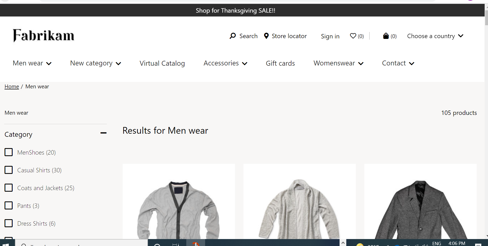
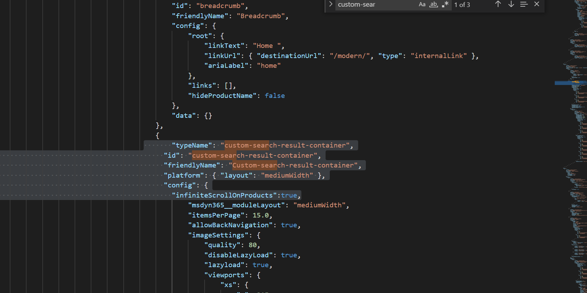

# Dynamics 365 Commerce - online extensibility samples

## License
License is listed in the [LICENSE](./LICENSE) file.

# Sample - PLP Infinite scroll

## Overview
This sample will add an infinite scroll ability to the product category/search result page to replace the default paging.



## Starter kit license
License for starter kit is listed in the [LICENSE](./module-library/LICENSE) .

## Prerequisites
Follow the instructions mentioned in [document](https://docs.microsoft.com/en-us/dynamics365/commerce/e-commerce-extensibility/setup-dev-environment) to set up the development environment.

## Detailed Steps

### 1. Add custom-search-result-container Module
In this step we will clone the search result container module and then modify to support infinite scroll.Below is the CLI for cloning the core module
**yarn msdyn365 clone search-result-container custom-search-result-container**

### 2. Add infiniteScrollOnProducts module configuration
Go to custom-search-result-container.definition.json under **src/Modules/custom-search-result-container** and replace existing code with below code.In the below code a new infiniteScrollOnProducts module configuration has been added" to enable infinite scroll.

```json
{
	"$type": "contentModule",
	"friendlyName": "Search results (COPY)",
	"name": "custom-search-result-container",
	"description": "Search results is used on a search results and category page to show the list of products for a search term or category. It also includes refiners, pagination and sort options.",
	"categories": [
		"Products",
		"Search",
		"Category"
	],
	"dataActions": {
		"products": {
			"path": "./actions/get-full-products-by-collection"
		},
		"category": {
			"path": "@msdyn365-commerce-modules/retail-actions/dist/lib/get-current-category"
		},
		"listPageState": {
			"path": "./list-page-state"
		},
		"categoryHierarchy": {
			"path": "@msdyn365-commerce-modules/retail-actions/dist/lib/get-current-category-hierarchy",
			"runOn": "server"
		},
		"searchConfiguration": {
			"path": "./actions/get-mapped-search-configuration"
		},
		"refiners": {
			"path": "./actions/get-refiners-for-collection"
		},
		"featureProduct": {
			"path": "@msdyn365-commerce-modules/retail-actions/dist/lib/get-selected-variant"
		},
		"featureState": {
			"path": "@msdyn365-commerce-modules/retail-actions/dist/lib/get-feature-state",
			"runOn": "server"
		}
	},
	"config": {
		"itemsPerPage": {
			"friendlyName": "Items per page",
			"description": "Number of items to be displayed per page",
			"type": "number",
			"minimum":20,
			"scope": "module"
		},
		"PageConfiguration": {
			"friendlyName": "Page configuration",
			"description": "Array of configurable number of items per page",
			"type": "array",
			"items": {
			  "type": "number"
			}
		},
		"allowBackNavigation": {
			"friendlyName": "Allow back on PDP",
			"description": "If set to true, back link will be displayed on PDP breadcrumb",
			"type": "boolean",
			"default": false,
			"scope": "module"
		},
		"imageSettings": {
			"friendlyName": "Image settings",
			"description": "Image settings for product items",
			"type": "imageSettings"
		},
		"expandRefinersCount": {
			"friendlyName": "Expand Refiners",
			"type": "string",
			"description": "Number of Refiner Menu should be expanded on load",
			"enum": {
				"all": "All",
				"one": "1",
				"two": "2",
				"three": "3",
				"four": "4"
			},
			"default": "all"
		},
		"disableHierarchy": {
			"friendlyName": "Hide category hierarchy display",
			"description": "If set to true, the default category hierarchy will not be displayed",
			"type": "boolean",
			"default": false,
			"scope": "module"
		},
		"includeAttributes": {
			"friendlyName": "Include product attributes in search results",
			"description": "Search results API response includes product attributes when this setting is turned on. Attributes will not be displayed in the user interface but will be available in the response",
			"type": "boolean",
			"default": false,
			"scope": "module"
		},
		"enableAffiliationBasedPricing": {
			"friendlyName": "Show affiliation prices",
			"description": "Displays affiliation price when a user with one or more affiliation browses the list",
			"type": "boolean",
			"default": false,
			"scope": "module"
		},
		"updateRefinerPanel": {
			"friendlyName": "Update refiner panel",
			"description": "This setting updates the refiner panel based on the refiners selected to narrow down the available refiner options.",
			"type": "boolean",
			"default": false,
			"scope": "module"
		},
		"className": {
			"friendlyName": "Custom CSS class name",
			"description": "Provide a custom css class name defined in the theme pack to target the CSS for this module",
			"type": "string",
			"default": ""
		},
		"infiniteScrollOnProducts": {
            "friendlyName": "Infinite Scroll on Products",
            "description": "Infinite Scroll on Products",
            "type": "boolean",
            "default": true
        }
	},
	"resources": {
		"noResultsForRefinersText": {
			"value": "No products found for the selected criteria.",
			"comment": "Message to display when no products are returned with applied refinement criteria"
		},
		"resultCategoryNotFoundText": {
			"value": "No products found for the selected category",
			"comment": "Result not found text for category page"
		},
		"resultSearchNotFoundText": {
			"value": "No products found for the given search term",
			"comment": "Result not found text for search page"
		},
		"paginationAriaLabel": {
			"value": "Page navigation example",
			"comment": "Text for pagination aria label"
		},
		"priceFree": {
			"value": "Free",
			"comment": "Text to show when product is free"
		},
		"priceRangeSeparator": {
			"value": " - ",
			"comment": "Separator when showing price range"
		},
		"originalPriceText": {
			"comment": "String that corresponds to the original price screen reader text",
			"value": "Original price"
		},
		"currentPriceText": {
			"comment": "String that corresponds to the current price screen reader text",
			"value": "Current price"
		},
		"ratingAriaLabel": {
			"value": "Average {0} of {1} stars",
			"comment": "Text to inform the average rating where {0} and {1} are the ranges"
		},
		"flipperNext": {
			"comment": "flipperNext config value",
			"value": "Next"
		},
		"flipperPrevious": {
			"comment": "flipperPrevious config value",
			"value": "Previous"
		},
		"searchTextPrefix": {
			"comment": "Sets the prefix to the search text to display as the collection title if a search was performed",
			"value": "Results for "
		},
		"numberOfProducts": {
			"comment": "String to define the number of products returned found for a search term",
			"value": "{0} products"
		},
		"oneProduct": {
			"comment": "String to define the only one product being returned for search",
			"value": "1 product"
		},
		"categoryLinkAriaLabel": {
			"comment": "Aria-Label text for links to other categories within the hierarchy",
			"value": "Go To:"
		},
		"sortByDropdownLabel": {
			"comment": "Label used for the sort-by dropdown",
			"value": "Sort by:"
		},
		"sortByOptionNameAsc": {
			"comment": "Text used for the sort-by dropdown option of name A-Z",
			"value": "Name: A to Z"
		},
		"sortByOptionNameDesc": {
			"comment": "Text used for the sort-by dropdown option of name Z-A",
			"value": "Name: Z to A"
		},
		"sortByOptionPriceAsc": {
			"comment": "Text used for the sort-by dropdown option of price low-high",
			"value": "Price: Low to High"
		},
		"sortByOptionPriceDesc": {
			"comment": "Text used for the sort-by dropdown option of price high-low",
			"value": "Price: High to Low"
		},
		"sortByOptionRatingDesc": {
			"comment": "Text used for the sort-by dropdown option of rating high-low",
			"value": "Rating: High to Low"
		},
		"sortByOptionBestSelling": {
			"comment": "Text used for the sort-by dropdown option of best selling",
			"value": "Best Selling"
		},
		"sortByOptionNewScore": {
			"comment": "Text used for the sort-by dropdown option of new score",
			"value": "New"
		},
		"sortByOptionTrendingScore": {
			"comment": "Text used for the sort-by dropdown option of trending score",
			"value": "Trending"
		},
		"sortByOptionRelevanceDesc": {
			"comment": "Text used for the sort-by dropdown option of relevance high-low",
			"value": "Relevance"
		},
		"placeholderTextMax": {
			"comment": "Placeholder text to display on the maximum input box for input range refiners",
			"value": "No Max"
		},
		"minLabel": {
			"comment": "Label to display with the minimum input box for input range refiners",
			"value": "Min"
		},
		"maxLabel": {
			"comment": "Label to display with the maximum input box for input range refiners",
			"value": "Max"
		},
		"rangeNameFormat": {
			"comment": "Format of name to display on range refiner min-max groups",
			"value": "{0} Range"
		},
		"validationErrorNotNumber": {
			"comment": "Error message to display when a value entered for range refiner min-max is non-numeric",
			"value": "Input should be a number"
		},
		"validationErrorNotRange": {
			"comment": "Error message to display when a value entered for range refiner min-max results in an invalid range",
			"value": "Invalid range: minimum should be less than maximum"
		},
		"clearAllText": {
			"comment": "Text on the button that clears all selected choices, often Clear All or Reset Filters",
			"value": "Clear all"
		},
		"choiceSummaryLabel": {
			"comment": "Optional text to display next to the summary of choices when there is at least one choice selected",
			"value": ""
		},
		"choiceFormat": {
			"comment": "Format of choice to display, where {0} is the name of the refiner and {1} is the refiner value",
			"value": "{1}"
		},
		"choiceRangeValueFormat": {
			"comment": "Format of choice value to display when it specifies a range, where {0} is the minimum value and {1} is the maximum value",
			"value": "{0}-{1}"
		},
		"choiceAriaLabel": {
			"value": "button press enter and space key to remove filter",
			"comment": "Text to show for choice summary aria label"
		},
		"modalTitle": {
			"comment": "Text display as modal title.",
			"value": "Sort & filter"
		},
		"modalCloseButtonText": {
			"comment": "Text display on the button used to close the sort and filter modal.",
			"value": "Close"
		},
		"minValueSliderThumbAriaLabel": {
			"comment": "Aria-label for the min value slider thumb in rangeRefineItem",
			"value": "Minimum price"
		},
		"maxValueSliderThumbAriaLabel": {
			"comment": "Aria-label for the max value slider thumb in rangeRefineItem",
			"value": "Maximum price"
		},
		"featureSimilarLooksTitle": {
			"comment": "Text display on the search feature module as title",
			"value": "Similar Looks to"
		},
		"featureSimilarDescriptionTitle": {
			"comment": "Text display on the search feature module as title",
			"value": "Similar Description to"
		}
	},
	"slots": {
		"quickview": {
			"friendlyName": "Quick View Button",
			"description": "This the slot for the quick view button on product card",
			"max": 1,
			"min": 0,
			"allowedCategories": [
				"quickview"
			]
		}
	}
}

```

### 3.Extend search-result-container 
Go to custom-search-result-container.tsx under **src/Modules/custom-search-result-container** and replace existing code with below code.Added "loadMoreProducts and getCollectionProducts" functions to achive infinite scroll. 

```typescript
/*--------------------------------------------------------------
 * Copyright (c) Microsoft Corporation. All rights reserved.
 * See License.txt in the project root for license information.
 *--------------------------------------------------------------*/

/* eslint-disable no-duplicate-imports */
import { ArrayExtensions } from '@msdyn365-commerce-modules/retail-actions';
import {
    getTelemetryObject,
    ILabeledDropdownOnChangeNotification,
    ILabeledDropdownOption,
    IModuleProps,
    INodeProps,
    ITelemetryContent,
    LabeledDropdown,
    UncontrolledPagination
} from '@msdyn365-commerce-modules/utilities';
import { CategoryHierarchy as CategoryHierarchyData, IProductRefinerHierarchy } from '@msdyn365-commerce/commerce-entities';
import MsDyn365 from '@msdyn365-commerce/core';
import { getCartFromCustomer } from '@msdyn365-commerce/global-state';
import {
    format,
    ProductPrice,
    ProductRefinerValue,
    ProjectionDomain,
    SortColumn,
    TextValueTranslation
} from '@msdyn365-commerce/retail-proxy';
import { getActivePricesAsync } from '@msdyn365-commerce/retail-proxy/dist/DataActions/ProductsDataActions.g';
import classnames from 'classnames';
import { debounce } from 'lodash';
import { computed, observable, reaction, transaction } from 'mobx';
import { observer } from 'mobx-react';
import * as React from 'react';

import {
    buildListPageUrl,
    getCollectionProducts,
    getCollectionRefinersAction,
    getCurrentUrl,
    GetFullProductsByCollectionInput,
    parseQueryParam,
    RefinersByCollectionInput,
    sortOptions
} from './actions';
import { hydrateRefinersFromUrl } from './actions/url-utils';
import {
    ErrorMessage,
    FeatureSearchResultItem,
    getUpdatedRefinementCriteria,
    IChoiceSummaryClickNotification,
    IRefineItemCommonProps,
    IRefineItemToggleNotification,
    ISearchResultModalViewProps,
    isMatchingRefinementCriterion,
    Link,
    ModalToggle,
    ProductSearchResultItems,
    SearchResultModal,
    Separator,
    Title
} from './components';
import ChoiceSummary from './components/choice-summary';
import RefineSubmenu from './components/refine-submenu';
import { ICustomSearchResultContainerData } from './custom-search-result-container.data';
import { expandRefinersCount, ICustomSearchResultContainerProps } from './custom-search-result-container.props.autogenerated';

export interface ISearchResultContainerViewProps extends ICustomSearchResultContainerProps<ICustomSearchResultContainerData> {
    products?: React.ReactNode;
    className?: string;
    SearchResultContainer: IModuleProps;
    TitleViewProps: ITitleViewProps;
    categoryHierarchy: ICategoryHierarchyViewProps;
    pagination?: React.ReactNode;
    PageSizeContainer: INodeProps;
    ProductsContainer: INodeProps;
    ProductSectionContainer: INodeProps;
    refineMenu: IRefineMenuViewProps;
    sortByOptions: ISortByViewProps;
    filterByOptions: IFilterByPageSizeProps;
    choiceSummary?: React.ReactNode;
    modalToggle: React.ReactNode;
    searchResultModal: ISearchResultModalViewProps;
    isMobile: boolean;
    CategoryNavContainer: INodeProps;
    RefineAndProductSectionContainer: INodeProps;
    errorMessage: React.ReactNode;
    FeatureSearchContainer: INodeProps;
    similarLookProduct?: React.ReactNode;
    productPrices?: ProductPrice[];
}

export interface ITitleViewProps {
    TitleContainer: INodeProps;
    title: ISearchResultTitle;
}

export interface IRefineMenuViewProps {
    RefineMenuContainer: INodeProps;
    RefinerSectionContainer: INodeProps;
    refiners?: React.ReactNode[];
}

export interface ICategoryHierarchyViewProps {
    categoryHierarchyList?: React.ReactNode[];
    categoryHierarchySeparator?: React.ReactNode;
    CategoryHierarchyContainer: INodeProps;
}

export interface ISortByViewProps {
    SortingContainer: INodeProps;
    sortByDropDown?: React.ReactNode;
}

export interface IFilterByPageSizeProps {
    FilterContainer: INodeProps;
    filterByDropDown?: React.ReactNode;
}

export type GridSize = 'xs' | 'sm' | 'md' | 'lg' | 'xl';

/**
 * Title component for search result container.
 */
export interface ISearchResultTitle {
    titlePrefix?: React.ReactNode;
    titleText?: React.ReactNode;
    titleCount?: React.ReactNode;
}

export interface ISearchResultContainerState {
    sortingState: ISortByCollectionState;
    modalIsOpen: boolean;
    isLoadMore: boolean;
    refiners: IProductRefinerHierarchy[];
}

/**
 * SearchResultConstant enumerations.
 */
enum SearchResultConstant {
    One = 1,
    timeOut = 200,
    multiplier = 2,
    pageSize = 100
}

interface ISortByCollectionState {
    selectedSortByOption: ILabeledDropdownOption;
    pending: boolean;
}

/**
 *
 * SearchResultContainer component.
 * @extends {React.PureComponent<ICustomSearchResultContainerProps<ICustomSearchResultContainerData>>}
 */
@observer
export default class SearchResultContainer extends React.PureComponent<
    ICustomSearchResultContainerProps<ICustomSearchResultContainerData>,
    ISearchResultContainerState
> {
    @computed get isMobile(): boolean {
        return this._viewport === 'xs' || this._viewport === 'sm';
    }

    private readonly sortByDropdownOptions: ILabeledDropdownOption[] = [
        { key: sortOptions.sortByOptionRelevanceDesc, value: this.props.resources.sortByOptionRelevanceDesc },
        { key: sortOptions.sortByOptionNameAsc, value: this.props.resources.sortByOptionNameAsc },
        { key: sortOptions.sortByOptionNameDesc, value: this.props.resources.sortByOptionNameDesc },
        { key: sortOptions.sortByOptionPriceAsc, value: this.props.resources.sortByOptionPriceAsc },
        { key: sortOptions.sortByOptionPriceDesc, value: this.props.resources.sortByOptionPriceDesc },
        { key: sortOptions.sortByOptionRatingDesc, value: this.props.resources.sortByOptionRatingDesc },
        { key: sortOptions.sortByOptionBestSelling, value: this.props.resources.sortByOptionBestSelling },
        { key: sortOptions.sortByOptionNewScore, value: this.props.resources.sortByOptionNewScore },
        { key: sortOptions.sortByOptionTrendingScore, value: this.props.resources.sortByOptionTrendingScore }
    ];

    private readonly _refineItemCommonProps: IRefineItemCommonProps;

    private readonly _pageType: string | undefined = this.props.context.request.urlTokens.pageType;

    @observable
    private _viewport: GridSize;

    @observable
    private _currentPageNumber: number;

    private readonly _modalToggleRef: React.RefObject<HTMLButtonElement>;

    private readonly _sortAndFilterContainerRef: React.RefObject<LabeledDropdown>;

    private expandrefinerCount: number | undefined = 0;

    private readonly telemetryContent: ITelemetryContent;

    private productPrices: ProductPrice[];

    private readonly defaultPageNumber = 0;

    public static getFriendlyName(locale: string, nameTranslations?: TextValueTranslation[]): string | undefined {
        let nameTranslation: TextValueTranslation | undefined;
        if (locale && nameTranslations && nameTranslations.length > 0) {
            nameTranslation = nameTranslations.find(item => item.Language!.toLowerCase() === locale.toLowerCase());
        }

        return nameTranslation && nameTranslation.Text;
    }

    constructor(props: ICustomSearchResultContainerProps<ICustomSearchResultContainerData>, state: ISearchResultContainerState) {
        super(props);
        this._viewport =
            props.context.request && props.context.request.device && props.context.request.device.Type === 'Mobile' ? 'xs' : 'lg';
        this._currentPageNumber = 0;
        this._modalToggleRef = React.createRef<HTMLButtonElement>();
        this._sortAndFilterContainerRef = React.createRef<LabeledDropdown>();
        this._toggleModal = this._toggleModal.bind(this);
        this._updateViewport = this._updateViewport.bind(this);
        this.productPrices = [];

        if (props.config.infiniteScrollOnProducts && MsDyn365.isBrowser) {
            window.addEventListener(
                'scroll',
                debounce(() => {
                    if (
                        window.innerHeight * SearchResultConstant.multiplier + document.documentElement.scrollTop >=
                        document.documentElement.offsetHeight - window.innerHeight * SearchResultConstant.multiplier
                    ) {
                        this.loadMoreProducts();
                    }
                }, SearchResultConstant.timeOut)
            );
        }
        this.state = {
            sortingState: {
                pending: false,
                selectedSortByOption: this.sortByDropdownOptions[0]
            },
            modalIsOpen: false,
            isLoadMore: false,
            refiners: []
        };
        const { placeholderTextMax, minLabel, maxLabel, rangeNameFormat } = this.props.resources;

        const locale = this.props.context.request.locale;
        const telemetry = this.props.telemetry;
        const validationErrorNaN = this.props.resources.validationErrorNotNumber;
        const validationErrorRange = this.props.resources.validationErrorNotRange;
        this._refineItemCommonProps = {
            telemetry,
            locale,
            placeholderTextMax,
            minLabel,
            maxLabel,
            rangeNameFormat,
            validationErrorNaN,
            validationErrorRange
        };
        this.telemetryContent = getTelemetryObject(
            this.props.context.request.telemetryPageName!,
            this.props.friendlyName,
            this.props.telemetry
        );

        // Initalization of list page
        this.props.data.products.then(products => {
            this.props.data.listPageState.then(listPageState => {
                if (this._pageType === 'Category') {
                    listPageState.pageType = 'Category';
                } else {
                    listPageState.pageType = 'Search';
                }

                let querySorting: SortColumn[] = [];

                if (this.props.context.request.query && this.props.context.request.query.sorting) {
                    querySorting = JSON.parse(decodeURIComponent(this.props.context.request.query.sorting)) as SortColumn[];
                }
                if (this.props.context.request.query && this.props.context.request.query.top) {
                    const queryPageSize = this.props.context.request.query.top ? +this.props.context.request.query.top : 0;
                    this.props.config.itemsPerPage = queryPageSize > 0 ? queryPageSize : this.props.config.itemsPerPage;
                }

                listPageState.currentPageNumber =
                    (this.props.context.request.query && +this.props.context.request.query.skip / (this.props.config.itemsPerPage || 10)) ||
                    0;
                listPageState.sortingCritera = { Columns: querySorting };
                listPageState.pageSize = this.props.config.itemsPerPage || 10;
                listPageState.activeProducts = products.products;
                listPageState.totalProductCount = products.count;
                listPageState.activeFilters = hydrateRefinersFromUrl(this.props.context.request);

                // Initialize reaction based on listPageState properties
                reaction(
                    () => {
                        return [
                            listPageState.activeFilters && listPageState.activeFilters.length,
                            this._currentPageNumber,
                            listPageState.sortingCritera &&
                                listPageState.sortingCritera.Columns &&
                                listPageState.sortingCritera.Columns.length
                        ];
                    },
                    () => {
                        const input = new GetFullProductsByCollectionInput(
                            listPageState.pageType,
                            this.props.context.request.apiSettings,
                            {
                                Paging: {
                                    Top: this.props.config.itemsPerPage,
                                    Skip: Math.max(listPageState.pageSize * (listPageState.currentPageNumber || 0), 0)
                                },
                                count: true,
                                Sorting: listPageState.sortingCritera || {}
                            },
                            listPageState.activeFilters || [],
                            +(this.props.context.request.urlTokens.itemId || 0),

                            this.props.context.request.query && this.props.context.request.query.q
                                ? this.props.context.request.query.q
                                : JSON.stringify({
                                      ProductId: this.props.context.request.query?.productId,
                                      Recommendation: this.props.context.request.query?.recommendation
                                  }),
                            !!(
                                this.props &&
                                this.props.config &&
                                this.props.config.includeAttributes !== undefined &&
                                this.props.config.includeAttributes
                            ),
                            this.props.config.updateRefinerPanel,
                            this.props.context.request.locale
                        );
                        getCollectionProducts(input, this.props.context.actionContext).then(productResults => {
                            listPageState.totalProductCount = productResults.count;
                            if (
                                this.props.config.enableAffiliationBasedPricing &&
                                this.props.context.actionContext.requestContext?.user?.isAuthenticated
                            ) {
                                this._getActivePrice();
                            }
                            const itemsPerPage = this.props.config.itemsPerPage ?? 0;
                            if (listPageState.currentPageNumber === 0) {
                                listPageState.activeProducts = [];
                                this._currentPageNumber = listPageState.currentPageNumber;
                            }
                            if (this.state.isLoadMore && productResults.count > itemsPerPage) {
                                listPageState.activeProducts = [...listPageState.activeProducts, ...productResults.products];
                                this.setState({ isLoadMore: false });
                            } else {
                                listPageState.activeProducts = [...listPageState.activeProducts, ...productResults.products];
                            }
                        });

                        if (this.props.config.updateRefinerPanel) {
                            const refinerInput = new RefinersByCollectionInput(
                                listPageState.pageType,
                                this.props.context.request.apiSettings,
                                {
                                    Paging: {
                                        Top: this.props.config.itemsPerPage,
                                        Skip: Math.max(
                                            listPageState.pageSize * (listPageState.currentPageNumber ?? this.defaultPageNumber),
                                            this.defaultPageNumber
                                        )
                                    },
                                    count: true,
                                    Sorting: listPageState.sortingCritera ?? {}
                                },
                                listPageState.activeFilters ?? [],
                                +(this.props.context.request.urlTokens.itemId ?? 0),
                                this.props.context.request.query?.q
                                    ? this.props.context.request.query.q
                                    : this.props.context.request.query?.productId,
                                false,
                                this.props.config.updateRefinerPanel
                            );

                            getCollectionRefinersAction(refinerInput, this.props.context.actionContext)
                                .then(refiners => {
                                    this.setState({ refiners });
                                })
                                .catch(error => {
                                    this.props.telemetry.error(error);
                                });
                        }
                    }
                );
                reaction(
                    () => listPageState.pageSize,
                    pageSize => {
                        this.props.config.itemsPerPage = pageSize;
                        const input = new GetFullProductsByCollectionInput(
                            listPageState.pageType,
                            this.props.context.request.apiSettings,
                            {
                                Paging: {
                                    Top: this.props.config.itemsPerPage,
                                    Skip: Math.max(listPageState.pageSize * (listPageState.currentPageNumber || 0), 0)
                                },
                                count: true,
                                Sorting: listPageState.sortingCritera || {}
                            },
                            listPageState.activeFilters || [],
                            +(this.props.context.request.urlTokens.itemId || 0),
                            this.props.context.request.query && this.props.context.request.query.q
                                ? this.props.context.request.query.q
                                : JSON.stringify({
                                      ProductId: this.props.context.request.query?.productId,
                                      Recommendation: this.props.context.request.query?.recommendation
                                  }),
                            !!(
                                this.props &&
                                this.props.config &&
                                this.props.config.includeAttributes !== undefined &&
                                this.props.config.includeAttributes
                            ),
                            this.props.config.updateRefinerPanel,
                            this.props.context.request.locale
                        );
                        getCollectionProducts(input, this.props.context.actionContext).then(productResults => {
                            listPageState.activeProducts = productResults.products;
                            listPageState.totalProductCount = productResults.count;
                            if (
                                this.props.config.enableAffiliationBasedPricing &&
                                this.props.context.actionContext.requestContext?.user?.isAuthenticated
                            ) {
                                // tslint:disable-next-line:no-floating-promises
                                this._getActivePrice();
                            }
                        });
                        this._getPagination();
                    }
                );
            });
        });

        if (this.props.context.request.query?.productId) {
            this.props.data.featureProduct.then(products => {
                this.props.data.listPageState.then(listPageStateFeature => {
                    listPageStateFeature.featureProduct = products;
                });
            });
        }
        this._updateViewport();
    }

    public componentDidMount(): void {
        if (MsDyn365.isBrowser && window.addEventListener) {
            window.addEventListener('resize', this._updateViewport);
            this._updateViewport();
        }
        if (this.props.config.enableAffiliationBasedPricing && this.props.context.actionContext.requestContext?.user?.isAuthenticated) {
            this._getActivePrice();
        }
    }

    public componentWillUnmount(): void {
        if (MsDyn365.isBrowser && window.removeEventListener) {
            window.removeEventListener('resize', this._updateViewport);
        }
    }

    public render(): JSX.Element {
        const { imageSettings, className } = this.props.config;
        const { resources } = this.props;
        const products = (this.props.data.listPageState.result && this.props.data.listPageState.result.activeProducts) || [];
        const searchProduct = (this.props.data.listPageState.result && this.props.data.listPageState.result.featureProduct) || null;
        let errorText = '';
        if (!products || products.length === 0) {
            errorText = this._pageType === 'Category' ? resources.resultCategoryNotFoundText : resources.resultSearchNotFoundText;
        }
        const productsComponent = this._getProducts();
        const featureComponent = (
            <FeatureSearchResultItem
                product={searchProduct}
                context={this.props.context}
                imageSettings={imageSettings}
                resources={resources}
                moduleType={this.props.typeName}
                moduleId={this.props.id}
                telemetryContent={this.telemetryContent}
                recommendation={this.props.context.request.query && this.props.context.request.query?.recommendation}
            />
        );

        const searchResultContainerViewProps = {
            ...this.props,
            products: productsComponent,
            TitleViewProps: this._getCollectionTitle(),
            categoryHierarchy: !this.props.config.disableHierarchy && this._getCategoryHierarchy(),
            refineMenu: this._getRefineMenu(),
            className: classnames('ms-search-result-container', className),
            SearchResultContainer: {
                moduleProps: this.props,
                className: classnames('ms-search-result-container', className)
            },
            sortByOptions:
                this.props.data.listPageState.result && this.props.data.listPageState.result.totalProductCount !== 0
                    ? this._getSortingDropDown()
                    : null,
            pagination: this.props.config.infiniteScrollOnProducts !== true ? this._getPagination() : null,
            PageSizeContainer: { className: 'ms-search-result-wrapper-sort-by-category' },
            ProductsContainer: { className: 'ms-search-result-container__Products' },
            ProductSectionContainer: { className: 'ms-search-result-container__product-section' },
            CategoryNavContainer: { className: 'ms-search-result-container__category-nav-section' },
            RefineAndProductSectionContainer: { className: 'ms-search-result-container__refine-product-section' },
            choiceSummary: this._getChoiceSummary(),
            modalToggle:
                this.props.data.listPageState.result && this.props.data.listPageState.result.totalProductCount !== 0 ? (
                    <ModalToggle
                        text={resources.modalTitle}
                        ariaLabel={resources.modalTitle}
                        innerRef={this._modalToggleRef}
                        onClick={this._toggleModal}
                        id='search-result-modal'
                    />
                ) : null,
            searchResultModal: this._getSearchResultModal(),
            isMobile: this.isMobile,
            errorMessage: errorText && <ErrorMessage text={errorText} />,
            FeatureSearchContainer: { className: 'ms-feature-search-result' },
            similarLookProduct:
                this.props.data.listPageState.result &&
                this.props.data.listPageState.result.featureProduct !== null &&
                this.props.data.listPageState.result.featureProduct !== undefined
                    ? featureComponent
                    : null,
            productPrices: this.productPrices
        };
        return this.props.renderView(searchResultContainerViewProps) as React.ReactElement;
    }

    /**
     * LoadMoreProducts - load more records.
     */
    private readonly loadMoreProducts = (): void => {
        this.props.data.listPageState
            .then(listPageState => {
                const count: number = listPageState.totalProductCount!;
                const length: number = listPageState.activeProducts.length;
                if (length >= count) {
                    return;
                }
                listPageState.pageSize = this.props.config.itemsPerPage ?? SearchResultConstant.pageSize;
                listPageState.currentPageNumber = listPageState.currentPageNumber! + SearchResultConstant.One;

                this._currentPageNumber = listPageState.currentPageNumber;
                this.setState({ isLoadMore: true });
            })
            .catch((error: Error) => {
                this.props.telemetry.error(error.message);
            });
    };
    private readonly _getActivePrice = async (): Promise<void> => {
        let products = (this.props.data.listPageState.result && this.props.data.listPageState.result.activeProducts) || [];
        const productRecIds = ArrayExtensions.hasElements(products) ? products.map(prod => prod.RecordId) : [];
        const projectDomain: ProjectionDomain = {
            ChannelId: this.props.context.request.apiSettings.channelId,
            CatalogId: this.props.context.request.apiSettings.catalogId
        };
        const cart = await getCartFromCustomer(this.props.context.actionContext);
        const affliations = cart?.AffiliationLines;

        await getActivePricesAsync(
            { callerContext: this.props.context.actionContext, queryResultSettings: {} },
            projectDomain,
            productRecIds,
            new Date(),
            null,
            affliations,
            true
        )
            .then((activePricesResponse: ProductPrice[]) => {
                this.productPrices = activePricesResponse;
                products = products.map(prod => {
                    const activePrice = activePricesResponse.find(price => price.ProductId === prod.RecordId);
                    if (activePrice) {
                        prod.Price = activePrice.CustomerContextualPrice ?? prod.Price;
                        prod.BasePrice = Math.max(
                            activePrice.BasePrice || 0,
                            activePrice.TradeAgreementPrice || 0,
                            activePrice.AdjustedPrice || 0
                        );
                    }
                    return prod;
                });
                this.props.data.listPageState.then(listPageState => {
                    listPageState.activeProducts = products;
                });
            })
            .catch((error: Error) => {
                this.props.context.actionContext.trace(error.message);
                this.props.context.actionContext.telemetry.exception(error);
                this.props.context.actionContext.telemetry.debug(
                    '[get Affiliation based price on search result container ]Error executing action'
                );
                throw new Error('[get Affiliation based price on search result container]Error executing action');
            });
    };

    private readonly _getSearchResultModal = (): ISearchResultModalViewProps => {
        const { resources } = this.props;
        return SearchResultModal({
            resources: {
                modalCloseButtonText: resources.modalCloseButtonText,
                modalTitle: resources.modalTitle
            },
            isOpen: this.state.modalIsOpen,
            returnRef: this._modalToggleRef,
            onModalToggle: this._toggleModal
        });
    };

    private readonly _getCollectionTitle = (): ITitleViewProps => {
        const { data, context, resources } = this.props;

        let collectionTitle: string | undefined = '';
        if (context && context.request && context.request.query && context.request.query.q) {
            collectionTitle = `"${context.request.query.q}"`;
        } else {
            collectionTitle =
                (data.category.result &&
                    SearchResultContainer.getFriendlyName(context.request.locale, data.category.result.NameTranslations)) ||
                (data.category.result && data.category.result.Name);
        }
        let productCountText = '';
        let productCountNumber: number | undefined;
        if (data.listPageState && data.listPageState.result && data.listPageState.result.totalProductCount !== undefined) {
            productCountNumber = data.listPageState.result.totalProductCount;
        } else if (data.products && data.products.result) {
            productCountNumber = data.products.result.count;
        }

        if (productCountNumber && productCountNumber !== 0) {
            productCountText =
                productCountNumber !== 1
                    ? format(this.props.resources.numberOfProducts, productCountNumber)
                    : this.props.resources.oneProduct;
        } else {
            productCountText = format(this.props.resources.numberOfProducts, 0);
        }
        const pageName = context.request.telemetryPageName ? `result-count-${context.request.telemetryPageName.toLowerCase()}` : '';
        const titlePrefix = <Title className='ms-search-result__collection-title-prefix' text={resources.searchTextPrefix} />;
        const titleText = collectionTitle && <Title className='ms-search-result__collection-title-text' text={collectionTitle} />;
        const titleCount = <Title className='ms-search-result__collection-title-count' text={productCountText} />;

        return {
            TitleContainer: { className: `ms-search-result-container__title ${pageName}` },
            title: {
                titlePrefix,
                titleText,
                titleCount
            }
        };
    };

    private readonly _getCategoryHierarchy = (): ICategoryHierarchyViewProps => {
        const { data } = this.props;
        const categoryHierarchy = data.categoryHierarchy.result;
        const categoryLinks =
            categoryHierarchy &&
            categoryHierarchy.map((value: CategoryHierarchyData, index: number) => {
                return (
                    <Link
                        key={index}
                        text={value.Name}
                        ariaLabel={`${this.props.resources.categoryLinkAriaLabel} ${value.Name}`}
                        href={value.Url}
                    />
                );
            });
        const categoryLinkSeparator = <Separator separator='/' />;

        return {
            CategoryHierarchyContainer: { tag: 'nav', className: 'ms-search-result-container__category-hierarchy' },
            categoryHierarchyList: categoryLinks,
            categoryHierarchySeparator: categoryLinkSeparator
        };
    };
    private readonly _getSortingDropDown = (): ISortByViewProps => {
        const { resources } = this.props;
        const activeDropdown = this._getCurrentlySelectedOption() || this.state.sortingState.selectedSortByOption;
        let dropdwonOptions = this.sortByDropdownOptions;
        // eslint-disable-next-line @typescript-eslint/no-unsafe-member-access -- App config settings are of "any" value.
        if (this.props.context.app.config.hideRating) {
            dropdwonOptions = this.sortByDropdownOptions.filter(dropdownOption => dropdownOption.key !== 'AverageRating-Desc');
        }
        const dropdown = (
            <LabeledDropdown
                labelClassname='reviews-list-sort-by'
                labelText={resources.sortByDropdownLabel}
                dropdownId='categorySortByDropdown'
                dropdownClassname='reviews-list-dropdown'
                toggleColor='link'
                dropdownOptions={dropdwonOptions}
                selectedOption={activeDropdown}
                onSelectOption={this._updateSortByDropdown}
                ref={this._sortAndFilterContainerRef}
            />
        );
        return {
            SortingContainer: { className: 'ms-search-result-container__Sort-by-category' },
            sortByDropDown: dropdown
        };
    };

    private readonly _getPagination = (): React.ReactNode => {
        const { config, context, data, resources } = this.props;
        const listPageState = data && data.listPageState && data.listPageState.result;
        const fullUrl = getCurrentUrl(context.request);
        const itemsPerPage = config.itemsPerPage || 10;
        const skipCount =
            listPageState && listPageState.currentPageNumber !== null
                ? listPageState.currentPageNumber * (this.props.config.itemsPerPage || 10)
                : (this.props.context.request.query && +this.props.context.request.query.skip) || 0;
        const totalItems = (listPageState && listPageState.totalProductCount) || 0;
        const previousText = resources.flipperPrevious;
        const nextText = resources.flipperNext;

        if (totalItems <= itemsPerPage) {
            return null;
        }
        return (
            <UncontrolledPagination
                className='ms-search-result-container__pagination'
                role='navigation'
                aria-label={resources.paginationAriaLabel}
                url={fullUrl.href}
                qsp='skip'
                items={totalItems}
                itemsPerPage={itemsPerPage}
                startingItem={skipCount}
                previousText={this._renderPrev(previousText)}
                nextText={this._renderNext(nextText)}
                previousAriaLabel={previousText}
                nextAriaLabel={nextText}
                telemetryContent={this.telemetryContent}
            />
        );
    };

    private readonly _getRefineMenu = (): IRefineMenuViewProps => {
        const { data, context, config } = this.props;
        const tempRangeTypeTODO = context.request.query && context.request.query.inputRange ? 'input' : 'slider';
        const validRefiners =
            this.props.config.updateRefinerPanel && ArrayExtensions.hasElements(this.state.refiners)
                ? this.state.refiners.filter(refiner => {
                      return ArrayExtensions.hasElements(refiner.Values);
                  })
                : data.refiners.result &&
                  data.refiners.result.filter(refiner => {
                      return ArrayExtensions.hasElements(refiner.Values);
                  });

        const activeRefiners = (data.listPageState.result && data.listPageState.result.activeFilters) || [];

        this._getexpandRefinerCount(validRefiners && validRefiners.length, config.expandRefinersCount);
        const expandedRefiners = this.expandrefinerCount;
        const subMenus =
            validRefiners &&
            validRefiners.map((productRefinerHierarchy: IProductRefinerHierarchy, index: number) => {
                return (
                    <RefineSubmenu
                        productRefinerHierarchy={productRefinerHierarchy}
                        selectedRefinerValues={activeRefiners}
                        refineItemCommonProps={this._refineItemCommonProps}
                        minValueSliderThumbAriaLabel={this.props.resources.minValueSliderThumbAriaLabel}
                        maxValueSliderThumbAriaLabel={this.props.resources.maxValueSliderThumbAriaLabel}
                        key={index}
                        onUpdateRefiners={this._onUpdateRefiners}
                        urlBuilder={this._buildRefinerUrl}
                        isDisabled={false}
                        isExpandedOnInitialLoad={!!(expandedRefiners && expandedRefiners > index)}
                        tempRangeTypeTODO={tempRangeTypeTODO}
                        context={context}
                        moduleId={this.props.id}
                        moduleTypeName={this.props.typeName}
                        telemetryContent={this.telemetryContent}
                    />
                );
            });

        return {
            RefineMenuContainer: { className: 'ms-search-result-container__refine-menu' },
            RefinerSectionContainer: { className: 'ms-search-result-container__refiner-section' },
            refiners: subMenus
        };
    };

    private readonly _getChoiceSummary = (): React.ReactNode => {
        const { resources, data, telemetry } = this.props;
        const selectedRefiners = (data.listPageState.result && data.listPageState.result.activeFilters) || [];
        return (
            <ChoiceSummary
                classNames='ms-choice-summary-by-category'
                clearAllText={resources.clearAllText}
                label={resources.choiceSummaryLabel}
                selectedChoices={selectedRefiners}
                // @ts-expect-error: NOTE Type-unsafe line below, null refinersByCategoryHierarchy case not handled
                refinerHierarchy={data.refiners.result}
                choiceFormat={resources.choiceFormat}
                choiceRangeValueFormat={resources.choiceRangeValueFormat}
                telemetry={telemetry}
                onChoiceClicked={this._onChoiceClicked}
                urlBuilder={this._buildRefinerUrlForChoiceSummary}
                choiceAriaLabel={resources.choiceAriaLabel}
                telemetryContent={this.telemetryContent}
            />
        );
    };

    private _getProducts = (): JSX.Element => {
        const { imageSettings, allowBackNavigation } = this.props.config;
        const { resources } = this.props;
        const breaCrumbType = this.props.context.app.config.breadcrumbType;
        const allowBack = allowBackNavigation && (breaCrumbType === 'back' || breaCrumbType === 'categoryAndBack');
        const products = (this.props.data.listPageState.result && this.props.data.listPageState.result.activeProducts) || [];
        const quickviewslot = this.props.slots && this.props.slots.quickview && this.props.slots.quickview[0];

        return (
            <ProductSearchResultItems
                products={products}
                context={this.props.context}
                imageSettings={imageSettings}
                resources={resources}
                moduleType={this.props.typeName}
                moduleId={this.props.id}
                allowBackNavigation={allowBack}
                telemetryContent={this.telemetryContent}
                quickviewSlot={quickviewslot}
            />
        );
    };
    private readonly _updateSortByDropdown = (notification: ILabeledDropdownOnChangeNotification): void => {
        const { context } = this.props;
        const requestContext = context && context.request;
        const actionContext = context && context.actionContext;

        if (!requestContext || !actionContext || !this.props.data.listPageState.result) {
            const error = `[sort-by-category] cannot sort without context: ${!requestContext ? 'requestContext ' : ''} ${
                !actionContext ? 'actionContext ' : ''
            } could not be found`;
            this.props.telemetry.warning(error);
        }

        window.history.pushState(
            {},
            '',
            buildListPageUrl(
                getCurrentUrl(this.props.context.request),
                undefined,
                [this._getSortColumnFromSelectedOption(notification.selectedOption)],
                undefined
            )
        );
        transaction(() => {
            this.props.data.listPageState.result!.currentPageNumber = 0;
            this.props.data.listPageState.result!.sortingCritera = {
                Columns: [this._getSortColumnFromSelectedOption(notification.selectedOption)]
            };
        });
    };

    private readonly _getSortColumnFromSelectedOption = (option: ILabeledDropdownOption): SortColumn => {
        const { data } = this.props;

        if (!data.searchConfiguration.result) {
            return {};
        }

        const mappedConfiguration = data.searchConfiguration.result.find(searchConfiguration => {
            return searchConfiguration.key === option.key;
        });

        if (mappedConfiguration) {
            return mappedConfiguration.sortColumn;
        }

        return {};
    };

    private readonly _getCurrentlySelectedOption = (): ILabeledDropdownOption | undefined => {
        const { data } = this.props;
        const sortCriteria = data.listPageState.result && data.listPageState.result.sortingCritera;

        const activeSortColumn =
            (sortCriteria && sortCriteria.Columns && sortCriteria.Columns[0]) ||
            (parseQueryParam<SortColumn[]>('sorting', this.props.context.request) || [])[0];

        if (activeSortColumn && data.searchConfiguration.result) {
            const activeMappedConfig = data.searchConfiguration.result.find(mappedSearchConfig => {
                return (
                    mappedSearchConfig.sortColumn.ColumnName === activeSortColumn.ColumnName &&
                    mappedSearchConfig.sortColumn.IsDescending === activeSortColumn.IsDescending
                );
            });
            if (activeMappedConfig) {
                return this.sortByDropdownOptions.find(dropdownOption => dropdownOption.key === activeMappedConfig.key);
            }
        }

        return;
    };

    private readonly _onUpdateRefiners = (itemToggleNotification: IRefineItemToggleNotification): void => {
        const { context } = this.props;
        const requestContext = context && context.request;
        const actionContext = context && context.actionContext;

        if (!requestContext || !actionContext || !this.props.data.listPageState.result) {
            const error = `Refine menu cannot refine search criteria: ${!requestContext ? 'requestContext ' : ''} ${
                !actionContext ? 'actionContext ' : ''
            } could not be found`;
            this.props.telemetry.warning(error);
        }

        const updatedRefinementCriteria = getUpdatedRefinementCriteria(
            itemToggleNotification,
            (this.props.data.listPageState.result && this.props.data.listPageState.result.activeFilters) || []
        );

        window.history.pushState({}, '', buildListPageUrl(getCurrentUrl(this.props.context.request), updatedRefinementCriteria));
        transaction(() => {
            this.props.data.listPageState.result!.currentPageNumber = 0;
            this.props.data.listPageState.result!.activeFilters = updatedRefinementCriteria;
        });
    };

    private readonly _buildRefinerUrl = (itemToggleNotification: IRefineItemToggleNotification): string => {
        if (this.props.data.listPageState.result) {
            const newRefinementCriteria = getUpdatedRefinementCriteria(
                itemToggleNotification,
                this.props.data.listPageState.result.activeFilters || []
            );

            return buildListPageUrl(getCurrentUrl(this.props.context.request), newRefinementCriteria);
        }
        this.props.telemetry.warning('[buildRefinerQueryString]List Page State Not available, unable to build refiner URL');
        return '';
    };

    private readonly _onChoiceClicked = (notification: IChoiceSummaryClickNotification): void => {
        const { data, telemetry } = this.props;

        if (!data.listPageState.result) {
            telemetry.warning('[choice-summary-by-category._onChoiceClicked]ListPageState unavailable, unable to update refiners.');
            return;
        }

        let currentRefinementCriteria = (data.listPageState.result && data.listPageState.result.activeFilters) || [];

        if (!notification.clearAll) {
            const selectedChoice = notification.choiceClicked;
            if (!selectedChoice) {
                telemetry.warning('[choice-summary-by-category._onChoiceClicked] Choice could not be determined');
                return;
            }
            currentRefinementCriteria = currentRefinementCriteria.filter(
                (selectedCriterion: ProductRefinerValue) => !isMatchingRefinementCriterion(selectedChoice, selectedCriterion)
            );
        } else {
            currentRefinementCriteria = [];

            // Set focus to sort and filter
            const dropdownElementId = this._sortAndFilterContainerRef.current && this._sortAndFilterContainerRef.current.props.dropdownId;
            const dropdownElement = dropdownElementId && document.getElementById(dropdownElementId);
            setTimeout(() => {
                dropdownElement && dropdownElement.focus();
            }, 50);
        }

        const fullUrl = getCurrentUrl(this.props.context.request);
        window.history.pushState({}, '', buildListPageUrl(fullUrl, currentRefinementCriteria));
        data.listPageState.result.currentPageNumber = 0;
        data.listPageState.result.activeFilters = currentRefinementCriteria;
    };

    private readonly _buildRefinerUrlForChoiceSummary = (selectedRefiner: ProductRefinerValue, isClearAll: boolean): string => {
        const { data, telemetry } = this.props;
        const fullUrl = getCurrentUrl(this.props.context.request);

        if (!data.listPageState.result) {
            telemetry.warning('[choice-summary-by-category._buildRefinerUrl]ListPageState unavailable, unable to create refiner URL.');
            return fullUrl.href;
        }

        let currentRefinementCriteria = (data.listPageState.result && data.listPageState.result.activeFilters) || [];

        if (!isClearAll) {
            if (!selectedRefiner) {
                telemetry.warning('[choice-summary-by-category._buildRefinerUrl] URL for Choice could not be determined');
                return fullUrl.href;
            }
            currentRefinementCriteria = currentRefinementCriteria.filter(
                (selectedCriterion: ProductRefinerValue) => !isMatchingRefinementCriterion(selectedRefiner, selectedCriterion)
            );
        } else {
            currentRefinementCriteria = [];
        }

        return buildListPageUrl(fullUrl, currentRefinementCriteria);
    };

    private _getViewport(): GridSize {
        const { context } = this.props;

        // Always render in mobile viewport on a mobile device
        if (context.request && context.request.device && context.request.device.Type === 'Mobile') {
            return 'xs';
        }

        if (MsDyn365.isBrowser && window.innerWidth) {
            const gridSettings = context.request.gridSettings;
            if (gridSettings) {
                if (gridSettings.xs && window.innerWidth <= gridSettings.xs.w) {
                    return 'xs';
                } else if (gridSettings.sm && window.innerWidth <= gridSettings.sm.w) {
                    return 'sm';
                } else if (gridSettings.md && window.innerWidth <= gridSettings.md.w) {
                    return 'md';
                } else if (gridSettings.lg && window.innerWidth <= gridSettings.lg.w) {
                    return 'lg';
                }
                return 'xl';
            }
        }

        return 'lg';
    }

    private _toggleModal(): void {
        this.setState({
            modalIsOpen: !this.state.modalIsOpen
        });
    }

    private _updateViewport(): void {
        this._viewport = this._getViewport();

        if (this.state.modalIsOpen && !this.isMobile) {
            this._toggleModal();
        }
    }

    private readonly _getexpandRefinerCount = (validRefiners?: number, refinerCount?: expandRefinersCount): void => {
        switch (refinerCount) {
            case expandRefinersCount.all:
                this.expandrefinerCount = validRefiners;
                break;
            case expandRefinersCount.one:
                this.expandrefinerCount = 1;
                break;
            case expandRefinersCount.two:
                this.expandrefinerCount = 2;
                break;
            case expandRefinersCount.three:
                this.expandrefinerCount = 3;
                break;
            case expandRefinersCount.four:
                this.expandrefinerCount = 4;
                break;
            default:
                this.expandrefinerCount = 0;
        }
    };

    /**
     * Renders a Pagination previous text.
     * @param  paginationPreviousText - Pagination previous text from resources.
     * @returns Previous text and flipper icon.
     */
    private readonly _renderPrev = (paginationPreviousText: string) => {
        return (
            <div className='msc-pagination__prev'>
                <span className='ms-search-result__pagination-left' aria-hidden='true' />
                <span className='prev-text'>{paginationPreviousText}</span>
            </div>
        );
    };

    /**
     * Renders a Pagination next text.
     * @param  paginationNextText - Pagination next text from resources.
     * @returns Next text and flipper icon.
     */
    private readonly _renderNext = (paginationNextText: string) => {
        return (
            <div className='msc-pagination__next'>
                <span className='next-text'>{paginationNextText}</span>
                <span className='ms-search-result__pagination-right' aria-hidden='true' />
            </div>
        );
    };
}

```

### 4. Copy the dependencies
Go to index.ts under **src/Modules/custom-search-result-container/actions** and replace existing code with below code.In below code added two interfaces are "IFullProductsSearchResultsWithCount" and "MappedSearchConfiguration", which are used in custom-search-result-container.tsx file.

```typescript
/*--------------------------------------------------------------
 * Copyright (c) Microsoft Corporation. All rights reserved.
 * See License.txt in the project root for license information.
 *--------------------------------------------------------------*/

/* eslint-disable no-duplicate-imports */
import { ProductSearchResult, SortColumn } from '@msdyn365-commerce/retail-proxy';
import getCollectionProducts, { GetFullProductsByCollectionInput } from './get-full-products-by-collection';
import getMappedSearchConfiguration, { MappedSearchInput, sortOptions } from './get-mapped-search-configuration';
import getCollectionRefinersAction, { RefinersByCollectionInput } from './get-refiners-for-collection';

export * from './base-collection-action';
export * from './url-utils';

interface IFullProductsSearchResultsWithCount {
    products: ProductSearchResult[];
    count: number;
}

// tslint:disable-next-line:interface-name
interface MappedSearchConfiguration {
    key: string;
    sortColumn: SortColumn;
}

export {
    getCollectionProducts,
    getCollectionRefinersAction,
    GetFullProductsByCollectionInput,
    getMappedSearchConfiguration,
    IFullProductsSearchResultsWithCount,
    MappedSearchConfiguration,
    MappedSearchInput,
    RefinersByCollectionInput,
    sortOptions
};

```

### 5. Remove unused dependencies
Go to choice-summary.tsx under **src/Modules/custom-search-result-container/Components** and update existing code with below code to resolve build issues in choice-summary.tsx file."ProductListInventoryFilteringOptions" had been removed in below code.

```typescript
/*--------------------------------------------------------------
 * Copyright (c) Microsoft Corporation. All rights reserved.
 * See License.txt in the project root for license information.
 *--------------------------------------------------------------*/

/* eslint-disable no-duplicate-imports */
import { IProductRefinerHierarchy } from '@msdyn365-commerce/commerce-entities';
import { ProductRefinerValue } from '@msdyn365-commerce/retail-proxy';
import { getPayloadObject, getTelemetryAttributes, IPayLoad } from '@msdyn365-commerce-modules/utilities';
import classnames from 'classnames';
import { get } from 'lodash';
import { computed } from 'mobx';
import { observer } from 'mobx-react';
import * as React from 'react';

import { IChoiceSummaryProps } from './choice-summary.props';
import { isMatchingRefinementCriterion, isRangeType } from './utilities';

interface IRefinerMap {
    key: string;
    value: ProductRefinerValue;
}

/**
 * ChoiceSummary component.
 */
@observer
export default class ChoiceSummary extends React.PureComponent<IChoiceSummaryProps> {
    private readonly closeButtonGlyph: string = 'msi-close-btn';

    private readonly payLoad: IPayLoad;

    @computed get selectedRefinersMap(): IRefinerMap[] {
        const { selectedChoices } = this.props;
        return selectedChoices.map((selectedRefiner: ProductRefinerValue) => {
            return {
                key: this._getKeyForRefinerValue(selectedRefiner),
                value: selectedRefiner
            } as IRefinerMap;
        });
    }

    constructor(props: Readonly<IChoiceSummaryProps>) {
        super(props);
        this.payLoad = getPayloadObject('click', this.props.telemetryContent!, '');
    }

    public render(): JSX.Element {
        const { clearAllText, label, classNames, choiceAriaLabel } = this.props;
        const items = this.selectedRefinersMap;
        this.payLoad.contentAction.etext = clearAllText;
        const clearAllAttributes = getTelemetryAttributes(this.props.telemetryContent!, this.payLoad);
        return (
            <div className='msc-choice-summary'>
                {items.length > 0 && label && <span className='msc-choice-summary__label'>{label}</span>}
                <ul className={classnames(classNames, 'msc-choice-summary__list', 'list-unstyled')}>
                    {items.map((item: IRefinerMap, index: number) => {
                        const listItemProps = {
                            'aria-posinset': index,
                            'aria-setsize': items.length
                        };

                        this.payLoad.contentAction.etext = item.key;
                        const attribute = getTelemetryAttributes(this.props.telemetryContent!, this.payLoad);

                        return (
                            <li className='msc-choice-summary__list-item' key={item.key} {...listItemProps}>
                                <a
                                    className='msc-choice-summary__item'
                                    href={this.props.urlBuilder(item.value, false)}
                                    aria-label={`${item.key} ${choiceAriaLabel}`}
                                    onClick={this._onClick}
                                    {...attribute}
                                >
                                    {item.key}
                                    <span className={`${this.closeButtonGlyph} msc-choice-summary__glyph`} />
                                </a>
                            </li>
                        );
                    })}
                </ul>
                {items.length > 0 && clearAllText && (
                    <a
                        href={this.props.urlBuilder({}, true)}
                        className='msc-choice-summary__clear-all'
                        {...clearAllAttributes}
                        onClick={this._onClick}
                    >
                        {clearAllText}
                    </a>
                )}
            </div>
        );
    }

    private _getKeyForRefinerValue(productRefinerValue: ProductRefinerValue): string {
        const { choiceFormat, choiceRangeValueFormat, refinerHierarchy, telemetry } = this.props;
        const overallFormat = choiceFormat || '{1}';
        const rangeFormat = choiceRangeValueFormat;
        let refinerName = '';
        if (refinerHierarchy && refinerHierarchy.find) {
            const parent = refinerHierarchy.find(
                (hierarchy: IProductRefinerHierarchy) =>
                    !!hierarchy.Values.find((value: ProductRefinerValue) => isMatchingRefinementCriterion(value, productRefinerValue))
            );

            if (!parent) {
                telemetry.warning('[choice-summary] could not find parent of selected refiner value');
            } else {
                refinerName = parent.KeyName || '';
            }
        }

        let refinerValueName: string;
        if (isRangeType(productRefinerValue.DataTypeValue)) {
            refinerValueName = rangeFormat
                .replace('{0}', this._formatPrice(productRefinerValue.LeftValueBoundString, productRefinerValue.UnitText))
                .replace('{1}', this._formatPrice(productRefinerValue.RightValueBoundString, productRefinerValue.UnitText));
        } else {
            refinerValueName = productRefinerValue.LeftValueBoundLocalizedString || productRefinerValue.LeftValueBoundString || '';
        }

        return overallFormat.replace('{0}', refinerName).replace('{1}', refinerValueName);
    }

    private _formatPrice(amount: string | undefined, currency: string | undefined): string {
        if (!amount || !currency) {
            this.props.telemetry.trace('[choice-summary] could not format price');
            return amount || '';
        }
        const priceAmount = (amount && Number(amount)) || 0;
        const locale = get(this.props, 'context.request.locale', 'en-US');
        let result: string;

        try {
            result = new Intl.NumberFormat(locale, {
                style: 'currency',
                currencyDisplay: 'symbol',
                currency,
                minimumFractionDigits: 0
            }).format(priceAmount);
        } catch (error) {
            result = `${priceAmount} ${currency}`;
            this.props.telemetry.warning(`Failed to format price for ${result}: ${error}`);
        }

        return result;
    }

    private readonly _onClick = (e: React.MouseEvent<HTMLAnchorElement>): void => {
        e.preventDefault();
        e.stopPropagation();

        const target = e.currentTarget as HTMLElement;
        const clearAll = target.getAttribute('class')!.includes('choice-summary__clear-all');
        const selectedRefiner = clearAll ? undefined : this._getSelectedRefinerChoice(target);

        if (this.props.onChoiceClicked) {
            this.props.onChoiceClicked({
                clearAll,
                itemClicked: target,
                choiceClicked: selectedRefiner,
                nextItemToFocus: target.nextSibling as HTMLElement
            });
        }
    };

    private _getSelectedRefinerChoice(itemClicked: HTMLElement): ProductRefinerValue | undefined {
        const result = this.selectedRefinersMap.find(
            selected => (itemClicked.textContent && itemClicked.textContent.trim()) === selected.key
        );
        return (result && result.value) || undefined;
    }
}

```


### Build and test module

The sample can now be tested in a web browser using the ```yarn start``` command.

### 1.Test by using mock file

Create a sample mock with name default-page.json under the **src/pageMocks** by taking mock from r1tie site PLP page of Men wear category.

Note : To verify PLP infnite scroll using mock of search result container, find search-result-container module in mock and rename search-result-container to custom-search-result-container and add below config key in config section.
config Key:
```Json
"infiniteScrollOnProducts":true
```
(refer below screen).(https://localhost:4000/?mock=default-page)
