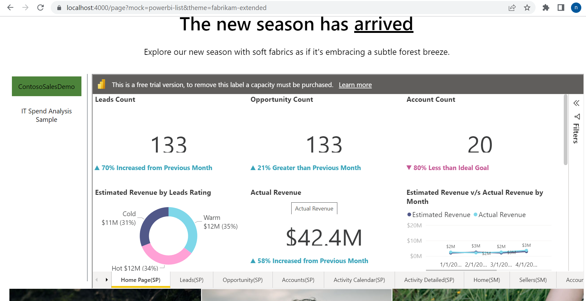
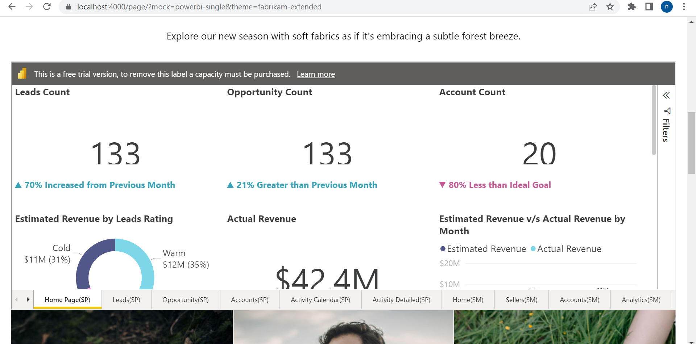

# Dynamics 365 Commerce - online extensibility samples

## License
License is listed in the [LICENSE](./LICENSE) file.

# Sample - Power BI Embedding

## Overview
In this sample, you will learn how to embed Power BI on eCommerce




## Starter kit license
License for starter kit is listed in the [LICENSE](./module-library/LICENSE).

## Prerequisites
Follow the instructions mentioned in [document](https://docs.microsoft.com/en-us/dynamics365/commerce/e-commerce-extensibility/setup-dev-environment) to set up the development environment.

### Procedure to create custom theme
Follow the instructions mentioned in [document](https://docs.microsoft.com/en-us/dynamics365/commerce/e-commerce-extensibility/create-theme) to create the custom theme,in this sample, we'll assume a custom theme has been cloned from the fabrikam theme named "fabrikam-extended".

### Deploy CRT changes
Copy the folder from **src\OnlineSDK\Extensibility Samples\PowerBI\CloudScaleUnitExtensionPackage.zip** and save in the system, and follow the instructions mentioned in [document](https://docs.microsoft.com/en-us/dynamics365/commerce/dev-itpro/csu-packaging#deploy-the-package-to-csu).

## Detailed Steps to create powerbi module
### 1.Add powerbi module
Add powerbi module using this command **yarn msdyn365 add-module powerbi**.

Go to powerbi.definition.json under **src\modules\powerbi** and replace existing code with below code.

```json
{
    "$type": "contentModule",
    "friendlyName": "Power BI",
    "name": "powerbi",
    "description": "Power bi module allows user to render power bi report",
    "categories": [
        "powerbi"
    ],
    "dataActions": {
        "powerBIDetails": {
            "path": "./actions/get-powerbi-report",
            "runOn": "client"
        }
    },
    "config": {
        "enableAuthFlow": {
            "friendlyName": "Enable Auth Flow",
            "description": "Flag to enable Authenticated flow",
            "type": "boolean",
            "default": false,
            "scope": "module"
        },
        "reportHeading": {
            "friendlyName": "Heading",
            "description": "Module heading",
            "$ref": "@msdyn365-commerce-modules/definitions/dist/src/Heading.json#/definitions/heading"
        }
    },
    "dependentSchemas": {
        "enableAuthFlow": {
            "oneOf": [
                {
                    "properties": {
                        "enableAuthFlow": {
                            "enum": {
                                "true": true
                            }
                        },
                        "scope": {
                            "friendlyName": "Scope",
                            "description": "Power BI Resource URL",
                            "type": "string",
                            "default": "https://analysis.windows.net/powerbi/api"
                        },
                        "clientId": {
                            "friendlyName": "Client Id",
                            "description": "Client Id of AAD application",
                            "type": "string",
                            "default": "f9b604ad-d957-4946-a8b1-0d9baa6f8728"
                        },
                        "workspaceId": {
                            "friendlyName": "Workspace Id",
                            "description": "Workspace Id of Power BI Report",
                            "type": "string",
                            "default": "345e1140-ff77-4a9c-a1a7-c4b92c558e5c"
                        },
                        "reportId": {
                            "friendlyName": "Report Id",
                            "description": "Report Id of Power BI Report",
                            "type": "string",
                            "default": "23fe8815-cbaf-435d-95fa-6cec2e812546"
                        }
                    }
                },
                {
                    "properties": {
                        "enableAuthFlow": {
                            "enum": {
                                "false": false
                            }
                        },
                        "reportView": {
                            "friendlyName": "Report View",
                            "description": "Defines which type of view user want to render on page",
                            "type": "string",
                            "enum": {
                                "single": "Render single Report data",
                                "list": "Render list of reports present in that group"
                            },
                            "default": "single",
                            "scope": "module"
                        }
                    }
                }
            ]
        },
        "reportView": {
            "oneOf": [
                {
                    "properties": {
                        "reportView": {
                            "enum": {
                                "single": "single"
                            }
                        },
                        "workspaceId": {
                            "friendlyName": "Workspace Id",
                            "description": "Workspace Id of Power BI Report",
                            "type": "string",
                            "default": "345e1140-ff77-4a9c-a1a7-c4b92c558e5c"
                        },
                        "reportId": {
                            "friendlyName": "Report Id",
                            "description": "Report Id of Power BI Report",
                            "type": "string",
                            "default": "23fe8815-cbaf-435d-95fa-6cec2e812546"
                        },
                        "role": {
                            "friendlyName": "Role",
                            "description": "Role configured on report",
                            "type": "string",
                            "default": "Anonymous"
                        }
                    }
                },
                {
                    "properties": {
                        "reportView": {
                            "enum": {
                                "list": "list"
                            }
                        },
                        "workspaceId": {
                            "friendlyName": "Workspace Id",
                            "description": "Workspace Id of Power BI Report",
                            "type": "string",
                            "default": "345e1140-ff77-4a9c-a1a7-c4b92c558e5c"
                        },
                        "role": {
                            "friendlyName": "Role",
                            "description": "Role configured on report",
                            "type": "string",
                            "default": "Anonymous"
                        }
                    }
                }
            ]
        }
    },
    "resources": {
        "resourceKey": {
            "comment": "resource description",
            "value": "resource value"
        }
    }
}
```

Go to powerbi.tsx under **src\modules\powerbi** and replace existing code with below code.
```typescript
/*!
 * Copyright (c) Microsoft Corporation.
 * All rights reserved. See LICENSE in the project root for license information.
 */

import * as React from 'react';

import { IPowerbiData } from './powerbi.data';
import { IPowerbiProps } from './powerbi.props.autogenerated';

export interface IPowerbiViewProps extends IPowerbiProps<IPowerbiData> {}

/**
 *
 * Powerbi component
 * @extends {React.PureComponent<IPowerbiProps<IPowerbiData>>}
 */
class Powerbi extends React.PureComponent<IPowerbiProps<IPowerbiData>> {
    constructor(props: IPowerbiProps<IPowerbiData>) {
        super(props);
    }
    public render(): JSX.Element | null {
        return this.props.renderView(this.props);
    }
}

export default Powerbi;
```

Go to powerbi.view.tsx under **src\modules\powerbi** and replace existing code with below code.
```typescript
/*!
 * Copyright (c) Microsoft Corporation.
 * All rights reserved. See LICENSE in the project root for license information.
 */

import * as React from 'react';
import { Heading } from '@msdyn365-commerce-modules/utilities';
import PowerBiReportsListComponent from './components/powerbi-reportsList.component';
import PowerBiAuthComponent from './components/powerbi-auth.component';
import { IPowerbiData } from './powerbi.data';
import { IPowerbiProps, reportView } from './powerbi.props.autogenerated';
import PowerBiAnonymousComponent from './components/powerbi-anonymous.component';

const PowerbiView = (props: IPowerbiProps<IPowerbiData>): JSX.Element => {
    const { reportHeading } = props.config;
    const reportScope: string[] = ['https://analysis.windows.net/powerbi/api/Report.Read.All'];

    const reportHeadingText = reportHeading ? (
        <Heading className='ms-power-bi__heading' headingTag={reportHeading.tag} text={reportHeading.text} />
    ) : null;

    return (
        <>
            {reportHeadingText}
            {props.config.enableAuthFlow ? (
                <PowerBiAuthComponent
                    scope={reportScope}
                    clientId={props.config.clientId ? props.config.clientId : ''}
                    workspaceId={props.config.workspaceId ? props.config.workspaceId : ''}
                    reportId={props.config.reportId ? props.config.reportId : ''}
                />
            ) : props.config.reportView === reportView.single ? (
                <PowerBiAnonymousComponent props={props} />
            ) : (
                <div className='msc-power-bi-report-list'>
                    <PowerBiReportsListComponent props={props} />
                </div>
            )}
        </>
    );
};
export default PowerbiView;
```
## Add components related files
### 1.Create components folder
create folder with name components under **src\modules\powerbi**
### 2.Create powerbi-anonymous component file
create file with name powerbi-anonymous.component.tsx under **src\modules\powerbi\components** and replace below code in it.

```typescript
/*--------------------------------------------------------------
 * Copyright (c) Microsoft Corporation. All rights reserved.
 * See License.txt in the project root for license information.
 *--------------------------------------------------------------*/

//@ts-ignore
import { factories, models, service } from 'powerbi-client';
import * as React from 'react';
import { IPowerBi } from '../../../themes/fabrikam-extended/data-actions/DataServiceEntities.g';
import { IPowerbiData } from '../powerbi.data';
import { IPowerbiProps } from '../powerbi.props.autogenerated';

let powerbi: service.Service;
if (service) {
    powerbi = new service.Service(factories.hpmFactory, factories.wpmpFactory, factories.routerFactory);
}

interface IPowerBiAnonymousState {
    embedToken: string;
    embedUrl: string;
    error: string[];
}

export interface IPowerBiAnonymousProps {
    props: IPowerbiProps<IPowerbiData>;
}

let reportContainer: HTMLElement;
let reportRef: React.Ref<HTMLDivElement>;
let loading: JSX.Element;

export default class PowerBiAnonymousComponent extends React.PureComponent<IPowerBiAnonymousProps, IPowerBiAnonymousState> {
    public constructor(props: IPowerBiAnonymousProps) {
        super(props);
        this.state = {
            embedToken: '',
            embedUrl: '',
            error: []
        };

        reportRef = React.createRef();

        // Report container
        loading = (
            <div id='reportContainer' ref={reportRef}>
                Loading the report...
            </div>
        );
    }

    public componentDidMount(): void {
        if (reportRef !== null) {
            reportContainer = reportRef['current'];
        }

        this.props.props.data.powerBIDetails.then((powerBIDetail: IPowerBi) => {
            if (powerBIDetail.EmbeddToken && powerBIDetail.EmbeddUrl) {
                this.setState({
                    embedToken: powerBIDetail.EmbeddToken,
                    embedUrl: powerBIDetail.EmbeddUrl
                });
            }
        });
    }

    public render(): JSX.Element {
        if (this.state.error.length) {
            // Cleaning the report container contents and rendering the error message in multiple lines
            reportContainer.textContent = '';
            this.state.error.forEach(line => {
                reportContainer.appendChild(document.createTextNode(line));
                reportContainer.appendChild(document.createElement('br'));
            });
        } else if (this.state.embedToken !== '' && this.state.embedUrl !== '') {
            let embedConfiguration = {
                type: 'report',
                tokenType: models.TokenType.Embed,
                accessToken: this.state.embedToken,
                embedUrl: this.state.embedUrl,

                // Enable this setting to remove gray shoulders from embedded report
                settings: {
                    background: models.BackgroundType.Transparent
                }
            };

            const report = powerbi.embed(reportContainer, embedConfiguration);

            // Clear any other loaded handler events
            report.off('loaded');

            // Triggers when a content schema is successfully loaded
            report.on('loaded', function() {
                console.log('Report load successful');
            });

            // Clear any other rendered handler events
            report.off('rendered');

            // Triggers when a content is successfully embedded in UI
            report.on('rendered', function() {
                console.log('Report render successful');
            });

            // Clear any other error handler event
            report.off('error');

            // Below patch of code is for handling errors that occur during embedding
            report.on('error', function(event) {
                const errorMsg = event.detail;

                // Use errorMsg variable to log error in any destination of choice
                console.error(errorMsg);
            });
        }

        return loading;
    }
}
```
### 3.Create powerbi-auth component file
create file with name powerbi-auth.component.tsx under **src\modules\powerbi\components** and replace below code in it.

```typescript
/*--------------------------------------------------------------
 * Copyright (c) Microsoft Corporation. All rights reserved.
 * See License.txt in the project root for license information.
 *--------------------------------------------------------------*/
import * as React from 'react';
import { service, factories, models, IEmbedConfiguration } from 'powerbi-client';
import { UserAgentApplication, AuthError, AuthResponse } from 'msal';

const powerbi = new service.Service(factories.hpmFactory, factories.wpmpFactory, factories.routerFactory);

let accessToken = '';
let embedUrl = '';
let reportContainer: HTMLElement;
let reportRef: React.Ref<HTMLDivElement>;
let loading: JSX.Element;

export interface IPowerBiAuthProps {
    scope: string[];
    clientId: string;
    workspaceId: string;
    reportId: string;
}
interface IPowerBiState {
    accessToken: string;
    embedUrl: string;
    error: string[];
}

/**
 *
 * The PowerBiComponent component.
 * @extends {React.PureComponent<IPowerBiProps, IPowerBiState>}
 */
export default class PowerBiAuthComponent extends React.PureComponent<IPowerBiAuthProps, IPowerBiState> {
    constructor(props: IPowerBiAuthProps) {
        super(props);

        this.state = { accessToken: '', embedUrl: '', error: [] };

        reportRef = React.createRef();

        // Report container
        loading = (
            <div id='reportContainer' ref={reportRef}>
                Loading the report...
            </div>
        );
    }

    /**
     * Get Request header
     * @return Request header with Bearer token
     */
    public async getRequestHeader() {
        return {
            'Content-Type': 'application/json',
            Authorization: `Bearer ${accessToken}`
        };
    }

    public render(): JSX.Element {
        if (this.state.error.length) {
            // Cleaning the report container contents and rendering the error message in multiple lines
            reportContainer.textContent = '';
            this.state.error.forEach(line => {
                reportContainer.appendChild(document.createTextNode(line));
                reportContainer.appendChild(document.createElement('br'));
            });
        } else if (this.state.accessToken !== '' && this.state.embedUrl !== '') {
            const embedConfiguration: IEmbedConfiguration = {
                type: 'report',
                tokenType: models.TokenType.Aad,
                accessToken,
                embedUrl,
                id: this.props.reportId
                /*
                // Enable this setting to remove gray shoulders from embedded report
                settings: {
                    background: models.BackgroundType.Transparent
                }
                */
            };

            const report = powerbi.embed(reportContainer, embedConfiguration);

            // Clear any other loaded handler events
            report.off('loaded');

            // Triggers when a content schema is successfully loaded
            report.on('loaded', function() {
                console.log('Report load successful');
            });

            // Clear any other rendered handler events
            report.off('rendered');

            // Triggers when a content is successfully embedded in UI
            report.on('rendered', function() {
                console.log('Report render successful');
            });

            // Clear any other error handler event
            report.off('error');

            // Below patch of code is for handling errors that occur during embedding
            report.on('error', function(event) {
                const errorMsg = event.detail;

                // Use errorMsg variable to log error in any destination of choice
                console.error(errorMsg);
            });
        }

        return loading;
    }

    // React function
    public async componentDidMount(): Promise<void> {
        if (reportRef !== null) {
            reportContainer = reportRef['current'];
        }

        // User input - null check
        if (this.props.workspaceId === '' || this.props.reportId === '') {
            this.setState({ error: ['Please assign values to workspace Id and report Id in Config.ts file'] });
        } else {
            // Authenticate the user and generate the access token
            this.authenticate();
        }
    }

    // React function
    public componentWillUnmount(): void {
        powerbi.reset(reportContainer);
    }

    // Authenticating to get the access token
    public authenticate(): void {
        const thisObj = this;

        const msalConfig = {
            auth: {
                clientId: this.props.clientId
                //scopes: [ 'openid', 'profile', 'user.read' ]
            }
        };

        const loginRequest = {
            scopes: this.props.scope
        };

        const msalInstance: UserAgentApplication = new UserAgentApplication(msalConfig);

        function successCallback(response: AuthResponse): void {
            if (response.tokenType === 'id_token') {
                thisObj.authenticate();
            } else if (response.tokenType === 'access_token') {
                accessToken = response.accessToken;
                thisObj.setUsername(response.account.name);

                // Refresh User Permissions
                thisObj.tryRefreshUserPermissions();
                thisObj.getembedUrl();
            } else {
                thisObj.setState({ error: [`Token type is: ${response.tokenType}`] });
            }
        }

        function failCallBack(error: AuthError): void {
            thisObj.setState({ error: [`Redirect error: ${error}`] });
        }

        msalInstance.handleRedirectCallback(successCallback, failCallBack);

        // check if there is a cached user
        if (msalInstance.getAccount()) {
            // get access token silently from cached id-token
            msalInstance
                .acquireTokenPopup(loginRequest)
                .then((response: AuthResponse) => {
                    // get access token from response: response.accessToken
                    accessToken = response.accessToken;
                    this.setUsername(response.account.name);
                    this.getembedUrl();
                })
                .catch((err: AuthError) => {
                    // refresh access token silently from cached id-token
                    // makes the call to handleredirectcallback
                    if (err.name === 'InteractionRequiredAuthError') {
                        msalInstance.acquireTokenRedirect(loginRequest);
                    } else {
                        thisObj.setState({ error: [err.toString()] });
                    }
                });
        } else {
            // user is not logged in or cached, you will need to log them in to acquire a token
            msalInstance.loginRedirect(loginRequest);
        }
    }

    public getembedUrl(): void {
        const thisObj: this = this;
        debugger;
        fetch(`https://api.powerbi.com/v1.0/myorg/groups/${this.props.workspaceId}/reports/${this.props.reportId}`, {
            headers: {
                Authorization: `Bearer ${accessToken}`
            },
            method: 'GET'
        })
            .then(function(response) {
                const errorMessage: string[] = [];
                errorMessage.push('Error occurred while fetching the embed URL of the report');
                errorMessage.push(`Request Id: ${response.headers.get('requestId')}`);

                response
                    .json()
                    .then(function(body) {
                        // Successful response
                        if (response.ok) {
                            embedUrl = body['embedUrl'];
                            thisObj.setState({ accessToken: accessToken, embedUrl: embedUrl });
                        }
                        // If error message is available
                        else {
                            errorMessage.push(`Error ${response.status}: ${body.error.code}`);

                            thisObj.setState({ error: errorMessage });
                        }
                    })
                    .catch(function() {
                        errorMessage.push(`Error ${response.status}:  An error has occurred`);

                        thisObj.setState({ error: errorMessage });
                    });
            })
            .catch(function(error) {
                // Error in making the API call
                thisObj.setState({ error: error });
            });
    }

    // Power BI REST API call to refresh User Permissions in Power BI
    // Refreshes user permissions and makes sure the user permissions are fully updated
    // https://docs.microsoft.com/rest/api/power-bi/users/refreshuserpermissions
    public tryRefreshUserPermissions(): void {
        fetch('https://api.powerbi.com/v1.0/myorg/RefreshUserPermissions', {
            headers: {
                Authorization: `Bearer ${accessToken}`
            },
            method: 'POST'
        })
            .then(function(response) {
                if (response.ok) {
                    console.log('User permissions refreshed successfully.');
                } else {
                    // Too many requests in one hour will cause the API to fail
                    if (response.status === 429) {
                        console.error('Permissions refresh will be available in up to an hour.');
                    } else {
                        console.error(response);
                    }
                }
            })
            .catch(function(error) {
                console.error(`Failure in making API call.${error}`);
            });
    }

    // Show username in the UI
    public setUsername(username: string): void {
        const welcome = document.getElementById('welcome');
        if (welcome !== null) {
            welcome.innerText = `Welcome, ${username}`;
        }
    }
}
```
### 4.Create powerbi-reportsList component file
create file with name powerbi-reportsList.component.tsx under **src\modules\powerbi\components** and replace below code in it.

```typescript
import { factories, models, service } from 'powerbi-client';
import * as React from 'react';
import { getReportsFromPowerBIGroupAsync } from '../../../themes/fabrikam-extended/data-actions/DataActionExtension.g';
import { IPowerBi } from '../../../themes/fabrikam-extended/data-actions/DataServiceEntities.g';
import { IPowerbiData } from '../powerbi.data';
import { IPowerbiProps } from '../powerbi.props.autogenerated';

let powerbi: service.Service;
if (service) {
    powerbi = new service.Service(factories.hpmFactory, factories.wpmpFactory, factories.routerFactory);
}

export interface IPowerBiReportsListProps {
    props: IPowerbiProps<IPowerbiData>;
}

interface IPowerBiReportsListState {
    ReportsDataList: IPowerBi[];
    embedUrl: string;
    embedToken: string;
    showListView: boolean;
    selectedReportId: string;
}

let reportContainer: HTMLElement;
let reportRef: React.Ref<HTMLDivElement>;
let loading: JSX.Element;
export default class PowerBiReportsListComponent extends React.PureComponent<IPowerBiReportsListProps, IPowerBiReportsListState> {
    public constructor(props: IPowerBiReportsListProps) {
        super(props);
        this.state = {
            ReportsDataList: [],
            embedUrl: '',
            embedToken: '',
            showListView: true,
            selectedReportId: ''
        };

        reportRef = React.createRef();

        // Report container
        loading = <div id='reportContainer' ref={reportRef}></div>;
    }

    public async componentDidMount(): Promise<void> {
        if (reportRef !== null) {
            reportContainer = reportRef['current'];
        }

        if (this.props.props.config.workspaceId && this.props.props.config.role) {
            const result: IPowerBi[] = await getReportsFromPowerBIGroupAsync(
                { callerContext: this.props.props.context.actionContext },
                this.props.props.config.workspaceId,
                [this.props.props.config.role]
            );
            result && result.length > 0 && this.onReportClick(result[0].EmbeddUrl!, result[0].EmbeddToken!, result[0].Id!);
            this.setState({
                ReportsDataList: result
            });
        }
    }

    public render(): JSX.Element {
        const { ReportsDataList, selectedReportId, showListView } = this.state;
        if (showListView) {
            return (
                <>
                    <ul>
                        {ReportsDataList.map((listData: IPowerBi) => {
                            if (
                                listData.EmbeddUrl !== undefined &&
                                listData.EmbeddUrl !== '' &&
                                listData.EmbeddToken !== undefined &&
                                listData.EmbeddToken !== ''
                            ) {
                                const classReport = `msc-power-bi-report-name ${selectedReportId === listData.Id ? 'selected' : ''}`;
                                return (
                                    <li>
                                        <button
                                            className={classReport}
                                            id={listData.Name}
                                            onClick={() => this.onReportClick(listData.EmbeddUrl!, listData.EmbeddToken!, listData.Id!)}
                                        >
                                            {listData.Name}
                                        </button>
                                    </li>
                                );
                            }
                            return null;
                        })}
                    </ul>
                    {loading}
                </>
            );
        }

        return loading;
    }

    private onReportClick(url: string, token: string, reportId: string): void {
        this.setState({
            selectedReportId: reportId
        });
        let embedConfiguration = {
            type: 'report',
            tokenType: models.TokenType.Embed,
            accessToken: token,
            embedUrl: url,

            // Enable this setting to remove gray shoulders from embedded report
            settings: {
                background: models.BackgroundType.Transparent
            }
        };

        const report = powerbi.embed(reportContainer, embedConfiguration);

        // Clear any other loaded handler events
        report.off('loaded');

        // Triggers when a content schema is successfully loaded
        report.on('loaded', function() {
            console.log('Report load successful');
        });

        // Clear any other rendered handler events
        report.off('rendered');

        // Triggers when a content is successfully embedded in UI
        report.on('rendered', function() {
            console.log('Report render successful');
        });

        // Clear any other error handler event
        report.off('error');

        // Below patch of code is for handling errors that occur during embedding
        report.on('error', function(event) {
            const errorMsg = event.detail;

            // Use errorMsg variable to log error in any destination of choice
            console.error(errorMsg);
        });
    }
}
```
## Add action related files

### 1.Create actions folder
create folder with name actions under **src\modules\powerbi**

### 2.Create get-powerbi-report file
create file with name get-powerbi-report.ts under **src\modules\powerbi\actions** and replace below code in it.

```typescript
/*--------------------------------------------------------------
 * Copyright (c) Microsoft Corporation. All rights reserved.
 * See License.txt in the project root for license information.
 *--------------------------------------------------------------*/

import { createObservableDataAction, IAction, IActionContext, ICreateActionContext } from '@msdyn365-commerce/core';
import { CacheType, IActionInput } from '@msdyn365-commerce/retail-proxy';
import { getPowerBIReportByReportIdAndGroupIdAsync } from '../../../themes/fabrikam-extended/data-actions/DataActionExtension.g';
import { IPowerBi } from '../../../themes/fabrikam-extended/data-actions/DataServiceEntities.g';

export class GetPowerBiReportInput implements IActionInput {
    public shouldCacheOutput = () => true;

    public getCacheKey = () => 'GetPowerBiReport';

    public getCacheObjectType = () => 'GetPowerBiReport';

    public dataCacheType = (): CacheType => 'none';

    public workspaceId?: string;

    public reportId?: string;

    public roleName?: string;

    public reportView?: string;
}

const createInput = (args: ICreateActionContext<{ workspaceId: string; reportId: string; role: string; reportView: string }>) => {
    const input = new GetPowerBiReportInput();

    input.workspaceId = args.config?.workspaceId;

    input.reportId = args.config?.reportId;

    input.roleName = args.config?.role;

    input.reportView = args.config?.reportView;

    return input;
};
/**
 * Get Power BI embed URL and token.
 * @param ctx Action context.
 */
async function action(input: GetPowerBiReportInput, ctx: IActionContext): Promise<IPowerBi> {
    if (input.reportView === 'single') {
        if (input.workspaceId && input.reportId && input.roleName) {
            return getPowerBIReportByReportIdAndGroupIdAsync(
                { callerContext: ctx },
                input.workspaceId,
                input.reportId,
                input.roleName
            ).then((result: IPowerBi) => {
                if (!result) {
                    ctx.trace('[getPowerBiReportAction] returned no data');
                    return {};
                }

                return result;
            });
        }
    }

    return {};
}

export const actionDataAction = createObservableDataAction({
    id: '@msdyn365-commerce-modules/powerbi/get-powerbi-report',
    action: <IAction<IPowerBi>>action,
    input: createInput
});

export default actionDataAction;
```
## Extend data action related files in fabrikam-extended theme

### 1.Create data-actions folder
create folder with name data-actions under **src\themes\fabrikam-extended**

### 2.Create DataActionExtension file
create file with name DataActionExtension.g.ts under **src\themes\fabrikam-extended\data-actions** and replace below code in it.
```typescript
/*!
 * Copyright (c) Microsoft Corporation.
 * All rights reserved. See LICENSE in the project root for license information.
 * THIS FILE IS AN AUTOGENERATED TYPESCRIPT PROXY EXTENSION.
 * TO USE THIS FILE, IT MUST BE ADDED TO A D365COMMERCE APPLICATION
 */
// tslint:disable
import {
    AsyncResult,
    callActionOrExecute,
    DataServiceQuery,
    IContext,
    IDataServiceRequest,
    IQueryResultSettings
} from '@msdyn365-commerce/retail-proxy';
// @ts-ignore
import * as EntityClasses from '@msdyn365-commerce/retail-proxy/dist/Entities/CommerceModels.g';
// import * as Entities from '@msdyn365-commerce/retail-proxy/dist/Entities/CommerceTypes.g';
import * as DataServiceEntities from './DataServiceEntities.g';

function getReturnReasonCodesQuery(): DataServiceQuery {
    return new DataServiceQuery();
}

export function getReturnReasonCodesInput(queryResultSettings: IQueryResultSettings): IDataServiceRequest {
    const query = getReturnReasonCodesQuery().resultSettings(queryResultSettings);
    return query.createDataServiceRequestForOperation(
        'GetReturnReasonCodes',
        false,
        DataServiceEntities.ReasonCodeDetailsExtensionClass,
        'true',
        { bypassCache: 'get', returnEntity: 'DataServiceEntities.IReasonCodeDetails' },
        {}
    );
}

export function getReturnReasonCodesAsync(context: IContext): AsyncResult<DataServiceEntities.IReasonCodeDetails[]> {
    const request = getReturnReasonCodesInput(context.queryResultSettings || {});
    return callActionOrExecute<DataServiceEntities.IReasonCodeDetails[]>(request, context.callerContext);
}

function returnCheckoutQuery(): DataServiceQuery {
    return new DataServiceQuery();
}

export function returnCheckoutInput(returnOrderRequest: DataServiceEntities.IReturnOrderRequest): IDataServiceRequest {
    const query = returnCheckoutQuery();
    return query.createDataServiceRequestForOperation(
        'ReturnCheckout',
        true,
        DataServiceEntities.ReturnInformationExtensionClass,
        'false',
        { bypassCache: 'get', returnEntity: 'DataServiceEntities.IReturnInformation' },
        {
            returnOrderRequest: returnOrderRequest
        }
    );
}

export function returnCheckoutAsync(
    context: IContext,
    returnOrderRequest: DataServiceEntities.IReturnOrderRequest
): AsyncResult<DataServiceEntities.IReturnInformation> {
    const request = returnCheckoutInput(returnOrderRequest);
    return callActionOrExecute<DataServiceEntities.IReturnInformation>(request, context.callerContext);
}

function getReturnIdbyOrderIdQuery(): DataServiceQuery {
    return new DataServiceQuery();
}

export function getReturnIdbyOrderIdInput(
    queryResultSettings: IQueryResultSettings,
    rmaDetailsRequest: DataServiceEntities.IRmaDetailsRequest
): IDataServiceRequest {
    const query = getReturnIdbyOrderIdQuery().resultSettings(queryResultSettings);
    return query.createDataServiceRequestForOperation(
        'GetReturnIdbyOrderId',
        true,
        DataServiceEntities.ReturnInformationExtensionClass,
        'false',
        { bypassCache: 'get', returnEntity: 'DataServiceEntities.IReturnInformation' },
        {
            rmaDetailsRequest: rmaDetailsRequest
        }
    );
}

export function getReturnIdbyOrderIdAsync(
    context: IContext,
    rmaDetailsRequest: DataServiceEntities.IRmaDetailsRequest
): AsyncResult<DataServiceEntities.IReturnInformation[]> {
    const request = getReturnIdbyOrderIdInput(context.queryResultSettings || {}, rmaDetailsRequest);
    return callActionOrExecute<DataServiceEntities.IReturnInformation[]>(request, context.callerContext);
}

function getSalesOrderAttributesQuery(): DataServiceQuery {
    return new DataServiceQuery();
}

export function getSalesOrderAttributesInput(salesId: string): IDataServiceRequest {
    const query = getSalesOrderAttributesQuery();
    return query.createDataServiceRequestForOperation(
        'GetSalesOrderAttributes',
        true,
        DataServiceEntities.SalesOrderAttributesExtensionClass,
        'false',
        { bypassCache: 'get', returnEntity: 'DataServiceEntities.ISalesOrderAttributes' },
        {
            salesId: salesId
        }
    );
}

export function getSalesOrderAttributesAsync(context: IContext, salesId: string): AsyncResult<DataServiceEntities.ISalesOrderAttributes> {
    const request = getSalesOrderAttributesInput(salesId);
    return callActionOrExecute<DataServiceEntities.ISalesOrderAttributes>(request, context.callerContext);
}

function cancelReturnOrderQuery(): DataServiceQuery {
    return new DataServiceQuery();
}

export function cancelReturnOrderInput(salesOrderId: string): IDataServiceRequest {
    const query = cancelReturnOrderQuery();
    return query.createDataServiceRequestForOperation(
        'CancelReturnOrder',
        true,
        '',
        'false',
        { bypassCache: 'get', returnEntity: 'string' },
        {
            salesOrderId: salesOrderId
        }
    );
}

export function cancelReturnOrderAsync(context: IContext, salesOrderId: string): AsyncResult<boolean> {
    const request = cancelReturnOrderInput(salesOrderId);
    return callActionOrExecute<boolean>(request, context.callerContext);
}

function getReportsFromPowerBIGroupQuery(): DataServiceQuery {
    return new DataServiceQuery();
}

export function getReportsFromPowerBIGroupInput(
    queryResultSettings: IQueryResultSettings,
    workspaceId: string,
    roleNames: string[]
): IDataServiceRequest {
    const query = getReportsFromPowerBIGroupQuery().resultSettings(queryResultSettings);
    return query.createDataServiceRequestForOperation(
        'GetReportsFromPowerBIGroup',
        true,
        DataServiceEntities.PowerBiExtensionClass,
        'true',
        { bypassCache: 'get', returnEntity: 'DataServiceEntities.IPowerBi' },
        {
            workspaceId: workspaceId,
            roleNames: roleNames
        }
    );
}

export function getReportsFromPowerBIGroupAsync(
    context: IContext,
    workspaceId: string,
    roleNames: string[]
): AsyncResult<DataServiceEntities.IPowerBi[]> {
    const request = getReportsFromPowerBIGroupInput(context.queryResultSettings || {}, workspaceId, roleNames);
    return callActionOrExecute<DataServiceEntities.IPowerBi[]>(request, context.callerContext);
}

function getPowerBIReportByReportIdAndGroupIdQuery(): DataServiceQuery {
    return new DataServiceQuery();
}

export function getPowerBIReportByReportIdAndGroupIdInput(workspaceId: string, reportId: string, roleName: string): IDataServiceRequest {
    const query = getPowerBIReportByReportIdAndGroupIdQuery();
    return query.createDataServiceRequestForOperation(
        'GetPowerBIReportByReportIdAndGroupId',
        false,
        DataServiceEntities.PowerBiExtensionClass,
        'false',
        { bypassCache: 'get', returnEntity: 'DataServiceEntities.IPowerBi' },
        {
            workspaceId: workspaceId,
            reportId: reportId,
            roleName: roleName
        }
    );
}

export function getPowerBIReportByReportIdAndGroupIdAsync(
    context: IContext,
    workspaceId: string,
    reportId: string,
    roleName: string
): AsyncResult<DataServiceEntities.IPowerBi> {
    const request = getPowerBIReportByReportIdAndGroupIdInput(workspaceId, reportId, roleName);
    return callActionOrExecute<DataServiceEntities.IPowerBi>(request, context.callerContext);
}
```
### 3.Create DataServiceEntities file
create file with name DataServiceEntities.g.ts under **src\themes\fabrikam-extended\data-actions** and replace below code in it.

```typescript
// tslint:disable
import * as EntityClasses from '@msdyn365-commerce/retail-proxy/dist/Entities/CommerceModels.g';
import * as Entities from '@msdyn365-commerce/retail-proxy/dist/Entities/CommerceTypes.g';
import { jsonLightReadStringPropertyValue } from '@msdyn365-commerce/retail-proxy/dist/externals';

/**
 * ReasonCodeDetails entity interface.
 */
export interface IReasonCodeDetails {
    Priority?: number;
    ReasonSubCodes?: IReasonSubCodeDetails[];
    RetailUseReasonCode?: boolean;
    RandomFactor?: number;
    LinkedReasonCodeId?: string;
    InputRequired?: boolean;
    IsMultiLineText?: boolean;
    MaximumLength?: number;
    MinimumLength?: number;
    MaximumValue?: number;
    MinimumValue?: number;
    ActivityValue?: number;
    InputTypeValue?: number;
    PrintInputNameOnReceipt?: boolean;
    PrintInputToReceipt?: boolean;
    PrintPromptToReceipt?: boolean;
    PrintDescriptionOnReceipt?: boolean;
    OncePerTransaction?: boolean;
    Prompt?: string;
    Description?: string;
    ReasonCodeId?: string;
}

/**
 * ReasonSubCodeDetails entity interface.
 */
export interface IReasonSubCodeDetails {
    ReasonCodeId?: string;
    SubCodeId?: string;
    Description?: string;
    TriggerFunctionTypeValue?: number;
    TriggerCode?: string;
    ProductId?: number;
    NewSalesLine?: boolean;
    PriceTypeValue?: number;
    AmountPercent?: number;
}

/**
 * ReturnOrderRequest entity interface.
 */
export interface IReturnOrderRequest {
    TerminalId?: string;
    ReasonCodeLines?: IReasonCodeLineInfoDetails[];
    Items?: IItemInfoDetails[];
    DiscountCodes?: IStringCollection;
    Taxes?: ITaxInfoDetails[];
    Coupons?: ICouponInfoDetails[];
    Affiliations?: IAffiliationInfoDetails[];
    ChannelReferenceId?: string;
    HasLoyaltyPayment?: boolean;
    TransactionId?: string;
    WarehouseId?: string;
    SiteId?: string;
    AddressRecordId?: string;
    ChannelRecordId?: string;
    CustomerRecordId?: string;
    CustomerAccount?: string;
    DocumentStatus?: number;
    Status?: number;
    OrderType?: string;
    Id?: string;
    PaymentAmount?: number;
    RoundingDifference?: number;
    IsTaxIncludedInPrice?: string;
    TotalManualDiscountPercentage?: number;
    ReturnReasonCodeId?: string;
    CurrencyCode?: string;
    PreviouslyInvoicedAmount?: number;
    TaxOverrideCode?: string;
    Comment?: string;
    RequestedDeliveryDateString?: string;
    DeliveryMode?: string;
    CreationDateString?: string;
    ExpiryDateString?: string;
    DiscountAmount?: number;
    GrossAmount?: number;
    NetAmount?: number;
    NumberOfItems?: number;
    StatementId?: string;
    BusinessDateString?: string;
    DataAreaId?: string;
    CreditCardToken?: string;
    TaxCalculationType?: number;
    AllocationPriority?: number;
    IsPriceOverride?: boolean;
    SourceId?: string;
    OriginalTransactionTime?: Date;
    Email?: string;
    AllowExchangeOnReturnOrders?: boolean;
    IsCustomerOrderWithExchange?: boolean;
}

/**
 * ReturnInformation entity interface.
 */
export interface IReturnInformation {
    RmaNumber?: string;
    SalesOrderId?: string;
    ErrorDetails?: string;
    IsSuccess: boolean;
}

/**
 * RmaDetailsRequest entity interface.
 */
export interface IRmaDetailsRequest {
    OrderIds?: string[];
}

/**
 * ReasonCodeLineInfoDetails entity interface.
 */
export interface IReasonCodeLineInfoDetails {
    Amount?: number;
    Information?: string;
    InformationAmount?: number;
    InputTypeValue?: number;
    ItemTender?: string;
    LineNumber?: number;
    LineTypeValue?: number;
    ReasonCodeId?: string;
    StatementCode?: string;
    SubReasonCodeId?: string;
    SourceCode?: string;
    SourceCode2?: string;
    SourceCode3?: string;
}

/**
 * ItemInfoDetails entity interface.
 */
export interface IItemInfoDetails {
    CustInvoiceTransId?: number;
    ContinuityScheduleId?: string;
    SourceId?: string;
    LineNumber?: number;
    GiftcardDeliveryMessage?: string;
    GiftcardDeliveryEmail?: string;
    GiftcardNumber?: string;
    Giftcard?: boolean;
    LineVersion?: string;
    Catalog?: number;
    ListingId?: string;
    TotalPctDiscount?: number;
    TotalDiscount?: number;
    LineManualDiscountPercentage?: number;
    LineManualDiscountAmount?: number;
    TenderDiscountPercentage?: number;
    TenderDiscount?: number;
    PeriodicPercentageDiscount?: number;
    PeriodicDiscount?: number;
    LinePercentageDiscount?: number;
    LineDscAmount?: number;
    ExchangeInventTransId?: string;
    InvoiceId?: string;
    IsInstallmentEligible?: boolean;
    UpSellOrigin?: number;
    WarrantableSerialNumber?: string;
    WarrantableOrderId?: string;
    WarrantableLineNumber?: number;
    WarrantableTransactionId?: string;
    WarrantableTerminalId?: string;
    WarrantableStore?: string;
    WarrantableChannelId?: number;
    Address?: IAddressInfoDetails;
    WmsLocationId?: string;
    BlockedQuantity?: number;
    ReturnReasonCodeId?: string;
    ReasonCodeLines?: IReasonCodeLineInfoDetails[];
    Taxes?: ITaxInfoDetails[];
    Discounts?: IDiscountInfoDetails[];
    Charges?: IChargeInfoDetails[];
    CommissionSalesGroup?: string;
    ParentInventTransId?: string;
    UpSellOriginOfferId?: string;
    LineType?: number;
    IsWarranty?: boolean;
    ReturnTransactionId?: string;
    ReturnStore?: string;
    TaxAmount?: number;
    NetAmountExclTax?: number;
    NetAmount?: number;
    DiscountPercent?: number;
    Discount?: number;
    IsPriceKeyedIn?: boolean;
    IsPriceOverridden?: boolean;
    OriginalPrice?: number;
    Price?: number;
    Unit?: string;
    QuantityCanceled?: number;
    QuantityPacked?: number;
    QuantityPickedWarehouse?: number;
    QuantityPicked?: number;
    QuantityShipped?: number;
    QuantityRemained?: number;
    Quantity?: number;
    RecId?: number;
    Comment?: string;
    InventDimensionId?: string;
    ItemId?: string;
    SalesTaxGroup?: string;
    ReturnTerminalId?: string;
    ItemTaxGroup?: string;
    SiteId?: string;
    ReturnLineNum?: number;
    ReturnInventTransId?: string;
    InventTransId?: string;
    VariantId?: string;
    SerialId?: string;
    BatchId?: string;
    AddressRecordId?: string;
    RequestedDeliveryDateString?: string;
    DeliveryMode?: string;
    ConfigName?: string;
    ConfigId?: string;
    StyleName?: string;
    StyleId?: string;
    SizeName?: string;
    SizeId?: string;
    ColorName?: string;
    ColorId?: string;
    BarCodeId?: string;
    WarehouseId?: string;
    Status?: number;
    FulfillmentStoreId?: string;
    SalesMarkup?: number;
}

/**
 * DiscountInfoDetails entity interface.
 */
export interface IDiscountInfoDetails {
    Amount?: number;
    CustomerDiscountType?: number;
    DiscountCode?: string;
    DiscountOriginType?: number;
    ManualDiscountType?: number;
    PeriodicDiscountOfferId?: string;
    OfferName?: string;
    DealPrice?: number;
    DiscountCost?: number;
    DiscountAmount?: number;
    Percentage?: number;
    BundleId?: number;
}

/**
 * Dictionary_2OfString_String entity interface.
 */
export interface IDictionary_2OfString_String {
    Keys?: string[];
    Values?: string[];
}

/**
 * SalesOrderAttributes entity interface.
 */
export interface ISalesOrderAttributes {
    SalesHeader?: ISalesHeaderAttributes[];
    SalesLine?: ISalesLineAttributes[];
}

/**
 * SalesHeaderAttributes entity interface.
 */
export interface ISalesHeaderAttributes {
    AttributeValueId: number;
    BooleanValue: number;
    CurrencyCode?: string;
    CurrencyValue: number;
    DataTypeValue?: string;
    DateTimeOffsetValue?: string;
    FloatValue: number;
    IntegerValue: number;
    KeyName?: string;
    Name?: string;
    RecordId: number;
    TextValue?: string;
    UnitOfMeasureSymbol?: string;
    ExtensionProperties?: Entities.CommerceProperty[];
}

/**
 * SalesLineAttributes entity interface.
 */
export interface ISalesLineAttributes {
    Linenumber?: string;
    AttributeValueId?: string;
    BooleanValue?: number;
    CurrencyCode?: string;
    CurrencyValue?: number;
    DataTypeValue?: string;
    DateTimeOffsetValue?: string;
    FloatValue?: number;
    IntegerValue?: number;
    KeyName?: string;
    Name?: string;
    RecordId?: number;
    TextValue?: string;
    UnitOfMeasureSymbol?: string;
    ExtensionProperties?: Entities.CommerceProperty[];
}

/**
 * AddressInfoDetails entity interface.
 */
export interface IAddressInfoDetails {
    BuildingCompliment?: string;
    City?: string;
    County?: string;
    DistrictName?: string;
    FullAddress?: string;
    Name?: string;
    Postbox?: string;
    RecordId?: number;
    State?: string;
    Street?: string;
    StreetNumber?: string;
    ThreeLetterISORegionName?: string;
    ZipCode?: string;
}

/**
 * TaxInfoDetails entity interface.
 */
export interface ITaxInfoDetails {
    TaxCode?: string;
    Amount?: number;
    IsIncludedInPrice?: boolean;
}

/**
 * ChargeInfoDetails entity interface.
 */
export interface IChargeInfoDetails {
    Code?: string;
    Amount?: number;
    SalesTaxGroup?: string;
    TaxGroup?: string;
    Method?: string;
    ModuleType?: string;
    MarkupAutoLineRecId?: number;
    MarkupAutoTableRecId?: number;
    ShouldApplyEveryInvoice?: number;
    ChargeType?: string;
    Description?: string;
    IsOverriddenLine?: number;
    Taxes?: ITaxInfoDetails[];
}

/**
 * CouponInfoDetails entity interface.
 */
export interface ICouponInfoDetails {
    CodeId?: string;
    Code?: string;
    DiscountOfferId?: string;
}

/**
 * AffiliationInfoDetails entity interface.
 */
export interface IAffiliationInfoDetails {
    AffiliationRecordId?: number;
    LoyaltyTierRecordId?: number;
    AffiliationType?: string;
    ReasonCodeLines?: IReasonCodeLineInfoDetails[];
}

/**
 * StringCollection entity interface.
 */
export interface IStringCollection {}

/**
 * CommaDelimitedStringCollection entity interface.
 */
export interface ICommaDelimitedStringCollection extends IStringCollection {}

/**
 * ReasonCodeDetails entity class.
 */
export class ReasonCodeDetailsExtensionClass implements IReasonCodeDetails {
    // @ts-ignore - TODO bug fix #23427261 - remove ts-ignore - https://microsoft.visualstudio.com/DefaultCollection/OSGS/_workitems/edit/23427261/
    public Priority: number;

    // @ts-ignore - TODO bug fix #23427261 - remove ts-ignore - https://microsoft.visualstudio.com/DefaultCollection/OSGS/_workitems/edit/23427261/
    public ReasonSubCodes: IReasonSubCodeDetails[];

    // @ts-ignore - TODO bug fix #23427261 - remove ts-ignore - https://microsoft.visualstudio.com/DefaultCollection/OSGS/_workitems/edit/23427261/
    public RetailUseReasonCode: boolean;

    // @ts-ignore - TODO bug fix #23427261 - remove ts-ignore - https://microsoft.visualstudio.com/DefaultCollection/OSGS/_workitems/edit/23427261/
    public RandomFactor: number;

    // @ts-ignore - TODO bug fix #23427261 - remove ts-ignore - https://microsoft.visualstudio.com/DefaultCollection/OSGS/_workitems/edit/23427261/
    public LinkedReasonCodeId: string;

    // @ts-ignore - TODO bug fix #23427261 - remove ts-ignore - https://microsoft.visualstudio.com/DefaultCollection/OSGS/_workitems/edit/23427261/
    public InputRequired: boolean;

    // @ts-ignore - TODO bug fix #23427261 - remove ts-ignore - https://microsoft.visualstudio.com/DefaultCollection/OSGS/_workitems/edit/23427261/
    public IsMultiLineText: boolean;

    // @ts-ignore - TODO bug fix #23427261 - remove ts-ignore - https://microsoft.visualstudio.com/DefaultCollection/OSGS/_workitems/edit/23427261/
    public MaximumLength: number;

    // @ts-ignore - TODO bug fix #23427261 - remove ts-ignore - https://microsoft.visualstudio.com/DefaultCollection/OSGS/_workitems/edit/23427261/
    public MinimumLength: number;

    // @ts-ignore - TODO bug fix #23427261 - remove ts-ignore - https://microsoft.visualstudio.com/DefaultCollection/OSGS/_workitems/edit/23427261/
    public MaximumValue: number;

    // @ts-ignore - TODO bug fix #23427261 - remove ts-ignore - https://microsoft.visualstudio.com/DefaultCollection/OSGS/_workitems/edit/23427261/
    public MinimumValue: number;

    // @ts-ignore - TODO bug fix #23427261 - remove ts-ignore - https://microsoft.visualstudio.com/DefaultCollection/OSGS/_workitems/edit/23427261/
    public ActivityValue: number;

    // @ts-ignore - TODO bug fix #23427261 - remove ts-ignore - https://microsoft.visualstudio.com/DefaultCollection/OSGS/_workitems/edit/23427261/
    public InputTypeValue: number;

    // @ts-ignore - TODO bug fix #23427261 - remove ts-ignore - https://microsoft.visualstudio.com/DefaultCollection/OSGS/_workitems/edit/23427261/
    public PrintInputNameOnReceipt: boolean;

    // @ts-ignore - TODO bug fix #23427261 - remove ts-ignore - https://microsoft.visualstudio.com/DefaultCollection/OSGS/_workitems/edit/23427261/
    public PrintInputToReceipt: boolean;

    // @ts-ignore - TODO bug fix #23427261 - remove ts-ignore - https://microsoft.visualstudio.com/DefaultCollection/OSGS/_workitems/edit/23427261/
    public PrintPromptToReceipt: boolean;

    // @ts-ignore - TODO bug fix #23427261 - remove ts-ignore - https://microsoft.visualstudio.com/DefaultCollection/OSGS/_workitems/edit/23427261/
    public PrintDescriptionOnReceipt: boolean;

    // @ts-ignore - TODO bug fix #23427261 - remove ts-ignore - https://microsoft.visualstudio.com/DefaultCollection/OSGS/_workitems/edit/23427261/
    public OncePerTransaction: boolean;

    // @ts-ignore - TODO bug fix #23427261 - remove ts-ignore - https://microsoft.visualstudio.com/DefaultCollection/OSGS/_workitems/edit/23427261/
    public Prompt: string;

    // @ts-ignore - TODO bug fix #23427261 - remove ts-ignore - https://microsoft.visualstudio.com/DefaultCollection/OSGS/_workitems/edit/23427261/
    public Description: string;

    // @ts-ignore - TODO bug fix #23427261 - remove ts-ignore - https://microsoft.visualstudio.com/DefaultCollection/OSGS/_workitems/edit/23427261/
    public ReasonCodeId: string;

    // Navigation properties names

    /**
     * Construct an object from odata response.
     * @param {any} odataObject The odata result object.
     */
    constructor(odataObject?: any) {
        odataObject = odataObject || {};
        // @ts-ignore - TODO bug fix #23427261 - remove ts-ignore - https://microsoft.visualstudio.com/DefaultCollection/OSGS/_workitems/edit/23427261/
        this.Priority = odataObject.Priority;

        // @ts-ignore - TODO bug fix #23427261 - remove ts-ignore - https://microsoft.visualstudio.com/DefaultCollection/OSGS/_workitems/edit/23427261/
        this.ReasonSubCodes = undefined;
        if (odataObject.ReasonSubCodes) {
            this.ReasonSubCodes = [];
            for (var i = 0; i < odataObject.ReasonSubCodes.length; i++) {
                if (odataObject.ReasonSubCodes[i]) {
                    if (odataObject.ReasonSubCodes[i]['@odata.type']) {
                        var className: string = odataObject.ReasonSubCodes[i]['@odata.type'];
                        className = className.substr(className.lastIndexOf('.') + 1).concat('Class');
                        if (EntityClasses[className]) {
                            this.ReasonSubCodes[i] = new EntityClasses[className](odataObject.ReasonSubCodes[i]);
                        }
                    } else {
                        this.ReasonSubCodes[i] = new ReasonSubCodeDetailsExtensionClass(odataObject.ReasonSubCodes[i]);
                    }
                } else {
                    // @ts-ignore - TODO bug fix #23427261 - remove ts-ignore - https://microsoft.visualstudio.com/DefaultCollection/OSGS/_workitems/edit/23427261/
                    this.ReasonSubCodes[i] = undefined;
                }
            }
        }

        // @ts-ignore - TODO bug fix #23427261 - remove ts-ignore - https://microsoft.visualstudio.com/DefaultCollection/OSGS/_workitems/edit/23427261/
        this.RetailUseReasonCode = odataObject.RetailUseReasonCode;

        // @ts-ignore - TODO bug fix #23427261 - remove ts-ignore - https://microsoft.visualstudio.com/DefaultCollection/OSGS/_workitems/edit/23427261/
        this.RandomFactor = odataObject.RandomFactor ? parseFloat(odataObject.RandomFactor) : 0;

        // @ts-ignore - TODO bug fix #23427261 - remove ts-ignore - https://microsoft.visualstudio.com/DefaultCollection/OSGS/_workitems/edit/23427261/
        this.LinkedReasonCodeId = odataObject.LinkedReasonCodeId;

        // @ts-ignore - TODO bug fix #23427261 - remove ts-ignore - https://microsoft.visualstudio.com/DefaultCollection/OSGS/_workitems/edit/23427261/
        this.InputRequired = odataObject.InputRequired;

        // @ts-ignore - TODO bug fix #23427261 - remove ts-ignore - https://microsoft.visualstudio.com/DefaultCollection/OSGS/_workitems/edit/23427261/
        this.IsMultiLineText = odataObject.IsMultiLineText;

        // @ts-ignore - TODO bug fix #23427261 - remove ts-ignore - https://microsoft.visualstudio.com/DefaultCollection/OSGS/_workitems/edit/23427261/
        this.MaximumLength = odataObject.MaximumLength;

        // @ts-ignore - TODO bug fix #23427261 - remove ts-ignore - https://microsoft.visualstudio.com/DefaultCollection/OSGS/_workitems/edit/23427261/
        this.MinimumLength = odataObject.MinimumLength;

        // @ts-ignore - TODO bug fix #23427261 - remove ts-ignore - https://microsoft.visualstudio.com/DefaultCollection/OSGS/_workitems/edit/23427261/
        this.MaximumValue = odataObject.MaximumValue ? parseFloat(odataObject.MaximumValue) : 0;

        // @ts-ignore - TODO bug fix #23427261 - remove ts-ignore - https://microsoft.visualstudio.com/DefaultCollection/OSGS/_workitems/edit/23427261/
        this.MinimumValue = odataObject.MinimumValue ? parseFloat(odataObject.MinimumValue) : 0;

        // @ts-ignore - TODO bug fix #23427261 - remove ts-ignore - https://microsoft.visualstudio.com/DefaultCollection/OSGS/_workitems/edit/23427261/
        this.ActivityValue = odataObject.ActivityValue;

        // @ts-ignore - TODO bug fix #23427261 - remove ts-ignore - https://microsoft.visualstudio.com/DefaultCollection/OSGS/_workitems/edit/23427261/
        this.InputTypeValue = odataObject.InputTypeValue;

        // @ts-ignore - TODO bug fix #23427261 - remove ts-ignore - https://microsoft.visualstudio.com/DefaultCollection/OSGS/_workitems/edit/23427261/
        this.PrintInputNameOnReceipt = odataObject.PrintInputNameOnReceipt;

        // @ts-ignore - TODO bug fix #23427261 - remove ts-ignore - https://microsoft.visualstudio.com/DefaultCollection/OSGS/_workitems/edit/23427261/
        this.PrintInputToReceipt = odataObject.PrintInputToReceipt;

        // @ts-ignore - TODO bug fix #23427261 - remove ts-ignore - https://microsoft.visualstudio.com/DefaultCollection/OSGS/_workitems/edit/23427261/
        this.PrintPromptToReceipt = odataObject.PrintPromptToReceipt;

        // @ts-ignore - TODO bug fix #23427261 - remove ts-ignore - https://microsoft.visualstudio.com/DefaultCollection/OSGS/_workitems/edit/23427261/
        this.PrintDescriptionOnReceipt = odataObject.PrintDescriptionOnReceipt;

        // @ts-ignore - TODO bug fix #23427261 - remove ts-ignore - https://microsoft.visualstudio.com/DefaultCollection/OSGS/_workitems/edit/23427261/
        this.OncePerTransaction = odataObject.OncePerTransaction;

        // @ts-ignore - TODO bug fix #23427261 - remove ts-ignore - https://microsoft.visualstudio.com/DefaultCollection/OSGS/_workitems/edit/23427261/
        this.Prompt = odataObject.Prompt;

        // @ts-ignore - TODO bug fix #23427261 - remove ts-ignore - https://microsoft.visualstudio.com/DefaultCollection/OSGS/_workitems/edit/23427261/
        this.Description = odataObject.Description;

        // @ts-ignore - TODO bug fix #23427261 - remove ts-ignore - https://microsoft.visualstudio.com/DefaultCollection/OSGS/_workitems/edit/23427261/
        this.ReasonCodeId = odataObject.ReasonCodeId;
    }
}

/**
 * ReasonSubCodeDetails entity class.
 */
export class ReasonSubCodeDetailsExtensionClass implements IReasonSubCodeDetails {
    // @ts-ignore - TODO bug fix #23427261 - remove ts-ignore - https://microsoft.visualstudio.com/DefaultCollection/OSGS/_workitems/edit/23427261/
    public ReasonCodeId: string;

    // @ts-ignore - TODO bug fix #23427261 - remove ts-ignore - https://microsoft.visualstudio.com/DefaultCollection/OSGS/_workitems/edit/23427261/
    public SubCodeId: string;

    // @ts-ignore - TODO bug fix #23427261 - remove ts-ignore - https://microsoft.visualstudio.com/DefaultCollection/OSGS/_workitems/edit/23427261/
    public Description: string;

    // @ts-ignore - TODO bug fix #23427261 - remove ts-ignore - https://microsoft.visualstudio.com/DefaultCollection/OSGS/_workitems/edit/23427261/
    public TriggerFunctionTypeValue: number;

    // @ts-ignore - TODO bug fix #23427261 - remove ts-ignore - https://microsoft.visualstudio.com/DefaultCollection/OSGS/_workitems/edit/23427261/
    public TriggerCode: string;

    // @ts-ignore - TODO bug fix #23427261 - remove ts-ignore - https://microsoft.visualstudio.com/DefaultCollection/OSGS/_workitems/edit/23427261/
    public ProductId: number;

    // @ts-ignore - TODO bug fix #23427261 - remove ts-ignore - https://microsoft.visualstudio.com/DefaultCollection/OSGS/_workitems/edit/23427261/
    public NewSalesLine: boolean;

    // @ts-ignore - TODO bug fix #23427261 - remove ts-ignore - https://microsoft.visualstudio.com/DefaultCollection/OSGS/_workitems/edit/23427261/
    public PriceTypeValue: number;

    // @ts-ignore - TODO bug fix #23427261 - remove ts-ignore - https://microsoft.visualstudio.com/DefaultCollection/OSGS/_workitems/edit/23427261/
    public AmountPercent: number;

    // Navigation properties names

    /**
     * Construct an object from odata response.
     * @param {any} odataObject The odata result object.
     */
    constructor(odataObject?: any) {
        odataObject = odataObject || {};
        // @ts-ignore - TODO bug fix #23427261 - remove ts-ignore - https://microsoft.visualstudio.com/DefaultCollection/OSGS/_workitems/edit/23427261/
        this.ReasonCodeId = odataObject.ReasonCodeId;

        // @ts-ignore - TODO bug fix #23427261 - remove ts-ignore - https://microsoft.visualstudio.com/DefaultCollection/OSGS/_workitems/edit/23427261/
        this.SubCodeId = odataObject.SubCodeId;

        // @ts-ignore - TODO bug fix #23427261 - remove ts-ignore - https://microsoft.visualstudio.com/DefaultCollection/OSGS/_workitems/edit/23427261/
        this.Description = odataObject.Description;

        // @ts-ignore - TODO bug fix #23427261 - remove ts-ignore - https://microsoft.visualstudio.com/DefaultCollection/OSGS/_workitems/edit/23427261/
        this.TriggerFunctionTypeValue = odataObject.TriggerFunctionTypeValue;

        // @ts-ignore - TODO bug fix #23427261 - remove ts-ignore - https://microsoft.visualstudio.com/DefaultCollection/OSGS/_workitems/edit/23427261/
        this.TriggerCode = odataObject.TriggerCode;

        // @ts-ignore - TODO bug fix #23427261 - remove ts-ignore - https://microsoft.visualstudio.com/DefaultCollection/OSGS/_workitems/edit/23427261/
        this.ProductId = odataObject.ProductId ? parseInt(odataObject.ProductId, 10) : 0;

        // @ts-ignore - TODO bug fix #23427261 - remove ts-ignore - https://microsoft.visualstudio.com/DefaultCollection/OSGS/_workitems/edit/23427261/
        this.NewSalesLine = odataObject.NewSalesLine;

        // @ts-ignore - TODO bug fix #23427261 - remove ts-ignore - https://microsoft.visualstudio.com/DefaultCollection/OSGS/_workitems/edit/23427261/
        this.PriceTypeValue = odataObject.PriceTypeValue;

        // @ts-ignore - TODO bug fix #23427261 - remove ts-ignore - https://microsoft.visualstudio.com/DefaultCollection/OSGS/_workitems/edit/23427261/
        this.AmountPercent = odataObject.AmountPercent ? parseFloat(odataObject.AmountPercent) : 0;
    }
}

/**
 * ReturnOrderRequest entity class.
 */
export class ReturnOrderRequestExtensionClass implements IReturnOrderRequest {
    // @ts-ignore - TODO bug fix #23427261 - remove ts-ignore - https://microsoft.visualstudio.com/DefaultCollection/OSGS/_workitems/edit/23427261/
    public TerminalId: string;

    // @ts-ignore - TODO bug fix #23427261 - remove ts-ignore - https://microsoft.visualstudio.com/DefaultCollection/OSGS/_workitems/edit/23427261/
    public ReasonCodeLines: IReasonCodeLineInfoDetails[];

    // @ts-ignore - TODO bug fix #23427261 - remove ts-ignore - https://microsoft.visualstudio.com/DefaultCollection/OSGS/_workitems/edit/23427261/
    public Items: IItemInfoDetails[];

    // @ts-ignore - TODO bug fix #23427261 - remove ts-ignore - https://microsoft.visualstudio.com/DefaultCollection/OSGS/_workitems/edit/23427261/
    public DiscountCodes: IStringCollection;

    // @ts-ignore - TODO bug fix #23427261 - remove ts-ignore - https://microsoft.visualstudio.com/DefaultCollection/OSGS/_workitems/edit/23427261/
    public Taxes: ITaxInfoDetails[];

    // @ts-ignore - TODO bug fix #23427261 - remove ts-ignore - https://microsoft.visualstudio.com/DefaultCollection/OSGS/_workitems/edit/23427261/
    public Coupons: ICouponInfoDetails[];

    // @ts-ignore - TODO bug fix #23427261 - remove ts-ignore - https://microsoft.visualstudio.com/DefaultCollection/OSGS/_workitems/edit/23427261/
    public Affiliations: IAffiliationInfoDetails[];

    // @ts-ignore - TODO bug fix #23427261 - remove ts-ignore - https://microsoft.visualstudio.com/DefaultCollection/OSGS/_workitems/edit/23427261/
    public ChannelReferenceId: string;

    // @ts-ignore - TODO bug fix #23427261 - remove ts-ignore - https://microsoft.visualstudio.com/DefaultCollection/OSGS/_workitems/edit/23427261/
    public HasLoyaltyPayment: boolean;

    // @ts-ignore - TODO bug fix #23427261 - remove ts-ignore - https://microsoft.visualstudio.com/DefaultCollection/OSGS/_workitems/edit/23427261/
    public TransactionId: string;

    // @ts-ignore - TODO bug fix #23427261 - remove ts-ignore - https://microsoft.visualstudio.com/DefaultCollection/OSGS/_workitems/edit/23427261/
    public WarehouseId: string;

    // @ts-ignore - TODO bug fix #23427261 - remove ts-ignore - https://microsoft.visualstudio.com/DefaultCollection/OSGS/_workitems/edit/23427261/
    public SiteId: string;

    // @ts-ignore - TODO bug fix #23427261 - remove ts-ignore - https://microsoft.visualstudio.com/DefaultCollection/OSGS/_workitems/edit/23427261/
    public AddressRecordId: string;

    // @ts-ignore - TODO bug fix #23427261 - remove ts-ignore - https://microsoft.visualstudio.com/DefaultCollection/OSGS/_workitems/edit/23427261/
    public ChannelRecordId: string;

    // @ts-ignore - TODO bug fix #23427261 - remove ts-ignore - https://microsoft.visualstudio.com/DefaultCollection/OSGS/_workitems/edit/23427261/
    public CustomerRecordId: string;

    // @ts-ignore - TODO bug fix #23427261 - remove ts-ignore - https://microsoft.visualstudio.com/DefaultCollection/OSGS/_workitems/edit/23427261/
    public CustomerAccount: string;

    // @ts-ignore - TODO bug fix #23427261 - remove ts-ignore - https://microsoft.visualstudio.com/DefaultCollection/OSGS/_workitems/edit/23427261/
    public DocumentStatus: number;

    // @ts-ignore - TODO bug fix #23427261 - remove ts-ignore - https://microsoft.visualstudio.com/DefaultCollection/OSGS/_workitems/edit/23427261/
    public Status: number;

    // @ts-ignore - TODO bug fix #23427261 - remove ts-ignore - https://microsoft.visualstudio.com/DefaultCollection/OSGS/_workitems/edit/23427261/
    public OrderType: string;

    // @ts-ignore - TODO bug fix #23427261 - remove ts-ignore - https://microsoft.visualstudio.com/DefaultCollection/OSGS/_workitems/edit/23427261/
    public Id: string;

    // @ts-ignore - TODO bug fix #23427261 - remove ts-ignore - https://microsoft.visualstudio.com/DefaultCollection/OSGS/_workitems/edit/23427261/
    public PaymentAmount: number;

    // @ts-ignore - TODO bug fix #23427261 - remove ts-ignore - https://microsoft.visualstudio.com/DefaultCollection/OSGS/_workitems/edit/23427261/
    public RoundingDifference: number;

    // @ts-ignore - TODO bug fix #23427261 - remove ts-ignore - https://microsoft.visualstudio.com/DefaultCollection/OSGS/_workitems/edit/23427261/
    public IsTaxIncludedInPrice: string;

    // @ts-ignore - TODO bug fix #23427261 - remove ts-ignore - https://microsoft.visualstudio.com/DefaultCollection/OSGS/_workitems/edit/23427261/
    public TotalManualDiscountPercentage: number;

    // @ts-ignore - TODO bug fix #23427261 - remove ts-ignore - https://microsoft.visualstudio.com/DefaultCollection/OSGS/_workitems/edit/23427261/
    public ReturnReasonCodeId: string;

    // @ts-ignore - TODO bug fix #23427261 - remove ts-ignore - https://microsoft.visualstudio.com/DefaultCollection/OSGS/_workitems/edit/23427261/
    public CurrencyCode: string;

    // @ts-ignore - TODO bug fix #23427261 - remove ts-ignore - https://microsoft.visualstudio.com/DefaultCollection/OSGS/_workitems/edit/23427261/
    public PreviouslyInvoicedAmount: number;

    // @ts-ignore - TODO bug fix #23427261 - remove ts-ignore - https://microsoft.visualstudio.com/DefaultCollection/OSGS/_workitems/edit/23427261/
    public TaxOverrideCode: string;

    // @ts-ignore - TODO bug fix #23427261 - remove ts-ignore - https://microsoft.visualstudio.com/DefaultCollection/OSGS/_workitems/edit/23427261/
    public Comment: string;

    // @ts-ignore - TODO bug fix #23427261 - remove ts-ignore - https://microsoft.visualstudio.com/DefaultCollection/OSGS/_workitems/edit/23427261/
    public RequestedDeliveryDateString: string;

    // @ts-ignore - TODO bug fix #23427261 - remove ts-ignore - https://microsoft.visualstudio.com/DefaultCollection/OSGS/_workitems/edit/23427261/
    public DeliveryMode: string;

    // @ts-ignore - TODO bug fix #23427261 - remove ts-ignore - https://microsoft.visualstudio.com/DefaultCollection/OSGS/_workitems/edit/23427261/
    public CreationDateString: string;

    // @ts-ignore - TODO bug fix #23427261 - remove ts-ignore - https://microsoft.visualstudio.com/DefaultCollection/OSGS/_workitems/edit/23427261/
    public ExpiryDateString: string;

    // @ts-ignore - TODO bug fix #23427261 - remove ts-ignore - https://microsoft.visualstudio.com/DefaultCollection/OSGS/_workitems/edit/23427261/
    public DiscountAmount: number;

    // @ts-ignore - TODO bug fix #23427261 - remove ts-ignore - https://microsoft.visualstudio.com/DefaultCollection/OSGS/_workitems/edit/23427261/
    public GrossAmount: number;

    // @ts-ignore - TODO bug fix #23427261 - remove ts-ignore - https://microsoft.visualstudio.com/DefaultCollection/OSGS/_workitems/edit/23427261/
    public NetAmount: number;

    // @ts-ignore - TODO bug fix #23427261 - remove ts-ignore - https://microsoft.visualstudio.com/DefaultCollection/OSGS/_workitems/edit/23427261/
    public NumberOfItems: number;

    // @ts-ignore - TODO bug fix #23427261 - remove ts-ignore - https://microsoft.visualstudio.com/DefaultCollection/OSGS/_workitems/edit/23427261/
    public StatementId: string;

    // @ts-ignore - TODO bug fix #23427261 - remove ts-ignore - https://microsoft.visualstudio.com/DefaultCollection/OSGS/_workitems/edit/23427261/
    public BusinessDateString: string;

    // @ts-ignore - TODO bug fix #23427261 - remove ts-ignore - https://microsoft.visualstudio.com/DefaultCollection/OSGS/_workitems/edit/23427261/
    public DataAreaId: string;

    // @ts-ignore - TODO bug fix #23427261 - remove ts-ignore - https://microsoft.visualstudio.com/DefaultCollection/OSGS/_workitems/edit/23427261/
    public CreditCardToken: string;

    // @ts-ignore - TODO bug fix #23427261 - remove ts-ignore - https://microsoft.visualstudio.com/DefaultCollection/OSGS/_workitems/edit/23427261/
    public TaxCalculationType: number;

    // @ts-ignore - TODO bug fix #23427261 - remove ts-ignore - https://microsoft.visualstudio.com/DefaultCollection/OSGS/_workitems/edit/23427261/
    public AllocationPriority: number;

    // @ts-ignore - TODO bug fix #23427261 - remove ts-ignore - https://microsoft.visualstudio.com/DefaultCollection/OSGS/_workitems/edit/23427261/
    public IsPriceOverride: boolean;

    // @ts-ignore - TODO bug fix #23427261 - remove ts-ignore - https://microsoft.visualstudio.com/DefaultCollection/OSGS/_workitems/edit/23427261/
    public SourceId: string;

    // @ts-ignore - TODO bug fix #23427261 - remove ts-ignore - https://microsoft.visualstudio.com/DefaultCollection/OSGS/_workitems/edit/23427261/
    public OriginalTransactionTime: Date;

    // @ts-ignore - TODO bug fix #23427261 - remove ts-ignore - https://microsoft.visualstudio.com/DefaultCollection/OSGS/_workitems/edit/23427261/
    public Email: string;

    // @ts-ignore - TODO bug fix #23427261 - remove ts-ignore - https://microsoft.visualstudio.com/DefaultCollection/OSGS/_workitems/edit/23427261/
    public AllowExchangeOnReturnOrders: boolean;

    // @ts-ignore - TODO bug fix #23427261 - remove ts-ignore - https://microsoft.visualstudio.com/DefaultCollection/OSGS/_workitems/edit/23427261/
    public IsCustomerOrderWithExchange: boolean;

    // Navigation properties names

    /**
     * Construct an object from odata response.
     * @param {any} odataObject The odata result object.
     */
    constructor(odataObject?: any) {
        odataObject = odataObject || {};
        // @ts-ignore - TODO bug fix #23427261 - remove ts-ignore - https://microsoft.visualstudio.com/DefaultCollection/OSGS/_workitems/edit/23427261/
        this.TerminalId = odataObject.TerminalId;

        // @ts-ignore - TODO bug fix #23427261 - remove ts-ignore - https://microsoft.visualstudio.com/DefaultCollection/OSGS/_workitems/edit/23427261/
        this.ReasonCodeLines = undefined;
        if (odataObject.ReasonCodeLines) {
            this.ReasonCodeLines = [];
            for (var i = 0; i < odataObject.ReasonCodeLines.length; i++) {
                if (odataObject.ReasonCodeLines[i]) {
                    if (odataObject.ReasonCodeLines[i]['@odata.type']) {
                        var className: string = odataObject.ReasonCodeLines[i]['@odata.type'];
                        className = className.substr(className.lastIndexOf('.') + 1).concat('Class');
                        if (EntityClasses[className]) {
                            this.ReasonCodeLines[i] = new EntityClasses[className](odataObject.ReasonCodeLines[i]);
                        }
                    } else {
                        this.ReasonCodeLines[i] = new ReasonCodeLineInfoDetailsExtensionClass(odataObject.ReasonCodeLines[i]);
                    }
                } else {
                    // @ts-ignore - TODO bug fix #23427261 - remove ts-ignore - https://microsoft.visualstudio.com/DefaultCollection/OSGS/_workitems/edit/23427261/
                    this.ReasonCodeLines[i] = undefined;
                }
            }
        }

        // @ts-ignore - TODO bug fix #23427261 - remove ts-ignore - https://microsoft.visualstudio.com/DefaultCollection/OSGS/_workitems/edit/23427261/
        this.Items = undefined;
        if (odataObject.Items) {
            this.Items = [];
            for (var i = 0; i < odataObject.Items.length; i++) {
                if (odataObject.Items[i]) {
                    if (odataObject.Items[i]['@odata.type']) {
                        var className: string = odataObject.Items[i]['@odata.type'];
                        className = className.substr(className.lastIndexOf('.') + 1).concat('Class');
                        if (EntityClasses[className]) {
                            this.Items[i] = new EntityClasses[className](odataObject.Items[i]);
                        }
                    } else {
                        this.Items[i] = new ItemInfoDetailsExtensionClass(odataObject.Items[i]);
                    }
                } else {
                    // @ts-ignore - TODO bug fix #23427261 - remove ts-ignore - https://microsoft.visualstudio.com/DefaultCollection/OSGS/_workitems/edit/23427261/
                    this.Items[i] = undefined;
                }
            }
        }

        if (odataObject.DiscountCodes === null) {
            // @ts-ignore - TODO bug fix #23427261 - remove ts-ignore - https://microsoft.visualstudio.com/DefaultCollection/OSGS/_workitems/edit/23427261/
            this.DiscountCodes = undefined;
        } else if (odataObject.DiscountCodes['@odata.type'] == null) {
            this.DiscountCodes = new StringCollectionExtensionClass(odataObject.DiscountCodes);
        } else {
            var className: string = odataObject.DiscountCodes['@odata.type'];
            className = className.substr(className.lastIndexOf('.') + 1).concat('Class');
            if (EntityClasses[className]) {
                this.DiscountCodes = new EntityClasses[className](odataObject.DiscountCodes);
            }
        }

        // @ts-ignore - TODO bug fix #23427261 - remove ts-ignore - https://microsoft.visualstudio.com/DefaultCollection/OSGS/_workitems/edit/23427261/
        this.Taxes = undefined;
        if (odataObject.Taxes) {
            this.Taxes = [];
            for (var i = 0; i < odataObject.Taxes.length; i++) {
                if (odataObject.Taxes[i]) {
                    if (odataObject.Taxes[i]['@odata.type']) {
                        var className: string = odataObject.Taxes[i]['@odata.type'];
                        className = className.substr(className.lastIndexOf('.') + 1).concat('Class');
                        if (EntityClasses[className]) {
                            this.Taxes[i] = new EntityClasses[className](odataObject.Taxes[i]);
                        }
                    } else {
                        this.Taxes[i] = new TaxInfoDetailsExtensionClass(odataObject.Taxes[i]);
                    }
                } else {
                    // @ts-ignore - TODO bug fix #23427261 - remove ts-ignore - https://microsoft.visualstudio.com/DefaultCollection/OSGS/_workitems/edit/23427261/
                    this.Taxes[i] = undefined;
                }
            }
        }

        // @ts-ignore - TODO bug fix #23427261 - remove ts-ignore - https://microsoft.visualstudio.com/DefaultCollection/OSGS/_workitems/edit/23427261/
        this.Coupons = undefined;
        if (odataObject.Coupons) {
            this.Coupons = [];
            for (var i = 0; i < odataObject.Coupons.length; i++) {
                if (odataObject.Coupons[i]) {
                    if (odataObject.Coupons[i]['@odata.type']) {
                        var className: string = odataObject.Coupons[i]['@odata.type'];
                        className = className.substr(className.lastIndexOf('.') + 1).concat('Class');
                        if (EntityClasses[className]) {
                            this.Coupons[i] = new EntityClasses[className](odataObject.Coupons[i]);
                        }
                    } else {
                        this.Coupons[i] = new CouponInfoDetailsExtensionClass(odataObject.Coupons[i]);
                    }
                } else {
                    // @ts-ignore - TODO bug fix #23427261 - remove ts-ignore - https://microsoft.visualstudio.com/DefaultCollection/OSGS/_workitems/edit/23427261/
                    this.Coupons[i] = undefined;
                }
            }
        }

        // @ts-ignore - TODO bug fix #23427261 - remove ts-ignore - https://microsoft.visualstudio.com/DefaultCollection/OSGS/_workitems/edit/23427261/
        this.Affiliations = undefined;
        if (odataObject.Affiliations) {
            this.Affiliations = [];
            for (var i = 0; i < odataObject.Affiliations.length; i++) {
                if (odataObject.Affiliations[i]) {
                    if (odataObject.Affiliations[i]['@odata.type']) {
                        var className: string = odataObject.Affiliations[i]['@odata.type'];
                        className = className.substr(className.lastIndexOf('.') + 1).concat('Class');
                        if (EntityClasses[className]) {
                            this.Affiliations[i] = new EntityClasses[className](odataObject.Affiliations[i]);
                        }
                    } else {
                        this.Affiliations[i] = new AffiliationInfoDetailsExtensionClass(odataObject.Affiliations[i]);
                    }
                } else {
                    // @ts-ignore - TODO bug fix #23427261 - remove ts-ignore - https://microsoft.visualstudio.com/DefaultCollection/OSGS/_workitems/edit/23427261/
                    this.Affiliations[i] = undefined;
                }
            }
        }

        // @ts-ignore - TODO bug fix #23427261 - remove ts-ignore - https://microsoft.visualstudio.com/DefaultCollection/OSGS/_workitems/edit/23427261/
        this.ChannelReferenceId = odataObject.ChannelReferenceId;

        // @ts-ignore - TODO bug fix #23427261 - remove ts-ignore - https://microsoft.visualstudio.com/DefaultCollection/OSGS/_workitems/edit/23427261/
        this.HasLoyaltyPayment = odataObject.HasLoyaltyPayment;

        // @ts-ignore - TODO bug fix #23427261 - remove ts-ignore - https://microsoft.visualstudio.com/DefaultCollection/OSGS/_workitems/edit/23427261/
        this.TransactionId = odataObject.TransactionId;

        // @ts-ignore - TODO bug fix #23427261 - remove ts-ignore - https://microsoft.visualstudio.com/DefaultCollection/OSGS/_workitems/edit/23427261/
        this.WarehouseId = odataObject.WarehouseId;

        // @ts-ignore - TODO bug fix #23427261 - remove ts-ignore - https://microsoft.visualstudio.com/DefaultCollection/OSGS/_workitems/edit/23427261/
        this.SiteId = odataObject.SiteId;

        // @ts-ignore - TODO bug fix #23427261 - remove ts-ignore - https://microsoft.visualstudio.com/DefaultCollection/OSGS/_workitems/edit/23427261/
        this.AddressRecordId = odataObject.AddressRecordId;

        // @ts-ignore - TODO bug fix #23427261 - remove ts-ignore - https://microsoft.visualstudio.com/DefaultCollection/OSGS/_workitems/edit/23427261/
        this.ChannelRecordId = odataObject.ChannelRecordId;

        // @ts-ignore - TODO bug fix #23427261 - remove ts-ignore - https://microsoft.visualstudio.com/DefaultCollection/OSGS/_workitems/edit/23427261/
        this.CustomerRecordId = odataObject.CustomerRecordId;

        // @ts-ignore - TODO bug fix #23427261 - remove ts-ignore - https://microsoft.visualstudio.com/DefaultCollection/OSGS/_workitems/edit/23427261/
        this.CustomerAccount = odataObject.CustomerAccount;

        // @ts-ignore - TODO bug fix #23427261 - remove ts-ignore - https://microsoft.visualstudio.com/DefaultCollection/OSGS/_workitems/edit/23427261/
        this.DocumentStatus = odataObject.DocumentStatus;

        // @ts-ignore - TODO bug fix #23427261 - remove ts-ignore - https://microsoft.visualstudio.com/DefaultCollection/OSGS/_workitems/edit/23427261/
        this.Status = odataObject.Status;

        // @ts-ignore - TODO bug fix #23427261 - remove ts-ignore - https://microsoft.visualstudio.com/DefaultCollection/OSGS/_workitems/edit/23427261/
        this.OrderType = odataObject.OrderType;

        // @ts-ignore - TODO bug fix #23427261 - remove ts-ignore - https://microsoft.visualstudio.com/DefaultCollection/OSGS/_workitems/edit/23427261/
        this.Id = odataObject.Id;

        // @ts-ignore - TODO bug fix #23427261 - remove ts-ignore - https://microsoft.visualstudio.com/DefaultCollection/OSGS/_workitems/edit/23427261/
        this.PaymentAmount = odataObject.PaymentAmount ? parseFloat(odataObject.PaymentAmount) : 0;

        // @ts-ignore - TODO bug fix #23427261 - remove ts-ignore - https://microsoft.visualstudio.com/DefaultCollection/OSGS/_workitems/edit/23427261/
        this.RoundingDifference = odataObject.RoundingDifference ? parseFloat(odataObject.RoundingDifference) : 0;

        // @ts-ignore - TODO bug fix #23427261 - remove ts-ignore - https://microsoft.visualstudio.com/DefaultCollection/OSGS/_workitems/edit/23427261/
        this.IsTaxIncludedInPrice = odataObject.IsTaxIncludedInPrice;

        // @ts-ignore - TODO bug fix #23427261 - remove ts-ignore - https://microsoft.visualstudio.com/DefaultCollection/OSGS/_workitems/edit/23427261/
        this.TotalManualDiscountPercentage = odataObject.TotalManualDiscountPercentage
            ? parseFloat(odataObject.TotalManualDiscountPercentage)
            : 0;

        // @ts-ignore - TODO bug fix #23427261 - remove ts-ignore - https://microsoft.visualstudio.com/DefaultCollection/OSGS/_workitems/edit/23427261/
        this.ReturnReasonCodeId = odataObject.ReturnReasonCodeId;

        // @ts-ignore - TODO bug fix #23427261 - remove ts-ignore - https://microsoft.visualstudio.com/DefaultCollection/OSGS/_workitems/edit/23427261/
        this.CurrencyCode = odataObject.CurrencyCode;

        // @ts-ignore - TODO bug fix #23427261 - remove ts-ignore - https://microsoft.visualstudio.com/DefaultCollection/OSGS/_workitems/edit/23427261/
        this.PreviouslyInvoicedAmount = odataObject.PreviouslyInvoicedAmount ? parseFloat(odataObject.PreviouslyInvoicedAmount) : 0;

        // @ts-ignore - TODO bug fix #23427261 - remove ts-ignore - https://microsoft.visualstudio.com/DefaultCollection/OSGS/_workitems/edit/23427261/
        this.TaxOverrideCode = odataObject.TaxOverrideCode;

        // @ts-ignore - TODO bug fix #23427261 - remove ts-ignore - https://microsoft.visualstudio.com/DefaultCollection/OSGS/_workitems/edit/23427261/
        this.Comment = odataObject.Comment;

        // @ts-ignore - TODO bug fix #23427261 - remove ts-ignore - https://microsoft.visualstudio.com/DefaultCollection/OSGS/_workitems/edit/23427261/
        this.RequestedDeliveryDateString = odataObject.RequestedDeliveryDateString;

        // @ts-ignore - TODO bug fix #23427261 - remove ts-ignore - https://microsoft.visualstudio.com/DefaultCollection/OSGS/_workitems/edit/23427261/
        this.DeliveryMode = odataObject.DeliveryMode;

        // @ts-ignore - TODO bug fix #23427261 - remove ts-ignore - https://microsoft.visualstudio.com/DefaultCollection/OSGS/_workitems/edit/23427261/
        this.CreationDateString = odataObject.CreationDateString;

        // @ts-ignore - TODO bug fix #23427261 - remove ts-ignore - https://microsoft.visualstudio.com/DefaultCollection/OSGS/_workitems/edit/23427261/
        this.ExpiryDateString = odataObject.ExpiryDateString;

        // @ts-ignore - TODO bug fix #23427261 - remove ts-ignore - https://microsoft.visualstudio.com/DefaultCollection/OSGS/_workitems/edit/23427261/
        this.DiscountAmount = odataObject.DiscountAmount ? parseFloat(odataObject.DiscountAmount) : 0;

        // @ts-ignore - TODO bug fix #23427261 - remove ts-ignore - https://microsoft.visualstudio.com/DefaultCollection/OSGS/_workitems/edit/23427261/
        this.GrossAmount = odataObject.GrossAmount ? parseFloat(odataObject.GrossAmount) : 0;

        // @ts-ignore - TODO bug fix #23427261 - remove ts-ignore - https://microsoft.visualstudio.com/DefaultCollection/OSGS/_workitems/edit/23427261/
        this.NetAmount = odataObject.NetAmount ? parseFloat(odataObject.NetAmount) : 0;

        // @ts-ignore - TODO bug fix #23427261 - remove ts-ignore - https://microsoft.visualstudio.com/DefaultCollection/OSGS/_workitems/edit/23427261/
        this.NumberOfItems = odataObject.NumberOfItems ? parseFloat(odataObject.NumberOfItems) : 0;

        // @ts-ignore - TODO bug fix #23427261 - remove ts-ignore - https://microsoft.visualstudio.com/DefaultCollection/OSGS/_workitems/edit/23427261/
        this.StatementId = odataObject.StatementId;

        // @ts-ignore - TODO bug fix #23427261 - remove ts-ignore - https://microsoft.visualstudio.com/DefaultCollection/OSGS/_workitems/edit/23427261/
        this.BusinessDateString = odataObject.BusinessDateString;

        // @ts-ignore - TODO bug fix #23427261 - remove ts-ignore - https://microsoft.visualstudio.com/DefaultCollection/OSGS/_workitems/edit/23427261/
        this.DataAreaId = odataObject.DataAreaId;

        // @ts-ignore - TODO bug fix #23427261 - remove ts-ignore - https://microsoft.visualstudio.com/DefaultCollection/OSGS/_workitems/edit/23427261/
        this.CreditCardToken = odataObject.CreditCardToken;

        // @ts-ignore - TODO bug fix #23427261 - remove ts-ignore - https://microsoft.visualstudio.com/DefaultCollection/OSGS/_workitems/edit/23427261/
        this.TaxCalculationType = odataObject.TaxCalculationType;

        // @ts-ignore - TODO bug fix #23427261 - remove ts-ignore - https://microsoft.visualstudio.com/DefaultCollection/OSGS/_workitems/edit/23427261/
        this.AllocationPriority = odataObject.AllocationPriority;

        // @ts-ignore - TODO bug fix #23427261 - remove ts-ignore - https://microsoft.visualstudio.com/DefaultCollection/OSGS/_workitems/edit/23427261/
        this.IsPriceOverride = odataObject.IsPriceOverride;

        // @ts-ignore - TODO bug fix #23427261 - remove ts-ignore - https://microsoft.visualstudio.com/DefaultCollection/OSGS/_workitems/edit/23427261/
        this.SourceId = odataObject.SourceId;

        // @ts-ignore - TODO bug fix #23427261 - remove ts-ignore - https://microsoft.visualstudio.com/DefaultCollection/OSGS/_workitems/edit/23427261/
        this.OriginalTransactionTime =
            odataObject.OriginalTransactionTime instanceof Date
                ? odataObject.OriginalTransactionTime
                : odataObject.OriginalTransactionTime
                ? jsonLightReadStringPropertyValue(odataObject.OriginalTransactionTime, 'Edm.DateTimeOffset', false)
                : undefined;

        // @ts-ignore - TODO bug fix #23427261 - remove ts-ignore - https://microsoft.visualstudio.com/DefaultCollection/OSGS/_workitems/edit/23427261/
        this.Email = odataObject.Email;

        // @ts-ignore - TODO bug fix #23427261 - remove ts-ignore - https://microsoft.visualstudio.com/DefaultCollection/OSGS/_workitems/edit/23427261/
        this.AllowExchangeOnReturnOrders = odataObject.AllowExchangeOnReturnOrders;

        // @ts-ignore - TODO bug fix #23427261 - remove ts-ignore - https://microsoft.visualstudio.com/DefaultCollection/OSGS/_workitems/edit/23427261/
        this.IsCustomerOrderWithExchange = odataObject.IsCustomerOrderWithExchange;
    }
}

/**
 * ReturnInformation entity class.
 */
export class ReturnInformationExtensionClass implements IReturnInformation {
    // @ts-ignore - TODO bug fix #23427261 - remove ts-ignore - https://microsoft.visualstudio.com/DefaultCollection/OSGS/_workitems/edit/23427261/
    public RmaNumber: string;

    // @ts-ignore - TODO bug fix #23427261 - remove ts-ignore - https://microsoft.visualstudio.com/DefaultCollection/OSGS/_workitems/edit/23427261/
    public SalesOrderId: string;

    // @ts-ignore - TODO bug fix #23427261 - remove ts-ignore - https://microsoft.visualstudio.com/DefaultCollection/OSGS/_workitems/edit/23427261/
    public ErrorDetails: string;

    // @ts-ignore - TODO bug fix #23427261 - remove ts-ignore - https://microsoft.visualstudio.com/DefaultCollection/OSGS/_workitems/edit/23427261/
    public IsSuccess: boolean;

    // Navigation properties names

    /**
     * Construct an object from odata response.
     * @param {any} odataObject The odata result object.
     */
    constructor(odataObject?: any) {
        odataObject = odataObject || {};
        // @ts-ignore - TODO bug fix #23427261 - remove ts-ignore - https://microsoft.visualstudio.com/DefaultCollection/OSGS/_workitems/edit/23427261/
        this.RmaNumber = odataObject.RmaNumber;

        // @ts-ignore - TODO bug fix #23427261 - remove ts-ignore - https://microsoft.visualstudio.com/DefaultCollection/OSGS/_workitems/edit/23427261/
        this.SalesOrderId = odataObject.SalesOrderId;

        // @ts-ignore - TODO bug fix #23427261 - remove ts-ignore - https://microsoft.visualstudio.com/DefaultCollection/OSGS/_workitems/edit/23427261/
        this.ErrorDetails = odataObject.ErrorDetails;

        // @ts-ignore - TODO bug fix #23427261 - remove ts-ignore - https://microsoft.visualstudio.com/DefaultCollection/OSGS/_workitems/edit/23427261/
        this.IsSuccess = odataObject.IsSuccess;
    }
}

/**
 * RmaDetailsRequest entity class.
 */
export class RmaDetailsRequestExtensionClass implements IRmaDetailsRequest {
    // @ts-ignore - TODO bug fix #23427261 - remove ts-ignore - https://microsoft.visualstudio.com/DefaultCollection/OSGS/_workitems/edit/23427261/
    public OrderIds: string[];

    // Navigation properties names

    /**
     * Construct an object from odata response.
     * @param {any} odataObject The odata result object.
     */
    constructor(odataObject?: any) {
        odataObject = odataObject || {};
        // @ts-ignore - TODO bug fix #23427261 - remove ts-ignore - https://microsoft.visualstudio.com/DefaultCollection/OSGS/_workitems/edit/23427261/
        this.OrderIds = undefined;
        if (odataObject.OrderIds) {
            this.OrderIds = [];
            for (var i = 0; i < odataObject.OrderIds.length; i++) {
                if (odataObject.OrderIds[i]) {
                    // @ts-ignore - TODO bug fix #23427261 - remove ts-ignore - https://microsoft.visualstudio.com/DefaultCollection/OSGS/_workitems/edit/23427261/
                    this.OrderIds[i] = odataObject.OrderIds[i];
                } else {
                    // @ts-ignore - TODO bug fix #23427261 - remove ts-ignore - https://microsoft.visualstudio.com/DefaultCollection/OSGS/_workitems/edit/23427261/
                    this.OrderIds[i] = undefined;
                }
            }
        }
    }
}

/**
 * ReasonCodeLineInfoDetails entity class.
 */
export class ReasonCodeLineInfoDetailsExtensionClass implements IReasonCodeLineInfoDetails {
    // @ts-ignore - TODO bug fix #23427261 - remove ts-ignore - https://microsoft.visualstudio.com/DefaultCollection/OSGS/_workitems/edit/23427261/
    public Amount: number;

    // @ts-ignore - TODO bug fix #23427261 - remove ts-ignore - https://microsoft.visualstudio.com/DefaultCollection/OSGS/_workitems/edit/23427261/
    public Information: string;

    // @ts-ignore - TODO bug fix #23427261 - remove ts-ignore - https://microsoft.visualstudio.com/DefaultCollection/OSGS/_workitems/edit/23427261/
    public InformationAmount: number;

    // @ts-ignore - TODO bug fix #23427261 - remove ts-ignore - https://microsoft.visualstudio.com/DefaultCollection/OSGS/_workitems/edit/23427261/
    public InputTypeValue: number;

    // @ts-ignore - TODO bug fix #23427261 - remove ts-ignore - https://microsoft.visualstudio.com/DefaultCollection/OSGS/_workitems/edit/23427261/
    public ItemTender: string;

    // @ts-ignore - TODO bug fix #23427261 - remove ts-ignore - https://microsoft.visualstudio.com/DefaultCollection/OSGS/_workitems/edit/23427261/
    public LineNumber: number;

    // @ts-ignore - TODO bug fix #23427261 - remove ts-ignore - https://microsoft.visualstudio.com/DefaultCollection/OSGS/_workitems/edit/23427261/
    public LineTypeValue: number;

    // @ts-ignore - TODO bug fix #23427261 - remove ts-ignore - https://microsoft.visualstudio.com/DefaultCollection/OSGS/_workitems/edit/23427261/
    public ReasonCodeId: string;

    // @ts-ignore - TODO bug fix #23427261 - remove ts-ignore - https://microsoft.visualstudio.com/DefaultCollection/OSGS/_workitems/edit/23427261/
    public StatementCode: string;

    // @ts-ignore - TODO bug fix #23427261 - remove ts-ignore - https://microsoft.visualstudio.com/DefaultCollection/OSGS/_workitems/edit/23427261/
    public SubReasonCodeId: string;

    // @ts-ignore - TODO bug fix #23427261 - remove ts-ignore - https://microsoft.visualstudio.com/DefaultCollection/OSGS/_workitems/edit/23427261/
    public SourceCode: string;

    // @ts-ignore - TODO bug fix #23427261 - remove ts-ignore - https://microsoft.visualstudio.com/DefaultCollection/OSGS/_workitems/edit/23427261/
    public SourceCode2: string;

    // @ts-ignore - TODO bug fix #23427261 - remove ts-ignore - https://microsoft.visualstudio.com/DefaultCollection/OSGS/_workitems/edit/23427261/
    public SourceCode3: string;

    // Navigation properties names

    /**
     * Construct an object from odata response.
     * @param {any} odataObject The odata result object.
     */
    constructor(odataObject?: any) {
        odataObject = odataObject || {};
        // @ts-ignore - TODO bug fix #23427261 - remove ts-ignore - https://microsoft.visualstudio.com/DefaultCollection/OSGS/_workitems/edit/23427261/
        this.Amount = odataObject.Amount ? parseFloat(odataObject.Amount) : 0;

        // @ts-ignore - TODO bug fix #23427261 - remove ts-ignore - https://microsoft.visualstudio.com/DefaultCollection/OSGS/_workitems/edit/23427261/
        this.Information = odataObject.Information;

        // @ts-ignore - TODO bug fix #23427261 - remove ts-ignore - https://microsoft.visualstudio.com/DefaultCollection/OSGS/_workitems/edit/23427261/
        this.InformationAmount = odataObject.InformationAmount ? parseFloat(odataObject.InformationAmount) : 0;

        // @ts-ignore - TODO bug fix #23427261 - remove ts-ignore - https://microsoft.visualstudio.com/DefaultCollection/OSGS/_workitems/edit/23427261/
        this.InputTypeValue = odataObject.InputTypeValue;

        // @ts-ignore - TODO bug fix #23427261 - remove ts-ignore - https://microsoft.visualstudio.com/DefaultCollection/OSGS/_workitems/edit/23427261/
        this.ItemTender = odataObject.ItemTender;

        // @ts-ignore - TODO bug fix #23427261 - remove ts-ignore - https://microsoft.visualstudio.com/DefaultCollection/OSGS/_workitems/edit/23427261/
        this.LineNumber = odataObject.LineNumber ? parseFloat(odataObject.LineNumber) : 0;

        // @ts-ignore - TODO bug fix #23427261 - remove ts-ignore - https://microsoft.visualstudio.com/DefaultCollection/OSGS/_workitems/edit/23427261/
        this.LineTypeValue = odataObject.LineTypeValue;

        // @ts-ignore - TODO bug fix #23427261 - remove ts-ignore - https://microsoft.visualstudio.com/DefaultCollection/OSGS/_workitems/edit/23427261/
        this.ReasonCodeId = odataObject.ReasonCodeId;

        // @ts-ignore - TODO bug fix #23427261 - remove ts-ignore - https://microsoft.visualstudio.com/DefaultCollection/OSGS/_workitems/edit/23427261/
        this.StatementCode = odataObject.StatementCode;

        // @ts-ignore - TODO bug fix #23427261 - remove ts-ignore - https://microsoft.visualstudio.com/DefaultCollection/OSGS/_workitems/edit/23427261/
        this.SubReasonCodeId = odataObject.SubReasonCodeId;

        // @ts-ignore - TODO bug fix #23427261 - remove ts-ignore - https://microsoft.visualstudio.com/DefaultCollection/OSGS/_workitems/edit/23427261/
        this.SourceCode = odataObject.SourceCode;

        // @ts-ignore - TODO bug fix #23427261 - remove ts-ignore - https://microsoft.visualstudio.com/DefaultCollection/OSGS/_workitems/edit/23427261/
        this.SourceCode2 = odataObject.SourceCode2;

        // @ts-ignore - TODO bug fix #23427261 - remove ts-ignore - https://microsoft.visualstudio.com/DefaultCollection/OSGS/_workitems/edit/23427261/
        this.SourceCode3 = odataObject.SourceCode3;
    }
}

/**
 * ItemInfoDetails entity class.
 */
export class ItemInfoDetailsExtensionClass implements IItemInfoDetails {
    // @ts-ignore - TODO bug fix #23427261 - remove ts-ignore - https://microsoft.visualstudio.com/DefaultCollection/OSGS/_workitems/edit/23427261/
    public CustInvoiceTransId: number;

    // @ts-ignore - TODO bug fix #23427261 - remove ts-ignore - https://microsoft.visualstudio.com/DefaultCollection/OSGS/_workitems/edit/23427261/
    public ContinuityScheduleId: string;

    // @ts-ignore - TODO bug fix #23427261 - remove ts-ignore - https://microsoft.visualstudio.com/DefaultCollection/OSGS/_workitems/edit/23427261/
    public SourceId: string;

    // @ts-ignore - TODO bug fix #23427261 - remove ts-ignore - https://microsoft.visualstudio.com/DefaultCollection/OSGS/_workitems/edit/23427261/
    public LineNumber: number;

    // @ts-ignore - TODO bug fix #23427261 - remove ts-ignore - https://microsoft.visualstudio.com/DefaultCollection/OSGS/_workitems/edit/23427261/
    public GiftcardDeliveryMessage: string;

    // @ts-ignore - TODO bug fix #23427261 - remove ts-ignore - https://microsoft.visualstudio.com/DefaultCollection/OSGS/_workitems/edit/23427261/
    public GiftcardDeliveryEmail: string;

    // @ts-ignore - TODO bug fix #23427261 - remove ts-ignore - https://microsoft.visualstudio.com/DefaultCollection/OSGS/_workitems/edit/23427261/
    public GiftcardNumber: string;

    // @ts-ignore - TODO bug fix #23427261 - remove ts-ignore - https://microsoft.visualstudio.com/DefaultCollection/OSGS/_workitems/edit/23427261/
    public Giftcard: boolean;

    // @ts-ignore - TODO bug fix #23427261 - remove ts-ignore - https://microsoft.visualstudio.com/DefaultCollection/OSGS/_workitems/edit/23427261/
    public LineVersion: string;

    // @ts-ignore - TODO bug fix #23427261 - remove ts-ignore - https://microsoft.visualstudio.com/DefaultCollection/OSGS/_workitems/edit/23427261/
    public Catalog: number;

    // @ts-ignore - TODO bug fix #23427261 - remove ts-ignore - https://microsoft.visualstudio.com/DefaultCollection/OSGS/_workitems/edit/23427261/
    public ListingId: string;

    // @ts-ignore - TODO bug fix #23427261 - remove ts-ignore - https://microsoft.visualstudio.com/DefaultCollection/OSGS/_workitems/edit/23427261/
    public TotalPctDiscount: number;

    // @ts-ignore - TODO bug fix #23427261 - remove ts-ignore - https://microsoft.visualstudio.com/DefaultCollection/OSGS/_workitems/edit/23427261/
    public TotalDiscount: number;

    // @ts-ignore - TODO bug fix #23427261 - remove ts-ignore - https://microsoft.visualstudio.com/DefaultCollection/OSGS/_workitems/edit/23427261/
    public LineManualDiscountPercentage: number;

    // @ts-ignore - TODO bug fix #23427261 - remove ts-ignore - https://microsoft.visualstudio.com/DefaultCollection/OSGS/_workitems/edit/23427261/
    public LineManualDiscountAmount: number;

    // @ts-ignore - TODO bug fix #23427261 - remove ts-ignore - https://microsoft.visualstudio.com/DefaultCollection/OSGS/_workitems/edit/23427261/
    public TenderDiscountPercentage: number;

    // @ts-ignore - TODO bug fix #23427261 - remove ts-ignore - https://microsoft.visualstudio.com/DefaultCollection/OSGS/_workitems/edit/23427261/
    public TenderDiscount: number;

    // @ts-ignore - TODO bug fix #23427261 - remove ts-ignore - https://microsoft.visualstudio.com/DefaultCollection/OSGS/_workitems/edit/23427261/
    public PeriodicPercentageDiscount: number;

    // @ts-ignore - TODO bug fix #23427261 - remove ts-ignore - https://microsoft.visualstudio.com/DefaultCollection/OSGS/_workitems/edit/23427261/
    public PeriodicDiscount: number;

    // @ts-ignore - TODO bug fix #23427261 - remove ts-ignore - https://microsoft.visualstudio.com/DefaultCollection/OSGS/_workitems/edit/23427261/
    public LinePercentageDiscount: number;

    // @ts-ignore - TODO bug fix #23427261 - remove ts-ignore - https://microsoft.visualstudio.com/DefaultCollection/OSGS/_workitems/edit/23427261/
    public LineDscAmount: number;

    // @ts-ignore - TODO bug fix #23427261 - remove ts-ignore - https://microsoft.visualstudio.com/DefaultCollection/OSGS/_workitems/edit/23427261/
    public ExchangeInventTransId: string;

    // @ts-ignore - TODO bug fix #23427261 - remove ts-ignore - https://microsoft.visualstudio.com/DefaultCollection/OSGS/_workitems/edit/23427261/
    public InvoiceId: string;

    // @ts-ignore - TODO bug fix #23427261 - remove ts-ignore - https://microsoft.visualstudio.com/DefaultCollection/OSGS/_workitems/edit/23427261/
    public IsInstallmentEligible: boolean;

    // @ts-ignore - TODO bug fix #23427261 - remove ts-ignore - https://microsoft.visualstudio.com/DefaultCollection/OSGS/_workitems/edit/23427261/
    public UpSellOrigin: number;

    // @ts-ignore - TODO bug fix #23427261 - remove ts-ignore - https://microsoft.visualstudio.com/DefaultCollection/OSGS/_workitems/edit/23427261/
    public WarrantableSerialNumber: string;

    // @ts-ignore - TODO bug fix #23427261 - remove ts-ignore - https://microsoft.visualstudio.com/DefaultCollection/OSGS/_workitems/edit/23427261/
    public WarrantableOrderId: string;

    // @ts-ignore - TODO bug fix #23427261 - remove ts-ignore - https://microsoft.visualstudio.com/DefaultCollection/OSGS/_workitems/edit/23427261/
    public WarrantableLineNumber: number;

    // @ts-ignore - TODO bug fix #23427261 - remove ts-ignore - https://microsoft.visualstudio.com/DefaultCollection/OSGS/_workitems/edit/23427261/
    public WarrantableTransactionId: string;

    // @ts-ignore - TODO bug fix #23427261 - remove ts-ignore - https://microsoft.visualstudio.com/DefaultCollection/OSGS/_workitems/edit/23427261/
    public WarrantableTerminalId: string;

    // @ts-ignore - TODO bug fix #23427261 - remove ts-ignore - https://microsoft.visualstudio.com/DefaultCollection/OSGS/_workitems/edit/23427261/
    public WarrantableStore: string;

    // @ts-ignore - TODO bug fix #23427261 - remove ts-ignore - https://microsoft.visualstudio.com/DefaultCollection/OSGS/_workitems/edit/23427261/
    public WarrantableChannelId: number;

    // @ts-ignore - TODO bug fix #23427261 - remove ts-ignore - https://microsoft.visualstudio.com/DefaultCollection/OSGS/_workitems/edit/23427261/
    public Address: IAddressInfoDetails;

    // @ts-ignore - TODO bug fix #23427261 - remove ts-ignore - https://microsoft.visualstudio.com/DefaultCollection/OSGS/_workitems/edit/23427261/
    public WmsLocationId: string;

    // @ts-ignore - TODO bug fix #23427261 - remove ts-ignore - https://microsoft.visualstudio.com/DefaultCollection/OSGS/_workitems/edit/23427261/
    public BlockedQuantity: number;

    // @ts-ignore - TODO bug fix #23427261 - remove ts-ignore - https://microsoft.visualstudio.com/DefaultCollection/OSGS/_workitems/edit/23427261/
    public ReturnReasonCodeId: string;

    // @ts-ignore - TODO bug fix #23427261 - remove ts-ignore - https://microsoft.visualstudio.com/DefaultCollection/OSGS/_workitems/edit/23427261/
    public ReasonCodeLines: IReasonCodeLineInfoDetails[];

    // @ts-ignore - TODO bug fix #23427261 - remove ts-ignore - https://microsoft.visualstudio.com/DefaultCollection/OSGS/_workitems/edit/23427261/
    public Taxes: ITaxInfoDetails[];

    // @ts-ignore - TODO bug fix #23427261 - remove ts-ignore - https://microsoft.visualstudio.com/DefaultCollection/OSGS/_workitems/edit/23427261/
    public Discounts: IDiscountInfoDetails[];

    // @ts-ignore - TODO bug fix #23427261 - remove ts-ignore - https://microsoft.visualstudio.com/DefaultCollection/OSGS/_workitems/edit/23427261/
    public Charges: IChargeInfoDetails[];

    // @ts-ignore - TODO bug fix #23427261 - remove ts-ignore - https://microsoft.visualstudio.com/DefaultCollection/OSGS/_workitems/edit/23427261/
    public CommissionSalesGroup: string;

    // @ts-ignore - TODO bug fix #23427261 - remove ts-ignore - https://microsoft.visualstudio.com/DefaultCollection/OSGS/_workitems/edit/23427261/
    public ParentInventTransId: string;

    // @ts-ignore - TODO bug fix #23427261 - remove ts-ignore - https://microsoft.visualstudio.com/DefaultCollection/OSGS/_workitems/edit/23427261/
    public UpSellOriginOfferId: string;

    // @ts-ignore - TODO bug fix #23427261 - remove ts-ignore - https://microsoft.visualstudio.com/DefaultCollection/OSGS/_workitems/edit/23427261/
    public LineType: number;

    // @ts-ignore - TODO bug fix #23427261 - remove ts-ignore - https://microsoft.visualstudio.com/DefaultCollection/OSGS/_workitems/edit/23427261/
    public IsWarranty: boolean;

    // @ts-ignore - TODO bug fix #23427261 - remove ts-ignore - https://microsoft.visualstudio.com/DefaultCollection/OSGS/_workitems/edit/23427261/
    public ReturnTransactionId: string;

    // @ts-ignore - TODO bug fix #23427261 - remove ts-ignore - https://microsoft.visualstudio.com/DefaultCollection/OSGS/_workitems/edit/23427261/
    public ReturnStore: string;

    // @ts-ignore - TODO bug fix #23427261 - remove ts-ignore - https://microsoft.visualstudio.com/DefaultCollection/OSGS/_workitems/edit/23427261/
    public TaxAmount: number;

    // @ts-ignore - TODO bug fix #23427261 - remove ts-ignore - https://microsoft.visualstudio.com/DefaultCollection/OSGS/_workitems/edit/23427261/
    public NetAmountExclTax: number;

    // @ts-ignore - TODO bug fix #23427261 - remove ts-ignore - https://microsoft.visualstudio.com/DefaultCollection/OSGS/_workitems/edit/23427261/
    public NetAmount: number;

    // @ts-ignore - TODO bug fix #23427261 - remove ts-ignore - https://microsoft.visualstudio.com/DefaultCollection/OSGS/_workitems/edit/23427261/
    public DiscountPercent: number;

    // @ts-ignore - TODO bug fix #23427261 - remove ts-ignore - https://microsoft.visualstudio.com/DefaultCollection/OSGS/_workitems/edit/23427261/
    public Discount: number;

    // @ts-ignore - TODO bug fix #23427261 - remove ts-ignore - https://microsoft.visualstudio.com/DefaultCollection/OSGS/_workitems/edit/23427261/
    public IsPriceKeyedIn: boolean;

    // @ts-ignore - TODO bug fix #23427261 - remove ts-ignore - https://microsoft.visualstudio.com/DefaultCollection/OSGS/_workitems/edit/23427261/
    public IsPriceOverridden: boolean;

    // @ts-ignore - TODO bug fix #23427261 - remove ts-ignore - https://microsoft.visualstudio.com/DefaultCollection/OSGS/_workitems/edit/23427261/
    public OriginalPrice: number;

    // @ts-ignore - TODO bug fix #23427261 - remove ts-ignore - https://microsoft.visualstudio.com/DefaultCollection/OSGS/_workitems/edit/23427261/
    public Price: number;

    // @ts-ignore - TODO bug fix #23427261 - remove ts-ignore - https://microsoft.visualstudio.com/DefaultCollection/OSGS/_workitems/edit/23427261/
    public Unit: string;

    // @ts-ignore - TODO bug fix #23427261 - remove ts-ignore - https://microsoft.visualstudio.com/DefaultCollection/OSGS/_workitems/edit/23427261/
    public QuantityCanceled: number;

    // @ts-ignore - TODO bug fix #23427261 - remove ts-ignore - https://microsoft.visualstudio.com/DefaultCollection/OSGS/_workitems/edit/23427261/
    public QuantityPacked: number;

    // @ts-ignore - TODO bug fix #23427261 - remove ts-ignore - https://microsoft.visualstudio.com/DefaultCollection/OSGS/_workitems/edit/23427261/
    public QuantityPickedWarehouse: number;

    // @ts-ignore - TODO bug fix #23427261 - remove ts-ignore - https://microsoft.visualstudio.com/DefaultCollection/OSGS/_workitems/edit/23427261/
    public QuantityPicked: number;

    // @ts-ignore - TODO bug fix #23427261 - remove ts-ignore - https://microsoft.visualstudio.com/DefaultCollection/OSGS/_workitems/edit/23427261/
    public QuantityShipped: number;

    // @ts-ignore - TODO bug fix #23427261 - remove ts-ignore - https://microsoft.visualstudio.com/DefaultCollection/OSGS/_workitems/edit/23427261/
    public QuantityRemained: number;

    // @ts-ignore - TODO bug fix #23427261 - remove ts-ignore - https://microsoft.visualstudio.com/DefaultCollection/OSGS/_workitems/edit/23427261/
    public Quantity: number;

    // @ts-ignore - TODO bug fix #23427261 - remove ts-ignore - https://microsoft.visualstudio.com/DefaultCollection/OSGS/_workitems/edit/23427261/
    public RecId: number;

    // @ts-ignore - TODO bug fix #23427261 - remove ts-ignore - https://microsoft.visualstudio.com/DefaultCollection/OSGS/_workitems/edit/23427261/
    public Comment: string;

    // @ts-ignore - TODO bug fix #23427261 - remove ts-ignore - https://microsoft.visualstudio.com/DefaultCollection/OSGS/_workitems/edit/23427261/
    public InventDimensionId: string;

    // @ts-ignore - TODO bug fix #23427261 - remove ts-ignore - https://microsoft.visualstudio.com/DefaultCollection/OSGS/_workitems/edit/23427261/
    public ItemId: string;

    // @ts-ignore - TODO bug fix #23427261 - remove ts-ignore - https://microsoft.visualstudio.com/DefaultCollection/OSGS/_workitems/edit/23427261/
    public SalesTaxGroup: string;

    // @ts-ignore - TODO bug fix #23427261 - remove ts-ignore - https://microsoft.visualstudio.com/DefaultCollection/OSGS/_workitems/edit/23427261/
    public ReturnTerminalId: string;

    // @ts-ignore - TODO bug fix #23427261 - remove ts-ignore - https://microsoft.visualstudio.com/DefaultCollection/OSGS/_workitems/edit/23427261/
    public ItemTaxGroup: string;

    // @ts-ignore - TODO bug fix #23427261 - remove ts-ignore - https://microsoft.visualstudio.com/DefaultCollection/OSGS/_workitems/edit/23427261/
    public SiteId: string;

    // @ts-ignore - TODO bug fix #23427261 - remove ts-ignore - https://microsoft.visualstudio.com/DefaultCollection/OSGS/_workitems/edit/23427261/
    public ReturnLineNum: number;

    // @ts-ignore - TODO bug fix #23427261 - remove ts-ignore - https://microsoft.visualstudio.com/DefaultCollection/OSGS/_workitems/edit/23427261/
    public ReturnInventTransId: string;

    // @ts-ignore - TODO bug fix #23427261 - remove ts-ignore - https://microsoft.visualstudio.com/DefaultCollection/OSGS/_workitems/edit/23427261/
    public InventTransId: string;

    // @ts-ignore - TODO bug fix #23427261 - remove ts-ignore - https://microsoft.visualstudio.com/DefaultCollection/OSGS/_workitems/edit/23427261/
    public VariantId: string;

    // @ts-ignore - TODO bug fix #23427261 - remove ts-ignore - https://microsoft.visualstudio.com/DefaultCollection/OSGS/_workitems/edit/23427261/
    public SerialId: string;

    // @ts-ignore - TODO bug fix #23427261 - remove ts-ignore - https://microsoft.visualstudio.com/DefaultCollection/OSGS/_workitems/edit/23427261/
    public BatchId: string;

    // @ts-ignore - TODO bug fix #23427261 - remove ts-ignore - https://microsoft.visualstudio.com/DefaultCollection/OSGS/_workitems/edit/23427261/
    public AddressRecordId: string;

    // @ts-ignore - TODO bug fix #23427261 - remove ts-ignore - https://microsoft.visualstudio.com/DefaultCollection/OSGS/_workitems/edit/23427261/
    public RequestedDeliveryDateString: string;

    // @ts-ignore - TODO bug fix #23427261 - remove ts-ignore - https://microsoft.visualstudio.com/DefaultCollection/OSGS/_workitems/edit/23427261/
    public DeliveryMode: string;

    // @ts-ignore - TODO bug fix #23427261 - remove ts-ignore - https://microsoft.visualstudio.com/DefaultCollection/OSGS/_workitems/edit/23427261/
    public ConfigName: string;

    // @ts-ignore - TODO bug fix #23427261 - remove ts-ignore - https://microsoft.visualstudio.com/DefaultCollection/OSGS/_workitems/edit/23427261/
    public ConfigId: string;

    // @ts-ignore - TODO bug fix #23427261 - remove ts-ignore - https://microsoft.visualstudio.com/DefaultCollection/OSGS/_workitems/edit/23427261/
    public StyleName: string;

    // @ts-ignore - TODO bug fix #23427261 - remove ts-ignore - https://microsoft.visualstudio.com/DefaultCollection/OSGS/_workitems/edit/23427261/
    public StyleId: string;

    // @ts-ignore - TODO bug fix #23427261 - remove ts-ignore - https://microsoft.visualstudio.com/DefaultCollection/OSGS/_workitems/edit/23427261/
    public SizeName: string;

    // @ts-ignore - TODO bug fix #23427261 - remove ts-ignore - https://microsoft.visualstudio.com/DefaultCollection/OSGS/_workitems/edit/23427261/
    public SizeId: string;

    // @ts-ignore - TODO bug fix #23427261 - remove ts-ignore - https://microsoft.visualstudio.com/DefaultCollection/OSGS/_workitems/edit/23427261/
    public ColorName: string;

    // @ts-ignore - TODO bug fix #23427261 - remove ts-ignore - https://microsoft.visualstudio.com/DefaultCollection/OSGS/_workitems/edit/23427261/
    public ColorId: string;

    // @ts-ignore - TODO bug fix #23427261 - remove ts-ignore - https://microsoft.visualstudio.com/DefaultCollection/OSGS/_workitems/edit/23427261/
    public BarCodeId: string;

    // @ts-ignore - TODO bug fix #23427261 - remove ts-ignore - https://microsoft.visualstudio.com/DefaultCollection/OSGS/_workitems/edit/23427261/
    public WarehouseId: string;

    // @ts-ignore - TODO bug fix #23427261 - remove ts-ignore - https://microsoft.visualstudio.com/DefaultCollection/OSGS/_workitems/edit/23427261/
    public Status: number;

    // @ts-ignore - TODO bug fix #23427261 - remove ts-ignore - https://microsoft.visualstudio.com/DefaultCollection/OSGS/_workitems/edit/23427261/
    public FulfillmentStoreId: string;

    // @ts-ignore - TODO bug fix #23427261 - remove ts-ignore - https://microsoft.visualstudio.com/DefaultCollection/OSGS/_workitems/edit/23427261/
    public SalesMarkup: number;

    // Navigation properties names

    /**
     * Construct an object from odata response.
     * @param {any} odataObject The odata result object.
     */
    constructor(odataObject?: any) {
        odataObject = odataObject || {};
        // @ts-ignore - TODO bug fix #23427261 - remove ts-ignore - https://microsoft.visualstudio.com/DefaultCollection/OSGS/_workitems/edit/23427261/
        this.CustInvoiceTransId = odataObject.CustInvoiceTransId ? parseInt(odataObject.CustInvoiceTransId, 10) : 0;

        // @ts-ignore - TODO bug fix #23427261 - remove ts-ignore - https://microsoft.visualstudio.com/DefaultCollection/OSGS/_workitems/edit/23427261/
        this.ContinuityScheduleId = odataObject.ContinuityScheduleId;

        // @ts-ignore - TODO bug fix #23427261 - remove ts-ignore - https://microsoft.visualstudio.com/DefaultCollection/OSGS/_workitems/edit/23427261/
        this.SourceId = odataObject.SourceId;

        // @ts-ignore - TODO bug fix #23427261 - remove ts-ignore - https://microsoft.visualstudio.com/DefaultCollection/OSGS/_workitems/edit/23427261/
        this.LineNumber = odataObject.LineNumber ? parseFloat(odataObject.LineNumber) : 0;

        // @ts-ignore - TODO bug fix #23427261 - remove ts-ignore - https://microsoft.visualstudio.com/DefaultCollection/OSGS/_workitems/edit/23427261/
        this.GiftcardDeliveryMessage = odataObject.GiftcardDeliveryMessage;

        // @ts-ignore - TODO bug fix #23427261 - remove ts-ignore - https://microsoft.visualstudio.com/DefaultCollection/OSGS/_workitems/edit/23427261/
        this.GiftcardDeliveryEmail = odataObject.GiftcardDeliveryEmail;

        // @ts-ignore - TODO bug fix #23427261 - remove ts-ignore - https://microsoft.visualstudio.com/DefaultCollection/OSGS/_workitems/edit/23427261/
        this.GiftcardNumber = odataObject.GiftcardNumber;

        // @ts-ignore - TODO bug fix #23427261 - remove ts-ignore - https://microsoft.visualstudio.com/DefaultCollection/OSGS/_workitems/edit/23427261/
        this.Giftcard = odataObject.Giftcard;

        // @ts-ignore - TODO bug fix #23427261 - remove ts-ignore - https://microsoft.visualstudio.com/DefaultCollection/OSGS/_workitems/edit/23427261/
        this.LineVersion = odataObject.LineVersion;

        // @ts-ignore - TODO bug fix #23427261 - remove ts-ignore - https://microsoft.visualstudio.com/DefaultCollection/OSGS/_workitems/edit/23427261/
        this.Catalog = odataObject.Catalog ? parseInt(odataObject.Catalog, 10) : 0;

        // @ts-ignore - TODO bug fix #23427261 - remove ts-ignore - https://microsoft.visualstudio.com/DefaultCollection/OSGS/_workitems/edit/23427261/
        this.ListingId = odataObject.ListingId;

        // @ts-ignore - TODO bug fix #23427261 - remove ts-ignore - https://microsoft.visualstudio.com/DefaultCollection/OSGS/_workitems/edit/23427261/
        this.TotalPctDiscount = odataObject.TotalPctDiscount ? parseFloat(odataObject.TotalPctDiscount) : 0;

        // @ts-ignore - TODO bug fix #23427261 - remove ts-ignore - https://microsoft.visualstudio.com/DefaultCollection/OSGS/_workitems/edit/23427261/
        this.TotalDiscount = odataObject.TotalDiscount ? parseFloat(odataObject.TotalDiscount) : 0;

        // @ts-ignore - TODO bug fix #23427261 - remove ts-ignore - https://microsoft.visualstudio.com/DefaultCollection/OSGS/_workitems/edit/23427261/
        this.LineManualDiscountPercentage = odataObject.LineManualDiscountPercentage
            ? parseFloat(odataObject.LineManualDiscountPercentage)
            : 0;

        // @ts-ignore - TODO bug fix #23427261 - remove ts-ignore - https://microsoft.visualstudio.com/DefaultCollection/OSGS/_workitems/edit/23427261/
        this.LineManualDiscountAmount = odataObject.LineManualDiscountAmount ? parseFloat(odataObject.LineManualDiscountAmount) : 0;

        // @ts-ignore - TODO bug fix #23427261 - remove ts-ignore - https://microsoft.visualstudio.com/DefaultCollection/OSGS/_workitems/edit/23427261/
        this.TenderDiscountPercentage = odataObject.TenderDiscountPercentage ? parseFloat(odataObject.TenderDiscountPercentage) : 0;

        // @ts-ignore - TODO bug fix #23427261 - remove ts-ignore - https://microsoft.visualstudio.com/DefaultCollection/OSGS/_workitems/edit/23427261/
        this.TenderDiscount = odataObject.TenderDiscount ? parseFloat(odataObject.TenderDiscount) : 0;

        // @ts-ignore - TODO bug fix #23427261 - remove ts-ignore - https://microsoft.visualstudio.com/DefaultCollection/OSGS/_workitems/edit/23427261/
        this.PeriodicPercentageDiscount = odataObject.PeriodicPercentageDiscount ? parseFloat(odataObject.PeriodicPercentageDiscount) : 0;

        // @ts-ignore - TODO bug fix #23427261 - remove ts-ignore - https://microsoft.visualstudio.com/DefaultCollection/OSGS/_workitems/edit/23427261/
        this.PeriodicDiscount = odataObject.PeriodicDiscount ? parseFloat(odataObject.PeriodicDiscount) : 0;

        // @ts-ignore - TODO bug fix #23427261 - remove ts-ignore - https://microsoft.visualstudio.com/DefaultCollection/OSGS/_workitems/edit/23427261/
        this.LinePercentageDiscount = odataObject.LinePercentageDiscount ? parseFloat(odataObject.LinePercentageDiscount) : 0;

        // @ts-ignore - TODO bug fix #23427261 - remove ts-ignore - https://microsoft.visualstudio.com/DefaultCollection/OSGS/_workitems/edit/23427261/
        this.LineDscAmount = odataObject.LineDscAmount ? parseFloat(odataObject.LineDscAmount) : 0;

        // @ts-ignore - TODO bug fix #23427261 - remove ts-ignore - https://microsoft.visualstudio.com/DefaultCollection/OSGS/_workitems/edit/23427261/
        this.ExchangeInventTransId = odataObject.ExchangeInventTransId;

        // @ts-ignore - TODO bug fix #23427261 - remove ts-ignore - https://microsoft.visualstudio.com/DefaultCollection/OSGS/_workitems/edit/23427261/
        this.InvoiceId = odataObject.InvoiceId;

        // @ts-ignore - TODO bug fix #23427261 - remove ts-ignore - https://microsoft.visualstudio.com/DefaultCollection/OSGS/_workitems/edit/23427261/
        this.IsInstallmentEligible = odataObject.IsInstallmentEligible;

        // @ts-ignore - TODO bug fix #23427261 - remove ts-ignore - https://microsoft.visualstudio.com/DefaultCollection/OSGS/_workitems/edit/23427261/
        this.UpSellOrigin = odataObject.UpSellOrigin;

        // @ts-ignore - TODO bug fix #23427261 - remove ts-ignore - https://microsoft.visualstudio.com/DefaultCollection/OSGS/_workitems/edit/23427261/
        this.WarrantableSerialNumber = odataObject.WarrantableSerialNumber;

        // @ts-ignore - TODO bug fix #23427261 - remove ts-ignore - https://microsoft.visualstudio.com/DefaultCollection/OSGS/_workitems/edit/23427261/
        this.WarrantableOrderId = odataObject.WarrantableOrderId;

        // @ts-ignore - TODO bug fix #23427261 - remove ts-ignore - https://microsoft.visualstudio.com/DefaultCollection/OSGS/_workitems/edit/23427261/
        this.WarrantableLineNumber = odataObject.WarrantableLineNumber ? parseFloat(odataObject.WarrantableLineNumber) : 0;

        // @ts-ignore - TODO bug fix #23427261 - remove ts-ignore - https://microsoft.visualstudio.com/DefaultCollection/OSGS/_workitems/edit/23427261/
        this.WarrantableTransactionId = odataObject.WarrantableTransactionId;

        // @ts-ignore - TODO bug fix #23427261 - remove ts-ignore - https://microsoft.visualstudio.com/DefaultCollection/OSGS/_workitems/edit/23427261/
        this.WarrantableTerminalId = odataObject.WarrantableTerminalId;

        // @ts-ignore - TODO bug fix #23427261 - remove ts-ignore - https://microsoft.visualstudio.com/DefaultCollection/OSGS/_workitems/edit/23427261/
        this.WarrantableStore = odataObject.WarrantableStore;

        // @ts-ignore - TODO bug fix #23427261 - remove ts-ignore - https://microsoft.visualstudio.com/DefaultCollection/OSGS/_workitems/edit/23427261/
        this.WarrantableChannelId = odataObject.WarrantableChannelId ? parseInt(odataObject.WarrantableChannelId, 10) : 0;

        if (odataObject.Address === null) {
            // @ts-ignore - TODO bug fix #23427261 - remove ts-ignore - https://microsoft.visualstudio.com/DefaultCollection/OSGS/_workitems/edit/23427261/
            this.Address = undefined;
        } else if (odataObject.Address['@odata.type'] == null) {
            this.Address = new AddressInfoDetailsExtensionClass(odataObject.Address);
        } else {
            var className: string = odataObject.Address['@odata.type'];
            className = className.substr(className.lastIndexOf('.') + 1).concat('Class');
            if (EntityClasses[className]) {
                this.Address = new EntityClasses[className](odataObject.Address);
            }
        }

        // @ts-ignore - TODO bug fix #23427261 - remove ts-ignore - https://microsoft.visualstudio.com/DefaultCollection/OSGS/_workitems/edit/23427261/
        this.WmsLocationId = odataObject.WmsLocationId;

        // @ts-ignore - TODO bug fix #23427261 - remove ts-ignore - https://microsoft.visualstudio.com/DefaultCollection/OSGS/_workitems/edit/23427261/
        this.BlockedQuantity = odataObject.BlockedQuantity ? parseFloat(odataObject.BlockedQuantity) : 0;

        // @ts-ignore - TODO bug fix #23427261 - remove ts-ignore - https://microsoft.visualstudio.com/DefaultCollection/OSGS/_workitems/edit/23427261/
        this.ReturnReasonCodeId = odataObject.ReturnReasonCodeId;

        // @ts-ignore - TODO bug fix #23427261 - remove ts-ignore - https://microsoft.visualstudio.com/DefaultCollection/OSGS/_workitems/edit/23427261/
        this.ReasonCodeLines = undefined;
        if (odataObject.ReasonCodeLines) {
            this.ReasonCodeLines = [];
            for (var i = 0; i < odataObject.ReasonCodeLines.length; i++) {
                if (odataObject.ReasonCodeLines[i]) {
                    if (odataObject.ReasonCodeLines[i]['@odata.type']) {
                        var className: string = odataObject.ReasonCodeLines[i]['@odata.type'];
                        className = className.substr(className.lastIndexOf('.') + 1).concat('Class');
                        if (EntityClasses[className]) {
                            this.ReasonCodeLines[i] = new EntityClasses[className](odataObject.ReasonCodeLines[i]);
                        }
                    } else {
                        this.ReasonCodeLines[i] = new ReasonCodeLineInfoDetailsExtensionClass(odataObject.ReasonCodeLines[i]);
                    }
                } else {
                    // @ts-ignore - TODO bug fix #23427261 - remove ts-ignore - https://microsoft.visualstudio.com/DefaultCollection/OSGS/_workitems/edit/23427261/
                    this.ReasonCodeLines[i] = undefined;
                }
            }
        }

        // @ts-ignore - TODO bug fix #23427261 - remove ts-ignore - https://microsoft.visualstudio.com/DefaultCollection/OSGS/_workitems/edit/23427261/
        this.Taxes = undefined;
        if (odataObject.Taxes) {
            this.Taxes = [];
            for (var i = 0; i < odataObject.Taxes.length; i++) {
                if (odataObject.Taxes[i]) {
                    if (odataObject.Taxes[i]['@odata.type']) {
                        var className: string = odataObject.Taxes[i]['@odata.type'];
                        className = className.substr(className.lastIndexOf('.') + 1).concat('Class');
                        if (EntityClasses[className]) {
                            this.Taxes[i] = new EntityClasses[className](odataObject.Taxes[i]);
                        }
                    } else {
                        this.Taxes[i] = new TaxInfoDetailsExtensionClass(odataObject.Taxes[i]);
                    }
                } else {
                    // @ts-ignore - TODO bug fix #23427261 - remove ts-ignore - https://microsoft.visualstudio.com/DefaultCollection/OSGS/_workitems/edit/23427261/
                    this.Taxes[i] = undefined;
                }
            }
        }

        // @ts-ignore - TODO bug fix #23427261 - remove ts-ignore - https://microsoft.visualstudio.com/DefaultCollection/OSGS/_workitems/edit/23427261/
        this.Discounts = undefined;
        if (odataObject.Discounts) {
            this.Discounts = [];
            for (var i = 0; i < odataObject.Discounts.length; i++) {
                if (odataObject.Discounts[i]) {
                    if (odataObject.Discounts[i]['@odata.type']) {
                        var className: string = odataObject.Discounts[i]['@odata.type'];
                        className = className.substr(className.lastIndexOf('.') + 1).concat('Class');
                        if (EntityClasses[className]) {
                            this.Discounts[i] = new EntityClasses[className](odataObject.Discounts[i]);
                        }
                    } else {
                        this.Discounts[i] = new DiscountInfoDetailsExtensionClass(odataObject.Discounts[i]);
                    }
                } else {
                    // @ts-ignore - TODO bug fix #23427261 - remove ts-ignore - https://microsoft.visualstudio.com/DefaultCollection/OSGS/_workitems/edit/23427261/
                    this.Discounts[i] = undefined;
                }
            }
        }

        // @ts-ignore - TODO bug fix #23427261 - remove ts-ignore - https://microsoft.visualstudio.com/DefaultCollection/OSGS/_workitems/edit/23427261/
        this.Charges = undefined;
        if (odataObject.Charges) {
            this.Charges = [];
            for (var i = 0; i < odataObject.Charges.length; i++) {
                if (odataObject.Charges[i]) {
                    if (odataObject.Charges[i]['@odata.type']) {
                        var className: string = odataObject.Charges[i]['@odata.type'];
                        className = className.substr(className.lastIndexOf('.') + 1).concat('Class');
                        if (EntityClasses[className]) {
                            this.Charges[i] = new EntityClasses[className](odataObject.Charges[i]);
                        }
                    } else {
                        this.Charges[i] = new ChargeInfoDetailsExtensionClass(odataObject.Charges[i]);
                    }
                } else {
                    // @ts-ignore - TODO bug fix #23427261 - remove ts-ignore - https://microsoft.visualstudio.com/DefaultCollection/OSGS/_workitems/edit/23427261/
                    this.Charges[i] = undefined;
                }
            }
        }

        // @ts-ignore - TODO bug fix #23427261 - remove ts-ignore - https://microsoft.visualstudio.com/DefaultCollection/OSGS/_workitems/edit/23427261/
        this.CommissionSalesGroup = odataObject.CommissionSalesGroup;

        // @ts-ignore - TODO bug fix #23427261 - remove ts-ignore - https://microsoft.visualstudio.com/DefaultCollection/OSGS/_workitems/edit/23427261/
        this.ParentInventTransId = odataObject.ParentInventTransId;

        // @ts-ignore - TODO bug fix #23427261 - remove ts-ignore - https://microsoft.visualstudio.com/DefaultCollection/OSGS/_workitems/edit/23427261/
        this.UpSellOriginOfferId = odataObject.UpSellOriginOfferId;

        // @ts-ignore - TODO bug fix #23427261 - remove ts-ignore - https://microsoft.visualstudio.com/DefaultCollection/OSGS/_workitems/edit/23427261/
        this.LineType = odataObject.LineType;

        // @ts-ignore - TODO bug fix #23427261 - remove ts-ignore - https://microsoft.visualstudio.com/DefaultCollection/OSGS/_workitems/edit/23427261/
        this.IsWarranty = odataObject.IsWarranty;

        // @ts-ignore - TODO bug fix #23427261 - remove ts-ignore - https://microsoft.visualstudio.com/DefaultCollection/OSGS/_workitems/edit/23427261/
        this.ReturnTransactionId = odataObject.ReturnTransactionId;

        // @ts-ignore - TODO bug fix #23427261 - remove ts-ignore - https://microsoft.visualstudio.com/DefaultCollection/OSGS/_workitems/edit/23427261/
        this.ReturnStore = odataObject.ReturnStore;

        // @ts-ignore - TODO bug fix #23427261 - remove ts-ignore - https://microsoft.visualstudio.com/DefaultCollection/OSGS/_workitems/edit/23427261/
        this.TaxAmount = odataObject.TaxAmount ? parseFloat(odataObject.TaxAmount) : 0;

        // @ts-ignore - TODO bug fix #23427261 - remove ts-ignore - https://microsoft.visualstudio.com/DefaultCollection/OSGS/_workitems/edit/23427261/
        this.NetAmountExclTax = odataObject.NetAmountExclTax ? parseFloat(odataObject.NetAmountExclTax) : 0;

        // @ts-ignore - TODO bug fix #23427261 - remove ts-ignore - https://microsoft.visualstudio.com/DefaultCollection/OSGS/_workitems/edit/23427261/
        this.NetAmount = odataObject.NetAmount ? parseFloat(odataObject.NetAmount) : 0;

        // @ts-ignore - TODO bug fix #23427261 - remove ts-ignore - https://microsoft.visualstudio.com/DefaultCollection/OSGS/_workitems/edit/23427261/
        this.DiscountPercent = odataObject.DiscountPercent ? parseFloat(odataObject.DiscountPercent) : 0;

        // @ts-ignore - TODO bug fix #23427261 - remove ts-ignore - https://microsoft.visualstudio.com/DefaultCollection/OSGS/_workitems/edit/23427261/
        this.Discount = odataObject.Discount ? parseFloat(odataObject.Discount) : 0;

        // @ts-ignore - TODO bug fix #23427261 - remove ts-ignore - https://microsoft.visualstudio.com/DefaultCollection/OSGS/_workitems/edit/23427261/
        this.IsPriceKeyedIn = odataObject.IsPriceKeyedIn;

        // @ts-ignore - TODO bug fix #23427261 - remove ts-ignore - https://microsoft.visualstudio.com/DefaultCollection/OSGS/_workitems/edit/23427261/
        this.IsPriceOverridden = odataObject.IsPriceOverridden;

        // @ts-ignore - TODO bug fix #23427261 - remove ts-ignore - https://microsoft.visualstudio.com/DefaultCollection/OSGS/_workitems/edit/23427261/
        this.OriginalPrice = odataObject.OriginalPrice ? parseFloat(odataObject.OriginalPrice) : 0;

        // @ts-ignore - TODO bug fix #23427261 - remove ts-ignore - https://microsoft.visualstudio.com/DefaultCollection/OSGS/_workitems/edit/23427261/
        this.Price = odataObject.Price ? parseFloat(odataObject.Price) : 0;

        // @ts-ignore - TODO bug fix #23427261 - remove ts-ignore - https://microsoft.visualstudio.com/DefaultCollection/OSGS/_workitems/edit/23427261/
        this.Unit = odataObject.Unit;

        // @ts-ignore - TODO bug fix #23427261 - remove ts-ignore - https://microsoft.visualstudio.com/DefaultCollection/OSGS/_workitems/edit/23427261/
        this.QuantityCanceled = odataObject.QuantityCanceled ? parseFloat(odataObject.QuantityCanceled) : 0;

        // @ts-ignore - TODO bug fix #23427261 - remove ts-ignore - https://microsoft.visualstudio.com/DefaultCollection/OSGS/_workitems/edit/23427261/
        this.QuantityPacked = odataObject.QuantityPacked ? parseFloat(odataObject.QuantityPacked) : 0;

        // @ts-ignore - TODO bug fix #23427261 - remove ts-ignore - https://microsoft.visualstudio.com/DefaultCollection/OSGS/_workitems/edit/23427261/
        this.QuantityPickedWarehouse = odataObject.QuantityPickedWarehouse ? parseFloat(odataObject.QuantityPickedWarehouse) : 0;

        // @ts-ignore - TODO bug fix #23427261 - remove ts-ignore - https://microsoft.visualstudio.com/DefaultCollection/OSGS/_workitems/edit/23427261/
        this.QuantityPicked = odataObject.QuantityPicked ? parseFloat(odataObject.QuantityPicked) : 0;

        // @ts-ignore - TODO bug fix #23427261 - remove ts-ignore - https://microsoft.visualstudio.com/DefaultCollection/OSGS/_workitems/edit/23427261/
        this.QuantityShipped = odataObject.QuantityShipped ? parseFloat(odataObject.QuantityShipped) : 0;

        // @ts-ignore - TODO bug fix #23427261 - remove ts-ignore - https://microsoft.visualstudio.com/DefaultCollection/OSGS/_workitems/edit/23427261/
        this.QuantityRemained = odataObject.QuantityRemained ? parseFloat(odataObject.QuantityRemained) : 0;

        // @ts-ignore - TODO bug fix #23427261 - remove ts-ignore - https://microsoft.visualstudio.com/DefaultCollection/OSGS/_workitems/edit/23427261/
        this.Quantity = odataObject.Quantity ? parseFloat(odataObject.Quantity) : 0;

        // @ts-ignore - TODO bug fix #23427261 - remove ts-ignore - https://microsoft.visualstudio.com/DefaultCollection/OSGS/_workitems/edit/23427261/
        this.RecId = odataObject.RecId ? parseInt(odataObject.RecId, 10) : 0;

        // @ts-ignore - TODO bug fix #23427261 - remove ts-ignore - https://microsoft.visualstudio.com/DefaultCollection/OSGS/_workitems/edit/23427261/
        this.Comment = odataObject.Comment;

        // @ts-ignore - TODO bug fix #23427261 - remove ts-ignore - https://microsoft.visualstudio.com/DefaultCollection/OSGS/_workitems/edit/23427261/
        this.InventDimensionId = odataObject.InventDimensionId;

        // @ts-ignore - TODO bug fix #23427261 - remove ts-ignore - https://microsoft.visualstudio.com/DefaultCollection/OSGS/_workitems/edit/23427261/
        this.ItemId = odataObject.ItemId;

        // @ts-ignore - TODO bug fix #23427261 - remove ts-ignore - https://microsoft.visualstudio.com/DefaultCollection/OSGS/_workitems/edit/23427261/
        this.SalesTaxGroup = odataObject.SalesTaxGroup;

        // @ts-ignore - TODO bug fix #23427261 - remove ts-ignore - https://microsoft.visualstudio.com/DefaultCollection/OSGS/_workitems/edit/23427261/
        this.ReturnTerminalId = odataObject.ReturnTerminalId;

        // @ts-ignore - TODO bug fix #23427261 - remove ts-ignore - https://microsoft.visualstudio.com/DefaultCollection/OSGS/_workitems/edit/23427261/
        this.ItemTaxGroup = odataObject.ItemTaxGroup;

        // @ts-ignore - TODO bug fix #23427261 - remove ts-ignore - https://microsoft.visualstudio.com/DefaultCollection/OSGS/_workitems/edit/23427261/
        this.SiteId = odataObject.SiteId;

        // @ts-ignore - TODO bug fix #23427261 - remove ts-ignore - https://microsoft.visualstudio.com/DefaultCollection/OSGS/_workitems/edit/23427261/
        this.ReturnLineNum = odataObject.ReturnLineNum ? parseFloat(odataObject.ReturnLineNum) : 0;

        // @ts-ignore - TODO bug fix #23427261 - remove ts-ignore - https://microsoft.visualstudio.com/DefaultCollection/OSGS/_workitems/edit/23427261/
        this.ReturnInventTransId = odataObject.ReturnInventTransId;

        // @ts-ignore - TODO bug fix #23427261 - remove ts-ignore - https://microsoft.visualstudio.com/DefaultCollection/OSGS/_workitems/edit/23427261/
        this.InventTransId = odataObject.InventTransId;

        // @ts-ignore - TODO bug fix #23427261 - remove ts-ignore - https://microsoft.visualstudio.com/DefaultCollection/OSGS/_workitems/edit/23427261/
        this.VariantId = odataObject.VariantId;

        // @ts-ignore - TODO bug fix #23427261 - remove ts-ignore - https://microsoft.visualstudio.com/DefaultCollection/OSGS/_workitems/edit/23427261/
        this.SerialId = odataObject.SerialId;

        // @ts-ignore - TODO bug fix #23427261 - remove ts-ignore - https://microsoft.visualstudio.com/DefaultCollection/OSGS/_workitems/edit/23427261/
        this.BatchId = odataObject.BatchId;

        // @ts-ignore - TODO bug fix #23427261 - remove ts-ignore - https://microsoft.visualstudio.com/DefaultCollection/OSGS/_workitems/edit/23427261/
        this.AddressRecordId = odataObject.AddressRecordId;

        // @ts-ignore - TODO bug fix #23427261 - remove ts-ignore - https://microsoft.visualstudio.com/DefaultCollection/OSGS/_workitems/edit/23427261/
        this.RequestedDeliveryDateString = odataObject.RequestedDeliveryDateString;

        // @ts-ignore - TODO bug fix #23427261 - remove ts-ignore - https://microsoft.visualstudio.com/DefaultCollection/OSGS/_workitems/edit/23427261/
        this.DeliveryMode = odataObject.DeliveryMode;

        // @ts-ignore - TODO bug fix #23427261 - remove ts-ignore - https://microsoft.visualstudio.com/DefaultCollection/OSGS/_workitems/edit/23427261/
        this.ConfigName = odataObject.ConfigName;

        // @ts-ignore - TODO bug fix #23427261 - remove ts-ignore - https://microsoft.visualstudio.com/DefaultCollection/OSGS/_workitems/edit/23427261/
        this.ConfigId = odataObject.ConfigId;

        // @ts-ignore - TODO bug fix #23427261 - remove ts-ignore - https://microsoft.visualstudio.com/DefaultCollection/OSGS/_workitems/edit/23427261/
        this.StyleName = odataObject.StyleName;

        // @ts-ignore - TODO bug fix #23427261 - remove ts-ignore - https://microsoft.visualstudio.com/DefaultCollection/OSGS/_workitems/edit/23427261/
        this.StyleId = odataObject.StyleId;

        // @ts-ignore - TODO bug fix #23427261 - remove ts-ignore - https://microsoft.visualstudio.com/DefaultCollection/OSGS/_workitems/edit/23427261/
        this.SizeName = odataObject.SizeName;

        // @ts-ignore - TODO bug fix #23427261 - remove ts-ignore - https://microsoft.visualstudio.com/DefaultCollection/OSGS/_workitems/edit/23427261/
        this.SizeId = odataObject.SizeId;

        // @ts-ignore - TODO bug fix #23427261 - remove ts-ignore - https://microsoft.visualstudio.com/DefaultCollection/OSGS/_workitems/edit/23427261/
        this.ColorName = odataObject.ColorName;

        // @ts-ignore - TODO bug fix #23427261 - remove ts-ignore - https://microsoft.visualstudio.com/DefaultCollection/OSGS/_workitems/edit/23427261/
        this.ColorId = odataObject.ColorId;

        // @ts-ignore - TODO bug fix #23427261 - remove ts-ignore - https://microsoft.visualstudio.com/DefaultCollection/OSGS/_workitems/edit/23427261/
        this.BarCodeId = odataObject.BarCodeId;

        // @ts-ignore - TODO bug fix #23427261 - remove ts-ignore - https://microsoft.visualstudio.com/DefaultCollection/OSGS/_workitems/edit/23427261/
        this.WarehouseId = odataObject.WarehouseId;

        // @ts-ignore - TODO bug fix #23427261 - remove ts-ignore - https://microsoft.visualstudio.com/DefaultCollection/OSGS/_workitems/edit/23427261/
        this.Status = odataObject.Status;

        // @ts-ignore - TODO bug fix #23427261 - remove ts-ignore - https://microsoft.visualstudio.com/DefaultCollection/OSGS/_workitems/edit/23427261/
        this.FulfillmentStoreId = odataObject.FulfillmentStoreId;

        // @ts-ignore - TODO bug fix #23427261 - remove ts-ignore - https://microsoft.visualstudio.com/DefaultCollection/OSGS/_workitems/edit/23427261/
        this.SalesMarkup = odataObject.SalesMarkup ? parseFloat(odataObject.SalesMarkup) : 0;
    }
}

/**
 * DiscountInfoDetails entity class.
 */
export class DiscountInfoDetailsExtensionClass implements IDiscountInfoDetails {
    // @ts-ignore - TODO bug fix #23427261 - remove ts-ignore - https://microsoft.visualstudio.com/DefaultCollection/OSGS/_workitems/edit/23427261/
    public Amount: number;

    // @ts-ignore - TODO bug fix #23427261 - remove ts-ignore - https://microsoft.visualstudio.com/DefaultCollection/OSGS/_workitems/edit/23427261/
    public CustomerDiscountType: number;

    // @ts-ignore - TODO bug fix #23427261 - remove ts-ignore - https://microsoft.visualstudio.com/DefaultCollection/OSGS/_workitems/edit/23427261/
    public DiscountCode: string;

    // @ts-ignore - TODO bug fix #23427261 - remove ts-ignore - https://microsoft.visualstudio.com/DefaultCollection/OSGS/_workitems/edit/23427261/
    public DiscountOriginType: number;

    // @ts-ignore - TODO bug fix #23427261 - remove ts-ignore - https://microsoft.visualstudio.com/DefaultCollection/OSGS/_workitems/edit/23427261/
    public ManualDiscountType: number;

    // @ts-ignore - TODO bug fix #23427261 - remove ts-ignore - https://microsoft.visualstudio.com/DefaultCollection/OSGS/_workitems/edit/23427261/
    public PeriodicDiscountOfferId: string;

    // @ts-ignore - TODO bug fix #23427261 - remove ts-ignore - https://microsoft.visualstudio.com/DefaultCollection/OSGS/_workitems/edit/23427261/
    public OfferName: string;

    // @ts-ignore - TODO bug fix #23427261 - remove ts-ignore - https://microsoft.visualstudio.com/DefaultCollection/OSGS/_workitems/edit/23427261/
    public DealPrice: number;

    // @ts-ignore - TODO bug fix #23427261 - remove ts-ignore - https://microsoft.visualstudio.com/DefaultCollection/OSGS/_workitems/edit/23427261/
    public DiscountCost: number;

    // @ts-ignore - TODO bug fix #23427261 - remove ts-ignore - https://microsoft.visualstudio.com/DefaultCollection/OSGS/_workitems/edit/23427261/
    public DiscountAmount: number;

    // @ts-ignore - TODO bug fix #23427261 - remove ts-ignore - https://microsoft.visualstudio.com/DefaultCollection/OSGS/_workitems/edit/23427261/
    public Percentage: number;

    // @ts-ignore - TODO bug fix #23427261 - remove ts-ignore - https://microsoft.visualstudio.com/DefaultCollection/OSGS/_workitems/edit/23427261/
    public BundleId: number;

    // Navigation properties names

    /**
     * Construct an object from odata response.
     * @param {any} odataObject The odata result object.
     */
    constructor(odataObject?: any) {
        odataObject = odataObject || {};
        // @ts-ignore - TODO bug fix #23427261 - remove ts-ignore - https://microsoft.visualstudio.com/DefaultCollection/OSGS/_workitems/edit/23427261/
        this.Amount = odataObject.Amount ? parseFloat(odataObject.Amount) : 0;

        // @ts-ignore - TODO bug fix #23427261 - remove ts-ignore - https://microsoft.visualstudio.com/DefaultCollection/OSGS/_workitems/edit/23427261/
        this.CustomerDiscountType = odataObject.CustomerDiscountType;

        // @ts-ignore - TODO bug fix #23427261 - remove ts-ignore - https://microsoft.visualstudio.com/DefaultCollection/OSGS/_workitems/edit/23427261/
        this.DiscountCode = odataObject.DiscountCode;

        // @ts-ignore - TODO bug fix #23427261 - remove ts-ignore - https://microsoft.visualstudio.com/DefaultCollection/OSGS/_workitems/edit/23427261/
        this.DiscountOriginType = odataObject.DiscountOriginType;

        // @ts-ignore - TODO bug fix #23427261 - remove ts-ignore - https://microsoft.visualstudio.com/DefaultCollection/OSGS/_workitems/edit/23427261/
        this.ManualDiscountType = odataObject.ManualDiscountType;

        // @ts-ignore - TODO bug fix #23427261 - remove ts-ignore - https://microsoft.visualstudio.com/DefaultCollection/OSGS/_workitems/edit/23427261/
        this.PeriodicDiscountOfferId = odataObject.PeriodicDiscountOfferId;

        // @ts-ignore - TODO bug fix #23427261 - remove ts-ignore - https://microsoft.visualstudio.com/DefaultCollection/OSGS/_workitems/edit/23427261/
        this.OfferName = odataObject.OfferName;

        // @ts-ignore - TODO bug fix #23427261 - remove ts-ignore - https://microsoft.visualstudio.com/DefaultCollection/OSGS/_workitems/edit/23427261/
        this.DealPrice = odataObject.DealPrice ? parseFloat(odataObject.DealPrice) : 0;

        // @ts-ignore - TODO bug fix #23427261 - remove ts-ignore - https://microsoft.visualstudio.com/DefaultCollection/OSGS/_workitems/edit/23427261/
        this.DiscountCost = odataObject.DiscountCost ? parseFloat(odataObject.DiscountCost) : 0;

        // @ts-ignore - TODO bug fix #23427261 - remove ts-ignore - https://microsoft.visualstudio.com/DefaultCollection/OSGS/_workitems/edit/23427261/
        this.DiscountAmount = odataObject.DiscountAmount ? parseFloat(odataObject.DiscountAmount) : 0;

        // @ts-ignore - TODO bug fix #23427261 - remove ts-ignore - https://microsoft.visualstudio.com/DefaultCollection/OSGS/_workitems/edit/23427261/
        this.Percentage = odataObject.Percentage ? parseFloat(odataObject.Percentage) : 0;

        // @ts-ignore - TODO bug fix #23427261 - remove ts-ignore - https://microsoft.visualstudio.com/DefaultCollection/OSGS/_workitems/edit/23427261/
        this.BundleId = odataObject.BundleId;
    }
}

/**
 * Dictionary_2OfString_String entity class.
 */
export class Dictionary_2OfString_StringExtensionClass implements IDictionary_2OfString_String {
    // @ts-ignore - TODO bug fix #23427261 - remove ts-ignore - https://microsoft.visualstudio.com/DefaultCollection/OSGS/_workitems/edit/23427261/
    public Keys: string[];

    // @ts-ignore - TODO bug fix #23427261 - remove ts-ignore - https://microsoft.visualstudio.com/DefaultCollection/OSGS/_workitems/edit/23427261/
    public Values: string[];

    // Navigation properties names

    /**
     * Construct an object from odata response.
     * @param {any} odataObject The odata result object.
     */
    constructor(odataObject?: any) {
        odataObject = odataObject || {};
        // @ts-ignore - TODO bug fix #23427261 - remove ts-ignore - https://microsoft.visualstudio.com/DefaultCollection/OSGS/_workitems/edit/23427261/
        this.Keys = undefined;
        if (odataObject.Keys) {
            this.Keys = [];
            for (var i = 0; i < odataObject.Keys.length; i++) {
                if (odataObject.Keys[i]) {
                    // @ts-ignore - TODO bug fix #23427261 - remove ts-ignore - https://microsoft.visualstudio.com/DefaultCollection/OSGS/_workitems/edit/23427261/
                    this.Keys[i] = odataObject.Keys[i];
                } else {
                    // @ts-ignore - TODO bug fix #23427261 - remove ts-ignore - https://microsoft.visualstudio.com/DefaultCollection/OSGS/_workitems/edit/23427261/
                    this.Keys[i] = undefined;
                }
            }
        }

        // @ts-ignore - TODO bug fix #23427261 - remove ts-ignore - https://microsoft.visualstudio.com/DefaultCollection/OSGS/_workitems/edit/23427261/
        this.Values = undefined;
        if (odataObject.Values) {
            this.Values = [];
            for (var i = 0; i < odataObject.Values.length; i++) {
                if (odataObject.Values[i]) {
                    // @ts-ignore - TODO bug fix #23427261 - remove ts-ignore - https://microsoft.visualstudio.com/DefaultCollection/OSGS/_workitems/edit/23427261/
                    this.Values[i] = odataObject.Values[i];
                } else {
                    // @ts-ignore - TODO bug fix #23427261 - remove ts-ignore - https://microsoft.visualstudio.com/DefaultCollection/OSGS/_workitems/edit/23427261/
                    this.Values[i] = undefined;
                }
            }
        }
    }
}

/**
 * SalesOrderAttributes entity class.
 */
export class SalesOrderAttributesExtensionClass implements ISalesOrderAttributes {
    // @ts-ignore - TODO bug fix #23427261 - remove ts-ignore - https://microsoft.visualstudio.com/DefaultCollection/OSGS/_workitems/edit/23427261/
    public SalesHeader: ISalesHeaderAttributes[];

    // @ts-ignore - TODO bug fix #23427261 - remove ts-ignore - https://microsoft.visualstudio.com/DefaultCollection/OSGS/_workitems/edit/23427261/
    public SalesLine: ISalesLineAttributes[];

    // Navigation properties names

    /**
     * Construct an object from odata response.
     * @param {any} odataObject The odata result object.
     */
    constructor(odataObject?: any) {
        odataObject = odataObject || {};
        // @ts-ignore - TODO bug fix #23427261 - remove ts-ignore - https://microsoft.visualstudio.com/DefaultCollection/OSGS/_workitems/edit/23427261/
        this.SalesHeader = undefined;
        if (odataObject.SalesHeader) {
            this.SalesHeader = [];
            for (var i = 0; i < odataObject.SalesHeader.length; i++) {
                if (odataObject.SalesHeader[i]) {
                    if (odataObject.SalesHeader[i]['@odata.type']) {
                        var className: string = odataObject.SalesHeader[i]['@odata.type'];
                        className = className.substr(className.lastIndexOf('.') + 1).concat('Class');
                        if (EntityClasses[className]) {
                            this.SalesHeader[i] = new EntityClasses[className](odataObject.SalesHeader[i]);
                        }
                    } else {
                        this.SalesHeader[i] = new SalesHeaderAttributesExtensionClass(odataObject.SalesHeader[i]);
                    }
                } else {
                    // @ts-ignore - TODO bug fix #23427261 - remove ts-ignore - https://microsoft.visualstudio.com/DefaultCollection/OSGS/_workitems/edit/23427261/
                    this.SalesHeader[i] = undefined;
                }
            }
        }

        // @ts-ignore - TODO bug fix #23427261 - remove ts-ignore - https://microsoft.visualstudio.com/DefaultCollection/OSGS/_workitems/edit/23427261/
        this.SalesLine = undefined;
        if (odataObject.SalesLine) {
            this.SalesLine = [];
            for (var i = 0; i < odataObject.SalesLine.length; i++) {
                if (odataObject.SalesLine[i]) {
                    if (odataObject.SalesLine[i]['@odata.type']) {
                        var className: string = odataObject.SalesLine[i]['@odata.type'];
                        className = className.substr(className.lastIndexOf('.') + 1).concat('Class');
                        if (EntityClasses[className]) {
                            this.SalesLine[i] = new EntityClasses[className](odataObject.SalesLine[i]);
                        }
                    } else {
                        this.SalesLine[i] = new SalesLineAttributesExtensionClass(odataObject.SalesLine[i]);
                    }
                } else {
                    // @ts-ignore - TODO bug fix #23427261 - remove ts-ignore - https://microsoft.visualstudio.com/DefaultCollection/OSGS/_workitems/edit/23427261/
                    this.SalesLine[i] = undefined;
                }
            }
        }
    }
}

/**
 * SalesHeaderAttributes entity class.
 */
export class SalesHeaderAttributesExtensionClass implements ISalesHeaderAttributes {
    // @ts-ignore - TODO bug fix #23427261 - remove ts-ignore - https://microsoft.visualstudio.com/DefaultCollection/OSGS/_workitems/edit/23427261/
    public AttributeValueId: number;

    // @ts-ignore - TODO bug fix #23427261 - remove ts-ignore - https://microsoft.visualstudio.com/DefaultCollection/OSGS/_workitems/edit/23427261/
    public BooleanValue: number;

    // @ts-ignore - TODO bug fix #23427261 - remove ts-ignore - https://microsoft.visualstudio.com/DefaultCollection/OSGS/_workitems/edit/23427261/
    public CurrencyCode: string;

    // @ts-ignore - TODO bug fix #23427261 - remove ts-ignore - https://microsoft.visualstudio.com/DefaultCollection/OSGS/_workitems/edit/23427261/
    public CurrencyValue: number;

    // @ts-ignore - TODO bug fix #23427261 - remove ts-ignore - https://microsoft.visualstudio.com/DefaultCollection/OSGS/_workitems/edit/23427261/
    public DataTypeValue: string;

    // @ts-ignore - TODO bug fix #23427261 - remove ts-ignore - https://microsoft.visualstudio.com/DefaultCollection/OSGS/_workitems/edit/23427261/
    public DateTimeOffsetValue: string;

    // @ts-ignore - TODO bug fix #23427261 - remove ts-ignore - https://microsoft.visualstudio.com/DefaultCollection/OSGS/_workitems/edit/23427261/
    public FloatValue: number;

    // @ts-ignore - TODO bug fix #23427261 - remove ts-ignore - https://microsoft.visualstudio.com/DefaultCollection/OSGS/_workitems/edit/23427261/
    public IntegerValue: number;

    // @ts-ignore - TODO bug fix #23427261 - remove ts-ignore - https://microsoft.visualstudio.com/DefaultCollection/OSGS/_workitems/edit/23427261/
    public KeyName: string;

    // @ts-ignore - TODO bug fix #23427261 - remove ts-ignore - https://microsoft.visualstudio.com/DefaultCollection/OSGS/_workitems/edit/23427261/
    public Name: string;

    // @ts-ignore - TODO bug fix #23427261 - remove ts-ignore - https://microsoft.visualstudio.com/DefaultCollection/OSGS/_workitems/edit/23427261/
    public RecordId: number;

    // @ts-ignore - TODO bug fix #23427261 - remove ts-ignore - https://microsoft.visualstudio.com/DefaultCollection/OSGS/_workitems/edit/23427261/
    public TextValue: string;

    // @ts-ignore - TODO bug fix #23427261 - remove ts-ignore - https://microsoft.visualstudio.com/DefaultCollection/OSGS/_workitems/edit/23427261/
    public UnitOfMeasureSymbol: string;

    // @ts-ignore - TODO bug fix #23427261 - remove ts-ignore - https://microsoft.visualstudio.com/DefaultCollection/OSGS/_workitems/edit/23427261/
    public ExtensionProperties: Entities.CommerceProperty[];

    // Navigation properties names

    /**
     * Construct an object from odata response.
     * @param {any} odataObject The odata result object.
     */
    constructor(odataObject?: any) {
        odataObject = odataObject || {};
        // @ts-ignore - TODO bug fix #23427261 - remove ts-ignore - https://microsoft.visualstudio.com/DefaultCollection/OSGS/_workitems/edit/23427261/
        this.AttributeValueId = odataObject.AttributeValueId ? parseInt(odataObject.AttributeValueId, 10) : 0;

        // @ts-ignore - TODO bug fix #23427261 - remove ts-ignore - https://microsoft.visualstudio.com/DefaultCollection/OSGS/_workitems/edit/23427261/
        this.BooleanValue = odataObject.BooleanValue;

        // @ts-ignore - TODO bug fix #23427261 - remove ts-ignore - https://microsoft.visualstudio.com/DefaultCollection/OSGS/_workitems/edit/23427261/
        this.CurrencyCode = odataObject.CurrencyCode;

        // @ts-ignore - TODO bug fix #23427261 - remove ts-ignore - https://microsoft.visualstudio.com/DefaultCollection/OSGS/_workitems/edit/23427261/
        this.CurrencyValue = odataObject.CurrencyValue ? parseFloat(odataObject.CurrencyValue) : 0;

        // @ts-ignore - TODO bug fix #23427261 - remove ts-ignore - https://microsoft.visualstudio.com/DefaultCollection/OSGS/_workitems/edit/23427261/
        this.DataTypeValue = odataObject.DataTypeValue;

        // @ts-ignore - TODO bug fix #23427261 - remove ts-ignore - https://microsoft.visualstudio.com/DefaultCollection/OSGS/_workitems/edit/23427261/
        this.DateTimeOffsetValue = odataObject.DateTimeOffsetValue;

        // @ts-ignore - TODO bug fix #23427261 - remove ts-ignore - https://microsoft.visualstudio.com/DefaultCollection/OSGS/_workitems/edit/23427261/
        this.FloatValue = odataObject.FloatValue ? parseFloat(odataObject.FloatValue) : 0;

        // @ts-ignore - TODO bug fix #23427261 - remove ts-ignore - https://microsoft.visualstudio.com/DefaultCollection/OSGS/_workitems/edit/23427261/
        this.IntegerValue = odataObject.IntegerValue;

        // @ts-ignore - TODO bug fix #23427261 - remove ts-ignore - https://microsoft.visualstudio.com/DefaultCollection/OSGS/_workitems/edit/23427261/
        this.KeyName = odataObject.KeyName;

        // @ts-ignore - TODO bug fix #23427261 - remove ts-ignore - https://microsoft.visualstudio.com/DefaultCollection/OSGS/_workitems/edit/23427261/
        this.Name = odataObject.Name;

        // @ts-ignore - TODO bug fix #23427261 - remove ts-ignore - https://microsoft.visualstudio.com/DefaultCollection/OSGS/_workitems/edit/23427261/
        this.RecordId = odataObject.RecordId ? parseInt(odataObject.RecordId, 10) : 0;

        // @ts-ignore - TODO bug fix #23427261 - remove ts-ignore - https://microsoft.visualstudio.com/DefaultCollection/OSGS/_workitems/edit/23427261/
        this.TextValue = odataObject.TextValue;

        // @ts-ignore - TODO bug fix #23427261 - remove ts-ignore - https://microsoft.visualstudio.com/DefaultCollection/OSGS/_workitems/edit/23427261/
        this.UnitOfMeasureSymbol = odataObject.UnitOfMeasureSymbol;

        // @ts-ignore - TODO bug fix #23427261 - remove ts-ignore - https://microsoft.visualstudio.com/DefaultCollection/OSGS/_workitems/edit/23427261/
        this.ExtensionProperties = undefined;
        if (odataObject.ExtensionProperties) {
            this.ExtensionProperties = [];
            for (var i = 0; i < odataObject.ExtensionProperties.length; i++) {
                if (odataObject.ExtensionProperties[i]) {
                    if (odataObject.ExtensionProperties[i]['@odata.type']) {
                        var className: string = odataObject.ExtensionProperties[i]['@odata.type'];
                        className = className.substr(className.lastIndexOf('.') + 1).concat('Class');
                        if (EntityClasses[className]) {
                            this.ExtensionProperties[i] = new EntityClasses[className](odataObject.ExtensionProperties[i]);
                        }
                    } else {
                        this.ExtensionProperties[i] = new EntityClasses.CommercePropertyClass(odataObject.ExtensionProperties[i]);
                    }
                } else {
                    // @ts-ignore - TODO bug fix #23427261 - remove ts-ignore - https://microsoft.visualstudio.com/DefaultCollection/OSGS/_workitems/edit/23427261/
                    this.ExtensionProperties[i] = undefined;
                }
            }
        }
    }
}

/**
 * SalesLineAttributes entity class.
 */
export class SalesLineAttributesExtensionClass implements ISalesLineAttributes {
    // @ts-ignore - TODO bug fix #23427261 - remove ts-ignore - https://microsoft.visualstudio.com/DefaultCollection/OSGS/_workitems/edit/23427261/
    public Linenumber: string;

    // @ts-ignore - TODO bug fix #23427261 - remove ts-ignore - https://microsoft.visualstudio.com/DefaultCollection/OSGS/_workitems/edit/23427261/
    public AttributeValueId: string;

    // @ts-ignore - TODO bug fix #23427261 - remove ts-ignore - https://microsoft.visualstudio.com/DefaultCollection/OSGS/_workitems/edit/23427261/
    public BooleanValue: number;

    // @ts-ignore - TODO bug fix #23427261 - remove ts-ignore - https://microsoft.visualstudio.com/DefaultCollection/OSGS/_workitems/edit/23427261/
    public CurrencyCode: string;

    // @ts-ignore - TODO bug fix #23427261 - remove ts-ignore - https://microsoft.visualstudio.com/DefaultCollection/OSGS/_workitems/edit/23427261/
    public CurrencyValue: number;

    // @ts-ignore - TODO bug fix #23427261 - remove ts-ignore - https://microsoft.visualstudio.com/DefaultCollection/OSGS/_workitems/edit/23427261/
    public DataTypeValue: string;

    // @ts-ignore - TODO bug fix #23427261 - remove ts-ignore - https://microsoft.visualstudio.com/DefaultCollection/OSGS/_workitems/edit/23427261/
    public DateTimeOffsetValue: string;

    // @ts-ignore - TODO bug fix #23427261 - remove ts-ignore - https://microsoft.visualstudio.com/DefaultCollection/OSGS/_workitems/edit/23427261/
    public FloatValue: number;

    // @ts-ignore - TODO bug fix #23427261 - remove ts-ignore - https://microsoft.visualstudio.com/DefaultCollection/OSGS/_workitems/edit/23427261/
    public IntegerValue: number;

    // @ts-ignore - TODO bug fix #23427261 - remove ts-ignore - https://microsoft.visualstudio.com/DefaultCollection/OSGS/_workitems/edit/23427261/
    public KeyName: string;

    // @ts-ignore - TODO bug fix #23427261 - remove ts-ignore - https://microsoft.visualstudio.com/DefaultCollection/OSGS/_workitems/edit/23427261/
    public Name: string;

    // @ts-ignore - TODO bug fix #23427261 - remove ts-ignore - https://microsoft.visualstudio.com/DefaultCollection/OSGS/_workitems/edit/23427261/
    public RecordId: number;

    // @ts-ignore - TODO bug fix #23427261 - remove ts-ignore - https://microsoft.visualstudio.com/DefaultCollection/OSGS/_workitems/edit/23427261/
    public TextValue: string;

    // @ts-ignore - TODO bug fix #23427261 - remove ts-ignore - https://microsoft.visualstudio.com/DefaultCollection/OSGS/_workitems/edit/23427261/
    public UnitOfMeasureSymbol: string;

    // @ts-ignore - TODO bug fix #23427261 - remove ts-ignore - https://microsoft.visualstudio.com/DefaultCollection/OSGS/_workitems/edit/23427261/
    public ExtensionProperties: Entities.CommerceProperty[];

    // Navigation properties names

    /**
     * Construct an object from odata response.
     * @param {any} odataObject The odata result object.
     */
    constructor(odataObject?: any) {
        odataObject = odataObject || {};
        // @ts-ignore - TODO bug fix #23427261 - remove ts-ignore - https://microsoft.visualstudio.com/DefaultCollection/OSGS/_workitems/edit/23427261/
        this.Linenumber = odataObject.Linenumber;

        // @ts-ignore - TODO bug fix #23427261 - remove ts-ignore - https://microsoft.visualstudio.com/DefaultCollection/OSGS/_workitems/edit/23427261/
        this.AttributeValueId = odataObject.AttributeValueId;

        // @ts-ignore - TODO bug fix #23427261 - remove ts-ignore - https://microsoft.visualstudio.com/DefaultCollection/OSGS/_workitems/edit/23427261/
        this.BooleanValue = odataObject.BooleanValue;

        // @ts-ignore - TODO bug fix #23427261 - remove ts-ignore - https://microsoft.visualstudio.com/DefaultCollection/OSGS/_workitems/edit/23427261/
        this.CurrencyCode = odataObject.CurrencyCode;

        // @ts-ignore - TODO bug fix #23427261 - remove ts-ignore - https://microsoft.visualstudio.com/DefaultCollection/OSGS/_workitems/edit/23427261/
        this.CurrencyValue = odataObject.CurrencyValue ? parseFloat(odataObject.CurrencyValue) : 0;

        // @ts-ignore - TODO bug fix #23427261 - remove ts-ignore - https://microsoft.visualstudio.com/DefaultCollection/OSGS/_workitems/edit/23427261/
        this.DataTypeValue = odataObject.DataTypeValue;

        // @ts-ignore - TODO bug fix #23427261 - remove ts-ignore - https://microsoft.visualstudio.com/DefaultCollection/OSGS/_workitems/edit/23427261/
        this.DateTimeOffsetValue = odataObject.DateTimeOffsetValue;

        // @ts-ignore - TODO bug fix #23427261 - remove ts-ignore - https://microsoft.visualstudio.com/DefaultCollection/OSGS/_workitems/edit/23427261/
        this.FloatValue = odataObject.FloatValue ? parseFloat(odataObject.FloatValue) : 0;

        // @ts-ignore - TODO bug fix #23427261 - remove ts-ignore - https://microsoft.visualstudio.com/DefaultCollection/OSGS/_workitems/edit/23427261/
        this.IntegerValue = odataObject.IntegerValue;

        // @ts-ignore - TODO bug fix #23427261 - remove ts-ignore - https://microsoft.visualstudio.com/DefaultCollection/OSGS/_workitems/edit/23427261/
        this.KeyName = odataObject.KeyName;

        // @ts-ignore - TODO bug fix #23427261 - remove ts-ignore - https://microsoft.visualstudio.com/DefaultCollection/OSGS/_workitems/edit/23427261/
        this.Name = odataObject.Name;

        // @ts-ignore - TODO bug fix #23427261 - remove ts-ignore - https://microsoft.visualstudio.com/DefaultCollection/OSGS/_workitems/edit/23427261/
        this.RecordId = odataObject.RecordId ? parseInt(odataObject.RecordId, 10) : 0;

        // @ts-ignore - TODO bug fix #23427261 - remove ts-ignore - https://microsoft.visualstudio.com/DefaultCollection/OSGS/_workitems/edit/23427261/
        this.TextValue = odataObject.TextValue;

        // @ts-ignore - TODO bug fix #23427261 - remove ts-ignore - https://microsoft.visualstudio.com/DefaultCollection/OSGS/_workitems/edit/23427261/
        this.UnitOfMeasureSymbol = odataObject.UnitOfMeasureSymbol;

        // @ts-ignore - TODO bug fix #23427261 - remove ts-ignore - https://microsoft.visualstudio.com/DefaultCollection/OSGS/_workitems/edit/23427261/
        this.ExtensionProperties = undefined;
        if (odataObject.ExtensionProperties) {
            this.ExtensionProperties = [];
            for (var i = 0; i < odataObject.ExtensionProperties.length; i++) {
                if (odataObject.ExtensionProperties[i]) {
                    if (odataObject.ExtensionProperties[i]['@odata.type']) {
                        var className: string = odataObject.ExtensionProperties[i]['@odata.type'];
                        className = className.substr(className.lastIndexOf('.') + 1).concat('Class');
                        if (EntityClasses[className]) {
                            this.ExtensionProperties[i] = new EntityClasses[className](odataObject.ExtensionProperties[i]);
                        }
                    } else {
                        this.ExtensionProperties[i] = new EntityClasses.CommercePropertyClass(odataObject.ExtensionProperties[i]);
                    }
                } else {
                    // @ts-ignore - TODO bug fix #23427261 - remove ts-ignore - https://microsoft.visualstudio.com/DefaultCollection/OSGS/_workitems/edit/23427261/
                    this.ExtensionProperties[i] = undefined;
                }
            }
        }
    }
}

/**
 * AddressInfoDetails entity class.
 */
export class AddressInfoDetailsExtensionClass implements IAddressInfoDetails {
    // @ts-ignore - TODO bug fix #23427261 - remove ts-ignore - https://microsoft.visualstudio.com/DefaultCollection/OSGS/_workitems/edit/23427261/
    public BuildingCompliment: string;

    // @ts-ignore - TODO bug fix #23427261 - remove ts-ignore - https://microsoft.visualstudio.com/DefaultCollection/OSGS/_workitems/edit/23427261/
    public City: string;

    // @ts-ignore - TODO bug fix #23427261 - remove ts-ignore - https://microsoft.visualstudio.com/DefaultCollection/OSGS/_workitems/edit/23427261/
    public County: string;

    // @ts-ignore - TODO bug fix #23427261 - remove ts-ignore - https://microsoft.visualstudio.com/DefaultCollection/OSGS/_workitems/edit/23427261/
    public DistrictName: string;

    // @ts-ignore - TODO bug fix #23427261 - remove ts-ignore - https://microsoft.visualstudio.com/DefaultCollection/OSGS/_workitems/edit/23427261/
    public FullAddress: string;

    // @ts-ignore - TODO bug fix #23427261 - remove ts-ignore - https://microsoft.visualstudio.com/DefaultCollection/OSGS/_workitems/edit/23427261/
    public Name: string;

    // @ts-ignore - TODO bug fix #23427261 - remove ts-ignore - https://microsoft.visualstudio.com/DefaultCollection/OSGS/_workitems/edit/23427261/
    public Postbox: string;

    // @ts-ignore - TODO bug fix #23427261 - remove ts-ignore - https://microsoft.visualstudio.com/DefaultCollection/OSGS/_workitems/edit/23427261/
    public RecordId: number;

    // @ts-ignore - TODO bug fix #23427261 - remove ts-ignore - https://microsoft.visualstudio.com/DefaultCollection/OSGS/_workitems/edit/23427261/
    public State: string;

    // @ts-ignore - TODO bug fix #23427261 - remove ts-ignore - https://microsoft.visualstudio.com/DefaultCollection/OSGS/_workitems/edit/23427261/
    public Street: string;

    // @ts-ignore - TODO bug fix #23427261 - remove ts-ignore - https://microsoft.visualstudio.com/DefaultCollection/OSGS/_workitems/edit/23427261/
    public StreetNumber: string;

    // @ts-ignore - TODO bug fix #23427261 - remove ts-ignore - https://microsoft.visualstudio.com/DefaultCollection/OSGS/_workitems/edit/23427261/
    public ThreeLetterISORegionName: string;

    // @ts-ignore - TODO bug fix #23427261 - remove ts-ignore - https://microsoft.visualstudio.com/DefaultCollection/OSGS/_workitems/edit/23427261/
    public ZipCode: string;

    // Navigation properties names

    /**
     * Construct an object from odata response.
     * @param {any} odataObject The odata result object.
     */
    constructor(odataObject?: any) {
        odataObject = odataObject || {};
        // @ts-ignore - TODO bug fix #23427261 - remove ts-ignore - https://microsoft.visualstudio.com/DefaultCollection/OSGS/_workitems/edit/23427261/
        this.BuildingCompliment = odataObject.BuildingCompliment;

        // @ts-ignore - TODO bug fix #23427261 - remove ts-ignore - https://microsoft.visualstudio.com/DefaultCollection/OSGS/_workitems/edit/23427261/
        this.City = odataObject.City;

        // @ts-ignore - TODO bug fix #23427261 - remove ts-ignore - https://microsoft.visualstudio.com/DefaultCollection/OSGS/_workitems/edit/23427261/
        this.County = odataObject.County;

        // @ts-ignore - TODO bug fix #23427261 - remove ts-ignore - https://microsoft.visualstudio.com/DefaultCollection/OSGS/_workitems/edit/23427261/
        this.DistrictName = odataObject.DistrictName;

        // @ts-ignore - TODO bug fix #23427261 - remove ts-ignore - https://microsoft.visualstudio.com/DefaultCollection/OSGS/_workitems/edit/23427261/
        this.FullAddress = odataObject.FullAddress;

        // @ts-ignore - TODO bug fix #23427261 - remove ts-ignore - https://microsoft.visualstudio.com/DefaultCollection/OSGS/_workitems/edit/23427261/
        this.Name = odataObject.Name;

        // @ts-ignore - TODO bug fix #23427261 - remove ts-ignore - https://microsoft.visualstudio.com/DefaultCollection/OSGS/_workitems/edit/23427261/
        this.Postbox = odataObject.Postbox;

        // @ts-ignore - TODO bug fix #23427261 - remove ts-ignore - https://microsoft.visualstudio.com/DefaultCollection/OSGS/_workitems/edit/23427261/
        this.RecordId = odataObject.RecordId ? parseInt(odataObject.RecordId, 10) : 0;

        // @ts-ignore - TODO bug fix #23427261 - remove ts-ignore - https://microsoft.visualstudio.com/DefaultCollection/OSGS/_workitems/edit/23427261/
        this.State = odataObject.State;

        // @ts-ignore - TODO bug fix #23427261 - remove ts-ignore - https://microsoft.visualstudio.com/DefaultCollection/OSGS/_workitems/edit/23427261/
        this.Street = odataObject.Street;

        // @ts-ignore - TODO bug fix #23427261 - remove ts-ignore - https://microsoft.visualstudio.com/DefaultCollection/OSGS/_workitems/edit/23427261/
        this.StreetNumber = odataObject.StreetNumber;

        // @ts-ignore - TODO bug fix #23427261 - remove ts-ignore - https://microsoft.visualstudio.com/DefaultCollection/OSGS/_workitems/edit/23427261/
        this.ThreeLetterISORegionName = odataObject.ThreeLetterISORegionName;

        // @ts-ignore - TODO bug fix #23427261 - remove ts-ignore - https://microsoft.visualstudio.com/DefaultCollection/OSGS/_workitems/edit/23427261/
        this.ZipCode = odataObject.ZipCode;
    }
}

/**
 * TaxInfoDetails entity class.
 */
export class TaxInfoDetailsExtensionClass implements ITaxInfoDetails {
    // @ts-ignore - TODO bug fix #23427261 - remove ts-ignore - https://microsoft.visualstudio.com/DefaultCollection/OSGS/_workitems/edit/23427261/
    public TaxCode: string;

    // @ts-ignore - TODO bug fix #23427261 - remove ts-ignore - https://microsoft.visualstudio.com/DefaultCollection/OSGS/_workitems/edit/23427261/
    public Amount: number;

    // @ts-ignore - TODO bug fix #23427261 - remove ts-ignore - https://microsoft.visualstudio.com/DefaultCollection/OSGS/_workitems/edit/23427261/
    public IsIncludedInPrice: boolean;

    // Navigation properties names

    /**
     * Construct an object from odata response.
     * @param {any} odataObject The odata result object.
     */
    constructor(odataObject?: any) {
        odataObject = odataObject || {};
        // @ts-ignore - TODO bug fix #23427261 - remove ts-ignore - https://microsoft.visualstudio.com/DefaultCollection/OSGS/_workitems/edit/23427261/
        this.TaxCode = odataObject.TaxCode;

        // @ts-ignore - TODO bug fix #23427261 - remove ts-ignore - https://microsoft.visualstudio.com/DefaultCollection/OSGS/_workitems/edit/23427261/
        this.Amount = odataObject.Amount ? parseFloat(odataObject.Amount) : 0;

        // @ts-ignore - TODO bug fix #23427261 - remove ts-ignore - https://microsoft.visualstudio.com/DefaultCollection/OSGS/_workitems/edit/23427261/
        this.IsIncludedInPrice = odataObject.IsIncludedInPrice;
    }
}

/**
 * ChargeInfoDetails entity class.
 */
export class ChargeInfoDetailsExtensionClass implements IChargeInfoDetails {
    // @ts-ignore - TODO bug fix #23427261 - remove ts-ignore - https://microsoft.visualstudio.com/DefaultCollection/OSGS/_workitems/edit/23427261/
    public Code: string;

    // @ts-ignore - TODO bug fix #23427261 - remove ts-ignore - https://microsoft.visualstudio.com/DefaultCollection/OSGS/_workitems/edit/23427261/
    public Amount: number;

    // @ts-ignore - TODO bug fix #23427261 - remove ts-ignore - https://microsoft.visualstudio.com/DefaultCollection/OSGS/_workitems/edit/23427261/
    public SalesTaxGroup: string;

    // @ts-ignore - TODO bug fix #23427261 - remove ts-ignore - https://microsoft.visualstudio.com/DefaultCollection/OSGS/_workitems/edit/23427261/
    public TaxGroup: string;

    // @ts-ignore - TODO bug fix #23427261 - remove ts-ignore - https://microsoft.visualstudio.com/DefaultCollection/OSGS/_workitems/edit/23427261/
    public Method: string;

    // @ts-ignore - TODO bug fix #23427261 - remove ts-ignore - https://microsoft.visualstudio.com/DefaultCollection/OSGS/_workitems/edit/23427261/
    public ModuleType: string;

    // @ts-ignore - TODO bug fix #23427261 - remove ts-ignore - https://microsoft.visualstudio.com/DefaultCollection/OSGS/_workitems/edit/23427261/
    public MarkupAutoLineRecId: number;

    // @ts-ignore - TODO bug fix #23427261 - remove ts-ignore - https://microsoft.visualstudio.com/DefaultCollection/OSGS/_workitems/edit/23427261/
    public MarkupAutoTableRecId: number;

    // @ts-ignore - TODO bug fix #23427261 - remove ts-ignore - https://microsoft.visualstudio.com/DefaultCollection/OSGS/_workitems/edit/23427261/
    public ShouldApplyEveryInvoice: number;

    // @ts-ignore - TODO bug fix #23427261 - remove ts-ignore - https://microsoft.visualstudio.com/DefaultCollection/OSGS/_workitems/edit/23427261/
    public ChargeType: string;

    // @ts-ignore - TODO bug fix #23427261 - remove ts-ignore - https://microsoft.visualstudio.com/DefaultCollection/OSGS/_workitems/edit/23427261/
    public Description: string;

    // @ts-ignore - TODO bug fix #23427261 - remove ts-ignore - https://microsoft.visualstudio.com/DefaultCollection/OSGS/_workitems/edit/23427261/
    public IsOverriddenLine: number;

    // @ts-ignore - TODO bug fix #23427261 - remove ts-ignore - https://microsoft.visualstudio.com/DefaultCollection/OSGS/_workitems/edit/23427261/
    public Taxes: ITaxInfoDetails[];

    // Navigation properties names

    /**
     * Construct an object from odata response.
     * @param {any} odataObject The odata result object.
     */
    constructor(odataObject?: any) {
        odataObject = odataObject || {};
        // @ts-ignore - TODO bug fix #23427261 - remove ts-ignore - https://microsoft.visualstudio.com/DefaultCollection/OSGS/_workitems/edit/23427261/
        this.Code = odataObject.Code;

        // @ts-ignore - TODO bug fix #23427261 - remove ts-ignore - https://microsoft.visualstudio.com/DefaultCollection/OSGS/_workitems/edit/23427261/
        this.Amount = odataObject.Amount ? parseFloat(odataObject.Amount) : 0;

        // @ts-ignore - TODO bug fix #23427261 - remove ts-ignore - https://microsoft.visualstudio.com/DefaultCollection/OSGS/_workitems/edit/23427261/
        this.SalesTaxGroup = odataObject.SalesTaxGroup;

        // @ts-ignore - TODO bug fix #23427261 - remove ts-ignore - https://microsoft.visualstudio.com/DefaultCollection/OSGS/_workitems/edit/23427261/
        this.TaxGroup = odataObject.TaxGroup;

        // @ts-ignore - TODO bug fix #23427261 - remove ts-ignore - https://microsoft.visualstudio.com/DefaultCollection/OSGS/_workitems/edit/23427261/
        this.Method = odataObject.Method;

        // @ts-ignore - TODO bug fix #23427261 - remove ts-ignore - https://microsoft.visualstudio.com/DefaultCollection/OSGS/_workitems/edit/23427261/
        this.ModuleType = odataObject.ModuleType;

        // @ts-ignore - TODO bug fix #23427261 - remove ts-ignore - https://microsoft.visualstudio.com/DefaultCollection/OSGS/_workitems/edit/23427261/
        this.MarkupAutoLineRecId = odataObject.MarkupAutoLineRecId ? parseInt(odataObject.MarkupAutoLineRecId, 10) : 0;

        // @ts-ignore - TODO bug fix #23427261 - remove ts-ignore - https://microsoft.visualstudio.com/DefaultCollection/OSGS/_workitems/edit/23427261/
        this.MarkupAutoTableRecId = odataObject.MarkupAutoTableRecId ? parseInt(odataObject.MarkupAutoTableRecId, 10) : 0;

        // @ts-ignore - TODO bug fix #23427261 - remove ts-ignore - https://microsoft.visualstudio.com/DefaultCollection/OSGS/_workitems/edit/23427261/
        this.ShouldApplyEveryInvoice = odataObject.ShouldApplyEveryInvoice;

        // @ts-ignore - TODO bug fix #23427261 - remove ts-ignore - https://microsoft.visualstudio.com/DefaultCollection/OSGS/_workitems/edit/23427261/
        this.ChargeType = odataObject.ChargeType;

        // @ts-ignore - TODO bug fix #23427261 - remove ts-ignore - https://microsoft.visualstudio.com/DefaultCollection/OSGS/_workitems/edit/23427261/
        this.Description = odataObject.Description;

        // @ts-ignore - TODO bug fix #23427261 - remove ts-ignore - https://microsoft.visualstudio.com/DefaultCollection/OSGS/_workitems/edit/23427261/
        this.IsOverriddenLine = odataObject.IsOverriddenLine;

        // @ts-ignore - TODO bug fix #23427261 - remove ts-ignore - https://microsoft.visualstudio.com/DefaultCollection/OSGS/_workitems/edit/23427261/
        this.Taxes = undefined;
        if (odataObject.Taxes) {
            this.Taxes = [];
            for (var i = 0; i < odataObject.Taxes.length; i++) {
                if (odataObject.Taxes[i]) {
                    if (odataObject.Taxes[i]['@odata.type']) {
                        var className: string = odataObject.Taxes[i]['@odata.type'];
                        className = className.substr(className.lastIndexOf('.') + 1).concat('Class');
                        if (EntityClasses[className]) {
                            this.Taxes[i] = new EntityClasses[className](odataObject.Taxes[i]);
                        }
                    } else {
                        this.Taxes[i] = new TaxInfoDetailsExtensionClass(odataObject.Taxes[i]);
                    }
                } else {
                    // @ts-ignore - TODO bug fix #23427261 - remove ts-ignore - https://microsoft.visualstudio.com/DefaultCollection/OSGS/_workitems/edit/23427261/
                    this.Taxes[i] = undefined;
                }
            }
        }
    }
}

/**
 * CouponInfoDetails entity class.
 */
export class CouponInfoDetailsExtensionClass implements ICouponInfoDetails {
    // @ts-ignore - TODO bug fix #23427261 - remove ts-ignore - https://microsoft.visualstudio.com/DefaultCollection/OSGS/_workitems/edit/23427261/
    public CodeId: string;

    // @ts-ignore - TODO bug fix #23427261 - remove ts-ignore - https://microsoft.visualstudio.com/DefaultCollection/OSGS/_workitems/edit/23427261/
    public Code: string;

    // @ts-ignore - TODO bug fix #23427261 - remove ts-ignore - https://microsoft.visualstudio.com/DefaultCollection/OSGS/_workitems/edit/23427261/
    public DiscountOfferId: string;

    // Navigation properties names

    /**
     * Construct an object from odata response.
     * @param {any} odataObject The odata result object.
     */
    constructor(odataObject?: any) {
        odataObject = odataObject || {};
        // @ts-ignore - TODO bug fix #23427261 - remove ts-ignore - https://microsoft.visualstudio.com/DefaultCollection/OSGS/_workitems/edit/23427261/
        this.CodeId = odataObject.CodeId;

        // @ts-ignore - TODO bug fix #23427261 - remove ts-ignore - https://microsoft.visualstudio.com/DefaultCollection/OSGS/_workitems/edit/23427261/
        this.Code = odataObject.Code;

        // @ts-ignore - TODO bug fix #23427261 - remove ts-ignore - https://microsoft.visualstudio.com/DefaultCollection/OSGS/_workitems/edit/23427261/
        this.DiscountOfferId = odataObject.DiscountOfferId;
    }
}

/**
 * AffiliationInfoDetails entity class.
 */
export class AffiliationInfoDetailsExtensionClass implements IAffiliationInfoDetails {
    // @ts-ignore - TODO bug fix #23427261 - remove ts-ignore - https://microsoft.visualstudio.com/DefaultCollection/OSGS/_workitems/edit/23427261/
    public AffiliationRecordId: number;

    // @ts-ignore - TODO bug fix #23427261 - remove ts-ignore - https://microsoft.visualstudio.com/DefaultCollection/OSGS/_workitems/edit/23427261/
    public LoyaltyTierRecordId: number;

    // @ts-ignore - TODO bug fix #23427261 - remove ts-ignore - https://microsoft.visualstudio.com/DefaultCollection/OSGS/_workitems/edit/23427261/
    public AffiliationType: string;

    // @ts-ignore - TODO bug fix #23427261 - remove ts-ignore - https://microsoft.visualstudio.com/DefaultCollection/OSGS/_workitems/edit/23427261/
    public ReasonCodeLines: IReasonCodeLineInfoDetails[];

    // Navigation properties names

    /**
     * Construct an object from odata response.
     * @param {any} odataObject The odata result object.
     */
    constructor(odataObject?: any) {
        odataObject = odataObject || {};
        // @ts-ignore - TODO bug fix #23427261 - remove ts-ignore - https://microsoft.visualstudio.com/DefaultCollection/OSGS/_workitems/edit/23427261/
        this.AffiliationRecordId = odataObject.AffiliationRecordId ? parseInt(odataObject.AffiliationRecordId, 10) : 0;

        // @ts-ignore - TODO bug fix #23427261 - remove ts-ignore - https://microsoft.visualstudio.com/DefaultCollection/OSGS/_workitems/edit/23427261/
        this.LoyaltyTierRecordId = odataObject.LoyaltyTierRecordId ? parseInt(odataObject.LoyaltyTierRecordId, 10) : 0;

        // @ts-ignore - TODO bug fix #23427261 - remove ts-ignore - https://microsoft.visualstudio.com/DefaultCollection/OSGS/_workitems/edit/23427261/
        this.AffiliationType = odataObject.AffiliationType;

        // @ts-ignore - TODO bug fix #23427261 - remove ts-ignore - https://microsoft.visualstudio.com/DefaultCollection/OSGS/_workitems/edit/23427261/
        this.ReasonCodeLines = undefined;
        if (odataObject.ReasonCodeLines) {
            this.ReasonCodeLines = [];
            for (var i = 0; i < odataObject.ReasonCodeLines.length; i++) {
                if (odataObject.ReasonCodeLines[i]) {
                    if (odataObject.ReasonCodeLines[i]['@odata.type']) {
                        var className: string = odataObject.ReasonCodeLines[i]['@odata.type'];
                        className = className.substr(className.lastIndexOf('.') + 1).concat('Class');
                        if (EntityClasses[className]) {
                            this.ReasonCodeLines[i] = new EntityClasses[className](odataObject.ReasonCodeLines[i]);
                        }
                    } else {
                        this.ReasonCodeLines[i] = new ReasonCodeLineInfoDetailsExtensionClass(odataObject.ReasonCodeLines[i]);
                    }
                } else {
                    // @ts-ignore - TODO bug fix #23427261 - remove ts-ignore - https://microsoft.visualstudio.com/DefaultCollection/OSGS/_workitems/edit/23427261/
                    this.ReasonCodeLines[i] = undefined;
                }
            }
        }
    }
}

/**
 * StringCollection entity class.
 */
export class StringCollectionExtensionClass implements IStringCollection {
    // Navigation properties names

    /**
     * Construct an object from odata response.
     * @param {any} odataObject The odata result object.
     */
    constructor(odataObject?: any) {
        odataObject = odataObject || {};
    }
}

/**
 * CommaDelimitedStringCollection entity class.
 */
export class CommaDelimitedStringCollectionExtensionClass implements ICommaDelimitedStringCollection {
    // Navigation properties names

    /**
     * Construct an object from odata response.
     * @param {any} odataObject The odata result object.
     */
    constructor(odataObject?: any) {
        // super(odataObject);odataObject = odataObject || {};
        this['@odata.type'] = '#System.Configuration.CommaDelimitedStringCollection';
    }
}

/**
 * PowerBiAccessToken entity interface.
 */
export interface IPowerBi {
    EmbeddUrl?: string;
    EmbeddToken?: string;
    ErrorDetails?: string;
    IsSuccess?: boolean;
    DataSetId?: string;
    ReportType?: string;
    Name?: string;
    Id?: string;
    WebUrl?: string;
}

/**
 * PowerBiAccessToken entity class.
 */
export class PowerBiExtensionClass implements IPowerBi {
    // @ts-ignore - TODO bug fix #23427261 - remove ts-ignore - https://microsoft.visualstudio.com/DefaultCollection/OSGS/_workitems/edit/23427261/
    public EmbeddUrl: string;

    // @ts-ignore - TODO bug fix #23427261 - remove ts-ignore - https://microsoft.visualstudio.com/DefaultCollection/OSGS/_workitems/edit/23427261/
    public EmbeddToken: string;

    // @ts-ignore - TODO bug fix #23427261 - remove ts-ignore - https://microsoft.visualstudio.com/DefaultCollection/OSGS/_workitems/edit/23427261/
    public ErrorDetails: string;

    // @ts-ignore - TODO bug fix #23427261 - remove ts-ignore - https://microsoft.visualstudio.com/DefaultCollection/OSGS/_workitems/edit/23427261/
    public IsSuccess: boolean;

    // @ts-ignore - TODO bug fix #23427261 - remove ts-ignore - https://microsoft.visualstudio.com/DefaultCollection/OSGS/_workitems/edit/23427261/
    public DataSetId: string;

    // @ts-ignore - TODO bug fix #23427261 - remove ts-ignore - https://microsoft.visualstudio.com/DefaultCollection/OSGS/_workitems/edit/23427261/
    public ReportType: string;

    // @ts-ignore - TODO bug fix #23427261 - remove ts-ignore - https://microsoft.visualstudio.com/DefaultCollection/OSGS/_workitems/edit/23427261/
    public Name: string;

    // @ts-ignore - TODO bug fix #23427261 - remove ts-ignore - https://microsoft.visualstudio.com/DefaultCollection/OSGS/_workitems/edit/23427261/
    public Id: string;

    // @ts-ignore - TODO bug fix #23427261 - remove ts-ignore - https://microsoft.visualstudio.com/DefaultCollection/OSGS/_workitems/edit/23427261/
    public WebUrl: string;

    // Navigation properties names

    /**
     * Construct an object from odata response.
     * @param {any} odataObject The odata result object.
     */
    constructor(odataObject?: any) {
        odataObject = odataObject || {};
        // @ts-ignore - TODO bug fix #23427261 - remove ts-ignore - https://microsoft.visualstudio.com/DefaultCollection/OSGS/_workitems/edit/23427261/
        this.EmbeddUrl = odataObject.EmbeddUrl;

        // @ts-ignore - TODO bug fix #23427261 - remove ts-ignore - https://microsoft.visualstudio.com/DefaultCollection/OSGS/_workitems/edit/23427261/
        this.EmbeddToken = odataObject.EmbeddToken;

        // @ts-ignore - TODO bug fix #23427261 - remove ts-ignore - https://microsoft.visualstudio.com/DefaultCollection/OSGS/_workitems/edit/23427261/
        this.ErrorDetails = odataObject.ErrorDetails;

        // @ts-ignore - TODO bug fix #23427261 - remove ts-ignore - https://microsoft.visualstudio.com/DefaultCollection/OSGS/_workitems/edit/23427261/
        this.IsSuccess = odataObject.IsSuccess;

        // @ts-ignore - TODO bug fix #23427261 - remove ts-ignore - https://microsoft.visualstudio.com/DefaultCollection/OSGS/_workitems/edit/23427261/
        this.DataSetId = odataObject.DataSetId;

        // @ts-ignore - TODO bug fix #23427261 - remove ts-ignore - https://microsoft.visualstudio.com/DefaultCollection/OSGS/_workitems/edit/23427261/
        this.ReportType = odataObject.ReportType;

        // @ts-ignore - TODO bug fix #23427261 - remove ts-ignore - https://microsoft.visualstudio.com/DefaultCollection/OSGS/_workitems/edit/23427261/
        this.Name = odataObject.Name;

        // @ts-ignore - TODO bug fix #23427261 - remove ts-ignore - https://microsoft.visualstudio.com/DefaultCollection/OSGS/_workitems/edit/23427261/
        this.Id = odataObject.Id;

        // @ts-ignore - TODO bug fix #23427261 - remove ts-ignore - https://microsoft.visualstudio.com/DefaultCollection/OSGS/_workitems/edit/23427261/
        this.WebUrl = odataObject.WebUrl;
    }
}
```
## Add Style file

Create a file with name powerbi.scss under **src\themes\fabrikam-extended\styles\04-modules** and replace code with below code in it and add reference of the file in index.scss file
```scss
div#reportContainer {
    height: 75vh;
}

h2.ms-power-bi__heading {
    margin-bottom: 20px;
}

.msc-power-bi-report-list {
    display: flex;
    .msc-power-bi-report-name {
        background-color: var(--msv-secondary-button-background-color);
        border: 0px solid var(--msv-accent-brand-color);
        color: var(--msv-font-primary-color);
        padding: 12px;
        min-width: 148px;
        margin: 5px 0;
        width: 148px;
        &.selected{
            background-color: var(--msv-accent-brand-color);
        }
    }

    ul {
        padding-left: 5px;
        padding-right: 12px;
        box-shadow: 1px 0 $msv-secondary;
    }

    li{
        list-style: none;
    }
    button {
        cursor: pointer;
    }

    div#reportContainer {
        width: 100%;
        margin-left: 10px;
    }
}
```
## Build and test module

The sample can now be tested in a web browser by running ```yarn build:prod; yarn start:prod``` command.
### 1. Scenario to test powerbi module for single view mode

Test the module for single view mode using page mock, Go to browser and copy paste the below url
(https://localhost:4000/?mock=powerbi-single&theme=fabrikam-extended)

### 2. Scenario to test powerbi module for list view mode

Test the module for list view mode using page mock, Go to browser and copy paste the below url
(https://localhost:4000/?mock=powerbi-list&theme=fabrikam-extended)

### 3. Scenario to test Integration test cases

Integration test case for sample can be tested in browser using below steps
* Set path to Powerbi sample level in command prompt
* Run ```yarn testcafe chrome .\test\powerbi-tests.ts -s .\``` command.

## Third party Image and Video Usage restrictions

The software may include third party images and videos that are for personal use only and may not be copied except as provided by Microsoft within the demo websites.  You may install and use an unlimited number of copies of the demo websites., You may not publish, rent, lease, lend, or redistribute any images or videos without authorization from the rights holder, except and only to the extent that the applicable copyright law expressly permits doing so.

### Include the related dependency in package.json file

Go to path **src\OnlineSDK\Extensibility Samples\PowerBI\package.json** and add the below dependencies
```json
  "devDependencies": {
    "powerbi-client": "^2.16.5",
    "msal": "^1.4.1"
  }
```