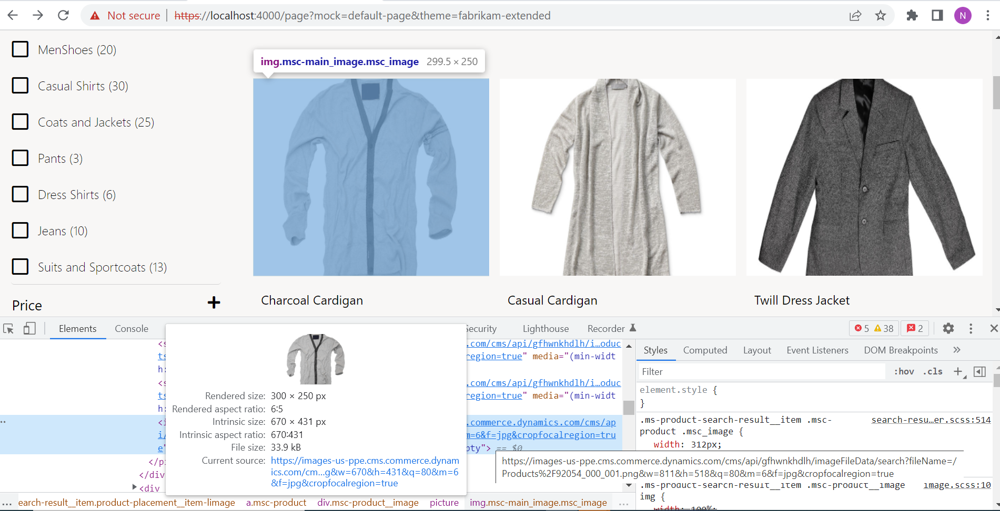
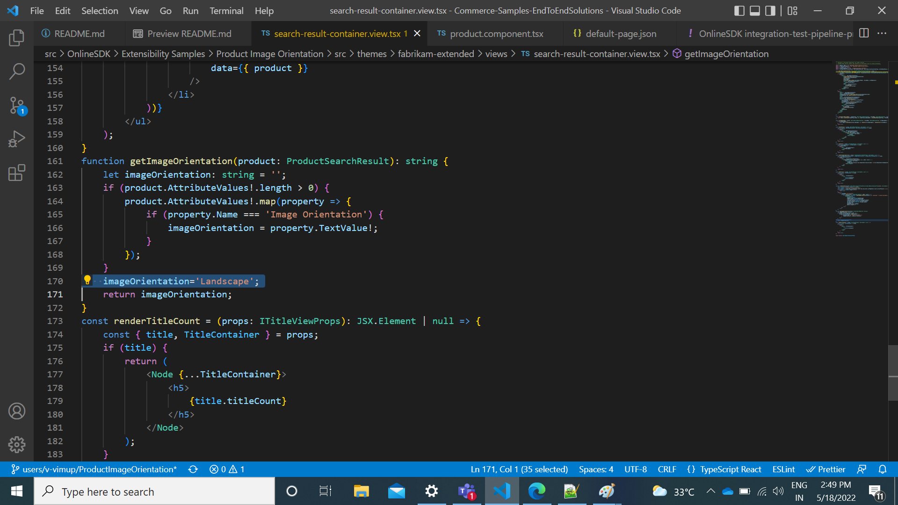
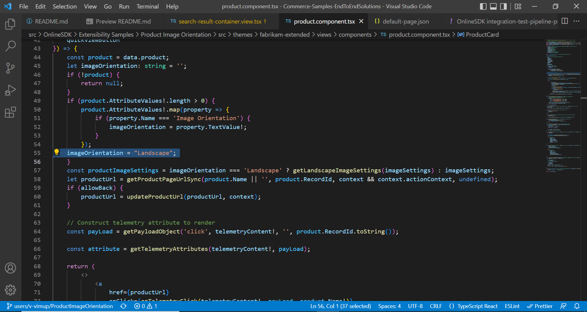

# Dynamics 365 Commerce - online extensibility samples

## License
License is listed in the [LICENSE](./LICENSE) file.

# Sample - Tile Navigation

## Overview
In this sample, the search result container module which is used to display product cards for the search result and categories page will be customized to support landscape image orientation.



## Starter kit license
License for starter kit is listed in the [LICENSE](./module-library/LICENSE) .

## Prerequisites
1.Follow the instructions mentioned in [document](https://docs.microsoft.com/en-us/dynamics365/commerce/e-commerce-extensibility/setup-dev-environment) to set up the development environment.
2.Need to configure attributes values of product in HQ for this feature implementation. Please use below configurations for product attribute name and TextValue

```json
name:"Image Orientation"
TextValue:"Landscape"
```

### Procedure to create custom theme
Follow the instructions mentioned in [document](https://docs.microsoft.com/en-us/dynamics365/commerce/e-commerce-extensibility/create-theme) to create the custom theme,in this sample, we'll assume a custom theme has been cloned from the fabrikam theme named "fabrikam-extended".

## Detailed Steps

### 1. Override component in custom theme

Override the product.component.tsx component in your custom theme using the command yarn msdyn365 add-component-override fabrikam-extended Product, where fabrikam-extended is the name of your custom theme. This will create a new file product.component.tsx under the theme "/views/components" directory. Open the new file and replace existing code with below code. This file has the logic to support for Landscape image orientation.

```typescript
/*---------------------------------------------------------------------------------------------
 *  Copyright (c) Microsoft Corporation. All rights reserved.
 *  Licensed under the MIT License. See License.txt in the project root for license information.
 *--------------------------------------------------------------------------------------------*/
import { getProductPageUrlSync } from '@msdyn365-commerce-modules/retail-actions';
import { format, getPayloadObject, getTelemetryAttributes, ITelemetryContent, onTelemetryClick } from '@msdyn365-commerce-modules/utilities';
import { PriceComponent, RatingComponent } from '@msdyn365-commerce/components';
import { IComponent, IComponentProps, ICoreContext, IGridSettings, IImageData, IImageSettings, Image, msdyn365Commerce } from '@msdyn365-commerce/core';
import { ProductPrice, ProductSearchResult } from '@msdyn365-commerce/retail-proxy';
import React from 'react';

export interface IProductComponentProps extends IComponentProps<{ product?: ProductSearchResult }> {
    className?: string;
    imageSettings?: IImageSettings;
    savingsText?: string;
    freePriceText?: string;
    originalPriceText?: string;
    currentPriceText?: string;
    ratingAriaLabel?: string;
    allowBack?: boolean;
    telemetryContent?: ITelemetryContent;
    quickViewButton?: React.ReactNode;
}

export interface IProductComponent extends IComponent<IProductComponentProps> { }

const PriceComponentActions = {};

const ProductCard: React.FC<IProductComponentProps> = ({
    data,
    context,
    imageSettings,
    savingsText,
    freePriceText,
    originalPriceText,
    currentPriceText,
    ratingAriaLabel,
    allowBack,
    typeName,
    id,
    telemetryContent,
    quickViewButton
}) => {
    const product = data.product;
    let imageOrientation: string = '';
    if (!product) {
        return null;
    }
    if (product.AttributeValues!.length > 0) {
        product.AttributeValues!.map(property => {
            if (property.Name === 'Image Orientation') {
                imageOrientation = property.TextValue!;
            }
        });
         // imageOrientation = "Landscape"; //Have been hard coded the "imageOrientation" value  here.It can be used to testing purpose.
    }
    const productImageSettings = imageOrientation === 'Landscape' ? getLandscapeImageSettings(imageSettings) : imageSettings;
    let productUrl = getProductPageUrlSync(product.Name || '', product.RecordId, context && context.actionContext, undefined);
    if (allowBack) {
        productUrl = updateProductUrl(productUrl, context);
    }

    // Construct telemetry attribute to render
    const payLoad = getPayloadObject('click', telemetryContent!, '', product.RecordId.toString());

    const attribute = getTelemetryAttributes(telemetryContent!, payLoad);

    return (
        <>
            <a
                href={productUrl}
                onClick={onTelemetryClick(telemetryContent!, payLoad, product.Name!)}
                aria-label={renderLabel(product.Name, context.cultureFormatter.formatCurrency(product.Price),
                    product.AverageRating, ratingAriaLabel)}
                className='msc-product'
                {...attribute}
            >
                <div className='msc-product__image'>
                    {renderProductPlacementImage(productImageSettings, context.request.gridSettings, product.PrimaryImageUrl, product.Name)}
                </div>
                <div className='msc-product__details'>
                    <h4 className='msc-product__title'>
                        {product.Name}
                    </h4>
                    {renderPrice(context, typeName, id, product.BasePrice, product.Price, savingsText, freePriceText, originalPriceText, currentPriceText)}
                    {renderDescription(product.Description)}
                    {!context.app.config.hideRating && renderRating(context, typeName, id, product.AverageRating, product.TotalRatings, ratingAriaLabel)}
                </div>
            </a>
            {quickViewButton && renderQuickView(quickViewButton, product.RecordId)}
        </>
    );
};
function getLandscapeImageSettings(cmsImageSettings?: IImageSettings): IImageSettings {
    // tslint:disable-next-line:no-unnecessary-local-variable
    const landscapeImageSettings: IImageSettings = {
        viewports: {
            xs: { q: 'w=735&h=481&q=80&m=6&f=jpg', w: 735, h: 481 },
            sm: { q: 'w=467&h=303&q=80&m=6&f=jpg', w: 467, h: 303 },
            md: { q: 'w=563&h=366&q=80&m=6&f=jpg', w: 563, h: 366 },
            lg: { q: 'w=670&h=431&q=80&m=6&f=jpg', w: 670, h: 431 },
            xl: { q: 'w=811&h=518&q=80&m=6&f=jpg', w: 811, h: 518 }
        },
        disableLazyLoad: cmsImageSettings && cmsImageSettings.disableLazyLoad,
        lazyload: cmsImageSettings && cmsImageSettings.lazyload
    };

    return landscapeImageSettings;
}
function renderLabel(name?: string, price?: string, rating?: number, ratingAriaLabel?: string): string {
    name = name || '';
    price = price || '';
    return (`${name} ${price} ${getRatingAriaLabel(rating, ratingAriaLabel)}`);
}

function renderDescription(description?: string): JSX.Element | null {
    return (
    <p className='msc-product__text'>
        {description}
    </p>
    );
}

function renderQuickView(quickview: React.ReactNode, item?: number): JSX.Element | undefined {
    if (quickview === null) {
        return undefined;
    }
    return React.cloneElement(quickview as React.ReactElement, { selectedProductId: item });
}

function getRatingAriaLabel(rating?: number, ratingAriaLabel?: string): string {
    if (rating && ratingAriaLabel) {
        const roundedRating = rating.toFixed(2);
        return format(ratingAriaLabel || '', roundedRating, '5');
    }
    return '';
}

function updateProductUrl(productUrl: string, context: ICoreContext): string {
    const srcUrl = new URL(productUrl, context.request.apiSettings.baseUrl);
    const queryString = 'back=true';
    if (srcUrl.search) {
        srcUrl.search += `&${queryString}`;
    } else {
        srcUrl.search += queryString;
    }

    const updatedUrl = new URL(srcUrl.href);
    return updatedUrl.pathname + srcUrl.search;
}

function renderRating(context: ICoreContext, typeName: string, id: string, avgRating?: number, totalRatings?: number, ariaLabel?: string): JSX.Element | null {
    if (!avgRating) {
        return null;
    }

    const numRatings = totalRatings && totalRatings.toString() || undefined;
    const ratingAriaLabel = getRatingAriaLabel(avgRating, ariaLabel);

    return (
        <RatingComponent
            context={context}
            id={id}
            typeName={typeName}
            avgRating={avgRating}
            ratingCount={numRatings}
            readOnly
            ariaLabel={ratingAriaLabel}
            data={{}}
        />
    );
}

function renderPrice(context: ICoreContext, typeName: string, id: string, basePrice?: number, adjustedPrice?: number, savingsText?: string, freePriceText?: string, originalPriceText?: string, currentPriceText?: string): JSX.Element | null {
    const price: ProductPrice = {
        BasePrice: basePrice,
        AdjustedPrice: adjustedPrice,
        CustomerContextualPrice: adjustedPrice
    };

    return (
        <PriceComponent
            context={context}
            id={id}
            typeName={typeName}
            data={{ price }}
            savingsText={savingsText}
            freePriceText={freePriceText}
            originalPriceText={originalPriceText}
        />
    );
}

function renderProductPlacementImage(imageSettings?: IImageSettings, gridSettings?: IGridSettings, imageUrl?: string, altText?: string): JSX.Element | null {
    if (!imageUrl || !gridSettings || !imageSettings) {
        return null;
    }
    const img: IImageData = {
        src: imageUrl,
        altText: altText ? altText : ''
    };
    const imageProps = {
        gridSettings,
        imageSettings
    };
    imageProps.imageSettings.cropFocalRegion = true;
    return (
        <Image {...img} {...imageProps} loadFailureBehavior='empty' />
    );
}

export const ProductComponent: React.FunctionComponent<IProductComponentProps> = msdyn365Commerce.createComponentOverride<IProductComponent>(
    'Product',
    { component: ProductCard, ...PriceComponentActions }
);

export default ProductComponent;
```

### 2. Extend the search result container to support landscape image orientation

Override the search-result-container.view.tsx component using the command yarn msdyn365 add-view-extension fabrikam-extended search-result-container, where "fabrikam-extended" is the name of your custom theme. This will create a new file under src/themes/fabrikam-extended/views, however it's possible the file has already been overridden and already exists.
Open the search-result-container.view.tsx under src/themes/fabrikam-extended/views and replace existing code with below code which contains the logic to support landscape image orientation.

```typescript
/*---------------------------------------------------------------------------------------------
 *  Copyright (c) Microsoft Corporation. All rights reserved.
 *  Licensed under the MIT License. See License.txt in the project root for license information.
 *--------------------------------------------------------------------------------------------*/
import { Module, Node } from '@msdyn365-commerce-modules/utilities';
import { ProductSearchResult } from '@msdyn365-commerce/retail-proxy';
import * as React from 'react';
import { ProductComponent } from './components/product.component';
import { ICategoryHierarchyViewProps, IRefineMenuViewProps, ISearchResultContainerViewProps, ISortByViewProps, ITitleViewProps, ISearchResultContainerProps, ISearchResultModalViewProps } from '@msdyn365-commerce-modules/search-result-container';

const SearchResultContainerView: React.FC<ISearchResultContainerViewProps> = props => {
    const { SearchResultContainer, products, pagination, ProductsContainer, ProductSectionContainer, choiceSummary, isMobile, modalToggle, searchResultModal, TitleViewProps,
        refineMenu, categoryHierarchy, sortByOptions, CategoryNavContainer, RefineAndProductSectionContainer, errorMessage, FeatureSearchContainer, similarLookProduct } = props;
    if (isMobile) {
        return (
            <Module {...SearchResultContainer}>
                {renderCategoryHierarchy(categoryHierarchy)}
                {renderTitle(TitleViewProps)}
                {choiceSummary}
                {modalToggle}
                {createSearchResultModal(searchResultModal, refineMenu, sortByOptions)}
                <Node {...FeatureSearchContainer}>
                    {similarLookProduct}
                </Node>
                <Node {...ProductsContainer}>
                    {errorMessage}
                    {renderProducts(props)}
                </Node>
                {pagination}
            </Module>
        );
    }
    return (
        <Module {...SearchResultContainer}>
        <Node {...CategoryNavContainer}>
        {categoryHierarchy && renderCategoryHierarchy(categoryHierarchy)}
        {TitleViewProps && renderTitleCount(TitleViewProps)}
        </Node>
        <Node {...RefineAndProductSectionContainer}>
        {refineMenu && renderRefiner(refineMenu)}
        <Node {...ProductSectionContainer}>
            {TitleViewProps && renderTitle(TitleViewProps)}
            {choiceSummary}
            {sortByOptions && renderSort(sortByOptions)}
            <Node {...FeatureSearchContainer}>
                    {similarLookProduct}
                </Node>
            <Node {...ProductsContainer}>
               {errorMessage}
                {renderProducts(props)}
            </Node>
            {pagination}
        </Node>
        </Node>
    </Module>
    );

};

const createSearchResultModal = (modalProps: ISearchResultModalViewProps, refineMenu: IRefineMenuViewProps, sortByDropDown: ISortByViewProps): JSX.Element => {
    return React.cloneElement(modalProps.modal, {}, modalProps.modalHeader, createModalBody(modalProps, refineMenu, sortByDropDown), modalProps.modalFooter);
};

const createModalBody = (props: ISearchResultModalViewProps, refineMenu: IRefineMenuViewProps, sortByDropDown: ISortByViewProps): JSX.Element | null => {
    if (sortByDropDown) {
        return React.cloneElement(props.modalBody, {}, renderSort(sortByDropDown), renderRefiner(refineMenu));
    }
    return null;
};

const renderRefiner = (props: IRefineMenuViewProps): JSX.Element | null => {
    const { refiners, RefineMenuContainer, RefinerSectionContainer } = props;
    if (refiners) {
        return (
            <Node {...RefinerSectionContainer}>
                <Node {...RefineMenuContainer}>
                    {refiners.map((submenu, index) => (
                        <React.Fragment key={index}>
                            {submenu}
                        </React.Fragment>
                    ))}
                </Node>
            </Node>
        );
    }
    return null;
};

const renderSort = (props: ISortByViewProps): JSX.Element | null => {
    const { SortingContainer, sortByDropDown } = props;
    if (sortByDropDown) {
        return (
            <Node {...SortingContainer}>
                {sortByDropDown}
            </Node>
        );
    }
    return null;
};

const renderCategoryHierarchy = (props: ICategoryHierarchyViewProps): JSX.Element | null => {
    const { CategoryHierarchyContainer, categoryHierarchyList, categoryHierarchySeparator } = props;
    if (categoryHierarchyList) {
        return (
            <Node {...CategoryHierarchyContainer}>
                {categoryHierarchyList.map((category: any, index: number) => (
                    <React.Fragment key={index}>
                        {category}
                        {categoryHierarchyList && categoryHierarchyList[index + 1] && categoryHierarchySeparator}
                    </React.Fragment>
                ))}
            </Node>
        );
    }

    return null;
};

const renderTitle = (props: ITitleViewProps): JSX.Element | null => {
    const { title, TitleContainer } = props;
    if (title) {
        return (
            <Node {...TitleContainer}>
                <h2>
                    {title.titlePrefix}
                    {title.titleText}
                </h2>
            </Node>
        );
    }
    return null;
};

function renderProducts(props: ISearchResultContainerViewProps & ISearchResultContainerProps<{}>): JSX.Element | null {
    const { config, context, resources } = props;
    const liClass = 'ms-product-search-result__item';
    const products = (props.data.listPageState.result && props.data.listPageState.result.activeProducts) || [];
    if (!products || products.length === 0) {
        return null;
    }
    return (
        <ul className='list-unstyled'>
            {products.map((product: ProductSearchResult, index: number) => (
                <li className={`${liClass} ${getImageOrientation(product) === 'Landscape' ? 'product-placement__item-limage' : 'product-placement__item-pimage'}`} key={index} >
                    <ProductComponent
                        context={context}
                        imageSettings={config.imageSettings}
                        freePriceText={resources.priceFree}
                        originalPriceText={resources.originalPriceText}
                        currentPriceText={resources.currentPriceText}
                        ratingAriaLabel={resources.ratingAriaLabel}
                        id={props.id}
                        typeName={props.typeName}
                        data={{ product }}
                    />
                </li>
            ))}
        </ul>
    );
}
function getImageOrientation(product: ProductSearchResult): string {
    let imageOrientation: string = '';
    if (product.AttributeValues!.length > 0) {
        product.AttributeValues!.map(property => {
            if (property.Name === 'Image Orientation') {
                imageOrientation = property.TextValue!;
            }
        });
    }
    imageOrientation = "Landscape"; //Have been hard coded the "imageOrientation" value  here.It can be used to testing purpose.
    return imageOrientation;
}
const renderTitleCount = (props: ITitleViewProps): JSX.Element | null => {
    const { title, TitleContainer } = props;
    if (title) {
        return (
            <Node {...TitleContainer}>
                <h5>
                    {title.titleCount}
                </h5>
            </Node>
        );
    }
    return null;
};

export default SearchResultContainerView;
```

### 3. Modify search result container style file

Open search-result-container.scss file under **src/themes/fabrikam-extended/styles/04-modules** and replace code with below code.
```scss
$search-result-container-nav-height: 20px;
$search-result-container-nav-margin-bottom: 20px;
$search-result-container-nav-margin-top: 32px;
$search-result-container-nav-title-margin: 0;
$search-result-container-refine-product-margin-bottom: 80px;
$search-result-container-refiner-section-padding-right: 40px;
$search-result-container-refiner-section-width: 25%;
$search-result-container-refiner-button-submenu-height: 64px;
$search-result-container-refiner-button-submenu-padding-left: 0;
$search-result-container-refiner-button-submenu-padding-right: 0;
$search-result-container-refiner-button-submenu-padding-top: 6px;
$search-result-container-refiner-button-submenu-padding-bottom: 6px;
$search-result-container-refiner-submenu-list-group-border-color: $msv-gray-900;
$search-result-container-refiner-submenu-list-group-margin-bottom: 0;
$search-result-container-refiner-submenu-list-group-margin-left: 0;
$search-result-container-refiner-submenu-item-label-padding-left: 12px;
$search-result-container-refiner-submenu-list-group-item-padding-left: 0;
$search-result-container-refiner-list-group-item-border: 1px solid rgba(0, 0, 0, 0);
$search-result-container-refiner-list-group-item-outline-offset: 2px;
$search-result-container-refiner-list-group-item-padding: 21px 12px 0 12px;
$search-result-container-refiner-slider-horizontal-background-color: $msv-gray-300;
$search-result-container-refiner-slider-horizontal-height: 4px;
$search-result-container-refiner-slider-padding: 0;
$search-result-container-refiner-slider--track-top: 0;
$search-result-container-refiner-slider-thumb-background-size: 12px 12px;
$search-result-container-refiner-slider-thumb-border-radius: 6px;
$search-result-container-refiner-slider-thumb-height: 12px;
$search-result-container-refiner-slider-thumb-outline-offset: 2px;
$search-result-container-refiner-slider-thumb-top: 50%;
$search-result-container-refiner-slider-thumb-width: 12px;
$search-result-container-refiner-slider-thumb-before-bottom: 0;
$search-result-container-refiner-slider-thumb-before-left: 0;
$search-result-container-refiner-slider-thumb-before-right: 0;
$search-result-container-refiner-slider-thumb-before-top: 0;
$search-result-container-refiner-slider-labels-item-margin-top: 25px;
$search-result-container-refiner-slider-labels-item-padding-bottom: 20px;
$search-result-container-pagination-padding-left: 0;
$search-result-container-product-section-width: 75%;
$search-result-container-sort-by-category-padding-left: 8px;
$search-result-container-sort-by-category-right: 0;
$search-result-container-sort-by-category-dropdown-label-margin-right: 8px;
$search-result-container-products-margin-bottom: 80px;
$search-result-container-products-margin-top: 32px;
$search-result-container-product-search-result-item-grid-column-gap: 20px;
$search-result-container-product-search-result-item-width: 249px;
$search-result-container-product-search-result-item-padding: 0 0 33px 0;
$search-result-container-product-search-item-title-margin-bottom: 8px;
$search-result-container-product-search-item-title-margin-top: 20px;
$search-result-container-product-search-item-rating-margin-top: 4px;
$search-result-container-page-item-previous-padding-left: 4px;
$search-result-container-page-item-page-link-padding: 8px 4px;
$search-result-container-page-item-page-link-line-height: 1.25;
$search-result-container-page-item-padding-right: 10px;
$search-result-container-margin-top-margin-top-mobile: 24px;
$search-result-container-pagination-margin-bottom-mobile: 16px;
$search-result-container-products-margin-bottom-mobile: 40px;
$search-result-container-choice-summary-padding-inline-start: 0;
$search-result-container-choice-summary-margin-left: 8px;
$search-result-container-choice-summary-margin-top: 20px;
$search-result-container-choice-summary-margin-bottom: 16px;
$search-result-container-choice-summary-background-color: $msv-gray-200;
$search-result-container-choice-summary-border: 1px solid $msv-gray-200;
$search-result-container-choice-summary-margin-right: 12px;
$search-result-container-choice-summary-border-radius: 3px;
$search-result-container-choice-summary-padding-left: 8px;
$search-result-container-choice-summary-outline-offset: 2px;
$search-result-container-choice-summary-clear-all-background-color: $msv-gray-100;
$search-result-container-choice-summary-clear-all-border: 0;
$search-result-container-choice-summary-clear-all-outline-offset: 2px;
$search-result-container-choice-summary-glypg-margin-left: 8px;
$search-result-container-choice-summary-glypg-margin-right: 8px;
$search-result-modal-header-close-button-padding: 20px;
$search-result-modal-header-close-button-margin: -20px -20px -20px auto;
$search-result-modal-body-height: 450px;
$search-result-modal-content-padding: 20px 25px;
$search-result-modal-footer-button-background-color: $msv-black;
$search-result-modal-footer-button-border-color: $msv-black;
$search-result-modal-footer-button-padding: 12px 20px;
$search-result-modal-footer-button-min-width: 160px;
$search-result-modal-refiner-section-padding-right: 0;
$search-result-container-padding-left-mobile: 16px;
$search-result-container-padding-right-mobile: 16px;
$search-result-container-sort-by-category-top-mobile: 0;
$product-search-result_link__item-outline-width: 1px;
$product-search-result_link__item-outline-style: dashed;
$product-search-result_link__item-outline-offset:2px;
$search-result-prev-next-padding: 0 4px;
$search-result-container-feature-placeholder-img-width: 315px;
$search-result-list-item-width: 314px;
//style presets
:root {
    --msv-search-result-font-color: var(--msv-font-primary-color);
    --msv-search-result-font-size: var(--msv-body-font-size-m);
    --msv-search-result-heading-font-color: var(--msv-font-primary-color);
    --msv-search-result-heading-font-size: var(--msv-body-font-size-xl);
    --msv-search-result-sort-bg: transparent;
    --msv-search-result-sort-font-color: var(--msv-font-primary-color);
    --msv-search-result-sort-font-size: var(--msv-body-font-size-m);
    --msv-search-result-product-color: var(--msv-font-primary-color);
    --msv-search-result-product-size: var(--msv-body-font-size-m);
    --msv-search-result-product-price-color: var(--msv-font-primary-color);
    --msv-search-result-product-price-size: var(--msv-body-font-size-l);
    --msv-search-result-pagination-color: var(--msv-font-primary-color);
    --msv-search-result-pagination-size: var(--msv-body-font-size-m);

    //Refiner heading
    --msv-refiner-heading-font-color: var(--msv-font-primary-color);
    --msv-refiner-heading-font-size: var(--msv-body-font-size-l);

    //Refiner values
    --msv-refiner-values-font-color: var(--msv-font-primary-color);
    --msv-refiner-values-font-size: var(--msv-body-font-size-m);

    //border
    --msv-refiner-border: #{$msv-gray-300};

    // slider
    --msv-refiner-slider: var(--msv-font-primary-color);

    // rating star
    --msv-refiner-rating-star: var(--msv-font-primary-color);
    --msv-refiner-rating-star-size: var(--msv-body-font-size-m);
    --msv-feature-title-color: var(--msv-font-primary-color);
    --msv-feature-title-desktop-size: var(--msv-body-font-size-xxl);
    --msv-feature-title-mobile-size: var(--msv-body-font-size-xl);
    --msv-feature-heading-color: var(--msv-font-primary-color);
    --msv-feature-heading-font-size: var(--msv-body-font-size-l);
}

.ms-search-result-container__category-nav-section {
    display: flex;
    height: $search-result-container-nav-height;
    justify-content: space-between;
    margin-bottom: $search-result-container-nav-margin-bottom;
    margin-top: $search-result-container-nav-margin-top;

    .ms-search-result-container__category-hierarchy {
        @include font-content-s();
    }

    .ms-search-result-container__title h5 {
        margin: $search-result-container-nav-title-margin;

        .ms-search-result__collection-title-count {
            @include font-content(var(--msv-font-weight-normal),
            var(--msv-search-result-font-size), $msv-line-height-m);
        }
    }
}

.ms-search-result-container__refine-product-section {
    display: inline-flex;
    margin-bottom: $search-result-container-refine-product-margin-bottom;
    width: 100%;
}

// refiner section
.ms-search-result-container__refiner-section {
    display: block;
    padding-right: $search-result-container-refiner-section-padding-right;
    width: $search-result-container-refiner-section-width;

    .collapse:not(.show) {
        display: none;
    }

    button.ms-refine-submenu__toggle_collapsed,
    .ms-refine-submenu__toggle_expanded {
        background: transparent;
        color: var(--msv-refiner-heading-font-color);
        font-size: var(--msv-refiner-heading-font-size);
        display: flex;
        justify-content: space-between;
        padding-left: $search-result-container-refiner-button-submenu-padding-left;
        padding-right: $search-result-container-refiner-button-submenu-padding-right;
        width: 100%;
    }

    .ms-refine-submenu.list-group {
        border-bottom: 1px solid var(--msv-refiner-border);
        display: flex;
        flex-direction: column;
        margin-bottom: $search-result-container-refiner-submenu-list-group-margin-bottom;
        padding-left: $search-result-container-refiner-submenu-list-group-margin-left;

        &:first-child {
            border-top: 1px solid var(--msv-refiner-border);
        }

        .ms-refine-submenu-item {
            padding-left: $search-result-container-refiner-submenu-list-group-item-padding-left;
            margin-bottom: 2px;

            > a {
                @include vfi();
            }

            .msc-rating {
                display: inline-block;

                &__count {
                    color: var(--msv-refiner-values-font-color);
                }

                &__empty-star, &__star, &__count {
                    font-size: var(--msv-refiner-rating-star-size);
                }
            }

            .ms-rating-component {
                &__up .msc-rating__star {
                    color: $msv-gray-500;
                }

                &__current .msc-rating__star {
                    color: $msv-gray-900;
                }

                &__down .msc-rating__star {
                    color: $msv-gray-800;
                }
            }
        }

        .refine-submenu-item__rating {
            color: var(--msv-refiner-values-font-color);
            font-size: var(--msv-refiner-rating-star-size);
        }

        .multi-select,
        .multi-select-checked,
        .single-select,
        .single-select-checked {
            @include vfi();
            display: block;
            border: 1px solid transparent;

            span.ms-refine-submenu-item__label {
                color: var(--msv-refiner-values-font-color);
                font-size: var(--msv-refiner-values-font-size);
                padding-left: $search-result-container-refiner-submenu-item-label-padding-left;
                vertical-align: middle;
            }
        }
    }

    .list-group-item {
        border: $search-result-container-refiner-list-group-item-border;
        display: block;
        outline-offset: $search-result-container-refiner-list-group-item-outline-offset;
        padding: $search-result-container-refiner-list-group-item-padding;
        position: relative;
    }

    .slider-horizontal {
        background-color: $search-result-container-refiner-slider-horizontal-background-color;
        height: $search-result-container-refiner-slider-horizontal-height;
    }

    .slider {
        box-shadow: inset 0 0 2px;
        cursor: pointer;
        display: block;
        padding: $search-result-container-refiner-slider-padding;
        position: relative;
        touch-action: none;

        .slider__container {
            height: 100%;
            width: 100%;
        }

        .slider__track {
            background-color: var(--msv-refiner-slider);
            height: 100%;
            position: absolute;
            top: $search-result-container-refiner-slider--track-top;
        }

        .slider__thumb {
            @include vfi();
            background: var(--msv-refiner-slider);
            background-size: $search-result-container-refiner-slider-thumb-background-size;
            border-radius: $search-result-container-refiner-slider-thumb-border-radius;
            display: inline-block;
            height: $search-result-container-refiner-slider-thumb-height;
            outline-offset: $search-result-container-refiner-slider-thumb-outline-offset;
            position: absolute;
            top: $search-result-container-refiner-slider-thumb-top;
            transform: translate3d(-50%, -50%, 0);
            width: $search-result-container-refiner-slider-thumb-width;
        }

        .slider__thumb::before {
            bottom: $search-result-container-refiner-slider-thumb-before-bottom;
            content: "";
            display: block;
            left: $search-result-container-refiner-slider-thumb-before-left;
            outline-offset: calc(0px + 0.0625rem);
            position: absolute;
            right: $search-result-container-refiner-slider-thumb-before-right;
            top: $search-result-container-refiner-slider-thumb-before-top;
        }

        .slider__thumb:focus {
            outline: 1px dashed $black;
            border: 1px dashed $white;
            outline-offset: 2px;
            box-shadow: none;
        }

        &__thumb__range:focus {
            + .slider__thumb {
                outline: 1px dashed $black;
                border: 1px dashed $white;
                outline-offset: 2px;
                box-shadow: none;
            }
        }

        .slider__labels-item {
            color: var(--msv-refiner-values-font-color);
            font-size: var(--msv-refiner-values-font-size);
            cursor: pointer;
            display: inline-block;
            margin-top: $search-result-container-refiner-slider-labels-item-margin-top;
            padding-bottom: $search-result-container-refiner-slider-labels-item-padding-bottom;
        }

        .slider__labels-item.start {
            float: left;
        }

        .slider__labels-item.end {
            float: right;
        }
    }
}

// product section
.ms-search-result-container__product-section {
    width: $search-result-container-product-section-width;

    .ms-search-result-wrapper-title-choice-summary {
        flex: 0 0 75%;
        max-width: 75%;
        display: inline-block;
        position: relative;
        width: 100%;

        .ms-search-result-container__title h2 {
            color: var(--msv-search-result-font-color);
            font-size: var(--msv-search-result-font-size);

            .ms-search-result__collection-title-prefix,
            .ms-search-result__collection-title-text {
                @include font-content(var(--msv-font-weight-normal),
                var(--msv-search-result-heading-font-size), $msv-line-height-xl);
                color: var(--msv-search-result-heading-font-color);
            }

            .ms-search-result__collection-title-count {
                @include font-content(var(--msv-font-weight-normal),
                var(--msv-search-result-font-size), $msv-line-height-m);
                color: var(--msv-search-result-font-color);
                display: inline-block;
            }
        }
    }

    .ms-search-result-wrapper-sort-by-category {
        flex: 0 0 25%;
        max-width: 25%;
        display: inline-block;
        position: relative;
        width: 100%;
    }
}

.msc-choice-summary {
    list-style-type: none;
    padding-inline-start: $search-result-container-choice-summary-padding-inline-start;
    margin-left: $search-result-container-choice-summary-margin-left;
    margin-top: $search-result-container-choice-summary-margin-top;

    .msc-choice-summary__list {
        display: inline-block;
        margin-bottom: $search-result-container-choice-summary-margin-bottom;
    }

    .msc-choice-summary__list-item {
        display: inline-block;
    }

    .msc-choice-summary__item {
        @include vfi();
        @include font-content(var(--msv-font-weight-normal), var(--msv-refiner-values-font-size), $msv-line-height-m);
        background-color: $search-result-container-choice-summary-background-color;
        color: var(--msv-refiner-values-font-color);
        border: $search-result-container-choice-summary-border;
        margin-right: $search-result-container-choice-summary-margin-right;
        border-radius: $search-result-container-choice-summary-border-radius;
        padding-left: $search-result-container-choice-summary-padding-left;
        outline-offset: $search-result-container-choice-summary-outline-offset;
        position: relative;
    }

    .msc-choice-summary__clear-all {
        @include vfi();
        @include font-content(var(--msv-font-weight-normal), var(--msv-refiner-values-font-size), $msv-line-height-m);
        display: inline-block;
        background-color: $search-result-container-choice-summary-clear-all-background-color;
        color: var(--msv-refiner-values-font-color);
        border: $search-result-container-choice-summary-clear-all-border;
        text-decoration: underline;
        outline-offset: $search-result-container-choice-summary-clear-all-outline-offset;
        position: relative;
    }

    .msc-choice-summary__glyph {
        margin-left: $search-result-container-choice-summary-glypg-margin-left;
        margin-right: $search-result-container-choice-summary-glypg-margin-right;
        vertical-align: text-top;

        &::after {
            @include msv-icon();
            content: $msv-Cancel;
        }
    }

    .msc-choice-summary__clear-all::after {
        display: none;
    }
}

.ms-search-result-container__Sort-by-category {
    @include font-content(var(--msv-font-weight-light), var(--msv-search-result-sort-font-size), $msv-line-height-m);
    padding-left: $search-result-container-sort-by-category-padding-left;
    position: absolute;
    right: $search-result-container-sort-by-category-right;
    bottom: 0;
    padding-top: 12px;

    .msc-l-dropdown__label {
        color: var(--msv-search-result-sort-font-color);
        margin-right: $search-result-container-sort-by-category-dropdown-label-margin-right;
        vertical-align: middle;
    }

    .msc-l-dropdown {
        @include font-content(var(--msv-font-weight-bold),
        var(--msv-search-result-sort-font-size), $msv-line-height-m);
        background: var(--msv-search-result-sort-bg);
        border-style: none;
        color: var(--msv-search-result-sort-font-color);
        vertical-align: middle;
        outline-offset: 2px;
    }
}

.msc-product__text {
    display: none;
}

.ms-search-result-container__Products {
    margin-bottom: $search-result-container-products-margin-bottom;
    margin-top: $search-result-container-products-margin-top;

    .ms-search-result-container__no-results-message {
        h5.error-text {
            @include font-content(var(--msv-font-weight-normal),
            var(--msv-refiner-values-font-size), $msv-line-height-m);
        }
    }

    .list-unstyled {
        display: grid;
        grid-column-gap: $search-result-container-product-search-result-item-grid-column-gap;
        grid-template-columns: repeat(
            auto-fill,
            minmax($search-result-container-product-search-result-item-width, 1fr)
        );
    }
    
    .product-placement__item-pimage {
        width: calc(100% - 50px);
        margin-right: 24px;
    }
    
    .product-placement__item-limage {
        width: calc(100% + 10px);
        margin-right: 24px;
    }
}

.ms-product-search-result__item {
    padding: $search-result-container-product-search-result-item-padding;

    .msc-product {
        display: block;

        &__title,
        &__details {
            color: var(--msv-search-result-font-color);
        }

        /* stylelint-disable-next-line no-descending-specificity -- Auto-suppressed. Please fix if possible. */
        .msc-rating {
            /* stylelint-disable-next-line no-descending-specificity -- Auto-suppressed. Please fix if possible. */
            &__star {
                color: var(--msv-refiner-rating-star);
            }

            &__half-star {
                &::after {
                    color: var(--msv-refiner-rating-star);
                }
            }
        }

        @include image(312px);
    }

    .msc-product__image img {
        width: 100%;
        max-height: 250px;
    }

    &:hover, &:focus, &:active {
        .ms-quickView {
            &__button {
                display: block;
            }
        }
    }
}

li.ms-product-search-result__item {
    position: relative;
}

/* stylelint-disable-next-line no-descending-specificity -- Auto-suppressed. Please fix if possible. */
.ms-product-search-result__item a {
    .msc-product__title {
        @include font-content(var(--msv-font-weight-normal), var(--msv-search-result-product-size), $msv-line-height-m);
        color: var(--msv-search-result-product-color);
        margin-bottom: $search-result-container-product-search-item-title-margin-bottom;
        margin-top: $search-result-container-product-search-item-title-margin-top;
    }

    /* stylelint-disable-next-line no-descending-specificity -- Auto-suppressed. Please fix if possible. */
    .msc-rating {
        display: block;
        margin-top: $search-result-container-product-search-item-rating-margin-top;
    }

    .msc-price {
        .msc-price__actual {
            @include font-content(var(--msv-font-weight-heavy), var(--msv-search-result-product-price-size), $msv-line-height-l);
            color: var(--msv-search-result-product-price-color);
            display: inline-block;
        }
    }

    /* stylelint-disable-next-line no-descending-specificity -- Auto-suppressed. Please fix if possible. */
    &:focus {
        @include basic-outline-offset($product-search-result_link__item-outline-width,
        $product-search-result_link__item-outline-style, $msv-black,
        $product-search-result_link__item-outline-offset);

        .msc-product__title {
            text-decoration: underline;
        }
    }

    /* stylelint-disable-next-line no-descending-specificity -- Auto-suppressed. Please fix if possible. */
    &:hover {
        text-decoration: none;

        .msc-product__details {
            .msc-product__title {
                text-decoration: underline;
            }
        }
    }
}

/* stylelint-disable-next-line no-descending-specificity -- Auto-suppressed. Please fix if possible. */
.ms-search-result-container__category-hierarchy {
    @include vfi();
}

nav.ms-search-result-container__pagination {
    width: 100%;
}

.msc-pagination {
    @include font-content(var(--msv-font-weight-normal), var(--msv-refiner-values-font-size), $msv-line-height-m);
    display: flex;
    list-style: none;
    padding-left: $search-result-container-pagination-padding-left;
    width: 100%;
}

ul.msc-pagination {
    display: flex;
    justify-content: center;
}

.previous.msc-page-item {
    margin-right: auto;

    .msc-pagination__prev {
        padding-left: 4px;
        display: inline-block;
    }

    .msc-page-link {
        color: var(--msv-search-result-pagination-color);
        font-size: var(--msv-search-result-pagination-size);
        display: block;
        padding: $search-result-container-page-item-page-link-padding;
        line-height: $search-result-container-page-item-page-link-line-height;

        &::before {
            @include msv-icon();
            content: "";
        }

        .ms-search-result__pagination-left {
            @include add-icon($msv-ChevronLeft, before);
        }
    }
}

.msc-page-item {
    padding-right: $search-result-container-page-item-padding-right;
}

.next.msc-page-item {
    margin-left: auto;

    .msc-pagination__next {
        padding-right: 4px;
        display: inline-block;
    }

    .msc-page-link {
        color: var(--msv-search-result-pagination-color);
        font-size: var(--msv-search-result-pagination-size);
        display: block;
        padding: $search-result-container-page-item-page-link-padding;
        line-height: $search-result-container-page-item-page-link-line-height;
        padding-right: 4px;

        &::after {
            @include msv-icon();
            content: "";
        }

        .ms-search-result__pagination-right {
            @include add-icon($msv-ChevronRight, after);
        }
    }
}

.msc-page-item.disabled {
    .msc-page-link {
        color: $msv-secondary;
        cursor: auto;
        pointer-events: none;
    }
}

/* stylelint-disable-next-line no-descending-specificity -- Auto-suppressed. Please fix if possible. */
.msc-page-link {
    color: var(--msv-search-result-pagination-color);
    font-size: var(--msv-search-result-pagination-size);
    display: block;
    padding: $search-result-container-page-item-page-link-padding;
    line-height: $search-result-container-page-item-page-link-line-height;

    @include vfi();
}

.active {
    text-decoration: underline;
}

.prev-text,
.next-text {
    padding: $search-result-prev-next-padding;
}

@media (max-width: $msv-breakpoint-l) {
    .ms-search-result-container {
        margin-top: $search-result-container-margin-top-margin-top-mobile;

        .ms-search-result-container__category-hierarchy {
            display: none;
        }

        .msc-button {
            background: none;
            border-style: none;
            float: right;
            font-weight: bold;
        }

        .msc-button:hover {
            text-decoration: underline;
        }

        .ms-product-search-result__item {
            display: inline-block;
            min-width: $search-result-list-item-width;
            vertical-align: top;
        }
    }

    .ms-search-result-container__pagination {
        margin-bottom: $search-result-container-pagination-margin-bottom-mobile;
    }

    .ms-search-result-container__Products {
        margin-bottom: $search-result-container-products-margin-bottom-mobile;
    }

    .prev-text,
    .next-text {
        display: none;
    }
}

// modal
.msc-search-result-modal {
    .msc-modal__header {
        justify-content: space-around;
    }

    .msc-modal__content {
        padding: $search-result-modal-content-padding;
    }

    .msc-review-modal-body {
        height: $search-result-modal-body-height;
        overflow-y: auto;
    }

    .ms-sort-and-filter-modal-close.msc-btn {
        color: var(--msv-font-secondary-color);
        background-color: $search-result-modal-footer-button-background-color;
        border-color: $search-result-modal-footer-button-border-color;
        min-width: $search-result-modal-footer-button-min-width;
    }

    .ms-search-result-container__refiner-section {
        display: block;
        padding-right: $search-result-modal-refiner-section-padding-right;
        width: 100%;
    }
}

@media (max-width: $msv-breakpoint-l) {
    .ms-search-result-container__Sort-by-category {
        position: relative;
        top: $search-result-container-sort-by-category-top-mobile;
        right: auto;
        border-top: 1px solid var(--msv-refiner-border);
        border-bottom: 1px solid var(--msv-refiner-border);
        z-index: 1;
        background-color: var(--msv-bg-color);
    }

    .ms-search-result-container {
        padding-left: $search-result-container-padding-left-mobile;
        padding-right: $search-result-container-padding-right-mobile;
    }

    .ms-sort-and-filter-modal-close.msc-btn {
        width: 100%;
    }
}

.ms-search-result-container {
    &__title {
        color: var(--msv-search-result-font-color);
        font-size: var(--msv-search-result-font-size);

        /* stylelint-disable no-descending-specificity -- Auto-suppressed. Please fix if possible. */
        .ms-search-result__collection-title-prefix,
        .ms-search-result__collection-title-text {
            /* stylelint-enable no-descending-specificity -- Auto-suppressed. Please fix if possible. */

            @include font-content(var(--msv-font-weight-normal), var(--msv-search-result-heading-font-size), $msv-line-height-xl);
            color: var(--msv-search-result-heading-font-color);
        }

        /* stylelint-disable-next-line no-descending-specificity -- Auto-suppressed. Please fix if possible. */
        .ms-search-result__collection-title-count {
            @include font-content(var(--msv-font-weight-normal), var(--msv-search-result-font-size), $msv-line-height-m);
            color: var(--msv-search-result-font-color);
        }
    }

    .msc-button {
        @include font-content(var(--msv-font-weight-bold), var(--msv-search-result-sort-font-size), $msv-line-height-m);
        color: var(--msv-search-result-sort-font-color);
    }

    .ms-feature-search-result {
        .ms-feature-search-result__item {
            display: flex;
            height: auto;
            padding-bottom: 10px;

            @include image($search-result-container-feature-placeholder-img-width);

            .msc-feature-search-result__item__image {
                flex-grow: 1;
                height: auto;
                width: 315px;
            }

            .msc-feature-search-result__item__detail {
                flex-grow: 1;
                height: auto;
                position: relative;
                padding-left: 8%;
                text-align: left;
                width: 100%;
            }

            .msc-feature-search-result__item__detail h1 {
                @include font-content(var(--msv-font-weight-light), var(--msv-feature-title-desktop-size), $msv-line-height-xxl);
                color: var(--msv-feature-title-color);
                margin: 0;
                padding: 0;
                position: relative;
                top: 30%;
                margin-bottom: 8px;
            }

            .msc-feature-search-result__item__detail p {
                @include font-content(var(--msv-font-weight-bold), var(--msv-feature-heading-font-size), $msv-line-height-l);
                color: var(--msv-feature-heading-color);
                margin: 0;
                margin-bottom: 8px;
                padding: 0;
                position: relative;
                top: 30%;
            }
        }
    }

    @media (max-width: $msv-breakpoint-l) {
        .ms-feature-search-result {
            .ms-feature-search-result__item {
                .msc-feature-search-result__item__detail {
                    p,
                    h1 {
                        top: 20%;
                    }
                }
            }
        }
    }

    @media (max-width: $msv-breakpoint-m) {
        .ms-feature-search-result {
            .ms-feature-search-result__item {
                display: block;

                .msc-feature-search-result__item__image,
                .msc-feature-search-result__item__detail {
                    width: 100%;
                }

                .msc-feature-search-result__item__image {
                    margin-bottom: 10px;
                }

                .msc-feature-search-result__item__detail {
                    padding-left: unset;

                    h1 {
                        @include font-content(var(--msv-font-weight-light), var(--msv-feature-title-mobile-size), $msv-line-height-xl);
                    }
                }
            }
        }
    }
}

@media (min-width: $msv-breakpoint-xl) {
    .ms-search-result-container {
        .ms-product-search-result__item {
            .msc-product {
                @include image(334px);
            }
        }
    }
}

```
### 4. Testing within dev environment
When running on a production environment, the orientation setting will be read from headquarters product attribute settings. Since these may not be available to a development environment you can change the orientation manually in the following steps.

Inside the search-result-container.view.tsx file, hard code the imageOrientation = 'Landscape' or imageOrientation = 'Portrait' before the getImageOrientation function returns, as shown in the below image.

Inside the product.component.tsx file, hard code the imageOrientation = 'Landscape' or imageOrientation = 'Portrait' before the ProductCard function returns, as shown in the below image.


### 5. Build and Test by using mock file

The sample can now be tested in a web browser using the ```yarn start``` command.

Test the module using page mock, Go to browser and copy paste the below url
https://localhost:4000/page?mock=default-page&theme=fabrikam-extended 

## Third party Image and Video Usage restrictions
The software may include third party images and videos that are for personal use only and may not be copied except as provided by Microsoft within the demo websites.  You may install and use an unlimited number of copies of the demo websites., You may not publish, rent, lease, lend, or redistribute any images or videos without authorization from the rights holder, except and only to the extent that the applicable copyright law expressly permits doing so.
