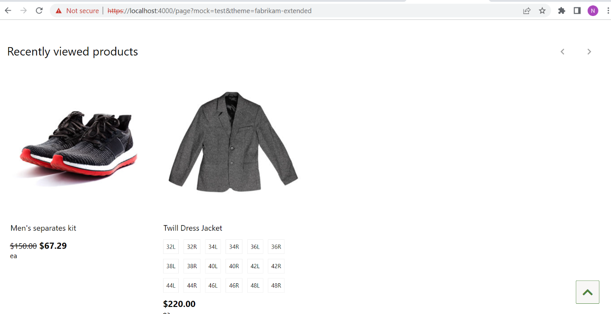

# Dynamics 365 Commerce - online extensibility samples

## License
License is listed in the [LICENSE](./LICENSE) file.

# Sample - Recently Viewed Products

## Overview
In this sample we will learn to develop a module that renders the list of products traversed by user based on user cookie. Recently viewed product module is used to give users a quick way to browse items they have recently viewed. End user (C2) should be able to get the list of all his recently viewed products.




## Starter kit license
License for starter kit is listed in the [LICENSE](./module-library/LICENSE) .

## Prerequisites
Follow the instructions mentioned in [document](https://docs.microsoft.com/en-us/dynamics365/commerce/e-commerce-extensibility/setup-dev-environment) to set up the development environment.

### Procedure to create custom theme
Follow the instructions mentioned in [document](https://docs.microsoft.com/en-us/dynamics365/commerce/e-commerce-extensibility/create-theme) to create the custom theme.

In this sample we have created a custom theme based off the fabrikam theme called "fabrikam-extended"

## Detailed Steps

### 1. Clone custom product-collection Module

In this step, we will create a new module named **custom-recently-viewed-products** by cloning the the product-collection module. We will then change the code to read the product ids from the user cookies and render the products as a product collection. Use the below CLI command to clone the module and follow the steps below to modify the code.

**yarn msdyn365 clone product-collection custom-recently-viewed-products**

### 2.Add property to hold return data from data action.
 Go to custom-recently-viewed-products.data.ts under **src/Modules/custom-recently-viewed-products** and replace existing code with below code.


```typescript
/*---------------------------------------------------------------------------------------------
 *  Copyright (c) Microsoft Corporation. All rights reserved.
 *  Licensed under the MIT License. See License.txt in the project root for license information.
 *--------------------------------------------------------------------------------------------*/

import { AsyncResult } from '@msdyn365-commerce/retail-proxy';
import { IFullProductsSearchResultsWithCount } from './actions/get-full-products-by-ids';

export interface ICustomRecentlyViewedProductsData {
    fullProductsSearchResultsWithCount: AsyncResult<IFullProductsSearchResultsWithCount>;
}

```

#### 3.Modify module definition file to call data action to get product details.
Go to custom-recently-viewed-products.definition.json under **src/Modules/custom-recently-viewed-products** and replace existing code with below code.

```json
{
	"$type": "contentModule",
	"friendlyName": "Custom recently viewed products",
	"name": "custom-recently-viewed-products",
	"description": "Product collection shows a list of products based on recently viewed products.",
	"categories": [
		"Products",
		"Recommendations"
	],
	"tags": [
		"Additional tags go here"
	],
	"dataActions": {
        "fullProductsSearchResultsWithCount": {
            "path": "./actions/get-full-products-by-ids",
            "runOn": "client"
        }
    },
	"config": {
		"productCollection": {
			"friendlyName": "Products",
			"description": "Configure settings to choose appropriate data source & inputs for product collection",
			"type": "productList",
			"required": true
		},
		"heading": {
			"friendlyName": "Heading",
			"description": "Module heading",
			"$ref": "@msdyn365-commerce-modules/definitions/dist/src/Heading.json#/definitions/heading"
		},
		"layout": {
			"friendlyName": "Display style",
			"description": "Flag to show all products in a grid layout instead of carousel",
			"type": "string",
			"enum": {
				"carousel": "carousel",
				"grid": "grid"
			},
			"default": "carousel",
			"scope": "module"
		},
		"imageSettings": {
			"friendlyName": "Image settings",
			"description": "Image settings for product items",
			"type": "imageSettings"
		},
		"className": {
			"friendlyName": "Custom CSS class name",
			"description": "Provide a custom css class name defined in the theme pack to target the CSS for this module",
			"type": "string",
			"default": ""
		}
	},
	"resources": {
		"priceFree": {
			"value": "Free",
			"comment": "Text to show when product is free"
		},
		"ratingAriaLabel": {
			"value": "Average {0} of {1} stars",
			"comment": "Text to show for rating aria label"
		},
		"flipperNext": {
			"value": "Next",
			"comment": "value for next flipper control"
		},
		"flipperPrevious": {
			"value": "Previous",
			"comment": "Value for previous flipper control"
		},
		"originalPriceText": {
			"comment": "String that corresponds to the original price screen reader text",
			"value": "Original price"
		},
		"currentPriceText": {
			"comment": "String that corresponds to the current price screen reader text",
			"value": "Current price"
		}
	}
}

```

### 4. Modify module logic to render products as product collection.
Open custom-recently-viewed-products.tsx under **src/Modules/custom-recently-viewed-products** and replace existing code with below code.
In below code changes added to render the products as product collection.

```typescript
/*---------------------------------------------------------------------------------------------
 *  Copyright (c) Microsoft Corporation. All rights reserved.
 *  Licensed under the MIT License. See License.txt in the project root for license information.
 *--------------------------------------------------------------------------------------------*/

import * as React from 'react';
import {
    format,
    Heading,
    IComponentNodeProps,
    IModuleProps,
    INodeProps,
    ISingleSlideCarouselProps,
    NodeTag,
    SingleSlideCarousel
} from '@msdyn365-commerce-modules/utilities';
import { ProductComponent } from '@msdyn365-commerce/components';
import { ProductSearchResult } from '@msdyn365-commerce/retail-proxy';
import classnames from 'classnames';
import { ICustomRecentlyViewedProductsData } from './custom-recently-viewed-products.data';
import { ICustomRecentlyViewedProductsProps, layout } from './custom-recently-viewed-products.props.autogenerated';

export interface IProductCollectionViewProps extends ICustomRecentlyViewedProductsProps<{}> {
    heading?: React.ReactNode;
    ProductCollectionContainer: IModuleProps;
    SingleSlideCarouselComponentProps: INodeProps;
    GridComponentProps: INodeProps;
    products: IProductComponentViewProps[];
    isCarousel: boolean;
}

export interface IProductComponentViewProps {
    ProductContainer: INodeProps;
    productComponent: React.ReactNode;
}

/**
 * ProductCollection component
 */
class ProductCollection extends React.PureComponent<ICustomRecentlyViewedProductsProps<ICustomRecentlyViewedProductsData>> {
    public render(): JSX.Element | null {
        const { heading, className } = this.props.config;
        const { fullProductsSearchResultsWithCount } = this.props.data;
        const { resources } = this.props;
        const isCarousel = this.props.config.layout === layout.carousel;
        const headingComponent = heading && (
            <Heading className='ms-product-collection__heading' headingTag={heading.tag} text={heading.text} />
        );

        const productCollectionViewProps = {
            ...this.props,
            heading: headingComponent,
            SingleSlideCarouselComponentProps: {
                tag: SingleSlideCarousel,
                className: '',
                flipperPrevLabel: resources.flipperPrevious,
                flipperNextLabel: resources.flipperNext,
                parentId: this.props.id
            } as IComponentNodeProps<ISingleSlideCarouselProps>,
            ProductCollectionContainer: {
                moduleProps: this.props,
                className: classnames('ms-product-collection', className)
            },
            GridComponentProps: {
                tag: 'ul' as NodeTag,
                className: 'ms-product-collection__items'
            },
            isCarousel: isCarousel,
            // tslint:disable-next-line: max-line-length
            products:
                fullProductsSearchResultsWithCount &&
                fullProductsSearchResultsWithCount.result &&
                fullProductsSearchResultsWithCount.result.products.length > 0 &&
                fullProductsSearchResultsWithCount.result.products.map((item: ProductSearchResult, index: number) =>
                    this._getProduct(item, index)
                )
        };
        return this.props.renderView(productCollectionViewProps) as React.ReactElement;
    }
    private _getProduct = (product: ProductSearchResult, index: number): IProductComponentViewProps | null => {
        if (!product || !product.Name) {
            this.props.telemetry.trace('[product-collection] Product or product name is null');
            return null;
        }
        const { imageSettings } = this.props.config;
        const resources = this.props.resources;
        return {
            ProductContainer: {
                tag: 'li' as NodeTag,
                className: 'ms-product-collection__item',
                role: 'listitem',
                key: index
            },
            productComponent: (
                <ProductComponent
                    context={this.props.context}
                    imageSettings={imageSettings}
                    freePriceText={resources.priceFree}
                    originalPriceText={resources.originalPriceText}
                    currentPriceText={resources.currentPriceText}
                    ratingAriaLabel={format(resources.ratingAriaLabel, product.AverageRating, 5)}
                    id={this.props.id}
                    typeName={this.props.typeName}
                    data={{ product: product }}
                />
            )
        };
    };
}

export default ProductCollection;

```

### 5.Update the module's view. 
Open the custom-recently-viewed-products.view.tsx file under **src/Modules/custom-recently-viewed-products** and replace existing code with below code.

```typescript
/*---------------------------------------------------------------------------------------------
 *  Copyright (c) Microsoft Corporation. All rights reserved.
 *  Licensed under the MIT License. See License.txt in the project root for license information.
 *--------------------------------------------------------------------------------------------*/

import { INodeProps, Module, Node } from '@msdyn365-commerce-modules/utilities';
import * as React from 'react';
import { IProductCollectionViewProps, IProductComponentViewProps } from './custom-recently-viewed-products';

const ProductCollectionView: React.FC<IProductCollectionViewProps> = props => {
    const { heading, ProductCollectionContainer, products, SingleSlideCarouselComponentProps, GridComponentProps, isCarousel } = props;
    if (products) {
        return (
            <Module {...ProductCollectionContainer}>
                {heading}
                {isCarousel ? _renderCarousel(SingleSlideCarouselComponentProps, products) : _renderGrid(GridComponentProps, products)}
            </Module>
        );
    }
    return null;
};

const _renderCarousel = (carouselContainer: INodeProps, items: IProductComponentViewProps[]): JSX.Element => {
    return <Node {...carouselContainer}>{items && items.map(_renderProduct)}</Node>;
};

const _renderGrid = (gridContainer: INodeProps, items: IProductComponentViewProps[]): JSX.Element => {
    return <Node {...gridContainer}>{items && items.map(_renderProduct)}</Node>;
};

const _renderProduct = (product: IProductComponentViewProps): JSX.Element => {
    const { ProductContainer, productComponent } = product;

    return <Node {...ProductContainer}>{productComponent}</Node>;
};

export default ProductCollectionView;

```

### 6.  Create a custom data action to get recently viewed product IDs from cookies and get product details.
Create a folder actions under **src/modules/custom-recently-viewed-products** and then create a new file **get-full-products-by-ids.ts** under the **src/modules/custom-recently-viewed-products\actions** folder. Copy the code below into the file.

```typescript
/*---------------------------------------------------------------------------------------------
 *  Copyright (c) Microsoft Corporation. All rights reserved.
 *  Licensed under the MIT License. See License.txt in the project root for license information.
 *--------------------------------------------------------------------------------------------*/

import { generateProductImageUrl } from '@msdyn365-commerce-modules/retail-actions';
import {
    CacheType,
    createObservableDataAction,
    IAction,
    IActionContext,
    IActionInput,
    IAny,
    ICreateActionContext,
    IGeneric
} from '@msdyn365-commerce/core';
import { AsyncResult, ProductSearchCriteria, ProductSearchResult } from '@msdyn365-commerce/retail-proxy';
import { searchByCriteriaAsync } from '@msdyn365-commerce/retail-proxy/dist/DataActions/ProductsDataActions.g';
import { GetCookie } from '../../../shared-utils/cookie-utilities';

export interface IFullProductsSearchResultsWithCount {
    products: ProductSearchResult[];
    count: number;
}

/**
 * GetFullProductsByIds Action Input
 */
export class GetFullProductsByIdsInput implements IActionInput {
    public maxRecentlyViewedItemsCount: number;

    constructor(maxRecentlyViewedItemsCount: number) {
        this.maxRecentlyViewedItemsCount = maxRecentlyViewedItemsCount;
    }
    public getCacheKey = () => 'FullProductSearchResultByIds';
    public getCacheObjectType = () => 'FullProductSearchResultByIds';
    public dataCacheType = (): CacheType => 'none';
}

const createInput = (inputData: ICreateActionContext<IGeneric<IAny>>, maxRecentlyViewedItemsCount: number): GetFullProductsByIdsInput => {
    return new GetFullProductsByIdsInput(maxRecentlyViewedItemsCount);
};

export async function getFullProductsByIds(
    input: GetFullProductsByIdsInput,
    ctx: IActionContext
): Promise<IFullProductsSearchResultsWithCount> {
    let productSearchResults: ProductSearchResult[];
    let promise: AsyncResult<ProductSearchResult[]>;
    const searchCriteriaInput: ProductSearchCriteria = {};
    searchCriteriaInput.Context = {
        ChannelId: ctx.requestContext.apiSettings.channelId,
        CatalogId: ctx.requestContext.apiSettings.catalogId
    };
    searchCriteriaInput.IncludeAttributes = true;
    const cookieName: string = '_msdyn365___recently_viewed_products';
    const cookieValue = GetCookie(ctx.requestContext.cookies, cookieName);
    const productIds = (cookieValue && cookieValue.split(',').map(x => +x)) || [0];
    searchCriteriaInput.Ids = productIds;
    promise = searchByCriteriaAsync(
        {
            callerContext: ctx
        },
        searchCriteriaInput
    );

    productSearchResults = await promise;

    const mappedProducts = productSearchResults.map(productSearchResult => {
        const newImageUrl = generateProductImageUrl(productSearchResult, ctx.requestContext.apiSettings);

        if (newImageUrl) {
            productSearchResult.PrimaryImageUrl = newImageUrl;
        }

        return productSearchResult;
    });

    const refinedProductSearchResult = refineProductSearchResults(
        ctx,
        productIds.reverse(),
        input.maxRecentlyViewedItemsCount,
        mappedProducts
    );

    return {
        products: refinedProductSearchResult,
        count: promise.metadata.count || 0
    };
}

function refineProductSearchResults(
    context: IActionContext,
    productIds: number[],
    maxRecentlyViewedItemsCount: number,
    productSearchResult: ProductSearchResult[]
): ProductSearchResult[] {
    const newproductSearchResult: ProductSearchResult[] = [];
    const pathName = context.requestContext.url.requestUrl.pathname;
    const splitPathName = pathName.split('/') || [];
    const lastPathName = splitPathName[splitPathName.length - 1] || '';
    const isPdp = (lastPathName && lastPathName.indexOf('.p')) || -1;
    if (isPdp !== -1) {
        const productId = lastPathName.split('.');
        const index = productIds.indexOf(Number(productId[0]));
        if (index !== -1) {
            productIds.splice(index, 1);
        }
    }
    if (productIds.length > maxRecentlyViewedItemsCount) {
        productIds.splice(maxRecentlyViewedItemsCount, productIds.length - maxRecentlyViewedItemsCount);
    }
    productIds.map(id => {
        const productById = productSearchResult.filter(product => product.RecordId === id) || [];
        productById.length > 0 && newproductSearchResult.push(productById[0]);
    });
    return newproductSearchResult;
}

export default createObservableDataAction({
    id: '@msdyn365-commerce-modules/search-result-container/get-full-products-by-ids',
    action: <IAction<IFullProductsSearchResultsWithCount>>getFullProductsByIds,
    input: createInput
});

```
### 7. Override the buybox module view to capture the product a user has visited in a cookie.

In this step we will override the buybox module view in the custom theme. The fabrikam theme already has a buybox.view.tsx view override which you can overwrite with below code. If you are using a theme without the buybox override then you can use the following CLI command to create the file (replacing fabrikam-extended with the name of your custom theme): 

**yarn msdyn365 add-component-override fabrikam-extended buybox.**

Replace the code with the code below which will update the cookie to store that the user has been to the specific product.


```typescript
/*---------------------------------------------------------------------------------------------
 *  Copyright (c) Microsoft Corporation. All rights reserved.
 *  Licensed under the MIT License. See License.txt in the project root for license information.
 *--------------------------------------------------------------------------------------------*/
import * as React from 'react';
import { GetCookie, SetCookie } from '../../../shared-utils/cookie-utilities';

import {
    IBuyboxAddToCartViewProps,
    IBuyboxAddToOrderTemplateViewProps,
    IBuyboxAddToWishlistViewProps,
    IBuyboxCallbacks,
    IBuyboxData,
    IBuyboxFindInStoreViewProps,
    IBuyboxKeyInPriceViewProps,
    IBuyboxProductConfigureDropdownViewProps,
    IBuyboxProductConfigureViewProps,
    IBuyboxProductQuantityViewProps,
    IBuyboxProps,
    IBuyboxShopSimilarLookViewProps,
    IBuyboxState,
    IBuyboxViewProps
} from '@msdyn365-commerce-modules/buybox';

import { IncrementalQuantity, ITelemetryContent, Module, Node } from '@msdyn365-commerce-modules/utilities';

import {
    IBuyboxProps as IBuyboxExtentionProps,
    IBuyboxResources as IBuyboxExtentionResources
} from '../definition-extensions/buybox.ext.props.autogenerated';

const BuyboxView: React.FC<IBuyboxViewProps & IBuyboxExtentionProps<IBuyboxData>> = props => {
    const {
        ModuleProps,
        MediaGalleryContainerProps,
        ProductInfoContainerProps,
        addToCart,
        addToOrderTemplate,
        addToWishlist,
        telemetryContent,
        configure,
        description,
        findInStore,
        quantity,
        price,
        title,
        rating,
        callbacks,
        state,
        resources,
        inventoryLabel,
        shopSimilarLook,
        keyInPrice,
        quantityLimitsMessages,
        max,
        shopSimilarDescription
    } = props;
    if (props.config.trackRecentlyViewedItems) {
        _updateRecentlyViewedItemsCookie(props);
    }

    return (
        <Module {...ModuleProps}>
            <Node {...MediaGalleryContainerProps}>{props.mediaGallery}</Node>
            <Node {...ProductInfoContainerProps}>
                {title}
                {price}
                {description}
                {_renderTextBlock(props.slots.textBlocks)}
                {rating}
                {configure && _renderConfigure(configure)}
                {keyInPrice && _renderKeyInPrice(keyInPrice)}
                {quantity && _renderQuantity(quantity, callbacks, props, state, resources, quantityLimitsMessages, max, telemetryContent)}
                {inventoryLabel}
                {_renderCartAndActions(addToCart, addToOrderTemplate, addToWishlist)}
                {findInStore && _renderFindInStore(findInStore)}
                {_renderSocialShare(props.slots && props.slots?.socialShare)}
                {shopSimilarLook && _renderShopSimilarItem(shopSimilarLook)}
                {shopSimilarDescription && _renderShopSimilarItem(shopSimilarDescription)}
            </Node>
        </Module>
    );
};

const _renderTextBlock = (textBlocks: React.ReactNode[]): JSX.Element | undefined => {
    if (!textBlocks || textBlocks.length === 0) {
        return undefined;
    }

    return <>{textBlocks[0]}</>;
};

const _renderSocialShare = (socialShare: React.ReactNode[]): JSX.Element | undefined => {
    if (!socialShare || socialShare.length === 0) {
        return undefined;
    }

    return <>{socialShare[0]}</>;
};

const _renderCartAndActions = (
    addToCart?: IBuyboxAddToCartViewProps,
    addToOrderTemplate?: IBuyboxAddToOrderTemplateViewProps,
    addToWishlist?: IBuyboxAddToWishlistViewProps
): JSX.Element | undefined => {
    if (!addToCart && !addToWishlist) {
        return undefined;
    }

    return (
        <div className='product-add-to-cart'>
            {addToCart && addToCart.errorBlock}
            {addToOrderTemplate && addToOrderTemplate.errorBlock}
            {addToWishlist && addToWishlist.errorBlock}
            <div className='buttons'>{addToCart && addToCart.button}</div>
        </div>
    );
};

const _renderConfigure = (configure: IBuyboxProductConfigureViewProps): JSX.Element => {
    const { ContainerProps, dropdowns } = configure;

    return <Node {...ContainerProps}>{dropdowns.map(_renderConfigureDropdown)}</Node>;
};

const _renderConfigureDropdown = (dropdown: IBuyboxProductConfigureDropdownViewProps): JSX.Element => {
    const { ContainerProps, LabelContainerProps, heading, errors, select } = dropdown;

    return (
        <Node {...ContainerProps}>
            <Node {...LabelContainerProps}>
                {heading}
                {errors}
            </Node>
            {select}
        </Node>
    );
};

const _renderFindInStore = (findInStore: IBuyboxFindInStoreViewProps): JSX.Element => {
    const { ContainerProps, storeSelector, heading, description, errors, button, modal, productPickupOptionList } = findInStore;

    return (
        <Node {...ContainerProps}>
            {storeSelector}
            {heading}
            {productPickupOptionList}
            {description}
            {errors}
            {button}
            {modal}
        </Node>
    );
};

const _renderQuantity = (
    quantityComponent: IBuyboxProductQuantityViewProps,
    callbacks: IBuyboxCallbacks,
    props: IBuyboxProps<IBuyboxData>,
    state: IBuyboxState,
    extentionResources: IBuyboxExtentionResources,
    quantityLimitsMessages: React.ReactNode,
    max: number | undefined,
    telemetryContent?: ITelemetryContent
): JSX.Element => {
    const { ContainerProps, LabelContainerProps, heading, errors } = quantityComponent;

    const { resources } = props;

    const { quantity } = state;

    const onChange = (newValue: number): boolean => {
        if (callbacks.updateQuantity) {
            return callbacks.updateQuantity(newValue);
        }
        return true;
    };

    return (
        <Node {...ContainerProps}>
            <Node {...LabelContainerProps}>
                {heading}
                {errors}
            </Node>

            <IncrementalQuantity
                id='ms-buybox__product-quantity-input'
                max={max}
                currentCount={quantity}
                onChange={onChange}
                inputQuantityAriaLabel={resources.inputQuantityAriaLabel}
                decrementButtonAriaLabel={extentionResources.decrementButtonAriaLabel}
                incrementButtonAriaLabel={extentionResources.incrementButtonAriaLabel}
                minQuantityText={extentionResources.minQuantityText}
                maxQuantityText={extentionResources.maxQuantityText}
                telemetryContent={telemetryContent}
            />
            {quantityLimitsMessages}
        </Node>
    );
};

const _renderKeyInPrice = (keyInPrice: IBuyboxKeyInPriceViewProps): JSX.Element => {
    const { ContainerProps, LabelContainerProps, heading, input } = keyInPrice;

    return (
        <Node {...ContainerProps}>
            <Node {...LabelContainerProps}>{heading}</Node>
            {input}
        </Node>
    );
};

const _renderShopSimilarItem = (shopSimilarItem: IBuyboxShopSimilarLookViewProps): JSX.Element => {
    const { ContainerProps, errors, input } = shopSimilarItem;

    return (
        <Node {...ContainerProps}>
            {errors}
            {input}
        </Node>
    );
};
const _updateRecentlyViewedItemsCookie = (props: IBuyboxViewProps & IBuyboxExtentionProps<IBuyboxData>): void => {
    const cookieName = props.config.recentlyViewedProductsCookieName || '_msdyn365___recently_viewed_products';
    const cookieAge: number = 31536000000;
    const cookieValue = GetCookie(props.context.request.cookies, cookieName);
    let productIds = (cookieValue && cookieValue.split(',').map(x => +x)) || [];
    const recordId: number = (props.data.product.result && props.data.product.result.RecordId) || 0;
    const max: number = props.config.maxRecentlyViewedItemsCount || 10;
    if (recordId !== 0 && productIds.indexOf(recordId) === -1) {
        productIds.push(recordId);
    }
    if (productIds.length > max) {
        productIds = productIds.slice(Math.max(productIds.length - max, 0));
    }
    const newCookieValue = String(productIds);
    SetCookie(props.context.request.cookies, newCookieValue, cookieName, cookieAge);
};

export default BuyboxView;

```

### 8. Extend buybox module definition Extension.
Extend the buybox module definition Extension **buybox.definition.ext.json**  to add below configurations.

# i.trackRecentlyViewedItems: 
This configuration is of type boolean. By enabling this property, the product ID will be written to the cookie on the product details page load. Default value is false.
# ii.maxRecentlyViewedItemsCount: 
This configuration is of type number. The cookie will store up to the maximum number set of last viewed product IDs. Default value is 10.
# iii.recentlyViewedProductsCookieName: 
This configuration is of type string. This string defines the define the name of the cookie that is used for this feature.

If you are using the fabrikam as a base theme it may already contain a **buybox.definition.ext.json** file in the **src/themes/fabrikam-extended** folder, however if your custom theme does not contain one, you can create a folder definition-extensions under **src/themes/fabrikam-extended** then create a new file **buybox.definition.ext.json** under **src/themes/fabrikam-extended/definition-extensions** folder. Replace the file contents with the code below.

```json
{
    "$type": "definitionExtension",
    "resources": {
        "decrementButtonAriaLabel": {
            "value": "Decrease the quantity by 1",
            "comment": "Aria Label / tooltop for the quantity decrease button"
        },
        "incrementButtonAriaLabel": {
            "value": "Increase quantity by 1",
            "comment": "Aria Label / tooltop for the quantity increase button"
        }
    },
    "config": {
        "trackRecentlyViewedItems":{
            "friendlyName": "Track recently viewed items flag",
            "description": "Flag to recently viewed items",
            "type": "boolean",
            "default": true
        },
        "maxRecentlyViewedItemsCount":{
            "friendlyName": "Max recently viewed items count",
            "description": "Max number of recently viewed items",
            "type": "number",
            "default": 10
        },
        "recentlyViewedProductsCookieName":{
            "friendlyName": "Recently Viewed Products Cookie Name",
            "description": "Recently Viewed Products Cookie Name",
            "type": "string",
            "default": "_msdyn365___recently_viewed_products"
        }
    },
    "dependentSchemas": {
        "enableKeyInPrice": {
            "oneOf":[
                {
                    "properties":{
                        "enableKeyInPrice":{
                            "enum":{
                                "true":true
                            }
                        },
                        "minimumKeyInPrice": {
                            "friendlyName": "Minimum price",
                            "type": "number",
                            "description": "this defines the minimum amount that can be entered as a custome price",
                            "default": 10,
                            "override":true,
                            "scope": "module"
                        },
                        "maximumKeyInPrice": {
                            "friendlyName": "Maximum price",
                            "type": "number",
                            "description": "This defines the maximum amount that can be entered as a custom price",
                            "default": 100,
                            "override":true,
                            "scope": "module"
                        }
                    }
                }
            ]
        }
    }
}
```

### 9. Add cookie helper utility methods..
Create a folder **shared-utils** under the root src directory and create a new file **cookie-utilities.ts** under this folder. Copy the code below to add GetCookie and SetCookie methods.

```typescript
import { ICookieValue } from '@msdyn365-commerce/core';

// tslint:disable-next-line: no-any
export const GetCookie = (cookie: any, cookieName: string): string | undefined => {
    // tslint:disable-next-line: prefer-type-cast
    const marketCookie = cookie.get(cookieName) as ICookieValue<string> | undefined;

    if (marketCookie && marketCookie.value && marketCookie.value.length > 0) {
        return marketCookie.value;
    } else {
        return undefined;
    }
};

// tslint:disable-next-line: no-any
export const SetCookie = (cookies: any, value: string, cookieName: string, exp: number): void => {
    if (value) {
        cookies.set(cookieName, value, { path: '/', maxAge: exp });
    }
};

```
#### 10. Run and Test the module
The sample can now be tested in a web browser using the ```yarn start``` command.

Test the module using the provided page mock found in source code under the /src/pageMocks directory. Go to browser and copy paste the below urls:
http://localhost:4000/page?mock=Product1&theme=fabrikam-extended
https://localhost:4000/page/?mock=product2&theme=fabrikam-extended
https://localhost:4000/page?mock=default-page&theme=fabrikam-extended

(ensure that you have the  [MSDyn365_HOST environment](https://docs.microsoft.com/en-us/dynamics365/commerce/e-commerce-extensibility/configure-env-file#msdyn365_host) variable properly set). 

#### 11. Test Integration test case

Integration test case for sample can be tested in browser using below steps
 * Set path to Recently Viewed Products sample level in command prompt and run ```yarn testcafe chrome .\test\recently-viewed-products.tests.ts -s .\``` command.

ensure that testcafe is added globally to run test ca

## Third party Image and Video Usage restrictions

The software may include third party images and videos that are for personal use only and may not be copied except as provided by Microsoft within the demo websites.  You may install and use an unlimited number of copies of the demo websites., You may not publish, rent, lease, lend, or redistribute any images or videos without authorization from the rights holder, except and only to the extent that the applicable copyright law expressly permits doing so.