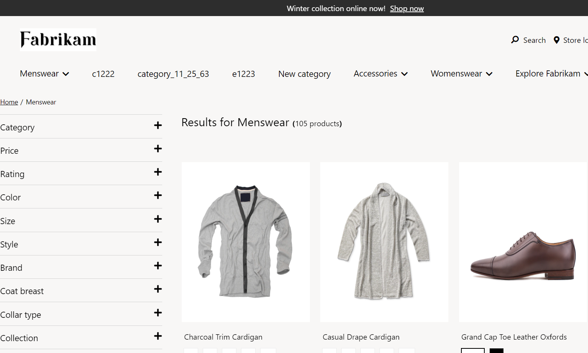
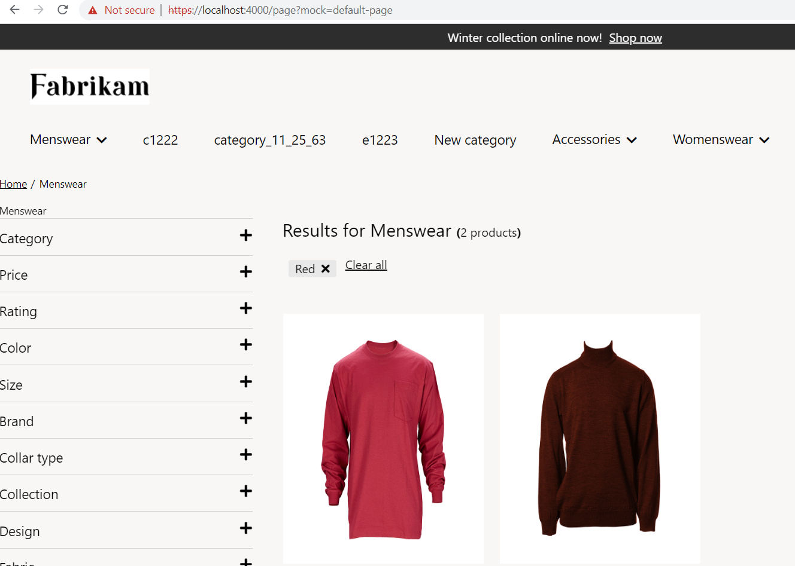
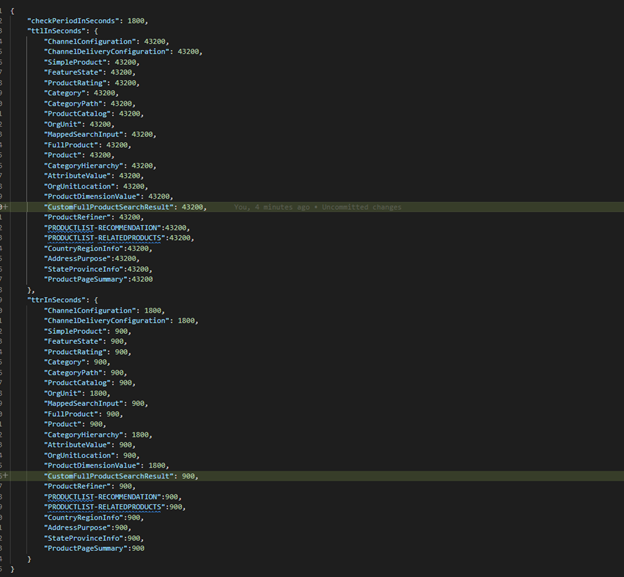

# Dynamics 365 Commerce - online extensibility samples

## License
License is listed in the [LICENSE](./LICENSE) file.

# Sample - Role based caching

## Overview
In this sample, you will learn how to render products based on user types/roles on the product list page.

If no role has been set, all the products will be listed without any filter being applied


When role based caching is implemented as per this sample, products will be filtered on the page load depending on the role that is set


## Starter kit license
License for starter kit is listed in the [LICENSE](./module-library/LICENSE) .

## Prerequisites
Follow the instructions mentioned in [document](https://docs.microsoft.com/en-us/dynamics365/commerce/e-commerce-extensibility/setup-dev-environment) to set up the development environment.

## Detailed Steps

The following steps will show how to replace the SDK provided data actions with customized data actions to filter the products on the product list page depending on the role that is being set.

### 1. Extend existing data action
Extend the data action **base-collection.action.ts** (to update the cache key with user type) and **get-full-products-by-collection.action.ts** (to make getCustomer call and to set user type).

Create a folder **actions** under src.
Create a new file **base-collection.action.ts** under  **src\actions** folder and copy the code given below

```typescript

import { CacheType, getCatalogId, IActionInput, IAny, ICommerceApiSettings, ICreateActionContext, IGeneric } from '@msdyn365-commerce/core';
import { convertToString, IQueryResultSettings, ProductRefinerValue, SortColumn } from '@msdyn365-commerce/retail-proxy';
import { buildCacheKey, QueryResultSettingsProxy } from '@msdyn365-commerce-modules/retail-actions';
import { toJS } from 'mobx';

import { hydrateRefinersFromUrl } from '../utils/url-utils';

/**
 * Export listPageType.
 */
export type listPageType = 'Category' | 'Search' | 'Unknown';

/**
 * Get include attributes from config.
 * @param inputData - ICreateActionContext.
 * @returns Boolean.
 */
function getIncludeAttributes(inputData: ICreateActionContext<IGeneric<IAny>, IGeneric<IAny>>): boolean {
    if (inputData && inputData.config && inputData.config.includeAttributes !== undefined && inputData.config.includeAttributes === true) {
        return true;
    }
    return false;
}

/**
 * Get updateRefinerPanel from config.
 * @param inputData - ICreateActionContext.
 * @returns Boolean.
 */
function getUpdateRefinerPanel(inputData: ICreateActionContext<IGeneric<IAny>, IGeneric<IAny>>): boolean {
    return !!inputData.config?.updateRefinerPanel;
}

/**
 * BaseCollection Action Input.
 */
export class BaseCollectionInput implements IActionInput {
    public pageType: listPageType;

    public category: number | undefined;

    public searchText: string | undefined;

    public refiners: ProductRefinerValue[];

    public queryResultSettings: IQueryResultSettings;

    public apiSettings: ICommerceApiSettings;

    public includeAttributes: boolean | undefined;

    public locale?: string;

    public isUpdateRefinerPanel?: boolean;

    public catalogId?: number;

    public customerType?: string;

    public constructor(
        pageType: listPageType,
        apiSettings: ICommerceApiSettings,
        queryResultSettings: IQueryResultSettings,
        refiners: ProductRefinerValue[],
        category: number | undefined,
        searchText: string | undefined,
        includeAttributes: boolean | undefined,
        isUpdateRefinerPanel?: boolean | undefined,
        locale?: string,
        catalogId?: number,
        customerType?: string
    ) {
        this.pageType = pageType;
        this.apiSettings = apiSettings;
        this.category = category;
        this.searchText = searchText;
        this.queryResultSettings = queryResultSettings;
        this.refiners = refiners;
        this.includeAttributes = includeAttributes;
        this.isUpdateRefinerPanel = isUpdateRefinerPanel;
        this.locale = locale;
        this.catalogId = catalogId;
        this.customerType = customerType;
    }

    public getCacheKey = () => {
        const queryResultSettings = {
            ...this.queryResultSettings.Paging,
            ...toJS(this.queryResultSettings.Sorting)
        };

        const cacheKey = buildCacheKey(
            // eslint-disable-next-line @typescript-eslint/restrict-template-expressions -- disabling this as inputs can be undefined depending on page type
            `${this.pageType}-${this.customerType}-${this.locale}-${this.category || this.searchText}-${this.catalogId}-${this.refiners.map(
                refiner => `${refiner.RefinerRecordId + (refiner.LeftValueBoundString || '') + (refiner.RightValueBoundString || '')}-`
            )}-${convertToString(queryResultSettings)}`,
            this.apiSettings,
            this.locale
        );
        return cacheKey;
    };

    public getCacheObjectType = () => 'CollectionActionResult';

    public dataCacheType = (): CacheType => 'request';
}

// TODO: Create a data model here or import one to capture the response of the action
export interface IGetFullProductsByCollectionData {
    text: string;
}

export type CollectionClassConstructor = new (
    pageType: listPageType,
    apiSettings: ICommerceApiSettings,
    queryResultSettings: IQueryResultSettings,
    refiners: ProductRefinerValue[],
    category: number | undefined,
    searchText: string | undefined,
    includeAttributes: boolean | undefined,
    isUpdateRefinerPanel?: boolean | undefined,
    locale?: string,
    catalogId?: number,
    customerType?: string
) => BaseCollectionInput;

/**
 * TODO: Use this function to create the input required to make the action call.
 * @param args
 * @param inputClassConstuctor
 */
export const createBaseCollectionInput = (
    args: ICreateActionContext,
    inputClassConstuctor: CollectionClassConstructor,
    customerType?: string
): BaseCollectionInput => {
    const pageType =
        args.requestContext.urlTokens.pageType === 'Category' || (args.requestContext.query && args.requestContext.query.categoryId)
            ? 'Category'
            : 'Search';

    const queryResultSettings = QueryResultSettingsProxy.fromInputData(args).QueryResultSettings;
    const queryRefiners = hydrateRefinersFromUrl(args.requestContext);
    const includeAttributes = getIncludeAttributes(args);
    const isUpdateRefinerPanel = getUpdateRefinerPanel(args);
    const catalogId = getCatalogId(args.requestContext);

    if (args.requestContext.query && args.requestContext.query.sorting) {
        queryResultSettings.Sorting = { Columns: <SortColumn[]>JSON.parse(decodeURIComponent(args.requestContext.query.sorting)) };
    }

    if (pageType === 'Category') {
        return new inputClassConstuctor(
            pageType,
            args.requestContext.apiSettings,
            queryResultSettings,
            queryRefiners,
            +(args.requestContext.urlTokens.itemId || (args.requestContext.query && args.requestContext.query.categoryId) || 0),
            undefined,
            includeAttributes,
            isUpdateRefinerPanel,
            args.requestContext.locale,
            catalogId,
            customerType
        );
    } else if (pageType === 'Search' && args.requestContext.query && args.requestContext.query.q) {
        return new inputClassConstuctor(
            pageType,
            args.requestContext.apiSettings,
            queryResultSettings,
            queryRefiners,
            undefined,
            args.requestContext.query.q,
            includeAttributes,
            isUpdateRefinerPanel,
            args.requestContext.locale,
            catalogId,
            customerType
        );
    } else if (
        pageType === 'Search' &&
        args.requestContext.query &&
        args.requestContext.query.productId &&
        args.requestContext.query.recommendation
    ) {
        return new inputClassConstuctor(
            pageType,
            args.requestContext.apiSettings,
            queryResultSettings,
            queryRefiners,
            undefined,
            JSON.stringify({ ProductId: args.requestContext.query.productId, Recommendation: args.requestContext.query.recommendation }),
            includeAttributes,
            isUpdateRefinerPanel,
            args.requestContext.locale,
            catalogId,
            customerType
        );
    }

    throw new Error('[getFullProductsForCollection]Unable to create input');
};


```

To extend **get-full-products-by-collection** create a new file **get-full-products-by-collection.action.ts** to **src\actions** folder and add the code snippets given below

```typescript
import {
    CacheType,
    createObservableDataAction,
    IAction,
    IActionContext,
    IActionInput,
    ICreateActionContext
} from '@msdyn365-commerce/core';
import { getCustomer, GetCustomerInput } from '@msdyn365-commerce-modules/retail-actions';
import customDataAction, {
    CustomGetFullProductsByCollectionInput,
    IFullProductsSearchResultsWithCount
} from './custom-get-full-products-by-collection.action';
import { BaseCollectionInput, createBaseCollectionInput } from './base-collection.action';

let productCollectionArgs: ICreateActionContext<{ itemsPerPage: number; includedAttributes: boolean | undefined }>;

/**
 * GetFullProductsByCollection Action Input.
 */
export class GetFullProductsByCollectionInput extends BaseCollectionInput implements IActionInput {
    public getCacheKey = () => 'FullProductByCollection';
    /**
     * The cache object type.
     * @returns The cache object type.
     */
    public getCacheObjectType = (): string => 'FullProductSearchResult';

    /**
     * The data cache type.
     * @returns The data cache type.
     */
    public dataCacheType = (): CacheType => {
        return 'none';
    };
}

/**
 * CreateInput function which creates and actionInput used to fetch products for a list page.
 * @param args - The API arguments.
 * @returns IActionInput - The action input.
 */
const createInput = (args: ICreateActionContext<{ itemsPerPage: number; includedAttributes: boolean | undefined }>): IActionInput => {
    productCollectionArgs = args;

    return createBaseCollectionInput(args, GetFullProductsByCollectionInput);
};

/**
 * Action function to fetch products for a list page.
 * @param input - The input.
 * @param context - The context.
 * @returns IFullProductsSearchResultsWithCount - The full product search result with count.
 */
async function action(input: GetFullProductsByCollectionInput, context: IActionContext): Promise<IFullProductsSearchResultsWithCount> {
    let customerType: string = '';
    let products: IFullProductsSearchResultsWithCount = {
        products: [],
        count: 0
    };
    const isUserAuthenticated = context.requestContext.user.isAuthenticated;
    if (isUserAuthenticated) {
        const customerInput = new GetCustomerInput(context.requestContext.apiSettings, context.requestContext.user.customerAccountNumber);
        const customer = await getCustomer(customerInput, context);

        // Read the extension property and set the customerType value as required
        const customerTypeFromExtension: string =
            customer?.ExtensionProperties?.find(x => x.Key === 'CMISRecommend')?.Value?.StringValue || '';

        if (customerTypeFromExtension === 'CMISTemple') {
            customerType = 'Temple';
        } else if (customerTypeFromExtension === 'CMISEndowment') {
            customerType = 'Endowment';
        }
    } else {
        customerType = 'Anonymous';
    }

    const updatedArgs: ICreateActionContext = {
        requestContext: context.requestContext,
        config: productCollectionArgs.config,
        data: productCollectionArgs.data
    };

    const baseCollectionInput: BaseCollectionInput = createBaseCollectionInput(
        updatedArgs,
        CustomGetFullProductsByCollectionInput,
        customerType
    );

    if (input.refiners.length > 0) {
        baseCollectionInput.refiners = input.refiners;
    } else {
        baseCollectionInput.refiners = [];
    }
    // Set Top
    if (baseCollectionInput.queryResultSettings.Paging && productCollectionArgs.config) {
        baseCollectionInput.queryResultSettings.Paging.Top = productCollectionArgs.config.itemsPerPage || 1;
    }

    // Set Skip
    if (
        baseCollectionInput.queryResultSettings.Paging &&
        productCollectionArgs.requestContext.query &&
        productCollectionArgs.requestContext.query.skip
    ) {
        baseCollectionInput.queryResultSettings.Paging.Skip = +productCollectionArgs.requestContext.query.skip;
    }

    if (input.queryResultSettings.Sorting && input.queryResultSettings.Sorting.Columns) {
        baseCollectionInput.queryResultSettings.Sorting = input.queryResultSettings.Sorting;
    }

    baseCollectionInput.queryResultSettings.count = true;

    products = await customDataAction(baseCollectionInput, context);

    return products;
}

export const actionDataAction = createObservableDataAction({
    id: '@msdyn365-commerce-modules/search-result-container/get-full-products-by-collection',
    action: <IAction<IFullProductsSearchResultsWithCount>>action,
    input: createInput
});

export default actionDataAction;

```
### 2. Update the cache settings for **FullProductSearchResult** as **CustomFullProductSearchResult** like below
Navigate to file **src/settings/cache.settings.json** and update the cache settings  for **FullProductSearchResult** as **CustomFullProductSearchResult** so that it will reflect the customized cache settings that we have implemented.


### 3. Copy the dependencies
1. Create a new file named **list-page-state.ts** under **src\actions** folder and paste the code below in it

```typescript

import { IProductRefinerHierarchy } from '@msdyn365-commerce/commerce-entities';
import {
    CacheType,
    createObservableDataAction,
    IAction,
    IActionContext,
    IActionInput,
    IAny,
    ICreateActionContext,
    IGeneric
} from '@msdyn365-commerce/core';
import { ProductPrice, ProductRefinerValue, ProductSearchResult, SimpleProduct, SortingInfo } from '@msdyn365-commerce/retail-proxy';
import { observable } from 'mobx';

import { listPageType } from './base-collection.action';

/**
 * ListPageState class.
 */
export class ListPageState {
    @observable public activeFilters: ProductRefinerValue[] | null = null;
    @observable public activeProducts: ProductSearchResult[] = [];
    @observable public sortingCritera: SortingInfo | null = null;
    @observable public currentPageNumber: number | null = null;
    @observable public refiners: IProductRefinerHierarchy[] | null = null;
    @observable public totalProductCount: number | undefined;
    @observable public pageSize: number = 10;
    @observable public pageType: listPageType = 'Unknown';
    @observable public featureProduct: SimpleProduct | null = null;
    @observable public productPrices: ProductPrice[] | undefined = [];
}

/**
 * ListPageStateInput - action input.
 */
export class ListPageStateInput implements IActionInput {
    public getCacheKey = () => 'ListPageState';
    public getCacheObjectType = () => 'ListPageState';
    public dataCacheType = (): CacheType => 'request';
}

export async function listPageStateAction(input: ListPageStateInput, ctx: IActionContext): Promise<ListPageState> {
    return new ListPageState();
}

/**
 * Create new input for create action.
 * @param inputData
 */
export const createListPageInput = (inputData: ICreateActionContext<IGeneric<IAny>>): IActionInput => {
    return new ListPageStateInput();
};

/**
 * ListPageState - create action.
 */
export default createObservableDataAction<ListPageState>({
    action: <IAction<ListPageState>>listPageStateAction,
    input: createListPageInput
});

```
2. Create a file **url-utils.ts** under **src\utils** folder and copy the code mentioned below in it

```typescript

import MsDyn365, { IRequestContext } from '@msdyn365-commerce/core';
import { ProductRefinerValue, SortColumn } from '@msdyn365-commerce/retail-proxy';

/**
 * Refiner Compression:
 * Refiners contains a non-trivial amount of data that is required to successfully make
 * a refiner-based API call. To allow for deep-linking of refiners in the URL, refiner data
 * must be compressed so that URL max length is not exceeded. Refiners will be compressed into
 * the following array style index-based format:
 * [DataTypeValue, LeftValueBoundString, RefinerRecordId, RefinerSourceValue, RightValueBoundString, UnitText].
 */
const compressedRefinerKeys = [
    'DataTypeValue',
    'LeftValueBoundString',
    'RefinerRecordId',
    'RefinerSourceValue',
    'RightValueBoundString',
    'UnitText'
];

/**
 * Hydrates compressed refiner data from URL.
 * @param fullUrl The full URL of the page.
 * @param requestContext
 */
export const hydrateRefinersFromUrl = (requestContext: IRequestContext): ProductRefinerValue[] => {
    const compressedRefinerArray = parseQueryParam<(string | number)[][]>('refiners', requestContext);
    if (!compressedRefinerArray || compressedRefinerArray.length === 0) {
        return [];
    }

    return <ProductRefinerValue[]>compressedRefinerArray
        .map(compressedRefiner => {
            try {
                const parsedRefiner: ProductRefinerValue = {};
                compressedRefinerKeys.forEach((refinerKey, index) => {
                    parsedRefiner[refinerKey] = compressedRefiner[index];
                });
                return parsedRefiner;
            } catch {
                return undefined;
            }
        })
        .filter(Boolean);
};

/**
 * Compressed a list of refiners for use in URLs.
 * @param refiners The uncompressed refiners.
 */
export const compressRefiners = (refiners: ProductRefinerValue[]) => {
    const compressedRefiners: (string | number)[][] = [];

    refiners.forEach(refiner => {
        const compressedRefiner: (string | number)[] = [];
        compressedRefinerKeys.forEach(refinerKey => {
            compressedRefiner.push(refiner[refinerKey]);
        });
        compressedRefiners.push(compressedRefiner);
    });

    return compressedRefiners;
};

/**
 * Method which creates a URL contiaining serialized active refiners.
 * @param fullUrl The Current URL of the page.
 * @param refiners The refiners which should be added to the URL.
 * @param sortingColumns
 * @param skipCount
 */
export const buildListPageUrl = (fullUrl: URL, refiners?: ProductRefinerValue[], sortingColumns?: SortColumn[], skipCount?: number) => {
    // Refiner Change flow
    if (refiners !== undefined) {
        if (refiners.length === 0) {
            fullUrl.searchParams.delete('refiners');
        } else {
            const sortedRefiners = refiners.sort((first, second) =>
                first.RefinerRecordId && second.RefinerRecordId && first.RefinerRecordId > second.RefinerRecordId ? 1 : -1
            );
            fullUrl.searchParams.set('refiners', JSON.stringify(compressRefiners(sortedRefiners)));
        }

        // Adding or removing a refiner means we want to always load page 1
        fullUrl.searchParams.delete('skip');
        return fullUrl.href;
    }

    if (sortingColumns !== undefined) {
        if (sortingColumns.length === 0) {
            fullUrl.searchParams.delete('sorting');
        } else {
            fullUrl.searchParams.set('sorting', JSON.stringify(sortingColumns));
        }

        // Changing the sort means always load page 1
        fullUrl.searchParams.delete('skip');
        return fullUrl.href;
    }

    if (skipCount) {
        fullUrl.searchParams.set('skip', skipCount.toString());
    }

    return fullUrl.href;
};

/**
 * Parses a query param from the query object of the request context.
 * @param key The query parameter key.
 * @param requestContext The request context.
 */
export const parseQueryParam = <T>(key: string, requestContext: IRequestContext): T | null => {
    if (requestContext.query && requestContext.query[key]) {
        return <T>JSON.parse(decodeURIComponent(requestContext.query[key]));
    }
    return null;
};

/**
 * Gets the current URL of the page from the request context.
 * @param requestContext The request context.
 */
export const getCurrentUrl = (requestContext: IRequestContext): URL => {
    if (MsDyn365.isBrowser) {
        return new URL(window.location.href);
    }

    // NOTE: Typing on requestURL is incorrect
    if (requestContext.url.requestUrl.href) {
        return new URL(requestContext.url.requestUrl.href);
    }
    return new URL(<string>(<unknown>requestContext.url.requestUrl));
};
```

### 4. Change Refiners
Create a new file **custom-get-full-products-by-collection.action.ts** under **src/actions** folder to update the refiners as needed. Example of such refiners is listed below

The refiner that is added as below will be applied on the product list page based on the role.
```typescript

import MsDyn365, {
    CacheType,
    createObservableDataAction,
    IAction,
    IActionContext,
    IActionInput,
    ICreateActionContext
} from '@msdyn365-commerce/core';
import {
    AsyncResult,
    ChannelInventoryConfiguration,
    ProductRefinerValue,
    ProductSearchCriteria,
    ProductSearchResult
} from '@msdyn365-commerce/retail-proxy';
import { searchByCriteriaAsync } from '@msdyn365-commerce/retail-proxy/dist/DataActions/ProductsDataActions.g';
import { getInventoryConfigurationAsync } from '@msdyn365-commerce/retail-proxy/dist/DataActions/StoreOperationsDataActions.g';
import { ArrayExtensions, generateProductImageUrl, InventoryLevels, ObjectExtensions } from '@msdyn365-commerce-modules/retail-actions';

import { ListPageStateInput } from './list-page-state';
import { BaseCollectionInput, createBaseCollectionInput } from './base-collection.action';
import { compressRefiners } from '../utils/url-utils';

/**
 * GetFullProductsByCollection Action Input.
 */
export class CustomGetFullProductsByCollectionInput extends BaseCollectionInput implements IActionInput {
    /**
     * The cache object type.
     * @returns The cache object type.
     */
    public getCacheObjectType = (): string => 'CustomFullProductSearchResult';

    /**
     * The data cache type.
     * @returns The data cache type.
     */
    public dataCacheType = (): CacheType => {
        return 'application';
    };
}

/**
 * This setting defines inventory filtering options.
 */
export enum ProductListInventoryFilteringOptions {
    /**
     * Filter out all products out of stock.
     */
    HideOOS = 'hideOOS',

    /**
     * Sort products by availability, OOS goes last.
     */
    SortOOS = 'sortOOS',

    /**
     * No filtering selected.
     */
    Default = 'default'
}

/**
 * The full product search result with count interface.
 */
export interface IFullProductsSearchResultsWithCount {
    products: ProductSearchResult[];
    count: number;
    channelInventoryConfigurationId?: number;
}

/**
 * CreateInput function which creates and actionInput used to fetch products for a list page.
 * @param args - The API arguments.
 * @param customerType - Customer type.
 * @returns IActionInput - The action input.
 */
export const customInput = (
    args: ICreateActionContext<{ itemsPerPage: number; includedAttributes: boolean | undefined }>,
    customerType?: string
): IActionInput => {
    const input = createBaseCollectionInput(args, CustomGetFullProductsByCollectionInput, customerType);

    // Set Top
    if (input.queryResultSettings.Paging && args.config) {
        input.queryResultSettings.Paging.Top = args.config.itemsPerPage || 1;
    }

    // Set Skip
    if (input.queryResultSettings.Paging && args.requestContext.query && args.requestContext.query.skip) {
        input.queryResultSettings.Paging.Skip = +args.requestContext.query.skip;
    }

    input.queryResultSettings.count = true;

    return input;
};

/**
 * Finds whether a product is out of stock based on the attribute.
 * @param  product - The product.
 * @param  channelInventoryConfiguration - The channel configuration.
 * @returns True if is OOS, false otherwise.
 */
function isOutOfStock(product: ProductSearchResult, channelInventoryConfiguration: ChannelInventoryConfiguration): boolean {
    if (!ArrayExtensions.hasElements(product.AttributeValues)) {
        // If no attributes then assume is in stock
        return false;
    }
    for (const attribute of product.AttributeValues) {
        if (
            attribute.RecordId === channelInventoryConfiguration.InventoryProductAttributeRecordId &&
            attribute.TextValue === channelInventoryConfiguration.InventoryOutOfStockAttributeValueText
        ) {
            // The matching recordId indicates that is the inventory attribute
            // if the text value are the same then is out of stock.
            return true;
        }
    }

    return false;
}

/**
 * Returns only in stock products.
 * @param  products - The product.
 * @param  channelInventoryConfiguration - The channel configuration.
 * @returns Filtered product search result.
 */
function filterOutOfStockProducts(
    products: ProductSearchResult[],
    channelInventoryConfiguration: ChannelInventoryConfiguration
): ProductSearchResult[] {
    if (!ArrayExtensions.hasElements(products)) {
        return [];
    }
    const filteredProducts: ProductSearchResult[] = [];

    for (const product of products) {
        if (!isOutOfStock(product, channelInventoryConfiguration)) {
            filteredProducts.push(product);
        }
    }
    return filteredProducts;
}

/**
 * Returns sorted products based on availability.
 * @param  products - The product.
 * @param  channelInventoryConfiguration - The channel configuration.
 * @returns Sorted product search result.
 */
function sortsProductsBasedOnAvailability(
    products: ProductSearchResult[],
    channelInventoryConfiguration: ChannelInventoryConfiguration
): ProductSearchResult[] {
    if (!ArrayExtensions.hasElements(products)) {
        return [];
    }
    const inStockProducts: ProductSearchResult[] = [];
    const outOfStockProducts: ProductSearchResult[] = [];

    for (const product of products) {
        if (isOutOfStock(product, channelInventoryConfiguration)) {
            outOfStockProducts.push(product);
        } else {
            inStockProducts.push(product);
        }
    }
    return inStockProducts.concat(outOfStockProducts);
}

/**
 * Returns list of products based on inventory information.
 * @param  products - The products.
 * @param  channelInventoryConfiguration - The channel configuration.
 * @param  context - The context.
 * @returns List of product based on the inventory information.
 */
export function returnProductsBasedOnInventoryInformation(
    products: ProductSearchResult[],
    channelInventoryConfiguration: ChannelInventoryConfiguration,
    context: IActionContext
): ProductSearchResult[] {
    if (!ArrayExtensions.hasElements(products) || ObjectExtensions.isNullOrUndefined(channelInventoryConfiguration)) {
        return [];
    }
    switch (context.requestContext.app.config.productListInventoryDisplay) {
        case ProductListInventoryFilteringOptions.HideOOS:
            return filterOutOfStockProducts(products, channelInventoryConfiguration);
        case ProductListInventoryFilteringOptions.SortOOS:
            return sortsProductsBasedOnAvailability(products, channelInventoryConfiguration);
        default:
            return products;
    }
}

/**
 * Returns list of products based on inventory information.
 * @param  productSearchResults - The products.
 * @param  context - The context.
 * @param  metadataCount - The metadata count.
 * @returns List of product based on the inventory information.
 */
export async function returnProducts(
    productSearchResults: ProductSearchResult[],
    context: IActionContext,
    metadataCount: number | undefined,
    channelInventoryConfiguration: ChannelInventoryConfiguration
): Promise<IFullProductsSearchResultsWithCount> {
    const defaultProductCount: number = 0;

    const productSearchResultsWithImages = productSearchResults.map(productSearchResult => {
        const newImageUrl = generateProductImageUrl(productSearchResult, context.requestContext.apiSettings);

        if (newImageUrl) {
            productSearchResult.PrimaryImageUrl = newImageUrl;
        }

        return productSearchResult;
    });

    // If inventory level is threshold or inventory check is disabled then return the list of products without the inventory configuration
    // eslint-disable-next-line @typescript-eslint/no-unsafe-member-access -- read config file.
    if (
        context.requestContext.app.config.inventoryLevel === InventoryLevels.threshold ||
        context.requestContext.app.config.enableStockCheck === false
    ) {
        return {
            products: productSearchResultsWithImages,
            count: metadataCount ?? defaultProductCount
        };
    }
    const mappedProducts = productSearchResultsWithImages.map(productSearchResult => {
        if (ArrayExtensions.hasElements(productSearchResult.AttributeValues)) {
            for (const element of productSearchResult.AttributeValues) {
                // eslint-disable-next-line @typescript-eslint/no-unnecessary-condition -- need check.
                if (
                    channelInventoryConfiguration &&
                    element.RecordId !== undefined &&
                    element.RecordId === channelInventoryConfiguration.InventoryProductAttributeRecordId &&
                    // eslint-disable-next-line @typescript-eslint/no-unsafe-member-access -- read config file.
                    context.requestContext.app.config.inventoryRanges !== 'all' &&
                    element.TextValue !== channelInventoryConfiguration.InventoryOutOfStockAttributeValueText
                ) {
                    // If same RecordId then it means that is the Inventory attribute
                    // Based on the inventory range (and filtering options), the inventory label will be displayed
                    // If Inventory range is 'All' then in stock and out of stock labels are shown, else only OOS
                    // if the text value is different that the channelInventoryConfiguration.InventoryOutOfStockAttributeValueText then is in stock
                    element.TextValue = '';
                }
            }
        }

        return productSearchResult;
    });
    const productsBasedOnInventory = returnProductsBasedOnInventoryInformation(mappedProducts, channelInventoryConfiguration, context);
    return {
        products: productsBasedOnInventory,
        count: metadataCount ?? defaultProductCount,
        // eslint-disable-next-line @typescript-eslint/no-unnecessary-condition -- check config.
        channelInventoryConfigurationId: channelInventoryConfiguration
            ? channelInventoryConfiguration.InventoryProductAttributeRecordId
            : undefined
    };
}

/**
 * Action function to fetch products for a list page.
 * @param input - The input.
 * @param context - The context.
 * @returns IFullProductsSearchResultsWithCount - The full product search result with count.
 */
export async function customAction(
    input: CustomGetFullProductsByCollectionInput,
    context: IActionContext
): Promise<IFullProductsSearchResultsWithCount> {
    let promise: AsyncResult<ProductSearchResult[]>;
    let searchProductId;
    const searchCriteriaInput: ProductSearchCriteria = {};
    searchCriteriaInput.Context = { ChannelId: context.requestContext.apiSettings.channelId, CatalogId: input.catalogId };
    searchCriteriaInput.Refinement = input.refiners;
    searchCriteriaInput.IncludeAttributes = input.includeAttributes;

    // change the below refiners as per requirement
    const anonymousRefiner: ProductRefinerValue = {
        RefinerRecordId: 11290923669,
        RightValueBoundString: 'Picton Blu',
        LeftValueBoundString: 'Picton Blu',
        RefinerSourceValue: 1,
        Count: 3,
        DataTypeValue: 5,
        ExtensionProperties: [],
        LeftValueBoundLocalizedString: '',
        RightValueBoundLocalizedString: '',
        RowNumber: 0,
        SwatchColorHexCode: '#36A1F2',
        SwatchImageUrl: '',
        UnitText: '',
        //@ts-ignore
        '@odata.type': '#Microsoft.Dynamics.Commerce.Runtime.DataModel.ProductRefinerValue'
    };

    const user1Refiner: ProductRefinerValue = {
        RefinerRecordId: 11290923669,
        RightValueBoundString: 'Grape',
        LeftValueBoundString: 'Grape',
        RefinerSourceValue: 1,
        Count: 1,
        DataTypeValue: 5,
        ExtensionProperties: [],
        LeftValueBoundLocalizedString: '',
        RightValueBoundLocalizedString: '',
        RowNumber: 0,
        SwatchColorHexCode: '#6f2da8',
        SwatchImageUrl: '',
        UnitText: '',
        //@ts-ignore
        '@odata.type': '#Microsoft.Dynamics.Commerce.Runtime.DataModel.ProductRefinerValue'
    };

    const user2Refiner: ProductRefinerValue = {
        RefinerRecordId: 11290923669,
        RightValueBoundString: 'Mantis',
        LeftValueBoundString: 'Mantis',
        RefinerSourceValue: 1,
        Count: 1,
        DataTypeValue: 5,
        ExtensionProperties: [],
        LeftValueBoundLocalizedString: '',
        RightValueBoundLocalizedString: '',
        RowNumber: 0,
        SwatchColorHexCode: '#74c365',
        SwatchImageUrl: '',
        UnitText: '',
        //@ts-ignore
        '@odata.type': '#Microsoft.Dynamics.Commerce.Runtime.DataModel.ProductRefinerValue'
    };
    const channelInventoryConfiguration = await getInventoryConfigurationAsync({ callerContext: context });
    const isUserAuthenticated = context.requestContext.user.isAuthenticated;
    if (isUserAuthenticated) {
        if (input.customerType === 'Temple') {
            if (
                !searchCriteriaInput.Refinement.find(
                    refiner =>
                        refiner.RefinerRecordId === user1Refiner.RefinerRecordId &&
                        refiner.LeftValueBoundString === user1Refiner.LeftValueBoundString
                )
            ) {
                searchCriteriaInput.Refinement.push(user1Refiner);
            }
        } else if (input.customerType === 'Endowment') {
            if (
                !searchCriteriaInput.Refinement.find(
                    refiner =>
                        refiner.RefinerRecordId === user2Refiner.RefinerRecordId &&
                        refiner.LeftValueBoundString === user2Refiner.LeftValueBoundString
                )
            ) {
                searchCriteriaInput.Refinement.push(user2Refiner);
            }
        }
    } else {
        if (
            !searchCriteriaInput.Refinement.find(
                refiner =>
                    refiner.RefinerRecordId === anonymousRefiner.RefinerRecordId &&
                    refiner.LeftValueBoundString === anonymousRefiner.LeftValueBoundString
            )
        ) {
            searchCriteriaInput.Refinement.push(anonymousRefiner);
        }
    }

    if (searchCriteriaInput && searchCriteriaInput.Refinement) {
        const compressRefiner = compressRefiners(searchCriteriaInput.Refinement);
        context.requestContext.query!['refiners'] = JSON.stringify(compressRefiner);
    }

    searchCriteriaInput.SkipVariantExpansion = true;
    const defaultNumber: number = 0;

    if (input.pageType === 'Category' || (context.requestContext.query && context.requestContext.query.categoryId)) {
        if (input.category) {
            searchCriteriaInput.CategoryIds = [input.category || defaultNumber];
            promise = searchByCriteriaAsync(
                {
                    callerContext: context,
                    queryResultSettings: input.queryResultSettings
                },
                searchCriteriaInput
            );
        } else {
            throw new Error('[GetFullProductsForCollection]Category Page Detected, but no global categoryId found');
        }
    } else if (input.searchText && context.requestContext.query && context.requestContext.query.q) {
        searchCriteriaInput.SearchCondition = input.searchText;
        promise = searchByCriteriaAsync(
            {
                callerContext: context,
                queryResultSettings: input.queryResultSettings
            },
            searchCriteriaInput
        );
    } else if (
        input.searchText &&
        context.requestContext.query &&
        context.requestContext.query.productId &&
        context.requestContext.query.recommendation
    ) {
        const searchObject = JSON.parse(input.searchText);
        searchProductId = Number(searchObject.ProductId);
        if (Number.isNaN(searchProductId)) {
            throw new Error('Failed to cast search product id into a number.');
        } else if (!searchObject.Recommendation) {
            throw new Error('Failed to retrieve the Recommendation.');
        } else {
            searchCriteriaInput.RecommendationListId = searchObject.Recommendation;
            searchCriteriaInput.Ids = [searchProductId || defaultNumber];
            promise = searchByCriteriaAsync(
                {
                    callerContext: context,
                    queryResultSettings: input.queryResultSettings
                },
                searchCriteriaInput
            );
        }
    } else {
        throw new Error('[GetFullProductsForCollection]Search Page Detected, but no q= or productId= query parameter found');
    }

    const productSearchResults = await promise;

    // Update ListPageState For SSR
    if (!MsDyn365.isBrowser) {
        context.update(new ListPageStateInput(), {
            totalProductCount: promise.metadata.count ?? defaultNumber,
            activeFilters: input.refiners
        });
    }

    return returnProducts(productSearchResults, context, promise.metadata.count, channelInventoryConfiguration);
}

export const customDataAction = createObservableDataAction({
    id: '@msdyn365-commerce-modules/search-result-container/custom-get-full-products-by-collection',
    action: <IAction<IFullProductsSearchResultsWithCount>>customAction,
    input: customInput
});

export default customDataAction;

```

### 5. Build and test module

The sample can now be tested in a web browser using the ```yarn start``` command.

Once the code has finished building, you can test against your production or sandbox environment using https://localhost:4000  (ensure that you have the  [MSDyn365_HOST environment](https://docs.microsoft.com/en-us/dynamics365/commerce/e-commerce-extensibility/configure-env-file#msdyn365_host) variable properly set) to navigate to the homepage. Select the hamburger icon and select any category to navigate to the product list page. You should be able to see the products filtered out depending on the refiner and role that is being set in the code.

## Third party Image and Video Usage restrictions

The software may include third party images and videos that are for personal use only and may not be copied except as provided by Microsoft within the demo websites.  You may install and use an unlimited number of copies of the demo websites., You may not publish, rent, lease, lend, or redistribute any images or videos without authorization from the rights holder, except and only to the extent that the applicable copyright law expressly permits doing so.
