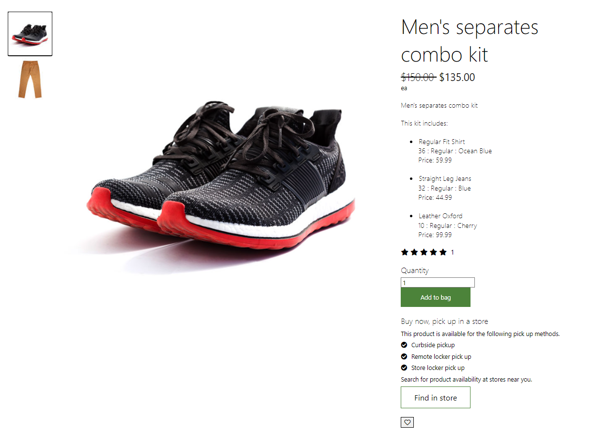
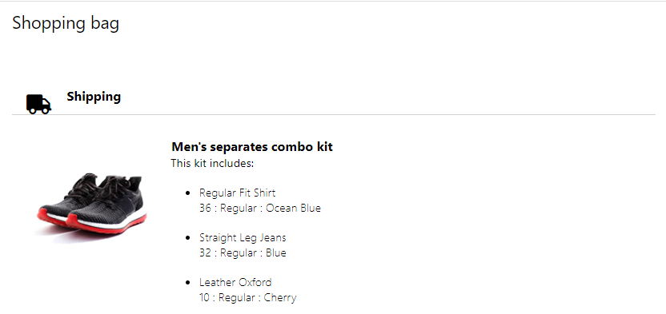
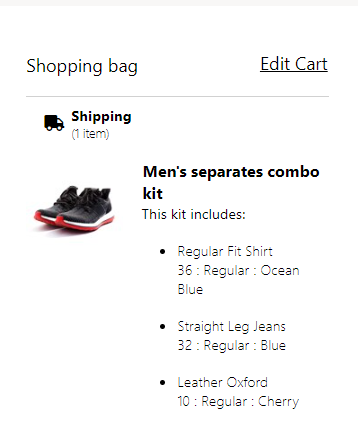
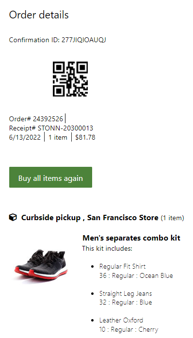

# Dynamics 365 Commerce - online extensibility samples

## License
License is listed in the [LICENSE](./LICENSE) file.

# Sample - Sample Product Kit

## Overview
A sample kit product is a kind of bundle that comes up with multiple products in the product description page. It will have some discount on the purchase in comparison to buying those products individually. End user can see the discounted price and strikethrough price on UI based on the HQ configurations for the kit product.

Below is the screenshot of product description page for the sample kit product.

PDP Page Screenshot



Cart Page Screenshot



Checkout Page Screenshot



Order Details Page Screenshot



## Starter kit license
License for starter kit is listed in the [LICENSE](./module-library/LICENSE)

## Prerequisites
Follow the instructions mentioned in [document](https://docs.microsoft.com/en-us/dynamics365/commerce/e-commerce-extensibility/setup-dev-environment) to set up the development environment.

### Procedure to create custom theme
Follow the instructions mentioned in [document](https://docs.microsoft.com/en-us/dynamics365/commerce/e-commerce-extensibility/create-theme) to create the custom theme,in this sample, we'll assume a custom theme has been cloned from the fabrikam theme named "fabrikam-extended".

Need to configure the sample kit product in HQ to run this Sample.

## Detailed Steps

### 1. Override component cartlineitem.component.tsx in the src/themes/fabrikam-extended/views/components
The cart line item shared component needs to be extended to render based on a standard versus kit product. This component is used on the cart page, checkout page and the order details page to render the kit product appropriately.

Note: if the file does not exist on this path **src/themes/fabrikam-extended/views/components/cartlineitem.component.tsx**, execute below command to override the component. if **cartlineitem.component** exists add the below code in **src/themes/fabrikam-extended/views/components/cartlineitem.component** file.

**yarn msdyn365 add-component-override fabrikam-extended cartlineitem.component**

```typescript
/*--------------------------------------------------------------
 * Copyright (c) Microsoft Corporation. All rights reserved.
 * See License.txt in the project root for license information.
 *--------------------------------------------------------------*/

import MsDyn365, { IComponentProps, IGridSettings, IImageSettings, Image, msdyn365Commerce } from '@msdyn365-commerce/core';
import { ICartState } from '@msdyn365-commerce/global-state';
import { ChannelDeliveryOptionConfiguration, SimpleProduct } from '@msdyn365-commerce/retail-proxy';
import { CartLine, ProductCatalog, SalesLine } from '@msdyn365-commerce/retail-proxy/dist/Entities/CommerceTypes.g';
import { ArrayExtensions, getFallbackImageUrl, ObjectExtensions } from '@msdyn365-commerce-modules/retail-actions';
import { getPayloadObject, getTelemetryAttributes, ITelemetryContent } from '@msdyn365-commerce-modules/utilities';
import classNames from 'classnames';
import * as React from 'react';
import { PriceComponent, CartLinePriceEditor, ICartLinePriceEditorResources } from '@msdyn365-commerce/components';

/**
 * ICartlineResourceString: Interface for specifying the
 * resource strings that the component needs.
 */
export interface ICartlineResourceString {

    /**
     * Display string for discount label.
     */
    discountStringText: string;

    /**
     * String for size key.
     */
    sizeString: string;

    /**
     * String for color key.
     */
    colorString: string;

    /**
     * String associated with the configuration product dimension.
     */
    configString: string;

    /**
     * String for style key.
     */
    styleString: string;

    /**
     * String for amount key.
     */
    amountString?: string;

    /**
     * Display string for quantity label.
     */
    quantityDisplayString: string;

    /**
     * Display string for quantity label.
     */
    inputQuantityAriaLabel: string;

    /**
     * Aria label for the decrement button in quantity component.
     */
    decrementButtonAriaLabel?: string;

    /**
     * Aria label for the increment button in quantity component.
     */
    incrementButtonAriaLabel?: string;

    /**
     * Original text screen reader.
     */
    originalPriceText: string;

    /**
     * Current text screen reader.
     */
    currentPriceText: string;

    /**
     * Shipping Charges Text.
     */
    shippingChargesText: string;

    priceEditorResources?: ICartLinePriceEditorResources;
}

/**
 * The data about the cart line and products.
 */
export interface ICartLineData {
    cartLine: CartLine | SalesLine;
    cartState?: ICartState;
    product?: SimpleProduct;
    catalogs?: ProductCatalog[];
}

export type CartLineDisplayMode = 'DEFAULT' | 'COMPACT';

/**
 * ICartLineProps: The props required to render cartLineitem.
 */
export interface ICartLineProps extends IComponentProps<ICartLineData> {

    /**
     * The flag to change the quantity component from interactivity to static.
     */
    disableQuantityInteractivity?: boolean;

    /**
     * The primary image url.
     */
    primaryImageUrl?: string;

    /**
     * The product url.
     */
    productUrl?: string;

    /**
     * GridSettings for the product image in cartLine.
     */
    gridSettings: IGridSettings;

    /**
     * ImageSettings for the product image in cartLine.
     */
    imageSettings: IImageSettings;

    /**
     * Boolean flag to indicate if the item is out of stock.
     */
    isOutOfStock?: boolean;

    /**
     * Flag to make quantity section editable.
     */
    isQuantityEditable?: boolean;

    /**
     * Max quantity for line item.
     */
    maxQuantity?: number;

    /**
     * Current quantity for line item.
     */
    currentQuantity?: number;

    /**
     * Resource string for the component.
     */
    resources: ICartlineResourceString;

    /**
     * SalesLine flag.
     */
    isSalesLine?: boolean;

    /**
     * Error message to show in place of quantity.
     */
    errorMessage?: string;

    /**
     * Display mode to use.
     */
    displayMode?: CartLineDisplayMode;

    /**
     * Inventory information label.
     */
    inventoryInformationLabel?: string;

    /**
     * Inventory information class name.
     */
    inventoryLabelClassName?: string;

    /**
     * Flag to show/hide shipping charges for line items.
     */
    showShippingChargesForLineItems?: boolean;

    /**
     * Boolean flag to indicate if cart state status is ready.
     */
    isCartStateReady?: boolean;

    /**
     * Chanel Delivery Option configuration is from api.
     */
    channelDeliveryOptionConfig?: ChannelDeliveryOptionConfiguration;

    /**
     * The telemetry content.
     */
    telemetryContent?: ITelemetryContent;

    /**
     * The cart line index.
     */
    lineIndex?: number;

    /**
     * Quantity onChange callback.
     */
    quantityOnChange?(cartLine: CartLine, newQuantity: number, lineIndex?: number): void;
}

interface IDimensionStrings {

    /**
     * String for size key.
     */
    sizeString: string;

    /**
     * String for color key.
     */
    colorString: string;

    /**
     * String associated with the configuration product dimension.
     */
    configString: string;

    /**
     * String for style key.
     */
    styleString: string;

    /**
     * String for amount key.
     */
    amountString?: string;
}

const CartLineItemFunctions = {
    renderProductDimensions: (Product: SimpleProduct, DimensionStrings: IDimensionStrings) => {
        if (!Product || !Product.Dimensions) {
            return [];
        }

        if (Product.ProductTypeValue === 1 || Product.ProductTypeValue === 2) {
            // tslint:disable-next-line:jsx-key
                return Product.Components ? [(
                    <div key={`${Product.RecordId}ProductDimensions1`} className='msc-cart-line__product-variant-item'>
                        <div>This kit includes:</div>
                        <ul>
                            {Product.Components.map((item, index) => {
                                return (
                                    <li key={index} className='msc-cartline__kit-product-description__item'>
                                        <span>{item.Description}</span>
                                        <p>
                                            {item.Dimensions && item.Dimensions.map((dimension, i) => {
                                                return `${dimension && dimension.DimensionValue && dimension.DimensionValue.Value} ${(item.Dimensions && (i < item.Dimensions.length - 1) ? ' : ' : '')}`;
                                            })}
                                        </p>
                                    </li>
                                );
                            })}
                        </ul>
                    </div>)]
                    : [];
        }

        return Product.Dimensions.map(productDimension => {

            if (productDimension.DimensionTypeValue === 1) {
                return (
                    <div key={`${Product.RecordId}ProductDimensions1`} className='msc-cart-line__product-variant-item'>
                        <span className='msc-cart-line__product-variant-color'>
                            {DimensionStrings.colorString}
                            <span className='name'>
                                {productDimension.DimensionValue && productDimension.DimensionValue.Value}
                            </span>
                        </span>
                    </div>
                );
            }

            if (productDimension.DimensionTypeValue === 2) {
                return (
                    <div key={`${Product.RecordId}ProductDimensions2`} className='msc-cart-line__product-variant-item'>
                        <span className='msc-cart-line__product-configuration'>
                            {DimensionStrings.configString}
                            <span className='name'>
                                {productDimension.DimensionValue?.Value}
                            </span>
                        </span>
                    </div>
                );
            }

            if (productDimension.DimensionTypeValue === 3) {
                return (
                    <div key={`${Product.RecordId}ProductDimensions3`} className='msc-cart-line__product-variant-item'>
                        <span className='msc-cart-line__product-variant-size'>
                            {DimensionStrings.sizeString}
                            <span className='name'>
                                {productDimension.DimensionValue?.Value}
                            </span>
                        </span>
                    </div>
                );
            }

            if (productDimension.DimensionTypeValue === 4) {
                return (
                    <div key={`${Product.RecordId}ProductDimensions4`} className='msc-cart-line__product-variant-item'>
                        <span className='msc-cart-line__product-variant-style'>
                            {Product.IsGiftCard ? DimensionStrings.amountString : DimensionStrings.styleString}
                            <span className='name'>
                                {productDimension.DimensionValue?.Value}
                            </span>
                        </span>
                    </div>
                );
            }
            return null;
        });
    },
    renderDiscountLines: (props: ICartLineProps) => {

        if (!props.data.cartLine.DiscountLines || props.data.cartLine.DiscountLines.length === 0) {
            return null;
        }

        return props.data.cartLine.DiscountLines.map((discountLine, index) => {
            return (
                <div key={discountLine.OfferId || index} className='msc-cart-line-item-product-discount'>
                    <span className='msc-cart-line__product-savings-label'>
                        {discountLine.OfferName ? discountLine.OfferName : ''}
                        :
                        {` ${props.resources.discountStringText || 'Discount'} `}
                    </span>
                    <span className='msc-cart-line__promo-codes'>
                        {discountLine.DiscountCost && (
                            <>
                                <PriceComponent
                                    data={props.isSalesLine ? {
                                        price: {
                                            // @ts-expect-error
                                            CustomerContextualPrice: props.data.cartLine.PeriodicDiscount
                                        }
                                    } : {
                                        price: {
                                            CustomerContextualPrice: props.data.cartLine.DiscountAmountWithoutTax,
                                            BasePrice: props.data.cartLine.DiscountAmount
                                        }
                                    }}
                                    context={props.context}
                                    id={props.id}
                                    typeName={props.typeName}
                                    className='msc-cart-line__discount-value'
                                />
                            </>
                        )}
                    </span>
                    <span>
                        {` (${discountLine.EffectivePercentage !== undefined ? discountLine.EffectivePercentage : ''}%)`}
                    </span>
                </div>
            );
        });
    },
    renderInventoryLabel: (props: ICartLineProps) => {
        if (!props.inventoryInformationLabel) {
            return null;
        }
        const inventoryCssName = props.inventoryLabelClassName ? `msc-cart-line__product-inventory-label ${props.inventoryLabelClassName}` : 'msc-cart-line__product-inventory-label';
        return (
            <span className={inventoryCssName}>
                {props.inventoryInformationLabel}
            </span>
        );
    },

    /**
     * Gets the react node for product unit of measure display.
     * @param  props - ICartLineProps props.
     * @returns The node representing markup for unit of measure component.
     */
    renderUnitOfMeasure: (props: ICartLineProps) => {

        // eslint-disable-next-line @typescript-eslint/no-unsafe-member-access -- Do not need type check for appsettings
        if (props.context.app.config && (!props.context.app.config.unitOfMeasureDisplayType || props.context.app.config.unitOfMeasureDisplayType === 'none')) {
            return undefined;
        }

        const product = props.data.product;
        if (!product || !product.DefaultUnitOfMeasure) {
            return undefined;
        }

        return (
            <div className='msc-cartline__product-unit-of-measure'>
                <span>
                    {product.DefaultUnitOfMeasure}
                </span>
            </div>
        );
    },
    renderShippingLabel: (props: ICartLineProps) => {
        const pickupDeliveryModeCode = props.context.request.channel?.PickupDeliveryModeCode;
        const channelDeliveryOptionConfig = props.channelDeliveryOptionConfig;
        const cartline = props.data.cartLine;
        let hasShippingMethod = false;
        if (channelDeliveryOptionConfig !== undefined) {
            hasShippingMethod = !!(cartline.DeliveryMode && channelDeliveryOptionConfig.PickupDeliveryModeCodes?.some(deliveryMode => deliveryMode !== cartline.DeliveryMode));
        } else {
            hasShippingMethod = !!(cartline.DeliveryMode && cartline.DeliveryMode !== pickupDeliveryModeCode);
        }
        if (!hasShippingMethod) {
            return undefined;
        }

        const shippingChargeLines = (cartline.ChargeLines || []).filter(chargeLine => chargeLine.IsShipping);

        if (shippingChargeLines.length === 0) {
            return undefined;
        }

        const freightFee = shippingChargeLines.reduce((chargeTotal, chargeLine) => {
            return chargeTotal + (chargeLine.CalculatedAmount || 0);
        }, 0);

        const priceComponent = (
            <PriceComponent
                data={{
                    price: {
                        CustomerContextualPrice: freightFee
                    }
                }}
                freePriceText='Free'
                context={props.context}
                id={props.id}
                typeName={props.typeName}
                className='msc-cart-line__freight-actual'
            />
        );
        return (
            <>
                <label className='msc-cart-line__freight-label'>
                    {`${props.resources.shippingChargesText}:`}
                </label>
                <span className='shipping-value'>
                    {priceComponent}
                </span>
            </>
        );
    },
    renderOtherCharges: (props: ICartLineProps) => {
        const cartline = props.data.cartLine;
        const otherCharges = cartline.ChargeLines?.filter((chargeline) => !chargeline.IsShipping);

        return otherCharges && otherCharges.map((otherCharge, key) => {
            return otherCharge && otherCharge.CalculatedAmount ? (
                <div className='msc-cart-line__other-charges' key={key}>
                    <label className='msc-cart-line__other-charges-label'>
                        {`${otherCharge.Description}:`}
                    </label>
                    <span className='other-charge-value'>
                        <PriceComponent
                            data={{
                                price: {
                                    CustomerContextualPrice: otherCharge.CalculatedAmount
                                }
                            }}
                            context={props.context}
                            id={props.id}
                            typeName={props.typeName}
                            className='msc-cart-line__other-charges-actual'
                        />
                    </span>
                </div>
            ) : '';
        }) || undefined;
    }
};

/**
 * Renders catalog label for the cart line.
 * @param props - Cart line props.
 * @returns Catalog label.
 */
const CatalogLabelComponent: React.FC<ICartLineProps> = (props: ICartLineProps) => {
    const catalogId = props.data.cartLine.CatalogId;

    if (!props.context.request.user.isB2b || !catalogId || !ArrayExtensions.hasElements(props.data.catalogs)) {
        return null;
    }

    const catalog = props.data.catalogs.find(item => item.RecordId === catalogId);

    if (!catalog || !catalog.Name) {
        return null;
    }

    return (
        <div className='msc-cart-line__catalog-label'>
            {catalog.Name}
        </div>
    );
};

const CartLine: React.FC<ICartLineProps> = (props: ICartLineProps) => {
    const { isSalesLine, productUrl, resources } = props;
    const { product, cartLine } = props.data;

    const destructDimensionStrings = {
        sizeString: resources.sizeString,
        colorString: resources.colorString,
        styleString: resources.styleString,
        configString: resources.configString,
        amountString: resources.amountString
    };
    const fallbackImageUrl = product && getFallbackImageUrl(product.ItemId, props.context.actionContext.requestContext.apiSettings);
    const imageSettings = props.imageSettings;
    imageSettings.cropFocalRegion = !ObjectExtensions.isNullOrUndefined(imageSettings);
    const { inputQuantityAriaLabel } = props.resources;
    const productDimensions = product && CartLineItemFunctions.renderProductDimensions(product, destructDimensionStrings);
    const renderDisountLines = CartLineItemFunctions.renderDiscountLines(props);
    const renderInventoryLabel = CartLineItemFunctions.renderInventoryLabel(props);
    const renderUnitOfMeasure = CartLineItemFunctions.renderUnitOfMeasure(props);
    const renderShippingLabel = CartLineItemFunctions.renderShippingLabel(props);
    const renderOtherCharges = CartLineItemFunctions.renderOtherCharges(props);
    const payLoad = getPayloadObject('click', props.telemetryContent!, '', product?.RecordId.toString());
    const prodAttribute = getTelemetryAttributes(props.telemetryContent!, payLoad);
    const productName = product?.Name || cartLine.Description;
    const imgeClassName = props.data.cartLine.IsInvoiceLine ? 'msc-cart-line__invoice-image' : 'msc-cart-line__product-image';

    const _generateErrorMessage = (): JSX.Element | null => {
        if (props.errorMessage) {
            return (
                <div className='msc-cart-line__error-message msc-alert__header'>
                    <span className='msi-exclamation-triangle' />
                    <span>
                        {props.errorMessage}
                    </span>
                </div>
            );
        }

        return null;
    };

    const _updateQuantity = (event: React.ChangeEvent<HTMLSelectElement>) => {
        if (props.quantityOnChange) {
            props.quantityOnChange(props.data.cartLine, Number.parseInt(event.target.value, 10), props.lineIndex);
        }
    };

    const _generateMenu = (quantity: number) => {
        const nodes = [];

        for (let i = 1; i <= quantity; i++) {

            nodes.push(<option className='msc-cart-line__quantity__select-menu__item' value={i}>
                {i}
            </option>);
        }

        return nodes;
    };

    const _generateSelectMenu = (quantity: number, currentQuantity: number | undefined): JSX.Element => {
        return (
            <select
                className='msc-cart-line__quantity__select-menu' aria-label={inputQuantityAriaLabel} value={currentQuantity}
                onChange={_updateQuantity}>
                {
                    _generateMenu(quantity)
                }
            </select>
        );
    };

    const _generateQuantityAndPrice = (): JSX.Element[] | null => {
        const nodes = [];

        if (props.isOutOfStock) {
            return null;
        }

        // No quantity selector for invoice line
        if (!props.data.cartLine.IsInvoiceLine) {
            if (props.isQuantityEditable && !props.data.product?.IsGiftCard) {
                nodes.push(_generateSelectMenu(props.maxQuantity || 10, props.currentQuantity));
            } else {
                nodes.push(
                    <div className={classNames('msc-cart-line__quantity', { 'single-quantity': props.data.cartLine.Quantity === 1 })}>
                        <label className='quantity-label'>
                            {resources.quantityDisplayString}
                        </label>
                        <span className='quantity-value'>
                            {props.data.cartLine.Quantity}
                        </span>
                    </div>
                );
            }
        }

        nodes.push(
            <div className='msc-cart-line__product-price'>
                <PriceComponent
                    data={isSalesLine ? {
                        price: {
                            // @ts-expect-error
                            CustomerContextualPrice: props.data.cartLine.NetAmount,
                            BasePrice: props.data.cartLine.Price
                        }
                    } : {
                        price: {
                            CustomerContextualPrice: props.data.cartLine.NetAmountWithoutTax,
                            BasePrice: props.data.cartLine.NetPrice
                        }
                    }}
                    context={props.context}
                    id={props.id}
                    typeName={props.typeName}
                    className='discount-value'
                    originalPriceText={resources.originalPriceText}
                    currentPriceText={resources.currentPriceText}
                />
            </div>
        );

        return nodes;
    };

    if (props.displayMode === 'COMPACT') {
        const reducedDimensions: string = product?.Dimensions ? product.Dimensions.reduce<string>(
            (str, productDimension) => {
                if (productDimension.DimensionValue?.Value) {
                    if (str) {
                        return `${str}, ${productDimension.DimensionValue.Value}`;
                    }

                    return `${productDimension.DimensionValue.Value}`;
                }

                return str;
            },
            '') : '';

        return (
            <div className='msc-cart-line msc-cart-line__compact'>
                <div className={imgeClassName}>
                    <Image
                        requestContext={props.context.actionContext.requestContext}
                        src={props.primaryImageUrl ?? 'empty'} fallBackSrc={fallbackImageUrl} altText={productName}
                        gridSettings={props.gridSettings} imageSettings={imageSettings} loadFailureBehavior='empty' />
                </div>
                <div className='msc-cart-line__content'>
                    {
                        MsDyn365.isBrowser ? <a
                            className='msc-cart-line__product-title'
                            {...prodAttribute}
                            href={productUrl}
                            key={productUrl}
                        >
                            {productName}
                        </a> : null
                    }
                    {reducedDimensions !== '' ? <div className='msc-cart-line__product-variants'>
                        {reducedDimensions}
                    </div> : ''}
                    {renderUnitOfMeasure}
                    {
                        _generateQuantityAndPrice()
                    }
                    {
                        props.data.cartLine.IsInvoiceLine && props.data.cartState && props.resources.priceEditorResources && <CartLinePriceEditor
                            className='msc-cart-line__price-editor-container'
                            context={props.context}
                            resources={props.resources.priceEditorResources}
                            cartState={props.data.cartState}
                            cartLine={props.data.cartLine}
                        />
                    }
                </div>
                { _generateErrorMessage() }
            </div>
        );
    }

    return (
        <>
            <div className='msc-cart-line'>
                <div className={imgeClassName}>
                    <Image
                        requestContext={props.context.actionContext.requestContext}
                        src={props.primaryImageUrl ?? ''} fallBackSrc={fallbackImageUrl} altText={productName}
                        gridSettings={props.gridSettings} imageSettings={imageSettings} loadFailureBehavior='empty' />
                </div>
                <div className='msc-cart-line__content'>
                    <div className='msc-cart-line__product'>
                        <CatalogLabelComponent
                            {...props}
                        />
                        {
                            MsDyn365.isBrowser ? <a
                                className='msc-cart-line__product-title'
                                {...prodAttribute}
                                href={productUrl}
                                key={productUrl}
                            >
                                {productName}
                            </a> : null
                        }
                        {
                            ArrayExtensions.hasElements(productDimensions) ? <div className='msc-cart-line__product-variants'>
                                {productDimensions}
                            </div> : ''
                        }
                        {renderUnitOfMeasure}
                        {renderDisountLines}
                        {renderInventoryLabel}
                        {props.showShippingChargesForLineItems && <div className='msc-cart-line__freight'>
                            {renderShippingLabel}
                        </div>}
                        {renderOtherCharges}
                    </div>
                    {
                        _generateQuantityAndPrice()
                    }
                    {
                        props.data.cartLine.IsInvoiceLine && props.data.cartState && props.resources.priceEditorResources && <CartLinePriceEditor
                            className='msc-cart-line__price-editor-container'
                            context={props.context}
                            resources={props.resources.priceEditorResources}
                            cartState={props.data.cartState}
                            cartLine={props.data.cartLine}
                        />
                    }
                </div>
            </div>
            { _generateErrorMessage() }
        </>
    );
};

// @ts-expect-error
export const CartLineItemComponent: React.FunctionComponent<ICartLineProps> = msdyn365Commerce.createComponentOverride<ICartline>(
    'CartLineItem',
    { component: CartLine, ...CartLineItemFunctions }
);


export default CartLineItemComponent;

```

### 2. Create custom buy box module

In this step we will clone the "buybox" module into a new module named "kit-buybox" which will contain the changes needed for product kit support. Use the below CLI command to clone the module.

**yarn msdyn365 clone <module-library-module-name> <new-module-name> <--verbose>**

Example: **yarn msdyn365 clone buybox kit-buybox --verbose**

Override the existing code in "kit-buybox.tsx" on the path "src/modules/kit-buybox/kit-buybox.tsx" with the below code.

```typescript

/*--------------------------------------------------------------
 * Copyright (c) Microsoft Corporation. All rights reserved.
 * See License.txt in the project root for license information.
 *--------------------------------------------------------------*/

/* eslint-disable no-duplicate-imports */
import { ICoreContext, msdyn365Commerce } from '@msdyn365-commerce/core-internal';
import { ProductDeliveryOptions, ProductPrice, ReleasedProductType, SimpleProduct } from '@msdyn365-commerce/retail-proxy';
import { BulkPurchase } from '@msdyn365-commerce-modules/bulk-purchase';
import {
    ArrayExtensions,
    DeliveryMode,
    FinitePromiseQueue,
    FinitePromiseQueueError,
    getDeliveryOptionsForSelectedVariant,
    GetDeliveryOptionsForSelectedVariantInput,
    getDimensionsForSelectedVariant,
    GetDimensionsForSelectedVariantInput,
    getInventoryLevelCodeFromDimensionValue,
    getPriceForSelectedVariant,
    getProductAvailabilitiesForSelectedVariant,
    getSelectedVariant,
    IDimensionsApp,
    IDimensionValueForSelectedVariant,
    InventoryLevelValues,
    IProductInventoryInformation,
    IPromiseQueue,
    PriceForSelectedVariantInput,
    ProductAvailabilitiesForSelectedVariantInput,
    SelectedVariantInput,
    setDimensionValuesToQuery,
    getProductUrlSync
} from '@msdyn365-commerce-modules/retail-actions';
import { Button, getTelemetryObject, IModuleProps, INodeProps, ITelemetryContent } from '@msdyn365-commerce-modules/utilities';
import classnames from 'classnames';
import * as React from 'react';

import {
    getBuyBoxInventoryLabel,
    getBuyboxKeyInPrice,
    getBuyboxProductAddToOrderTemplate,
    getBuyboxProductAddToWishlist,
    getBuyboxProductQuantity,
    getBuyboxProductRating,
    getBuyboxProductTitle,
    getBuyboxProductUnitOfMeasure,
    getBuyboxShopSimilarButton,
    getQuantityLimitsMessages,
    RetailDefaultOrderQuantityLimitsFeatureName,
    getBuyboxProductDescription,
    getBuyboxProductPrice
} from '@msdyn365-commerce-modules/buybox';
import { getBuyboxProductConfigure } from '@msdyn365-commerce-modules/buybox';
import {
    IBuyboxAddToCartViewProps,
    IBuyboxAddToOrderTemplateViewProps,
    IBuyboxAddToWishlistViewProps,
    IBuyboxCallbacks,
    IBuyboxCommonData,
    IBuyboxExtentedProps,
    IBuyboxKeyInPriceViewProps,
    IBuyboxProductConfigureViewProps,
    IBuyboxProductQuantityViewProps,
    IBuyboxShopSimilarLookViewProps,
    IBuyboxState,
    IErrorState,
    ShopSimiliarButtonType
} from '@msdyn365-commerce-modules/buybox';
import { IKitBuyboxData } from './kit-buybox.data';
import { IKitBuyboxProps, IKitBuyboxResources } from './kit-buybox.props.autogenerated';
import { getBuyboxFindInStore, IBuyboxFindInStoreViewProps } from './components/kit-buybox-find-in-store';
import { ProductDimension, ProductComponent, ComponentInSlotRelation } from '@msdyn365-commerce/retail-proxy/dist/Entities/CommerceTypes.g';
import { getBuyboxAddToCart, getBuyboxKitProductDescription } from '../../common/buybox-components';
import {
    getDefaultComponentsAsync,
    getVariantsByComponentsInSlotsAsync
} from '@msdyn365-commerce/retail-proxy/dist/DataActions/ProductsDataActions.g';

export interface IKitBuyboxState extends IBuyboxState {
    kitVariantRecordId?: number | undefined;
    kitProductDescription: {
        Description: string | undefined;
        Dimensions: ProductDimension[] | undefined;
        Price: number | undefined;
        productUrl: string | undefined;
    }[];
}
export interface IBuyboxViewProps extends IKitBuyboxProps<IKitBuyboxData> {
    state: IKitBuyboxState;
    ModuleProps: IModuleProps;
    ProductInfoContainerProps: INodeProps;
    MediaGalleryContainerProps: INodeProps;
    callbacks: IBuyboxCallbacks;
    mediaGallery?: React.ReactNode;
    title?: React.ReactNode;
    description?: React.ReactNode;
    rating?: React.ReactNode;
    price?: React.ReactNode;
    bulkPurchaseLink?: React.ReactNode;
    addToOrderTemplate?: IBuyboxAddToOrderTemplateViewProps;
    addToWishlist?: IBuyboxAddToWishlistViewProps;
    max: number | undefined;
    addToCart: IBuyboxAddToCartViewProps;
    findInStore?: IBuyboxFindInStoreViewProps;
    quantity?: IBuyboxProductQuantityViewProps;
    configure?: IBuyboxProductConfigureViewProps;
    inventoryLabel?: React.ReactNode;
    shopSimilarLook?: IBuyboxShopSimilarLookViewProps;
    shopSimilarDescription?: IBuyboxShopSimilarLookViewProps;
    quantityLimitsMessages: React.ReactNode;
    telemetryContent?: ITelemetryContent;
    keyInPrice?: IBuyboxKeyInPriceViewProps;
    unitOfMeasure?: React.ReactNode;
}

/**
 * Buybox Module.
 */
class Kitbuybox extends React.PureComponent<IKitBuyboxProps<IKitBuyboxData>, IKitBuyboxState> {
    /**
     * A queue of tasks of processing the changes in the dimensions.
     * Limit to two processes:
     * 1 - for the current process, which is under execution at the moment.
     * 2 - next process, which will process the latest version of data.
     * @remark Enqueueing new promises will discard the previous ones (except the one which is under processing).
     */
    private readonly dimensionUpdateQueue: IPromiseQueue<void> = new FinitePromiseQueue<void>(2);

    private dimensions: { [id: number]: string } = {};

    private readonly buyboxCallbacks: IBuyboxCallbacks = {
        updateQuantity: (newQuantity: number): boolean => {
            const errorState = { ...this.state.errorState };
            errorState.quantityError = undefined;
            errorState.otherError = undefined;

            this.setState({ quantity: newQuantity, errorState });
            return true;
        },
        updateErrorState: (newErrorState: IErrorState): void => {
            this.setState({ errorState: newErrorState });
        },
        updateSelectedProduct: (
            newSelectedProduct: Promise<SimpleProduct | null>,
            newInventory: IProductInventoryInformation | undefined,
            newPrice: ProductPrice | undefined,
            newDeliveryOptions: ProductDeliveryOptions | undefined
        ): void => {
            this.setState({
                selectedProduct: newSelectedProduct,
                productAvailableQuantity: newInventory,
                productDeliveryOptions: newDeliveryOptions
            });
            this._updatePrice(newPrice);
        },
        dimensionSelectedAsync: async (selectedDimensionId: number, selectedDimensionValueId: string): Promise<void> => {
            this.dimensions[selectedDimensionId] = selectedDimensionValueId;
            return this.dimensionUpdateQueue
                .enqueue(async () => {
                    return this._updateDimensions();
                })
                .catch((error: any) => {
                    // Ignore discarded processes.
                    if (error !== FinitePromiseQueueError.ProcessWasDiscardedFromTheQueue) {
                        throw error;
                    }
                });
        },
        getDropdownName: (dimensionType: number, resources: IKitBuyboxResources): string => {
            return this._getDropdownName(dimensionType, resources);
        },
        changeModalOpen: (isModalOpen: boolean): void => {
            this.setState({ modalOpen: isModalOpen });
        },
        changeUpdatingDimension: (isUpdatingDimension: boolean): void => {
            this.setState({ isUpdatingDimension });
        },

        /**
         * Update isUpdatingDeliveryOptions state.
         *
         * @param isUpdatingDeliveryOptions - The status of updating delivery options.
         */
        changeUpdatingDeliveryOptions: (isUpdatingDeliveryOptions: boolean): void => {
            this.setState({ isUpdatingDeliveryOptions });
        },

        updateKeyInPrice: (customPrice: number): void => {
            // Remove custom amount error when updating the custom price
            const errorState = { ...this.state.errorState };
            errorState.customAmountError = undefined;

            this.setState({ isPriceKeyedIn: true, keyInPriceAmount: customPrice, errorState });
            this._updatePrice(this.state.productPrice, customPrice);
        }
    };

    private readonly telemetryContent: ITelemetryContent;

    constructor(props: IKitBuyboxProps<IKitBuyboxData>, state: IKitBuyboxState) {
        super(props);
        this.state = {
            errorState: {
                configureErrors: {}
            },
            quantity: 1,
            min: undefined,
            max: undefined,
            selectedProduct: undefined,
            productPrice: undefined,
            productDeliveryOptions: undefined,

            modalOpen: false,
            isUpdatingDimension: false,
            isUpdatingDeliveryOptions: false,
            kitVariantRecordId: -1,
            kitProductDescription: []
        };
        this.telemetryContent = getTelemetryObject(props.context.request.telemetryPageName!, props.friendlyName, props.telemetry);
    }

    public async componentDidMount(): Promise<void> {
        const {
            data: {
                product: { result: product },
                productPrice
            }
        } = this.props;

        productPrice.then(async result => {
            this._updatePrice(result);
        });

        if (product) {
            // Check if the product is service or not by product type
            if (product.ItemTypeValue === ReleasedProductType.Service) {
                this.setState({ isServiceItem: true });
            }
            await this._updateQuantitiesInState(product);
        }

        let componentsResult: ProductComponent[] = [];
        if (product?.ProductTypeValue === 1) {
            componentsResult = await getDefaultComponentsAsync(
                // @ts-ignore
                this.props.context.actionContext,
                product.RecordId,
                this.props.context.request.apiSettings.channelId
            );
            const slotsArray: ComponentInSlotRelation[] = [];
            const slotsDescriptionArray: {
                Description: string | undefined;
                Dimensions: ProductDimension[] | undefined;
                Price: number | undefined;
                productUrl: string | undefined;
            }[] = [];
            componentsResult &&
                componentsResult.map(result => {
                    slotsArray.push({
                        ComponentId: result.ProductId,
                        SlotId: result.SlotId,
                        ExtensionProperties: result.ExtensionProperties
                    });
                    const componentDetails: SimpleProduct | undefined = result?.Product;
                    const componentUrl =
                        componentDetails && getProductUrlSync(componentDetails, this.props.context.actionContext, undefined);
                    result.Product &&
                        slotsDescriptionArray.push({
                            Description: result.Description,
                            Dimensions: result.Dimensions,
                            Price: result.Product?.Price,
                            productUrl: componentUrl
                        });
                });
            this.setState({ kitProductDescription: slotsDescriptionArray });
            await getVariantsByComponentsInSlotsAsync(
                // @ts-ignore
                this.props.context.actionContext,
                product.RecordId,
                this.props.context.request.apiSettings.channelId,
                slotsArray
            ).then(variant => {
                if (variant) {
                    this.setState({ kitVariantRecordId: variant[0].RecordId });
                }
            });
            const newAvailableQuantity = await getProductAvailabilitiesForSelectedVariant(
                new ProductAvailabilitiesForSelectedVariantInput(
                    this.state.kitVariantRecordId as React.ReactText,
                    this.props.context.request.apiSettings.channelId
                ),
                this.props.context.actionContext
            );
            if (newAvailableQuantity && newAvailableQuantity.length) {
                this.setState({ productAvailableQuantity: newAvailableQuantity[0] });
            } else {
                this.setState({ productAvailableQuantity: undefined });
            }
        }
    }

    public render(): JSX.Element | null {
        const {
            slots: { mediaGallery },
            data: {
                product: { result: product }
            },
            config: { className = '' }
        } = this.props;

        const { max } = this.state;

        if (!product) {
            this.props.context.telemetry.error('Product content is empty, module wont render');
            return null;
        }

        const props = this.props as IBuyboxExtentedProps<IBuyboxCommonData>;
        const defaultMinimumKeyInPrice = 10;
        const defaultMaximumKeyInPrice = 100;

        const context = this.props.context as ICoreContext<IDimensionsApp>;
        const inventoryLevel = context.app.config.inventoryLevel;
        const dimensionValuesWithInventory = ArrayExtensions.flatten(
            ArrayExtensions.validValues(this.props.data.productDimensions.result?.map(value => value.dimensionValuesWithInventory))
        );
        const hasAvailableProducts =
            !ArrayExtensions.hasElements(dimensionValuesWithInventory) ||
            dimensionValuesWithInventory.some(value => {
                const inventoryLevelCode = getInventoryLevelCodeFromDimensionValue(value, inventoryLevel);
                return inventoryLevelCode !== InventoryLevelValues.outOfStock;
            });
        const viewProps: IBuyboxViewProps = {
            ...(this.props as IKitBuyboxProps<IKitBuyboxData>),
            state: this.state,
            mediaGallery: mediaGallery && mediaGallery.length > 0 ? mediaGallery[0] : undefined,
            ModuleProps: {
                moduleProps: this.props,
                className: classnames('ms-buybox', className)
            },
            ProductInfoContainerProps: {
                className: 'ms-buybox__content'
            },
            MediaGalleryContainerProps: {
                className: 'ms-buybox__media-gallery'
            },
            telemetryContent: this.telemetryContent,
            callbacks: this.buyboxCallbacks,
            title: getBuyboxProductTitle(props),
            description:
                this.state.kitVariantRecordId !== -1
                    ? getBuyboxKitProductDescription(this.props, this.state.kitProductDescription)
                    : getBuyboxProductDescription(props),
            bulkPurchaseLink: this._renderBuyboxBulkPurchaseLink(),
            unitOfMeasure: getBuyboxProductUnitOfMeasure(props),
            configure: getBuyboxProductConfigure(props, this.state, this.buyboxCallbacks),
            findInStore: getBuyboxFindInStore(this.props, this.state, this.buyboxCallbacks),
            price: getBuyboxProductPrice(props, this.state),
            addToCart: getBuyboxAddToCart(
                props,
                this.state,
                this.buyboxCallbacks,
                defaultMinimumKeyInPrice,
                defaultMaximumKeyInPrice,
                this.state.kitVariantRecordId,
                undefined,
                hasAvailableProducts
            ),
            addToOrderTemplate: getBuyboxProductAddToOrderTemplate(props, this.state, this.buyboxCallbacks),
            addToWishlist: getBuyboxProductAddToWishlist(props, this.state, this.buyboxCallbacks),
            rating: !props.context.app.config.hideRating && getBuyboxProductRating(props),
            quantity: product.IsGiftCard ? undefined : getBuyboxProductQuantity(props, this.state, this.buyboxCallbacks),
            inventoryLabel: getBuyBoxInventoryLabel(props),
            shopSimilarLook:
                this.props.config.enableShopSimilarLooks && !product.IsGiftCard
                    ? getBuyboxShopSimilarButton(props, ShopSimiliarButtonType.Looks)
                    : undefined,
            shopSimilarDescription:
                this.props.config.enableShopSimilarDescription && !product.IsGiftCard
                    ? getBuyboxShopSimilarButton(props, ShopSimiliarButtonType.Description)
                    : undefined,
            keyInPrice:
                this.props.config.enableKeyInPrice && this.state.isCustomPriceSelected
                    ? getBuyboxKeyInPrice(props, this.state, this.buyboxCallbacks)
                    : undefined,
            quantityLimitsMessages: getQuantityLimitsMessages(props, this.state),
            max
        };
        return this.props.renderView(viewProps) as React.ReactElement;
    }

    /**
     * Handles anchor click event and scrolls to the given bulk purchase module.
     * @param bulkPurchaseModule - Bulk purchase module.
     * @returns Handler.
     */
    private readonly _onBulkPurchaseLinkClick = (bulkPurchaseModule: Element) => () => {
        const boundingRect = bulkPurchaseModule.getBoundingClientRect();
        window.scrollTo(boundingRect.left, boundingRect.top);
    };

    private _renderBuyboxBulkPurchaseLink(): React.ReactNode {
        // eslint-disable-next-line @typescript-eslint/no-unsafe-member-access -- Temporary switch for the feature which is under development.
        if (!this.props.context.app.config.isBulkPurchaseEnabled) {
            return null;
        }

        if (!msdyn365Commerce.isBrowser) {
            return null;
        }

        const bulkPurchaseModules = Array.from(document.getElementsByClassName(BulkPurchase.className));

        if (!ArrayExtensions.hasElements(bulkPurchaseModules)) {
            return null;
        }

        return (
            <Button
                className='ms-buybox__bulk-purchase-anchor'
                title={this.props.resources.bulkPurchaseLinkText}
                onClick={this._onBulkPurchaseLinkClick(bulkPurchaseModules[0])}
            >
                {this.props.resources.bulkPurchaseLinkText}
            </Button>
        );
    }

    private _updatePrice(newPrice: ProductPrice | undefined, customPrice: number | undefined = this.state.keyInPriceAmount): void {
        if (this.state.isCustomPriceSelected && newPrice) {
            newPrice.CustomerContextualPrice = customPrice;
        }
        this.setState({ productPrice: newPrice });
    }

    private readonly _updateDimensions = async (): Promise<void> => {
        const {
            data: {
                product: { result: product }
            },
            context: {
                actionContext,
                request: {
                    apiSettings: { channelId }
                }
            }
        } = this.props;

        const productDimensions = this.props.data.productDimensions.result;

        const hasProductDimensions = ArrayExtensions.hasElements(productDimensions);

        if (!product || !hasProductDimensions) {
            return;
        }

        const dimensionsToUpdate: { [id: number]: string } = { ...this.dimensions };
        this.setState({ isUpdatingDimension: true, isUpdatingDeliveryOptions: true });

        // Step 1: Clear error state to display relevant errors
        if (this.state.errorState.otherError || this.state.errorState.quantityError) {
            const clearErrorState = { ...this.state.errorState };
            clearErrorState.otherError = undefined;
            if (this.state.errorState.errorHost === 'ADDTOCART') {
                clearErrorState.quantityError = undefined;
                clearErrorState.errorHost = undefined;
            }
            this.setState({ errorState: clearErrorState });
        }

        // Step 2: Clear any errors indicating the dimension wasn't selected
        for (const key of Object.keys(dimensionsToUpdate)) {
            if (this.state.errorState.configureErrors[key]) {
                const errorState = { ...this.state.errorState };
                errorState.configureErrors[key] = undefined;

                this.setState({ errorState });
            }
        }

        const variantProduct: SimpleProduct | null = await this._updateProductDimensionsWithAvailabilities(dimensionsToUpdate);

        if (variantProduct) {
            // Step 5. Use these dimensions hydrate the inventory. Wrap this in a promise
            // so that places like add to cart can await it
            const newAvailableQuantity = await getProductAvailabilitiesForSelectedVariant(
                new ProductAvailabilitiesForSelectedVariantInput(variantProduct.RecordId, channelId),
                actionContext
            );

            const newShippingQuantity = newAvailableQuantity?.find(shipping => shipping.deliveryType === DeliveryMode.shipping);
            const isCustompriceSelected = variantProduct.Dimensions?.find(
                dimension =>
                    dimension.DimensionTypeValue === 4 &&
                    dimension.DimensionValue &&
                    dimension.DimensionValue.Value?.toLowerCase() === 'custom'
            );
            if (isCustompriceSelected) {
                this.setState({ isCustomPriceSelected: true });
            } else {
                // Remove custom amount error when unselect the custom amount
                const errorState = { ...this.state.errorState };
                errorState.customAmountError = undefined;

                this.setState({ isCustomPriceSelected: false, isPriceKeyedIn: false, errorState });
            }

            if (newShippingQuantity) {
                this.setState({ productAvailableQuantity: newShippingQuantity });
            } else {
                this.setState({ productAvailableQuantity: undefined });
            }

            // Step 6. Use these dimensions hydrate the product price.
            const newPrice = await getPriceForSelectedVariant(
                new PriceForSelectedVariantInput(variantProduct.RecordId, channelId),
                actionContext
            );

            if (newPrice) {
                this._updatePrice(newPrice);
            }

            const retailMultiplePickupFeatureState = this.props.data.featureState.result?.find(
                featureState => featureState.Name === 'Dynamics.AX.Application.RetailMultiplePickupDeliveryModeFeature'
            );

            // Step 7. Use these dimensions hydrate the product delivery options.
            const newDeliveryOptions = await getDeliveryOptionsForSelectedVariant(
                new GetDeliveryOptionsForSelectedVariantInput(
                    variantProduct.RecordId,
                    channelId,
                    undefined,
                    undefined,
                    retailMultiplePickupFeatureState?.IsEnabled
                ),
                actionContext
            );

            if (newDeliveryOptions) {
                this.setState({ productDeliveryOptions: newDeliveryOptions });
            }

            await this._updateQuantitiesInState(variantProduct);
        }
    };

    private async _updateProductDimensionsWithAvailabilities(dimensionsToUpdate: { [id: number]: string }): Promise<SimpleProduct | null> {
        const {
            data: {
                product: { result: product }
            },
            context: {
                actionContext,
                request: {
                    apiSettings: { channelId }
                }
            }
        } = this.props;

        const productDimensions = this.props.data.productDimensions.result!;

        // Step 3, Build the actually selected dimensions, prioritizing the information in state
        // over the information in data
        const mappedDimensions = productDimensions
            .map(dimension => {
                const dimensions = (dimension.dimensionValuesWithInventory ??
                    dimension.DimensionValues ??
                    []) as IDimensionValueForSelectedVariant[];
                return {
                    DimensionTypeValue: dimension.DimensionTypeValue,
                    DimensionValue:
                        dimensions.find(
                            value => value.DimensionValue?.RecordId.toString() === dimensionsToUpdate[dimension.DimensionTypeValue]
                        )?.DimensionValue ?? dimension.DimensionValue,
                    ExtensionProperties: dimension.ExtensionProperties
                };
            })
            .filter(dimension => dimension.DimensionValue);
        setDimensionValuesToQuery(this.props.context.actionContext.requestContext.url.requestUrl, mappedDimensions);

        // Step 4. Use these dimensions hydrate the product. Wrap this in a promise
        // so that places like add to cart can await it
        const selectedProductPromise = getSelectedVariant(
            new SelectedVariantInput(
                product!.MasterProductId ? product!.MasterProductId : product!.RecordId,
                channelId,
                undefined,
                undefined,
                this.props.context.request
            ),
            actionContext
        );
        this.setState({ selectedProduct: selectedProductPromise });

        const variantProduct = await selectedProductPromise;
        if (variantProduct) {
            await getDimensionsForSelectedVariant(
                new GetDimensionsForSelectedVariantInput(
                    variantProduct.MasterProductId ? variantProduct.MasterProductId : variantProduct.RecordId,
                    channelId,
                    mappedDimensions,
                    this.props.context.request
                ),
                actionContext
            );
        }

        return variantProduct;
    }

    private async _updateQuantitiesInState(product: SimpleProduct): Promise<void> {
        const isOrderQuantityLimitsFeatureEnabled = await this._isOrderQuantityLimitsFeatureEnabled();
        if (isOrderQuantityLimitsFeatureEnabled && product) {
            this.setState({
                min: product.Behavior?.MinimumQuantity || 1,

                // If max by feature in default order settings is not defined then use max from site settings or default max 10.
                max:
                    product.Behavior?.MaximumQuantity && product.Behavior?.MaximumQuantity > 0
                        ? product.Behavior?.MaximumQuantity
                        : this.props.context.app.config.maxQuantityForCartLineItem || 10
            });
        } else {
            this.setState({
                min: 1,
                max: this.props.context.app.config.maxQuantityForCartLineItem || 10
            });
        }
    }

    private readonly _getDropdownName = (dimensionType: number, resources: IKitBuyboxResources): string => {
        const isGiftCard = this.props.data.product.result?.IsGiftCard;

        switch (dimensionType) {
            case 1: // ProductDimensionType.Color
                return resources.productDimensionTypeColor;
            case 2: // ProductDimensionType.Configuration
                return resources.productDimensionTypeConfiguration;
            case 3: // ProductDimensionType.Size
                return resources.productDimensionTypeSize;
            case 4: // ProductDimensionType.Style
                return isGiftCard ? resources.productDimensionTypeAmount : resources.productDimensionTypeStyle;
            default:
                return '';
        }
    };

    private async _isOrderQuantityLimitsFeatureEnabled(): Promise<boolean> {
        const defaultOrderQuantityLimitsFeatureConfig = this.props.context?.request?.app?.platform?.enableDefaultOrderQuantityLimits;
        if (defaultOrderQuantityLimitsFeatureConfig === 'none') {
            return false;
        }

        const featureStatuses = await this.props.data.featureState;
        const isFeatureEnabledInHq = featureStatuses?.find(
            featureState => featureState.Name === RetailDefaultOrderQuantityLimitsFeatureName
        )?.IsEnabled;
        if (!isFeatureEnabledInHq) {
            return false;
        }

        if (defaultOrderQuantityLimitsFeatureConfig === 'all') {
            return true;
        }
        let customerInfo;
        try {
            customerInfo = await this.props.data.customerInformation;
        } catch (error) {
            this.props.telemetry.information(error);
            this.props.telemetry.debug('Unable to receive Customer Information. May be user is not authorized');
            return false;
        }

        return (
            customerInfo &&
            ((defaultOrderQuantityLimitsFeatureConfig === 'b2b' && customerInfo.IsB2b) ||
                (defaultOrderQuantityLimitsFeatureConfig === 'b2c' && !customerInfo.IsB2b))
        );
    }
}

export default Kitbuybox;

```

### 3. Update the buybox component to add kit support

Copy common folder from modules repo from packages\buybox\src\common and add it under src in sample code repo. Remove __tests__ & __mocks__ folders in common folder and it's refernces in index.ts file. Add below buybox components code in src/common/buybox-components.tsx

```typescript

/*!
 * Copyright (c) Microsoft Corporation.
 * All rights reserved. See LICENSE in the project root for license information.
 */

import {
    AddToCartComponent,
    AddToOrderTemplateComponent,
    AddToWishlistComponent,
    IAddToCartFailureResult,
    IAddToCartResources,
    IAddToOrderTemplateDialogResources,
    IDuplicateItemsWhenAddingToOrderTemplateDialogResources,
    IItemAddedToOrderTemplateDialogResources,
    IOrderTemplateActionErrorResult,
    IOrderTemplateNameDialogResources,
    IWishlistActionErrorResult,
    RatingComponent
} from '@msdyn365-commerce/components';
import { getUrlSync, IImageSettings } from '@msdyn365-commerce/core';
import { ICartActionResult, ICartState } from '@msdyn365-commerce/global-state';
import { ProductAvailableQuantity, SimpleProduct, ProductDimension } from '@msdyn365-commerce/retail-proxy';
import { ArrayExtensions, DeliveryMode } from '@msdyn365-commerce-modules/retail-actions';
import {
    Alert,
    Button,
    format,
    getPayloadObject,
    getTelemetryAttributes,
    getTelemetryObject,
    Heading,
    ITelemetryContent,
    Node,
    Quantity,
    TelemetryConstant
} from '@msdyn365-commerce-modules/utilities';
import * as React from 'react';

import {
    IBuyboxAddToCartViewProps,
    IBuyboxAddToOrderTemplateViewProps,
    IBuyboxAddToWishlistViewProps,
    IBuyboxCallbacks,
    IBuyboxCommonData,
    IBuyboxCommonResources,
    IBuyboxErrorBlockProps,
    IBuyboxExtentedProps,
    IBuyboxKeyInPriceViewProps,
    IBuyboxProductQuantityViewProps,
    IBuyboxShopSimilarLookViewProps,
    IBuyboxState,
    IProductDetails,
    ShopSimiliarButtonType
} from './buyboxInterface';
import { getConfigureErrors, getGenericError, getQuantityError } from './utilities/error-utilities';
import { IKitBuyboxData } from '../modules/kit-buybox/kit-buybox.data';
import { IKitBuyboxProps } from '../modules/kit-buybox/kit-buybox.props.autogenerated';
import { PriceComponent } from '../../src/themes/fabrikam-extended/views/components/price.component';

const _getClassNamePrefix = (typeName: string): string => {
    return typeName.toLocaleLowerCase() === 'quickview' ? 'ms-quickView' : 'ms-buybox';
};

export function getBuyBoxInventoryLabel(
    props: IBuyboxExtentedProps<IBuyboxCommonData>,
    productDetails?: IProductDetails
): React.ReactElement | undefined {
    const { typeName } = props;

    // Since the data action can return no value, and the type is non-nullable due to backward compatibility reasons, the null check is required.
    // eslint-disable-next-line @typescript-eslint/no-unnecessary-condition -- Explicitly check for null/undefined.
    const productAvailableQuantity = props.data.productAvailableQuantity?.result ?? productDetails?.productAvailableQuantity;

    const className = _getClassNamePrefix(typeName);
    if (!productAvailableQuantity || !ArrayExtensions.hasElements(productAvailableQuantity)) {
        return undefined;
    }
    const shippingInventory = productAvailableQuantity.find(shipping => shipping.deliveryType === DeliveryMode.shipping);

    if (shippingInventory) {
        let inventoryClassName: string;
        if (shippingInventory.StockLevelCode) {
            inventoryClassName = `${className}__inventory-label ${className}__inventory-code-${shippingInventory.StockLevelCode.toLowerCase()}`;
        } else {
            inventoryClassName = `${className}__inventory-label`;
        }
        return (
            <div className={`${className}__inventory-info`}>
                <span className={inventoryClassName}>{shippingInventory.StockLevelLabel}</span>
            </div>
        );
    }

    return undefined;
}

export function getBuyboxProductTitle(
    props: IBuyboxExtentedProps<IBuyboxCommonData>,
    productDetails?: IProductDetails
): React.ReactElement | undefined {
    const {
        config: { titleHeadingTag = 'h1' },
        typeName
    } = props;
    const className = _getClassNamePrefix(typeName);

    // Since the data action can return no value, and the type is non-nullable due to backward compatibility reasons, the null check is required.
    // eslint-disable-next-line @typescript-eslint/no-unnecessary-condition -- Explicitly check for null/undefined.
    const product = props.data.product?.result ?? productDetails?.product ?? undefined;

    return product && <Heading className={`${className}__product-title`} headingTag={titleHeadingTag} text={product.Name ?? ''} />;
}

export function getBuyboxProductDescription(
    props: IBuyboxExtentedProps<IBuyboxCommonData>,
    productDetails?: IProductDetails
): React.ReactElement | undefined {
    const { typeName } = props;
    const className = _getClassNamePrefix(typeName);

    // Since the data action can return no value, and the type is non-nullable due to backward compatibility reasons, the null check is required.
    // eslint-disable-next-line @typescript-eslint/no-unnecessary-condition -- Explicitly check for null/undefined.
    const product = props.data.product?.result ?? productDetails?.product ?? undefined;

    return product && <p className={`${className}__product-description`}>{product.Description}</p>;
}

/**
 * Gets the react node for product unit of measure display.
 * @param {IBuyboxExtentedProps<IBuyboxCommonData>} props The buybox module props.
 * @param {IProductDetails} productDetails The product details to be displyed in buybox.
 * @returns {React.ReactElement} The node representing markup for unit of measure component.
 */
export function getBuyboxProductUnitOfMeasure(
    props: IBuyboxExtentedProps<IBuyboxCommonData>,
    productDetails?: IProductDetails
): React.ReactElement | undefined {
    const { typeName } = props;
    const className = _getClassNamePrefix(typeName);
    // eslint-disable-next-line @typescript-eslint/no-unsafe-member-access -- Do not need type check for appsettings
    if (
        props.context.app.config &&
        (!props.context.app.config.unitOfMeasureDisplayType || props.context.app.config.unitOfMeasureDisplayType === 'none')
    ) {
        return undefined;
    }

    // Since the data action can return no value, and the type is non-nullable due to backward compatibility reasons, the null check is required.
    // eslint-disable-next-line @typescript-eslint/no-unnecessary-condition -- Explicitly check for null/undefined.
    const product = props.data.product?.result ?? productDetails?.product;
    if (!product || !product.DefaultUnitOfMeasure) {
        props.telemetry.warning('Missing defult unit of measureor theproduct');
        return undefined;
    }

    return (
        <div className={`${className}__product-unit-of-measure`}>
            <span>{product.DefaultUnitOfMeasure}</span>
        </div>
    );
}

let telemetryContent: ITelemetryContent;

/**
 * On add to cart failed function.
 * @param props -The buybox module props.
 * @param state -The buybox module state.
 * @param callbacks -The buybox module callbacks.
 * @param defaultMinimumKeyInPrice -The default minimum key in price.
 * @param defaultMaximumKeyInPrice -The default maximum key in price.
 * @param cart -The cart state.
 * @param product -The simple product.
 * @param productAvailability -The product available quantity.
 * @returns Update error state.
 */
const onAddToCartFailed = (
    props: IBuyboxExtentedProps<IBuyboxCommonData>,
    state: IBuyboxState,
    callbacks: IBuyboxCallbacks,
    defaultMinimumKeyInPrice: number,
    defaultMaximumKeyInPrice: number,
    cart: ICartState,
    product: SimpleProduct,
    productAvailability: ProductAvailableQuantity | undefined
) => (result: IAddToCartFailureResult) => {
    let quantityErrorForState: string | undefined;
    let customAmountErrorForState: string | undefined;
    let otherErrorForState: string | undefined = getGenericError(
        result,
        cart,
        props.resources,
        props.context,
        product,
        productAvailability,
        undefined
    );

    if (result.failureReason === 'OUTOFSTOCK') {
        quantityErrorForState = result.failureReason === 'OUTOFSTOCK' ? getQuantityError(result.stockLeft, props.resources) : undefined;
    } else if (
        result.failureReason === 'CARTACTIONFAILED' &&
        result.cartActionResult &&
        (result.cartActionResult.substatus === 'MAXQUANTITY' || result.cartActionResult.substatus === 'QUANTITYLIMITS')
    ) {
        quantityErrorForState = getGenericError(result, cart, props.resources, props.context, product, productAvailability, undefined);
        otherErrorForState = undefined; // Prevent error duplication in otherError and quantityError
    }

    if (result.failureReason === 'INVALIDCUSTOMAMOUNT') {
        if (state.keyInPriceAmount === undefined || state.keyInPriceAmount < (props.config.minimumKeyInPrice || defaultMinimumKeyInPrice)) {
            const formatedAmountLimit = props.context.cultureFormatter.formatCurrency(
                props.config.minimumKeyInPrice || defaultMinimumKeyInPrice
            );
            customAmountErrorForState = props.resources.invalidSmallCustomAmountText.replace('{minAmount}', formatedAmountLimit);
        } else if (state.keyInPriceAmount > (props.config.maximumKeyInPrice || defaultMaximumKeyInPrice)) {
            const formatedAmountLimit = props.context.cultureFormatter.formatCurrency(
                props.config.maximumKeyInPrice || defaultMaximumKeyInPrice
            );
            customAmountErrorForState = props.resources.invalidLargeCustomAmountText.replace('{maxAmount}', formatedAmountLimit);
        }
    }

    callbacks.updateErrorState({
        errorHost: 'ADDTOCART',
        quantityError: quantityErrorForState,
        configureErrors:
            result.failureReason === 'MISSINGDIMENSION'
                ? getConfigureErrors(result.missingDimensions, props.resources, product?.IsGiftCard)
                : {},
        customAmountError: customAmountErrorForState,
        otherError: otherErrorForState
    });
};

/**
 * On Item Add To Cart function.
 * @param typeName -Type name.
 * @param callbacks -Buybox Callbacks.
 * @returns Change modal open.
 */
const onItemAddedToCart = (typeName: string, callbacks: IBuyboxCallbacks) => (result: ICartActionResult) => {
    if (typeName === 'quickview') {
        callbacks.changeModalOpen(false);
    }
};

export function getBuyboxAddToCart(
    props: IBuyboxExtentedProps<IBuyboxCommonData>,
    state: IBuyboxState,
    callbacks: IBuyboxCallbacks,
    defaultMinimumKeyInPrice: number,
    defaultMaximumKeyInPrice: number,
    kitVariantRecordId: number | undefined,
    productDetails?: IProductDetails,
    hasAvailableProducts?: boolean
): IBuyboxAddToCartViewProps {
    const { id, typeName, context, resources } = props;

    // Since the data action can return no value, and the type is non-nullable due to backward compatibility reasons, the null check is required.
    // eslint-disable-next-line @typescript-eslint/no-unnecessary-condition -- Explicitly check for null/undefined.
    const product = props.data.product?.result ?? productDetails?.product;

    // Since the data action can return no value, and the type is non-nullable due to backward compatibility reasons, the null check is required.
    // eslint-disable-next-line @typescript-eslint/no-unnecessary-condition -- Explicitly check for null/undefined.
    const cart = props.data.cart?.result ?? productDetails?.cart;

    // Since the data action can return no value, and the type is non-nullable due to backward compatibility reasons, the null check is required.
    // eslint-disable-next-line @typescript-eslint/no-unnecessary-condition -- Explicitly check for null/undefined.
    const productAvailableQuantity = props.data.productAvailableQuantity?.result ?? productDetails?.productAvailableQuantity;

    const {
        quantity,
        errorState: { configureErrors, quantityError, customAmountError, otherError, errorHost },
        selectedProduct,
        isUpdatingDimension,
        isUpdatingDeliveryOptions,
        isServiceItem
    } = state;

    const productAvailability = state.productAvailableQuantity
        ? state.productAvailableQuantity.ProductAvailableQuantity
        : productAvailableQuantity && productAvailableQuantity.length > 0
        ? productAvailableQuantity[0].ProductAvailableQuantity
        : undefined;

    const dialogStrings: IAddToCartResources = {
        goToCartText: resources.buyBoxGoToCartText,
        continueShoppingText: resources.buyBoxContinueShoppingText,
        closeNotificationLabel: resources.closeNotificationLabel,
        headerItemOneText: resources.buyBoxSingleItemText,
        headerItemFormatText: resources.buyBoxMultiLineItemFormatText,
        headerMessageText: resources.buyBoxHeaderMessageText,
        freePriceText: resources.priceFree,
        originalPriceText: resources.originalPriceText,
        currentPriceText: resources.currentPriceText,
        addedQuantityText: resources.addedQuantityText
    };

    const defaultImageSettings: IImageSettings = {
        viewports: {
            xs: { q: 'w=240&h=240&m=6', w: 0, h: 0 },
            lg: { q: 'w=240&h=240&m=6', w: 0, h: 0 },
            xl: { q: 'w=240&h=240&m=6', w: 0, h: 0 }
        },
        lazyload: true
    };

    const isProductQuantityLoading = typeName !== 'quickview' && props.data.productAvailableQuantity.status === 'LOADING';
    if (isProductQuantityLoading) {
        callbacks.changeUpdatingDimension(false);
    }

    const isLoadingDeliveryOptions = typeName !== 'quickview' && props.data.deliveryOptions?.status === 'LOADING';
    if (isLoadingDeliveryOptions && callbacks.changeUpdatingDeliveryOptions) {
        callbacks.changeUpdatingDeliveryOptions(false);
    }

    telemetryContent = getTelemetryObject(props.context.request.telemetryPageName!, props.typeName, props.telemetry);

    // Check if the product delivery mode is electronic
    const emailDeliveryModeCode = props.context.actionContext.requestContext.channel?.EmailDeliveryModeCode;
    const deliveryOptions = props.data.deliveryOptions?.result;
    const isEmailDelivery =
        ArrayExtensions.hasElements(deliveryOptions?.DeliveryOptions) && deliveryOptions!.DeliveryOptions[0].Code === emailDeliveryModeCode;
    const className = _getClassNamePrefix(typeName);
    const isDisabled = isUpdatingDimension && typeName === 'quickview';

    if (product && kitVariantRecordId && kitVariantRecordId !== -1) {
        props.context.app.config.enableStockCheck = false;
        product.RecordId = kitVariantRecordId;
    }

    return {
        ContainerProps: {
            className: `${className}__add-to-cart-container`
        },
        button: product && (
            <AddToCartComponent
                addToCartText={resources.addToCartText}
                outOfStockText={resources.outOfStockText}
                navigationUrl={getUrlSync('cart', context.actionContext)}
                quantity={quantity}
                data={{ product, price: state.productPrice }}
                context={context}
                disabled={isDisabled}
                id={id}
                hasAvailableProducts={hasAvailableProducts}
                typeName={typeName}
                onError={onAddToCartFailed(
                    props,
                    state,
                    callbacks,
                    defaultMinimumKeyInPrice,
                    defaultMaximumKeyInPrice,
                    cart!,
                    product,
                    productAvailability
                )}
                getSelectedProduct={selectedProduct}
                productAvailability={productAvailability}
                isProductQuantityLoading={isProductQuantityLoading}
                isUpdatingDimension={isUpdatingDimension}
                changeUpdatingDimension={callbacks.changeUpdatingDimension}
                isLoadingDeliveryOptions={isLoadingDeliveryOptions}
                isUpdatingDeliveryOptions={isUpdatingDeliveryOptions}
                changeUpdatingDeliveryOptions={callbacks.changeUpdatingDeliveryOptions}
                dialogStrings={dialogStrings}
                gridSettings={props.context.request.gridSettings}
                imageSettings={defaultImageSettings}
                telemetryContent={telemetryContent}
                isAddServiceItemToCart={isServiceItem}
                isPriceKeyedIn={state.isPriceKeyedIn}
                customPriceAmount={state.keyInPriceAmount}
                isCustomPriceSelected={state.isCustomPriceSelected}
                maximumKeyInPrice={props.config.maximumKeyInPrice}
                minimumKeyInPrice={props.config.minimumKeyInPrice}
                defaultMinimumKeyInPrice={defaultMinimumKeyInPrice}
                defaultMaximumKeyInPrice={defaultMaximumKeyInPrice}
                isOrderQuantityLimitsFeatureEnabled={_isOrderQuantityLimitsFeatureEnabled(props)}
                isAddEmailDeliveryItemToCart={isEmailDelivery}
                onAdd={onItemAddedToCart(typeName, callbacks)}
                isNavigationToCartPageDisabled={typeName === 'quickview'}
            />
        ),
        errorBlock: (
            <BuyboxErrorBlock
                configureErrors={configureErrors}
                quantityError={quantityError}
                customAmountError={customAmountError}
                otherError={otherError}
                resources={resources}
                showError={errorHost === 'ADDTOCART'}
            />
        )
    };
}

/**
 * Get the React.ReactElement contains price.
 * @param props - The IBuyboxExtentedProps.
 * @param state - The buybox state.
 * @returns The React.ReactElement.
 */
export function getBuyboxProductPrice(props: IBuyboxExtentedProps<IBuyboxCommonData>, state: IBuyboxState): React.ReactElement | undefined {
    const { id, typeName, context, resources } = props;

    return (
        state.productPrice && (
            <PriceComponent
                id={id}
                typeName={typeName}
                context={context}
                data={{ price: state.productPrice }}
                isPriceMinMaxEnabled={
                    props.data.featureState.result?.find(
                        featureState => featureState.Name === 'Dynamics.AX.Application.RetailSearchPriceRangeFeature'
                    )?.IsEnabled
                }
                isSalesAgreementPriceFeatureEnabled={
                    props.data.featureState.result?.find(
                        featureState => featureState.Name === 'Dynamics.AX.Application.RetailSalesAgreementPriceSupportFeature'
                    )?.IsEnabled
                }
                priceResources={{
                    priceRangeSeparator: resources.priceRangeSeparator,
                    salesAgreementPricePrompt: resources.salesAgreementPricePrompt,
                    salesAgreementExpirationDatePrompt: resources.salesAgreementExpirationDatePrompt,
                    salesAgreementCommittedQuantityPrompt: resources.salesAgreementCommittedQuantityPrompt,
                    salesAgreementRemainingQuantityPrompt: resources.salesAgreementRemainingQuantityPrompt
                }}
                freePriceText={resources.priceFree}
                originalPriceText={resources.originalPriceText}
                currentPriceText={resources.currentPriceText}
            />
        )
    );
}

export function getBuyboxProductRating(
    props: IBuyboxExtentedProps<IBuyboxCommonData>,
    productDetails?: IProductDetails
): React.ReactElement | undefined {
    const { id, typeName, context, resources } = props;

    // Since the data action can return no value, and the type is non-nullable due to backward compatibility reasons, the null check is required.
    // eslint-disable-next-line @typescript-eslint/no-unnecessary-condition -- Explicitly check for null/undefined.
    const ratingsSummary = props.data.ratingsSummary?.result ?? productDetails?.ratingsSummary;
    if (!ratingsSummary || !ratingsSummary.averageRating) {
        return <div />;
    }
    const ratingComponent = (
        <RatingComponent
            avgRating={ratingsSummary.averageRating || 0}
            readOnly
            ariaLabel={format(resources.averageRatingAriaLabel, ratingsSummary.averageRating, '5')}
            ratingCount={`${ratingsSummary.reviewsCount}`}
            data={{}}
            context={context}
            id={id}
            typeName={typeName}
        />
    );

    return ratingComponent;
}

function generateAddToOrderTemplateDialogResources(resources: IBuyboxCommonResources): IAddToOrderTemplateDialogResources {
    return {
        addToOrderTemplateHeader: resources.addToOrderTemplateHeader,

        noOrderTemplatesMessage: resources.noOrderTemplatesMessage,
        noOrderTemplatesDescription: resources.noOrderTemplatesDescription,

        createAnOrderTemplateButtonText: resources.createAnOrderTemplateButtonText,
        createNewOrderTemplateButtonText: resources.createNewOrderTemplateButtonText,
        cancelOrderTemplateCreationButtonText: resources.cancelOrderTemplateCreationButtonText,

        selectTemplatesText: resources.selectTemplatesText,
        addToTemplateButtonText: resources.addToTemplateButtonText,
        lineItemsText: resources.lineItemsText
    };
}

function generateOrderTemplateNameDialogResources(resources: IBuyboxCommonResources): IOrderTemplateNameDialogResources {
    return {
        orderTemplateHeaderLabel: resources.createOrderTemplateHeader,
        orderTemplateTitleLabel: resources.orderTemplateTitle,
        orderTemplateNameAriaLabel: resources.orderTemplateNameAriaLabel,
        orderTemplateDescription: resources.createOrderTemplateDescription,

        defaultOrderTemplateName: resources.defaultOrderTemplateName,

        orderTemplateButtonLabel: resources.createOrderTemplateButtonText,
        orderTemplateCancelButtonLabel: resources.cancelNewOrderTemplateCreationButtonText
    };
}

function generateItemAddedToOrderTemplateDialogResources(resources: IBuyboxCommonResources): IItemAddedToOrderTemplateDialogResources {
    return {
        viewOrderTemplateButtonText: resources.viewOrderTemplateButtonText,
        continueShoppingButtonText: resources.continueShoppingButtonText,
        itemAddedToOrderTemplateHeaderItemOneText: resources.itemAddedToOrderTemplateHeaderItemOneText,
        itemAddedToOrderTemplateHeaderItemFormatText: resources.itemAddedToOrderTemplateHeaderItemFormatText,
        itemAddedToOrderTemplateHeaderMessageText: resources.itemAddedToOrderTemplateHeaderMessageText,
        freePriceText: resources.priceFree,
        originalPriceText: resources.originalPriceText,
        currentPriceText: resources.currentPriceText
    };
}

function generateDuplicateItemsWhenAddingToOrderTemplateDialogResources(
    resources: IBuyboxCommonResources
): IDuplicateItemsWhenAddingToOrderTemplateDialogResources {
    return {
        duplicatedProductsHeader: resources.duplicatedProductsHeader,
        duplicatedProductsDescription: resources.duplicatedProductsDescription,
        updateQuantityButtonText: resources.updateQuantityButtonText,
        cancelDuplicateItemsButtonText: resources.cancelDuplicateItemsButtonText
    };
}

/**
 * Add to order template failed function.
 * @param callbacks -Buybox callbacks.
 * @param resources -Buybox common resources.
 * @param product -Simple product.
 * @returns Update error state.
 */
const onAddToOrderTemplateFailed = (callbacks: IBuyboxCallbacks, resources: IBuyboxCommonResources, product: SimpleProduct | undefined) => (
    result: IOrderTemplateActionErrorResult
) => {
    callbacks.updateErrorState({
        errorHost: 'ORDER_TEMPLATE',
        configureErrors:
            result.status === 'MISSING_DIMENSION' ? getConfigureErrors(result.missingDimensions, resources, product?.IsGiftCard) : {}
    });
};

export function getBuyboxProductAddToOrderTemplate(
    props: IBuyboxExtentedProps<IBuyboxCommonData>,
    state: IBuyboxState,
    callbacks: IBuyboxCallbacks
): IBuyboxAddToOrderTemplateViewProps | undefined {
    const {
        id,
        typeName,
        context,
        data: {
            orderTemplates: { result: orderTemplates },
            customerInformation: { result: customerInformation }
        },
        resources
    } = props;

    const product = props.data.product?.result;

    const {
        errorState: { configureErrors, quantityError, customAmountError, otherError, errorHost },
        quantity
    } = state;

    // If custom amount is selected, add-to-orderTemplate is disabled
    if (state.isCustomPriceSelected) {
        return undefined;
    }
    const className = _getClassNamePrefix(typeName);

    return {
        ContainerProps: {
            className: `${className}__add-to-order-template-container`
        },
        button: product && orderTemplates && (
            <AddToOrderTemplateComponent
                className='msc-add-to-cart-extra-actions'
                addToOrderTemplateButtonText={resources.addToOrderTemplateButtonText}
                addToOrderTemplateButtonTooltip={resources.addToOrderTemplateButtonTooltip}
                addToOrderTemplateDialogResources={generateAddToOrderTemplateDialogResources(resources)}
                createOrderTemplateDialogResources={generateOrderTemplateNameDialogResources(resources)}
                itemAddedToOrderTemplateDialogResources={generateItemAddedToOrderTemplateDialogResources(resources)}
                duplicateItemsWhenAddingToOrderTemplateDialogResources={generateDuplicateItemsWhenAddingToOrderTemplateDialogResources(
                    resources
                )}
                data={{ product, quantity, orderTemplates, customerInformation }}
                context={context}
                id={id}
                typeName={typeName}
                onError={onAddToOrderTemplateFailed(callbacks, resources, product)}
                shouldShowButtonFailedTooltip={state.isCustomPriceSelected}
            />
        ),
        errorBlock: (
            <BuyboxErrorBlock
                configureErrors={configureErrors}
                quantityError={quantityError}
                customAmountError={customAmountError}
                otherError={otherError}
                resources={resources}
                showError={errorHost === 'ORDER_TEMPLATE'}
            />
        )
    };
}

/**
 * Renders add to comparison button for the given product.
 * @param productComparisonButton - React element of the button.
 * @param product - Product information.
 * @param catalogId - Current catalog.
 * @param state - Buybox state.
 * @returns React element of the button.
 */
export function getBuyboxProductComparisonButton(
    productComparisonButton: React.ReactNode,
    product: SimpleProduct,
    catalogId: number,
    state: IBuyboxState
): JSX.Element | undefined {
    if (state.isCustomPriceSelected) {
        return undefined;
    }

    return React.cloneElement(productComparisonButton as React.ReactElement, { product, catalogId });
}

/**
 * Add to wishlist failed function.
 * @param callbacks -Buybox callbacks.
 * @param resources -Buybox resources.
 * @param product -Simple product.
 * @returns Update error state.
 */
const onAddToWishlistFailed = (callbacks: IBuyboxCallbacks, resources: IBuyboxCommonResources, product: SimpleProduct | undefined) => (
    result: IWishlistActionErrorResult
) => {
    callbacks.updateErrorState({
        errorHost: 'WISHLIST',
        configureErrors:
            result.status === 'MISSINGDIMENSION' ? getConfigureErrors(result.missingDimensions, resources, product?.IsGiftCard) : {}
    });
};

export function getBuyboxProductAddToWishlist(
    props: IBuyboxExtentedProps<IBuyboxCommonData>,
    state: IBuyboxState,
    callbacks: IBuyboxCallbacks,
    productDetails?: IProductDetails
): IBuyboxAddToWishlistViewProps | undefined {
    const {
        id,
        typeName,
        context,
        data: {
            wishlists: { result: wishlists }
        },
        resources
    } = props;

    const product = props.data.product?.result ? props.data.product.result : productDetails?.product;

    const {
        errorState: { configureErrors, quantityError, customAmountError, otherError, errorHost },
        selectedProduct
    } = state;

    // If custom amount is selected, add-to-wishlist is disabled
    if (state.isCustomPriceSelected) {
        return undefined;
    }

    const className = _getClassNamePrefix(typeName);

    return {
        ContainerProps: {
            className: `${className}__add-to-wishlist-container`
        },
        button: product && (
            <AddToWishlistComponent
                className='msc-add-to-cart-extra-actions'
                addToWishlistButtonText={resources.addToWishlistButtonText}
                removeFromWishlistButtonText={resources.removeFromWishlistButtonText}
                addToWishlistMessage={resources.addToWishlistMessage}
                removedFromWishlistMessage={resources.removedFromWishlistMessage}
                addItemToWishlistError={resources.addItemToWishlistError}
                removeItemFromWishlistError={resources.removeItemFromWishlistError}
                nameOfWishlist={resources.nameOfWishlist}
                data={{ product, wishlists }}
                context={context}
                id={id}
                ariaRole='button'
                typeName={typeName}
                onError={onAddToWishlistFailed(callbacks, resources, product)}
                getSelectedProduct={selectedProduct}
            />
        ),
        errorBlock: (
            <BuyboxErrorBlock
                configureErrors={configureErrors}
                quantityError={quantityError}
                customAmountError={customAmountError}
                otherError={otherError}
                resources={resources}
                showError={errorHost === 'WISHLIST'}
            />
        )
    };
}

/**
 * On quantity change function.
 * @param callbacks -Buybox callbacks.
 * @returns Update quantity.
 */
const onQuantityChangeHandler = (callbacks: IBuyboxCallbacks) => (newValue: number) => {
    if (callbacks.updateQuantity) {
        callbacks.updateQuantity(newValue);
    }
};

export function getBuyboxProductQuantity(
    props: IBuyboxExtentedProps<IBuyboxCommonData>,
    state: IBuyboxState,
    callbacks: IBuyboxCallbacks
): IBuyboxProductQuantityViewProps {
    const { resources, typeName } = props;

    const {
        quantity,
        max,
        errorState: { quantityError }
    } = state;

    const className = _getClassNamePrefix(typeName);

    return {
        ContainerProps: {
            className: `${className}__quantity`
        },
        LabelContainerProps: {
            tag: 'label',
            className: `${className}__product-quantity-label`,
            htmlFor: `${className}__product-quantity-input`
        },
        heading: <div className={`${className}__product-quantity-label-heading`}>{resources.productQuantityHeading}</div>,
        errors: quantityError && (
            <span className='msc-alert msc-alert-noborder msc-alert-danger'>
                <span className='msi-exclamation-triangle' aria-hidden='true' />
                <span>{quantityError}</span>
            </span>
        ),
        input: (
            <Quantity
                id={`${className}__product-quantity-input`}
                max={max}
                currentCount={quantity}
                onChange={onQuantityChangeHandler(callbacks)}
                inputQuantityAriaLabel={resources.inputQuantityAriaLabel}
                telemetryContent={telemetryContent}
            />
        )
    };
}

export function getBuyboxShopSimilarButton(
    props: IBuyboxExtentedProps<IBuyboxCommonData>,
    buttonType: ShopSimiliarButtonType
): IBuyboxShopSimilarLookViewProps {
    const { resources, context, typeName } = props;
    const product = props.data.product?.result;

    const className = _getClassNamePrefix(typeName);
    const navigationUrl = (shopSimiliarButtonType: ShopSimiliarButtonType) => () => {
        const searchURL = getUrlSync('search', context && context.actionContext);
        const separator = searchURL!.includes('?') ? '&' : '?';
        document.location.href = `${searchURL}${separator}productId=${product &&
            product.RecordId}&recommendation=${shopSimiliarButtonType}`;
    };
    const telemetryText =
        buttonType === ShopSimiliarButtonType.Looks ? TelemetryConstant.ShopSimliarLooks : TelemetryConstant.ShopSimliarDescription;
    const payLoad = getPayloadObject('click', telemetryContent, telemetryText);
    const attribute = getTelemetryAttributes(telemetryContent, payLoad);
    const text = buttonType === ShopSimiliarButtonType.Looks ? resources.shopSimilarLooksText : resources.shopSimilarDescriptionText;

    return {
        ContainerProps: {
            className: `${className}__shopsimilar${buttonType}`
        },
        input: (
            <Button
                title={text}
                className={`${className}__shop-similar-${buttonType}-button`}
                aria-label={text}
                onClick={navigationUrl(buttonType)}
                {...attribute}
            >
                {text}
            </Button>
        )
    };
}

/**
 * On price change function.
 * @param callbacks -Buybox callbacks.
 * @returns Update key in price.
 */
const onPriceChangeHandler = (callbacks: IBuyboxCallbacks) => (event: React.ChangeEvent<HTMLInputElement>) => {
    const value = event.currentTarget.value;
    callbacks.updateKeyInPrice(value.length > 0 ? Number(value) : Number.parseFloat(value));
};

export function getBuyboxKeyInPrice(
    props: IBuyboxExtentedProps<IBuyboxCommonData>,
    state: IBuyboxState,
    callbacks: IBuyboxCallbacks
): IBuyboxKeyInPriceViewProps {
    const { config, resources } = props;

    const {
        errorState: {}
    } = state;

    const className = _getClassNamePrefix(props.typeName);

    return {
        ContainerProps: {
            className: `${className}__key_in_price`
        },
        LabelContainerProps: {
            tag: 'label',
            className: `${className}__key_in_price-label`,
            htmlFor: `${className}__key_in_price`
        },
        heading: <div className={`${className}__key_in_price-label-heading`}>{resources.buyboxKeyInPriceLabelHeading}</div>,
        input: (
            <input
                type='number'
                className={`${className}__key_in_price_custom-amount__input`}
                onChange={onPriceChangeHandler(callbacks)}
                aria-label={resources.buyboxKeyInPriceLabelHeading}
                aria-valuemin={config.minimumKeyInPrice}
                aria-valuemax={config.minimumKeyInPrice}
                aria-valuenow={state.keyInPriceAmount}
                value={state.keyInPriceAmount}
                min={config.minimumKeyInPrice}
                max={config.minimumKeyInPrice}
            />
        )
    };
}

export const BuyboxErrorBlock: React.FC<IBuyboxErrorBlockProps> = ({
    showError,
    configureErrors,
    quantityError,
    customAmountError,
    otherError,
    resources
}) => {
    let errorMessages: (string | undefined)[] = [];

    errorMessages = Object.values(configureErrors).filter(message => message !== undefined);

    if (quantityError) {
        errorMessages.push(quantityError);
    }

    if (customAmountError) {
        errorMessages.push(customAmountError);
    }

    if (otherError) {
        errorMessages.push(otherError);
    }

    return (
        <Alert isOpen={showError && errorMessages.length > 0} color='danger' assertive aria-label={resources.buyboxErrorMessageHeader}>
            <div className='msc-alert__header' aria-hidden='true'>
                <span className='msi-exclamation-triangle' />
                <span>{resources.buyboxErrorMessageHeader}</span>
            </div>
            {errorMessages.map((message, index) => {
                return (
                    <div key={index} className='msc-alert__line'>
                        {message}
                    </div>
                );
            })}
        </Alert>
    );
};

export function getQuantityLimitsMessages(
    props: IBuyboxExtentedProps<IBuyboxCommonData>,
    state: IBuyboxState
): React.ReactElement | undefined {
    const { resources } = props;

    const { min, max } = state;

    if (!_isOrderQuantityLimitsFeatureEnabled(props)) {
        return undefined;
    }

    return (
        <Node className='quantity_text_message'>
            {_renderMaxLabel(props, max, resources.maxQuantityText)}
            {_renderMinLabel(props, min, resources.minQuantityText)}
        </Node>
    );
}

// tslint:disable-next-line:max-line-length
export function getBuyboxKitProductDescription(
    props: IKitBuyboxProps<IKitBuyboxData>,
    kitProductDescription: {
        Description: string | undefined;
        Dimensions: ProductDimension[] | undefined;
        Price: number | undefined;
        productUrl: string | undefined;
    }[]
): React.ReactElement | undefined {
    const {
        data: {
            product: { result: product }
        }
    } = props;
    return (
        product &&
        kitProductDescription && (
            <div>
                <p className='ms-buybox__product-description ms-buybox__kit-product-description'>{product.Description}</p>
                <p className='ms-buybox__kit-product-description__item'>This kit includes:</p>
                <ul>
                    {kitProductDescription.map((item, idx) => {
                        return (
                            <li key={idx} className='ms-buybox__kit-product-description__item'>
                                <a href={item.productUrl}>{item.Description}</a>
                                <p>
                                    {item.Dimensions &&
                                        item.Dimensions.map((dimension, i) => {
                                            return `${dimension && dimension.DimensionValue && dimension.DimensionValue.Value} ${
                                                item.Dimensions && i < item.Dimensions.length - 1 ? ' : ' : ''
                                            }`;
                                        })}
                                </p>
                                <p>Price: {item.Price}</p>
                            </li>
                        );
                    })}
                </ul>
            </div>
        )
    );
}

export const RetailDefaultOrderQuantityLimitsFeatureName: string = 'Dynamics.AX.Application.RetailDefaultOrderQuantityLimitsFeature';

const _renderMaxLabel = (
    props: IBuyboxExtentedProps<IBuyboxCommonData>,
    max: number | undefined,
    maxQuantityText: string
): React.ReactElement | undefined => {
    const { resources, typeName } = props;
    const className = _getClassNamePrefix(typeName);
    if (max && max !== 0 && max !== Number.MAX_VALUE) {
        return (
            <p className={`${className}__minmax_label_text`}>
                <span className='sr-only'>{resources.informationIconText}</span>
                <i className='msi-InfoCircle' aria-hidden='true' />
                {maxQuantityText.replace('{max}', max.toString())}
            </p>
        );
    }
    return undefined;
};

const _renderMinLabel = (
    props: IBuyboxExtentedProps<IBuyboxCommonData>,
    min: number | undefined,
    minQuantityText: string
): JSX.Element | undefined => {
    const { resources, typeName } = props;
    const className = _getClassNamePrefix(typeName);
    if (min && min > 1) {
        return (
            <p className={`${className}__minmax_label_text`}>
                <span className='sr-only'>{resources.informationIconText}</span>
                <i className='msi-InfoCircle' aria-hidden='true' />
                {minQuantityText.replace('{min}', min.toString())}
            </p>
        );
    }
    return undefined;
};

const _isOrderQuantityLimitsFeatureEnabled = (props: IBuyboxExtentedProps<IBuyboxCommonData>): boolean | undefined => {
    const isFeatureEnabledInHq = props.data.featureState.result?.find(
        featureState => featureState.Name === RetailDefaultOrderQuantityLimitsFeatureName
    )?.IsEnabled;
    if (!isFeatureEnabledInHq) {
        return false;
    }
    const defaultOrderQuantityLimitsFeatureConfig = props.context?.request?.app?.platform?.enableDefaultOrderQuantityLimits;
    if (defaultOrderQuantityLimitsFeatureConfig === 'none') {
        return false;
    }

    if (defaultOrderQuantityLimitsFeatureConfig === 'all') {
        return true;
    }

    const customerInfo = props.data.customerInformation.result;
    return (
        customerInfo &&
        ((defaultOrderQuantityLimitsFeatureConfig === 'b2b' && customerInfo.IsB2b) ||
            (defaultOrderQuantityLimitsFeatureConfig === 'b2c' && !customerInfo.IsB2b))
    );
};

```

### 4. Add CSS style file to theme

Create a file with name kit-product.scss under **src/themes/fabrikam-extended/styles/04-modules** and add below code and also add reference of the file in index.scss file

```scss

 // product-kit
.ms-buybox__kit-product-description__item,
.msc-cartline__kit-product-description__item {
    font-family: -apple-system,BlinkMacSystemFont,"Segoe UI",Roboto,Helvetica,Arial,sans-serif;
    font-weight: var(--msv-font-weight-light);
    font-size: var(--msv-buybox-text-font-size);
    line-height: 21px;
    text-transform: none;
    color: var(--msv-buybox-text-font-color);
    margin-top: 20px;
    margin-bottom: 20px;
}

li.ms-buybox__kit-product-description__item a {
    cursor: pointer;
}

```

```scss
//index.scss
@import "kit-product";

```

### 5. Testing the Sample Product Kit module using page mock

Please refer mock file under the **src/pageMocks/pdp-kit.json**, [pageMock](src/pageMocks/pdp-kit.json).

Update the buybox component with kit-buybox and change the theme from fabrikam to fabrikam-extended in mock file as shown below.

```json

"typeName": "kit-buybox",
"id": "kit-buybox__0",
"friendlyName": "kit-Buybox",
"pageTheme": "fabrikam-extended",
"siteTheme": "fabrikam-extended"

```

The sample can now be tested in a web browser using the ```yarn start``` command.

Test the module using page mock, Go to browser and copy paste the below url

https://localhost:4000/page?mock=pdp-kit&theme=fabrikam-extended

### 6. Test Integration test case

 * Integration test case for sample can be tested in browser by setting the path to Sample Kit Product sample level in command propmt and run ```yarn testcafe chrome .\test\kit-buybox-tests.ts -s .\``` command.

 * ensure that testcafe is added globally to run test case.

## Third party Image and Video Usage restrictions

The software may include third party images and videos that are for personal use only and may not be copied except as provided by Microsoft within the demo websites.  You may install and use an unlimited number of copies of the demo websites., You may not publish, rent, lease, lend, or redistribute any images or videos without authorization from the rights holder, except and only to the extent that the applicable copyright law expressly permits doing so.