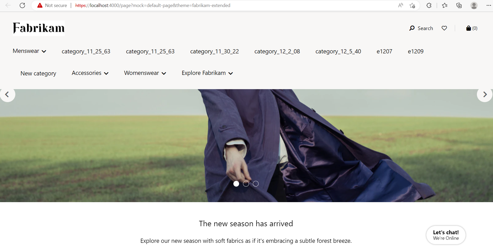

# Dynamics 365 Commerce - online extensibility samples

## License
License is listed in the [LICENSE](./LICENSE) file.

# Sample - Sticky Header
 
## Overview
In this sample, you will learn how to make a header module sticky so that when a user scrolls down the page, the header will remain visible.


## Starter kit license
License for starter kit is listed in the [LICENSE](./module-library/LICENSE) .

## Prerequisites
Follow the instructions mentioned in [document](https://docs.microsoft.com/en-us/dynamics365/commerce/e-commerce-extensibility/setup-dev-environment) to set up the development environment.

### Procedure to create custom theme
Follow the instructions mentioned in [document](https://docs.microsoft.com/en-us/dynamics365/commerce/e-commerce-extensibility/create-theme) to create the custom theme

Create a theme folder with name fabrikam-extended.

## Detailed Steps

### 1. Add a sticky header configuration property to the header module.

In this step, a new configuration parameter **useStickyHeader** will be added to the header module. This configuration will allow the sticky header to be configurable within the site builder tool. To accomplish the, we will extend the header definition file in the custom theme. 
For this example, we are using a theme called "fabrikam-extended", under the **\src\themes\fabrikam-extended\definition-extensions** folder create a new file called **header.definition.ext.json** and copy the code below.

```json
{
    "$type": "definitionExtension",
    "config": {
        "useStickyHeader":{
            "friendlyName": "Sticky header",
            "description": "Use sticky header",
            "type": "boolean",
            "required": true,
            "default": false
        }
    }
}
```

### 2. Extend the header module with a view extension file.

In the previous step, a new configuration field **useStickyHeader** was added, in this step the value of that configuration will be used to enable or disable the sticky header. We will do this with a module view extension within the theme. 
Create a new file **header.view.tsx** under **\src\themes\fabrikam-extended\views** folder and copy the code given below. 
It is possible this view file already exists in the theme and the below code changes can be merged. The below code includes two new functions to achieve the sticky header functionality **_stickyHeaderSetup** and **_updateHeader**.

```typescript

/*---------------------------------------------------------------------------------------------
 *  Copyright (c) Microsoft Corporation. All rights reserved.
 *  Licensed under the MIT License. See License.txt in the project root for license information.
 *--------------------------------------------------------------------------------------------*/

import { IHeaderViewProps } from '@msdyn365-commerce-modules/header';
import { Module, Node } from '@msdyn365-commerce-modules/utilities';
import * as React from 'react';
import { IHeaderProps as IHeaderExtentionProps } from '../definition-extensions/header.ext.props.autogenerated';

const headerView: React.FC<IHeaderViewProps & IHeaderExtentionProps<{}>> = (props: IHeaderViewProps & IHeaderExtentionProps<{}>) => {
     const {useStickyHeader} = props.config;
    React.useEffect(() => {
         if (useStickyHeader) {
            _stickyHeaderSetup();
         }
    },    [props]);

    const {
        HeaderTag,
        HeaderContainer,
        HeaderTopBarContainer,
        MobileMenuContainer,
        MobileMenuBodyContainer,
        MobileMenuLinksContainer,
        Divider
    } = props;
    return (
        <Module {...HeaderTag}>
            <Node {...HeaderContainer}>
                <Node {...HeaderTopBarContainer}>
                    {props.navIcon}
                    {props.logo}
                    {_renderReactFragment(props.search)}
                    {_renderDesktopAccountBlock(props)}
                    {props.wishListIconDesktop}
                    <Node {...Divider}/>
                    {props.cartIcon}
                </Node>
                <Node {...MobileMenuContainer}>
                    <Node {...MobileMenuBodyContainer}>
                        { props.MobileMenuHeader }
                        {_renderReactFragment(props.menuBar)}
                        <Node {...MobileMenuLinksContainer}>
                            { props.accountLinks ? props.accountLinks.map(link => link) : false }
                            { props.wishListIconMobile }
                            { props.signInLink }
                            { props.signOutLink }
                        </Node>
                    </Node>
                </Node>
                {_renderReactFragment(props.menuBar)}
            </Node>
        </Module>
    );
};

/* Sticky header logic*/
function _stickyHeaderSetup(): void {
    // Set header update methods to trigger on scroll
    window.addEventListener('scroll', () => {
        _updateHeader();
    });
    _updateHeader();
}

/* Update header*/
function _updateHeader(): void {
    // Get heights of cookie and promotion banners
    const defaultValue = 0;
    const headerAlertsContainer: HTMLElement | null = document.querySelector('.ms-promo-banner');
    const bannerHeights = headerAlertsContainer ? headerAlertsContainer.offsetHeight : defaultValue;

    // Triggers opacity change of header
    const headerElement = document.querySelector('.ms-header');
    if (headerElement) {
        if (document.documentElement.scrollTop > bannerHeights) {
            headerElement.classList.add('lock-opaque');
        } else {
            headerElement.classList.remove('lock-opaque');
        }
    }

    // Update sticky header position and opacity
    const stickyHeader: HTMLElement | null = document.querySelector('.ms-header__desktop-view');
    const headerLogo: HTMLElement | null = document.querySelector('.ms-header__logo');

    if (stickyHeader && headerLogo) {
        // Fix center sticky header
        const navStickyPos = headerLogo.offsetHeight + bannerHeights;
        if (document.documentElement.scrollTop > navStickyPos) {
            stickyHeader.classList.add('fixed');
        } else {
            stickyHeader.classList.remove('fixed');
        }
    }
}
function _renderDesktopAccountBlock(props: IHeaderViewProps): JSX.Element | null {
    const {
        AccountInfoDropdownParentContainer,
        AccountInfoDropdownPopoverConentContainer,
        accountInfoDropdownButton,
        signOutLink,
        signInLink,
        accountLinks,
    } = props;

    if (AccountInfoDropdownParentContainer) {
        if (AccountInfoDropdownPopoverConentContainer) {
            return (
                <Node {...AccountInfoDropdownParentContainer}>
                    {accountInfoDropdownButton}
                    <Node {...AccountInfoDropdownPopoverConentContainer}>
                        { accountLinks ? accountLinks.map(link => link) : false }
                        {signOutLink}
                    </Node>
                </Node>
            );
        } else if (signInLink) {
            return (
                <Node {...AccountInfoDropdownParentContainer}>
                    {signInLink}
                </Node>
            );
        }
    }

    return null;
}

function _renderReactFragment(items: React.ReactNode[]): JSX.Element | null {
    return (
        <React.Fragment>
            {items && items.length
                ? items.map((slot: React.ReactNode, index: number) => {
                      return <React.Fragment key={index}>{slot}</React.Fragment>;
                  })
                : null}
        </React.Fragment>
    );
}

export default headerView;

```
### 3. Add sticky header CSS styles

In this step we will add new SCSS for the header module needed for the sticky header support.
Open the file **header.scss** found under **src/themes/fabrikam-extended/styles/04-modules** and replace with the below code which includes two new CSS classes for the sticky header.

```scss
//spacing
$header-container-spacing-desktop: 40px;
$header-container-spacing-mobile-left: 6px;
$header-container-spacing-mobile-right: 12px;
$header-container-spacing-mobile: 0;
$signin-info-spacing-left: 2px;
$navigation-spacing-left: 8px;
$cart-icon-spacing-left: 20px;
$heading-padding-top: 25px;
$signin-info-padding: 12px 14px;
$header-height: 48px;
$header-height-collapsible-open: 100vh;
$header-mobile-height: 48px;
$header-icon-width: 48px;
$account-link-height: 35px;
$account-links-max-width: 276px;
$signin-link-padding: 0 20px;
$signin-link-height: 48px;
$header_container-max-width: $msv-breakpoint-xl;
$header-myaccount-margin-left: 8px;
$header-logo-margin-right: 20px;
$header-logo-margin: auto auto auto 12px;
$header-icon-padding-right: 10px;
$header-icon-padding-left: 10px;
$header-cart-icon-margin-left: 4px;
$header-list-item-link-padding: 0 20px;
$popover-menu-item-height: 48px;
$msv-default-container-padding-bottom: 25px;
$divider-margin-left: 8px;
$divider-margin-right: 8px;
$divider-margin-width: 1px;
$divider-margin-height: 20px;
$divider-padding-m: 10px 0;
$nav-padding-top-m: 20px;
$header-store-selector-btn-padding: 12px 10px;
$header-container-spacing-mobile-left: 6px;
$header-container-spacing-mobile-right: 12px;

//style presets
:root {
    --msv-header-bg: var(--msv-bg-color);
    --msv-header-border: var(--msv-border-color);
    --msv-header-font-color: var(--msv-font-primary-color);
    --msv-header-font-size: var(--msv-body-font-size-m);
}

header {
    background-color: var(--msv-header-bg);
}

.ms-header {
    background-color: var(--msv-header-bg);
    color: var(--msv-header-font-color);
    border: 1px solid var(--msv-header-border);

    margin-left: auto;
    margin-right: auto;
    padding-left: $header-container-spacing-mobile;
    padding-right: $header-container-spacing-mobile;
    padding-top: $heading-padding-top;

    &.ms-header-open {
        height: $header-height-collapsible-open;
    }

    &__container {
        padding-bottom: $msv-default-container-padding-bottom;
        .msc-wishlist-icon {
            .msc-wishlist-icon__textcount {
                font-family: $msv-font-allerta;
                font-weight: normal;
                font-size: 14px;
                line-height: 18px;
                text-transform: none;
                margin-left: 4px;
            }
        }

        .ms-header__wishlist-mobile::before {
            font-family: "Font Awesome 5 Free";
            text-align: center;
            vertical-align: text-bottom;
            width: 21px;
            -webkit-font-smoothing: antialiased;
            display: inline-block;
            font-style: normal;
            font-variant: normal;
            font-weight: 400;
            text-rendering: auto;
            line-height: 1;
            content: "\f004";
        }
        .ms-header__logo {
            margin-right: $header-logo-margin-right;

            a {
                @include vfi();
                display: block;

                &:focus {
                    outline-offset: -2px;
                }
            }
        }

        .ms-header__collapsible-hamburger {
            .ms-header__divider {
                background: var(--msv-header-bg);
                border-bottom: 1px solid $msv-gray-300;
                padding: $divider-padding-m;
            }

            .ms-nav.mobile-vp {
                padding-top: $nav-padding-top-m;
            }
        }
    }

    .ms-header__preferred-store-text {
        color: var(--msv-header-font-color);
        font-size: var(--msv-header-font-size);
        margin: 0 8px;
    }

    .ms-header__preferred-store-btn {
        @include add-icon($msv-Shop-Address);
    }

    .ms-header__preferred-store-btn,
    .ms-search__icon,
    .ms-header__signin-button,
    .msc-wishlist-icon,
    .msc-cart-icon,
    .ms-header__profile-button {
        background-color: transparent;
        color: var(--msv-header-font-color);

        @include font-content(var(--msv-font-weight-normal), var(--msv-header-font-size), $msv-line-height-m);
        justify-content: center;

        &:focus {
            outline-offset: -1px;
        }
    }

    .ms-search__form-cancelSearch {
        color: var(--msv-header-font-color);

        @include font-content(var(--msv-font-weight-normal), var(--msv-header-font-size), $msv-line-height-m);
        justify-content: center;
    }

    .ms-search__form-control,
    .ms-search__form-cancelSearch {
        &:focus {
            outline-offset: -1px;
        }
    }

    // hiding the header icons from login page
    &.hide-header-options {
        .ms-header__nav-icon,
        .ms-header__account-info.account-desktop,
        .ms-header__account-info.account-mobile,
        .msc-cart-icon,
        .ms-header__divider,
        .msc-wishlist-icon {
            display: none;
        }
    }

    .msc-btn {
        height: $header-height;
    }

    .ms-header__topbar {
        align-items: center;
        display: flex;
        flex-wrap: nowrap;
        height: $header-mobile-height;
    }

    .ms-search {
        display: none;
    }
   .ms-header__account-info {
        display: block;
    }
    
    .lock-opaque {
        top: 0;
        position: fixed;
        z-index: 1010;
        width: 100%;
    }

    .ms-header__desktop-view {
        display: none;
    }

    .ms-header__account-info {
        @include font-content(var(--msv-font-weight-normal), var(--msv-header-font-size), $msv-line-height-m);
        display: none;
        height: $header-height;
        justify-content: flex-end;
        margin-left: $signin-info-spacing-left;

        &__account-link-container {
            height: $account-link-height;
        }

        /* stylelint-disable-next-line no-descending-specificity -- Auto-suppressed. Please fix if possible. */
        a {
            align-items: center;
            display: flex;
            font-size: $msv-text-size;
            line-height: $msv-text-line-height;
            padding: $signin-link-padding;
            height: $signin-link-height;

            &:hover {
                text-decoration: none;
            }
        }

        .ms-header__signin-button {
            background-color: var(--msv-header-bg);
            color: var(--msv-header-font-color);
            font-weight: var(--msv-font-weight-normal);

            &:focus {
                outline-offset: -1px;
            }
        }

        .msc-popover {
            background-color: var(--msv-header-bg);
            background-clip: padding-box;
            border: 1px solid $msv-gray-500;
            display: block;
            left: 0;
            max-width: $account-links-max-width;
            position: absolute;
            top: 0;
            word-wrap: break-word;
            z-index: 1060;

            .msc-btn {
                color: var(--msv-header-font-color);
                font-weight: var(--msv-font-weight-normal);
                height: $popover-menu-item-height;
            }

            .msc-arrow {
                display: block;
                height: 0.5rem;
                margin: 0 0.3rem;
                position: absolute;
                top: calc((0.5rem + 1px) * -1);
                width: 1rem;

                &::before,
                &::after {
                    border-color: transparent;
                    border-style: solid;
                    border-width: 0 0.5rem 0.5rem 0.5rem;
                    content: "";
                    display: block;
                    position: absolute;
                }

                &::before {
                    border-bottom-color: $msv-gray-500;
                    top: 0;
                }

                &::after {
                    border-bottom-color: var(--msv-border-color);
                    top: 1px;
                }
            }
        }
    }

    /* stylelint-disable-next-line no-descending-specificity -- Auto-suppressed. Please fix if possible. */
    .msc-wishlist-icon {
        &:hover {
            text-decoration: none;
        }
    }

    .ms-header__wishlist-desktop {
        align-items: center;
        display: none;
        height: $header-height;
        width: $header-icon-width;

        @include add-icon($msv-Heart, before, 400);

        &::before {
            font-size: var(--msv-header-font-size);
            text-align: center;
            vertical-align: text-bottom;
            width: $header-icon-width;
        }

        .msc-wishlist-icon__text {
            display: none;
        }
    }

    /* stylelint-disable-next-line no-descending-specificity -- Auto-suppressed. Please fix if possible. */
    .ms-header__nav-icon {
        align-items: center;
        background: var(--msv-header-bg);
        display: flex;
        height: $header-height;
        justify-content: center;
        width: $header-icon-width;

        &:focus {
            outline-offset: -1px;
        }

        &::before {
            @include msv-icon();
            content: $msv-GlobalNavButton;
            font-size: var(--msv-header-font-size);
            width: $header-icon-width;
            vertical-align: text-bottom;
            text-align: center;
        }

        &:hover {
            text-decoration: none;
        }
    }

    /* stylelint-disable-next-line no-descending-specificity -- Auto-suppressed. Please fix if possible. */
    .msc-cart-icon {
        width: $header-icon-width;
        height: $header-height;
        display: flex;
        align-items: center;

        &::before {
            @include msv-icon();
            content: $msv-shopping-bag;
            font-size: var(--msv-header-font-size);
            width: $header-icon-width;
            vertical-align: text-bottom;
            text-align: center;
        }

        &:hover {
            text-decoration: none;
        }

        &__count {
            @include font-content-s();
            margin-left: $header-cart-icon-margin-left;
        }
    }

    @media (min-width: $msv-breakpoint-xs) {
        .ms-nav.desktop-vp {
            display: none;
        }

        .msc-cart-icon {
            &::before {
                width: $header-icon-width / 2;
            }
        }
    }

    @media (max-width: $msv-breakpoint-l) {
        padding-left: $header-container-spacing-mobile-left;
        padding-right: $header-container-spacing-mobile-right;

        .msc-wishlist-icon {
            @include add-icon($msv-Heart, before, 400);

            &::before {
                padding-right: $header-icon-padding-right;
            }
        }

        &__container {
            .ms-header__topbar {
                justify-content: space-between;

                .ms-header__logo {
                    margin: $header-logo-margin;
                }

                .ms-site-picker {
                    display: none;
                }
            }

            .ms-header__collapsible-hamburger {
                .ms-nav {
                    .ms-nav__drawer {
                        .drawer__button {
                            @include font-content(var(--msv-font-weight-normal), var(--msv-header-font-size), $msv-line-height-m);
                            color: var(--msv-header-font-color);
                            background: transparent;
                            text-align: left;
                            width: 100%;

                            .ms-nav__drawer-open {
                                @include add-icon($msv-ChevronUp, after);
                            }

                            .ms-nav__drawer-close {
                                @include add-icon($msv-ChevronDown, after);
                            }

                            .drawer__glyph__end {
                                position: absolute;
                                right: 10px;
                            }
                        }

                        .msc-btn {
                            outline-offset: -1px;
                        }
                    }

                    .ms-nav__list__item__link,
                    .ms-nav__list__item__span {
                        @include font-content(var(--msv-font-weight-normal), var(--msv-header-font-size), $msv-line-height-m);
                        align-items: center;
                        display: flex;
                        padding: $header-list-item-link-padding;
                    }
                }
            }
        }

        .ms-header__account-info.account-mobile {
            display: unset;
            margin-left: 0;

            /* stylelint-disable-next-line no-descending-specificity -- Auto-suppressed. Please fix if possible. */
            .drawer__button {
                @include font-content(var(--msv-font-weight-normal), var(--msv-header-font-size), $msv-line-height-m);
                @include add-icon($msv-Contact, before, 400);

                &::before {
                    padding-right: $header-icon-padding-right;
                }
                background: transparent;
                text-align: left;
                width: 100%;

                .ms-header__drawer-open {
                    @include add-icon($msv-ChevronUp, after);
                }

                .ms-header__drawer-close {
                    @include add-icon($msv-ChevronDown, after);
                }

                /* stylelint-disable-next-line no-descending-specificity -- Auto-suppressed. Please fix if possible. */
                .drawer__glyph__end {
                    position: absolute;
                    right: $header-icon-padding-right;
                }
            }

            .ms-header__signin-button {
                display: flex;
                justify-content: flex-start;

                @include add-icon($msv-Contact, before, 400);

                &::before {
                    padding-right: $header-icon-padding-right;
                }
            }

            /* stylelint-disable-next-line no-descending-specificity -- Auto-suppressed. Please fix if possible. */
            .msc-btn {
                outline-offset: -1px;
            }
        }

        .ms-header__collapsible-hamburger {
            background: var(--msv-header-bg);
            left: 0;
            margin-top: 2px;
            position: absolute;
            width: 100%;
            z-index: 1012;

            .ms-header__wishlist-mobile {
                text-align: left;
                width: 100%;
            }

            .ms-search {
                justify-content: flex-start;
                display: flex;

                .ms-search__label {
                    display: flex;
                    width: 100%;

                    .ms-search__icon {
                        display: flex;
                        justify-content: flex-start;
                        width: 100%;
                    }

                    .ms-search__icon-text {
                        display: unset;
                        padding-left: $header-icon-padding-left;
                    }
                }
            }
        }
    }

    @media (min-width: $msv-breakpoint-l) {
        padding-left: $header-container-spacing-desktop;
        padding-right: $header-container-spacing-desktop;

        .ms-header__desktop-view {
            display: block;
        }

        .ms-nav.desktop-vp {
            display: flex;
        }

        &__modal {
            display: none;
        }

        &__profile-button {
            color: var(--msv-header-font-color);
            font-weight: var(--msv-font-weight-normal);
            background: var(--msv-header-bg);

            &::after {
                @include msv-icon();
                content: $msv-ChevronDown;
                font-size: var(--msv-header-font-size);
                margin-left: $header-myaccount-margin-left;
                text-align: center;
                vertical-align: text-bottom;
            }
        }

        &__profile-button[aria-expanded="true"] {
            &::after {
                content: $msv-ChevronUp;
            }
        }

        &__profile-button[aria-expanded="false"] {
            &::after {
                content: $msv-ChevronDown;
            }
        }

        &__divider {
            background: $msv-divider-color;
            height: $divider-margin-height;
            margin-left: $divider-margin-left;
            margin-right: $divider-margin-right;
            width: $divider-margin-width;
        }

        .ms-header__account-info.account-desktop {
            display: block;
        }
      
        .ms-header__collapsible-hamburger {
            display: none;

            .ms-header__wishlist-mobile {
                text-align: left;
                width: 100%;
            }
        }

        .ms-search {
            display: flex;

            &__icon {
                align-items: center;
                color: var(--msv-header-font-color);
                font-weight: normal;

                &:focus {
                    outline-offset: -1px;
                }
            }
        }

        .ms-header__wishlist-desktop {
            display: flex;
        }

        .ms-header__nav-icon {
            display: none;
        }

        .ms-cart-icon {
            padding-left: $cart-icon-spacing-left;
            width: unset;

            &::before {
                width: unset;
                margin-right: 4px;
            }
        }
    }

    @media (max-width: $msv-breakpoint-m) {
        .ms-header {
            &__preferred-store-btn {
                padding: $header-store-selector-btn-padding;
            }

            &__preferred-store-text {
                display: none;
            }
        }
    }

    @supports (-webkit-touch-callout: none) {
        .ms-header__preferred-store-btn,
        .ms-header__nav-icon {
            &:focus {
                border: none;
                outline: 0;
            }
        }
    }
}

.ms-header__account-info {
    display: block;
}

.lock-opaque {
    top: 0;
    position: fixed;
    z-index: 1010;
    width: 100%;
}
```
### 4 Build and test module
The sample can now be tested in a web browser using the ```yarn start``` command.

### 5 Senario to test with mock
Test the module using page mock, Go to browser and copy paste the below url
https://localhost:4000/page?mock=default-page&theme=fabrikam-extended 

## Third party Image and Video Usage restrictions

The software may include third party images and videos that are for personal use only and may not be copied except as provided by Microsoft within the demo websites.  You may install and use an unlimited number of copies of the demo websites., You may not publish, rent, lease, lend, or redistribute any images or videos without authorization from the rights holder, except and only to the extent that the applicable copyright law expressly permits doing so.
