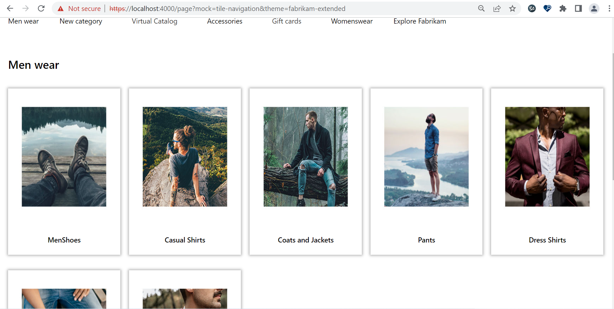

# Dynamics 365 Commerce - online extensibility samples

## License
License is listed in the [LICENSE](./LICENSE) file.

# Sample - Tile Navigation

## Overview
In this sample, you will learn how to implement a tile navigation module which will render subcategory or a parent category which can be configured with a module config property or via a URL



## Starter kit license
License for starter kit is listed in the [LICENSE](./module-library/LICENSE) .

## Prerequisites
Follow the instructions mentioned in [document](https://docs.microsoft.com/en-us/dynamics365/commerce/e-commerce-extensibility/setup-dev-environment) to set up the development environment.

### Procedure to create custom theme
Follow the instructions mentioned in [document](https://docs.microsoft.com/en-us/dynamics365/commerce/e-commerce-extensibility/create-theme) to create the custom theme,in this sample, we'll assume a custom theme has been cloned from the fabrikam theme named "fabrikam-extended".

## Detailed Steps to create Tile Navigation module

### 1.Add Tile Navigation module
Add Tile Navigation module using this command **yarn msdyn365 add-module tile-navigation**.

Go to **tile-navigation.definition.json** under **src/Modules/tile-navigation** and replace the code with below which will add two config properties, one for the parent category and one for the image settings. Also the get-categories-hierarch data action which will get the appropriate get category information.

```json
{
    "$type": "contentModule",
    "friendlyName": "tile-navigation",
    "name": "tile-navigation",
    "description": "Please add meaningful description for authoring",
    "categories": ["tile-navigation"],
    "tags": ["Additional tags go here"],
    "dataActions": {
        "categories": {
            "path": "@msdyn365-commerce-modules/retail-actions/dist/lib/get-categories-hierarchy",
            "runOn": "client"
        }
    },
    "config": {
        "categoryId":{
            "friendlyName": "Category Id",
            "description": "Category Id to display child items as tiles",
            "type": "number"
        },
        "imageSettings": {
            "friendlyName": "Image settings",
            "description": "Image settings for product items",
            "type": "imageSettings"
        }
    },
    "resources": {
        "noSubcategoryMsg": {
            "comment": "No sub-catgeory found message",
            "value": "No sub-catgeory found."
        }
    }
}
```

Go to **tile-navigation.data.ts** under **src/Modules/tile-navigation** and replace existing code with below code which will hold the returned data action category data.

```json
/*--------------------------------------------------------------
 * Copyright (c) Microsoft Corporation. All rights reserved.
 * See License.txt in the project root for license information.
 *--------------------------------------------------------------*/

import { CategoryHierarchy } from '@msdyn365-commerce/commerce-entities';
import { AsyncResult } from '@msdyn365-commerce/retail-proxy';

export interface ITileNavigationData {
    categories: AsyncResult<CategoryHierarchy[]>;
}

```

Go to **tile-navigation.tsx** under **src/Modules/tile-navigation** and replace with below code which will process the returned category list into desired structure.

```typescript
/*!
 * Copyright (c) Microsoft Corporation.
 * All rights reserved. See LICENSE in the project root for license information.
 */

import * as React from 'react';

import { generateImageUrl } from '@msdyn365-commerce-modules/retail-actions';
import { getPayloadObject, getTelemetryObject, IPayLoad, ITelemetryContent, onTelemetryClick } from '@msdyn365-commerce-modules/utilities';
import { CategoryHierarchy } from '@msdyn365-commerce/commerce-entities';
import { IImageData, IImageSettings, Image, IRequestContext } from '@msdyn365-commerce/core';
import { ITileNavigationData } from './tile-navigation.data';
import { ITileNavigationProps } from './tile-navigation.props.autogenerated';
export interface ITileNavigationViewProps extends ITileNavigationProps<ITileNavigationData> {
    tiles: React.ReactNode;
}

/**
 *
 * TileNavigation component
 * @extends {React.PureComponent<ITileNavigationProps<ITileNavigationData>>}
 */
class TileNavigation extends React.PureComponent<ITileNavigationProps<ITileNavigationData>> {
    public categoryIdFromUrl: number | undefined;
    private readonly telemetryContent: ITelemetryContent;
    private readonly payLoad: IPayLoad;

    constructor(props: ITileNavigationProps<ITileNavigationData>) {
        super(props);
        this._getCategoryIdFromRequestContextUrl = this._getCategoryIdFromRequestContextUrl.bind(this);
        this._getRequestContext = this._getRequestContext.bind(this);
        this._getCategoryFromUrl = this._getCategoryFromUrl.bind(this);
        this.categoryIdFromUrl = this.categoryIdFromUrl;
        // Navigte to plp page
        this.telemetryContent = getTelemetryObject(
            this.props.context.request.telemetryPageName!,
            this.props.friendlyName,
            this.props.telemetry
        );
        this.payLoad = getPayloadObject('click', this.telemetryContent, '', '');
    }
    public componentDidMount(): void {
        this._getCategoryFromUrl();
    }

    public render(): JSX.Element | null {
        const { data } = this.props;

        // Traverse recursively through results to get category object at any level
        const tileNavigationViewProps = {
            ...this.props,
            tiles: this._getMenuTiles(data)
        };
        return this.props.renderView(tileNavigationViewProps);
    }
    private _getCategoryFromUrl(): void {
        const requestContext = this._getRequestContext();
        const categoryFromUrl = this._getCategoryIdFromRequestContextUrl(requestContext);
        this.categoryIdFromUrl = categoryFromUrl;
    }

    private _getCategoryIdFromRequestContextUrl(requestContext: IRequestContext): number {
        return Number(requestContext?.urlTokens.itemId || (requestContext.query && requestContext.query.categoryId)) || 0;
    }

    private _getRequestContext(): IRequestContext {
        const { context } = this.props;
        return context && context.actionContext && context.actionContext.requestContext;
    }
    private customFilter = (object: CategoryHierarchy, categoryId: number | undefined): CategoryHierarchy | null => {
        const nestedChildren = {};
        if (object?.hasOwnProperty('RecordId') && object.RecordId === categoryId) {
            Object.assign(nestedChildren, object);
        }
        if (object.Children && object.Children.length > 0) {
            object.Children.forEach(obj => {
                const o = this.customFilter(obj, categoryId);
                if (o !== null) {
                    Object.assign(nestedChildren, o);
                }
                return nestedChildren;
            });
        }
        return nestedChildren as CategoryHierarchy;
    };

    private _getMenuTiles = (data: ITileNavigationData): JSX.Element => {
        const getByCategoryId = this.categoryIdFromUrl || this.props.config.categoryId || 0;
        if (getByCategoryId === 0) {
            // Return root level tiles
            return (
                <div className='tile-list-unstyled'>
                    <div className='tile-category-name'>{'Root-All'}</div>
                    <div className='tile-category-list'>
                        {data &&
                            data.categories &&
                            data.categories.result &&
                            data.categories.result.map((item: CategoryHierarchy, index: number) => (
                                <a
                                    className='tile-list-item'
                                    key={index}
                                    href={item.Url}
                                    onClick={onTelemetryClick(this.telemetryContent, this.payLoad, item.Name ? item.Name : '')}
                                >
                                    <div className='tile-list-item-img'>
                                        {item.Images && item.Images[0] && item.Images[0].Uri && this._updateCategoryImage(item)}
                                    </div>
                                    <div className='tile-list-item-name'>
                                        <h4 className='tile-list-item-name-title'>{item.Name}</h4>
                                    </div>
                                </a>
                            ))}
                    </div>
                </div>
            );
        } else {
            const tileComponent =
                data &&
                data.categories &&
                data.categories.result?.map(item => {
                    return this.customFilter(item, getByCategoryId);
                });

            // Get filtered category object
            const categoryToDisplay = tileComponent?.filter(item => item?.RecordId)[0];
            if (Object(categoryToDisplay).hasOwnProperty('Children')) {
                this.payLoad.contentAction.etext = categoryToDisplay?.Name;
                return (
                    <div className='tile-list-unstyled'>
                        <div className='tile-category-name'>{`${categoryToDisplay?.Name}`}</div>
                        <div className='tile-category-list'>
                            {categoryToDisplay &&
                                categoryToDisplay.Children &&
                                categoryToDisplay.Children.map((item: CategoryHierarchy, index: number) => (
                                    <a
                                        className='tile-list-item'
                                        key={index}
                                        href={item.Url}
                                        onClick={onTelemetryClick(this.telemetryContent, this.payLoad, item.Name ? item.Name : '')}
                                    >
                                        <div className='tile-list-item-img'>
                                            {item.Images && item.Images[0] && item.Images[0].Uri && this._updateCategoryImage(item)}
                                        </div>
                                        <div className='tile-list-item-name'>
                                            <h4 className='tile-list-item-name-title'>{item.Name}</h4>
                                        </div>
                                    </a>
                                ))}
                        </div>
                    </div>
                );
            } else {
                return (
                    // when no sub category exists
                    <div className='tile-list-unstyled'>
                        <div className='tile-category-name'>{`${categoryToDisplay?.Name}`}</div>
                        <span className='tile-category-name'>{this.props.resources.noSubcategoryMsg}</span>
                    </div>
                );
            }
        }
    };

    private _updateCategoryImage = (option: CategoryHierarchy): React.ReactNode | null => {
        const categoryName = option && option.Name ? option.Name : '';
        const categoryImageObj = option && option.Images && option.Images[0];
        const categoryImageSrc = categoryImageObj ? categoryImageObj.Uri : '';
        const categoryImageAltText = categoryImageObj && categoryImageObj.AltText ? categoryImageObj.AltText : categoryName;
        const categoryImage: IImageData = { src: categoryImageSrc, altText: categoryImageAltText };
        return this._getCategoryImage(categoryImage);
    };

    private readonly _getCategoryImage = (categoryImage?: IImageData): React.ReactNode | null => {
        if (!categoryImage || !categoryImage.src) {
            return null;
        }

        const categoryImageUrl = generateImageUrl(categoryImage.src, this.props.context.actionContext.requestContext.apiSettings);
        const defaultImageSettings: IImageSettings = {
            viewports: {
                xs: { q: 'w=300&h=250&m=8', w: 0, h: 0 },
                sm: { q: 'w=300&h=250&m=8', w: 0, h: 0 },
                md: { q: 'w=300&h=250&m=8', w: 0, h: 0 },
                lg: { q: 'w=300&h=250&m=8', w: 0, h: 0 }
            },
            lazyload: true
        };
        if (categoryImageUrl !== undefined) {
            const ImageData: IImageData = { src: categoryImageUrl };
            return (
                <Image
                    requestContext={this.props.context.actionContext.requestContext}
                    className='ms-nav-image__item'
                    {...ImageData}
                    gridSettings={this.props.context.request.gridSettings!}
                    imageSettings={this.props.config.imageSettings || defaultImageSettings}
                    loadFailureBehavior='empty'
                    role='tabpanel'
                    id={`${categoryImage.src}__categoryImage`}
                    altText={categoryImage.altText}
                />
            );
        }
        return null;
    };
}

export default TileNavigation;

```

Go to **tile-navigation.view.tsx** under **src/Modules/tile-navigation** and replace existing code with below code.

```typescript
/*!
 * Copyright (c) Microsoft Corporation.
 * All rights reserved. See LICENSE in the project root for license information.
 */

import * as React from 'react';
import { ITileNavigationViewProps } from './tile-navigation';

const TileNavigationView: React.FC<ITileNavigationViewProps> = props => {
    const { tiles } = props;
    return <div className='row'>{tiles}</div>;
};

export default TileNavigationView;

```

## Add Style file

Create a file with name **tile-navigation.scss** under **src/themes/fabrikam-extended/styles/04-modules** and replace code with below code in it and add reference of the file in index.scss file

```scss

.tile-list-unstyled {
    width: 100%;
    padding: 20px;
    .tile-category-name {
        color: #000;
        font-size: 26px;
        font-weight: 600;
        line-height: 40px;
        padding: 20px 0;
        margin-bottom: 15px;
        width: 100%;
        text-align: left;
    }
    .tile-category-list{
        width: 100%;
        display: grid;
        grid-column-gap: 20px;
        grid-template-columns: repeat(auto-fill, minmax(230px, 1fr));
        .tile-list-item {
            display: block;
            box-shadow: 0 0 6px 2px #b3b3b3;
            margin-bottom: 35px;
            .tile-list-item-img {
                margin: 0 auto;

                @include image(312px);

                .msc-empty_image {
                    width: 100%;
                }

                img {
                    width: 100%;
                }
            }
            .msc-image-container > :nth-child(2) {
                visibility: hidden;
                width: 0px;
                height: 0px;
                position: absolute;
            }
            .msc-image-container {
                height: 233px;
                width: 231px;
                margin: 20px auto;
                .msc-empty_image {
                    height: 233px;
                    width: 231px;
                    background-position: center;
                    background-repeat: no-repeat;
                    background-size: contain;
                    justify-content: center;
                    margin: 4px auto;
                }
            }
            .tile-list-item-name {
                padding: 24px 0;
                margin: 0 auto;
                background-color: $msv-white;
                h4.tile-list-item-name-title {
                    line-height: 20px;
                    font-size: 16px;
                    color: #000;
                    font-weight: 600;
                    text-align: center;
                    max-height: unset;
                    margin-bottom: 0;
                    overflow: hidden;
                    text-overflow: ellipsis;
                    text-transform: none;
                }
            }
        }
    }
}

```

## Build and test module

The sample can now be tested in a web browser using the ```yarn start``` command.

### 1. Test the module using page mock

Create a sample mock with name popup.json in the **src/pageMocks** and replace the mock file content with below content and run the application with mock by applying theme(https://localhost:4000/?mock=tile-navigation&theme=fabrikam-extended)

```json

{
    "exception": null,
    "pageRoot": {
      "typeName": "core-root",
      "id": "core-root_mf61nad",
      "friendlyName": "Core root 1",
      "config": {},
      "modules": {
        "htmlHead": [
          {
            "typeName": "default-metatags",
            "id": "IDNMAid2_ccj5kjk",
            "friendlyName": "Default metatags",
            "config": {
              "metaTags": [
                "<link rel=\"icon\" href=\"https://images-us-prod.cms.commerce.dynamics.com/cms/api/lncnstnzxd/imageFileData/MA132i\" sizes=\"32x32\" />"
              ]
            }
          },
          {
            "typeName": "default-page-summary",
            "id": "default-page-summary",
            "friendlyName": "Default page summary",
            "config": {
              "faviconUrl": null
            }
          }
        ],
        "body": [
          {
            "typeName": "default-page",
            "id": "default-page",
            "friendlyName": "Default Page",
            "config": {
              "skipToMainText": "Skip to main content",
              "pageTheme": "fabrikam"
            },
            "modules": {
              "header": [
                {
                  "typeName": "default-container",
                  "id": "IDNMAaqW_xdy7hn8",
                  "friendlyName": "Default container",
                  "config": {
                    "heading": {},
                    "layout": "stacked",
                    "containerType": "fluid",
                    "childrenWidth": "four"
                  },
                  "modules": {
                    "content": [
                      {
                        "typeName": "cookie-compliance",
                        "id": "IDNMAaqW_xdy7hn8-cookie-compliance",
                        "friendlyName": "Cookie compliance",
                        "config": {
                          "content": "<p>This site uses cookies for analytics and personalized content. Accept to continue.&nbsp;</p>\n",
                          "actionLinks": [
                            {
                              "linkText": "Learn more",
                              "linkUrl": {
                                "destinationUrl": "https://go.microsoft.com/fwlink/?linkid=845480",
                                "type": "externalLink"
                              },
                              "ariaLabel": "Learn more about cookie compliance"
                            }
                          ]
                        }
                      },
                      {
                        "typeName": "promo-banner",
                        "id": "IDNMAaqW_xdy7hn8-promo-banner",
                        "friendlyName": "Promo banner",
                        "platform": {
                          "layout": "mediumWidth"
                        },
                        "config": {
                          "msdyn365__moduleLayout": "mediumWidth",
                          "bannerMessages": [
                            {
                              "text": "Winter collection online now!       ",
                              "links": [
                                {
                                  "linkText": "Shop now",
                                  "linkUrl": {
                                    "type": "categoryLink",
                                    "categoryId": 68719478055
                                  },
                                  "ariaLabel": "Shop now"
                                }
                              ]
                            },
                            {
                              "text": "Buy 2 or more shoes and get 25% off!   ",
                              "links": [
                                {
                                  "linkText": "Shop now",
                                  "linkUrl": {
                                    "type": "categoryLink",
                                    "categoryId": 68719478053
                                  },
                                  "ariaLabel": "Shop now"
                                }
                              ]
                            }
                          ],
                          "autoplay": true,
                          "dismissEnabled": false,
                          "hideFlipper": true,
                          "className": "alignment__center"
                        }
                      },
                      {
                        "typeName": "header",
                        "id": "IDNMAaqW_xdy7hn8-header",
                        "friendlyName": "Header",
                        "config": {
                          "logoImage": {
                            "$type": "image",
                            "_id": "MAapv",
                            "src": "https://images-us-prod.cms.commerce.dynamics.com/cms/api/qdhmsxlvbl/imageFileData/MAapw?ver=ad50",
                            "copyright": "",
                            "altText": "Fabrikam",
                            "binaryHash": "zsDVVIqCDbkGaw7eITavoA==",
                            "location": {},
                            "title": "Fabrikam",
                            "imageSettings": {
                              "quality": 80,
                              "disableLazyLoad": false,
                              "lazyload": true,
                              "viewports": {
                                "xs": {
                                  "w": 132,
                                  "h": 28,
                                  "q": "w=132&h=28&q=80&m=6&f=jpg"
                                },
                                "lg": {
                                  "w": 160,
                                  "h": 48,
                                  "q": "w=160&h=48&q=80&m=6&f=jpg"
                                }
                              }
                            }
                          },
                          "logoLink": {
                            "linkText": "",
                            "linkUrl": {
                              "destinationUrl": "/fabrikam/",
                              "type": "internalLink"
                            },
                            "ariaLabel": "Fabrikam"
                          },
                          "myAccountLinks": [
                            {
                              "linkText": "My account",
                              "linkUrl": {
                                "destinationUrl": "/fabrikam/myaccount",
                                "type": "internalLink"
                              },
                              "ariaLabel": "My account"
                            },
                            {
                              "linkText": "Order history",
                              "linkUrl": {
                                "destinationUrl": "/fabrikam/orderhistory",
                                "type": "internalLink"
                              },
                              "ariaLabel": "Order history"
                            }
                          ]
                        },
                        "data": {},
                        "modules": {
                          "menuBar": [
                            {
                              "typeName": "navigation-menu",
                              "id": "IDNMAaqW_xdy7hn8-navigation-menu",
                              "friendlyName": "Navigation menu",
                              "config": {
                                "categoryImageSettings": {
                                  "quality": 80,
                                  "disableLazyLoad": false,
                                  "lazyload": true,
                                  "viewports": {
                                    "xs": {
                                      "w": 300,
                                      "h": 350,
                                      "q": "w=300&h=350&q=80&m=6&f=jpg"
                                    },
                                    "lg": {
                                      "w": 300,
                                      "h": 350,
                                      "q": "w=300&h=350&q=80&m=6&f=jpg"
                                    },
                                    "xl": {
                                      "w": 300,
                                      "h": 350,
                                      "q": "w=300&h=350&q=80&m=6&f=jpg"
                                    }
                                  }
                                },
                                "menuLevelSupport": 4,
                                "rootMenuNavigation": "Shop",
                                "cmsNavItems": [
                                  {
                                    "linkText": "Explore Fabrikam",
                                    "linkUrl": {},
                                    "imageLink": {},
                                    "subMenus": [
                                      {
                                        "linkText": "Contact",
                                        "linkUrl": {
                                          "destinationUrl": "/fabrikam/contact",
                                          "type": "internalLink"
                                        },
                                        "ariaLabel": "Contact us",
                                        "imageLink": {}
                                      },
                                      {
                                        "linkText": "Loyalty program",
                                        "linkUrl": {
                                          "destinationUrl": "/fabrikam/loyalty-join",
                                          "type": "internalLink"
                                        },
                                        "imageLink": {}
                                      }
                                    ]
                                  }
                                ],
                                "navigationMenuSource": "all",
                                "enableMultilevelMenu": true,
                                "enabletopMenu": false,
                                "displayCategoryImage": true,
                                "displayPromotionalImage": true
                              },
                              "data": {}
                            }
                          ],
                          "search": [
                            {
                              "typeName": "search",
                              "id": "IDNMAaqW_xdy7hn8-search",
                              "friendlyName": "Search",
                              "config": {
                                "topResultsCount": 5,
                                "imageSettings": {
                                  "quality": 80,
                                  "disableLazyLoad": false,
                                  "lazyload": true,
                                  "viewports": {
                                    "xs": {
                                      "w": 80,
                                      "h": 94,
                                      "q": "w=80&h=94&q=80&m=6&f=jpg"
                                    },
                                    "sm": {
                                      "w": 148,
                                      "h": 174,
                                      "q": "w=148&h=174&q=80&m=6&f=jpg"
                                    },
                                    "lg": {
                                      "w": 148,
                                      "h": 174,
                                      "q": "w=148&h=174&q=80&m=6&f=jpg"
                                    }
                                  }
                                },
                                "searchplaceholderText": "Search in Fabrikam"
                              }
                            }
                          ],
                          "cartIcon": [
                            {
                              "typeName": "cart-icon",
                              "id": "IDNMAaqW_xdy7hn8-cart-icon",
                              "friendlyName": "Cart Icon",
                              "config": {
                                "imageSettings": {
                                  "quality": 80,
                                  "disableLazyLoad": false,
                                  "lazyload": true,
                                  "viewports": {
                                    "xs": {
                                      "w": 80,
                                      "h": 94,
                                      "q": "w=80&h=94&q=80&m=6&f=jpg"
                                    },
                                    "sm": {
                                      "w": 148,
                                      "h": 174,
                                      "q": "w=148&h=174&q=80&m=6&f=jpg"
                                    },
                                    "lg": {
                                      "w": 148,
                                      "h": 174,
                                      "q": "w=148&h=174&q=80&m=6&f=jpg"
                                    }
                                  }
                                },
                                "enableHoverCart": true
                              }
                            }
                          ],
                          "storeSelector": [
                            {
                              "typeName": "store-selector",
                              "id": "IDNMAaqW_xdy7hn8-store-selector",
                              "friendlyName": "Store selector",
                              "config": {
                                "termsOfServiceLink": {
                                  "linkText": "Microsoft Bing Maps Terms ",
                                  "linkUrl": {
                                    "destinationUrl": "https://www.microsoft.com/en-us/maps/product/terms-april-2011",
                                    "type": "externalLink"
                                  }
                                },
                                "mode": "findStores",
                                "searchRadiusUnit": "miles",
                                "lookupRadius": 50,
                                "style": "dialog",
                                "setAsPreferredStore": true,
                                "showAllStores": true,
                                "autoSuggestionEnabled": true,
                                "autoSuggestOptions": {
                                  "maxResults": 5
                                }
                              }
                            }
                          ]
                        }
                      }
                    ]
                  }
                }
              ],
              "footer": [
                {
                  "typeName": "default-container",
                  "id": "IDNMAare_zrjg7ee",
                  "friendlyName": "Default container",
                  "config": {
                    "heading": {},
                    "layout": "stacked",
                    "containerType": "container",
                    "childrenWidth": "four",
                    "className": "ms-footer"
                  },
                  "modules": {
                    "content": [
                      {
                        "typeName": "footer-category",
                        "id": "IDNMAare_zrjg7ee-footer-category",
                        "friendlyName": "Footer category",
                        "config": {
                          "categoryClassName": "nav-item"
                        },
                        "modules": {
                          "content": [
                            {
                              "typeName": "footer-item",
                              "id": "IDNMAare_zrjg7ee-footer-item",
                              "friendlyName": "Footer item",
                              "config": {
                                "heading": {
                                  "text": "Customer Service",
                                  "tag": "h2"
                                },
                                "link": {
                                  "linkText": "Link text ",
                                  "linkUrl": {}
                                }
                              }
                            },
                            {
                              "typeName": "footer-item",
                              "id": "IDNMAare_zrjg7ee-footer-item__1",
                              "friendlyName": "Footer item 2",
                              "config": {
                                "heading": {
                                  "text": "",
                                  "tag": "h2"
                                },
                                "link": {
                                  "linkText": "FAQ",
                                  "linkUrl": {
                                    "destinationUrl": "/fabrikam/storefaq",
                                    "type": "internalLink"
                                  },
                                  "ariaLabel": "FAQ"
                                }
                              },
                              "data": {}
                            },
                            {
                              "typeName": "footer-item",
                              "id": "IDNMAare_zrjg7ee-footer-item__2",
                              "friendlyName": "Footer item 3",
                              "config": {
                                "heading": {
                                  "text": "",
                                  "tag": "h2"
                                },
                                "link": {
                                  "linkText": "Returns & refunds",
                                  "linkUrl": {
                                    "destinationUrl": "/fabrikam/home",
                                    "type": "internalLink"
                                  },
                                  "ariaLabel": "delivery and returns"
                                }
                              },
                              "data": {}
                            },
                            {
                              "typeName": "footer-item",
                              "id": "IDNMAare_zrjg7ee-footer-item__16",
                              "friendlyName": "Footer item 17",
                              "config": {
                                "heading": {
                                  "text": "",
                                  "tag": "h2"
                                },
                                "link": {
                                  "linkText": "Terms and conditions",
                                  "linkUrl": {
                                    "destinationUrl": "/fabrikam/termsandconditions",
                                    "type": "internalLink"
                                  }
                                }
                              },
                              "data": {}
                            },
                            {
                              "typeName": "footer-item",
                              "id": "IDNMAare_zrjg7ee-footer-item__15",
                              "friendlyName": "Footer item 16",
                              "config": {
                                "heading": {
                                  "text": "",
                                  "tag": "h2"
                                },
                                "link": {
                                  "linkText": "Privacy Policy",
                                  "linkUrl": {
                                    "destinationUrl": "https://go.microsoft.com/fwlink/?LinkId=521839",
                                    "type": "externalLink"
                                  },
                                  "ariaLabel": "Privacy policy for Fabrikam"
                                }
                              }
                            }
                          ]
                        }
                      },
                      {
                        "typeName": "footer-category",
                        "id": "IDNMAare_zrjg7ee-footer-category__0",
                        "friendlyName": "Footer category 1",
                        "config": {
                          "categoryClassName": "nav-item"
                        },
                        "modules": {
                          "content": [
                            {
                              "typeName": "footer-item",
                              "id": "IDNMAare_zrjg7ee-footer-item__3",
                              "friendlyName": "Footer item 4",
                              "config": {
                                "heading": {
                                  "text": "Fabrikam Store",
                                  "tag": "h2"
                                },
                                "link": {
                                  "linkText": "Link text ",
                                  "linkUrl": {}
                                }
                              }
                            },
                            {
                              "typeName": "footer-item",
                              "id": "IDNMAare_zrjg7ee-footer-item__0",
                              "friendlyName": "Footer item 1",
                              "config": {
                                "heading": {
                                  "text": "",
                                  "tag": "h2"
                                },
                                "link": {
                                  "linkText": "Store locations",
                                  "linkUrl": {
                                    "destinationUrl": "/fabrikam/home",
                                    "type": "internalLink"
                                  }
                                }
                              },
                              "data": {}
                            },
                            {
                              "typeName": "footer-item",
                              "id": "IDNMAare_zrjg7ee-footer-item__5",
                              "friendlyName": "Footer item 6",
                              "config": {
                                "heading": {
                                  "text": "",
                                  "tag": "h2"
                                },
                                "link": {
                                  "linkText": "Store hours",
                                  "linkUrl": {
                                    "destinationUrl": "/fabrikam/comingsoon",
                                    "type": "internalLink"
                                  },
                                  "ariaLabel": "store and hours"
                                }
                              },
                              "data": {}
                            },
                            {
                              "typeName": "footer-item",
                              "id": "IDNMAare_zrjg7ee-footer-item__4",
                              "friendlyName": "Footer item 5",
                              "config": {
                                "heading": {
                                  "text": "",
                                  "tag": "h2"
                                },
                                "link": {
                                  "linkText": "Store events",
                                  "linkUrl": {
                                    "destinationUrl": "/fabrikam/comingsoon",
                                    "type": "internalLink"
                                  },
                                  "ariaLabel": "store and services"
                                }
                              },
                              "data": {}
                            },
                            {
                              "typeName": "footer-item",
                              "id": "IDNMAare_zrjg7ee-footer-item__6",
                              "friendlyName": "Footer item 7",
                              "config": {
                                "heading": {
                                  "text": "",
                                  "tag": "h2"
                                },
                                "link": {
                                  "linkText": "Fabrikam store support",
                                  "linkUrl": {
                                    "destinationUrl": "/fabrikam/comingsoon",
                                    "type": "internalLink"
                                  },
                                  "ariaLabel": "store events"
                                }
                              },
                              "data": {}
                            }
                          ]
                        }
                      },
                      {
                        "typeName": "footer-category",
                        "id": "IDNMAare_zrjg7ee-footer-category__1",
                        "friendlyName": "Footer category 2",
                        "config": {
                          "categoryClassName": "nav-item"
                        },
                        "modules": {
                          "content": [
                            {
                              "typeName": "footer-item",
                              "id": "IDNMAare_zrjg7ee-footer-item__7",
                              "friendlyName": "Footer item 8",
                              "config": {
                                "heading": {
                                  "text": "About us",
                                  "tag": "h2"
                                },
                                "link": {
                                  "linkText": "Link text ",
                                  "linkUrl": {}
                                }
                              }
                            },
                            {
                              "typeName": "footer-item",
                              "id": "IDNMAare_zrjg7ee-footer-item__8",
                              "friendlyName": "Footer item 9",
                              "config": {
                                "heading": {
                                  "text": "",
                                  "tag": "h2"
                                },
                                "link": {
                                  "linkText": "Our story",
                                  "linkUrl": {
                                    "destinationUrl": "/fabrikam/comingsoon",
                                    "type": "internalLink"
                                  },
                                  "ariaLabel": "your account"
                                }
                              },
                              "data": {}
                            },
                            {
                              "typeName": "footer-item",
                              "id": "IDNMAare_zrjg7ee-footer-item__9",
                              "friendlyName": "Footer item 10",
                              "config": {
                                "heading": {
                                  "text": "",
                                  "tag": "h2"
                                },
                                "link": {
                                  "linkText": "Careers with Fabrikam",
                                  "linkUrl": {
                                    "destinationUrl": "/fabrikam/comingsoon",
                                    "type": "internalLink"
                                  },
                                  "ariaLabel": "your orders"
                                }
                              },
                              "data": {}
                            },
                            {
                              "typeName": "footer-item",
                              "id": "IDNMAare_zrjg7ee-footer-item__10",
                              "friendlyName": "Footer item 11",
                              "config": {
                                "heading": {
                                  "text": "",
                                  "tag": "h2"
                                },
                                "link": {
                                  "linkText": "News",
                                  "linkUrl": {
                                    "destinationUrl": "/fabrikam/comingsoon",
                                    "type": "internalLink"
                                  },
                                  "ariaLabel": "shipping rates"
                                }
                              },
                              "data": {}
                            }
                          ]
                        }
                      },
                      {
                        "typeName": "footer-category",
                        "id": "IDNMAare_zrjg7ee-footer-category__2",
                        "friendlyName": "Footer category 3",
                        "config": {
                          "categoryClassName": "nav-item social-items"
                        },
                        "modules": {
                          "content": [
                            {
                              "typeName": "footer-item",
                              "id": "IDNMAare_zrjg7ee-footer-item__11",
                              "friendlyName": "Footer item 12",
                              "config": {
                                "heading": {
                                  "text": "Follow us",
                                  "tag": "h2"
                                },
                                "link": {
                                  "linkText": "Link text ",
                                  "linkUrl": {}
                                }
                              }
                            },
                            {
                              "typeName": "footer-item",
                              "id": "IDNMAare_zrjg7ee-footer-item__12",
                              "friendlyName": "Footer item 13",
                              "config": {
                                "heading": {
                                  "text": "",
                                  "tag": "h2"
                                },
                                "link": {
                                  "linkText": "",
                                  "linkUrl": {
                                    "destinationUrl": "https://www.facebook.com/",
                                    "type": "externalLink"
                                  },
                                  "ariaLabel": "facebook",
                                  "openInNewTab": true
                                },
                                "image": {
                                  "$type": "image",
                                  "_id": "MAaqh",
                                  "src": "https://images-us-prod.cms.commerce.dynamics.com/cms/api/qdhmsxlvbl/imageFileData/MAaqi?ver=6529",
                                  "copyright": "",
                                  "altText": "Facebook",
                                  "binaryHash": "eSssNLV3QebTU/R0wA1ZQA==",
                                  "location": {},
                                  "caption": "Facebook",
                                  "title": "Facebook",
                                  "imageSettings": {
                                    "quality": 80,
                                    "disableLazyLoad": false,
                                    "lazyload": true,
                                    "viewports": {
                                      "xs": {
                                        "w": 24,
                                        "h": 24,
                                        "q": "w=24&h=24&q=80&m=6&f=jpg"
                                      },
                                      "lg": {
                                        "w": 24,
                                        "h": 24,
                                        "q": "w=24&h=24&q=80&m=6&f=jpg"
                                      }
                                    }
                                  }
                                }
                              },
                              "data": {}
                            },
                            {
                              "typeName": "footer-item",
                              "id": "IDNMAare_zrjg7ee-footer-item__13",
                              "friendlyName": "Footer item 14",
                              "config": {
                                "heading": {
                                  "text": "",
                                  "tag": "h2"
                                },
                                "link": {
                                  "linkText": "",
                                  "linkUrl": {
                                    "destinationUrl": "https://twitter.com/",
                                    "type": "externalLink"
                                  },
                                  "ariaLabel": "twitter",
                                  "openInNewTab": true
                                },
                                "image": {
                                  "$type": "image",
                                  "_id": "MAaqn",
                                  "src": "https://images-us-prod.cms.commerce.dynamics.com/cms/api/qdhmsxlvbl/imageFileData/MAaqo?ver=bb71",
                                  "copyright": "",
                                  "photographer": "multiple assets ",
                                  "altText": "Twitter",
                                  "binaryHash": "x/thwGAjcoA078mylVnrig==",
                                  "location": {},
                                  "caption": "Twitter",
                                  "title": "Twitter",
                                  "imageSettings": {
                                    "quality": 80,
                                    "disableLazyLoad": false,
                                    "lazyload": true,
                                    "viewports": {
                                      "xs": {
                                        "w": 24,
                                        "h": 24,
                                        "q": "w=24&h=24&q=80&m=6&f=jpg"
                                      },
                                      "lg": {
                                        "w": 24,
                                        "h": 24,
                                        "q": "w=24&h=24&q=80&m=6&f=jpg"
                                      }
                                    }
                                  }
                                }
                              },
                              "data": {}
                            },
                            {
                              "typeName": "footer-item",
                              "id": "IDNMAare_zrjg7ee-footer-item__14",
                              "friendlyName": "Footer item 15",
                              "config": {
                                "heading": {
                                  "text": "",
                                  "tag": "h2"
                                },
                                "link": {
                                  "linkText": "",
                                  "linkUrl": {
                                    "destinationUrl": "https://www.instagram.com/",
                                    "type": "externalLink"
                                  },
                                  "openInNewTab": true
                                },
                                "image": {
                                  "$type": "image",
                                  "_id": "MAaqk",
                                  "src": "https://images-us-prod.cms.commerce.dynamics.com/cms/api/qdhmsxlvbl/imageFileData/MAaql?ver=7a0e",
                                  "copyright": "",
                                  "altText": "Instagram",
                                  "binaryHash": "GyWvoIQDWXVgg2Z+eTu9kQ==",
                                  "location": {},
                                  "caption": "Instagram",
                                  "title": "Instagram",
                                  "imageSettings": {
                                    "quality": 80,
                                    "disableLazyLoad": false,
                                    "lazyload": true,
                                    "viewports": {
                                      "xs": {
                                        "w": 24,
                                        "h": 24,
                                        "q": "w=24&h=24&q=80&m=6&f=jpg"
                                      },
                                      "lg": {
                                        "w": 24,
                                        "h": 24,
                                        "q": "w=24&h=24&q=80&m=6&f=jpg"
                                      }
                                    }
                                  }
                                }
                              },
                              "data": {}
                            }
                          ]
                        }
                      },
                      {
                        "typeName": "footer-category",
                        "id": "IDNMAare_zrjg7ee-footer-category__3",
                        "friendlyName": "Footer category 4",
                        "config": {},
                        "modules": {
                          "content": [
                            {
                              "typeName": "back-top-footer",
                              "id": "IDNMAare_zrjg7ee-back-top-footer",
                              "friendlyName": "Back to top",
                              "config": {
                                "destination": "#",
                                "ariaLabel": "Back to top"
                              }
                            }
                          ]
                        }
                      },
                      {
                        "typeName": "footer-category",
                        "id": "IDNMAare_zrjg7ee-footer-category__4",
                        "friendlyName": "Footer category 5",
                        "config": {},
                        "modules": {
                          "content": [
                            {
                              "typeName": "back-top-footer",
                              "id": "IDNMAare_zrjg7ee-back-top-footer__0",
                              "friendlyName": "Back to top 1",
                              "config": {
                                "destination": "#",
                                "ariaLabel": "Back to top"
                              }
                            }
                          ]
                        }
                      }
                    ]
                  }
                }
              ],
              "primary": [
                {
                  "typeName": "default-container",
                  "id": "default-container",
                  "friendlyName": "Container 2",
                  "config": {
                    "heading": {},
                    "layout": "stacked",
                    "containerType": "fluid",
                    "childrenWidth": "four"
                  },
                  "modules": {
                    "content": [
                      {
                        "typeName": "tile-navigation",
                        "id": "tile-navigation",
                        "friendlyName": "Tile navigation",
                        "config": {
                          "categoryId": 68719478037,
                          "imageSettings": {
                            "quality": 80,
                            "disableLazyLoad": true,
                            "lazyload": true,
                            "viewports": {
                              "xs": {
                                "w": 315,
                                "h": 315,
                                "q": "w=315&h=315&q=80&m=6&f=jpg"
                              },
                              "lg": {
                                "w": 315,
                                "h": 315,
                                "q": "w=315&h=315&q=80&m=6&f=jpg"
                              },
                              "xl": {
                                "w": 315,
                                "h": 315,
                                "q": "w=315&h=315&q=80&m=6&f=jpg"
                              }
                            }
                          }
                        }
                      }
                    ]
                  }
                }
              ]
            }
          }
        ]
      }
    },
    "renderingContext": {
      "experiments": {
        "userId": null,
        "activeExperiments": []
      },
      "tuid": null,
      "segmentRequestId": null,
      "missingSegments": {},
      "requestUrl": "https://e-comm-onboarding-eval.commerce.dynamics.com/fabrikam/tilenavigation",
      "sitePath": "/fabrikam",
      "CrossChannelIdentity": [],
      "clientIPAddress": "24.18.147.175",
      "clientContext": {
        "deviceType": "Pc",
        "isBot": false,
        "requestUserAgent": "Mozilla/5.0 (Windows NT 10.0; WOW64) AppleWebKit/537.36 (KHTML, like Gecko) Chrome/92.0.4515.107 Safari/537.36"
      },
      "canonicalUrl": "https://ecomonboarding.com/fabrikam/tilenavigation",
      "canonicalDomain": "ecomonboarding.com",
      "staticContext": {
        "staticCdnUrl": "/_scnr/",
        "staticCdnUrlWithLocale": "/en-us/_msdyn365/_scnr/"
      },
      "user": {
        "token": null,
        "isAuthenticated": false,
        "isSignedIn": false,
        "signInUrl": "https://e-comm-onboarding-eval.commerce.dynamics.com/fabrikam/_msdyn365/signin",
        "signOutUrl": "https://e-comm-onboarding-eval.commerce.dynamics.com/fabrikam/_msdyn365/signout",
        "signUpUrl": "https://e-comm-onboarding-eval.commerce.dynamics.com/fabrikam/_msdyn365/signup",
        "editProfileUrl": "https://e-comm-onboarding-eval.commerce.dynamics.com/fabrikam/_msdyn365/editprofile",
        "signinName": null,
        "firstName": null,
        "lastName": null,
        "optOutWebActivityTracking": false,
        "tenantId": "",
        "customerAccountNumber": null,
        "name": null,
        "emailAddress": null,
        "retailServerErrorCode": null,
        "retailServerErrorMessage": null,
        "userClaims": null
      },
      "previewContext": null,
      "telemetryPageName": "tilenavigation",
      "locale": "en-us",
      "textDirection": "ltr",
      "suggestedMarket": "US",
      "marketSettings": null,
      "urlTokens": {},
      "apiSettings": {
        "baseUrl": "https://commerceonboarding107c3d8cc88e2aa2fret.cloud.retail.dynamics.com/",
        "channelId": 5637145359,
        "eCommerceChannelId": "rpbpwaytjjr",
        "eCommerceCrossChannelId": null,
        "catalogId": 0,
        "oun": "077",
        "baseImageUrl": "https://images-us-prod.cms.commerce.dynamics.com/cms/api/qdhmsxlvbl/imageFileData/search?fileName=/",
        "ratingsReviewsEndpoint": "https://09fbf8f4-d269-4fbb-b960-e7fc73fd4648.rnr.ms",
        "ratingsReviewsProxyEndpoint": "https://e-comm-onboarding-eval.commerce.dynamics.com/_msdyn365/rnr/",
        "rnr": {
          "id": "09fbf8f4-d269-4fbb-b960-e7fc73fd4648",
          "url": "https://09fbf8f4-d269-4fbb-b960-e7fc73fd4648.rnr.ms",
          "proxyUrl": "https://e-comm-onboarding-eval.commerce.dynamics.com/_msdyn365/rnr/"
        }
      },
      "gridSettings": {
        "xs": {
          "w": 768
        },
        "sm": {
          "w": 991
        },
        "md": {
          "w": 1199
        },
        "lg": {
          "w": 1599
        },
        "xl": {
          "w": 1600
        }
      },
      "debugMode": 0,
      "operationId": "9ce8be3ded48134294c706194735587f",
      "sameSiteRequired": true,
      "features": {
        "scnr_blob": true,
        "legacy_getactiveprices": true,
        "disable_cors": true,
        "async_chunks": true,
        "enableAuthoringRemoveAndAddModule": true,
        "authoring_inline_edit": true,
        "disable_routeerrors_cache": true
      },
      "pageFragmentStylePresetList": [],
      "themeOverride": {
        "url": "https://files-us-prod.cms.commerce.dynamics.com/cms/api/qdhmsxlvbl/binary/MA18eW",
        "disableDefault": false
      },
      "telemetrySettings": {
        "eventHubEndPoint": "",
        "eventHubAuthToken": "",
        "operationId": "9ce8be3ded48134294c706194735587f",
        "url": "",
        "clientAuth": "",
        "environmentId": "",
        "commerceCoreEnvId": ""
      }
    },
    "statusCode": 200,
    "redirectUrl": null,
    "appContext": {
      "config": {
        "outOfStockThreshold": 0,
        "maxQuantityForCartLineItem": 5,
        "enableStockCheck": false,
        "reviewTextMaxLength": 500,
        "reviewTitleMaxLength": 50,
        "disableTooltip": false,
        "disableBopis": false,
        "searchQueryStringParameter": "q",
        "searchInputMaxLength": 50
      },
      "routes": {
        "account": {
          "destinationUrl": "/fabrikam/myaccount",
          "type": "internalLink"
        },
        "accountProfile": {
          "destinationUrl": "/fabrikam/profile-edit",
          "type": "internalLink"
        },
        "backToShopping": {
          "destinationUrl": "/fabrikam/home",
          "type": "internalLink"
        },
        "cart": {
          "destinationUrl": "/fabrikam/cart",
          "type": "internalLink"
        },
        "checkout": {
          "destinationUrl": "/fabrikam/checkout",
          "type": "internalLink"
        },
        "home": {
          "destinationUrl": "/fabrikam/",
          "type": "internalLink"
        },
        "loyalty": {
          "destinationUrl": "/fabrikam/loyalty",
          "type": "internalLink"
        },
        "loyaltyJoin": {
          "destinationUrl": "/fabrikam/loyalty-join",
          "type": "internalLink"
        },
        "orderConfirmation": {
          "destinationUrl": "/fabrikam/orderconfirmation",
          "type": "internalLink"
        },
        "orderDetails": {
          "destinationUrl": "/fabrikam/orderdetails",
          "type": "internalLink"
        },
        "search": {
          "destinationUrl": "/fabrikam/search",
          "type": "internalLink"
        },
        "wishlist": {
          "destinationUrl": "/fabrikam/wishlist",
          "type": "internalLink"
        },
        "loyaltyTerms": {
          "destinationUrl": "/fabrikam/loyalty-terms",
          "type": "internalLink"
        }
      },
      "platform": {
        "disableServerSideErrorChecking": false,
        "disableCookieCompliance": false,
        "cartSessionExpiration": 0,
        "imageQuality": 80,
        "maxDepth": 200,
        "skipToMainText": "Skip to main content",
        "enableCustomerAccountPayment": "all",
        "enableDefaultOrderQuantityLimits": "all",
        "parameterizedUrlPaths": ["/tv/episodes"]
      },
      "contentSecurityPolicy": {
        "disableContentSecurityPolicy": true
      }
    }
  }

```


## Third party Image and Video Usage restrictions

The software may include third party images and videos that are for personal use only and may not be copied except as provided by Microsoft within the demo websites.  You may install and use an unlimited number of copies of the demo websites., You may not publish, rent, lease, lend, or redistribute any images or videos without authorization from the rights holder, except and only to the extent that the applicable copyright law expressly permits doing so.
