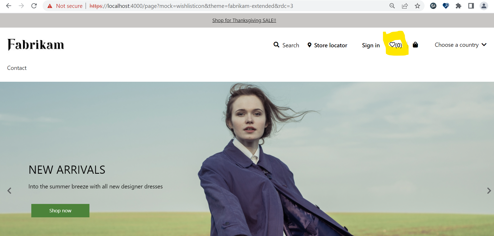

# Dynamics 365 Commerce - online extensibility samples

## License
License is listed in the [LICENSE](./LICENSE) file.

# Sample - Wishlist Items Count

## Overview
In this sample, you will learn how to implement and display a wishlist items count on the wishlist icon for a logged on e-commerce customer.



## Starter kit license
License for starter kit is listed in the [LICENSE](./module-library/LICENSE) .

## Prerequisites
Follow the instructions mentioned in [document](https://docs.microsoft.com/en-us/dynamics365/commerce/e-commerce-extensibility/setup-dev-environment) to set up the development environment.

### Procedure to create custom theme
Follow the instructions mentioned in [document](https://docs.microsoft.com/en-us/dynamics365/commerce/e-commerce-extensibility/create-theme) to create the custom theme,in this sample, we'll assume a custom theme has been cloned from the fabrikam theme named "fabrikam-extended".

## Detailed Steps to implement Wishlist items count 

### 1. Extend definition file for header
Create a new file named **header.definition.ext.json** under **src\themes\fabrikam-extended\definition-extensions** folder and paste the code below in it

```typescript
{
    "$type": "definitionExtension",
    "dataActions": {
        "wishlists": {
            "path": "@msdyn365-commerce-modules/retail-actions/dist/lib/get-wishlist-by-customer-id",
            "runOn": "server"
        }
    }
}
```

### 2. Create Wishlist Icon Component
Override wishlisticon.component.tsx component using this command **yarn msdyn365 add-component-override fabrikam-extended wishlisticon**.Open the new wishlisticon.component.tsx under **src/themes/fabrikam-extended/views/components** and replace existing code with below code to display Wishlist count button with text.

```typescript
/*--------------------------------------------------------------
 * Copyright (c) Microsoft Corporation. All rights reserved.
 * See License.txt in the project root for license information.
 *--------------------------------------------------------------*/

import { getUrlSync, IComponent, IComponentProps, msdyn365Commerce } from '@msdyn365-commerce/core';
import { Button, getPayloadObject, getTelemetryAttributes,
    ITelemetryContent, onTelemetryClick, UncontrolledTooltip } from '@msdyn365-commerce-modules/utilities';
import classname from 'classnames';
import * as React from 'react';

export interface IWishlistIconComponentProps extends IComponentProps<{}> {
    className?: string;
    wishlistTooltipText: string;
    showButtonTooltip?: boolean;
    telemetryContent?: ITelemetryContent;
    wishlistCountLabel?: string;
    wishlistCount?: number;
    isDispayWishlistCount?: boolean;
}

export interface IWishlistIconComponent extends IComponent<IWishlistIconComponentProps> {
}

const WishlistIconComponentActions = {};

/**
 * WishlistIcon component.
 * @param props
 * @extends {React.PureComponent<IWishlistIconProps>}
 */
const WishlistIcon: React.FC<IWishlistIconComponentProps> = (props: IWishlistIconComponentProps) => {
    const wishlistIconRef: React.RefObject<HTMLButtonElement> = React.createRef();
    const text = props.wishlistTooltipText;
    const showButtonIconTooltip = props.showButtonTooltip;
    const wishlistUrl = getUrlSync('wishlist', props.context.actionContext);
    const signInUrl = `${props.context.request.user.signInUrl}?ru=${wishlistUrl}`;
    const url = props.context.request.user.isAuthenticated ? wishlistUrl : signInUrl;
    const showTooltip = showButtonIconTooltip !== undefined ? showButtonIconTooltip : true;
    // const shouldShowCount = props.isDispayWishlistCount !== undefined ? props.isDispayWishlistCount : false;
    // const wishlistCountlbl = props.wishlistCountLabel !== undefined ? props.wishlistCountLabel : '';
    const wishlistItemCount = props.wishlistCount !== undefined ? props.wishlistCount : '';
    // const countLabel = format(wishlistCountlbl, wishlistItemCount);

    // Construct telemetry attribute to render
    const payLoad = getPayloadObject('click', props.telemetryContent!, text, '');
    const attributes = getTelemetryAttributes(props.telemetryContent!, payLoad);
    const formattedWishlistCount = props.className === 'ms-header__wishlist-mobile' ? `${text} `+`(${wishlistItemCount})` : `(${wishlistItemCount})` ;

    return (
        <>
            <Button
                className={classname('msc-wishlist-icon', props.className)}
                href={url}
                aria-label={text}
                innerRef={wishlistIconRef}
                {...attributes}
                onClick={onTelemetryClick(props.telemetryContent!, payLoad, text)}
            >
                { <span className='msc-wishlist-icon__textcount'>
                    {formattedWishlistCount}
                </span> }
            </Button>
            { showTooltip && <UncontrolledTooltip trigger='hover focus' target={wishlistIconRef}>
                {text}
            </UncontrolledTooltip>}
        </>
    );
};

// @ts-expect-error
export const WishListIconComponent: React.FunctionComponent<IWishlistIconComponentProps> = msdyn365Commerce.createComponentOverride<IWishlistIconComponent>(
    'WishListIcon',
    { component: WishlistIcon, ...WishlistIconComponentActions }
);


export default WishListIconComponent;
```

### 3. Create data file
Create a new file named **header.data.ts** under **src\themes\fabrikam-extended\views** folder and paste the code below in it

```typescript
/*--------------------------------------------------------------
 * Copyright (c) Microsoft Corporation. All rights reserved.
 * See License.txt in the project root for license information.
 *--------------------------------------------------------------*/

import { IStoreSelectorStateManager } from '@msdyn365-commerce-modules/bopis-utilities';
import { ICartState } from '@msdyn365-commerce/global-state';
import { AsyncResult, CommerceList, Customer } from '@msdyn365-commerce/retail-proxy';

export interface IHeaderData {
    cart: AsyncResult<ICartState>;
    accountInformation: AsyncResult<Customer>;
    storeSelectorStateManager: AsyncResult<IStoreSelectorStateManager>;
    wishlists?: AsyncResult<CommerceList[]>;
}

```

### 4. Extend view file for header
Create a new file named **header.view.tsx** under **src\themes\fabrikam-extended\views\header.view.tsx** folder and paste the code below in it

```typescript
/*--------------------------------------------------------------
 * Copyright (c) Microsoft Corporation. All rights reserved.
 * See License.txt in the project root for license information.
 *--------------------------------------------------------------*/

import { getTelemetryObject, Module, Node } from '@msdyn365-commerce-modules/utilities';
import { ArrayExtensions } from '@msdyn365-commerce-modules/retail-actions';
import * as React from 'react';

import { IHeaderViewProps } from '@msdyn365-commerce-modules/header/src/modules/header/./header';
import { IHeaderProps as IHeaderExtensionProps } from '../definition-extensions/header.ext.props.autogenerated';
import { WishListIconComponent } from './components/wishlisticon.component';
import { IHeaderData } from './header.data';

const headerView: React.FC<IHeaderViewProps> = props => {
    const {
        HeaderTag,
        HeaderContainer,
        HeaderTopBarContainer,
        MobileMenuContainer,
        MobileMenuBodyContainer,
        MobileMenuLinksContainer,
        Divider
    } = props;
    return (
        <Module {...HeaderTag}>
            <Node {...HeaderContainer}>
                <Node {...HeaderTopBarContainer}>
                    {props.navIcon}
                    {props.logo}
                    {_renderReactFragment(props.search)}
                    {props.preferredStore}
                    {_renderDesktopAccountBlock(props)}
                    {_renderWishListIconDesktop(props)}
                    <Node {...Divider} />
                    {props.cartIcon}
                    {_renderReactFragment(props.siteOptions)}
                </Node>
                <Node {...MobileMenuContainer}>
                    <Node {...MobileMenuBodyContainer}>
                        {props.MobileMenuHeader}
                        {_renderReactFragment(props.menuBar)}
                        <Node {...MobileMenuLinksContainer}>
                            {props.accountLinks ? props.accountLinks.map(link => link) : false}
                            {props.siteOptions}
                            {_renderWishListIconMobile(props)}
                            {props.signInLink}
                            {props.signOutLink}
                        </Node>
                    </Node>
                </Node>
                {_renderReactFragment(props.menuBar)}
            </Node>
        </Module>
    );
};

function _renderDesktopAccountBlock(props: IHeaderViewProps): JSX.Element | null {
    const {
        AccountInfoDropdownParentContainer,
        AccountInfoDropdownPopoverConentContainer,
        accountInfoDropdownButton,
        signOutLink,
        signInLink,
        accountLinks
    } = props;

    if (AccountInfoDropdownParentContainer) {
        if (AccountInfoDropdownPopoverConentContainer) {
            return (
                <Node {...AccountInfoDropdownParentContainer}>
                    {accountInfoDropdownButton}
                    <Node {...AccountInfoDropdownPopoverConentContainer}>
                        {accountLinks ? accountLinks.map(link => link) : false}
                        {signOutLink}
                    </Node>
                </Node>
            );
        } else if (signInLink) {
            return <Node {...AccountInfoDropdownParentContainer}>{signInLink}</Node>;
        }
    }
    props.context.telemetry.error('Header content is empty, module wont render.');
    return null;
}

function _renderReactFragment(items: React.ReactNode[]): JSX.Element | null {
    return (
        <>
            {items && items.length > 0
                ? items.map((slot: React.ReactNode, index: number) => {
                      return <React.Fragment key={index}>{slot}</React.Fragment>;
                  })
                : null}
        </>
    );
}

function _renderWishListIconDesktop(props: IHeaderViewProps & IHeaderExtensionProps<IHeaderData>): JSX.Element | null {
    const disableTooltip = props.context.app.config.disableTooltip || false;
    const wishlistTooltipText = props.resources.wishlistTooltipText;
    const context = props.context;
    const id = props.id;
    const typeName = props.typeName;
    const telemetryContent = getTelemetryObject(props.context.request.telemetryPageName!, props.friendlyName, props.telemetry);
    const wishlists = props.data.wishlists?.result;
    const wishlistCount = ((wishlists && ArrayExtensions.hasElements(wishlists) && wishlists[0].CommerceListLines) || []).length;
    return (
        <WishListIconComponent
            className='ms-header__wishlist-desktop'
            showButtonTooltip={!disableTooltip}
            wishlistTooltipText={wishlistTooltipText}
            context={context}
            id={id}
            typeName={typeName}
            telemetryContent={telemetryContent}
            data={props.data}
            wishlistCount={wishlistCount}
        />
    );
}

function _renderWishListIconMobile(props: IHeaderViewProps & IHeaderExtensionProps<IHeaderData>): JSX.Element | null {
    const disableTooltip = props.context.app.config.disableTooltip || false;
    const wishlistTooltipText = props.resources.wishlistTooltipText;
    const context = props.context;
    const id = props.id;
    const typeName = props.typeName;
    const telemetryContent = getTelemetryObject(props.context.request.telemetryPageName!, props.friendlyName, props.telemetry);
    const wishlists = props.data.wishlists?.result;
    const wishlistCount = ((wishlists && ArrayExtensions.hasElements(wishlists) && wishlists[0].CommerceListLines) || []).length;
    return (
        <WishListIconComponent
            className='ms-header__wishlist-mobile'
            showButtonTooltip={!disableTooltip}
            wishlistTooltipText={wishlistTooltipText}
            context={context}
            id={id}
            typeName={typeName}
            telemetryContent={telemetryContent}
            data={props.data}
            wishlistCount={wishlistCount}
        />
    );
}

export default headerView;
```

## Build and test module

The sample can now be tested in a web browser using the ```yarn start``` command.

Create a sample mock with name wishlistcount.json in the **src/pageMocks** and replace the mock file content with below content and run the application with mock by applying theme(https://localhost:4000/page?mock=wishlistcount&theme=fabrikam-extended)

## Third party Image and Video Usage restrictions

The software may include third party images and videos that are for personal use only and may not be copied except as provided by Microsoft within the demo websites.  You may install and use an unlimited number of copies of the demo websites., You may not publish, rent, lease, lend, or redistribute any images or videos without authorization from the rights holder, except and only to the extent that the applicable copyright law expressly permits doing so.
