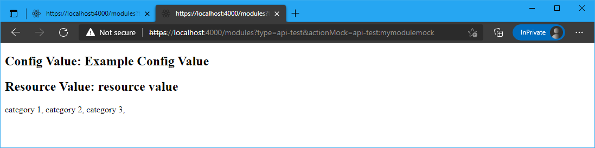
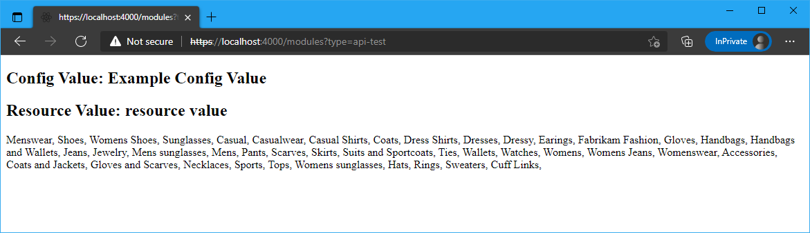

# Dynamics 365 Commerce - online SDK samples
## License
License is listed in the [LICENSE](./LICENSE) file.

# Sample - Call a Commerce Scale Unit API

## Overview
To call Retail Server APIs, you must use the Retail Server proxy library that Retail Server provides. This proxy library is also known as TypeScriptProxy or TSProxy. It allows for streamlined communication with Retail Server from JavaScript-based or TypeScript-based environments.  

In this sample, you will create a module that uses the Retail Server proxy to get all the categories that are available for the configured channel when a page is loaded. To start, you must identify the correct Commerce Scale Unit proxy API to use. For this example, this API is the GetCategories API that is provided by the CategoriesDataActions data action manager. You can then construct a data action that can be used in a module definition. In general, to complete this task, you must do two things:

* Provide a createInput method that calls the Retail Server proxy createInput method for the desired API and passes it any contextual data that you want (for example, the channel ID).
* Have the action method of the new data action be the retailAction method that is provided by the Retail Server proxy. The retailAction method is designed to parse the input that is passed to it and call the corresponding Retail Server proxy API.

## Doc links
* [Call Commerce Scale Unit APIs](https://docs.microsoft.com/en-us/dynamics365/commerce/e-commerce-extensibility/call-retail-server-apis)
* [Commerce Scale Unit customer and consumer APIs](https://docs.microsoft.com/en-us/dynamics365/commerce/dev-itpro/retail-server-customer-consumer-api)
* [Data actions overview](https://docs.microsoft.com/en-us/dynamics365/commerce/e-commerce-extensibility/data-actions)
* [Test data actions with mocks](https://docs.microsoft.com/en-us/dynamics365/commerce/e-commerce-extensibility/test-data-action-mocks)
* [Page load data actions](https://docs.microsoft.com/en-us/dynamics365/commerce/e-commerce-extensibility/page-load-data-action)
* [Use event-based data actions](https://docs.microsoft.com/en-us/dynamics365/commerce/e-commerce-extensibility/event-based-data-actions)

## Detailed Steps

### 1. Use CLI command to create a new module

Use the CLI command: ```yarn msdyn365 add-module api-test``` to create a module called **api-test**. The new module will be created under the **\src\modules** directory.


### 2. Create a custom data action

In this step you will create a new data action that will be used to call the Commerce Scale Unit API.  This data action will then be added to the module definition file.  This type of call is considered a page load data action since the data action will be called when the page is loaded in the Node server.

Use the CLI command: ```yarn msdyn365 add-data-action get-category-list``` to create a new data action file called **get-category-list.action.ts**. The new module will be created under the **\src\actions** directory.


### 3. Call the Commerce Scale Unit API from within the data action

The Retail Server proxy contains a set of APIs that communicate internally with the Commerce Scale Unit via HTTP. These APIs are all available through a set of data action managers. To import the code for these data action managers, you can use the following import paths.


```typescript
// Generic example
import {} from '@msdyn365-commerce/retail-proxy/dist/DataActions/{DATA_ACTION_MANAGER_NAME}.g';

// Specific example
import { getByIdsAsync } from '@msdyn365-commerce/retail-proxy/dist/DataActions/CategoriesDataActions.g';
```
For a list of all the available Commerce Scale Unite APIs in each data action manager, see [Commerce Scale Unit customer and consumer APIs](https://docs.microsoft.com/en-us/dynamics365/commerce/dev-itpro/retail-server-customer-consumer-api).

Copy the following code into the **get-category-list.action.ts** file.  Notice the API **createGetCategoriesInput** which is imported from the **@msdyn365-commerce/retail-proxy/dist/DataActions/CategoriesDataActions.g** file.

```typescript
import { createObservableDataAction, IAction, ICreateActionContext } from '@msdyn365-commerce/core';
import { Category, retailAction } from '@msdyn365-commerce/retail-proxy';
import { createGetCategoriesInput } from '@msdyn365-commerce/retail-proxy/dist/DataActions/CategoriesDataActions.g';

/**
 * Get Org Unit Configuration Data Action
 */
export default createObservableDataAction({
    action: <IAction<Category[]>>retailAction,
    input: (context: ICreateActionContext) => {
        return createGetCategoriesInput({ Paging: { Top: 0 } }, context.requestContext.apiSettings.channelId);
    }
});
```

### 4. Add a data action call to module definition file

Copy the below into the module definition file **api-test.definition.json**.  Notice the relative path provided for the data action call **"../../actions/get-category-list"** and that the .ts file extension is not added.

```json
{
    "$type": "contentModule",
    "friendlyName": "api-test",
    "name": "api-test",
    "description": "Please add meaningful description for authoring",
    "categories": ["api-test"],
    "tags": ["Additional tags go here"],
    "dataActions": {
        "categories": {
            "path": "../../actions/get-category-list.action",
            "runOn": "server"
        }
    },    
    "config": {
        "showText": {
            "friendlyName": "showText",
            "description": "example config value",
            "type": "string",
            "default": "Example Config Value",
            "scope": "module",
            "group": "Layout Properties"
        }
    },
    "resources": {
        "resourceKey": {
            "comment": "resource description",
            "value": "resource value"
        }
    }
}
```

### 5. Add module code to process the returned category data

In this step, the module React code will be modified to leverage the returned data from the data action call.  To keep the example simple, the categories will just be appended to each other and passed to the view to show the returned data.

Copy the below into the **\src\modules\api-test\api-test.tsx** file.

```typescript
/*!
 * Copyright (c) Microsoft Corporation.
 * All rights reserved. See LICENSE in the project root for license information.
 */

import * as React from 'react';

import { IApiTestData } from './api-test.data';
import { IApiTestProps } from './api-test.props.autogenerated';

export interface IApiTestViewProps extends IApiTestProps<IApiTestData> {
    categories: string;
}

/**
 *
 * ApiTest component
 * @extends {React.PureComponent<IApiTestProps<IApiTestData>>}
 */
class ApiTest extends React.PureComponent<IApiTestProps<IApiTestData>> {
    public render(): JSX.Element | null {
        const {
            data: { categories }
        } = this.props;

        let CategoryList = 'no categories returned';
        if (categories && categories.result) {
            CategoryList = '';

            for (let i = 0; i < categories.result.length; i++) {
                CategoryList += `${categories.result[i].Name}, `;
            }
        }

        const ViewProps = {
            ...this.props,
            categories: CategoryList.toString()
        };

        return this.props.renderView(ViewProps);
    }
}

export default ApiTest;
```


### 6. Add module view code to display the returned categories

In this step, the module view code will display the returned categories string in the HTML output.

Copy the below into the **\src\modules\api-test\api-test.view.tsx** file.

```typescript
/*!
 * Copyright (c) Microsoft Corporation.
 * All rights reserved. See LICENSE in the project root for license information.
 */

import * as React from 'react';
import { IApiTestViewProps } from './api-test';

export default (props: IApiTestViewProps) => {
    const { categories } = props;

    return (
        <div className='row'>
            <h2>Config Value: {props.config.showText}</h2>
            <h2>Resource Value: {props.resources.resourceKey}</h2>
            <div className='row'>
                <p>{categories}</p>
            </div>
        </div>
    );
};
```

### 6. Add mock data action data
A data action mock can be created to mock data action returned data. This is useful when building or testing modules without access to a product Commerce Scale Unit.

To create a data action mock, create a new file under **src/module/api-test/mocks/** directory for your module, called **my-module-mock.actionmock.json** (note: this file name must have the extension ".actionmock.json" but can start with any name).

The data action we are using in this section returns a **SimpleProduct** object, to mock this you will need to simulate the same object structure that the data action returns.  In Visual Studio Code if you open the productFeature.data.ts file we edited above, you can right click on the **SimpleProduct** type and select "Go to definition" to see the interface, which looks like:

```typescript
/**
 * Category entity interface.
 */
export interface Category {
    RecordId: number;
    OfflineImage?: string;
    Name?: string;
    ParentCategory?: number;
    DisplayOrder?: number;
    Images?: MediaLocation[];
    NameTranslations?: TextValueTranslation[];
    ExtensionProperties?: CommerceProperty[];
}
```

Our module does not use all the available product fields, so we will only add the required ones we need to the mocks.  Add the following mock data to the new JSON file and save the file.

```json
{
    "CacheObjectType": "Category",
    "CacheKey": "*",
    "Mock": [
        {
            "Name": "category 1"
        },
        {
            "Name": "category 2"
        },
        {
            "Name": "category 3"
        }
    ]
}
```

### 7. Build and view module

The module can now be built and tested in a web browser using the ```yarn start``` command.

Once the build has completed, you should see an output stating that the server has started on a specific port as shown below.  

To use the action mock locally, you just need to include the 'actionMock' query string parameter using the name of the module along with the file name for the mock file created above “MODULE_NAME:MOCK_FILE_NAME” (note you should not add the mock extension .actionmock.json): **https://localhost:4000/modules?type=api-test&actionMock=api-test:my-module-mock**

You should see a module rendered similar to below which matches the data set in the mock file. 




### 8. Calling data action from Commerce production scale unit

When building and debugging a module on a development environment the **.env** file can be configured to point to a production Commerce scale unit and fetch live read only data to view inside your module.  This can be set using the following variables **MSDyn365Commerce_BASEURL**, **MSDyn365Commerce_CHANNELID**, **MSDyn365Commerce_CATALOGID**, **MSDyn365Commerce_OUN** and **MSDyn365Commerce_BASEIMAGEURL**.  For more information see the [Configure a development environment (.env) file](https://docs.microsoft.com/en-us/dynamics365/commerce/e-commerce-extensibility/configure-env-file) topic.  The product ID specified in the module mock file must exist on that Commerce scale unit for the module to render data.

The below image shows data coming from a production CommerceScale Unit that contains the Fabrikam demo data when using the following URL **https://localhost:4000/modules?type=api-test**.


