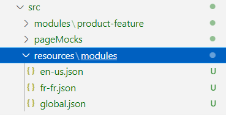
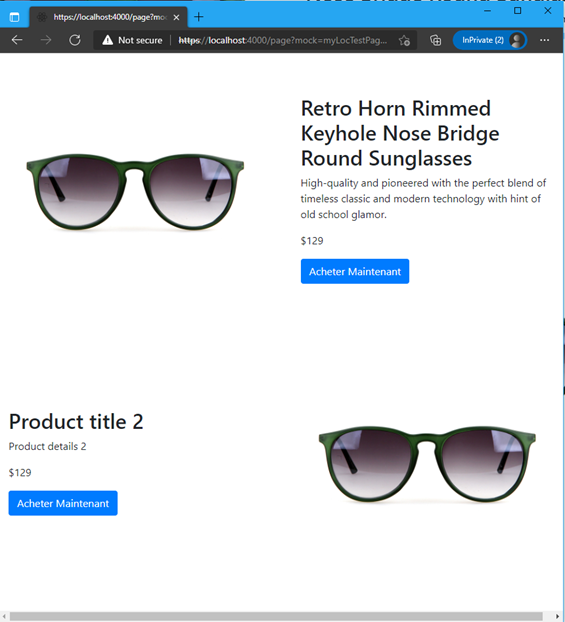

# Dynamics 365 Commerce - online SDK samples
## License
License is listed in the [LICENSE](./LICENSE) file.

# Sample - Module localization and globalization

## Overview
In this sample, you will learn how to localize and globalize a module.  We will start with the [sample 1 - Custom module](..\Sample1 - Custom module\README.md) code and modify the code in this sample. 

There are different ways that content can be localized.  If the content is coming from the site builder authoring tool module configuration properties like a string title or details, then the content can be localized directly in site builder.  However, if there is text content that exists inside the module and not exposed to the site builder tool as a configuration property, then the module itself can contain the localized strings.  

For example, a module that renders a list may have a "next" and "previous" button that needs alt-text for accessibility readers.

In this sample we will localize the "Buy Now" string inside the module created in sample 1.  Note the title and description strings are set as configuration properties thus will not need to be localized in the module source code. 


## Doc links
* [Localize a module](https://docs.microsoft.com/en-us/dynamics365/commerce/e-commerce-extensibility/localize-module)
* [Globalize modules by using the CultureInfoFormatter class](https://docs.microsoft.com/en-us/dynamics365/commerce/e-commerce-extensibility/globalize-modules)

## Detailed Steps

### 1. Start with code from the "Custom module" sample

Create a copy of the code (or follow steps) from the sample into a new directory.

### 2. Add resource configurations in the module definition file.

The "Buy Now" button in sample 1 was using a configuration property to get the string.  We will convert that to a resource string.  Copy the following into the **\src\modules\product-feature\product-feature.definition.json file**.

```json
{
    "$type": "contentModule",
    "friendlyName": "Product Feature",
    "name": "product-feature",
    "description": "Feature module used to highlight a product.",
    "categories": [
        "storytelling"
    ],
    "tags": [
        ""
    ],
    "dataActions": {},
    "config": {
        "imageAlignment": {
            "friendlyName": "Image Alignment",
            "description": "Sets the desired alignment of the image, either left or right on the text.",
            "type": "string",
            "enum": {
                "left": "Left",
                "right": "Right"
            },
            "default": "left",
            "scope": "module",
            "group": "Layout Properties"
        },
        "productTitle": {
            "type": "string",
            "friendlyName": "Product Title",
            "description": "Product placement title"
        },
        "productDetails": {
            "type": "richText",
            "friendlyName": "Product Details",
            "description": "Rich text representing the featured product details"
        },
        "productImage": {
            "type": "image",
            "friendlyName": "Product Image",
            "description": "Image representing the featured product"
        }
    },
    "resources": {
        "buyNowButtonText": {
            "value": "Buy Now",
            "comment": "Text for the buy now button"
        }
    }
}
```

Make note of the new **resources** section added above.  The **buyNowButtonText** element will contain the default text for the button.  This resources section can be accessed directly from the typescript files using the **this.props.resources.*** API.

### 3.	Mock data for the configurations

Each configuration property can have corresponding mock data which will help while developing the module without the need to have a deployed environment to test on.  Copy the following to the **\src\modules\product-feature\mocks\product-feature.json** file.  No special mock data is added for our resource here, but the previous buy button text configuration property has been removed.

```json
{
  "id": "R1Module1",
  "config": {
    "imageAlignment": "left",
    "productTitle": "Retro Horn Rimmed Keyhole Nose Bridge Round Sunglasses",
    "productDetails": "High-quality and pioneered with the perfect blend of timeless classic and modern technology with hint of old school glamor.",
    "productImage": {
      "src": "https://bit.ly/33cMGxr",
      "altText": "Retro Horn Rimmed Keyhole Nose Bridge Round Sunglasses"
    }
  },
  "typeName": "product-feature"
}
```

### 4. Fix module test code
To ensure the module unit test code still works, we need to update the config section to match our new configs added in the module definition file.  Copy the below code into the **\src\modules\product-feature\tests\product-feature.test.tsx** file. No special test data is added for our resource here, but the previous buy button text has been removed.

```typescript
import { buildMockModuleProps } from '@msdyn365-commerce/core-internal';
/// <reference types="jest" />

import * as React from 'react';
import * as renderer from 'react-test-renderer';

import ProductFeature from '../product-feature';
import { IProductFeatureData } from '../product-feature.data';
import { imageAlignment, IProductFeatureConfig, IProductFeatureProps } from '../product-feature.props.autogenerated';

const mockData: IProductFeatureData = {
    actionResponse: {
        text: 'Sample Response Data'
    }
};

const mockConfig: IProductFeatureConfig = {
    imageAlignment: imageAlignment.left,
    productTitle: 'Retro Horn Rimmed Keyhole Nose Bridge Round Sunglasses',
    productDetails:
        'High-quality and pioneered with the perfect blend of timeless classic and modern technology with hint of old school glamor.',
    productImage: {
        src: 'https://bit.ly/33cMGxr',
        altText: 'Retro Horn Rimmed Keyhole Nose Bridge Round Sunglasses'
    }
};

const mockActions = {};

describe('ProductFeature', () => {
    let moduleProps: IProductFeatureProps<IProductFeatureData>;
    beforeAll(() => {
        moduleProps = buildMockModuleProps(mockData, mockActions, mockConfig) as IProductFeatureProps<IProductFeatureData>;
    });
    it('renders correctly', () => {
        const component: renderer.ReactTestRenderer = renderer.create(<ProductFeature {...moduleProps} />);
        const tree: renderer.ReactTestRendererJSON | renderer.ReactTestRendererJSON[] | null = component.toJSON();
        expect(tree).toMatchSnapshot();
    });
});
```

### 5. Add code to the module React code.

The module React code contains the module's business logic and is responsible for calling the module view file to create the output HTML for the module. Copy the below code to the modules react typescript file **\src\modules\product-feature\product-feature.tsx**. The main change here from sample 1 is the module buy now button no longer gets the string from a configuration property instead it will retrieve the string from the **this.props.resources.buyNowButtonText** resource API call.

```typescript
import * as React from 'react';

import { IProductFeatureData } from './product-feature.data';
import { imageAlignment, IProductFeatureProps } from './product-feature.props.autogenerated';

export interface IProductFeatureViewProps extends IProductFeatureProps<IProductFeatureData> {
    productName: string;
    productInfo: string;
    productImageUrl: string;
    productPrice: string;
    buttonInfo: string;
    alignment: imageAlignment;
}

/**
 *
 * ProductFeature component
 * @extends {React.PureComponent<IProductFeatureProps<IProductFeatureData>>}
 */
class ProductFeature extends React.PureComponent<IProductFeatureProps<IProductFeatureData>> {
    public render(): JSX.Element | null {
        const { config } = this.props;

        // set default product info values
        const ProductName = config.productTitle ? config.productTitle : 'No product name defined';
        const ProductInfo = config.productDetails ? config.productDetails.toString() : 'No product details defined';
        const ProductImageUrl = config.productImage ? config.productImage.src : '';
        const ProductPrice = '129';

        const ProductFeatureViewProps = {
            ...this.props,
            productName: ProductName,
            productInfo: ProductInfo,
            productImageUrl: ProductImageUrl,
            productPrice: ProductPrice,
            buttonInfo: this.props.resources.buyNowButtonText,
            alignment: config.imageAlignment
        };

        return this.props.renderView(ProductFeatureViewProps);
    }
}

export default ProductFeature;
```

No module view code change is needed from sample 1.

### 6. Build and test module
The module can now be built and tested in a web browser using the ```yarn start``` command to see if the proper string is being picked up from the resources section of the module definition file.

Once the build has completed, you can view the module using the following URL https://localhost:4000/modules?type=product-feature&theme=spring 


Notice in the image above that the "Buy Now" text from the resources section of the module definition file is now being displayed in the buy button.

### 7. Adding resource files
Next we will add resource files to support localized versions of the resource.  Under the **/src** directory create a directory **resource/modules** with new files **global.json** (used as the default or fallback when the locale is not supported), **en-us.json** and **fr-fr.json**.

Each resource file contains key/value pairs, and an optional comment property that can provide additional context about the resource key. All modules share a single set of resource files. Therefore, modules can share the same resource keys. 


 

In the **global.json** file paste the following
```json
{
    "buyNowButtonText": {
        "value": "Buy Now Global",
        "_value.comment": "text for the buy now box"
    }
}
```

In the **en-us.json** file paste the following
```json
{
    "buyNowButtonText": {
        "value": "Buy Now English US",
        "_value.comment": "text for the buy now box"
    }
}
```

In the **fr-fr.json** file paste the following
```json
{
    "buyNowButtonText": {
        "value": " Acheter Maintenant",
        "_value.comment": "text for the buy now box"
    }
}
```

### 8. Build a page mock

To test different locales we can use a page mock.  Create a new file **myLocTestPage.json** under the **src/pageMocks** directory and copy the below json into the file.  Note the **locale** section below which is used to specify the locale to test.

```json
{
    "exception": null,
    "pageRoot": {
        "id": "core-root_0",
        "typeName": "core-root",
        "modules": {
            "body": [
                {
                    "id": "default-page_0",
                    "typeName": "default-page",
                    "modules": {
                        "primary": [
                            {
                                "id": "ProductFeature__0",
                                "typeName": "product-feature",
                                "config": {
                                    "imageAlignment": "left",
                                    "productTitle": "Retro Horn Rimmed Keyhole Nose Bridge Round Sunglasses",
                                    "productDetails": "High-quality and pioneered with the perfect blend of timeless classic and modern technology with hint of old school glamor.",
                                    "productImage": {
                                      "src": "https://bit.ly/33cMGxr",
                                      "altText": "Retro Horn Rimmed Keyhole Nose Bridge Round Sunglasses"
                                    }
                                }
                            },
                            {
                                "id": "ProductFeature__1",
                                "typeName": "product-feature",
                                "config": {
                                    "imageAlignment": "right",
                                    "productTitle": "Product title 2",
                                    "productDetails": "Product details 2",
                                    "productImage": {
                                      "src": "https://bit.ly/33cMGxr",
                                      "altText": "image alt text"
                                    }
                                }
                            }
                        ]
                    }
                }
            ]
        }
    },
    "renderingContext": {
        "gridSettings": {
            "xs": {
                "w": 767
            },
            "sm": {
                "w": 991
            },
            "md": {
                "w": 1199
            },
            "lg": {
                "w": 1599
            },
            "xl": {
                "w": 1600
            }
        },
        "staticContext": {
            "staticCdnUrl": "/_scnr/"
        },
        "locale": "en-us"
    },
    "statusCode": 200
}
```

Run ```yarn start``` again to start the Node server.  When it’s ready, launch the following URL to see the mock test page **https://localhost:4000/page?mock=myLocTestPage&theme=spring**.  Notice the mock page file name is used in the URL.


Notice in the above image since **en-us** is set in the page mock for the locale, **Buy Now English US** is rendered.  If you change the page mock locale to **fr-fr** you should see the French localized string in the buy box as shown below.
 


If you set the page mock to a locale that does not have a specific resource file for it, the string will fall back to the value specified in the global.json file.  For example setting the locale to **fr-ca** will render the following: 
 
 

It is the responsibility of the module developer to ship all supported language resources for each module as needed.  However, when hard coding strings like this, they cannot be changed by the page or site editor only with a code change.  Thus, it is generally advisable to expose as many strings as possible as config values within a module so they can be easily changed without a code change.

## Module Globalization

Globalization of an online site should include not only string localization, but also number, date, and currency formatting for the various languages and regions that your website serves. The Microsoft Dynamics 365 Commerce Online Software Development Kit (SDK) provides a **CultureInfoFormatter** class that helps meet typical globalization requirements for the format of numbers, currencies as well as dates and times.

### 9. Format currency for the appropriate culture
An instance of the CultureInfoFormatter class is automatically created and can be accessed in the module view through the this.props.context object. The following examples shows how to use the CultureInfoFormatter methods to format currency.  Copy the below code into the **product-feature.tsx** typescript file.

```typescript
/*---------------------------------------------------------------------------------------------
 *  Copyright (c) Microsoft Corporation. All rights reserved.
 *  Licensed under the MIT License. See License.txt in the project root for license information.
 *--------------------------------------------------------------------------------------------*/

import * as React from 'react';

import { IProductFeatureData } from './product-feature.data';
import { imageAlignment, IProductFeatureProps } from './product-feature.props.autogenerated';

export interface IProductFeatureViewProps extends IProductFeatureProps<IProductFeatureData> {
    productName: string;
    productInfo: string;
    productImageUrl: string;
    productPrice: string;
    buttonInfo: string;
    alignment: imageAlignment;
}

/**
 *
 * ProductFeature component
 * @extends {React.PureComponent<IProductFeatureProps<IProductFeatureData>>}
 */
class ProductFeature extends React.PureComponent<IProductFeatureProps<IProductFeatureData>> {
    public render(): JSX.Element | null {
        const { config } = this.props;

        // set default product info values
        const ProductName = config.productTitle ? config.productTitle : 'No product name defined';
        const ProductInfo = config.productDetails ? config.productDetails.toString() : 'No product details defined';
        const ProductImageUrl = config.productImage ? config.productImage.src : '';

        const intlFormatter = this.props.context.cultureFormatter
        const ProductPrice = intlFormatter.formatCurrency(129);

        const ProductFeatureViewProps = {
            ...this.props,
            productName: ProductName,
            productInfo: ProductInfo,
            productImageUrl: ProductImageUrl,
            productPrice: ProductPrice,
            buttonInfo: this.props.resources.buyNowButtonText,
            alignment: config.imageAlignment
        };

        return this.props.renderView(ProductFeatureViewProps);
    }
}

export default ProductFeature;
```

Notice the **intlFormatter.formatCurrency** API call for the product price.  This will take the current locale and apply the proper currency format to it.  

After running ```yarn start```, load the test mock page using the following URL **https://localhost:4000/page?mock=myLocTestPage&theme=spring**.  The below image is taken after setting the test mock page locale to "fr-fr".  Notice the appropriate currency format is used for the "fr-fr" locale.

 

 Similar globalization APIs are available for formatting numbers, dates and times.