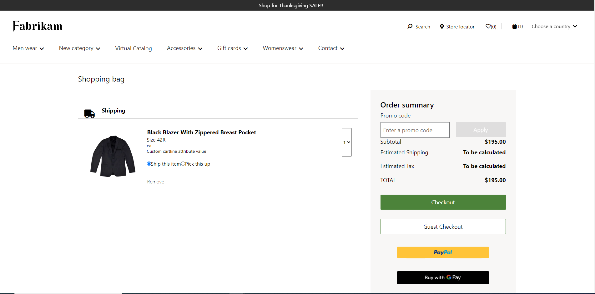
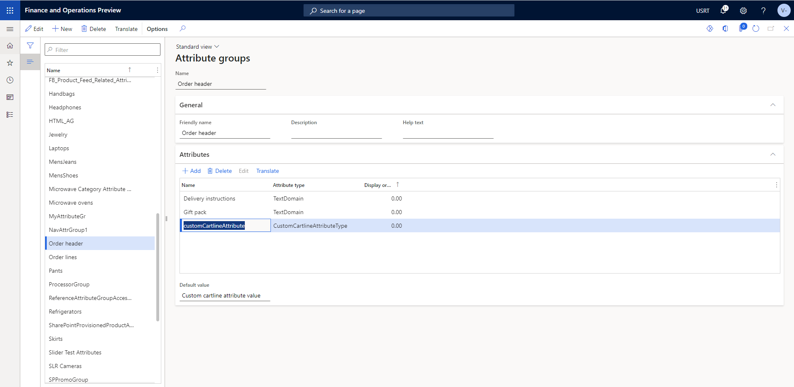

# Dynamics 365 Commerce - online training samples

## License
License is listed in the [LICENSE](./LICENSE) file.

# Sample - Adding and consuming custom cartline attributes

## Overview

This sample covers on how to configure the custom cartline attributes in HQ and how to consume the same in E-Commerce.


## Starter kit license
License for starter kit is listed in the [LICENSE](./module-library/LICENSE) .

## Prerequisites
Follow the instructions mentioned in [document](https://docs.microsoft.com/en-us/dynamics365/commerce/e-commerce-extensibility/setup-dev-environment) to set up the development environment.

### Procedure to create custom theme
Follow the instructions mentioned in [document](https://docs.microsoft.com/en-us/dynamics365/commerce/e-commerce-extensibility/create-theme) to create the custom theme

Create a theme folder with name fabrikam-extended.

## Detailed Steps

### 1. HQ setting for creating custom product attribute.

Please refer the link for adding cartline attributes [document](https://docs.microsoft.com/en-us/dynamics365/commerce/dev-itpro/order-attributes)



### 2. Consume custom cartline addtribute in **Cartlineitem** component.

Override the cartlineitem.component.tsx component in your theme using this command **yarn msdyn365 add-component-override fabrikam-extended CartLineItem**, replace "fabrikam-extended" with your custom theme. 

Open the new cartlineitem.component.tsx under src/themes/fabrikam-extended/views/components and add the below code in **CartLine** function to consume the logic for custom cartline addtribute and we can call **renderCustomCartlineAttributeText** where ever we want to render the custom cartline addtribute value.

```typescript

    const customCartlineAttributeKey: string = 'customCartlineAttribute';
    const [customCartlineAttributeText, SetCustomCartlineAttributeText] = React.useState<string>('');

    const getAttributeValue = (cartLine: CartLine, attributeName: string): string => {
        const attribute: any =
            cartLine.AttributeValues &&
            cartLine.AttributeValues.find((attributeValueBase: AttributeValueBase) => attributeValueBase.Name === attributeName);
        if (attribute && attribute.TextValue) {
            return attribute.TextValue;
        }
        return '';
    };

    React.useEffect(() => {
        SetCustomCartlineAttributeText(getAttributeValue(props.data.cartLine, customCartlineAttributeKey));
    }, [props.data.cartLine]);

    const renderCustomCartlineAttributeText = () => {
        return (
            <label className='msc-cart-line__attribute-value'>{customCartlineAttributeText}</label>
        )
    }

```

### Build and test module

The sample can now be tested in a web browser using the ```yarn start``` command.

### Test by using mock file

Create a sample mock with name cart.json under the **src/pageMocks**. Use the sample cart page mock located in src/PageMocks folder.
Go to browser and copy paste the URL https://localhost:4000/page?mock=cart&theme=fabrikam-extended 
Note: Need to change the cookie values to show the added cart item in pagemocks.

### Test Integration test case

Integration test case for sample can be tested in browser using below steps
 * Set path to Add and consume custom cartline attributes sample level in command propmt and run ```yarn testcafe chrome .\test\custom-cartline-attribute-tests.ts -s .\``` command.

* ensure that testcafe is added globally to run test case.

## Third party Image and Video Usage restrictions

The software may include third party images and videos that are for personal use only and may not be copied except as provided by Microsoft within the demo websites.  You may install and use an unlimited number of copies of the demo websites., You may not publish, rent, lease, lend, or redistribute any images or videos without authorization from the rights holder, except and only to the extent that the applicable copyright law expressly permits doing so.
