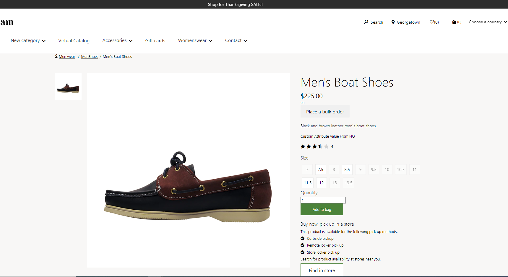

# Dynamics 365 Commerce - online training samples

## License
License is listed in the [LICENSE](./LICENSE) file.

# Sample - Adding and consuming custom product attributes

## Overview

This sample covers on how to configure the custom product attributes in HQ and how to consume the same in E-Commerce.

Attributes provide a way to further describe a product and its characteristics through user-defined fields (such as Memory size, Hard disk capacity, Is Energy star compliant, and so on). Attributes can be associated with various Commerce entities, such as product categories and default values can be set for them. Products then inherit the attributes and the default values when they are associated with the product categories. The default values can be overridden at the individual product level as well.



## Starter kit license
License for starter kit is listed in the [LICENSE](./module-library/LICENSE) .

## Prerequisites
Follow the instructions mentioned in [document](https://docs.microsoft.com/en-us/dynamics365/commerce/e-commerce-extensibility/setup-dev-environment) to set up the development environment.

### Procedure to create custom theme
Follow the instructions mentioned in [document](https://docs.microsoft.com/en-us/dynamics365/commerce/e-commerce-extensibility/create-theme) to create the custom theme

Create a theme folder with name fabrikam-extended.

## Detailed Steps

### 1. HQ setting for creating custom product attribute.

Follow the instructions mentioned in [document](https://docs.microsoft.com/en-us/dynamics365/commerce/attribute-attributegroups-lifecycle) to crete the attribute **CustomAttribute** in HQ side.


### 2. Add a page load data action to the module definition file

Create a new file **buybox.definition.ext.json** under **\src\themes\fabrikam-extended\definition-extensions** folder and copy the code given below.
In this step we will extend the buybox module definition file to add a data action to get productAttributes.

```
{
    "$type": "definitionExtension",
    "dataActions": {
        "productAttributes": {
            "path": "@msdyn365-commerce-modules/retail-actions/dist/lib/get-attributes-for-selected-variant",
            "runOn": "server"
        }
    }
}
```

### 3. Extend buybox view to consume the **CustomProduct** attribute.

Extend buybox.view.tsx using this command **yarn msdyn365 add-view-extension fabrikam-extended buybox**. Open the new buybox.tsx under src/themes/fabrikam-extended/views/ and add the below code. This logic is used to display custom product attribute using getCustomAttribute method and interfaces IBuyboxExtData. Add the function call **getCustomAttribute** by passing the props in BuyboxView. 

```typescript

import { ArrayExtensions } from '@msdyn365-commerce-modules/retail-actions';
import { AsyncResult, AttributeValue } from '@msdyn365-commerce/retail-proxy';
import { IBuyboxProps as IBuyboxExtentionProps } from '../definition-extensions/buybox.ext.props.autogenerated';

export interface IBuyboxExtData {
    productAttributes: AsyncResult<AttributeValue[]>;
}

enum CustomAttributes {
    customAttribute = 'customAttribute'
}

const BuyboxView: React.FC<IBuyboxViewProps & IBuyboxExtentionProps<IBuyboxExtData>> = props => {
    const { ModuleProps, MediaGalleryContainerProps, ProductInfoContainerProps, addToCart, addToOrderTemplate, addToWishlist, configure, description, findInStore, quantity, price, title, rating, inventoryLabel, shopSimilarLook, keyInPrice,
        shopSimilarDescription, unitOfMeasure } = props;

    return (
        <Module {...ModuleProps}>
            <Node {...MediaGalleryContainerProps}>
                {props.mediaGallery}
            </Node>
            <Node {...ProductInfoContainerProps}>
                {title}
                {price}
                {unitOfMeasure}
                {props.bulkPurchaseLink}
                {description}
                {getCustomAttribute(props)}
                {rating}
                {configure && _renderConfigure(configure)}
                {keyInPrice && _renderKeyInPrice(keyInPrice)}
                {quantity && _renderQuantity(quantity)}
                {inventoryLabel}
                {addToCart && _renderAddToCart(addToCart)}
                {findInStore && _renderFindInStore(findInStore)}
                {addToOrderTemplate && _renderAddToOrderTemplate(addToOrderTemplate)}
                {addToWishlist && _renderAddToWishlist(addToWishlist)}
                {_renderSocialShare(props.slots && props.slots.socialShare)}
                {shopSimilarLook && _renderShopSimilarItem(shopSimilarLook)}
                {shopSimilarDescription && _renderShopSimilarItem(shopSimilarDescription)}
            </Node>
        </Module>
    );
}
```
```typescript
export function getCustomAttribute(props: IBuyboxViewProps & IBuyboxExtentionProps<IBuyboxExtData>): React.ReactElement | undefined {
    const productAttributes = props.data.productAttributes.result;
    let customAttributeValue: string | undefined;
    if (!productAttributes) {
        return undefined;
    }

    ArrayExtensions.validValues(
        productAttributes.map(item => {
             if (item.Name === CustomAttributes.customAttribute && item.TextValue !== '') {
                customAttributeValue = item.TextValue;
            }
        })
    );
    return customAttributeValue ? <div className='msc-product-custom-attribute'>{customAttributeValue}</div> : undefined;
}

```

### 4. Build and test module

Please refer mock file under the **src/pageMocks/pdp.json**, [pageMock](src/pageMocks/pdp.json).

Update the buybox component theme from fabrikam to fabrikam-extended as shown below if you are working on a new mock file for different pages.

```json

"pageTheme": "fabrikam-extended",
"siteTheme": "fabrikam-extended"

```

The sample can now be tested in a web browser using the ```yarn start``` command.

### 5. Senario to test with mock

Test the module using page mock, Go to browser and copy paste the below url https://localhost:4000/page?mock=pdp&theme=fabrikam-extended 

### 6. Test Integration test case

Integration test case for sample can be tested in browser using below steps
* Set path to Add and consume custom product attributes sample level in command propmt and run ```yarn testcafe chrome .\test\custom-product-attribute-tests.ts -s .\``` command.

* Ensure that testcafe is added globally to run test case.

## Third party Image and Video Usage restrictions

The software may include third party images and videos that are for personal use only and may not be copied except as provided by Microsoft within the demo websites.  You may install and use an unlimited number of copies of the demo websites., You may not publish, rent, lease, lend, or redistribute any images or videos without authorization from the rights holder, except and only to the extent that the applicable copyright law expressly permits doing so.

## Custom Samples implemented

Please find below the reference samples which were implemented using the above approach.
[Product Badges Readme file](https://msazure.visualstudio.com/D365/_git/Commerce-Samples-EndToEndSolutions?path=/src/OnlineSDK/Extensibility%20Samples/Product%20Badges/README.md&version=GBmain)

[Product Image Orientation Readme file](https://msazure.visualstudio.com/D365/_git/Commerce-Samples-EndToEndSolutions?path=/src/OnlineSDK/Extensibility%20Samples/Product%20Image%20Orientation/README.md&version=GBmain)