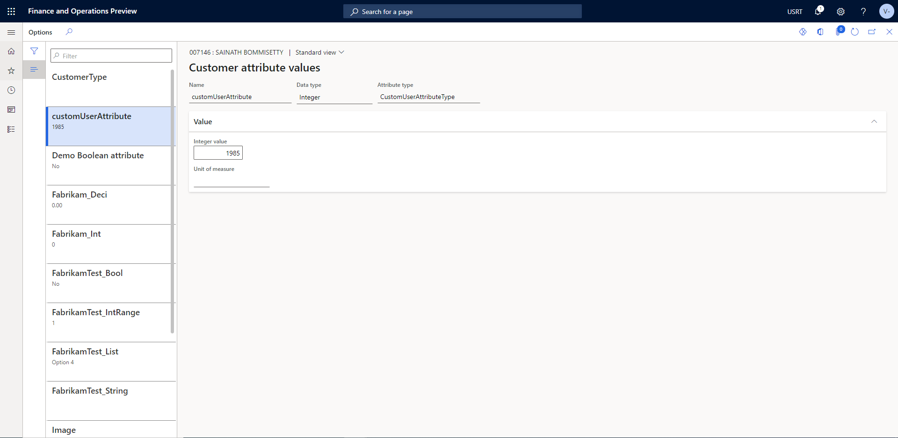
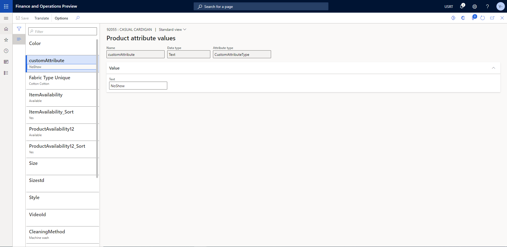
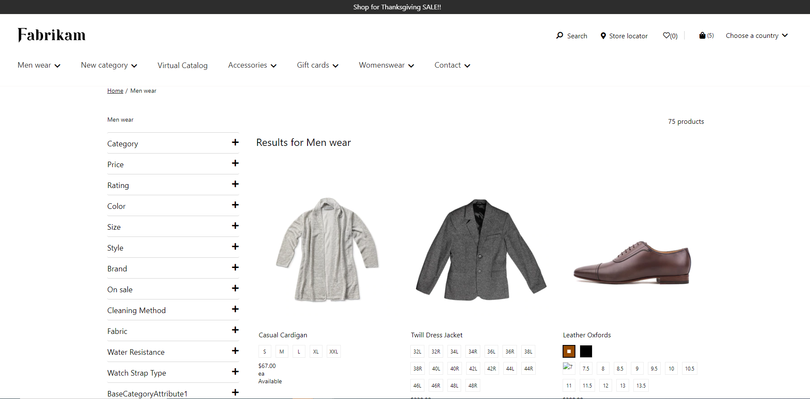
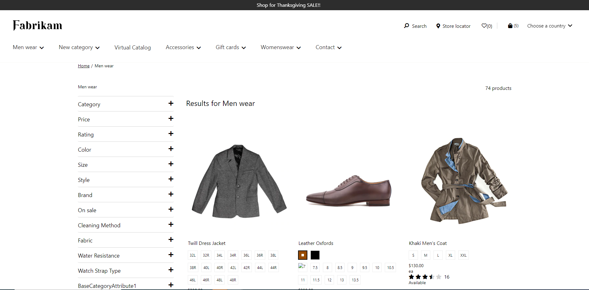

# Dynamics 365 Commerce - online training samples

## License
License is listed in the [LICENSE](./LICENSE) file.

# Sample - Adding and consuming custom user attributes

## Overview

This sample covers on how to configure the custom user attributes in HQ and how to consume the same in E-Commerce.

## Starter kit license
License for starter kit is listed in the [LICENSE](./module-library/LICENSE) .

## Prerequisites
Follow the instructions mentioned in [document](https://docs.microsoft.com/en-us/dynamics365/commerce/e-commerce-extensibility/setup-dev-environment) to set up the development environment.

### Procedure to create custom theme
Follow the instructions mentioned in [document](https://docs.microsoft.com/en-us/dynamics365/commerce/e-commerce-extensibility/create-theme) to create the custom theme

Create a theme folder with name fabrikam-extended.

## Detailed Steps

### 1. HQ setting for creating custom product attribute.

Please refer the link for adding customer/user Attributes [document](https://docs.microsoft.com/en-us/dynamics365/commerce/dev-itpro/customer-attributes)



### 2. Add custom-search-result-container Module

In this step we will clone the search result container module. Below is the CLI for cloning the core module
**yarn msdyn365 clone search-result-container custom-search-result-container**

### 3. Add a page load data action to the module definition file

In this step we will extend the custom-search-result-container module definition file to add a data action to get customerInformation.

```json

"dataActions": {
    "customerInformation": {
        "path": "@msdyn365-commerce-modules/retail-actions/dist/lib/get-customer"
    }
},

```

Need to add customerInformation in custom-search-result-container.data.ts interface as shown below

```typescript

export interface ICustomSearchResultContainerData {
    customerInformation: AsyncResult<Customer>;
}

```

### 4.Extend search-result-container 
Go to custom-search-result-container.tsx under **src/Modules/custom-search-result-container** and add existing code in **render** functions to consume user attribute.

**One usecase we have considered in this sample is to filter the age restricted products based on customer age.**

In this sample to filter the product "92055 CASUAL CARDIGAN" we have configured customAttribute to "NoShow" and the customUserAttribute to "1985". 
so that we can filter the age restricted products based on customer age.

Add the below code in **src\modules\custom-search-result-container\custom-search-result-container.tsx** in **render** function to consume the user and product attributes for filtering the products.



```typescript

const customer = this.props.data.customerInformation.result;
const custmerAttributes = (customer && customer.Attributes) || [];
const customUserAttribute = custmerAttributes.find(att => att.Name === "customUserAttribute");
const customerAge = customUserAttribute?.AttributeValue?.IntegerValue;
if(customerAge === 1985) {
    products = products.filter(product => {
        const productAttributeValues = product.AttributeValues;
        const productCustomAttribute = productAttributeValues?.find(att => att.Name === "customAttribute")
        if(productCustomAttribute?.TextValue === "NoShow") {
            return false;
        }
        return true;
    });
}

```

### Build and test module

The sample can now be tested in a web browser using the ```yarn start``` command.

### 1.Test by using mock file

Create a sample mock for signedIn user with name plp.json under the **src/pageMocks**. Use the sample PLP page mock located in src/PageMocks folder.
Go to browser and copy paste the URL https://localhost:4000/page?mock=plp&theme=fabrikam-extended

Note : To verify using mock of search result container, find search-result-container module in mock and rename search-result-container to custom-search-result-container and change the themes to fabrikam-extended.

```Json

"siteTheme": "fabrikam-extended",
"pageTheme": "fabrikam-extended"
"typeName": "custom-search-result-container",
"id": "custom-search-result-container",

```

**Before Applying Filter**

Product with Customer attribute value  and Product attribute value , which is configured from HQ is available on category page.Casual Cardigan product in below image is the example product.



**After Applying Filter**

Casual Cardigan product is filtered out in below image, based on Customer attribute value and Product attribute value so, not available on category page.



### 2.Test Integration test case

Integration test case for sample can be tested in browser using below steps
Set path to Add and consume custom user attributes sample level in command propmt and run ```yarn testcafe chrome .\test\custom-user-attribute-tests.ts -s .\``` command.

ensure that testcafe is added globally to run test case.

## Third party Image and Video Usage restrictions

The software may include third party images and videos that are for personal use only and may not be copied except as provided by Microsoft within the demo websites.  You may install and use an unlimited number of copies of the demo websites., You may not publish, rent, lease, lend, or redistribute any images or videos without authorization from the rights holder, except and only to the extent that the applicable copyright law expressly permits doing so.

## Custom Samples implemented

Please find below the reference sample which was implemented using the above approach.
[Role based caching Readme file](https://msazure.visualstudio.com/D365/_git/Commerce-Samples-EndToEndSolutions?path=/src/OnlineSDK/Extensibility%20Samples/Role%20based%20caching/README.md&version=GBmain)
