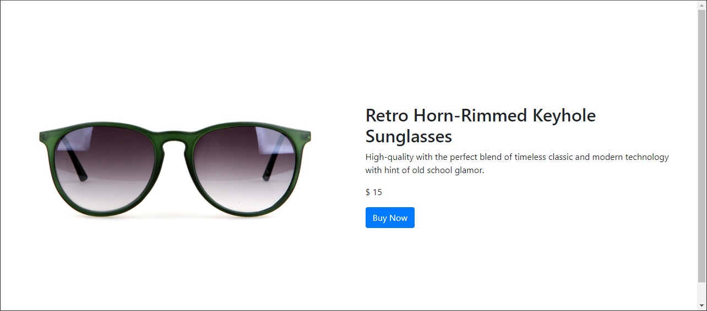
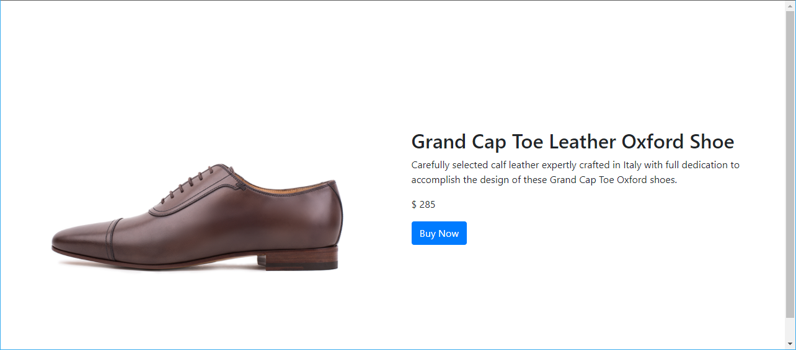

# Dynamics 365 Commerce - online SDK samples
## License
License is listed in the [LICENSE](./LICENSE) file.

# Sample - Call a core data action

## Overview
Dynamics 365 Commerce provides a set of **core** data actions as part of the Online SDK.  In this sample, you will learn how to call a core data action from within a module.  This sample will start with the **product-feature** module from sample 1 and call a core data action to get product information to display in the module. The data action will then call a Retail Server API on the Commerce scale unit and return product information data back for the module to use. A new configuration property will be added for a product ID, this will allow the page author to specify a product ID in the Commerce site builder tool. This ID will be passed into the data action which will return product information for that product.

## Doc links
* [Data actions overview](https://docs.microsoft.com/en-us/dynamics365/commerce/e-commerce-extensibility/data-actions)
* [Core data actions](https://docs.microsoft.com/en-us/dynamics365/commerce/e-commerce-extensibility/core-data-actions)
* [Test data actions with mocks](https://docs.microsoft.com/en-us/dynamics365/commerce/e-commerce-extensibility/test-data-action-mocks)
* [Page load data actions](https://docs.microsoft.com/en-us/dynamics365/commerce/e-commerce-extensibility/page-load-data-action)
* [Use event-based data actions](https://docs.microsoft.com/en-us/dynamics365/commerce/e-commerce-extensibility/event-based-data-actions)

## Detailed Steps

### 1. Start with code from the "Custom module" sample

Create a copy of the code (or follow steps) from the sample into a new directory.


### 2. Add a page load data action to the module definition file

Data actions that are added to the module definition file's **dataActions** node will be automatically run on page load on the Node server when the page is requested.  To get product information, the **get-simple-products** core data action will be used which takes in a list of product IDs and returns product information.

The below sample shows how to add a data action to the definition file.  All core data actions can be found in the **\node_modules\@msdyn365-commerce-modules/retail-actions/dist/lib/** directory, however the **node_modules** path is not needed in the "path" property as can be seen below.  Notice the **runOn** property below, this tells Node where to run this data action, the default value is "server" but can also be set to "client".  It is preferencial to load the data on the server, unless the data is not needed immediately on the client and thus can be delay loaded with the "client" setting.

```
    "dataActions": {
        "products": {
            "path": "@msdyn365-commerce-modules/retail-actions/dist/lib/get-simple-products",
            "runOn": "server"
        }
    },
```

The data action has been designed to look for its input data provided as a configuration property called **productIds**.  Since we'll only be passing in a single product ID, we'll add the following string configuration property, however if multiple IDs will be used, this can be changed to an array of strings.

```
        "productIds": {
            "friendlyName": "Product ID",
            "description": "Provide a Product Id that the module will display",
            "type": "string",
            "scope": "module",
            "group": "Content Properties"
        }
```
The following contains the full definition file, copy the following JSON into the **\src\modules\product-feature\product-feature.definition.json** file.   

```json
{
    "$type": "contentModule",
    "friendlyName": "Product Feature",
    "name": "product-feature",
    "description": "Feature module used to highlight a product.",
    "categories": [
        "storytelling"
    ],
    "tags": [
        ""
    ],
    "dataActions": {
        "products": {
            "path": "@msdyn365-commerce-modules/retail-actions/dist/lib/get-simple-products",
            "runOn": "server"
        },
        "productReviews": {
            "path": "../../actions/get-product-reviews.action",
            "runOn": "server"
        }
    },
    "config": {
        "imageAlignment": {
            "friendlyName": "Image Alignment",
            "description": "Sets the desired alignment of the image, either left or right on the text.",
            "type": "string",
            "enum": {
                "left": "Left",
                "right": "Right"
            },
            "default": "left",
            "scope": "module",
            "group": "Layout Properties"
        },
        "productTitle": {
            "type": "string",
            "friendlyName": "Product Title",
            "description": "Product placement title"
        },
        "productDetails": {
            "type": "richText",
            "friendlyName": "Product Details",
            "description": "Rich text representing the featured product details"
        },
        "productImage": {
            "type": "image",
            "friendlyName": "Product Image",
            "description": "Image representing the featured product"
        },
        "buttonText": {
            "type": "string",
            "friendlyName": "Button Text",
            "description": "Text to show on the call to action button"
        },
        "productIds": {
            "friendlyName": "Product ID",
            "description": "Provide a Product Id that the module will display",
            "type": "string",
            "scope": "module",
            "group": "Content Properties"
        }
    },
    "resources": {
        "resourceKey": {
            "comment": "resource description",
            "value": "resource value"
        }
    }
}
```

### 3. Add a data action return variable

Each data action that returns data needs a variable to store the data in defined in the MODULE_NAME.data.ts file.  Open the **product-feature.data.ts** file and copy the following code into it.  Notice the result is an array of **SimpleProduct**'s whose type is defined in the **\node_modules\@msdyn365-commerce\retail-proxy** directory.  Also note that the name of the variable **products** below matches the name of the data action node defined in the above module definition file.

```typescript
import { AsyncResult, SimpleProduct } from '@msdyn365-commerce/retail-proxy';

export interface IProductFeatureData {
    products: AsyncResult<SimpleProduct>[];
}
```


### 4. Add mock data for product Id

Since a new product ID configuration parameter was added above, you can also add a product ID to the mock file, this will be useful in testing if you have a live production environment to test against (see below section on how to configure .env file).

Copy the below JSON into the **\mocks\product-feature.json** file.  Notice the new "productIds" configuration property has a demo product ID from the **Fabrikam** demo data set, this may need changing to match a product ID from within your defined products.


```json
{
  "id": "R1Module1",
  "config": {
    "imageAlignment": "left",
    "productTitle": "Retro Horn Rimmed Keyhole Nose Bridge Round Sunglasses",
    "productDetails": "High-quality and pioneered with the perfect blend of timeless classic and modern technology with hint of old school glamor.",
    "productImage": {
      "src": "https://bit.ly/33cMGxr",
      "altText": "Retro Horn Rimmed Keyhole Nose Bridge Round Sunglasses"
    },
    "buttonText": "Buy Now",
    "productIds": "68719498121"
  },
  "typeName": "product-feature"
}
```

Note that this sample module will still leverage the other configuration values such as productTitle and productDetails if a product ID is not provided, so those values will be left in the mock file.

### 5. Handle the returned data from the data action in module

In this step, the module React code will be modified to leverage the returned data from the data action call.

Copy the below into the **\src\modules\product-feature\product-feature.tsx** file.

```typescript
/*---------------------------------------------------------------------------------------------
 *  Copyright (c) Microsoft Corporation. All rights reserved.
 *  Licensed under the MIT License. See License.txt in the project root for license information.
 *--------------------------------------------------------------------------------------------*/

import * as React from 'react';

import { IProductFeatureData } from './product-feature.data';
import { imageAlignment, IProductFeatureProps } from './product-feature.props.autogenerated';

export interface IProductFeatureViewProps extends IProductFeatureProps<IProductFeatureData> {
    productName: string;
    productInfo: string;
    productImageUrl: string;
    productPrice: string;
    buttonInfo: string;
    alignment: imageAlignment;
}

/**
 *
 * ProductFeature component
 * @extends {React.PureComponent<IProductFeatureProps<IProductFeatureData>>}
 */
class ProductFeature extends React.PureComponent<IProductFeatureProps<IProductFeatureData>> {
    public render(): JSX.Element | null {
        const { 
            config,
            data: { products }
        } = this.props;

        // set default product info values
        let ProductName = config.productTitle ? config.productTitle : 'No product name defined';
        let ProductInfo = config.productDetails ? config.productDetails.toString() : 'No product details defined';
        let ProductImageUrl = config.productImage ? config.productImage.src : '';
        const ButtonInfo = config.buttonText ? config.buttonText : 'No button text defined';
        let ProductPrice = '$129';

        // if product details were returned from Retail server, then we'll use that info instead of config values
        if (products && products.length) {
            ProductName = products[0].result && products[0].result.Name ? products[0].result.Name : 'Invalid product data';
            ProductInfo = products[0].result && products[0].result.Description ? products[0].result.Description : 'Invalid product data';
            ProductImageUrl = products[0].result && products[0].result.PrimaryImageUrl ? products[0].result.PrimaryImageUrl : '';
            ProductPrice = products[0].result && products[0].result.Price ? `$ ${products[0].result.Price}` : '';
        }

        const ProductFeatureViewProps = {
            ...this.props,
            productName: ProductName,
            productInfo: ProductInfo,
            productImageUrl: ProductImageUrl,
            productPrice: ProductPrice,
            buttonInfo: ButtonInfo,
            alignment: config.imageAlignment
        };

        return this.props.renderView(ProductFeatureViewProps);
    }
}

export default ProductFeature;

```

### 6. Add mock data action data
A data action mock can be created to mock data action returned data. This is useful when building or testing modules without access to a product Commerce scale unit.

To create a data action mock, create a new file under **src/module/product-feature/mocks/** directory for your module, called **my-module-mock.actionmock.json** (note: this file name must have the extension ".actionmock.json" but can start with any name).

The data action we are using in this section returns a **SimpleProduct** object, to mock this you will need to simulate the same object structure that the data action returns.  In Visual Studio Code if you open the productFeature.data.ts file we edited above, you can right click on the **SimpleProduct** type and select "Go to definition" to see the interface, which looks like:

```typescript
/**
 * SimpleProduct entity interface.
 */
export interface SimpleProduct {
    RecordId: number;
    ItemId?: string;
    Name?: string;
    Description?: string;
    ProductTypeValue: number;
    DefaultUnitOfMeasure?: string;
    BasePrice: number;
    Price: number;
    AdjustedPrice: number;
    MasterProductId?: number;
    Components?: ProductComponent[];
    Dimensions?: ProductDimension[];
    Behavior?: ProductBehavior;
    LinkedProducts?: SimpleLinkedProduct[];
    PrimaryImageUrl?: string;
    ItemTypeValue?: number;
    ExtensionProperties?: CommerceProperty[];
}
```

Our module does not use all the available product fields, so we will only add the required ones we need to the mocks.  Add the following mock data to the new JSON file and save the file.

```json
[
    {
        "CacheObjectType": "SimpleProduct",
        "CacheKey": "*",
        "Mock": {
            "RecordId": 22565423455,
            "ItemId": "2101",
            "Name": "Retro Horn-Rimmed Keyhole Sunglasses",
            "Description": "High-quality with the perfect blend of timeless classic and modern technology with hint of old school glamor.",
            "ProductTypeValue": 3,
            "DefaultUnitOfMeasure": "Ea",
            "BasePrice": 15,
            "Price": 15,
            "AdjustedPrice": 14,
            "MasterProductId": null,
            "Components": null,
            "Dimensions": null,
            "Behavior": null,
            "LinkedProducts": null,            
            "PrimaryImageUrl": "https://bit.ly/33cMGxr",
            "ExtensionProperties": null
        }
    }
]
```

### 7. Build and view module

The module can now be built and tested in a web browser using the ```yarn start``` command.

Once the build has completed, you should see an output stating that the server has started on a specific port as shown below.  

To use the action mock locally, you just need to include the 'actionMock' query string parameter using the name of the module along with the file name for the mock file created above “MODULE_NAME:MOCK_FILE_NAME” (note you should not add the mock extension .actionmock.json): **https://localhost:4000/modules?type=product-feature&theme=spring&actionMock=product-feature:my-module-mock**

You should see a module rendered similar to below which matches the data set in the mock file. 




### 8. Calling data action from Commerce production scale unit

When building and debugging a module on a development environment the **.env** file can be configured to point to a production Commerce scale unit and fetch live read only data to view inside your module.  This can be set using the following variables **MSDyn365Commerce_BASEURL**, **MSDyn365Commerce_CHANNELID**, **MSDyn365Commerce_CATALOGID**, **MSDyn365Commerce_OUN** and **MSDyn365Commerce_BASEIMAGEURL**.  For more information see the [Configure a development environment (.env) file](https://docs.microsoft.com/en-us/dynamics365/commerce/e-commerce-extensibility/configure-env-file) topic.  The product ID specified in the module mock file must exist on that Commerce scale unit for the module to render data.

The below image shows data coming from a production scale unit that contains the Fabrikam demo data.


