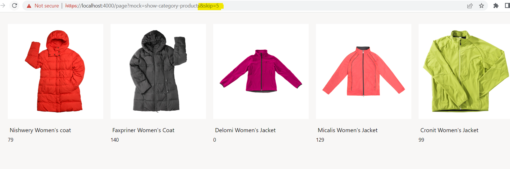

# Dynamics 365 Commerce - online SDK samples
## License
License is listed in the [LICENSE](./LICENSE) file.

# Sample - Call data action in module

## Overview

In this sample, we will learn how to call a data action from a module with cache settings and pagination parameters.

## Starter kit license
License for starter kit is listed in the [LICENSE](./module-library/LICENSE) .

## Prerequisites
Follow the instructions mentioned in [document](https://docs.microsoft.com/en-us/dynamics365/commerce/e-commerce-extensibility/setup-dev-environment) to set up the development environment.

## Doc links
* [Data actions overview](https://docs.microsoft.com/en-us/dynamics365/commerce/e-commerce-extensibility/data-actions)
* [Data action cache](https://learn.microsoft.com/en-us/dynamics365/commerce/e-commerce-extensibility/data-action-cache)

### 1. Use CLI command to create a new module

Use the CLI command: ```yarn msdyn365 add-module show-category-products``` to create a module called **show-category-products**. The new module will be created under the **\src\modules** directory.

### 2. Category Products data action

We will first create get-category-products data action. To create a new data action, you can run the below CLI, which will create a **get-category-products.action.ts** data action file in **\src\actions** folder

`yarn msdyn365 add-data-action get-category-products`

### Pagination by calling data action from module

To enable pagination, the data action needs the following two parameters: **Top** and **Skip**. In our sample, the paging properties **Top** and **Skip** have been set as shown below. To set **Top**, we will need to use the **itemsPerPage** config property.

```typescript
    // Set Top
    if (input.queryResultSettings.Paging && input.itemsPerPage) {
        input.queryResultSettings.Paging.Top = input.itemsPerPage || 1;
    }

    // Set Skip
    if (input.queryResultSettings.Paging && ctx.requestContext.query && ctx.requestContext.query.skip) {
        input.queryResultSettings.Paging.Skip = +ctx.requestContext.query.skip;
    }
```
### Caching data action response
A data action can save data in either the request or application cache, based on its action input. The dataCacheType property of IActionInput enables the underlying action runtime to make this decision on the action's behalf. By default, the action responses go into the request cache. For more details, please refer this document [Data action cache](https://learn.microsoft.com/en-us/dynamics365/commerce/e-commerce-extensibility/data-action-cache).

The cache object type defines the name of the cache object. In this sample, the data action cache object type has been set as below in this file **\src\modules\show-category-products\actions\get-category-products.action.ts**

```typescript
public getCacheObjectType = (): string => 'CategoryProducts';
```

The cache type defines the type of caching like application, request, instance, and none. In this sample, the data action cache type has been set as below in this file **\src\modules\show-category-products\actions\get-category-products.action.ts**

```typescript
public dataCacheType = (): CacheType => 'request';
```

The cache key is used to capture data based on the unique key. For example, the cache key can be different based on locale. In our sample, the cache key has been set as below in **\src\modules\custom-search-result-container-plp\actions\actions\base-collection-action.ts**

```typescript
public getCacheKey = () => buildCacheKey(`Category-${this.categoryId}`, this.apiSettings);
```

Below is the data action code to get the category products list. You can copy the code into the **\src\actions\get-category-products.action.ts** file.

```typescript
/*!
 * Copyright (c) Microsoft Corporation.
 * All rights reserved. See LICENSE in the project root for license information.
 */

import * as Msdyn365 from '@msdyn365-commerce/core';
import { IQueryResultSettings, ProductSearchResult, ProductSearchCriteria, CacheType } from '@msdyn365-commerce/retail-proxy';
import { searchByCriteriaAsync } from '@msdyn365-commerce/retail-proxy/dist/DataActions/ProductsDataActions.g';
import { buildCacheKey, QueryResultSettingsProxy } from '@msdyn365-commerce-modules/retail-actions';
import { createObservableDataAction, ICommerceApiSettings } from '@msdyn365-commerce/core';
/**
 * GetCategoryProducts Input Action
 */
export class GetCategoryProductsInput implements Msdyn365.IActionInput {
    public categoryId: number;
    public itemsPerPage: number;
    public queryResultSettings: IQueryResultSettings;
    private readonly apiSettings: ICommerceApiSettings;
    public constructor(
        categoryId: number,
        itemsPerPage: number,
        queryResultSettings: IQueryResultSettings,
        apiSettings: ICommerceApiSettings
    ) {
        this.categoryId = categoryId;
        this.itemsPerPage = itemsPerPage;
        this.queryResultSettings = queryResultSettings;
        this.apiSettings = apiSettings;
    }

    // TODO: Determine if the results of this get action should cache the results and if so provide
    // a cache object type and an appropriate cache key
    public getCacheKey = () => buildCacheKey(`Category-${this.categoryId}`, this.apiSettings);
    public getCacheObjectType = () => 'CategoryProducts';
    public dataCacheType = (): CacheType => 'request';
}

/**
 * TODO: Use this function to create the input required to make the action call
 */
const createInput = (args: Msdyn365.ICreateActionContext<{ categoryId: number; itemsPerPage: number }>): Msdyn365.IActionInput => {
    const queryResultSettings = QueryResultSettingsProxy.fromInputData(args).QueryResultSettings;
    return new GetCategoryProductsInput(
        args.config?.categoryId || 0,
        args.config?.itemsPerPage || 0,
        queryResultSettings,
        args.requestContext.apiSettings
    );
};

/**
 * TODO: Use this function to call your action and process the results as needed
 */

export async function getCategoryProducts(input: GetCategoryProductsInput, ctx: Msdyn365.IActionContext): Promise<ProductSearchResult[]> {
    const searchCriteriaInput: ProductSearchCriteria = {};
    searchCriteriaInput.Context = { ChannelId: ctx.requestContext.apiSettings.channelId, CatalogId: 0 };
    searchCriteriaInput.CategoryIds = [input.categoryId || 0];

    // Set Top
    if (input.queryResultSettings.Paging && input.itemsPerPage) {
        input.queryResultSettings.Paging.Top = input.itemsPerPage || 1;
    }

    // Set Skip
    if (input.queryResultSettings.Paging && ctx.requestContext.query && ctx.requestContext.query.skip) {
        input.queryResultSettings.Paging.Skip = +ctx.requestContext.query.skip;
    }

    const result: ProductSearchResult[] = await searchByCriteriaAsync(
        {
            callerContext: ctx,
            queryResultSettings: input.queryResultSettings
        },
        searchCriteriaInput
    );
    return result;
}

export default createObservableDataAction({
    action: <Msdyn365.IAction<ProductSearchResult[]>>getCategoryProducts,
    id: 'GetCategoryProducts',
    input: createInput
});

```

### 3. Add configuration properties into the module definition file

Copy the following code into **\src\modules\show-category-products\show-category-products.definition.json** to create a set of configuration properties.

```json
{
    "$type": "contentModule",
    "friendlyName": "show-category-products",
    "name": "show-category-products",
    "description": "Shows products of based on category id",
    "categories": ["show-category-products"],
    "dataActions": {},
    "config": {
        "categoryId": {
            "friendlyName": "Category id",
            "description": "Category id",
            "type": "number",
            "scope": "module",
            "required": true
        },
        "itemsPerPage": {
            "friendlyName": "Items per page",
            "description": "Number of items to be displayed per page",
            "type": "number",
            "scope": "module",
            "required": true
        }
    }
}

```

### 4. Add module React code to directly call data action on module

Copy the below code to the modules file at **\src\modules\show-category-products\show-category-products.tsx**.
In this file, **getCategoryProducts** and **GetCategoryProductsInput** are being imported from **get-category-products.action** data action. **getCategoryProducts** is called directly in this module file.

```typescript
/*!
 * Copyright (c) Microsoft Corporation.
 * All rights reserved. See LICENSE in the project root for license information.
 */

import * as React from 'react';

import { QueryResultSettingsProxy } from '@msdyn365-commerce-modules/retail-actions';
import { ProductSearchResult } from '@msdyn365-commerce/retail-proxy';
import { IShowCategoryProductsProps } from './show-category-products.props.autogenerated';
import { getCategoryProducts, GetCategoryProductsInput } from '../../actions/get-category-products.action';
export interface IShowCategoryProductsViewProps extends IShowCategoryProductsProps<{}> {
    products: ProductSearchResult[] | undefined;
}

/**
 *
 * ShowCategoryProducts component
 * @extends {React.PureComponent<IShowCategoryProductsProps>}
 */

export interface IShowCategoryState {
    categoryProducts: ProductSearchResult[] | undefined;
}

class ShowCategoryProducts extends React.PureComponent<IShowCategoryProductsProps<{}>, IShowCategoryState> {
    public categoryProducts: ProductSearchResult[] | undefined;
    constructor(props: IShowCategoryProductsProps<{}>) {
        super(props);
        this.state = { categoryProducts: [] };
    }

    public async componentDidMount(): Promise<void> {
        const { categoryId, itemsPerPage } = this.props.config;
        const input: GetCategoryProductsInput = new GetCategoryProductsInput(
            categoryId,
            itemsPerPage,
            QueryResultSettingsProxy.getPagingFromInputDataOrDefaultValue(this.props.context.actionContext),
            this.props.context.request.apiSettings
        );
        const categoryProducts = await getCategoryProducts(input, this.props.context.actionContext);
        this.setState({ categoryProducts: categoryProducts });
    }

    public render(): JSX.Element | null {
        const products = this.state.categoryProducts;
        const ShowCategoryViewProps = {
            ...this.props,
            products: products
        };

        return this.props.renderView(ShowCategoryViewProps);
    }
}

export default ShowCategoryProducts;

```

### 5. Add module view code
The module view code is responsible for generating the module's HTML. Add the below code to the module view file **\src\modules\show-category-products\show-category-products.view.tsx**.

```typescript
/*!
 * Copyright (c) Microsoft Corporation.
 * All rights reserved. See LICENSE in the project root for license information.
 */

import { ProductSearchResult } from '@msdyn365-commerce/retail-proxy';
import * as React from 'react';
import { generateImageUrl } from '@msdyn365-commerce-modules/retail-actions';
import { IShowCategoryProductsViewProps } from './show-category-products';

export default (props: IShowCategoryProductsViewProps) => {
    const { products } = props;
    if (products && products.length > 0) {
        return (
            <div className='ms-search-result-container__Products'>
                <ul className='list-unstyled'>
                    {products.map((product: ProductSearchResult, index: number) => (
                        <li className='ms-product-search-result__item' key={index}>
                            
                            <h4 className='msc-product__title'>{product.Name}</h4>
                            <span className='msc-price__price'>{product.BasePrice}</span>
                        </li>
                    ))}
                </ul>
            </div>
        );
    }
    return null;
};

```


### 6. Build and test module

The sample can now be tested in a web browser using the `yarn start` command at sample root level.

### 7. Test by using mock file

Please refer to [show-category-products.json page mock](src/pageMocks/show-category-products.json) under **src/pageMocks/**.

To test the module, use a browser and navigate to http://localhost:4000/page?mock=show-category-products&skip=5. You can verify that **itemsPerPage**  gets passed as a config parameter and the **Skip** parameter is taken from **queryResultSettings**.



### 8. Test Integration test case

After the sample is run successfully, the integration test case for the sample can be tested in a browser using below steps.

- Set path to "Call data action in module" sample level in command prompt and run `yarn testcafe chrome .\test\show-category-products.test.tsx -s .\` command.

- Ensure that testcafe is added globally to run test case.

## Third party Image and Video Usage restrictions

The software may include third party images and videos that are for personal use only and may not be copied except as provided by Microsoft within the demo websites. You may install and use an unlimited number of copies of the demo websites., You may not publish, rent, lease, lend, or redistribute any images or videos without authorization from the rights holder, except and only to the extent that the applicable copyright law expressly permits doing so.