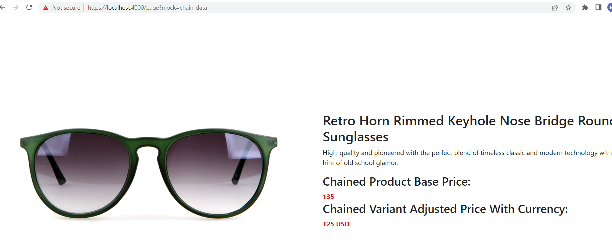

# Dynamics 365 Commerce - online training samples

## License

License is listed in the [LICENSE](./LICENSE) file.

# Sample - Chain data actions

## Overview

To create a maintainable and compact codebase, you will often need a suite of composable data actions that can easily use each another to create more complex code flows. The Microsoft Dynamics 365 Commerce Online Software Development Kit (SDK) lets you seamlessly chain data actions but still provide all the out-of-box benefits of the data action architecture (caching, batching, and deduplicating). In this sample you will learn how to chain two data actions.

## Doc links

-   [Chain data actions](https://learn.microsoft.com/en-us/dynamics365/commerce/e-commerce-extensibility/chain-data-actions)

## Starter kit license

License for starter kit is listed in the [LICENSE](./module-library/LICENSE) .

## Prerequisites

Follow the instructions mentioned in [document](https://docs.microsoft.com/en-us/dynamics365/commerce/e-commerce-extensibility/setup-dev-environment) to set up the development environment.

## Detailed Steps

In this sample we will chain product information data action with product variant data action.

### 1. Product details data action

We will first create get-product data action. To create a new data action, you can run the below CLI, which will create a **get-product.action.ts** data action file in **\src\actions** folder

`yarn msdyn365 add-data-action get-product`

Below is the data action code to get the product information. You can copy the code into the **\src\actions\get-product.action.ts** file.

```typescript
/*!
 * Copyright (c) Microsoft Corporation.
 * All rights reserved. See LICENSE in the project root for license information.
 */

import {
    CacheType,
    createObservableDataAction,
    getCatalogId,
    IAction,
    IActionContext,
    IActionInput,
    IAny,
    ICreateActionContext,
    IGeneric,
    IRequestContext
} from '@msdyn365-commerce/core';
import { SimpleProduct } from '@msdyn365-commerce/retail-proxy/dist/Entities/CommerceTypes.g';
import { ProductsDataActions } from '@msdyn365-commerce/retail-proxy';

import { QueryResultSettingsProxy, getSelectedProductIdFromActionInput } from '@msdyn365-commerce-modules/retail-actions';

/**
 * Product Input.
 */
export class ProductInput implements IActionInput {
    public productId: number;

    public channelId?: number;

    public catalogId?: number;

    public constructor(productId: number | string, channelId?: number, requestContext?: IRequestContext, catalogId?: number) {
        this.productId = +productId;
        this.channelId = channelId ?? 0;
        this.catalogId = catalogId;

        if (requestContext && catalogId === undefined) {
            this.catalogId = getCatalogId(requestContext);
        }
    }

    /**
     * Property to get cache key.
     * @returns Cache object name.
     */
    public getCacheKey = (): string => 'getProductDetail';

    /**
     * Property to get cache object type.
     * @returns Cache object type.
     */
    public getCacheObjectType = (): string => 'FeatureProduct';

    /**
     * Property to get data cache type.
     * @returns Data cache type.
     */
    public dataCacheType = (): CacheType => 'none';
}

/**
 * Creates the input required to make the retail api call.
 * @param inputData
 */
export const createSimpleProductsInput = (inputData: ICreateActionContext<IGeneric<IAny>>): IActionInput => {
    let productId: any = getSelectedProductIdFromActionInput(inputData);
    return new ProductInput(productId, undefined, inputData.requestContext);
};

/**
 * Calls the Retail API and returns the product based on the passed ProductInput.
 * @param inputs
 * @param ctx
 */
export async function getSimpleProductsAction(inputs: ProductInput, ctx: IActionContext): Promise<SimpleProduct> {
    const result = await ProductsDataActions.getByIdsAsync(
        {
            callerContext: ctx,
            queryResultSettings: QueryResultSettingsProxy.getPagingFromInputDataOrDefaultValue(ctx)
        },
        inputs.channelId || 0,
        [inputs.productId],
        null,
        inputs.catalogId ?? 0
    );
    return result[0];
}

export default createObservableDataAction({
    id: '@msdyn365-commerce-modules/retail-actions/get-simple-products',
    action: <IAction<SimpleProduct>>getSimpleProductsAction,
    input: createSimpleProductsInput
});
```

### 2. Product variant data action

We will then create get-variant-price data action. To create a new data action, you can run the below CLI, which will create a **get-variant-price.action.ts** data action file in **\src\actions** folder.

`yarn msdyn365 add-data-action get-variant-price`

Below is the data action code to get the product variant information. You can copy the code into the **\src\actions\get-variant-price.action.ts** file.

```typescript
/*!
 * Copyright (c) Microsoft Corporation.
 * All rights reserved. See LICENSE in the project root for license information.
 */

import {
    CacheType,
    createObservableDataAction,
    getCatalogId,
    IAction,
    IActionContext,
    IActionInput,
    IAny,
    ICreateActionContext,
    IGeneric
} from '@msdyn365-commerce/core';
import { getCartFromCustomer } from '@msdyn365-commerce/global-state';
import { getActivePricesAsync } from '@msdyn365-commerce/retail-proxy/dist/DataActions/ProductsDataActions.g';
import {
    AffiliationLoyaltyTier,
    ProductPrice,
    ProjectionDomain,
    SimpleProduct
} from '@msdyn365-commerce/retail-proxy/dist/Entities/CommerceTypes.g';

import { getSelectedProductIdFromActionInput, getSelectedVariant, SelectedVariantInput } from '@msdyn365-commerce-modules/retail-actions';
import { ArrayExtensions, QueryResultSettingsProxy } from '@msdyn365-commerce-modules/retail-actions';

/**
 * Input class for the GetVariantPrice Data Action.
 */
export class PriceForSelectedVariantInput implements IActionInput {
    public productId: number;

    public channelId: number;

    public selectedProduct: SimpleProduct | undefined;

    public customerId?: string;

    public constructor(productId: number, channelId: number, selectedProduct?: SimpleProduct, customerId?: string) {
        this.productId = productId;
        this.channelId = channelId;
        this.selectedProduct = selectedProduct;
        this.customerId = customerId ?? '';
    }

    public getCacheKey = (): string => 'PriceForSelectedVariant';

    public getCacheObjectType = (): string => 'Price';

    public dataCacheType = (): CacheType => 'none';
}

/**
 * The createInput method for the GetVariantPriceDataAction.
 * @param inputData - The input data for the createInput method.
 * @returns The PriceForSelectedVariantInput.
 */
export const createGetVariantPriceInput = (inputData: ICreateActionContext<IGeneric<IAny>>): PriceForSelectedVariantInput => {
    const productId = getSelectedProductIdFromActionInput(inputData);

    if (productId) {
        return new PriceForSelectedVariantInput(+productId, +inputData.requestContext.apiSettings.channelId, undefined);
    }
    throw new Error('Unable to create PriceForSelectedVariantInput, no productId found on module config or query');
};

/**
 * The Action Method for the GetVariantPrice Data Action
 * Pulls the currently selected variant from the cache using the getSelectedVariant data action, and gets it's current contextual price
 * via the getActivePrice RetailServer API.
 * @param input - The input.
 * @param ctx - The ctx.
 * @returns The Promise<ProductPrice | null>.
 */
export async function getVariantPriceAction(input: PriceForSelectedVariantInput, ctx: IActionContext): Promise<ProductPrice | null> {
    let affiliations: AffiliationLoyaltyTier[] | undefined = [];
    if (ctx.requestContext.user.isAuthenticated) {
        const cart = await getCartFromCustomer(ctx);
        affiliations = cart?.AffiliationLines;
    }
    return Promise.resolve()
        .then(() => {
            const activeProduct: SimpleProduct | undefined = input.selectedProduct;

            if (!activeProduct) {
                const selectedVariantInput = new SelectedVariantInput(
                    input.productId,
                    input.channelId,
                    undefined,
                    undefined,
                    ctx.requestContext
                );

                return getSelectedVariant(selectedVariantInput, ctx);
            }

            return activeProduct;
        })
        .then<ProductPrice | null>(async (productResult: SimpleProduct | null) => {
            const catalogId = getCatalogId(ctx.requestContext);
            const projectDomain: ProjectionDomain = {
                ChannelId: +ctx.requestContext.apiSettings.channelId,
                CatalogId: catalogId
            };

            const activeProduct: SimpleProduct | undefined = productResult as SimpleProduct | undefined;
            if (activeProduct) {
                return getActivePricesAsync(
                    { callerContext: ctx, queryResultSettings: QueryResultSettingsProxy.getPagingFromInputDataOrDefaultValue(ctx) },
                    projectDomain,
                    [activeProduct.RecordId],
                    new Date(),
                    input.customerId,
                    affiliations,
                    true
                ).then((productPrices: ProductPrice[]) => {
                    if (!ArrayExtensions.hasElements(productPrices)) {
                        throw new Error('[getVariantPriceAction]Invalid response recieved from getActivePricesAsync');
                    }
                    return productPrices[0];
                });
            }

            return null;
        })
        .catch((error: Error) => {
            ctx.trace(error.message);
            ctx.telemetry.exception(error);
            ctx.telemetry.debug('[getVariantPriceAction]Error executing action');
            throw new Error('[getVariantPriceAction]Error executing action');
        });
}

export const getVariantPriceActionDataAction = createObservableDataAction({
    id: '@msdyn365-commerce-modules/retail-actions/get-price-for-selected-variant',
    action: getVariantPriceAction as IAction<ProductPrice | null>,
    input: createGetVariantPriceInput
});

export default getVariantPriceActionDataAction;
```

### 3. Chain both data actions.

Now that you have actions for getting the product data and the Variant details of a product, you can create a new chain data action. Chain data actions are just data actions that invoke other data actions as part of their execution.

We will now create chain data action. To create a new data action, you can run the below CLI, which will create a **get-product-with-variant-price.action.ts** data action file in **\src\actions** folder

`yarn msdyn365 add-data-action get-product-with-variant-price`

Below is the data action code to get the product details with variant information. You can copy the code into the **\src\actions\get-product-with-variant-price.action.ts** file.

```typescript
/*!
 * Copyright (c) Microsoft Corporation.
 * All rights reserved. See LICENSE in the project root for license information.
 */

import * as Msdyn365 from '@msdyn365-commerce/core';
import { ProductPrice, SimpleProduct } from '@msdyn365-commerce/retail-proxy/dist/Entities/CommerceTypes.g';
import getSimpleProductsAction, { ProductInput } from './get-product';
import { getSelectedProductIdFromActionInput } from '@msdyn365-commerce-modules/retail-actions';

import {
    CacheType,
    getCatalogId,
    IAction,
    IActionContext,
    IAny,
    ICreateActionContext,
    IGeneric,
    IRequestContext
} from '@msdyn365-commerce/core';
import getVariantPrice from './get-variant-price';

export interface SimpleProductWithPrice extends SimpleProduct {
    variantPrice?: ProductPrice | null;
}

/**
 * ChainDataAction Input Action
 */
export class ChainDataActionInput implements Msdyn365.IActionInput {
    public productId: number;

    public channelId: number;

    public catalogId?: number;

    public constructor(productId: number | string, channelId?: number, requestContext?: IRequestContext, catalogId?: number) {
        this.productId = +productId;
        this.channelId = channelId ?? 0;
        this.catalogId = catalogId;

        if (requestContext && catalogId === undefined) {
            this.catalogId = getCatalogId(requestContext);
        }
    }

    /**
     * Property to get cache key.
     * @returns Cache object name.
     */
    public getCacheKey = (): string => 'chainDataActionInput';

    /**
     * Property to get cache object type.
     * @returns Cache object type.
     */
    public getCacheObjectType = (): string => 'ChainProduct';

    /**
     * Property to get data cache type.
     * @returns Data cache type.
     */
    public dataCacheType = (): CacheType => 'none';
}

export const createChainDataActionInput = (inputData: ICreateActionContext<IGeneric<IAny>>): Msdyn365.IActionInput => {
    let productId: any = getSelectedProductIdFromActionInput(inputData);
    return new ProductInput(productId, undefined, inputData.requestContext);
};
export async function getProductWithVariantPriceAction(
    input: ProductInput,
    ctx: IActionContext
): Promise<SimpleProductWithPrice | undefined> {
    // First we get the product
    let product: SimpleProductWithPrice;
    const pro = new ProductInput(input.productId, undefined, ctx.requestContext, 0);
    try {
        product = await getSimpleProductsAction(pro, ctx);
        // If we successfully get the product, then we try to get its availability information.
        if (product) {
            // Get the price information
            product.variantPrice = await getVariantPrice(input, ctx);
            return product as SimpleProductWithPrice;
        } else {
            return <SimpleProductWithPrice>{};
        }
    } catch (err) {}
    return undefined;
}

export default Msdyn365.createObservableDataAction({
    id: 'ChainDataAction',
    action: getProductWithVariantPriceAction as IAction<SimpleProductWithPrice | null>,
    input: createChainDataActionInput
});
```

### 4. Rendering data on View.

Use the CLI command: `yarn msdyn365 add-module product-feature` to create a module called **product-feature**. The new module will be created under the **\src\modules** directory.

Copy the following json into the **\src\modules\product-feature\product-feature.definition.json** file to create a set of configuration properties.

```json
{
    "$type": "contentModule",
    "friendlyName": "Product Feature",
    "name": "product-feature",
    "description": "Feature module used to highlight a product.",
    "categories": [
        "storytelling"
    ],
    "tags": [
        ""
    ],
    "dataActions": {},
    "config": {
        "recordId": {
            "friendlyName": "recordId",
            "description": "Id for the module",
            "type": "string",
            "default": ""
        },
        "imageAlignment": {
            "friendlyName": "Image Alignment",
            "description": "Sets the desired alignment of the image, either left or right on the text.",
            "type": "string",
            "enum": {
                "left": "Left",
                "right": "Right"
            },
            "default": "left",
            "scope": "module",
            "group": "Layout Properties"
        },
        "productTitle": {
            "type": "string",
            "friendlyName": "Product Title",
            "description": "Product placement title"
        },
        "productDetails": {
            "type": "richText",
            "friendlyName": "Product Details",
            "description": "Rich text representing the featured product details"
        },
        "productImage": {
            "type": "image",
            "friendlyName": "Product Image",
            "description": "Image representing the featured product"
        },
        "buttonText": {
            "type": "string",
            "friendlyName": "Button Text",
            "description": "Text to show on the call to action button"
        }
    }
}
```

Copy the following typescript code into the **src\modules\product-feature\product-feature.tsx** file to get custom product with variant details using chaing data action.

```typescript
/*---------------------------------------------------------------------------------------------
 *  Copyright (c) Microsoft Corporation. All rights reserved.
 *  Licensed under the MIT License. See License.txt in the project root for license information.
 *--------------------------------------------------------------------------------------------*/

import * as React from 'react';

import { IProductFeatureData } from './product-feature.data';
import { imageAlignment, IProductFeatureProps } from './product-feature.props.autogenerated';
import { getProductWithVariantPriceAction, SimpleProductWithPrice } from '../../actions/chain-data-action';
import { ProductInput } from '../../actions/get-product';

export interface IProductFeatureViewProps extends IProductFeatureProps<IProductFeatureData> {
    productVariantDetail: SimpleProductWithPrice;
    productName: string;
    productInfo: string;
    productImageUrl: string;
    productPrice: string;
    buttonInfo: string;
    alignment: imageAlignment;
}

export interface IProductFeatureState {
    products?: SimpleProductWithPrice;
}
/**
 *
 * ProductFeature component
 * @extends {React.PureComponent<IProductFeatureProps<IProductFeatureData>>}
 */
class ProductFeature extends React.PureComponent<IProductFeatureProps<IProductFeatureData>, IProductFeatureState> {
    public constructor(props: IProductFeatureProps<IProductFeatureData>) {
        super(props);
        this.state = {};
    }
    public async componentDidMount(): Promise<void> {
        const productDetail = await getProductWithVariantPriceAction(
            new ProductInput(this.props.config.recordId || 0),
            this.props.context.actionContext
        );
        this.setState({
            products: productDetail
        });
    }
    public render(): JSX.Element | null {
        const { config } = this.props;

        // set default product info values
        const ProductName = config.productTitle ? config.productTitle : 'No product name defined';
        const ProductInfo = config.productDetails ? config.productDetails.toString() : 'No product details defined';
        const ProductImageUrl = config.productImage ? config.productImage.src : '';
        const ButtonInfo = config.buttonText ? config.buttonText : 'No button text defined';
        const ProductPrice = '$129';

        const ProductFeatureViewProps = {
            ...this.props,
            productVariantDetail: this.state.products,
            productName: ProductName,
            productInfo: ProductInfo,
            productImageUrl: ProductImageUrl,
            productPrice: ProductPrice,
            buttonInfo: ButtonInfo,
            alignment: config.imageAlignment
        };

        return this.props.renderView(ProductFeatureViewProps);
    }
}

export default ProductFeature;
```

Copy the following typescript code into the **src\modules\product-feature\product-feature.view.tsx** to display the result obtained from chained data action.

```typescript

/*!
 * Copyright (c) Microsoft Corporation.
 * All rights reserved. See LICENSE in the project root for license information.
 */

import * as React from 'react';
import { SimpleProductWithPrice } from '../../actions/chain-data-action';
import { IProductFeatureViewProps } from './product-feature';
import { imageAlignment } from './product-feature.props.autogenerated';

const _renderImage = (productImageUrl: string, productName: string): JSX.Element => {
    return ;
};

const _renderInfo = (
    productName: string,
    productInfo: string,
    productPrice: string,
    buttonInfo: string,
    product: SimpleProductWithPrice
): JSX.Element => {
    return (
        <div className='container'>
            <h2 className=''>{productName}</h2>
            <p>{productInfo}</p>
            <div className='product_base'>
                {
                    <h3>
                        <span>Chained Product Base Price: </span>
                    </h3>
                }
                <b>
                    <span className='chain_basePrice product-feature-title'> {product?.variantPrice?.BasePrice}</span>
                </b>
            </div>
            <div className='product_variant'>
                {
                    <h3>
                        <span>Chained Variant Adjusted Price With Currency: </span>
                    </h3>
                }
                <b>
                    <span className='chain_variantPrice product-feature-title'>
                        {product?.variantPrice?.AdjustedPrice} {product?.variantPrice?.CurrencyCode}
                    </span>
                </b>
            </div>
        </div>
    );
};

export default (props: IProductFeatureViewProps) => {
    const { productName, productInfo, productImageUrl, productPrice, buttonInfo, alignment, productVariantDetail } = props;

    let left;
    let right;

    if (alignment === imageAlignment.left) {
        left = _renderImage(productImageUrl, productName);
        right = _renderInfo(productName, productInfo, productPrice, buttonInfo, productVariantDetail);
    } else {
        right = _renderImage(productImageUrl, productName);
        left = _renderInfo(productName, productInfo, productPrice, buttonInfo, productVariantDetail);
    }

    return (
        <div className='row align-items-center'>
            <div className='col-sm-6'>{left}</div>
            <div className='col-sm-6'>{right}</div>
        </div>
    );
};

```

Copy the following json code into the **src\pageMocks\chain-data.json** to create mock file.

```json
{
    "exception": null,
    "pageRoot": {
        "typeName": "core-root",
        "id": "core-root_kdgzbmy",
        "friendlyName": "Core root 1",
        "config": {},
        "modules": {
            "body": [
                {
                    "id": "default-page_0",
                    "typeName": "default-page",
                    "config": { "pageTheme": "summer" },
                    "modules": {
                        "primary": [
                            {
                                "id": "ProductFeature__0",
                                "typeName": "product-feature",
                                "config": {
                                    "recordId":"68719493601",
                                    "imageAlignment": "left",
                                    "productTitle": "Retro Horn Rimmed Keyhole Nose Bridge Round Sunglasses",
                                    "productDetails": "High-quality and pioneered with the perfect blend of timeless classic and modern technology with hint of old school glamor.",
                                    "productImage": {
                                      "src": "https://bit.ly/33cMGxr",
                                      "altText": "Retro Horn Rimmed Keyhole Nose Bridge Round Sunglasses"
                                    },
                                    "buttonText": "Buy Now"
                                }
                            }
                        ]
                    }
                }
            ]
        }
    },
    "renderingContext": {
        "locale": "en-us",
        "urlTokens": { "itemId": "68719493601", "recordId": "68719493601", "pageType": "Product" },
        "apiSettings": {
            "baseUrl": "https://scu7aoxn5it31752957-rs.su.retail.test.dynamics.com/",
            "retailServerEndpointOverrideDomain": null,
            "channelId": 68719478279,
            "eCommerceChannelId": "rpbpwaytjjr",
            "eCommerceCrossChannelId": null,
            "catalogId": 0,
            "oun": "128",
            "baseImageUrl": "https://images-us-ppe.cms.dynamics365commerce.ms/cms/api/ksrwclmwmr/imageFileData/search?fileName=/",
            "ratingsReviewsEndpoint": "https://7ac8a7f2-0905-4a20-8440-74b674a2cddc.rnr-ppe.ms",
            "ratingsReviewsProxyEndpoint": "https://ring1tie.fabrikam.com/_msdyn365/rnr/",
            "rnr": {
                "id": "7ac8a7f2-0905-4a20-8440-74b674a2cddc",
                "url": "https://7ac8a7f2-0905-4a20-8440-74b674a2cddc.rnr-ppe.ms",
                "proxyUrl": "https://ring1tie.fabrikam.com/_msdyn365/rnr/"
            },
            "externalCmsBaseUrls": { "sitecore": "https://dynamics365-sandbox.stylelabs.io/api/public/content/ " }
        }
    }
}

```

### 5. Build and test module

The sample can now be tested in a web browser using the `yarn start` command at sample root level.

### 6. Test by using mock file

Go to browser and copy paste the URL https://localhost:4000/page?mock=chain-data, you should see the below page with details like **Chained Product Base Price** and **Chained Variant Adjusted Price With Currency**. These details are the results obtained from basic product information and the product's variant details from chain data action.



### 7. Test Integration test case

Integration test case for sample can be tested in browser using below steps

- Set path to "Chain data actions" sample level in command prompt and run `yarn testcafe chrome .\test\chain-data-action-tests.ts -s .\` command.

- ensure that testcafe is added globally to run test case.

## Third party Image and Video Usage restrictions

The software may include third party images and videos that are for personal use only and may not be copied except as provided by Microsoft within the demo websites. You may install and use an unlimited number of copies of the demo websites., You may not publish, rent, lease, lend, or redistribute any images or videos without authorization from the rights holder, except and only to the extent that the applicable copyright law expressly permits doing so.
```