# Dynamics 365 Commerce - online SDK samples
## License
License is listed in the [LICENSE](./LICENSE) file.

# Sample – Configure and enable connectors
This sample provided example on how to implement and configure the below list of connectors
 - Experimentation connector
 - Geo lookup connector
 - Segmentation connectors.

## Overview
This samples covers how to configure the experimentation, geo-lookup and segmentation connector files by implementing template test connectors. 

Connectors let you connect your Dynamics 365 Commerce site to external third-party services to perform tasks such as capturing analytics, logging, and experimenting. Some third-party service providers require a paid license for their service before it can be used. For more information, contact your service provider.

This sample will cover the below list of connector types:

- Experimentation Connector
- Geo lookup connector
- Segmentation connector

## Doc links
* [Configure and enable connectors](ttps://docs.microsoft.com/en-us/dynamics365/commerce/e-commerce-extensibility/connectors#connector-settings-file)

### Configure and enable connectors

- You can add connectors to your Commerce site by adding them as a dependency in your **package.json** file and direclty configure the connector setting file. See Example below:
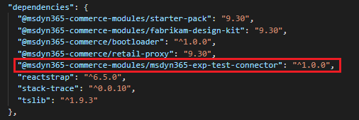

- Alternatively, you can implement them directly in your configuration package code under the \src\connectors directory.

### Reveiwing Connector settings file:
Before starting with configuration, lets review the connector.settings.json file: https://docs.microsoft.com/en-us/dynamics365/commerce/e-commerce-extensibility/connectors#connector-settings-file

# Configuring experimentation connector
## Detailed Steps

### 1. Configuring Experimentation connector.json file
A connector definition file is used to register and provide configuration metadata data to your application. This metadata includes the type of connector, the name of the connector, a description of the connector, and the configuration schema. The name of the connector definition file is in the format <CONNECTOR_NAME>.connector.json.

- Create a folder named **connectors** inside **src** directory level, if it doesn't exist.
- Create a folder named **exp-test-connector** (name is up to you) inside **src/connectors** directory.
- Create a **exp-test-connector.connector.json** file inside **src/connectors/exp-test-connector** directory.
- Copy the below inside **src/connectors/exp-test-connector/exp-test-connector.connector.json** file.

```json
{
    "$type": "experimentationConnector",
    "name": "exp-test-connector",
    "description": "Experimentation Test connector implementation",
    "connectorDomains": ["https://exp-test-connector.com"],
    "configSchema": {}
}
```

### 2. Configuring provider.ts file
An experimentation provider file is required to initialize a connector. It also enables the connector to interact with Commerce site builder to present a list of available experiments that are configured in your third-party experimentation service. The name of the provider file is in the format <CONNECTOR_NAME>.provider.ts.

- Create a new file named **exp-test-connector.provider.ts** file in **src/connectors/exp-test-connector** directory.

The provider file implements different interfaces which are helpful to initialize an experimentation connector.
More info on the interfaces can be found here: https://docs.microsoft.com/en-us/dynamics365/commerce/e-commerce-extensibility/connectors#provider-file

For this sample, we will be returning mock response from the provider file. However in the real world, you will be initializing and calling your third party connector to get the experiments response.

- Copy the below code in the src/connectors/exp-test-connector/exp-test-connector.provider.ts file

**Note** : We recommend you go over through all of the implemented functions in the below code.

```typescript
/* eslint-disable @typescript-eslint/no-explicit-any, max-lines */
import { IExperimentationProvider, IExperimentsResult, ISecretManager, IVariants, State } from '@msdyn365-commerce/core';
/**
 * A basic implementation of the ExperimentationProvider interface used for testing
 */
class ExpTestConnector implements IExperimentationProvider {
    private variantSet1: IVariants[] = [
        {
            variantId: 'var1',
            experimentId: 'expid1'
        },
        {
            variantId: 'var1',
            experimentId: 'expid4'
        },
        {
            variantId: 'var1',
            experimentId: 'expid6'
        },
        {
            variantId: 'var1',
            experimentId: 'expid7'
        },
        {
            variantId: 'var1',
            experimentId: 'expid8'
        },
        {
            variantId: 'var1',
            experimentId: 'expid9'
        },
        {
            variantId: 'var1',
            experimentId: 'expid10'
        },
        {
            variantId: 'var1',
            experimentId: 'expid11'
        },
        {
            variantId: 'var1',
            experimentId: 'expid12'
        }
    ];

    private variantSet2: IVariants[] = [
        {
            variantId: 'var2',
            experimentId: 'expid1'
        },
        {
            variantId: 'var2',
            experimentId: 'expid5'
        },
        {
            variantId: 'var2',
            experimentId: 'expid7'
        },
        {
            variantId: 'var2',
            experimentId: 'expid8'
        },
        {
            variantId: 'var2',
            experimentId: 'expid9'
        },
        {
            variantId: 'var2',
            experimentId: 'expid10'
        },
        {
            variantId: 'var2',
            experimentId: 'expid11'
        },
        {
            variantId: 'var2',
            experimentId: 'expid12'
        }
    ];

    private variantSet3: IVariants[] = [
        {
            variantId: 'var1',
            experimentId: 'expid5'
        },
        {
            variantId: 'var2',
            experimentId: 'expid13'
        },
        {
            variantId: 'var2',
            experimentId: 'expid14'
        },
        {
            variantId: 'var2',
            experimentId: 'expid15'
        },
        {
            variantId: 'var2',
            experimentId: 'expid16'
        },
        {
            variantId: 'var2',
            experimentId: 'expid17'
        },
        {
            variantId: 'var2',
            experimentId: 'expid18'
        },
        {
            variantId: 'var2',
            experimentId: 'expid19'
        },
        {
            variantId: 'var2',
            experimentId: 'expid20'
        },
        {
            variantId: 'var2',
            experimentId: 'expid21'
        },
        {
            variantId: 'var2',
            experimentId: 'expid22'
        },
        {
            variantId: 'var2',
            experimentId: 'expid23'
        },
        {
            variantId: 'var2',
            experimentId: 'expid24'
        },
        {
            variantId: 'var2',
            experimentId: 'expid25'
        }
    ];

    private variantSet4: IVariants[] = [
        {
            variantId: 'var1',
            experimentId: 'expid5'
        },
        {
            variantId: 'var1',
            experimentId: 'expid1'
        },
        {
            variantId: 'var1',
            experimentId: 'expid13'
        },
        {
            variantId: 'var1',
            experimentId: 'expid14'
        },
        {
            variantId: 'var1',
            experimentId: 'expid15'
        },
        {
            variantId: 'var1',
            experimentId: 'expid16'
        },
        {
            variantId: 'var1',
            experimentId: 'expid17'
        },
        {
            variantId: 'var1',
            experimentId: 'expid18'
        },
        {
            variantId: 'var1',
            experimentId: 'expid19'
        },
        {
            variantId: 'var1',
            experimentId: 'expid20'
        },
        {
            variantId: 'var1',
            experimentId: 'expid21'
        },
        {
            variantId: 'var1',
            experimentId: 'expid22'
        },
        {
            variantId: 'var1',
            experimentId: 'expid23'
        },
        {
            variantId: 'var1',
            experimentId: 'expid24'
        },
        {
            variantId: 'var1',
            experimentId: 'expid25'
        }
    ];

    public initialize(config: any, secretManager?: ISecretManager): Promise<boolean> {
        console.log(`exp-test-connector called with config: ${JSON.stringify(config)}`);
        return Promise.resolve(true);
    }

    public getConfigForClientSideInit(): Promise<any> {
        return Promise.resolve({});
    }
    public initializeClientSide(config: any): boolean {
        console.log(`Initialize client side called on exp-test-connector with config ${config}`);
        return true;
    }

    public getExperiments(): Promise<IExperimentsResult> {
        return Promise.resolve({
            name: 'exp-test-connector',
            experiments: [
                {
                    id: 'expid1',
                    friendlyName: 'experiment-1',
                    description: 'This is a exp-test-connector experiment',
                    type: 'A/B Test',
                    status: State.Running,
                    link: 'www.exp-test-connector/expid1',
                    variations: [
                        {
                            id: 'var1',
                            friendlyName: 'variant-1',
                            status: State.Active,
                            weight: '0.4'
                        },
                        {
                            id: 'var2',
                            friendlyName: 'variant-2',
                            status: State.Active,
                            weight: '0.4'
                        },
                        {
                            id: 'var3',
                            friendlyName: 'variant-3',
                            status: State.Draft,
                            weight: '0.2'
                        }
                    ],
                    createdDate: '05/01/2020',
                    lastModifiedDate: '05/01/2020',
                    lastModifiedBy: 'User 1'
                },
                {
                    id: 'expid2',
                    friendlyName: 'experiment-2',
                    description: 'This is a exp-test-connector experiment',
                    type: 'A/B Test',
                    status: State.Paused,
                    link: 'www.exp-test-connector/expid2',
                    variations: [
                        {
                            id: 'var3',
                            friendlyName: 'variant-3',
                            status: State.Paused,
                            weight: '1.0'
                        }
                    ],
                    createdDate: '05/01/2020',
                    lastModifiedDate: '05/01/2020',
                    lastModifiedBy: 'User 1'
                },
                {
                    id: 'expid3',
                    friendlyName: 'experiment-3',
                    description: 'This is a exp-test-connector experiment',
                    type: 'A/B Test',
                    status: State.Archived,
                    variations: [
                        {
                            id: 'var4',
                            friendlyName: 'variant-4',
                            status: State.Archived,
                            weight: '1.0'
                        }
                    ],
                    createdDate: '05/01/2020',
                    lastModifiedDate: '05/01/2020',
                    lastModifiedBy: 'User 1'
                },
                {
                    id: 'expid4',
                    friendlyName: 'experiment-4',
                    description: 'This is a exp-test-connector experiment',
                    type: 'A/B Test',
                    status: State.Running,
                    variations: [
                        {
                            id: 'var1',
                            friendlyName: 'variant-1',
                            status: State.Active,
                            weight: '0.4'
                        },
                        {
                            id: 'var2',
                            friendlyName: 'variant-2',
                            status: State.Active,
                            weight: '0.6'
                        }
                    ],
                    createdDate: '05/01/2020',
                    lastModifiedDate: '05/01/2020',
                    lastModifiedBy: 'User 1'
                },
                {
                    id: 'expid5',
                    friendlyName: 'experiment-5',
                    description: 'This is a exp-test-connector experiment',
                    type: 'A/B Test',
                    status: State.Running,
                    variations: [
                        {
                            id: 'var1',
                            friendlyName: 'variant-1',
                            status: State.Active,
                            weight: '0.4'
                        },
                        {
                            id: 'var2',
                            friendlyName: 'variant-2',
                            status: State.Active,
                            weight: '0.6'
                        }
                    ],
                    createdDate: '05/01/2020',
                    lastModifiedDate: '05/01/2020',
                    lastModifiedBy: 'User 1'
                },
                {
                    id: 'expid6',
                    friendlyName: 'experiment-6',
                    description: 'This is a exp-test-connector experiment',
                    type: 'A/B Test',
                    status: State.Running,
                    variations: [
                        {
                            id: 'var1',
                            friendlyName: 'variant-1',
                            status: State.Active,
                            weight: '0.4'
                        },
                        {
                            id: 'var2',
                            friendlyName: 'variant-2',
                            status: State.Active,
                            weight: '0.6'
                        }
                    ],
                    createdDate: '05/01/2020',
                    lastModifiedDate: '05/01/2020',
                    lastModifiedBy: 'User 1'
                },
                {
                    id: 'expid7',
                    friendlyName: 'experiment-7',
                    description: 'This is a exp-test-connector experiment',
                    type: 'A/B Test',
                    status: State.Running,
                    variations: [
                        {
                            id: 'var1',
                            friendlyName: 'variant-1',
                            status: State.Active,
                            weight: '0.4'
                        },
                        {
                            id: 'var2',
                            friendlyName: 'variant-2',
                            status: State.Active,
                            weight: '0.6'
                        }
                    ],
                    createdDate: '05/01/2020',
                    lastModifiedDate: '05/01/2020',
                    lastModifiedBy: 'User 1'
                },
                {
                    id: 'expid8',
                    friendlyName: 'experiment-8',
                    description: 'This is a exp-test-connector experiment',
                    type: 'A/B Test',
                    status: State.Running,
                    variations: [
                        {
                            id: 'var1',
                            friendlyName: 'variant-1',
                            status: State.Active,
                            weight: '0.4'
                        },
                        {
                            id: 'var2',
                            friendlyName: 'variant-2',
                            status: State.Active,
                            weight: '0.6'
                        }
                    ],
                    createdDate: '05/01/2020',
                    lastModifiedDate: '05/01/2020',
                    lastModifiedBy: 'User 1'
                },
                {
                    id: 'expid9',
                    friendlyName: 'experiment-9',
                    description: 'This is a exp-test-connector experiment',
                    type: 'A/B Test',
                    status: State.Running,
                    variations: [
                        {
                            id: 'var1',
                            friendlyName: 'variant-1',
                            status: State.Active,
                            weight: '0.4'
                        },
                        {
                            id: 'var2',
                            friendlyName: 'variant-2',
                            status: State.Active,
                            weight: '0.6'
                        }
                    ],
                    createdDate: '05/01/2020',
                    lastModifiedDate: '05/01/2020',
                    lastModifiedBy: 'User 1'
                },
                {
                    id: 'expid10',
                    friendlyName: 'experiment-10',
                    description: 'This is a exp-test-connector experiment',
                    type: 'A/B Test',
                    status: State.Running,
                    variations: [
                        {
                            id: 'var1',
                            friendlyName: 'variant-1',
                            status: State.Active,
                            weight: '0.4'
                        },
                        {
                            id: 'var2',
                            friendlyName: 'variant-2',
                            status: State.Active,
                            weight: '0.6'
                        }
                    ],
                    createdDate: '05/01/2020',
                    lastModifiedDate: '05/01/2020',
                    lastModifiedBy: 'User 1'
                },
                {
                    id: 'expid11',
                    friendlyName: 'experiment-11',
                    description: 'This is a exp-test-connector experiment',
                    type: 'A/B Test',
                    status: State.Running,
                    variations: [
                        {
                            id: 'var1',
                            friendlyName: 'variant-1',
                            status: State.Active,
                            weight: '0.4'
                        },
                        {
                            id: 'var2',
                            friendlyName: 'variant-2',
                            status: State.Active,
                            weight: '0.6'
                        }
                    ],
                    createdDate: '05/01/2020',
                    lastModifiedDate: '05/01/2020',
                    lastModifiedBy: 'User 1'
                },
                {
                    id: 'expid12',
                    friendlyName: 'experiment-12',
                    description: 'This is a exp-test-connector experiment',
                    type: 'A/B Test',
                    status: State.Running,
                    variations: [
                        {
                            id: 'var1',
                            friendlyName: 'variant-1',
                            status: State.Active,
                            weight: '0.4'
                        },
                        {
                            id: 'var2',
                            friendlyName: 'variant-2',
                            status: State.Active,
                            weight: '0.6'
                        }
                    ],
                    createdDate: '05/01/2020',
                    lastModifiedDate: '05/01/2020',
                    lastModifiedBy: 'User 1'
                },
                {
                    id: 'expid13',
                    friendlyName: 'experiment-13',
                    description: 'This is a exp-test-connector experiment',
                    type: 'A/B Test',
                    status: State.Running,
                    variations: [
                        {
                            id: 'var1',
                            friendlyName: 'variant-1',
                            status: State.Active,
                            weight: '0.4'
                        },
                        {
                            id: 'var2',
                            friendlyName: 'variant-2',
                            status: State.Active,
                            weight: '0.6'
                        }
                    ],
                    createdDate: '05/01/2020',
                    lastModifiedDate: '05/01/2020',
                    lastModifiedBy: 'User 1'
                },
                {
                    id: 'expid14',
                    friendlyName: 'experiment-14',
                    description: 'This is a exp-test-connector experiment',
                    type: 'A/B Test',
                    status: State.Running,
                    variations: [
                        {
                            id: 'var1',
                            friendlyName: 'variant-1',
                            status: State.Active,
                            weight: '0.4'
                        },
                        {
                            id: 'var2',
                            friendlyName: 'variant-2',
                            status: State.Active,
                            weight: '0.6'
                        }
                    ],
                    createdDate: '05/01/2020',
                    lastModifiedDate: '05/01/2020',
                    lastModifiedBy: 'User 1'
                },
                {
                    id: 'expid15',
                    friendlyName: 'experiment-15',
                    description: 'This is a exp-test-connector experiment',
                    type: 'A/B Test',
                    status: State.Running,
                    variations: [
                        {
                            id: 'var1',
                            friendlyName: 'variant-1',
                            status: State.Active,
                            weight: '0.4'
                        },
                        {
                            id: 'var2',
                            friendlyName: 'variant-2',
                            status: State.Active,
                            weight: '0.6'
                        }
                    ],
                    createdDate: '05/01/2020',
                    lastModifiedDate: '05/01/2020',
                    lastModifiedBy: 'User 1'
                },
                {
                    id: 'expid16',
                    friendlyName: 'experiment-16',
                    description: 'This is a exp-test-connector experiment',
                    type: 'A/B Test',
                    status: State.Running,
                    variations: [
                        {
                            id: 'var1',
                            friendlyName: 'variant-1',
                            status: State.Active,
                            weight: '0.4'
                        },
                        {
                            id: 'var2',
                            friendlyName: 'variant-2',
                            status: State.Active,
                            weight: '0.6'
                        }
                    ],
                    createdDate: '05/01/2020',
                    lastModifiedDate: '05/01/2020',
                    lastModifiedBy: 'User 1'
                },
                {
                    id: 'expid17',
                    friendlyName: 'experiment-17',
                    description: 'This is a exp-test-connector experiment',
                    type: 'A/B Test',
                    status: State.Running,
                    variations: [
                        {
                            id: 'var1',
                            friendlyName: 'variant-1',
                            status: State.Active,
                            weight: '0.4'
                        },
                        {
                            id: 'var2',
                            friendlyName: 'variant-2',
                            status: State.Active,
                            weight: '0.6'
                        }
                    ],
                    createdDate: '05/01/2020',
                    lastModifiedDate: '05/01/2020',
                    lastModifiedBy: 'User 1'
                },
                {
                    id: 'expid18',
                    friendlyName: 'experiment-18',
                    description: 'This is a exp-test-connector experiment',
                    type: 'A/B Test',
                    status: State.Running,
                    variations: [
                        {
                            id: 'var1',
                            friendlyName: 'variant-1',
                            status: State.Active,
                            weight: '0.4'
                        },
                        {
                            id: 'var2',
                            friendlyName: 'variant-2',
                            status: State.Active,
                            weight: '0.6'
                        }
                    ],
                    createdDate: '05/01/2020',
                    lastModifiedDate: '05/01/2020',
                    lastModifiedBy: 'User 1'
                },
                {
                    id: 'expid19',
                    friendlyName: 'experiment-19',
                    description: 'This is a exp-test-connector experiment',
                    type: 'A/B Test',
                    status: State.Running,
                    variations: [
                        {
                            id: 'var1',
                            friendlyName: 'variant-1',
                            status: State.Active,
                            weight: '0.4'
                        },
                        {
                            id: 'var2',
                            friendlyName: 'variant-2',
                            status: State.Active,
                            weight: '0.6'
                        }
                    ],
                    createdDate: '05/01/2020',
                    lastModifiedDate: '05/01/2020',
                    lastModifiedBy: 'User 1'
                },
                {
                    id: 'expid20',
                    friendlyName: 'experiment-20',
                    description: 'This is a exp-test-connector experiment',
                    type: 'A/B Test',
                    status: State.Running,
                    variations: [
                        {
                            id: 'var1',
                            friendlyName: 'variant-1',
                            status: State.Active,
                            weight: '0.4'
                        },
                        {
                            id: 'var2',
                            friendlyName: 'variant-2',
                            status: State.Active,
                            weight: '0.6'
                        }
                    ],
                    createdDate: '05/01/2020',
                    lastModifiedDate: '05/01/2020',
                    lastModifiedBy: 'User 1'
                },
                {
                    id: 'expid21',
                    friendlyName: 'experiment-21',
                    description: 'This is a exp-test-connector experiment',
                    type: 'A/B Test',
                    status: State.Running,
                    variations: [
                        {
                            id: 'var1',
                            friendlyName: 'variant-1',
                            status: State.Active,
                            weight: '0.4'
                        },
                        {
                            id: 'var2',
                            friendlyName: 'variant-2',
                            status: State.Active,
                            weight: '0.6'
                        }
                    ],
                    createdDate: '05/01/2020',
                    lastModifiedDate: '05/01/2020',
                    lastModifiedBy: 'User 1'
                },
                {
                    id: 'expid22',
                    friendlyName: 'experiment-22',
                    description: 'This is a exp-test-connector experiment',
                    type: 'A/B Test',
                    status: State.Running,
                    variations: [
                        {
                            id: 'var1',
                            friendlyName: 'variant-1',
                            status: State.Active,
                            weight: '0.4'
                        },
                        {
                            id: 'var2',
                            friendlyName: 'variant-2',
                            status: State.Active,
                            weight: '0.6'
                        }
                    ],
                    createdDate: '05/01/2020',
                    lastModifiedDate: '05/01/2020',
                    lastModifiedBy: 'User 1'
                },
                {
                    id: 'expid23',
                    friendlyName: 'experiment-23',
                    description: 'This is a exp-test-connector experiment',
                    type: 'A/B Test',
                    status: State.Running,
                    variations: [
                        {
                            id: 'var1',
                            friendlyName: 'variant-1',
                            status: State.Active,
                            weight: '0.4'
                        },
                        {
                            id: 'var2',
                            friendlyName: 'variant-2',
                            status: State.Active,
                            weight: '0.6'
                        }
                    ],
                    createdDate: '05/01/2020',
                    lastModifiedDate: '05/01/2020',
                    lastModifiedBy: 'User 1'
                },
                {
                    id: 'expid24',
                    friendlyName: 'experiment-24',
                    description: 'This is a exp-test-connector experiment',
                    type: 'A/B Test',
                    status: State.Running,
                    variations: [
                        {
                            id: 'var1',
                            friendlyName: 'variant-1',
                            status: State.Active,
                            weight: '0.4'
                        },
                        {
                            id: 'var2',
                            friendlyName: 'variant-2',
                            status: State.Active,
                            weight: '0.6'
                        }
                    ],
                    createdDate: '05/01/2020',
                    lastModifiedDate: '05/01/2020',
                    lastModifiedBy: 'User 1'
                },
                {
                    id: 'expid25',
                    friendlyName: 'experiment-25',
                    description: 'This is a exp-test-connector experiment',
                    type: 'A/B Test',
                    status: State.Running,
                    variations: [
                        {
                            id: 'var1',
                            friendlyName: 'variant-1',
                            status: State.Active,
                            weight: '0.4'
                        },
                        {
                            id: 'var2',
                            friendlyName: 'variant-2',
                            status: State.Active,
                            weight: '0.6'
                        }
                    ],
                    createdDate: '05/01/2020',
                    lastModifiedDate: '05/01/2020',
                    lastModifiedBy: 'User 1'
                }
            ]
        });
    }
    public getVariantsForUser(userId: string, attributes?: { [index: string]: string } | undefined): IVariants[] {
        if (userId.match(/^[0-3].*$/)) {
            return this.variantSet1;
        } else if (userId.match(/^[4-7].*$/)) {
            return this.variantSet2;
        } else if (userId.match(/^[8-9|a-b].*$/)) {
            return this.variantSet3;
        } else {
            return this.variantSet4;
        }
    }
    public activateExperiment(userId: string, experiments: IVariants[], attributes?: { [index: string]: string } | undefined): boolean {
        console.log(
            `Active experiment called on exp-test-connector with userId: ${userId}, experiments: ${JSON.stringify(
                experiments
            )}, attributes: ${JSON.stringify(attributes)}`
        );
        return true;
    }
}

const connector = new ExpTestConnector();
export default connector;
```

### 3. Configuring listener.ts file
An experimentation listener file is required to track user conversion events. The listener file implements a logger interface that hooks into the event logging framework of the software development kit (SDK) to subscribe to specific user actions. The name of the listener file is in the format **<CONNECTOR_NAME>.listener.ts**.

The listener file implements different interfaces which are helpful to initialize experimentation connector on the browser. More info on the interfaces can be found here: 
https://docs.microsoft.com/en-us/dynamics365/commerce/e-commerce-extensibility/connectors#listener-file

- Copy the below code in the **src/connectors/exp-test-connector/exp-test-connector.listener.ts** file

```typescript
/* eslint-disable @typescript-eslint/no-explicit-any */
import { IExpLogger } from '@msdyn365-commerce/telemetry-internal';

/**
 * A basic implementation of the ExperimentationProvider interface
 */
class ExpTestConnectorListener implements IExpLogger {
    private userId: string = '';
    public initializeClientSide(config: any, userId: string): boolean {
        this.userId = userId;
        console.log(`Listener initialize called with config ${JSON.stringify(config)} and userId ${userId}`);
        return true;
    }
    public logEvent(eventName: string, payload: any, attributes?: any): void {
        console.log(`tracking events with event type - ${eventName}, payload - ${payload},  user id - ${this.userId}`);
    }
}

const connectorListener = new ExpTestConnectorListener();
export default connectorListener;
```
### 4. Configuring connector.settings.json file
- Connectors are configured and enabled in the connector.settings.json file under the **\src\settings** directory. 
- If no connector.settings.json file exists, you can manually create one. 
- In this file, you can specify the experimentation connector that you want to use and configure it as you require. Only one experimentation connector can be used at a time.

- Copy the below code in **src/settings/connector.settings.json** file.

```json
{
    "experimentation": {
        "name": "exp-test-connector",
        "config": {
            "sdkKey": "EXPERIMENTATION_PROVIDER_KEY",
            "key2": "value2"
        },
        "cacheConfig": {
            "ttlInSeconds": {
                "experimentation": 1800,
                "experimentationDataFile": 300
            },
            "ttrInSeconds": {
                "experimentation": 10
            }
        }
    }
}
```
Note: 
- The value for **name** property in the experimentation object should be same as the **name** property in **.connector.json**
- An sdkKey is a key associated with an environment in the project to instantiate a client. The SDK key is required to initialize connector. This is the access token or secret key which you get from the third party exprimentation connectors.

### 5. Test locally if the experimenation connector is registered
Below are the ways through which you can test if your experimentation connector is registerd successfully.

1. Run **yarn start**, and above the started with port info message, you will see this below message
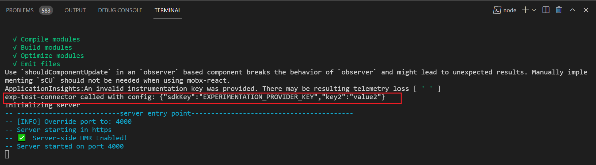

2. To check if you experimentation connector is registered successfully, after the server has successfully started. you can open this pagemock link: https://localhost:4000/page?mock=default-page and open the developer console on your browser. You will see the below message which means that the connector was successfully registed 
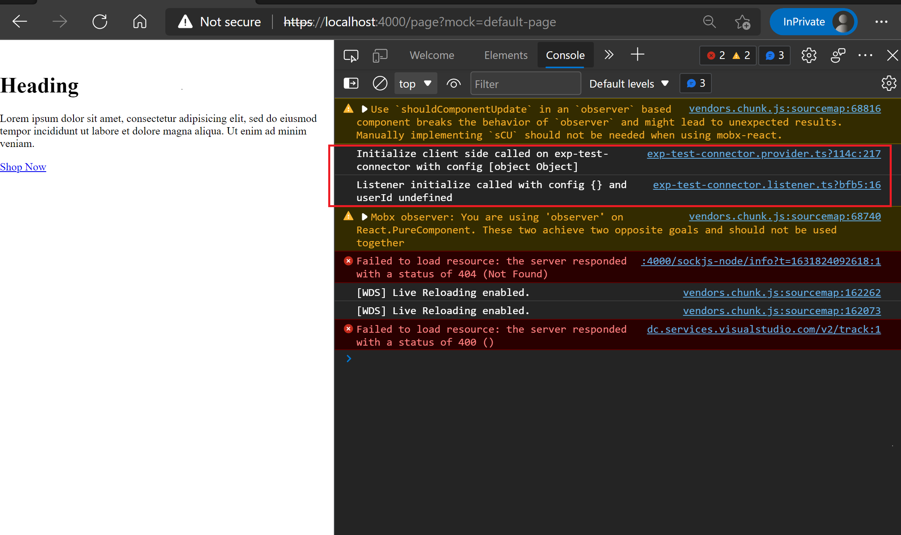

3. If you experimentation connector is registered successfully, after the server has successfully started, you can open this link: https://localhost:4000/_sdk/dapi/experiments and you should be able to see list of all experiments that are returned from your experimentation connector


### 6. Deploy exeprimentation connector to an environment
To deploy experimentation connector to an environment, run **yarn msdyn365 pack** command and upload the generated zip in the LCS. Once the package is successfully deployed the environment, you can see your experiment connector in the sitebuilder tool

1) Click on experiments tab:
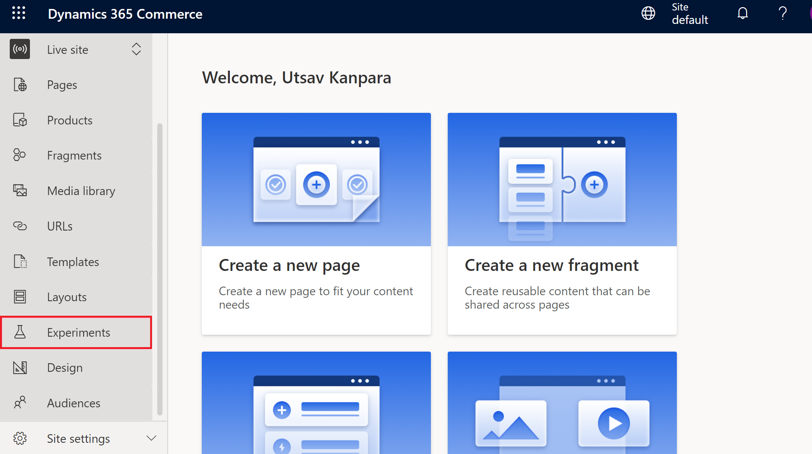

2) You will see your expeirmentation connector name:
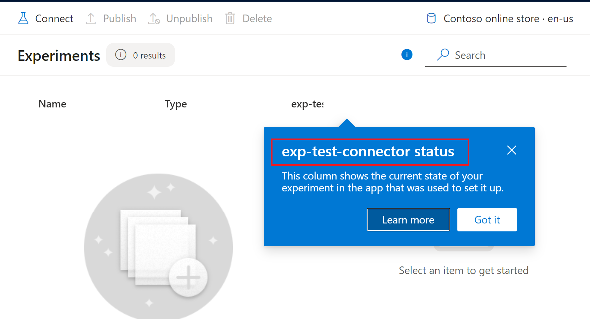


3) When you click on the connect tab, you will see the list of experiments from your experimentation connector:
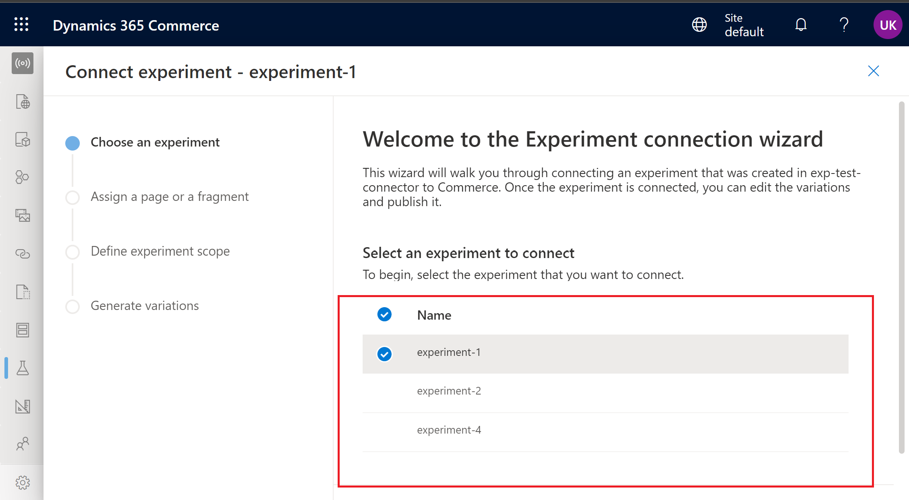

To connect your expeirments on pages, you can follow this online guide: https://docs.microsoft.com/en-us/dynamics365/commerce/experimentation-connect-edit#connect-your-experiment


# Configuring Geolookup connector
A geoLookup connector lets you connect to an external geolocation service provider. By adding this type of connector to your e-commerce site and configuring it, you can generate geolocation information for e-commerce site users.

## Detailed Steps

### 1. Configure connector definition file
- Create a folder named **connectors** inside **src** directory level, if it doesn't exist.
- Create a folder named **geoLookup-test-connector** (name is up to you) inside **src/connectors** directory.
- Create a **geoLookup-test-connector.json** file in **src/connectors/geoLookup-test-connector** directory.
- Copy the below code inside the **geoLookup-test-connector.json** file located at **src/connectors/geoLookup-test-connector** directory.

```json
{
    "$type": "geoLookupConnector",
    "name": "geoLocationTest",
    "description": "geoLocationTest connector implementation",
    "configSchema": {
        "type": "object",
        "properties": {
            "apiKey": {
                "type": "string",
                "description": "Api key for using the geoLookup API"
            }
        },
        "required": ["apiKey"]
    },
    "segmentations": [
        {
            "id": "country",
            "name": "Country",
            "type": "String"
        }
    ]
}
```

Link to GeoLookup connector definition file: https://docs.microsoft.com/en-us/dynamics365/commerce/e-commerce-extensibility/connectors#connector-definition-file-1

### 2. Configure connector provider file
A provider file is required to initialize a connector. Create a new provider file with the name **geoLookup-test-connector.provider.ts**.

- The geoLookup-test-connector provider file should implement **IGeoLookupProvider** interface. More info on the interface can be found here https://docs.microsoft.com/en-us/dynamics365/commerce/e-commerce-extensibility/connectors#provider-file-1

- Copy the below code in the **geoLookup-test-connector.provider.ts** file.

```typescript
import { IGeoLocation, IGeoLookupProvider, IRequestContext } from '@msdyn365-commerce/core';
/**
 * A basic implementation of the ExperimentationProvider interface used for testing
 */
class GeoLookupTestConnector implements IGeoLookupProvider {
    // eslint-disable-next-line @typescript-eslint/no-explicit-any
    public initialize(config: any): Promise<boolean> {
        console.log(`GeoLookup Test Connector called with config: ${JSON.stringify(config)}`);
        return Promise.resolve(true);
    }

    public getGeoInformation(ip: string, requestContext: IRequestContext, userId?: string): Promise<IGeoLocation> {
        console.log('GeoLookup Test Connector get geo information with ip, baseurl -', ip, requestContext?.apiSettings?.baseUrl, userId);
        let userid = 'not Added';
        if (userId) {
            userid = userId;
        }
        const geoLocation: IGeoLocation = {
            country: 'test-country',
            city: 'test-city',
            user: userid
        };
        return Promise.resolve(geoLocation);
    }
}

const connector = new GeoLookupTestConnector();
export default connector;
```
### 3. Configure connector.settings.json file
Add the below object in the **connector.settings.json** file to configure the geoLookup connector.

More info on the properties of geoLookup connector can be found here: https://docs.microsoft.com/en-us/dynamics365/commerce/e-commerce-extensibility/connectors#enable-and-configure-a-geolookup-connector

```json
    "geoLookup": {
        "name": "geoLocationTest",
        "config": {
            "apiKey": "GEOLOCATION_SERVICE_PROVIDER_API_KEY"
        },
        "cacheConfig": {
            "ttlInSeconds": {
                "geoLookup": 10
            }
        }
    }
```
### 5. Test locally if the geoLookup connector is registered correctly:
Below are the ways through which you can test if your geoLookup connector is registerd successfully.

1. Run **yarn start**, and above the started with port info message, you will see this below message
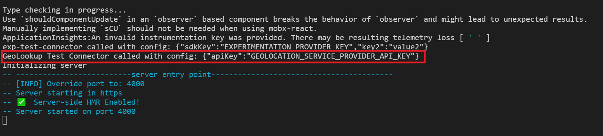

2. If you geoLookup connector is registered successfully, after the server has successfully started, you can open this link: https://localhost:4000/_sdk/dapi/segmentproviders and you should be able to see your geoLookup connector in the response.
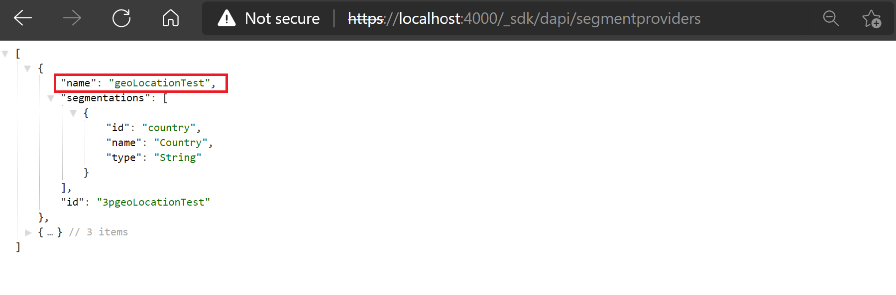

### 6. Deploy geoLookup connector to an environment
To deploy geoLookup connector to an environment, run **yarn msdyn365 pack** command and upload the generated zip in the LCS. Once the package is successfully deployed the environment, you can see your geoLookup connector in the sitebuilder tool.

1) Click on audience tab and create a new audience:
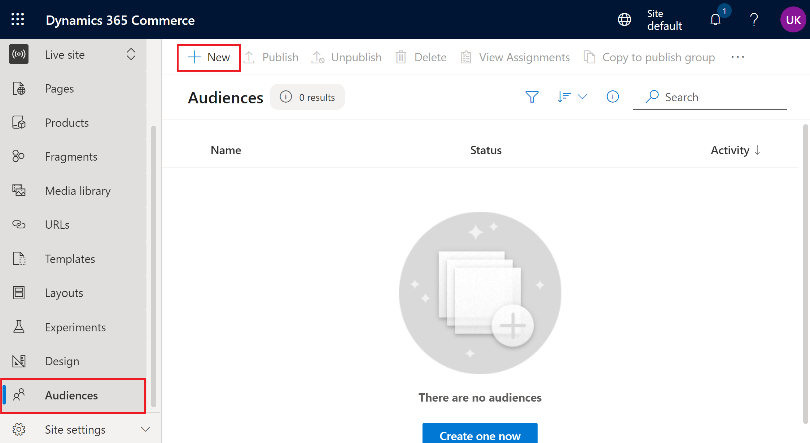

2) Select your newly created audience and create a new rule block
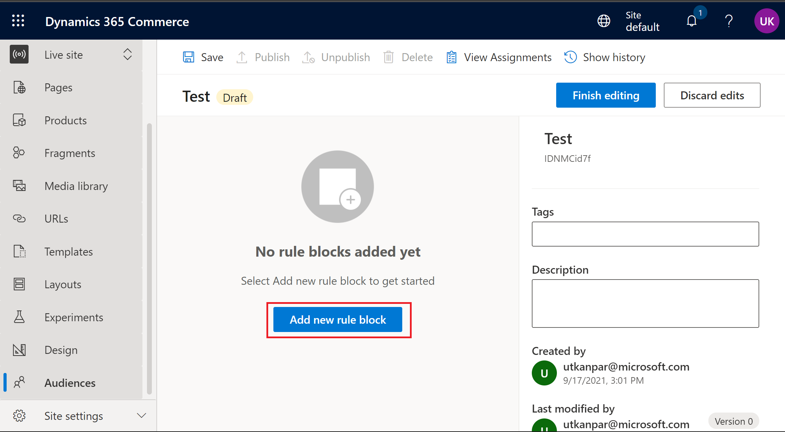

3) Click on the **Select a Provider** dropdown and you will see the **geoLocationTest** connector
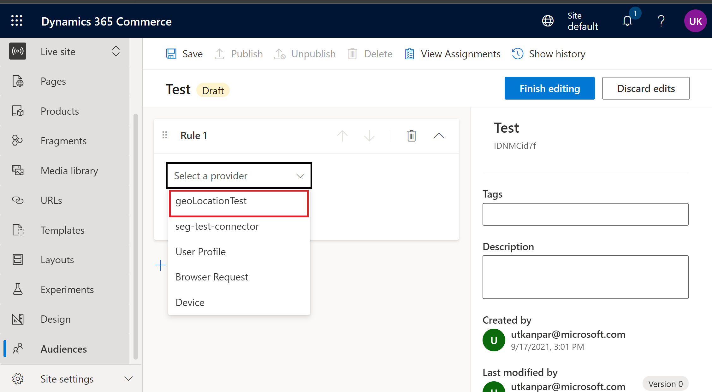


# Configuring Segmentation connector

## Overview: 
A segmentation provider contains the business logic to fetch and analyze raw data source attributes (for example age, city, zip code, or country) from third-party sources and reduces them to one or more simple target segments that can be used within your e-commerce site. Multiple segmentation providers can be registered at the same time.

## Detailed Steps

### 1. Configure connector definition file
- Create a folder named **connectors** inside **src** directory level, if it doesn't exist.
- Create a folder named **seg-test-connector** inside **src/connectors** directory.
- Create **seg-test-connector.connector.json** file inside **src/connectors/seg-test-connector** directory.
- Copy the below inside the **seg-test-connector.connector.json** definition file.

```json
{
    "$type": "segmentationConnector",
    "name": "seg-test-connector",
    "id": "seg-connector-id-1",
    "description": "Test connector implementation",
    "configSchema": {
        "type": "object",
        "properties": {
            "apiKey": {
                "type": "string",
                "description": "Api key for using the geoLookup API"
            }
        },
        "required": ["apiKey"]
    },
    "segmentations": [
        {
            "id": "s1",
            "name": "Age",
            "type": "int",
            "maxValue": 100,
            "minValue": 1
        },
        {
            "id": "u2",
            "name": "User Agent",
            "type": "string"
        },
        {
            "id": "s2",
            "name": "Location",
            "type": "enum",
            "enum": ["windows", "android", "iOS", "other"],
            "enumName": ["Windows", "Android", "IOS", "Other"]
        }
    ]
}
```
More info on the segmentations schema can be found here: https://docs.microsoft.com/en-us/dynamics365/commerce/e-commerce-extensibility/connectors#segmentations-schema

### 2. Configure provider file
A provider file is required to initialize a connector. The name of the provider file is in the format **<CONNECTOR_NAME>.provider.ts**.

- Create a new file **seg-test-connector.provider.ts** inside inside **src/connectors/seg-test-connector** directory and copy the below code into the **seg-test-connector.provider.ts** file:

```typescript
import { ISegmentationProvider, ISementations } from '@msdyn365-commerce/core';
/**
 * A basic implementation of the ExperimentationProvider interface used for testing
 */
class SegmentationTestConnector implements ISegmentationProvider {
    // eslint-disable-next-line @typescript-eslint/no-explicit-any
    public initialize(config: any): Promise<boolean> {
        console.log(`Segmentation Test Connector called with config: ${JSON.stringify(config)}`);
        return Promise.resolve(true);
    }

    public async getSegmentations(userId: string, segmentationIds: string[]): Promise<ISementations> {
        console.log(`Segmentation  Test Connector will resolve segments - ${segmentationIds} for ${userId}`);
        const testResult: ISementations = {};
        if (segmentationIds) {
            segmentationIds.forEach(segmentId => {
                testResult[segmentId] = `${segmentId}'s value`;
            });
        }

        return Promise.resolve(testResult);
    }
}

const connector = new SegmentationTestConnector();
export default connector;
```

Note: The segmentation provider file should implement the **ISegmentationProvider** interface. More info on the interface can be found here https://docs.microsoft.com/en-us/dynamics365/commerce/e-commerce-extensibility/connectors#provider-file-2

### 3. Configure the segmentation provider in connector.settings.json
Add the below object in the **connector.settings.json** file to configure the seg-test-connector.

```json
"segmentation": [
    {
        "id": "seg-connector-id-1",
        "config": {
            "apiKey": "SEGMENTATION_PROVIDER_API_KEY"
        }
    }       
]
```
Note: The segmentation id should be same as the id defined in the **seg-test-connector.connector.json** definition file. 

### 5. Test locally if the segmentation connector is registered correctly:
Below are the ways through which you can test if your segmentation connector is registerd successfully.

1. Run **yarn start**, and above the started with port info message, you can open this link: https://localhost:4000/_sdk/dapi/segmentproviders and you should be able to see your segmentation connector in the response.
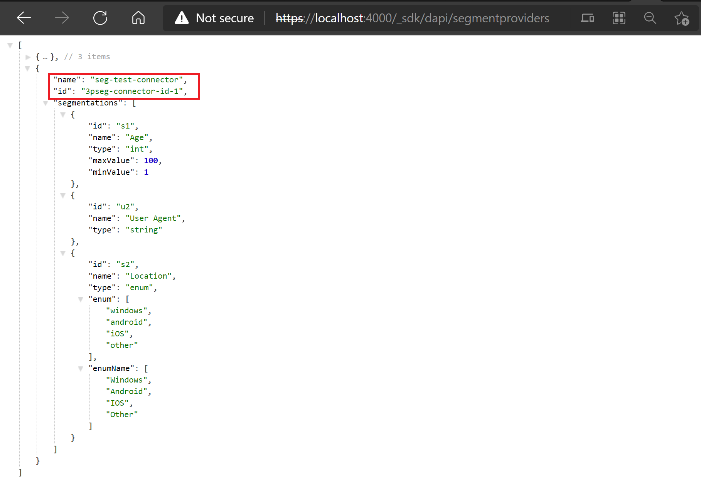

### 6. Deploy segmentation connector to an environment
To deploy segmentation connector to an environment, run **yarn msdyn365 pack** command and upload the generated zip in the LCS. Once the package is successfully deployed the environment, you can see your segmentation connector in the sitebuilder tool.

1) Click on audience tab and create a new audience:


2) Select your newly created audience and create a new rule block


3) Click on the **Select a Provider** dropdown and you will see the **seg-test-connector** connector


