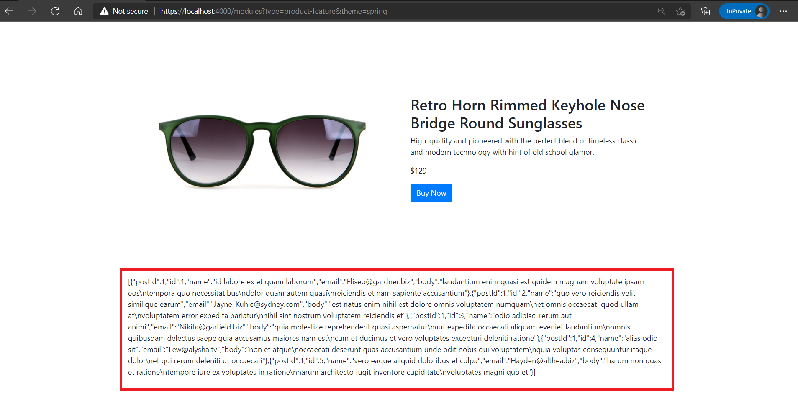

# Dynamics 365 Commerce - online SDK samples
## License
License is listed in the [LICENSE](./LICENSE) file.

# Sample – Custom data action calling an external service

## Overview
This sample covers on how to use a custom data action to call a thirdparty service. 

There are many scenarios where you’ll need to call an external service to get additional data into your module, this may be to your own service or another third-party service provider such as a social platform or other E-Commerce related services (ex: Dynamics 365 Retail, Ratings and Review or the Recommendations Service).  In this section we will be showing you how to create a data action to call an external service and display that data in your module.

The following URL Web Service provides free web calls with sample data, we’ll be using it to simulate getting user review data for a product. 

https://jsonplaceholder.typicode.com/comments?postId=1 


## Detailed Steps

### 1. Start with copy of Sample 1

In this sample we will add a data action which inside the module created in sample 1 which will call an external service. Please start with a copy of Sample 1.

### 2. Creating a new Data Action 

To create a data action, open your command prompt and navigate to the root of your SDK and type in the below command to create the new data action. 

```yarn msdyn365 add-data-action get-product-reviews```

### 3. Add the data action entry to the module’s definition file: 
We need to declare the data action we will be using and the returned data field. Copy the following into to the module’s definition **src\modules\product-feature\product-feature.definition.json** file

```json
{
    "$type": "contentModule",
    "friendlyName": "Product Feature",
    "name": "product-feature",
    "description": "Feature module used to highlight a product.",
    "categories": [
        "storytelling"
    ],
    "tags": [
        ""
    ],
    "dataActions": {
        "productReviews": {
            "path": "../../actions/get-product-reviews.action",
            "runOn": "server"
        }
    },
    "config": {
        "imageAlignment": {
            "friendlyName": "Image Alignment",
            "description": "Sets the desired alignment of the image, either left or right on the text.",
            "type": "string",
            "enum": {
                "left": "Left",
                "right": "Right"
            },
            "default": "left",
            "scope": "module",
            "group": "Layout Properties"
        },
        "productTitle": {
            "type": "string",
            "friendlyName": "Product Title",
            "description": "Product placement title"
        },
        "productDetails": {
            "type": "richText",
            "friendlyName": "Product Details",
            "description": "Rich text representing the featured product details"
        },
        "productImage": {
            "type": "image",
            "friendlyName": "Product Image",
            "description": "Image representing the featured product"
        },
        "buttonText": {
            "type": "string",
            "friendlyName": "Button Text",
            "description": "Text to show on the call to action button"
        }
    }
}
```
Make note of the **productReviews** data-action entry is added to the **dataActions** property added above. The **path** is the data-action file path and **runOn** value can be **server** / **client**.

### 4. Add a data action return variable
Each data action that returns data needs a variable to store the data defined in the MODULE_NAME.data.ts file. Open productFeature.data.ts and add the below code. 

Notice the result is of type **IGetProductReviewsData** which is defined in the **actions/get-product-reviews.action** directory. Also note that the name of the variable **productReviews** below matches the name of the data action defined in the above module definition file.

```typescript
import { AsyncResult } from '@msdyn365-commerce/retail-proxy';
import { IGetProductReviewsData } from '../../actions/get-product-reviews.action'; 

export interface IProductFeatureData {
    productReviews: AsyncResult<IGetProductReviewsData>;
}
```

### 5. Update data-action file to call the third party api:

We are now ready to add our service http call in our new data-action file **get-product-reviews.action.ts**, open the file and replace with the below code. 

```typescript
import * as Msdyn365 from '@msdyn365-commerce/core';

/**
 * GetProductReviews Input Action
 */
export class GetProductReviewsInput implements Msdyn365.IActionInput {
    // a cache object type and an appropriate cache key
    public getCacheKey = () => `DEFAULT`;
    public getCacheObjectType = () => 'IGetProductReviewsData';
    public dataCacheType = (): Msdyn365.CacheType => 'application';
}

// Create a data model here or import one to capture the response of the action
export interface IGetProductReviewsData {
    text: string;
}

/**
 * Use this function to create the input required to make the action call
 */
const createInput = (args: Msdyn365.ICreateActionContext): Msdyn365.IActionInput => {
    return new GetProductReviewsInput();
};

/**
 * TODO: Use this function to call your action and process the results as needed
 */
async function action(input: GetProductReviewsInput, ctx: Msdyn365.IActionContext): Promise<IGetProductReviewsData> {
    const result = await Msdyn365.sendRequest<string>('https://jsonplaceholder.typicode.com/comments?postId=1').then(
        (response: Msdyn365.IHTTPResponse<string>) => {
            return response.data;
        }
    );
    return { text: JSON.stringify(result) };
}

export default Msdyn365.createObservableDataAction({
    action: <Msdyn365.IAction<IGetProductReviewsData>>action,
    id: 'GetProductReviews',
    input: createInput
});
```

As a note, you may notice the returned data above is just a string on the JSON, we will just be sending this data back and displaying it in our module as is. However, in a real-world solution you would use business logic to parse the JSON and display more appropriately, we will leave this as an exercise for you. 

### 6.  Return data from our react component and view: 

The last thing we will need is to access the returned data from our react component and view. 

- Copy the below code into the **product-feature.tsx** file to get the returned data from the data action and add it to the props to send to the module view.   

```typescript
import * as React from 'react';

import { IProductFeatureData } from './product-feature.data';
import { imageAlignment, IProductFeatureProps } from './product-feature.props.autogenerated';

export interface IProductFeatureViewProps extends IProductFeatureProps<IProductFeatureData> {
    productName: string;
    productInfo: string;
    productImageUrl: string;
    productPrice: string;
    buttonInfo: string;
    alignment: imageAlignment;
    reviews: string;
}

/**
 *
 * ProductFeature component
 * @extends {React.PureComponent<IProductFeatureProps<IProductFeatureData>>}
 */
class ProductFeature extends React.PureComponent<IProductFeatureProps<IProductFeatureData>> {
    public render(): JSX.Element | null {
        const {
            config,
            data: { productReviews }
        } = this.props;

        // set default product info values
        const ProductName = config.productTitle ? config.productTitle : 'No product name defined';
        const ProductInfo = config.productDetails ? config.productDetails.toString() : 'No product details defined';
        const ProductImageUrl = config.productImage ? config.productImage.src : '';
        const ButtonInfo = config.buttonText ? config.buttonText : 'No button text defined';
        const ProductPrice = '$129';

        const Reviews = productReviews && productReviews.result ? productReviews.result.text : 'no data returned';

        const ProductFeatureViewProps = {
            ...this.props,
            productName: ProductName,
            productInfo: ProductInfo,
            productImageUrl: ProductImageUrl,
            productPrice: ProductPrice,
            buttonInfo: ButtonInfo,
            alignment: config.imageAlignment,
            reviews: Reviews
        };

        return this.props.renderView(ProductFeatureViewProps);
    }
}

export default ProductFeature;
```

- Next, we will just add a simple paragraph tag to display the output returned from the data action in the module view file.  Make the below changes to the **product-feature.view.tsx** file.

```typescript
import * as React from 'react';
import { IProductFeatureViewProps } from './product-feature';
import { imageAlignment } from './product-feature.props.autogenerated';

const _renderImage = (productImageUrl: string, productName: string): JSX.Element => {
    return ;
};

const _renderInfo = (productName: string, productInfo: string, productPrice: string, buttonInfo: string): JSX.Element => {
    return (
        <div className='container'>
            <h2>{productName}</h2>
            <p>{productInfo}</p>
            <p>{productPrice}</p>
            <button type='button' className='btn btn-primary'>
                {buttonInfo}
            </button>
        </div>
    );
};

export default (props: IProductFeatureViewProps) => {
    const { productName, productInfo, productImageUrl, productPrice, buttonInfo, alignment, reviews } = props;

    let left;
    let right;

    if (alignment === imageAlignment.left) {
        left = _renderImage(productImageUrl, productName);
        right = _renderInfo(productName, productInfo, productPrice, buttonInfo);
    } else {
        right = _renderImage(productImageUrl, productName);
        left = _renderInfo(productName, productInfo, productPrice, buttonInfo);
    }

    return (
        <div className='container'>
            <div className='row align-items-center'>
                <div className='col-sm-6'>{left}</div>
                <div className='col-sm-6'>{right}</div>
            </div>
            <div className='row'>
                <p>{reviews}</p>
            </div>
        </div>
    );
};
```

### 7. Build and test module
The module can now be built and tested in a web browser using the ```yarn start``` command to see if the third party data action call is being successfully made and rendering the API response on the page.

- Please run **yarn start**, and once the build has completed, you should see an output stating that the server has started on a specific port as shown below. 
- Open this page **https://localhost:4000/modules?type=product-feature&theme=spring**

The output page should look like below, with a JSON string outputted in a paragraph tag under the button (note the data action can further parse out the json object if desired). 

