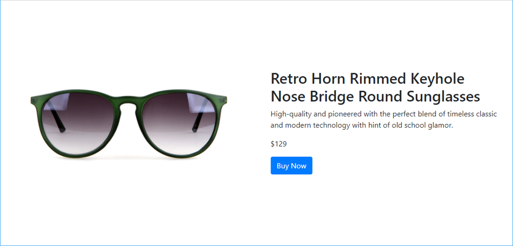
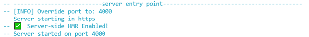
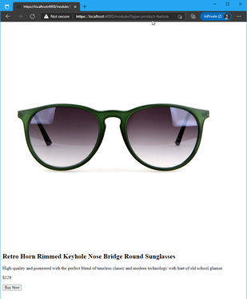
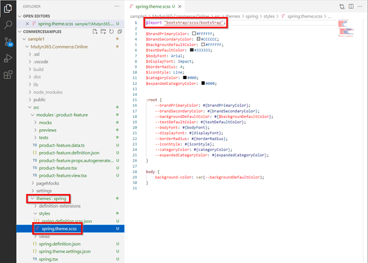
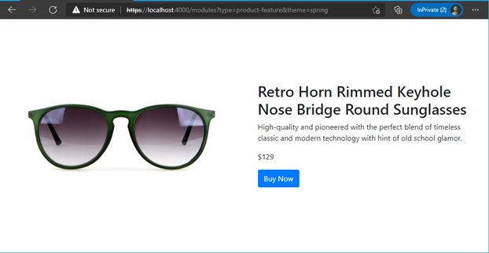
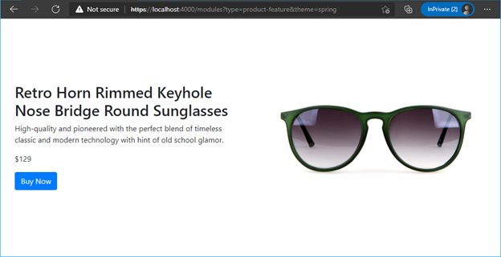
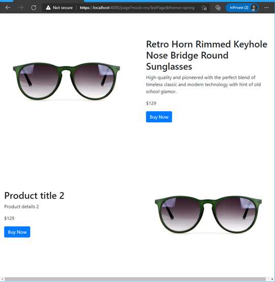

# Dynamics 365 Commerce - online SDK samples
## License
License is listed in the [LICENSE](./LICENSE) file.

# Sample - Custom module

## Overview
In this sample, you will learn how to build a custom module using a CLI command included in the Dynamics 365 Commerce Online SDK.  The module will contain several configuration fields that once deployed would allow the user to specify the content for the module such as the title, description and image to show. 




## Doc links
* [Modules overview](https://docs.microsoft.com/en-us/dynamics365/commerce/e-commerce-extensibility/modules-overview)
* [Create a new module](https://docs.microsoft.com/en-us/dynamics365/commerce/e-commerce-extensibility/create-new-module)
* [Module definition file](https://docs.microsoft.com/en-us/dynamics365/commerce/e-commerce-extensibility/module-definition-file)
* [Module React component file](https://docs.microsoft.com/en-us/dynamics365/commerce/e-commerce-extensibility/module-react-file)
* [Module view file](https://docs.microsoft.com/en-us/dynamics365/commerce/e-commerce-extensibility/module-view-file)
* [Module mock file](https://docs.microsoft.com/en-us/dynamics365/commerce/e-commerce-extensibility/module-mock-file)
* [Module test file](https://docs.microsoft.com/en-us/dynamics365/commerce/e-commerce-extensibility/module-test-file)
* [Module props.autogenerated.ts file](https://docs.microsoft.com/en-us/dynamics365/commerce/e-commerce-extensibility/module-props-autogenerated-ts-file)
* [Module configuration presets](https://docs.microsoft.com/en-us/dynamics365/commerce/e-commerce-extensibility/module-config-presets)
* [Add module configuration fields](https://docs.microsoft.com/en-us/dynamics365/commerce/e-commerce-extensibility/add-module-config-fields)
* [CLI command reference](https://docs.microsoft.com/en-us/dynamics365/commerce/e-commerce-extensibility/cli-command-reference)
* [Preview and debug a module](https://docs.microsoft.com/en-us/dynamics365/commerce/e-commerce-extensibility/test-module)
* [Test modules with module mocks](https://docs.microsoft.com/en-us/dynamics365/commerce/e-commerce-extensibility/test-module-mock)
* [Test modules by using page mocks](https://docs.microsoft.com/en-us/dynamics365/commerce/e-commerce-extensibility/test-page-mock)
* [Module configuration presets](https://docs.microsoft.com/en-us/dynamics365/commerce/e-commerce-extensibility/module-config-presets)

## Detailed Steps

### 1. Use CLI command to create a new module

Use the CLI command: ```yarn msdyn365 add-module product-feature``` to create a module called **product-feature**. The new module will be created under the **\src\modules** directory.


### 2. Add configuration properties into the module definition file

Copy the following json into the **\src\modules\product-feature\product-feature.definition.json** file to create a set of configuration properties.

```json
{
    "$type": "contentModule",
    "friendlyName": "Product Feature",
    "name": "product-feature",
    "description": "Feature module used to highlight a product.",
    "categories": [
        "storytelling"
    ],
    "tags": [
        ""
    ],
    "dataActions": {},
    "config": {
        "imageAlignment": {
            "friendlyName": "Image Alignment",
            "description": "Sets the desired alignment of the image, either left or right on the text.",
            "type": "string",
            "enum": {
                "left": "Left",
                "right": "Right"
            },
            "default": "left",
            "scope": "module",
            "group": "Layout Properties"
        },
        "productTitle": {
            "type": "string",
            "friendlyName": "Product Title",
            "description": "Product placement title"
        },
        "productDetails": {
            "type": "richText",
            "friendlyName": "Product Details",
            "description": "Rich text representing the featured product details"
        },
        "productImage": {
            "type": "image",
            "friendlyName": "Product Image",
            "description": "Image representing the featured product"
        },
        "buttonText": {
            "type": "string",
            "friendlyName": "Button Text",
            "description": "Text to show on the call to action button"
        }
    }
}
```

### 3. Add mock data for the configurations

Each configuration can have corresponding mock data, which will help while developing the module without the need to have a deployed environment to test on.  Add the following json to the **\src\modules\product-feature\mocks\product-feature.json** file.

```json
{
  "id": "R1Module1",
  "config": {
    "imageAlignment": "left",
    "productTitle": "Retro Horn Rimmed Keyhole Nose Bridge Round Sunglasses",
    "productDetails": "High-quality and pioneered with the perfect blend of timeless classic and modern technology with hint of old school glamor.",
    "productImage": {
      "src": "https://bit.ly/33cMGxr",
      "altText": "Retro Horn Rimmed Keyhole Nose Bridge Round Sunglasses"
    },
    "buttonText": "Buy Now"
  },
  "typeName": "product-feature"
}
```

### 4. Fix module test code

To ensure the module unit test code still works, we need to update the config section to match our new configuration properties added in the module definition file.  Copy the below code into the **\src\modules\product-feature\tests\product-feature.test.tsx** file.

```typescript
import { buildMockModuleProps } from '@msdyn365-commerce/core-internal';
/// <reference types="jest" />

import * as React from 'react';
import * as renderer from 'react-test-renderer';

import ProductFeature from '../product-feature';
import { IProductFeatureData } from '../product-feature.data';
import { imageAlignment, IProductFeatureConfig, IProductFeatureProps } from '../product-feature.props.autogenerated';

const mockData: IProductFeatureData = {
    actionResponse: {
        text: 'Sample Response Data'
    }
};

const mockConfig: IProductFeatureConfig = {
    imageAlignment: imageAlignment.left,
    productTitle: 'Retro Horn Rimmed Keyhole Nose Bridge Round Sunglasses',
    productDetails:
        'High-quality and pioneered with the perfect blend of timeless classic and modern technology with hint of old school glamor.',
    productImage: {
        src: 'https://bit.ly/33cMGxr',
        altText: 'Retro Horn Rimmed Keyhole Nose Bridge Round Sunglasses'
    },
    buttonText: 'Buy Now'
};

const mockActions = {};

describe('ProductFeature', () => {
    let moduleProps: IProductFeatureProps<IProductFeatureData>;
    beforeAll(() => {
        moduleProps = buildMockModuleProps(mockData, mockActions, mockConfig) as IProductFeatureProps<IProductFeatureData>;
    });
    it('renders correctly', () => {
        const component: renderer.ReactTestRenderer = renderer.create(<ProductFeature {...moduleProps} />);
        const tree: renderer.ReactTestRendererJSON | renderer.ReactTestRendererJSON[] | null = component.toJSON();
        expect(tree).toMatchSnapshot();
    });
});
```

### 5. Add module React code

The module React code contains the modules business logic and is responsible for calling the module view file to create the output HTML for the module. Copy the below code to the modules react typescript file **\src\modules\product-feature\product-feature.tsx**.

```typescript
import * as React from 'react';

import { IProductFeatureData } from './product-feature.data';
import { imageAlignment, IProductFeatureProps } from './product-feature.props.autogenerated';

export interface IProductFeatureViewProps extends IProductFeatureProps<IProductFeatureData> {
    productName: string;
    productInfo: string;
    productImageUrl: string;
    productPrice: string;
    buttonInfo: string;
    alignment: imageAlignment;
}

/**
 *
 * ProductFeature component
 * @extends {React.PureComponent<IProductFeatureProps<IProductFeatureData>>}
 */
class ProductFeature extends React.PureComponent<IProductFeatureProps<IProductFeatureData>> {
    public render(): JSX.Element | null {
        const { config } = this.props;

        // set default product info values
        const ProductName = config.productTitle ? config.productTitle : 'No product name defined';
        const ProductInfo = config.productDetails ? config.productDetails.toString() : 'No product details defined';
        const ProductImageUrl = config.productImage ? config.productImage.src : '';
        const ButtonInfo = config.buttonText ? config.buttonText : 'No button text defined';
        const ProductPrice = '129';

        const ProductFeatureViewProps = {
            ...this.props,
            productName: ProductName,
            productInfo: ProductInfo,
            productImageUrl: ProductImageUrl,
            productPrice: ProductPrice,
            buttonInfo: ButtonInfo,
            alignment: config.imageAlignment
        };

        return this.props.renderView(ProductFeatureViewProps);
    }
}

export default ProductFeature;
```

### 6. Add module view code
The module view code is responsible for generating the module's HTML. Add the below to the module view file **\src\modules\product-feature\product-feature.view.tsx**.

```typescript
import * as React from 'react';
import { IProductFeatureViewProps } from './product-feature';
import { imageAlignment } from './product-feature.props.autogenerated';

const _renderImage = (productImageUrl: string, productName: string): JSX.Element => {
    return ;
};

const _renderInfo = (productName: string, productInfo: string, productPrice: string, buttonInfo: string): JSX.Element => {
    return (
        <div className='container'>
            <h2>{productName}</h2>
            <p>{productInfo}</p>
            <p>{productPrice}</p>
            <button type='button' className='btn btn-primary'>
                {buttonInfo}
            </button>
        </div>
    );
};

export default (props: IProductFeatureViewProps) => {
    const { productName, productInfo, productImageUrl, productPrice, buttonInfo, alignment } = props;

    let left;
    let right;

    if (alignment === imageAlignment.left) {
        left = _renderImage(productImageUrl, productName);
        right = _renderInfo(productName, productInfo, productPrice, buttonInfo);
    } else {
        right = _renderImage(productImageUrl, productName);
        left = _renderInfo(productName, productInfo, productPrice, buttonInfo);
    }

    return (
        <div className='row align-items-center'>
            <div className='col-sm-6'>{left}</div>
            <div className='col-sm-6'>{right}</div>
        </div>
    );
};
```

### 7. Build and view module

The module can now be built and tested in a web browser using the ```yarn start``` command.

Once the build has completed, you should see an output stating that the server has started on a specific port as shown below.  To change the port number see the [Configure a development environment (.env) file](https://docs.microsoft.com/en-us/dynamics365/commerce/e-commerce-extensibility/configure-env-file) document.



From within a local browser, you can view the module with the following URL **https://localhost:4000/modules?type=product-feature**

You should see a module rendered similar to below.



Note that the module’s HTML code leverages Bootstrap to create 2 columns (note the 'col-sm-6' className propery in the code), but only one column is rendered in the above image.  This is because we haven’t told our module to user Bootstrap yet, which is done at the theme level. To test the module with Bootstrap a theme must be used which will contain SCSS files which pull in the Bootstrap libraries.  The next section will not go into theme details but will show how to create a simple theme that can be used during your module development.  Further samples are available that go into more detail on themes.

### 8. Create a custom theme

The module view code above leverages the open-source JavaScript **Bootstrap** library to create two distinct columns of equal width.  Bootstrap will provide a responsive design, so that shrinking the window size will eventually drop it to a single column without any additional work.  To support Bootstrap, we need to specify a theme when rendering the module.  Run the below command to create a new theme called **spring** that will be created in the \src\themes\ directory (ensure you hit CTRL-C to stop the Node server before running the step below).

```yarn msdyn365 add-theme spring```

We will not make any changes to the theme, however if you open the theme’s \styles\spring.theme.scss file you will see that it imports the bootstrap library.  



### 9. Build and test module
The module and theme can now be built and tested in a web browser using the ```yarn start``` command to build and start the Node server. Once the Node server is ready, from within a local browser you can view the module and theme with the following URL https://localhost:4000/modules?type=product-feature&theme=spring.



### 10. Changing mock data

If you make changes to the mock data found in the **\src\modules\product-feature\mocks\product-feature.json** file, you will see the changes in the module output.  For example, change the **imageAlignment** property to **right** and save the mock file as shown below

```json
{
  "id": "R1Module1",
  "config": {
    "imageAlignment": "right",
    "productTitle": "Retro Horn Rimmed Keyhole Nose Bridge Round Sunglasses",
    "productDetails": "High-quality and pioneered with the perfect blend of timeless classic and modern technology with hint of old school glamor.",
    "productImage": {
      "src": "https://bit.ly/33cMGxr",
      "altText": "Retro Horn Rimmed Keyhole Nose Bridge Round Sunglasses"
    },
    "buttonText": "Buy Now"
  },
  "typeName": "product-feature"
}
```



### 11. Build a page mock

You may need to test several modules running on the same page.  Create a new file **my-test-page.json** under the **src/pageMocks** directory and copy the below json into the file.

```json
{
    "exception": null,
    "pageRoot": {
        "id": "core-root_0",
        "typeName": "core-root",
        "modules": {
            "body": [
                {
                    "id": "default-page_0",
                    "typeName": "default-page",
                    "modules": {
                        "primary": [
                            {
                                "id": "ProductFeature__0",
                                "typeName": "product-feature",
                                "config": {
                                    "imageAlignment": "left",
                                    "productTitle": "Retro Horn Rimmed Keyhole Nose Bridge Round Sunglasses",
                                    "productDetails": "High-quality and pioneered with the perfect blend of timeless classic and modern technology with hint of old school glamor.",
                                    "productImage": {
                                      "src": "https://bit.ly/33cMGxr",
                                      "altText": "Retro Horn Rimmed Keyhole Nose Bridge Round Sunglasses"
                                    },
                                    "buttonText": "Buy Now"
                                }
                            },
                            {
                                "id": "ProductFeature__1",
                                "typeName": "product-feature",
                                "config": {
                                    "imageAlignment": "right",
                                    "productTitle": "Product title 2",
                                    "productDetails": "Product details 2",
                                    "productImage": {
                                      "src": "https://bit.ly/33cMGxr",
                                      "altText": "image alt text"
                                    },
                                    "buttonText": "Buy Now"
                                }
                            }
                        ]
                    }
                }
            ]
        }
    },
    "renderingContext": {
        "gridSettings": {
            "xs": {
                "w": 767
            },
            "sm": {
                "w": 991
            },
            "md": {
                "w": 1199
            },
            "lg": {
                "w": 1599
            },
            "xl": {
                "w": 1600
            }
        },
        "staticContext": {
            "staticCdnUrl": "/_scnr/"
        },
        "locale": "en-us"
    },
    "statusCode": 200
}
```

The page mock contains some additional page information such as the breakpoint grid settings and locale to render.

Run ```yarn start``` again to start the Node server.  When it’s ready, launch the following URL to see the mock test page **https://localhost:4000/page?mock=my-test-page&theme=spring**.  Notice the mock page file name is used in the URL and the theme is also specified. The mock data above can further be changed to try out different scenarios for your module.



### 11. Adding module configuration presets

Module configuration presets are default values that are used in Commerce site builder. These values are needed when configuration values are not set at the template or layout level.  When the new module was created, a default preview file was created **\src\modules\product-feature\previews\product-feature.preview.json**.

The below images, shows how this module's configuration properties looks when added to a page without any presets.


To add presets, change the **...\previews\product-feature.preview.json** file to the below JSON, which will set default string values for each configuration property.

```json
{
  "id": "product-feature",
  "config": {
    "imageAlignment": "left",
    "productTitle": "Sample product title",
    "productDetails": "Sample product title details.",
    "buttonText": "Buy Now"
  },
  "data": {
    "actionResponse": {
      "text": "Sample Action Response"
    }
  },
  "typeName": "product-feature"
}
```

Once the package is built and deployed, the site builder will now show the default values when the module is added to a page, template or fragment. For more information see [Package configurations and deploy them to an online environment](https://docs.microsoft.com/en-us/dynamics365/commerce/e-commerce-extensibility/package-deploy)