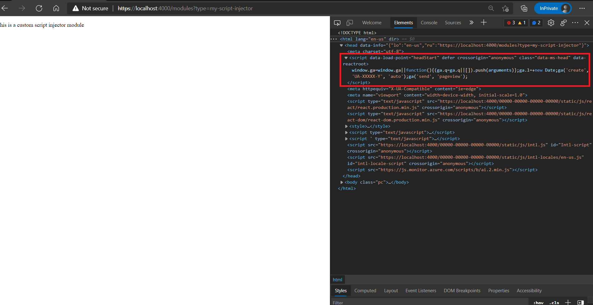

# Dynamics 365 Commerce - online SDK samples
## License
License is listed in the [LICENSE](./LICENSE) file.

# Sample – Custom script injector module

## Overview
This sample will covers how to inject a custom script by creating a custom script injector module and also add more configuration field to be exposed in thr authoring tools.

The Dynamics 365 Commerce module library provides two prebuilt script injector modules: external script and inline script. You can add these modules to a page or page template to inject inline or external scripts into the HTML head, body begin, or body end of a page as needed. For example, you can add a script for integration with third-party analytics, or other service scripts.

## Doc links
* [External Script module](https://docs.microsoft.com/en-us/dynamics365/commerce/e-commerce-extensibility/script-injector#external-script-module)

* [Inline Script module](https://docs.microsoft.com/en-us/dynamics365/commerce/e-commerce-extensibility/script-injector#inline-script-module)

In some cases, you might have to inject scripts into your site or site pages, but the prebuilt script injector modules from the module library aren't flexible as you require. For example, you might want additional configuration fields to be exposed in the authoring tools. In these cases, you can extend the prebuilt script injector modules into new custom script injector modules. You can put a custom script injector module on a page, in a shared template, or in a master template.

Documentation link:
* [Script - Injector](https://docs.microsoft.com/en-us/dynamics365/commerce/e-commerce-extensibility/script-injector)

## Detailed Steps

### 1.	Create a custom script injector
Use the following command to create a new module ```yarn msdyn365 add-module my-script-injector```.

The ```add-module``` CLI command will create a module using the module name provided.  The new module will be created under the \src\modules directory. 
        
### 2. Add configurations in the module definition file:

- Next, open the my-script-injector.definition.json file and change the "$type" property to "scriptModule".

- After providing a friendly name and description, add the "Script" and "HTML head" categories, and "script" to the "tags" property. These categories and tags will allow the script injector to access the applicable page slots already defined inside a page template.

- Script modules contain a special "attributes" section that defines where the module can be placed. The attributes include "allowInBodyBegin", "allowInBodyEnd", and "allInHead", and the attribute values can be true or false. The default values for all three attributes are false, so it's important to specify where the module can be loaded.

Copy the following into the **src\modules\my-script-injector\ my-script-injector.definition.json file**

```json
{
    "$type": "scriptModule",
    "friendlyName": "My Script Injector",
    "name": "my-script-injector",
    "description": "Used to add custom script to a page.",
    "categories": [
        "Script",
        "HTML head"
    ],
    "tags": ["script"],
    "attributes": {
        "allowInBodyBegin": true,
        "allowInBodyEnd": true,
        "allowInHead": true
    },
    "dataActions": {        
    },    
    "config": {
        "inlineScript": {
            "friendlyName": "Inline script",
            "description": "The collection of scripting statements that will be inserted inline into script tags",
            "type": "string",
            "group": "script tag",
            "required": true,
            "editorStyle": "multiLineText",
            "format": "multiLineText"
        },
        "async": {
            "friendlyName": "execute script asynchronously",
            "description": "specifies that the script is executed asynchronously",
            "type": "boolean",
            "default": false
        },
        "defer": {
            "friendlyName": "defer script execution",
            "description": "Specifies that the script is executed when the page has finished parsing",
            "type": "boolean",
            "default": false
        },
        "crossorigin": {
            "friendlyName": "crossorigin",
            "description": "Normal script elements pass minimal information to the window.onerror for scripts which do not pass the standard CORS checks. To allow error logging for sites which use a separate domain for static media, use this attribute",
            "type": "string",
            "enum": {
                "anonymous": "anonymous",
                "useCredentials": "use-credentials"
            },
            "default": "anonymous"
        }
    }
}
```

### 3. Modify the script injector view file:

You can modify the **my-script-injector.tsx** React file and the **my-script-injector.view.tsx** view file, if needed.

To create a custom script injector you can use **HtmlHeadInclude**, which is a React Higher-Order Component that allows you to insert elements into the head of the page. It is simple to use, and you can add any elements you want in your view file between the 
<HtmlHeadInclude> tags, as shown in the following example.

```typescript
import { HtmlHeadInclude } from '@msdyn365-commerce/core-internal';
import * as React from 'react';
import { IMyScriptInjectorViewProps } from './my-script-injector';

export default (props: IMyScriptInjectorViewProps) => {
    return (
        <HtmlHeadInclude>
            <script data-load-point='headStart' dangerouslySetInnerHTML={{ __html: props.config.inlineScript }} defer={props.config.defer} async={props.config.async} crossOrigin={props.config.crossorigin}/>
            <p>This is a custom script injector module</p>
        </HtmlHeadInclude>
    );
};
```

### 4. Custom script injctor module testing on local dev environment

To test your Custom script injctor module on a local development environment, please copy the below code into the module mock file located at  **my-script-injector/mocks/my-script-injector.json** file.

```json
{
  "id": "R1Module1",
  "config": {
    "inlineScript": "window.ga=window.ga||function(){(ga.q=ga.q||[]).push(arguments)};ga.l=+new Date;ga('create', 'UA-XXXXX-Y', 'auto');ga('send', 'pageview');",
    "defer": true,
    "crossorigin": ["anonymous"],
    "async": false
  },
  "data": {
    "actionResponse": {
      "text": "Sample Action Response"
    }
  },
  "typeName": "my-script-injector"
}
```
### 5. Build and test module
The module can now be built and tested in a web browser using the ```yarn start``` command.
Once the build has completed, you can view the module in interactive mode using the following URL **https://localhost:4000/modules?type=my-script-injector**

To see if your script in loaded in the head, please open the inspect tool (Ctrl + Shift + c) 



### Note:

Inline script content should be saved as a string and then inserted into the script using the React dangerouslySetInnerHTML attribute (to avoid escaping special characters), and the data-load-point attribute must be specified on script tags. This attribute controls where the script tag should be placed. Possible values include headStart, headEnd, bodyStart, and bodyEnd.

The HtmlHeadInclude component can also be used to insert **title, meta, link, and style** tags into the head of an HTML document. Unlike scripts, these elements do not need a data-load-point attribute as they will always be placed in the head. After a custom script injector module is deployed to a Dynamics 365 Commerce environment, it will appear in site builder.
