# Dynamics 365 Commerce - online SDK samples
## License
License is listed in the [LICENSE](./LICENSE) file.

# Sample - Custom theme

## Overview
In this sample, you will learn how to build a custom theme using a CLI command included in the Dynamics 365 Commerce Online SDK as you will explore other theme features. Below are the features included in this sample.

* Adding module CSS properties to a theme's SCSS files
* Create a custom theme
* Module View Extensions & module definition extension
* Clone a theme
* Style Presets
* Override a module library component in a theme
* Configuring different layouts for a module in theme settings
* Extend a theme from a base theme
* Theme specific resource overrides
* Module css optimization

## Doc links
* [Theming overview](https://docs.microsoft.com/en-us/dynamics365/commerce/e-commerce-extensibility/theming)
* [Create a theme](https://docs.microsoft.com/en-us/dynamics365/commerce/e-commerce-extensibility/create-theme)
* [Configure theme settings](https://docs.microsoft.com/en-us/dynamics365/commerce/e-commerce-extensibility/configure-theme-settings)
* [Configure theme style presets](https://docs.microsoft.com/en-us/dynamics365/commerce/e-commerce-extensibility/theme-style-presets)
* [Extend a theme to add module extensions](https://docs.microsoft.com/en-us/dynamics365/commerce/e-commerce-extensibility/theme-module-extensions)
* [Override a module library component in a theme](https://docs.microsoft.com/en-us/dynamics365/commerce/e-commerce-extensibility/override-theme-component)
* [Extend a theme from a base theme](https://docs.microsoft.com/en-us/dynamics365/commerce/e-commerce-extensibility/extend-theme)
* [Theme specific resource overrides](https://learn.microsoft.com/en-us/dynamics365/commerce/e-commerce-extensibility/change-theme-module-strings)
* [Module CSS optimization](https://learn.microsoft.com/en-us/dynamics365/commerce/e-commerce-extensibility/module-css-optimization)

## Detailed Steps

### 1. Copy starter code from the "Custom module" sample
We'll start this sample with code from the "Custome module" sample.  This sample contains a module called "product-feature" and a custom theme called "spring".  This custom theme was created using the following CLI command which created a theme called **spring** in the **\src\themes** directory.

```yarn msdyn365 add-theme spring```

A theme is a special type of module that lives under the **\src\themes** directory.  Each theme has a definition file **THEME_NAME.definition** file (similar to a module's definition file) and the **$type** property is set to **themeModule** as shown below.  The definition file also contains the theme name and description used within the Dynamics 365 Commmerce site builder tool when configuring the site theme.

```json
{
    "$type": "themeModule",
    "description": "This is SDK template theme module",
    "friendlyName": "spring",
    "name": "spring"
}
```

### 2. Adding module CSS properties to a theme's SCSS files

In this step a **className** property 'product-feature-title' will be added to the HTML element that outputs the product name as shown below:

```typescript
    <h2 className='product-feature-title'>{productName}</h2>
```

To do this, copy the following typescript into the **\src\modules\product-feature\product-feature.view.tsx** file.

```typescript
/*!
 * Copyright (c) Microsoft Corporation.
 * All rights reserved. See LICENSE in the project root for license information.
 */

import * as React from 'react';
import { IProductFeatureViewProps } from './product-feature';
import { imageAlignment } from './product-feature.props.autogenerated';

const _renderImage = (productImageUrl: string, productName: string): JSX.Element => {
    return ;
};

const _renderInfo = (productName: string, productInfo: string, productPrice: string, buttonInfo: string): JSX.Element => {
    return (
        <div className='container'>
            <h2 className='product-feature-title'>{productName}</h2>
            <p>{productInfo}</p>
            <p>{productPrice}</p>
            <button type='button' className='btn btn-primary'>
                {buttonInfo}
            </button>
        </div>
    );
};

export default (props: IProductFeatureViewProps) => {
    const { productName, productInfo, productImageUrl, productPrice, buttonInfo, alignment } = props;

    let left;
    let right;

    if (alignment === imageAlignment.left) {
        left = _renderImage(productImageUrl, productName);
        right = _renderInfo(productName, productInfo, productPrice, buttonInfo);
    } else {
        right = _renderImage(productImageUrl, productName);
        left = _renderInfo(productName, productInfo, productPrice, buttonInfo);
    }

    return (
        <div className='row align-items-center'>
            <div className='col-sm-6'>{left}</div>
            <div className='col-sm-6'>{right}</div>
        </div>
    );
};
```

Next in the **src\themes\spring\styles\spring.theme.scss** we will append the appropriate CSS to change the color of the class added above element as shown below.  

```scss
.product-feature-title {
    color:red;
}
```

The complete spring.theme.scss should be similar to the below sample.  Notice the first line contains an import for the theme to use the open source bootstrap JavaScript library, plus it has a few other CSS defaults which can be changed as desired.

```scss
@import "bootstrap/scss/bootstrap";

$brandPrimaryColor: #FFFFFF;
$brandSecondaryColor: #CCCCCC;
$backgrounDefaultColor: #FFFFFF;
$textDefaultColor: #333333;
$bodyFont: Arial;
$displayFont: Impact;
$borderRadius: 4;
$iconStyle: Line;
$categoryColor: #000;
$expandedCategoryColor: #000;


:root {
    --brandPrimaryColor: #{brandPrimaryColor};
    --brandSecondaryColor: #{brandSecondaryColor};
    --backgroundDefaultColor: #{$backgrounDefaultColor};
    --textDefaultColor: #{textDefaultColor};
    --bodyFont: #{bodyFont};
    --displayFont: #{displayFont};
    --borderRadius: #{borderRadius};
    --iconStyle: #{iconStyle};
    --categoryColor: #{categoryColor};
    --expandedCategoryColor: #{expandedCategoryColor};
}

body {
    background-color: var(--backgroundDefaultColor);
}

.product-feature-title {
    color:red;
}
```


#### Build and view theme

The theme can now be built and tested in a web browser using the ```yarn start``` command.

Once the build has completed, you should see an output stating that the server has started. From within a local browser, you can view the module with the following URL **https://localhost:4000/modules?type=product-feature&theme=spring**

You should see a module rendered similar to below and notice how the product name is now in red.

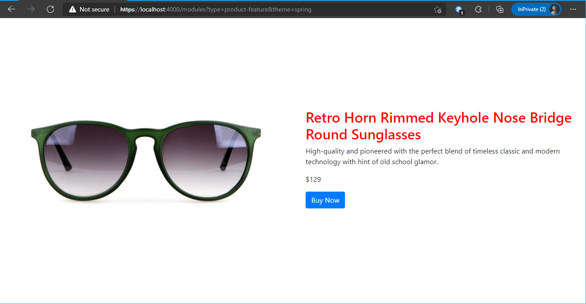


### 3. Clone a module library theme
In most cases custom themes will need to contain the SCSS for the set of module library modules.  If you create a theme as shown above you will need to copy all SCSS from the module library 'fabrikam' or 'default' theme to have them render appropriately.  A better approach is to start a new theme from a copy of one of the module library themes.  To do this the CLI **clone** command can be used. Use the below CLI command to clone the 'fabrikam' theme into a new theme named 'summer'.

```yarn msdyn365 clone fabrikam summer```

The clone command will create the new theme in the **src\modules\summer** directory and will need to be manually moved to the **src\themes** directory as shown below.  You can move the theme by dragging and dropping the folder inside of Visual Studio Code.

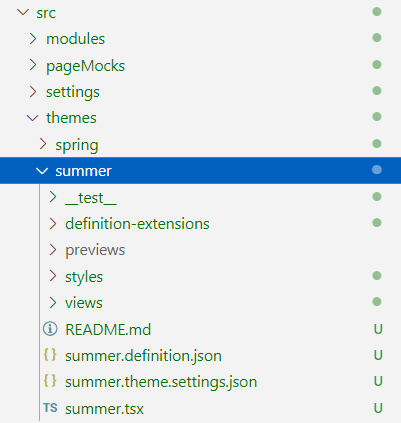

Open the new **summer** theme definition file and rename the theme "name" and "description" properties as shown below.

```json
{
	"$type": "themeModule",
	"friendlyName": "Summer",
	"name": "summer",
	"description": "This is the summer theme."
}
```

#### Build and view theme

The theme can now be built and tested in a web browser using the ```yarn start``` command.

Once the build has completed, you should see an output stating that the server has started. From within a local browser, you can view the module with the following URL **https://localhost:4000/modules?type=product-feature&theme=summer**

You should see a module rendered similar to below and notice how the module renders a little differently than we saw earlier with the spring theme and the red CSS added is no longer showing up since it's now using CSS from the new theme which doesn't have any CSS defined for the 'product-feature' module.

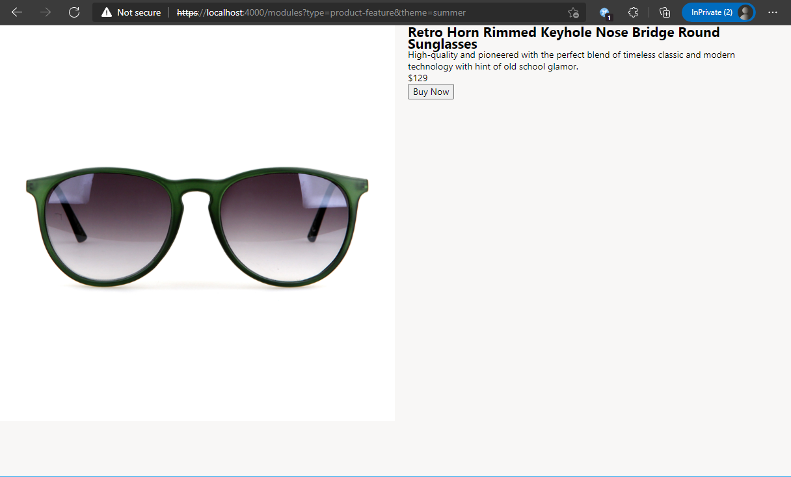


### 4. Module view extensions

Themes let you include customized module view extensions, which are generally used to change the default layout of a module for a selected theme. These customized module view extensions are supported for both module library modules and custom modules. For example, you might want to add a new button to a module library module to support additional features. By creating a view extension, you can avoid having to use the clone command-line interface (CLI) command to create a full copy of the module library module. 

View extensions are stored under the **src\themes\THEME_NAME\views** directory and follow a naming pattern that resembles the naming pattern for module views (MODULE_NAME.view.tsx). For example, a view extension might be named product-feature.view.tsx. If a view extension exists in the selected theme, the React component will call it instead of the default module view file. Therefore, view extensions can be written exactly like a module view that is used for a module.

Run the below command to create a new view extension for the **summer** theme.

```Console
yarn msdyn365 add-view-extension summer product-feature
```

 Once the command has run you will find a new **product-feature.view.tsx** file under the **src/themes/summer/views** directory.

Open this new file and we will change the order of the rendering of the price and product information with the following code change:

```typescript
/*!
 * Copyright (c) Microsoft Corporation.
 * All rights reserved. See LICENSE in the project root for license information.
 */

import * as React from 'react';
import { IProductFeatureViewProps } from '../../../modules/product-feature/./product-feature';
import { imageAlignment } from '../../../modules/product-feature/./product-feature.props.autogenerated';

const _renderImage = (productImageUrl: string, productName: string): JSX.Element => {
    return ;
};

const _renderInfo = (productName: string, productInfo: string, productPrice: string, buttonInfo: string): JSX.Element => {
    return (
        <div className='container'>
            <h2 className='product-feature-title'>{productName}</h2>
            <p>{productPrice}</p>
            <p>{productInfo}</p>
            <button type='button' className='btn btn-primary'>
                {buttonInfo}
            </button>
        </div>
    );
};

export default (props: IProductFeatureViewProps) => {
    const { productName, productInfo, productImageUrl, productPrice, buttonInfo, alignment } = props;

    let left;
    let right;

    if (alignment === imageAlignment.left) {
        left = _renderImage(productImageUrl, productName);
        right = _renderInfo(productName, productInfo, productPrice, buttonInfo);
    } else {
        right = _renderImage(productImageUrl, productName);
        left = _renderInfo(productName, productInfo, productPrice, buttonInfo);
    }

    return (
        <div className='row align-items-center'>
            <div className='col-sm-6'>{left}</div>
            <div className='col-sm-6'>{right}</div>
        </div>
    );
};
```

#### Build and view theme

The theme can now be built and tested in a web browser using the ```yarn start``` command.

Once the build has completed, you should see an output stating that the server has started. From within a local browser, you can view the module with the following URL **https://localhost:4000/modules?type=product-feature&theme=summer**

You should see a module rendered similar to below and notice how the module now renders the price above the product info.

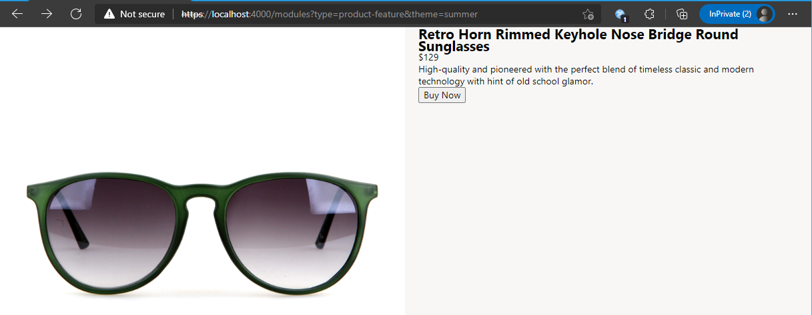

### 5. Module definition extensions

You might have scenarios where you want to extend the configs, slots, dataActions, or resources section of a module definition, and then access those sections from the module view extension. Although you can add new configurations, slots, and resources, you can't modify existing ones. However, by using a disableConfigProperties section, you can disable the inheritance of some configurations.

Definition extensions are stored under the theme's **definition-extensions** folder. They follow the naming pattern **MODULE_NAME.definition.ext.json**, where MODULE_NAME is the name of the module being extended.

To create a new definition extension, create a new file under the **/src/themes/summer/definition-extensions** folder that matches the module that you are extending. For our sample, we will add a file called **product-feature.definition.ext.json**. You may notice the fabrikam theme cloned for this sample already contains several module library definition extension files in this same directoy.

Copy the following JSON into the new file which will add a new **subTitle** configuration property to the product-feature custom module.  When a package is built and uploaded to a Commerce e-commerce instance, this new property will now show up with the original module configuration properties within the site builder tool. Notice the **$type** property must be set to **"definitionExtension"**.  

```json
{
    "$type": "definitionExtension",
    "config": {
        "subTitle": {
            "type": "string",
            "friendlyName": "Sub Title",
            "description": "Sub Title for additional information"
        }
    }
}
```
When the ```yarn start``` command is run, a new props file is automatically generated and appears in the definition-extensions directory. This file includes the merge of the parent module and the extended module, based on the properties and rules that are defined in the definition extension file.

#### Modify the view extension
Next we will modify the module view extension to take advantage of the new configuration property added above.  Copy the following typescript code into the **/src/themes/summer/view/product-featutre.view.tsx** file. Notice that the new autogenerated props file **product-feature.ext.props.autogenerated** is now imported near the top and the new **subTitle** config is now available to be used.

```typescript
/*!
 * Copyright (c) Microsoft Corporation.
 * All rights reserved. See LICENSE in the project root for license information.
 */

import * as React from 'react';
import { IProductFeatureViewProps } from '../../../modules/product-feature/./product-feature';
import { IProductFeatureProps } from '../definition-extensions/product-feature.ext.props.autogenerated';

const _renderImage = (productImageUrl: string, productName: string): JSX.Element => {
    return ;
};

const _renderInfo = (productName: string, productInfo: string, productPrice: string, buttonInfo: string, subTitle: string): JSX.Element => {
    return (
        <div className='container'>
            <h2 className='product-feature-title'>{productName}</h2>
            <p>{productPrice}</p>
            <p>{productInfo}</p>
            <p>{subTitle}</p>
            <button type='button' className='btn btn-primary'>
                {buttonInfo}
            </button>
        </div>
    );
};

export default (props: IProductFeatureViewProps & IProductFeatureProps<{}>) => {
    const { productName, productInfo, productImageUrl, productPrice, buttonInfo, alignment } = props;

    let left;
    let right;

    if (alignment === "left") {
        left = _renderImage(productImageUrl, productName);
        right = _renderInfo(productName, productInfo, productPrice, buttonInfo, props.config.subTitle ? props.config.subTitle : "");
    } else {
        right = _renderImage(productImageUrl, productName);
        left = _renderInfo(productName, productInfo, productPrice, buttonInfo,  props.config.subTitle ? props.config.subTitle : "");
    }

    return (
        <div className='row align-items-center'>
            <div className='col-sm-6'>{left}</div>
            <div className='col-sm-6'>{right}</div>
        </div>
    );
};
```

#### Add mock data for the new configuration property
We can now add mock data to our original module to include data for our new configuration property.

Copy the below mock data into the **/src/modules/product-feature/mocks/product-feature.json** file.

```json
{
  "id": "R1Module1",
  "config": {
    "imageAlignment": "left",
    "productTitle": "Retro Horn Rimmed Keyhole Nose Bridge Round Sunglasses",
    "productDetails": "High-quality and pioneered with the perfect blend of timeless classic and modern technology with hint of old school glamor.",
    "productImage": {
      "src": "https://bit.ly/33cMGxr",
      "altText": "Retro Horn Rimmed Keyhole Nose Bridge Round Sunglasses"
    },
    "buttonText": "Buy Now",
    "subTitle": "This is a product sub title"
  },
  "typeName": "product-feature"
}
```

#### Build and view theme

The theme can now be built and tested in a web browser using the ```yarn start``` command.

Once the build has completed, you should see an output stating that the server has started. From within a local browser, you can view the module with the following URL **https://localhost:4000/modules?type=product-feature&theme=summer**

You should see a module rendered similar to below and notice how the module now renders the sub title above the buy button.

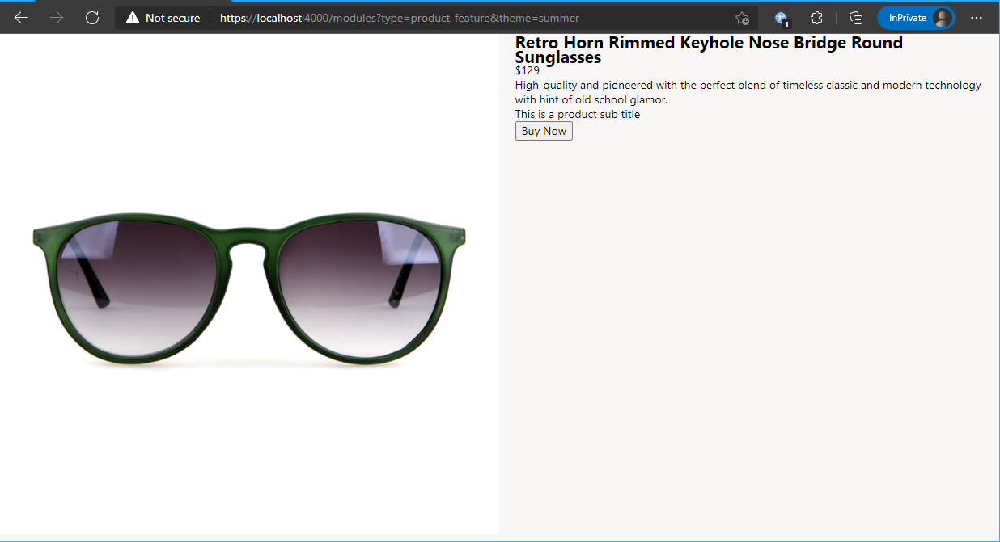

### 6. Configure different layouts with theme settings
Theme designers can specify various layouts for each module and can control specific layout options for images that the module renders. The layouts are specified in the THEME_NAME.theme.settings.json file located in the root of the theme folder.  For example, you should see a **src/themes/summer/summer.theme.settings.json** file.  You will find many of the module library module settings already defined in this file under the **modules** node.  

Add the following new entry to the JSON file under "modules" node which will add two new **module layouts** for the selected theme which can be configured within site builder.

```json
        "product-feature": {
            "properties": {
                "full-width": {
                    "friendlyName": "Hero",
                    "description": "Image on background with text overlay",
                    "type": "layout",
                    "properties": {
                        "productImage": {
                            "friendlyName": "Hero Image Settings",
                            "description": "Image settings for the hero",
                            "type": "imageSizes",
                            "properties": {
                                "xs": {
                                    "width": 800,
                                    "height": 600
                                },
                                "sm": {
                                    "width": 1200,
                                    "height": 900
                                },
                                "md": {
                                    "width": 1600,
                                    "height": 900
                                },
                                "lg": {
                                    "width": 1600,
                                    "height": 700
                                },
                                "xl": {
                                    "width": 1600,
                                    "height": 700
                                }
                            }
                        }
                    }
                },
                "left-right": {
                    "friendlyName": "Feature",
                    "description": "Image with text side by side",
                    "type": "layout",
                    "properties": {
                        "productImage": {
                            "friendlyName": "Feature Image Settings",
                            "description": "Feature Image Settings",
                            "type": "imageSizes",
                            "properties": {
                                "xs": {
                                    "width": 509,
                                    "height": 303
                                },
                                "sm": {
                                    "width": 762,
                                    "height": 471
                                },
                                "md": {
                                    "width": 1110,
                                    "height": 557
                                },
                                "lg": {
                                    "width": 935,
                                    "height": 471
                                },
                                "xl": {
                                    "width": 935,
                                    "height": 471
                                }
                            }
                        }
                    }
                }
            }
        },
```

The above  is an adaptation of the layouts used in the "content-block" module.  Once deployed the site builder will now add a new "Module layout" picker within the module's configuration panel as shown below.

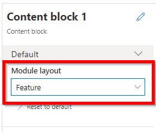

Images will now be rendered using the appropriate height and width for the selected layout per screen size.  The module must be deployed to test this using the site builder tool.


### 7. Override module library component

The Microsoft Dynamics 365 Commerce module library contains a set of TypeScript components that various module library modules use, and that can be overridden. These components consist of helper APIs that contain business logic and other logic to help render the HTML for the module HTML, handle events, and make server-side calls.

If you must change any logic in a component, you can use the command-line interface (CLI) **add-component-override** command to override the component for a selected theme. For example, if you want to change the logic for strikethrough pricing, you can override the **Price** component. Other changes, such as module view overrides, can also be used for visual changes. In rare cases, you might have to clone a module to make all the changes that you require.

Run the following command to get a list of components:

```
yarn msdyn365 add-component-override --list-components
```

Run the following command to override the **Price** library component. After this command is run, you should find a new TypeScript file under the theme's **\view\components** directory. You can then modify the file in that directory as you require.

```
yarn msdyn365 add-component-override summer Price
```

### 8. Style Presets

A style preset is a stored set of all authorable style values across a site theme. Style presets can be used to immediately change the look of a site from within site builder. Style presets let site builder authors quickly change, preview, and activate a set of style values across their site, without having to use CSS or deploy new themes. Font styles, button styles, and site colors are typical examples of style variables that can be managed through style presets.

The **summer** theme created earlier from a copy of the fabrikam theme contains a file **/src/themes/summer/styles/summer.definition.scss.json** file which defines the set of variables that will show up in the site builder tool as shown below.  These variables define the default value and the site builder user can create a custom style and change any of the values.  This is a great way for a zero code change that will change the CSS of the e-commerce site.  The following image shows the "Design" tab where style presets can be found with the ability to modify either "Global"" or "Module" level properties.

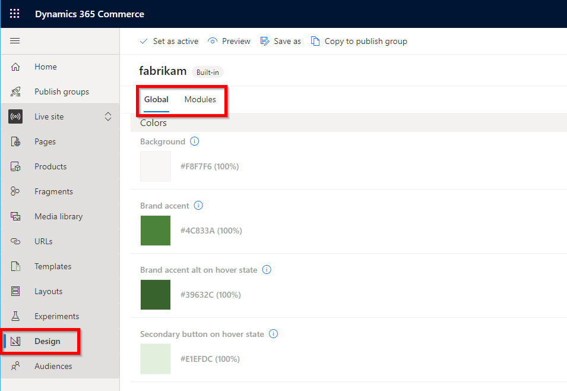

#### Add CSS className variable to the module view code
Earlier in this sample the product-feature custom module contains a classname **product-feature-title** defined in the **/src/modules/product-feature/product-feature.view.tsx** file as shown below.

```typescript
<h2 className='product-feature-title'>{productName}</h2>
```

Add a second class name **product-feature-title-text-color** as shown below:

```typescript
<h2 className='product-feature-title product-feature-title-text-color' >{productName}</h2>
```

#### Define the CSS classname
The fabrikam theme that the summer theme is based off of has a SCSS file per module located in themes **/styles/04-modules directory**.  Create a new file here to store variables for the **product-feature** custom module called **product-feature.scss** and add the following into the file:

```scss
//style presets
:root {
    --product-feature-font-color: #000000;
}

.product-feature-title-text-color {
    color: var(--product-feature-font-color);
}
```

To ensure the new SCSS file is loaded open the **/styles/04-modules/index.scss** file and insert the following import for the new file:

```scss
@import "product-feature";
```


#### Add a style preset for the new variable
Within the **/src/themes/summer/styles/summer.definition.scss.json** file, add the following module section for the classname into the **modules** node section:

```json
...
    "modules": {
        "product-feature":
        {
            "product-feature-font-color": {
                "friendlyName": "Product feature text",
                "description": "Product feature text color",
                "type": "string",
                "format": "color",
                "group": "Color"
            }
        },
...
```

Once this is built and deployed, the **product-feature** module will show up inside the style presets section of the site builder, and the user can customize as desired.  You will need to deploy and use site builder to see and set the new style properties.

### 9. Extend a theme from a base theme

You can create either themes that are standalone themes or themes that are extended from a base theme. For example, you can have a base theme that defines Cascading Style Sheets (CSS) styles for modules, module view extensions, and module definition extensions. You can then have a different theme, or even a set of themes, that adds changes on top of the base theme. This capability is helpful when a single Dynamics 365 environment has multiple online sites that use different theme branding.

#### Specify a base theme

To specify the base theme for a theme, edit the theme definition file, and add a $ref section that points to the base theme.

The **spring** custom theme created earlier is a base theme.
The **summer** theme created earlier is an extended theme. To specify the base theme for a theme, edit the theme definition file, and add a $ref section that points to the base theme.

In the following example, the **$ref** section references the **spring** sample base theme.The definition file for the extended theme **summer** can now reference the base theme by using a relative path, as shown here.

```json
{
	"$ref": "../spring/spring.definition.json",
	"$type": "themeModule",
	"friendlyName": "Summer",
	"name": "summer",
	"description": "This is the summer theme."
}
```

#### Include base theme styles

By default, base theme styles aren't included in the extended theme. To include the base theme styles, you can add a reference in the summer.theme.scss file, as shown here. This example also shows how to add other styles.

```scss
    @import "05-rtl/index";
    @import "../../spring/styles/spring.theme.scss";
```

The theme can now be built and tested in a web browser using the ```yarn start``` command.

Once the build has completed, you should see an output stating that the server has started. From within a local browser, you can view the module with the following URL **https://localhost:4000/modules?type=product-feature&theme=summer**

You should see a module rendered similar to below and notice how the module renders the  red CSS added in base theme for product title.

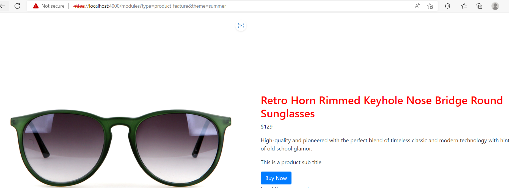

### 10. Theme specific resource overrides

You can change module library strings from within a theme in Microsoft Dynamics 365 Commerce, strings such as the text that is shown for the sign-in button, might be hardcoded as module resource strings.

To override the string, create a new directory under the \Msdyn365.Commerce.Online\src directory, and name it resources. Under that directory, create a subdirectory that is named modules. Then, add a new, empty global.json file to the modules directory (for example, ...\Msdyn365.Commerce.Online\src\resources\modules\global.json) as shown here.

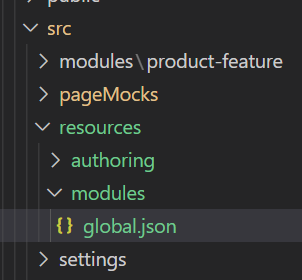

#### Override resource strings for preinstalled themes

To override resource strings for preinstalled themes (for example, fabrikam or starter themes), use @msdyn365-commerce-modules as the theme namespace . The following example shows how to change the add to cart button text for the fabrikam theme of PDP page.

```json
    "@msdyn365-commerce-modules.fabrikam.addToCartText": {
        "value": "Wallet",
        "_value.comment": "Add to cart"
    }
```
The theme can now be built and tested in a web browser using the ```yarn start``` command.

After the package has been built and deployed, the new string will override the default module library string. From within a local browser, you can view the **buybox** module with the following URL **https://localhost:4000/page?mock=default-page**

You should see a module rendered similar to below and notice how the buybox **Add To cart** button is overriden with **Wallet** string.

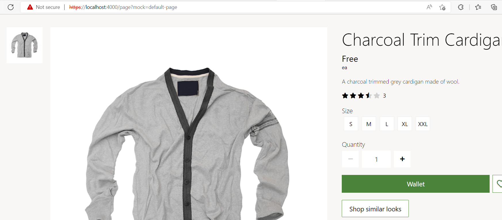
#### Override resource strings for custom or local themes

For custom or local themes, use __local__ as the theme namespace. The following example shows how to change the sign-in link text for a custom theme that is named **summer**.

```json
    "__local__.summer.addToCartText": {
        "value": "Local theme overriden resource",
        "_value.comment": "Local theme overriden resource Text"
    }
```

The theme can now be built and tested in a web browser using the ```yarn start``` command.

After the package has been built and deployed, the new string will override the default module library string. From within a local browser, you can view the **buybox** module with the following URL **https://localhost:4000/page?mock=local-theme-page&theme=summer**

You should see a module rendered similar to below and notice how the buybox **Add To cart** button is overriden with **Local theme overriden resource** string.


### 11. Module css optimization

Module CSS optimization helps in reducing the overall CSS bundle size on the page which helps in improving the page performance.

Current structure is all CSS is bundled up in a single *.theme.scss file inside a theme. SDK injects the theme css static file from cdn in every page, since the single *theme.scss file contains css from all modules, there is a lot of unused css on a page for modules that does not exists on the page.

To help improve the CSS performance and reduces the unused css on the page, customers can leverage this new feature which will help improve the page load experience.

With moduleCSSOptimization feature, we have added support for splitting CSS per module and dynamically inject the module CSS that exists on the page. This will help us on reducing a lot of unused CSS on a page that browser has to download.

#### Requirements:

    •  Webpack5 : This feature is only supported on Webpack5. To use this feature please, upgrade the partner app to use webpack5 using this CLI

```yarn msdyn365 upgrade-webpack```


#### How to turn on moduleCssOptimization feature:

ModuleCssOptimization is an opt in feature and can be enabled through **platform.settings.json** located in **src/settings**

```
{
    "enableModuleCssOptimization": true
}
```

#### How to optimize styles to leverage moduleCssOptimization feature:

For this feature, we will support splitting individual modules styles inside themes. Below steps will help you guide on how to configure styles for individual modules.

1. This sample contains a custom theme called "winter". This custom theme was created using the following CLI command which created a theme called spring in the **\src\themes directory**.

    ``` yarn msdyn365 add-theme winter ```

2. Each theme contains `styles` folder where we configure all the CSS

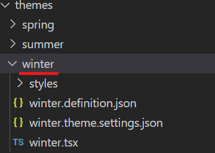

3. Inside styles, you can define all module specific styles in **styles/modules directory**.

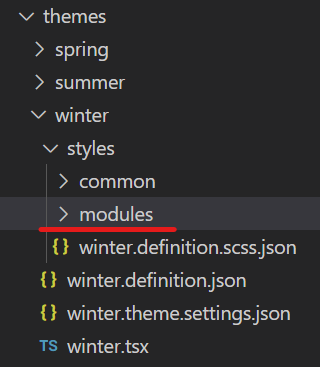

Note : For configuring `rtl` specific styles, you can add all rtl specific module styles in **styles/modules-rtl** directory

4. Modules folder will contain individual module CSS <moduleName>.scss files,
    Note: The <module name> should match the name property in module.definition.json

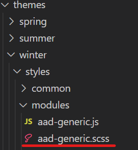

5. Each <moduleName>.scss should have its corresponding <moduleName>.js file.

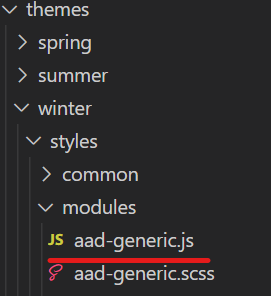

6. <moduleName>.scss file should contains all styles for related of that module

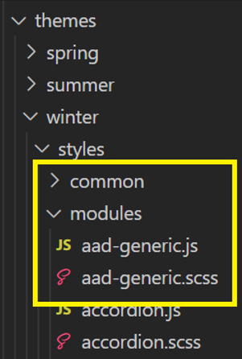


7. In <moduleName>.js file, you can import <moduleName>.scss


<moduleName>.js files are the entry files for creation of the module css chunks. So each <moduleName>.scss file should always have a <moduleName>.js files.

### Configuring assets in CSS:

Old structure:

Currently, all the assets are stored in root level public directory:


New structure:

All the needs to be stored in **public/msdyn365-assets**


• Assets should be imported from **public/msdyn365-assets** folder your styles

Example:

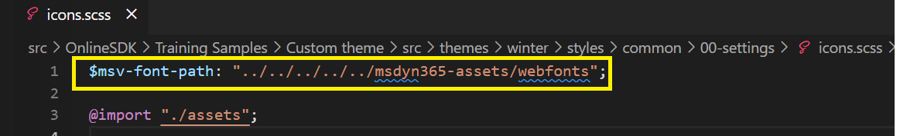

### How check for CSS compilation errors:

The customer can build the project in production mode using ```yarn build:prod``` command to see any css compilation error. Any CSS compilation errors are generated in **stats-client-build-errors.json** file at the root level

8. Build a page mock

You may need to test several modules running on the same page. Create a new mock file **optimized.json** under the **src/pageMocks** directory.

The page mock contains page theme information pointing to winter custom theme as shown below.

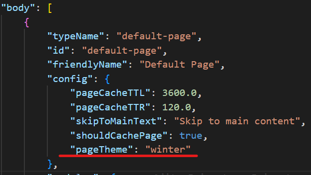

Once the build has completed, you should see an output stating that the server has started. From within a local browser, you can view the implementation with the following URL **https://localhost:4000/page?mock=optimized** and will render the page as below


9. Testing integration test cases

Once the build is completed and server has started running, the integration test cases for this sample can be tested in a browser by navigating to
**\\Custom theme\\** in a CLI and executing the following sample command.

`yarn testcafe chrome .\test\moduleCssOptimization-tests.ts -s .\`

### Best practices for configuring module css styles:

• Avoid Importing module-A styles into module-B styles as its an anti-pattern and it defeats the purpose of creating smaller css chunks. Rather, moduleA should only have styles related to moduleA and same for moduleB

• Any component styles that is used by one or more module, can be imported in <moduleName>.js

Example:

If header and footer module uses a common components styles by importing their index file,

header.js
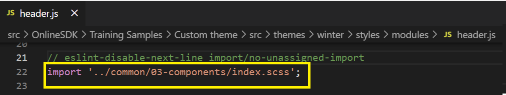

quick-view.js
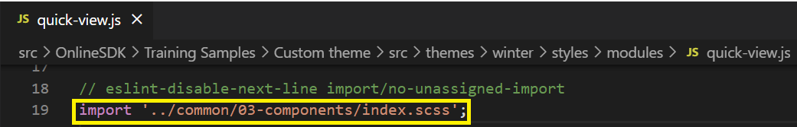

With this approach, SDK will create common css chunks which will be help in keep individual module css chunks small.

• Avoid importing index.scss file in the <moduleName>.scss, only import if all the styles imports from index.scss are used by your module.

