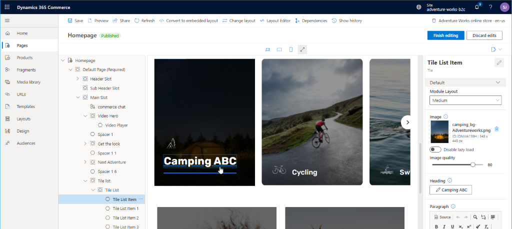
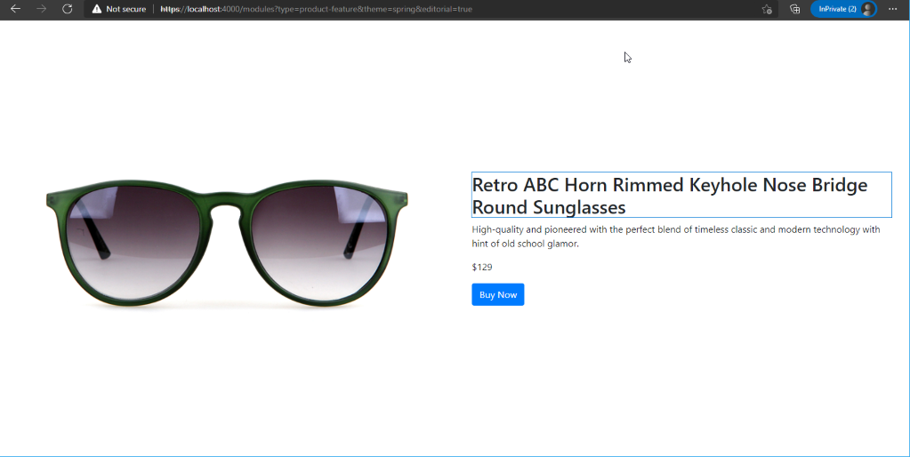

# Dynamics 365 Commerce - online SDK samples
## License
License is listed in the [LICENSE](./LICENSE) file.

# Sample - Interactive components

## Overview
This sample covers interactive components that let site authors edit fields for text, rich text, links, images, and videos directly in visual page builder, the what-you-see-is-what-you-get (WYSIWYG) preview canvas in Microsoft Dynamics 365 Commerce site builder.

In Commerce site builder, page or fragment authors can use interactive components to edit fields for text, rich text, links, images, and videos directly in visual page builder. Interactive components are released with the Commerce online software development kit (SDK) and include Msdyn365.Text for text, Msdyn365.RichTextComponent for rich text, Msdyn365.Links for links, Msdyn365.Image for images, and Msdyn365.Video for videos. After the interactive components are implemented, site builder will allow for inline editing of text, and it will open a picker window for links, images, and videos.

The below image shows a sample of a "tile list item" module text being edited directly on the preview canvas.




## Doc links
* [Interactive components overview](https://docs.microsoft.com/en-us/dynamics365/commerce/e-commerce-extensibility/interactive-components)

## Detailed Steps

### 1. Start with code from the "Custom module" sample

Create a copy of the code (or follow steps) from the sample into a new directory.

### 2. Add an interactive component change text handler in the module tsx file.

We will first add an event handler for the text changed event, which will also require importing the **@msdyn365-commerce/core** library as shown below.

```typescript
import * as Msdyn365 from '@msdyn365-commerce/core';
...
public handleTextChange = (event: Msdyn365.ContentEditableEvent) => (this.props.config.productTitle = event.target.value);
```

Copy the completed sample below into the **\src\modules\product-feature\product-feature.tsx file**.  Notice that the **handleTextChange** function has been added to the **ProductFeatureViewProps** and passed into our view file.

```typescript
import * as Msdyn365 from '@msdyn365-commerce/core';
import * as React from 'react';

import { IProductFeatureData } from './product-feature.data';
import { imageAlignment, IProductFeatureProps } from './product-feature.props.autogenerated';

export interface IProductFeatureViewProps extends IProductFeatureProps<IProductFeatureData> {
    productName: string;
    productInfo: string;
    productImageUrl: string;
    productPrice: string;
    buttonInfo: string;
    alignment: imageAlignment;
    productNameHandleTextChange: () => void;
}

/**
 *
 * ProductFeature component
 * @extends {React.PureComponent<IProductFeatureProps<IProductFeatureData>>}
 */
class ProductFeature extends React.PureComponent<IProductFeatureProps<IProductFeatureData>> {
    public handleTextChange = (event: Msdyn365.ContentEditableEvent) => (this.props.config.productTitle = event.target.value);

    public render(): JSX.Element | null {
        const { config } = this.props;

        // set default product info values
        const ProductName = config.productTitle ? config.productTitle : 'No product name defined';
        const ProductInfo = config.productDetails ? config.productDetails.toString() : 'No product details defined';
        const ProductImageUrl = config.productImage ? config.productImage.src : '';
        const ButtonInfo = config.buttonText ? config.buttonText : 'No button text defined';
        const ProductPrice = '$129';

        const ProductFeatureViewProps = {
            ...this.props,
            productName: ProductName,
            productInfo: ProductInfo,
            productImageUrl: ProductImageUrl,
            productPrice: ProductPrice,
            buttonInfo: ButtonInfo,
            alignment: config.imageAlignment,
            productNameHandleTextChange: this.handleTextChange
        };

        return this.props.renderView(ProductFeatureViewProps);
    }
}

export default ProductFeature;
```

### 3. Add interactive text component into the view 

The **Msdyn365.Text** component (shown below) is used to replace the **h2** tag that previously displayed the product name field.  Notice how it is still using the **productName** configuration property as the text value.

```typescript
<Msdyn365.Text
    tag={'h2'}
    text={productName}
    editProps={{ onEdit: productNameHandleTextChange, requestContext: requestContext }}
/>
```

Copy the completed sample below into the **\src\modules\product-feature\product-feature.view.tsx file**. Notice how the **productNameHandleTextChange** that is passed into the view is then passed into the **_renderInfo** helper method which is responsible for outputing the product information HTML and uses the **Msdyn365.Text** component.

```typescript
/*!
 * Copyright (c) Microsoft Corporation.
 * All rights reserved. See LICENSE in the project root for license information.
 */

import * as Msdyn365 from '@msdyn365-commerce/core';
import * as React from 'react';
import { IProductFeatureViewProps } from './product-feature';
import { imageAlignment } from './product-feature.props.autogenerated';

const _renderImage = (productImageUrl: string, productName: string): JSX.Element => {
    return ;
};

const _renderInfo = (
    productName: string,
    productInfo: string,
    productPrice: string,
    buttonInfo: string,
    productNameHandleTextChange: () => void,
    requestContext: Msdyn365.IRequestContext
): JSX.Element => {
    return (
        <div className='container'>
            <Msdyn365.Text
                tag={'h2'}
                text={productName}
                editProps={{ onEdit: productNameHandleTextChange, requestContext: requestContext }}
            />
            <p>{productInfo}</p>
            <p>{productPrice}</p>
            <button type='button' className='btn btn-primary'>
                {buttonInfo}
            </button>
        </div>
    );
};

export default (props: IProductFeatureViewProps) => {
    const { productName, productInfo, productImageUrl, productPrice, buttonInfo, alignment, productNameHandleTextChange } = props;

    let left;
    let right;

    if (alignment === imageAlignment.left) {
        left = _renderImage(productImageUrl, productName);
        right = _renderInfo(productName, productInfo, productPrice, buttonInfo, productNameHandleTextChange, props.context.request);
    } else {
        right = _renderImage(productImageUrl, productName);
        left = _renderInfo(productName, productInfo, productPrice, buttonInfo, productNameHandleTextChange, props.context.request);
    }

    return (
        <div className='row align-items-center'>
            <div className='col-sm-6'>{left}</div>
            <div className='col-sm-6'>{right}</div>
        </div>
    );
};
```

### 4. Enable interactive component testing on local dev environment

To ensure you can test interactive components on a local development environment, the feature must be enabled in the mock file using the new json **query** and **renderingContext** nodes shown below. 
```json
  "query": {
    "editorial": true
  },
  "renderingContext": {
    "features": {
        "authoring_inline_edit": true            
    }
  }
```

Copy the following completed mock file into the **product-feature/mocks/product-feature.json** file.

```json
{
  "id": "R1Module1",
  "config": {
    "imageAlignment": "left",
    "productTitle": "Retro Horn Rimmed Keyhole Nose Bridge Round Sunglasses",
    "productDetails": "High-quality and pioneered with the perfect blend of timeless classic and modern technology with hint of old school glamor.",
    "productImage": {
      "src": "https://bit.ly/33cMGxr",
      "altText": "Retro Horn Rimmed Keyhole Nose Bridge Round Sunglasses"
    },
    "buttonText": "Buy Now"
  },
  "typeName": "product-feature",
  "query": {
    "editorial": true
  },
  "renderingContext": {
    "features": {
        "authoring_inline_edit": true            
    }
  }
}
```

### 5. Build and test module
The module can now be built and tested in a web browser using the ```yarn start``` command.  The module can be tested as normally, however if you want to test the interactivity of the fields, set the **editorial=true** query string parameter to turn on editorial mode.

Once the build has completed, you can view the module in interactive mode using the following URL **https://localhost:4000/modules?type=product-feature&theme=spring&editorial=true**.



Notice in the image above that the product title is now editable on the page.  This will only be editable when the query string paramater **editorial=true** is set, or the module is rendered in site builder during edit mode.  Rendering of the module on the e-commerce site will not show the edit mode.

