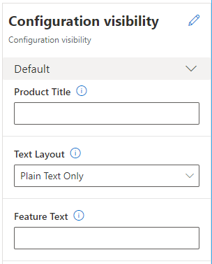

# Dynamics 365 Commerce - online SDK samples
## License
License is listed in the [LICENSE](./LICENSE) file.

# Sample - Module config visibility

## Overview
This sample explains how to configure module properties so that they are shown or hidden based on the contextual values of other configuration properties.

Multiple module configuration properties can be defined in a module's definition file. However, there might be scenarios where the relevance of some property fields depends on the values that are set for other property fields of the module. Property fields that aren't relevant should be hidden to minimize the number of fields that are shown to a page editor who is configuring the module. This behavior helps reduce complexity and the possibility of confusion.

A module can use a conditional schema to define the rules that the module properties pane in Commerce site builder should follow to show or hide property fields based on the values of other property fields. For example, a module has a layout property that allows for two layouts, one of which has plain text, and the other of which has rich text and an image. In this case, the module designer might want to ensure that only property fields that are appropriate to the context (that is, the layout) are shown in site builder when a page editor configures the module.

The ability to show or hide property fields based on context is supported in module definition and module definition extension files that use the **dependentSchemas** property for conditional schemas. Two types of conditional schema are supported: schema dependencies and property dependencies.

## Doc links
* [Configure module properties to be shown based on context](https://docs.microsoft.com/en-us/dynamics365/commerce/e-commerce-extensibility/configure-properties-context)

## Detailed Steps

### 1. Use CLI command to create a new module

Use the CLI command: ```yarn msdyn365 add-module config-visibility``` to create a module called **config-visibility**. The new module will be created under the **\src\modules** directory.


### 2. Add configuration properties to the module definition file.

Copy the following json to the **config-visibility.definition.json** file.

```json
{
    "$type": "contentModule",
    "friendlyName": "Configuration visibility",
    "name": "config-visibility",
    "description": "Configuration visibility test module",
    "categories": ["config-visibility"],
    "tags": [""],
    "dataActions": {        
    },    
    "config": {
        "productTitle": {
            "friendlyName": "Product Title",
            "description": "Product title.",
            "type": "string"
        },
        "layout": {
            "friendlyName": "Text Layout",
            "description": "Sets the desired text output to be plain text or rich text with images.",
            "type": "string",
            "enum": {
                "plainTextOnly": "Plain Text Only",
                "richTextOnly": "Rich Text Only",
                "richTextWithImage": "Rich Text With Image"
            },
            "default": "plainTextOnly",
            "override": true
        }
    },
    "dependentSchemas": {
        "productTitle": {
            "properties": {
                "subTitle" : {
                    "type": "string",
                    "friendlyName": "Product Sub Title",
                    "description":  "Product sub title."
                }
            },
            "required": ["productTitle"]
        },
        "layout": {
            "oneOf": [
                {
                    "properties": {
                        "layout": {
                            "enum" : {
                                "plainTextOnly": "plainTextOnly"
                            }
                        },
                        "featureText" : {
                            "type": "string",
                            "friendlyName": "Feature Text",
                            "description":  "Main text title to show in module.",
                        }
                    }
                },
                {
                    "properties": {
                        "layout": {
                            "enum" : {
                                "richTextOnly": "richTextOnly"
                            }
                        },
                        "featureRichText" : {
                            "type": "richText",
                            "friendlyName": "Feature Text",
                            "description":  "Main rich text to show in module.",
                        }
                    }
                },
                {
                    "properties": {
                        "layout": {
                            "enum" : {
                                "richTextWithImage": "richTextWithImage"
                            }
                        },
                        "featureRichText" : {
                            "type": "richText",
                            "friendlyName": "Feature Text",
                            "description":  "Main rich text to show in module."
                        },
                        "featureImage" : {
                            "type": "image",
                            "friendlyName": "Feature Title",
                            "description":  "Image to show in module."
                        },
                        "imageAlignment": {
                            "friendlyName": "Image Alignment",
                            "description": "Sets the desired alignment of the image, either left or right on the text.",
                            "type": "string",
                            "enum": {
                                "left": "Left",
                                "right": "Right"
                            },
                            "default": "left"
                        }
                    }
                }
            ]
          
        }
    }
}
```
### 3. Build and test module
The module can now be built and tested in a web browser using the ```yarn start``` command, however there is currently no way to test module configuration visibility fields until the module is deployed and then can be tested with the Commerce site builder tool.  To build a package to deploy use the ```yarn msdyn365 pack``` command.  For more information on deploying the package see the [Package configurations and deploy them to an online environment](https://docs.microsoft.com/en-us/dynamics365/commerce/e-commerce-extensibility/package-deploy) topic.


The below image shows how the module looks when added to a test page within site builder. Notice with the "Product Title" field empty the "Product Sub Title" does not appear.



Notice in the below image, once a "Product Title" has been added the new "Product Sub Title" field becomes visible.  Also notice with the **Text Layout** change to "Rich Text Only", the rich text configuration property below it is displayed instead of the text only field.

