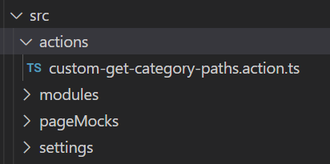
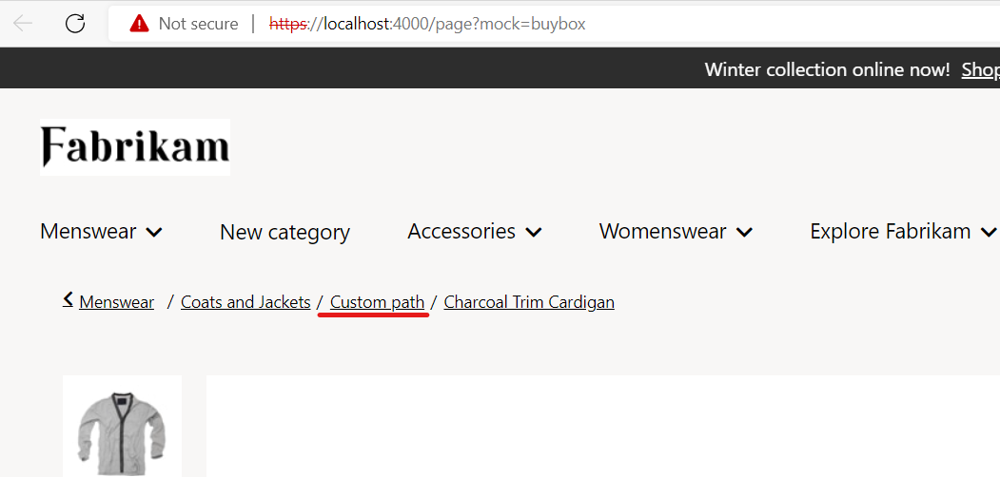

# Dynamics 365 Commerce - online training samples

## License

License is listed in the [LICENSE](./LICENSE) file.

# Sample - Data action overrides

## Overview

This sample will showcase how you can override module library preexisting data actions with your own custom data action to alter the business logic without cloning the whole out of the box module library module. Overriding a data action will cause all previous uses of the data action, either through import or inclusion in the module definition.json file, to use your new data action.

## Starter kit license

License for starter kit is listed in the [LICENSE](./module-library/LICENSE) .

## Prerequisites

Follow the instructions mentioned in [document](https://docs.microsoft.com/en-us/dynamics365/commerce/e-commerce-extensibility/setup-dev-environment) to set up the development environment.

## Detailed Steps

### 1. Data action ID naming convention

Each data action has a data action ID that's used when the createObservableDataAction method is called through the "id" property. The data action ID should follow the naming convention of [package name]/[module name]/[action name], as in the following example.

```typescript
    export const getCategoryPathsActionDataAction = createObservableDataAction({
        id: '@msdyn365-commerce-modules/retail-actions/get-category-paths',
        action: <IAction<ICategoryUrl[]>>getCategoryPathsAction,
        input: createGetCategoryPathsInput
    });
```

### 2. Override data action

In this sample we will use module library's preexisting 'get-category-paths' data action. To override the get-category-paths data action, you need to create a new data action that uses the get-category-paths ID in the /src/actions directory.

The following command creates a new data action in the \src\actions directory.

`yarn msdyn365 add-data-action custom-get-category-paths`



Next, you replace the default template code with your code. In the example below, the data action ID is the same as used in the ...\Msdyn365.Commerce.Online\node_modules@msdyn365-commerce-modules\retail-actions\dist\lib\get-category-paths.js data action @msdyn365-commerce-modules/retail-actions/get-category-paths.

Below code is customized to add default category on PDP page breadcrumb.

```typescript
export async function getCategoryPathsAction(input: GetCategoryPathsInput, ctx: IActionContext): Promise<ICategoryUrl[]> {
    const categoryPathResults = await getCategoryPathsAsync(
        {
            callerContext: ctx,
            queryResultSettings: QueryResultSettingsProxy.getPagingFromInputDataOrDefaultValue(ctx)
        },
        input.ChannelId,
        input.CatalogId,
        input.categoryPathLooksups
    );
    const categoryPath = categoryPathResults[0].CategoryPath && categoryPathResults[0].CategoryPath[0];
    const categoryUrl = getCategoriesUrlSync(<ICategoryPath>categoryPath, ctx);
    if (categoryUrl) {
        const defaultCategory: ICategoryUrl = { Name: 'Custom path', Url: '/home' };
        categoryUrl.push(defaultCategory);
        /* Do not return the root category of the product*/
        return categoryUrl.slice(1);
    }
    return [];
}
```

### Build and test module

The sample can now be tested in a web browser using the `yarn start` command.

### Test by using mock file

Create a sample mock with name buybox.json under the **src/pageMocks**. Use the sample buybox page mock located in src/PageMocks folder.
Go to browser and copy paste the URL https://localhost:4000/page?mock=buybox , the default category will render n breadcrumb.

