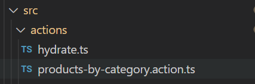
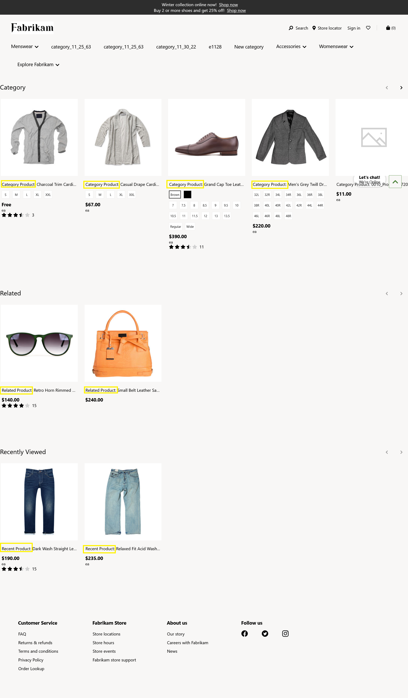

# Dynamics 365 Commerce - online training samples

## License

License is listed in the [LICENSE](./LICENSE) file.

# Sample - Override SDK hydrated data actions

## Overview

This sample will showcase how you can override SDK data actions. These data actions will be used in product collection module to get products like recommended, recently viewed, category, etc.

## Starter kit license

License for starter kit is listed in the [LICENSE](./module-library/LICENSE).

## Prerequisites

Follow the instructions mentioned in this [document](https://docs.microsoft.com/en-us/dynamics365/commerce/e-commerce-extensibility/setup-dev-environment) to set up the development environment.

## Detailed Steps

### 1. Data action ID naming convention

Each data action has a data action ID that's used when the createObservableDataAction method is called through the "id" property. The data action ID should follow the naming convention of [package name]/[action name], as in the following example.

```typescript
    export const getProductsByRelationshipIdListAction = createObservableDataAction({
    action: <IAction<ProductSearchResult[]>>getProductsByRelationshipIdList,
    id: '@msdyn365-commerce/products-by-relationship-id'
});
```

### 2. Override data actions

In this sample we will see how to override the'products-by-category.action.ts' data action. To override the products-by-category data action, you need to create a new data action that uses the same ID mentioned in **products-by-category.action.ts**.

The following command creates a new data action in the **\src\actions** directory.

`yarn msdyn365 add-data-action products-by-category`



In the below code snippet, we will see how to override “products-by-category.action.ts” and update product names by prefixing the name with the “Category Product:” text.

```typescript
/*!
 * Copyright (c) Microsoft Corporation.
 * All rights reserved. See LICENSE in the project root for license information.
 */

import { createObservableDataAction } from '@msdyn365-commerce/action-internal';
import { IAction, IActionContext, ICommerceApiSettings } from '@msdyn365-commerce/core-internal';
// import { IActionInput, CacheType } from '@msdyn365-commerce/retail-proxy';
import { searchByCriteriaAsync } from '@msdyn365-commerce/retail-proxy/dist/DataActions/ProductsDataActions.g';
import { ProductSearchCriteria, ProductSearchResult, SimpleProduct } from '@msdyn365-commerce/retail-proxy/dist/Entities/CommerceTypes.g';
import { generateImageUrl } from '@msdyn365-commerce-modules/retail-actions';
import { ProductListInput } from '../actions/hydrate';
/**
 *
 */

export const getProductsByCategoryList = async (input: ProductListInput, context: IActionContext): Promise<ProductSearchResult[]> => {
    let categoryId: number;
    const urlTokens = context.requestContext.urlTokens;

    // If the category ID has been provided from the list metadata use it, otherwise grab the category ID from context
    if (input.listMetadata.categoryIds && input.listMetadata.categoryIds.length > 0) {
        categoryId = input.listMetadata.categoryIds[0];
    } else if (urlTokens && urlTokens.pageType && urlTokens.pageType.toLowerCase() === 'category' && urlTokens.recordId) {
        categoryId = +urlTokens.recordId;
    } else if (urlTokens && urlTokens.categories && urlTokens.categories.length > 0) {
        categoryId = +urlTokens.categories[0];
    } else {
        // Unable to determine category from list meta data or context
        throw new Error('CategoryId Missing for ProductsByCategory List');
    }
    context.telemetry.debug(`Category Id input to ProductsByCategory action : ${categoryId}`);
    const productSearchCriteria: ProductSearchCriteria = {
        Context: {
            ChannelId: +input.channelId,
            CatalogId: +input.catalogId
        },
        CategoryIds: [categoryId],
        SkipVariantExpansion: true,
        IncludeAttributes: true
    };

    return searchByCriteriaAsync(
        { callerContext: context, queryResultSettings: { Paging: { Top: input.listMetadata.pageSize || 10 } } },
        productSearchCriteria
    )
        .then((products: ProductSearchResult[]) => {
            context.telemetry.debug('Products returned by ProductByCategory action', products);
            products.map(pro => {
                pro.Name = `Category Product: ${pro.Name}`;
            });
            return getProductImageUrls(products, context.requestContext.apiSettings);
        })
        .catch(error => {
            context.telemetry.error(`Error running ProductByCategory action: ${error}`);
            throw new Error(error);
        });
};

export const getProductImageUrls = (
    products: SimpleProduct[] | ProductSearchResult[],
    apiSettings: ICommerceApiSettings
): SimpleProduct[] | ProductSearchResult[] => {
    const productsWithImageUrls: SimpleProduct[] | ProductSearchResult[] = [];

    products &&
        // eslint-disable-next-line @typescript-eslint/no-explicit-any
        products.forEach((product: any) => {
            if (product && product.RecordId) {
                product.PrimaryImageUrl = generateImageUrl(product.PrimaryImageUrl, apiSettings);
                productsWithImageUrls.push(product);
            }
        });

    return productsWithImageUrls;
};

export const getProductsByCategoryListAction = createObservableDataAction({
    action: <IAction<ProductSearchResult[]>>getProductsByCategoryList,
    id: '@msdyn365-commerce/products-by-category'
});

```

Run the below commands to override other SDK data actions.

`yarn msdyn365 add-data-action products-by-recentlyviewed`

`yarn msdyn365 add-data-action products-by-recommendation`

`yarn msdyn365 add-data-action products-by-relationship-id`

`yarn msdyn365 add-data-action products-by-search`

### Build and test module

The sample can now be tested in a web browser using the `yarn start` command.

### Test by using mock file

Create a mock file with the name **override-hydrator-actions.json** under the **src/pageMocks** directory. Then use a browser and navigate to https://localhost:4000/page?mock=override-hydrator-actions. The page should display the product collections with modified product names.



### 9. Test Integration test case

Integration test case for sample can be tested in browser using below steps.

-   Set path to "Overriding SDK hydrator action" sample level in command propmt and run `yarn testcafe chrome .\test\override-hydrator-actions.test -s .\` command.

-   Ensure that testcafe is added globally to run test case.

## Third party Image and Video Usage restrictions

The software may include third party images and videos that are for personal use only and may not be copied except as provided by Microsoft within the demo websites. You may install and use an unlimited number of copies of the demo websites., You may not publish, rent, lease, lend, or redistribute any images or videos without authorization from the rights holder, except and only to the extent that the applicable copyright law expressly permits doing so.
