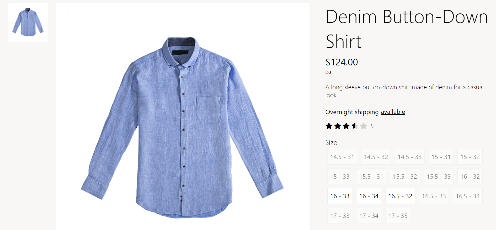
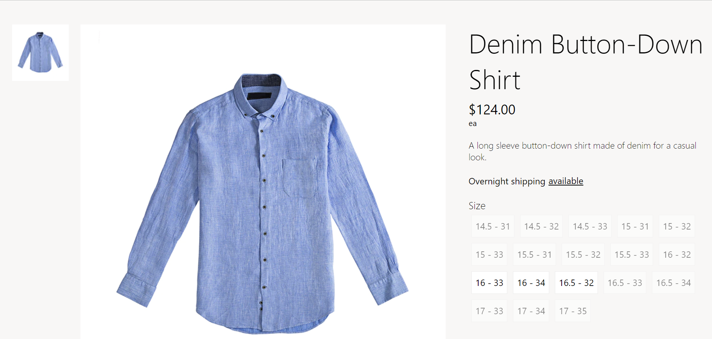
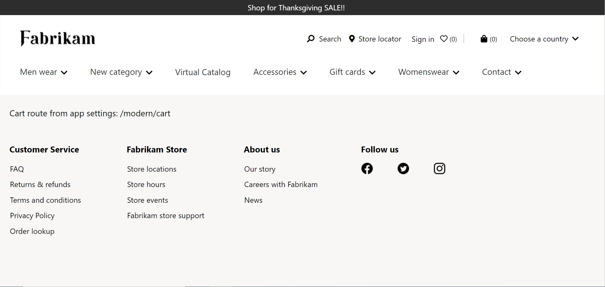

# Dynamics 365 Commerce - online SDK samples

## License

License is listed in the [LICENSE](./LICENSE) file.

# Sample - App Settings

## Overview

In this sample, you will learn how to configure application settings and routes to enable
a variety of Dynamics 365 Commerce SDK features.

## Doc links

-   [App settings](https://learn.microsoft.com/en-us/dynamics365/commerce/e-commerce-extensibility/app-settings)

## Detailed Steps

## 1. Configuring app settings

We can find the application settings file in **\\SampleAppSettings\src\settings\app.settings.json**. This **json** file contains a **"config"** property where we can add or remove settings. In this sample, we will add the **"hideRating"** setting which hides user ratings for products when enabled.

```json
{
    "config": {
        "hideRating": {
            "friendlyName": "Hide rating",
            "description": "This settings hides the rating for products across the site",
            "type": "boolean",
            "default": false,
            "group": "Ratings and reviews"
        }
    }
}
```

## 2. Creating page mocks

For this step, we'll need to create page mocks to view the changes that occur when **hideRating** is set to **true** and when it is set to **false**. We will create the first page mock **hide-rating-false.json** in **\\SampleAppSettings\src\pageMocks\\** and add the following code.

```json
{
    "appContext": {
        "config": {
            "hideRating": false
        }
    }
}
```

Similarly, in the same directory, we will create another file called **hide-rating-true.json** and add the code below.

```json
{
    "appContext": {
        "config": {
            "hideRating": true
        }
    }
}
```

## 3. Viewing the changes in a browser

We can now view the differences in the page mocks by starting the Node server. To do so, navigate to **\\SampleAppSettings\\** in a CLI and run the following CLI command.

`yarn start`

Once the Node server is running, open the following URLs in a browser.

https://localhost:4000/page?mock=hide-rating-false

https://localhost:4000/page?mock=hide-rating-true

The product rating should appear as seen in the screenshot below when **hideRating** is set to **false**.



Likewise, when **hideRating** is set to **true**, the product rating should no longer appear on the page similar to the following screenshot.



## 4. Adding routes

Routes are used to add navigation to other pages through the use of buttons, links, and images. Similarly to app settings, routes can also be configured in **\\SampleAppSettings\src\settings\app.settings.json**.

In this routes sample, we will add a cart route to **app.settings.json** with the following code.

```json
    "routes": {
        "cart": {
            "friendlyName": "Cart Page Route",
            "description": "Cart Page Route"
        }
    }
```

## 5. Creating a page mock for the route

Next, we will create a sample page mock called **cart-route.json** in **\\SampleAppSettings\src\pageMocks\\** which contains the following code.

```json
{
    "appContext": {
        "routes": {
            "cart": { "destinationUrl": "/modern/cart", "type": "internalLink" }
        }
    }
}
```

## 6. Creating a module for the route

We will now create a new module that will consume the routes API that we have previously added. In a CLI, navigate to the **\\src\modules\\** directory and use the following command to create a new module called **"read-app-settings"**.

`yarn msdyn365 add-module read-app-settings`

The CLI command will generate a file called **read-app-settings.view.tsx** in **\\SampleAppSettings\src\modules\read-app-settings\\** which we will replace with the following code.

```typescript
/*!
 * Copyright (c) Microsoft Corporation.
 * All rights reserved. See LICENSE in the project root for license information.
 */

import * as React from 'react';
import { IReadAppSettingsViewProps } from './read-app-settings';

export default (props: IReadAppSettingsViewProps) => {
    // Displays the cart route as plain text from the app settings.
    return (
        <div className='row'>
            <div className='row'>Cart route from app settings: {props.context.app.routes.cart.destinationUrl}</div>
        </div>
    );
};
```

## 7. Viewing the route in a browser

We can view the route referenced in the **read-app-settings** module by running the Node server and navigating to the page mock in a browser.

In a CLI, navigate to **\\SampleAppSettings\\** and execute the following command.

`yarn start`

Once the Node server is running, navigate to the following URL.

https://localhost:4000/page?mock=cart-route

The cart route should be shown on the page similar to the following screenshot.



## 7. Testing integration test cases

The integration test cases for this sample can be tested in a browser by navigating to
**\\SampleAppSettings\\** in a CLI and executing the following sample command.

`yarn testcafe chrome .\test\hide-rating-true.test.ts -s .\`

## 8. Third party image and video usage restrictions

The software may include third party images and videos that are for personal use only and may not be copied except as provided by Microsoft within the demo websites. You may install and use an unlimited number of copies of the demo websites., You may not publish, rent, lease, lend, or redistribute any images or videos without authorization from the rights holder, except and only to the extent that the applicable copyright law expressly permits doing so.
