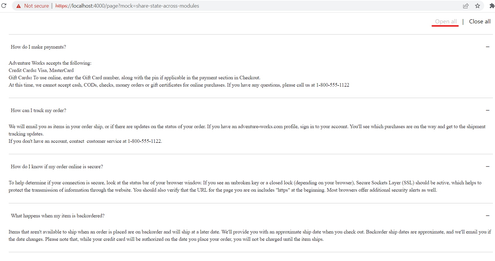
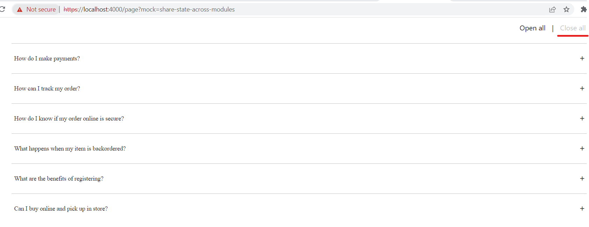

# Dynamics 365 Commerce - online training samples

## License

License is listed in the [LICENSE](./LICENSE) file.

# Sample - Sharing state across modules

## Overview

This sample covers on how to share state across multiple modules by using data actions in Dynamics 365 Commerce

## Doc links

-   [Share state across modules](https://learn.microsoft.com/en-us/dynamics365/commerce/e-commerce-extensibility/share-state-across-modules)

## Starter kit license

License for starter kit is listed in the [LICENSE](./module-library/LICENSE) .

## Prerequisites

Follow the instructions mentioned in [document](https://docs.microsoft.com/en-us/dynamics365/commerce/e-commerce-extensibility/setup-dev-environment) to set up the development environment.

### Procedure to sharing state across modules

## Detailed Steps

### 1. Modules which would share state.

In this sample, two modules share basic interaction. One module (accordian) has openAll and closeAll buttons, and the other module (accordian-item) expands all or collapses all items depending on the button that was clicked.

### 2. To add data action.

Add data action file **accordion-state.ts** under (src/actions/accordion-state), that returns accordion expanded state.

```typescript
// accordian-state.ts
import { createObservableDataAction, IAction, IActionInput } from '@msdyn365-commerce/core';
import { GenericInput, getGenericAction } from '@msdyn365-commerce-modules/retail-actions';

export interface IAccordionExpandedState {
    isAllExpanded?: boolean;
}

export function createAccordionStateInput(result: IAccordionExpandedState): GenericInput<IAccordionExpandedState> {
    return new GenericInput<IAccordionExpandedState>('accordionExpandedState', result, 'IAccordionExpandedState');
}

const createAccordionStateInputInternal = (): IActionInput => {
    return createAccordionStateInput({});
};

export const getGenericActionDataAction = createObservableDataAction({
    action: <IAction<IAccordionExpandedState>>getGenericAction,
    input: createAccordionStateInputInternal
});

export default getGenericActionDataAction;
```

 ### 3. Registering accordion-state in accordion module.

Add reference to accordian state in accordian module's data action in its definition file (**src\modules\accordion\accordion.definition.json**).

```json
  "dataActions": {
        "accordionExpandedState": {
            "path": "../../actions/accordion-state/accordion-state",
            "runOn": "server"
        }
```
### 4. Registering accordion-state in accordion-item module

Add reference to accordian state in accordian-item module's data action in its definition file (**src\modules\accordion-item\accordion-item.definition.json**).

```json
    "dataActions": {
        "accordionExpandedState": {
            "path": "../../actions/accordion-state/accordion-state",
            "runOn": "server"
        }
```
### 5. Updating accordion-state.

Update accordion-state on open all and close all button clicks in **accordian.tsx** file.

```typescript
    private _onExpandAll(): void {
        const accordionState = { isAllExpanded: true };
        this.props.context.actionContext.update(createAccordionStateInput(accordionState), accordionState);
        if (accordionState.isAllExpanded) {
            this.setState({
                isDisabled: true
            });
            setTimeout(() => {
                this.collapseAllButtonRef.current?.focus();
            }, 50);
        }
    }

    private _onCollapseAll(): void {
        const accordionState = { isAllExpanded: false };
        this.props.context.actionContext.update(createAccordionStateInput(accordionState), accordionState);
        if (!accordionState.isAllExpanded) {
            this.setState({
                isDisabled: false
            });
            setTimeout(() => {
                this.expandAllButtonRef.current?.focus();
            }, 50);
        }
    }

```


 ### 6. Observing accordion-state change and performing action

    In accordian-item.tsx file observe the accordion-state change and perform action depending on state value.

```typescript
        const expanded =
            accordionExpandedStateResult && accordionExpandedStateResult.isAllExpanded === undefined
                ? data && config.isExpandedOnInitialLoad
                : accordionExpandedStateResult && accordionExpandedStateResult.isAllExpanded;
```

### 7. Build and test module

The sample can now be tested in a web browser using the `yarn start` command.

### 8. Test by using mock file

Create a sample mock with name share-state-across-modules.json under the **src/pageMocks**. Use the sample share-state-across-modules mock located in src/PageMocks folder.
Go to browser and copy paste the URL http://localhost:4000/page?mock=share-state-across-modules

Once Click OpenAll/CloseAll button, handler makes a call to the **actionContext.update()**. This method lets you directly change the application state. When the state is changed, MobX takes over and re-renders all the modules that are observing the state, due to that state, expand/collapse all items in accordian-item module, as shown below.




### 9. Test Integration test case

Integration test case for sample can be tested in browser using below steps

-   Set path to "Sharing state across modules" sample level in command propmt and run `yarn testcafe chrome .\test\share-state-across-modules-tests.ts -s .\` command.

-   ensure that testcafe is added globally to run test case.

## Third party Image and Video Usage restrictions

The software may include third party images and videos that are for personal use only and may not be copied except as provided by Microsoft within the demo websites. You may install and use an unlimited number of copies of the demo websites., You may not publish, rent, lease, lend, or redistribute any images or videos without authorization from the rights holder, except and only to the extent that the applicable copyright law expressly permits doing so.
