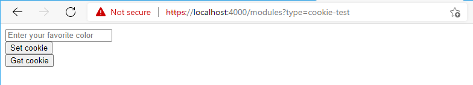

# Dynamics 365 Commerce - online SDK samples
## License
License is listed in the [LICENSE](./LICENSE) file.

# Sample - Using cookies within a module

## Overview
This sample provides sample usage of the Dynamics 365 Commerce online SDK APIs available to get and set client side cookies.  Cookie APIs leverage the module library [cookie consent module](https://docs.microsoft.com/en-us/dynamics365/commerce/cookie-consent-module), which provides the user with the ability to consent to browser cookies.  This sample will show how to check if consent is given and how to set and get a cookie.

**Note:** Since the D365 commerce is an isomorphic application, cookie can be set the same way on client and server.

## Doc links
* [Cookie API overview](https://docs.microsoft.com/en-us/dynamics365/commerce/e-commerce-extensibility/cookie-api-overview)

## Detailed Steps

### 1. Create a new module
Use the CLI command ```yarn msdyn365 add-module cookie-test``` to create a new module called **cookie-test**. The new module will be created under the **\src\modules** directory.

### 2. Add cookie API calls to module view file
Replace the module view file **cookie-test.view.tsx** with the below typescript code.  The code contains an example usage of calling to see if the cookie consent has been given. 

```typescript
import * as React from 'react';
import { useState } from 'react';

import { ICookieTestViewProps } from './cookie-test';

export default (props: ICookieTestViewProps) => {
    const [favColor, setfavColor] = useState(" ");

    function setCookieValue() {
        // set a cookie representing the users favorite color but only is consent is given
        if (props.context.request.cookies.isConsentGiven()) {
            props.context.request.cookies.set<string>('favoriteColor', favColor);
        }
        alert(`set cookie to ${favColor}`);
    }

    function getCookieValue() {
        // get the value of the users favorite cookie
        const favColor = props.context.request.cookies.get<string>('favoriteColor');
        alert(`favColor = ${favColor.value}`);
    }

    return (
        <div className='row'>
            <input type='text' onChange={(event) => setfavColor(event.target.value)} placeholder='Enter your favorite color'/>
            <br></br>
            <button onClick={setCookieValue}>Set cookie</button>
            <br></br>
            <button onClick={getCookieValue}>Get cookie</button>
        </div>
    );
};
```

### 3. Build and test the module

We can now build and test the module by running ```yarn start```.  Once the Node server is ready load the following module page URL **https://localhost:4000/modules?type=cookie-test** and you should get a similar screen as in the below screen shot.



Try adding a color such as "green" followed by pressing the "Set cookie" button.  Try the "Get cookie" button to ensure the same value comes back.  If you exit the Node server (CTRL-C) and restart, if you select "Get cookie" you should get the last value you saved.